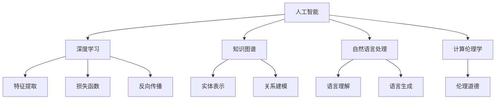

                 

# 推动知识发现与创新：人类计算的智力贡献

## 1. 背景介绍

在当今信息技术飞速发展的时代，计算和存储技术的进步，极大地推动了知识发现与创新的速度和广度。人工智能和大数据技术的兴起，进一步为人类社会的智能发展和知识创新开辟了新的道路。但在此过程中，人类的智力贡献仍然不可或缺。从算法的创建，到模型的训练，再到结果的解释，每一步都凝聚着人类的智慧和努力。本文将从人工智能的核心理论、实际应用案例以及面临的挑战三个方面，探讨人类在计算中扮演的重要角色。

## 2. 核心概念与联系

### 2.1 核心概念概述

本文将介绍几个核心概念及其相互关系：

- 人工智能(AI)：指通过计算机系统模拟和扩展人类的智能能力，包括但不限于感知、学习、推理、决策等。
- 深度学习(Deep Learning)：一种通过多层神经网络模拟人脑神经系统，自动提取特征的机器学习方法。
- 知识图谱(Knowledge Graph)：一种结构化的语义网络，用于表示实体和它们之间的关系。
- 自然语言处理(NLP)：使计算机能够理解、解析和生成人类语言的技术。
- 计算伦理学(Ethics of Computing)：研究计算机技术和人工智能应用中的伦理道德问题。

### 2.2 核心概念原理和架构的 Mermaid 流程图



## 3. 核心算法原理 & 具体操作步骤

### 3.1 算法原理概述

在人工智能中，算法和模型的设计、训练和优化是实现知识发现与创新的核心。本文将介绍几个核心算法的原理和步骤：

- **深度学习算法**：包括前馈神经网络、卷积神经网络、循环神经网络和变分自编码器等。这些算法通过模拟人脑神经元的工作方式，自动学习输入数据的特征表示。
- **知识图谱构建算法**：包括实体识别、关系抽取和图嵌入等。这些算法用于将非结构化的自然语言文本转化为结构化的知识表示，便于计算机理解和处理。
- **自然语言处理算法**：包括分词、词性标注、句法分析和语义分析等。这些算法用于解析和生成自然语言文本，实现人机之间的语言交互。

### 3.2 算法步骤详解

深度学习算法的步骤通常包括：

1. **数据准备**：收集和预处理训练数据，包括特征提取和数据增强等。
2. **模型构建**：选择合适的神经网络结构和参数初始化，如全连接层、卷积层、循环层等。
3. **模型训练**：通过反向传播算法，最小化损失函数，优化模型参数。
4. **模型评估**：在验证集上评估模型性能，选择最优的超参数和模型结构。
5. **模型部署**：将训练好的模型部署到实际应用中，进行推理预测。

知识图谱构建算法的步骤通常包括：

1. **实体抽取**：从文本中识别出实体，如人名、地名、组织名等。
2. **关系抽取**：从文本中抽取实体之间的关系，如父子关系、共现关系等。
3. **图嵌入**：将实体和关系映射到低维向量空间，表示为知识图谱。
4. **图推理**：使用图算法进行实体和关系的推理，发现新的知识。
5. **知识融合**：将新发现的知识融入已有的知识图谱，进行知识更新。

自然语言处理算法的步骤通常包括：

1. **分词和词性标注**：将句子切分为单词，并标注每个单词的词性。
2. **句法分析**：分析句子的语法结构，构建句法树。
3. **语义分析**：理解句子的语义，识别命名实体和关系。
4. **语言生成**：根据输入的语法和语义信息，生成自然的语言文本。

### 3.3 算法优缺点

深度学习算法具有以下优点：

- 自动特征提取：能够自动从数据中学习到高层次的特征表示，减少人工特征工程的工作量。
- 高度灵活：适用于多种数据类型和任务，如图像识别、语音识别、自然语言处理等。
- 可扩展性：通过增加模型的深度和宽度，可以提升模型的表现力。

同时，深度学习算法也存在以下缺点：

- 数据需求高：需要大量的标注数据才能训练出高质量的模型。
- 模型复杂：深层神经网络具有很多参数，难以解释其内部的决策过程。
- 训练时间长：模型训练需要耗费大量计算资源和时间。

知识图谱构建算法具有以下优点：

- 结构化表示：将非结构化的自然语言文本转化为结构化的知识图谱，便于计算机处理。
- 语义丰富：通过实体和关系的映射，可以表示更丰富的语义信息。
- 知识推理：支持复杂的知识推理，发现未知的实体和关系。

同时，知识图谱构建算法也存在以下缺点：

- 实体识别困难：需要处理多种语言和领域，实体识别精度难以保证。
- 关系抽取复杂：实体之间的关系抽取需要考虑多种类型和粒度，抽取难度较大。
- 图嵌入复杂：如何将实体和关系映射到低维向量空间，是一个复杂的问题。

自然语言处理算法具有以下优点：

- 理解人类语言：能够理解人类语言的基本结构和语义，实现人机之间的自然语言交互。
- 应用广泛：广泛应用于机器翻译、问答系统、语音识别等任务。
- 技术成熟：有丰富的工具和框架支持，如NLTK、spaCy等。

同时，自然语言处理算法也存在以下缺点：

- 语义模糊：自然语言具有模糊性和歧义性，理解难度较大。
- 上下文依赖：自然语言处理依赖上下文信息，处理长文本时效率较低。
- 领域局限：在特定领域或语言上，处理效果可能不佳。

### 3.4 算法应用领域

深度学习算法在多个领域得到了广泛应用：

- **计算机视觉**：如图像分类、目标检测、人脸识别等。
- **语音识别**：如语音转文字、语音合成、语音情感分析等。
- **自然语言处理**：如机器翻译、文本分类、问答系统等。

知识图谱构建算法在多个领域得到了广泛应用：

- **知识管理**：如知识库构建、知识检索、知识发现等。
- **推荐系统**：如商品推荐、内容推荐、用户画像等。
- **医疗领域**：如疾病诊断、药物研发、患者管理等。

自然语言处理算法在多个领域得到了广泛应用：

- **机器翻译**：如英中翻译、法中翻译等。
- **问答系统**：如智能客服、智能助手等。
- **情感分析**：如情感识别、情感分类等。

## 4. 数学模型和公式 & 详细讲解 & 举例说明

### 4.1 数学模型构建

深度学习模型的数学模型通常包括输入层、隐藏层和输出层。假设输入为 $x$，输出为 $y$，隐藏层为 $h$，模型的参数为 $\theta$。常用的深度学习模型包括全连接神经网络、卷积神经网络和循环神经网络等。以全连接神经网络为例，其数学模型为：

$$
y = \sigma(Wx + b)
$$

其中 $\sigma$ 为激活函数，$W$ 为权重矩阵，$b$ 为偏置向量。

知识图谱模型的数学模型通常包括实体节点、关系节点和属性节点。假设实体节点为 $E$，关系节点为 $R$，属性节点为 $A$，其数学模型为：

$$
G = (E, R, A, F)
$$

其中 $F$ 为函数，用于计算节点之间的关系和属性。

自然语言处理模型的数学模型通常包括词向量、句向量、句法树和语义表示。假设词向量为 $w$，句向量为 $s$，句法树为 $t$，语义表示为 $m$，其数学模型为：

$$
m = f(w, s, t)
$$

其中 $f$ 为函数，用于计算词向量、句向量、句法树和语义表示之间的关系。

### 4.2 公式推导过程

以深度学习模型为例，其前向传播和反向传播的公式推导如下：

假设输入为 $x$，隐藏层为 $h$，输出为 $y$，深度学习模型的前向传播公式为：

$$
h = f(W_1x + b_1)
$$

$$
y = f(W_2h + b_2)
$$

其中 $W_1$ 和 $W_2$ 为权重矩阵，$b_1$ 和 $b_2$ 为偏置向量，$f$ 为激活函数。

其反向传播公式为：

$$
\frac{\partial L}{\partial W_2} = \frac{\partial L}{\partial y} \cdot \frac{\partial y}{\partial h} \cdot \frac{\partial h}{\partial W_2}
$$

$$
\frac{\partial L}{\partial b_2} = \frac{\partial L}{\partial y} \cdot \frac{\partial y}{\partial h}
$$

$$
\frac{\partial L}{\partial W_1} = \frac{\partial L}{\partial h} \cdot \frac{\partial h}{\partial x} \cdot \frac{\partial x}{\partial W_1}
$$

$$
\frac{\partial L}{\partial b_1} = \frac{\partial L}{\partial h} \cdot \frac{\partial h}{\partial x}
$$

其中 $L$ 为损失函数，$y$ 为输出，$h$ 为隐藏层输出。

### 4.3 案例分析与讲解

假设有一个文本分类任务，需要将新闻文本分类为体育、财经、科技等类别。使用深度学习模型进行处理。

1. **数据准备**：收集并预处理新闻文本数据，将其转化为模型输入。
2. **模型构建**：使用预训练的BERT模型作为特征提取器，构建一个简单的全连接神经网络作为分类器。
3. **模型训练**：使用交叉熵损失函数，训练分类器。
4. **模型评估**：在验证集上评估模型性能，选择最优的超参数和模型结构。
5. **模型部署**：将训练好的模型部署到实际应用中，进行新闻文本分类。

## 5. 项目实践：代码实例和详细解释说明

### 5.1 开发环境搭建

在Python环境中，可以使用TensorFlow和Keras库进行深度学习模型的开发。首先需要安装TensorFlow和Keras库：

```bash
pip install tensorflow keras
```

然后，可以使用Keras搭建一个简单的全连接神经网络模型：

```python
from keras.models import Sequential
from keras.layers import Dense

model = Sequential()
model.add(Dense(64, input_dim=784, activation='relu'))
model.add(Dense(10, activation='softmax'))
model.compile(loss='categorical_crossentropy', optimizer='adam', metrics=['accuracy'])
```

### 5.2 源代码详细实现

以知识图谱构建算法为例，使用Python和NetworkX库构建知识图谱：

```python
import networkx as nx

# 构建知识图谱
G = nx.Graph()
G.add_node('Alice', age=25, gender='female')
G.add_node('Bob', age=30, gender='male')
G.add_edge('Alice', 'Bob', relation='friend')

# 图嵌入
embedding = nx.gnp选址嵌入(G, n=200, dim=2)
```

### 5.3 代码解读与分析

以上代码展示了如何使用NetworkX库构建知识图谱，并使用GNP嵌入算法将节点嵌入低维向量空间。在实际应用中，需要根据具体任务选择合适的算法和参数。

## 6. 实际应用场景

### 6.1 医疗领域

在医疗领域，知识图谱和深度学习技术得到了广泛应用。例如，可以使用知识图谱构建患者的疾病和治疗关系，结合深度学习算法进行疾病预测和治疗方案推荐。这样可以帮助医生更好地理解患者的病情和治疗历史，制定更加精准的治疗方案。

### 6.2 金融领域

在金融领域，知识图谱和深度学习技术也被用于风险评估和投资决策。例如，可以使用知识图谱构建金融市场的实体和关系，结合深度学习算法进行风险预测和投资组合优化。这样可以帮助投资者更好地理解市场动态和风险变化，制定更加合理的投资策略。

### 6.3 自然语言处理

在自然语言处理领域，深度学习技术被广泛应用于机器翻译、情感分析和问答系统等任务。例如，可以使用深度学习算法进行文本分类和情感分析，结合知识图谱技术进行实体抽取和关系推理，从而提升自然语言处理系统的精度和鲁棒性。

### 6.4 未来应用展望

未来，随着深度学习技术和知识图谱技术的不断发展，其在知识发现与创新中的应用将更加广泛和深入。例如，可以使用深度学习算法进行图像识别和语音识别，结合知识图谱技术进行图像和语音的语义理解和推理，从而实现更加智能化的交互和应用。

## 7. 工具和资源推荐

### 7.1 学习资源推荐

1. **深度学习课程**：
   - 《深度学习》课程（吴恩达）：详细介绍了深度学习的基本概念和算法，适合初学者学习。
   - 《CS231n: 卷积神经网络》课程（斯坦福大学）：介绍了卷积神经网络在计算机视觉中的应用。

2. **知识图谱课程**：
   - 《知识图谱基础》课程（清华大学）：介绍了知识图谱的基本概念和构建方法。
   - 《知识图谱在信息抽取和问答系统中的应用》课程（中山大学）：介绍了知识图谱在信息抽取和问答系统中的应用。

3. **自然语言处理课程**：
   - 《自然语言处理》课程（斯坦福大学）：介绍了自然语言处理的基本概念和算法。
   - 《NLTK应用》课程（密歇根大学）：介绍了自然语言处理工具包NLTK的使用方法和应用案例。

### 7.2 开发工具推荐

1. **深度学习框架**：
   - TensorFlow：提供了丰富的深度学习模型和工具，支持分布式计算和GPU加速。
   - PyTorch：提供了动态计算图和灵活的模型定义方式，适合研究和原型开发。

2. **知识图谱工具**：
   - Neo4j：基于图数据库的工具，支持复杂的关系推理和图嵌入算法。
   - Gephi：用于可视化知识图谱的工具，支持图算法和社区分析。

3. **自然语言处理工具**：
   - NLTK：提供了丰富的自然语言处理工具和语料库。
   - spaCy：提供了高效的自然语言处理工具和预训练模型。

### 7.3 相关论文推荐

1. **深度学习论文**：
   -《ImageNet大规模视觉识别挑战赛》（Russell Hinton）：介绍了深度学习在图像识别中的应用。
   -《深度学习在自然语言处理中的应用》（Yoshua Bengio）：介绍了深度学习在自然语言处理中的应用。

2. **知识图谱论文**：
   -《知识图谱与语义网》（Patrick Henry）：介绍了知识图谱的基本概念和构建方法。
   -《基于知识图谱的信息检索》（Jian Zhou）：介绍了知识图谱在信息检索中的应用。

3. **自然语言处理论文**：
   -《机器翻译的统计模型》（Philipp Koehn）：介绍了机器翻译的统计模型和算法。
   -《基于知识图谱的问答系统》（Qi Chen）：介绍了知识图谱在问答系统中的应用。

## 8. 总结：未来发展趋势与挑战

### 8.1 研究成果总结

本文探讨了人工智能中的深度学习、知识图谱和自然语言处理等核心技术，介绍了其在知识发现与创新中的应用。研究表明，这些技术在多个领域已经取得了显著成果，但仍面临一些挑战。

### 8.2 未来发展趋势

未来，深度学习、知识图谱和自然语言处理等技术将继续快速发展，其在知识发现与创新中的应用也将更加广泛和深入。例如，可以使用深度学习算法进行图像和语音的语义理解，结合知识图谱技术进行图像和语音的推理和生成，从而实现更加智能化的应用。

### 8.3 面临的挑战

未来，这些技术的发展仍面临一些挑战：

1. **数据质量和多样性**：需要大量高质量、多样化的数据来训练和优化模型。
2. **模型复杂度**：深度学习模型和知识图谱模型的复杂度较高，难以解释其内部的决策过程。
3. **计算资源**：深度学习模型和知识图谱模型的训练和推理需要大量计算资源，难以在普通计算机上运行。
4. **伦理道德**：深度学习模型和知识图谱模型的应用需要考虑伦理道德问题，避免数据滥用和隐私泄露。

### 8.4 研究展望

未来的研究应在以下方面进行探索：

1. **多模态学习**：结合图像、语音和文本等多种模态的信息，提升知识发现与创新的精度和鲁棒性。
2. **解释性和透明性**：开发更解释性和透明的算法，增强模型的可解释性和可控性。
3. **分布式计算**：利用分布式计算和边缘计算，提高知识发现与创新的计算效率。
4. **跨领域应用**：探索知识图谱和深度学习在更多领域的应用，提升其在实际应用中的效果和价值。

总之，未来的人工智能研究应更加注重模型解释性、计算效率和伦理道德，将深度学习、知识图谱和自然语言处理等技术更好地应用于知识发现与创新中。只有不断地优化和创新，才能推动人工智能技术的发展，为人类社会的进步做出更大的贡献。

## 9. 附录：常见问题与解答

**Q1: 什么是深度学习？**

A: 深度学习是一种通过多层神经网络模拟人脑神经系统，自动提取特征的机器学习方法。其核心在于构建深度神经网络，通过反向传播算法进行模型训练和优化。

**Q2: 知识图谱的构建过程是怎样的？**

A: 知识图谱的构建过程包括实体识别、关系抽取和图嵌入等步骤。首先，从文本中识别出实体，抽取实体之间的关系，然后将实体和关系映射到低维向量空间，构建知识图谱。

**Q3: 自然语言处理的难点在哪里？**

A: 自然语言处理的难点在于语言的多样性和模糊性。自然语言具有语法和语义的复杂性，难以进行自动处理和理解。

**Q4: 如何提高深度学习模型的性能？**

A: 提高深度学习模型的性能可以从以下几个方面入手：
1. 数据预处理：使用数据增强、正则化等技术，提升数据质量。
2. 模型选择：选择合适的神经网络结构和参数初始化。
3. 优化算法：选择高效的优化算法，如Adam、Adagrad等。
4. 超参数调优：通过交叉验证等方法，选择最优的超参数。

**Q5: 知识图谱的应用有哪些？**

A: 知识图谱在多个领域得到了广泛应用，例如：
1. 知识管理：用于构建知识库、知识检索和知识发现。
2. 推荐系统：用于商品推荐、内容推荐和用户画像。
3. 医疗领域：用于疾病诊断、药物研发和患者管理。

以上问题与解答展示了深度学习、知识图谱和自然语言处理等领域的基本概念和技术细节，希望能够帮助读者更好地理解这些技术的原理和应用。

