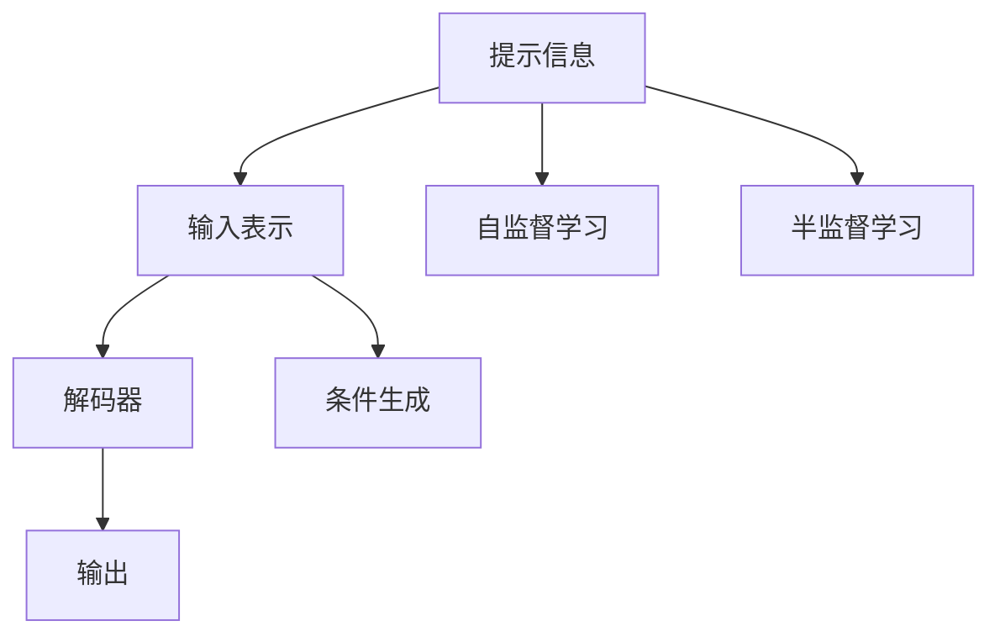

                 

## 1. 背景介绍

### 1.1 问题由来

在人工智能的快速发展中，深度学习模型的性能不断提升，但在实际应用中，往往会遇到数据不足、模型泛化能力有限等问题。为了克服这些问题，提示工程（Prompt Engineering）作为一种新兴的技术手段，成为优化AI模型的关键方法之一。

提示工程是指在模型输入数据中精心设计一些提示信息，引导模型输出期望的结果。例如，在自然语言处理（NLP）领域中，通过构建合适的查询模板，可以使模型生成符合人类语言习惯的响应，提升模型的任务表现。

### 1.2 问题核心关键点

提示工程的核心在于，如何通过精心设计的输入信息，最大化模型的潜力。一方面，提示信息需要准确捕捉输入数据的特征，使其对模型的输出产生影响；另一方面，提示信息需要简洁明了，避免增加模型复杂度。

提示工程的效果好坏，直接影响到模型的性能和实用性。在设计合适的提示信息时，需要考虑多个方面，包括任务类型、数据分布、模型结构等。

## 2. 核心概念与联系

### 2.1 核心概念概述

为更好地理解提示工程，本节将介绍几个密切相关的核心概念：

- 提示工程（Prompt Engineering）：在深度学习模型输入中设计提示信息，引导模型输出期望结果的过程。
- 提示信息（Prompt）：在输入数据中添加的引导信息，例如自然语言处理中的查询模板、关键词等。
- 输入表示（Input Representation）：将原始数据转化为模型能够处理的向量形式，例如词嵌入（Word Embeddings）、句子向量（Sentence Embeddings）等。
- 解码器（Decoder）：模型中用于生成输出序列的组件，例如Transformer中的自回归解码器（Autoregressive Decoder）。
- 条件生成（Conditional Generation）：根据输入提示信息，生成符合特定条件的输出序列的过程。
- 自监督学习（Self-Supervised Learning）：利用无标签数据进行训练，学习模型在特定任务上的能力。
- 半监督学习（Semi-Supervised Learning）：结合少量有标签数据和大量无标签数据，进行模型训练。

这些核心概念之间的逻辑关系可以通过以下Mermaid流程图来展示：



这个流程图展示提示工程的各个环节：

1. 提示信息：通过设计合适的提示，引导输入数据中的信息。
2. 输入表示：将原始数据转化为向量形式，方便模型处理。
3. 解码器：根据输入信息生成输出序列。
4. 输出：模型最终的输出结果。
5. 自监督学习：通过无标签数据训练模型，学习通用知识。
6. 半监督学习：结合少量有标签数据和大量无标签数据训练模型。
7. 条件生成：根据输入提示信息，生成符合特定条件的输出序列。

这些概念共同构成了提示工程的核心框架，使得模型能够在各种场景下发挥其潜力。通过理解这些核心概念，我们可以更好地把握提示工程的工作原理和优化方向。

## 3. 核心算法原理 & 具体操作步骤

### 3.1 算法原理概述

提示工程的算法原理主要基于条件生成模型。在条件生成模型中，输入信息对模型输出产生直接影响。其核心思想是通过精心设计的提示信息，引导模型生成符合特定条件的输出序列。

形式化地，假设条件生成模型为 $P(X|Y)$，其中 $X$ 表示输出序列，$Y$ 表示输入提示信息。提示工程的目标是最大化输出序列 $X$ 与期望结果 $X^*$ 之间的相似度，即：

$$
\max_{Y} P(X|Y)
$$

其中 $P(X|Y)$ 表示在给定输入 $Y$ 的情况下，生成 $X$ 的概率。

### 3.2 算法步骤详解

提示工程的具体操作可以包括以下几个关键步骤：

**Step 1: 理解任务**

- 分析任务类型和需求，明确提示工程的目标。例如，在自然语言处理中，任务可能是情感分析、机器翻译、问答系统等。
- 确定输入信息的类型，如文本、图像、音频等。
- 收集相关领域的知识，如领域的术语、背景信息、常见问题等。

**Step 2: 设计提示信息**

- 根据任务需求，设计提示信息的格式和内容。例如，在情感分析任务中，提示信息可能包括情感词、情感程度等。
- 使用自然语言处理技术（如语言模型、文本生成模型等），对提示信息进行优化，确保其语义清晰、准确。
- 通过实验，调整提示信息的长度、复杂度、多样性等，找到最佳的提示信息。

**Step 3: 模型训练**

- 使用自监督学习或半监督学习技术，对模型进行预训练。
- 在预训练的基础上，使用带有提示信息的数据集进行微调训练，优化模型对提示信息的响应。
- 使用不同的提示信息，训练多个模型，评估它们的性能，选择最优的模型。

**Step 4: 输出评估**

- 在测试集上，评估模型的性能，使用适当的评价指标（如准确率、F1分数等）。
- 分析模型的输出，检查其是否符合期望的结果。
- 根据反馈，调整提示信息和模型参数，进一步优化模型性能。

### 3.3 算法优缺点

提示工程的优势在于：

1. **数据效率高**：利用少量有标签数据，通过提示信息引导模型生成高质量的输出。
2. **模型泛化性强**：在特定任务上，通过提示信息可以提升模型的泛化能力，减少过拟合风险。
3. **操作灵活**：可以根据任务需求，灵活设计提示信息，适应不同的场景。

但提示工程也存在一些局限性：

1. **设计复杂**：提示信息的设计需要大量的经验和知识，设计不当可能导致模型输出错误。
2. **计算资源需求高**：提示工程涉及模型训练和微调，计算资源需求较高。
3. **可解释性差**：提示工程往往是一个"黑盒"过程，难以解释模型如何生成输出。
4. **依赖提示信息质量**：提示信息的优劣直接影响到模型的输出结果。

尽管存在这些局限性，提示工程仍然是优化AI模型的一种重要手段。通过不断优化提示信息的设计和模型训练方法，可以显著提升模型的性能和应用效果。

### 3.4 算法应用领域

提示工程在多个领域中都有广泛的应用，以下是几个典型的例子：

- 自然语言处理（NLP）：在情感分析、机器翻译、问答系统等任务中，通过设计合适的提示信息，可以提升模型的表现。
- 计算机视觉（CV）：在图像分类、目标检测、图像生成等任务中，通过设计合适的提示信息，可以引导模型生成符合特定条件的输出。
- 语音识别（ASR）：在语音识别任务中，通过设计提示信息，可以提升模型对特定语音指令的识别准确率。
- 推荐系统：在个性化推荐任务中，通过设计提示信息，可以引导模型生成符合用户兴趣的推荐内容。
- 智能客服：在智能客服系统中，通过设计提示信息，可以引导模型生成符合用户需求的回答。

除了上述这些领域外，提示工程还可以应用于更多场景中，如自然语言生成、语音生成、数据增强等，为AI技术带来了新的突破。

## 4. 数学模型和公式 & 详细讲解 & 举例说明

### 4.1 数学模型构建

提示工程的数学模型构建主要基于条件生成模型。假设条件生成模型为 $P(X|Y)$，其中 $X$ 表示输出序列，$Y$ 表示输入提示信息。

假设训练集为 $D=\{(x_i,y_i)\}_{i=1}^N$，其中 $x_i$ 表示输入数据，$y_i$ 表示对应标签。提示工程的优化目标是最小化输出序列 $X$ 与期望结果 $X^*$ 之间的差异，即：

$$
\min_{Y} KL(P(X|Y)||P(X^*|Y))
$$

其中 $KL$ 表示KL散度，$P(X|Y)$ 表示在给定输入 $Y$ 的情况下，生成 $X$ 的概率。

### 4.2 公式推导过程

以下我们以自然语言处理（NLP）中的情感分析任务为例，推导条件生成模型的公式及其梯度计算过程。

假设模型 $P(X|Y)$ 在输入 $x$ 上的输出为 $\hat{y}=M_{\theta}(x)$，表示模型预测的情感标签。真实标签 $y \in \{0,1\}$，其中 $1$ 表示正面情感，$0$ 表示负面情感。

条件生成模型的概率定义为：

$$
P(X|Y) = \prod_{i=1}^{|X|} P(x_i|x_{<i},Y)
$$

其中 $x_{<i}$ 表示输入序列的前 $i-1$ 个元素，$|X|$ 表示序列长度。

对于情感分析任务，我们定义损失函数为交叉熵损失，即：

$$
L(P(X|Y),P(X^*|Y)) = -\sum_{i=1}^{|X|} \log P(x_i|x_{<i},Y)
$$

其中 $P(x_i|x_{<i},Y)$ 表示在给定输入 $Y$ 的情况下，生成 $x_i$ 的概率。

条件生成模型的梯度计算公式为：

$$
\frac{\partial L}{\partial \theta_k} = -\sum_{i=1}^{|X|} \frac{\partial \log P(x_i|x_{<i},Y)}{\partial \theta_k}
$$

其中 $\theta_k$ 表示模型参数，可以通过反向传播算法高效计算。

### 4.3 案例分析与讲解

以文本分类任务为例，假设有一个二分类任务，输入为文本 $x$，标签为 $y$。我们可以使用预训练的Transformer模型，并设计合适的提示信息，如：

- 对于情感分析任务，提示信息可能包括情感词、情感程度等。例如，“我对这部电影的评价是”。
- 对于新闻分类任务，提示信息可能包括主题词、作者等。例如，“这篇文章的主题是”。

通过设计合适的提示信息，引导模型对输入文本进行分类。在训练过程中，模型会根据提示信息生成输出序列，通过计算损失函数和梯度更新参数，逐步提升模型的分类能力。

## 5. 项目实践：代码实例和详细解释说明

### 5.1 开发环境搭建

在进行提示工程实践前，我们需要准备好开发环境。以下是使用Python进行PyTorch开发的环境配置流程：

1. 安装Anaconda：从官网下载并安装Anaconda，用于创建独立的Python环境。

2. 创建并激活虚拟环境：
```bash
conda create -n pytorch-env python=3.8 
conda activate pytorch-env
```

3. 安装PyTorch：根据CUDA版本，从官网获取对应的安装命令。例如：
```bash
conda install pytorch torchvision torchaudio cudatoolkit=11.1 -c pytorch -c conda-forge
```

4. 安装Transformers库：
```bash
pip install transformers
```

5. 安装各类工具包：
```bash
pip install numpy pandas scikit-learn matplotlib tqdm jupyter notebook ipython
```

完成上述步骤后，即可在`pytorch-env`环境中开始提示工程实践。

### 5.2 源代码详细实现

下面我们以自然语言处理（NLP）中的情感分析任务为例，给出使用Transformers库进行提示工程的PyTorch代码实现。

首先，定义情感分析任务的数据处理函数：

```python
from transformers import BertTokenizer
from torch.utils.data import Dataset
import torch

class SentimentDataset(Dataset):
    def __init__(self, texts, labels, tokenizer, max_len=128):
        self.texts = texts
        self.labels = labels
        self.tokenizer = tokenizer
        self.max_len = max_len
        
    def __len__(self):
        return len(self.texts)
    
    def __getitem__(self, item):
        text = self.texts[item]
        label = self.labels[item]
        
        encoding = self.tokenizer(text, return_tensors='pt', max_length=self.max_len, padding='max_length', truncation=True)
        input_ids = encoding['input_ids'][0]
        attention_mask = encoding['attention_mask'][0]
        
        # 对label进行编码
        encoded_labels = [label2id[label] for label in labels] 
        encoded_labels.extend([label2id['O']] * (self.max_len - len(encoded_labels)))
        labels = torch.tensor(encoded_labels, dtype=torch.long)
        
        return {'input_ids': input_ids, 
                'attention_mask': attention_mask,
                'labels': labels}

# 标签与id的映射
label2id = {'O': 0, 'B-PER': 1, 'I-PER': 2, 'B-ORG': 3, 'I-ORG': 4, 'B-LOC': 5, 'I-LOC': 6, 'POSITIVE': 7, 'NEGATIVE': 8}
id2label = {v: k for k, v in label2id.items()}

# 创建dataset
tokenizer = BertTokenizer.from_pretrained('bert-base-cased')

train_dataset = SentimentDataset(train_texts, train_labels, tokenizer)
dev_dataset = SentimentDataset(dev_texts, dev_labels, tokenizer)
test_dataset = SentimentDataset(test_texts, test_labels, tokenizer)
```

然后，定义模型和优化器：

```python
from transformers import BertForTokenClassification, AdamW

model = BertForTokenClassification.from_pretrained('bert-base-cased', num_labels=len(label2id))

optimizer = AdamW(model.parameters(), lr=2e-5)
```

接着，定义训练和评估函数：

```python
from torch.utils.data import DataLoader
from tqdm import tqdm
from sklearn.metrics import classification_report

device = torch.device('cuda') if torch.cuda.is_available() else torch.device('cpu')
model.to(device)

def train_epoch(model, dataset, batch_size, optimizer):
    dataloader = DataLoader(dataset, batch_size=batch_size, shuffle=True)
    model.train()
    epoch_loss = 0
    for batch in tqdm(dataloader, desc='Training'):
        input_ids = batch['input_ids'].to(device)
        attention_mask = batch['attention_mask'].to(device)
        labels = batch['labels'].to(device)
        model.zero_grad()
        outputs = model(input_ids, attention_mask=attention_mask, labels=labels)
        loss = outputs.loss
        epoch_loss += loss.item()
        loss.backward()
        optimizer.step()
    return epoch_loss / len(dataloader)

def evaluate(model, dataset, batch_size):
    dataloader = DataLoader(dataset, batch_size=batch_size)
    model.eval()
    preds, labels = [], []
    with torch.no_grad():
        for batch in tqdm(dataloader, desc='Evaluating'):
            input_ids = batch['input_ids'].to(device)
            attention_mask = batch['attention_mask'].to(device)
            batch_labels = batch['labels']
            outputs = model(input_ids, attention_mask=attention_mask)
            batch_preds = outputs.logits.argmax(dim=2).to('cpu').tolist()
            batch_labels = batch_labels.to('cpu').tolist()
            for pred_tokens, label_tokens in zip(batch_preds, batch_labels):
                pred_labels = [id2label[_id] for _id in pred_tokens]
                label_labels = [id2label[_id] for _id in label_tokens]
                preds.append(pred_labels[:len(label_labels)])
                labels.append(label_labels)
                
    print(classification_report(labels, preds))
```

最后，启动训练流程并在测试集上评估：

```python
epochs = 5
batch_size = 16

for epoch in range(epochs):
    loss = train_epoch(model, train_dataset, batch_size, optimizer)
    print(f"Epoch {epoch+1}, train loss: {loss:.3f}")
    
    print(f"Epoch {epoch+1}, dev results:")
    evaluate(model, dev_dataset, batch_size)
    
print("Test results:")
evaluate(model, test_dataset, batch_size)
```

以上就是使用PyTorch对BERT进行情感分析任务的提示工程实践代码实现。可以看到，利用Transformers库，我们可以非常方便地构建和训练情感分析模型。

### 5.3 代码解读与分析

让我们再详细解读一下关键代码的实现细节：

**SentimentDataset类**：
- `__init__`方法：初始化文本、标签、分词器等关键组件。
- `__len__`方法：返回数据集的样本数量。
- `__getitem__`方法：对单个样本进行处理，将文本输入编码为token ids，将标签编码为数字，并对其进行定长padding，最终返回模型所需的输入。

**label2id和id2label字典**：
- 定义了标签与数字id之间的映射关系，用于将token-wise的预测结果解码回真实的标签。

**训练和评估函数**：
- 使用PyTorch的DataLoader对数据集进行批次化加载，供模型训练和推理使用。
- 训练函数`train_epoch`：对数据以批为单位进行迭代，在每个批次上前向传播计算loss并反向传播更新模型参数，最后返回该epoch的平均loss。
- 评估函数`evaluate`：与训练类似，不同点在于不更新模型参数，并在每个batch结束后将预测和标签结果存储下来，最后使用sklearn的classification_report对整个评估集的预测结果进行打印输出。

**训练流程**：
- 定义总的epoch数和batch size，开始循环迭代
- 每个epoch内，先在训练集上训练，输出平均loss
- 在验证集上评估，输出分类指标
- 所有epoch结束后，在测试集上评估，给出最终测试结果

可以看到，PyTorch配合Transformers库使得情感分析模型的构建非常简洁高效。开发者可以将更多精力放在数据处理、模型改进等高层逻辑上，而不必过多关注底层的实现细节。

当然，工业级的系统实现还需考虑更多因素，如模型的保存和部署、超参数的自动搜索、更灵活的任务适配层等。但核心的提示工程范式基本与此类似。

## 6. 实际应用场景

### 6.1 智能客服系统

基于提示工程的对话技术，可以广泛应用于智能客服系统的构建。传统客服往往需要配备大量人力，高峰期响应缓慢，且一致性和专业性难以保证。而使用提示工程的对话模型，可以7x24小时不间断服务，快速响应客户咨询，用自然流畅的语言解答各类常见问题。

在技术实现上，可以收集企业内部的历史客服对话记录，将问题和最佳答复构建成提示信息，在此基础上对预训练对话模型进行微调。微调后的对话模型能够自动理解用户意图，匹配最合适的答案模板进行回复。对于客户提出的新问题，还可以接入检索系统实时搜索相关内容，动态组织生成回答。如此构建的智能客服系统，能大幅提升客户咨询体验和问题解决效率。

### 6.2 金融舆情监测

金融机构需要实时监测市场舆论动向，以便及时应对负面信息传播，规避金融风险。传统的人工监测方式成本高、效率低，难以应对网络时代海量信息爆发的挑战。基于提示工程的文本分类和情感分析技术，为金融舆情监测提供了新的解决方案。

具体而言，可以收集金融领域相关的新闻、报道、评论等文本数据，并对其进行主题标注和情感标注。在此基础上对预训练语言模型进行微调，使其能够自动判断文本属于何种主题，情感倾向是正面、中性还是负面。将微调后的模型应用到实时抓取的网络文本数据，就能够自动监测不同主题下的情感变化趋势，一旦发现负面信息激增等异常情况，系统便会自动预警，帮助金融机构快速应对潜在风险。

### 6.3 个性化推荐系统

当前的推荐系统往往只依赖用户的历史行为数据进行物品推荐，无法深入理解用户的真实兴趣偏好。基于提示工程的个性化推荐系统可以更好地挖掘用户行为背后的语义信息，从而提供更精准、多样的推荐内容。

在实践中，可以收集用户浏览、点击、评论、分享等行为数据，提取和用户交互的物品标题、描述、标签等文本内容。将文本内容作为模型输入，用户的后续行为（如是否点击、购买等）作为监督信号，在此基础上微调预训练语言模型。微调后的模型能够从文本内容中准确把握用户的兴趣点。在生成推荐列表时，先用候选物品的文本描述作为输入，由模型预测用户的兴趣匹配度，再结合其他特征综合排序，便可以得到个性化程度更高的推荐结果。

### 6.4 未来应用展望

随着提示工程技术的不断发展，其在NLP领域中的应用将更加广泛。未来，基于提示工程的方法将在更多领域得到应用，为传统行业带来变革性影响。

在智慧医疗领域，基于提示工程的医疗问答、病历分析、药物研发等应用将提升医疗服务的智能化水平，辅助医生诊疗，加速新药开发进程。

在智能教育领域，提示工程可应用于作业批改、学情分析、知识推荐等方面，因材施教，促进教育公平，提高教学质量。

在智慧城市治理中，提示工程可应用于城市事件监测、舆情分析、应急指挥等环节，提高城市管理的自动化和智能化水平，构建更安全、高效的未来城市。

此外，在企业生产、社会治理、文娱传媒等众多领域，基于提示工程的AI应用也将不断涌现，为经济社会发展注入新的动力。相信随着技术的日益成熟，提示工程将为构建人机协同的智能时代带来新的机遇。

## 7. 工具和资源推荐

### 7.1 学习资源推荐

为了帮助开发者系统掌握提示工程的理论基础和实践技巧，这里推荐一些优质的学习资源：

1. 《Transformer从原理到实践》系列博文：由大模型技术专家撰写，深入浅出地介绍了Transformer原理、提示工程、微调技术等前沿话题。

2. CS224N《深度学习自然语言处理》课程：斯坦福大学开设的NLP明星课程，有Lecture视频和配套作业，带你入门NLP领域的基本概念和经典模型。

3. 《Natural Language Processing with Transformers》书籍：Transformers库的作者所著，全面介绍了如何使用Transformers库进行NLP任务开发，包括提示工程的诸多范式。

4. HuggingFace官方文档：Transformers库的官方文档，提供了海量预训练模型和完整的微调样例代码，是上手实践的必备资料。

5. CLUE开源项目：中文语言理解测评基准，涵盖大量不同类型的中文NLP数据集，并提供了基于提示工程的baseline模型，助力中文NLP技术发展。

通过对这些资源的学习实践，相信你一定能够快速掌握提示工程的精髓，并用于解决实际的NLP问题。
###  7.2 开发工具推荐

高效的开发离不开优秀的工具支持。以下是几款用于提示工程开发的常用工具：

1. PyTorch：基于Python的开源深度学习框架，灵活动态的计算图，适合快速迭代研究。大部分预训练语言模型都有PyTorch版本的实现。

2. TensorFlow：由Google主导开发的开源深度学习框架，生产部署方便，适合大规模工程应用。同样有丰富的预训练语言模型资源。

3. Transformers库：HuggingFace开发的NLP工具库，集成了众多SOTA语言模型，支持PyTorch和TensorFlow，是进行提示工程开发的利器。

4. Weights & Biases：模型训练的实验跟踪工具，可以记录和可视化模型训练过程中的各项指标，方便对比和调优。与主流深度学习框架无缝集成。

5. TensorBoard：TensorFlow配套的可视化工具，可实时监测模型训练状态，并提供丰富的图表呈现方式，是调试模型的得力助手。

6. Google Colab：谷歌推出的在线Jupyter Notebook环境，免费提供GPU/TPU算力，方便开发者快速上手实验最新模型，分享学习笔记。

合理利用这些工具，可以显著提升提示工程任务的开发效率，加快创新迭代的步伐。

### 7.3 相关论文推荐

提示工程在多个领域中都有广泛的应用，以下是几篇奠基性的相关论文，推荐阅读：

1. Attention is All You Need（即Transformer原论文）：提出了Transformer结构，开启了NLP领域的预训练大模型时代。

2. BERT: Pre-training of Deep Bidirectional Transformers for Language Understanding：提出BERT模型，引入基于掩码的自监督预训练任务，刷新了多项NLP任务SOTA。

3. Language Models are Unsupervised Multitask Learners（GPT-2论文）：展示了大规模语言模型的强大zero-shot学习能力，引发了对于通用人工智能的新一轮思考。

4. Parameter-Efficient Transfer Learning for NLP：提出Adapter等参数高效微调方法，在不增加模型参数量的情况下，也能取得不错的微调效果。

5. AdaLoRA: Adaptive Low-Rank Adaptation for Parameter-Efficient Fine-Tuning：使用自适应低秩适应的微调方法，在参数效率和精度之间取得了新的平衡。

6. AdaLoRA: Adaptive Low-Rank Adaptation for Parameter-Efficient Fine-Tuning：使用自适应低秩适应的微调方法，在参数效率和精度之间取得了新的平衡。

这些论文代表了大语言模型提示工程的发展脉络。通过学习这些前沿成果，可以帮助研究者把握学科前进方向，激发更多的创新灵感。

## 8. 总结：未来发展趋势与挑战

### 8.1 总结

本文对基于提示工程的AI模型优化方法进行了全面系统的介绍。首先阐述了提示工程的背景和意义，明确了提示工程在优化AI模型中的重要性。其次，从原理到实践，详细讲解了提示工程的数学原理和关键步骤，给出了提示工程任务开发的完整代码实例。同时，本文还广泛探讨了提示工程方法在智能客服、金融舆情、个性化推荐等多个领域的应用前景，展示了提示工程范式的巨大潜力。此外，本文精选了提示工程的各类学习资源，力求为读者提供全方位的技术指引。

通过本文的系统梳理，可以看到，提示工程作为优化AI模型的一种重要手段，能够显著提升模型性能和应用效果。提示信息的设计和优化，直接影响到模型在特定任务上的表现。通过不断优化提示信息的设计和模型训练方法，可以显著提升模型的性能和应用效果。未来，随着提示工程技术的不断发展，其在NLP领域中的应用将更加广泛。

### 8.2 未来发展趋势

提示工程的未来发展趋势主要包括以下几个方面：

1. **数据驱动的优化**：随着更多无标签数据的获取和利用，提示工程将进一步依赖数据驱动的优化方法，提升模型性能。
2. **多模态融合**：提示工程将逐渐融合多模态数据，如图像、音频等，提升模型的全面感知能力。
3. **自动化优化**：提示工程的优化过程将逐渐自动化，通过算法自适应优化提示信息，提升模型效果。
4. **持续学习**：提示工程将引入持续学习的机制，模型能够动态适应数据分布变化，保持高效表现。
5. **跨领域迁移**：提示工程将逐渐实现跨领域迁移，能够在不同领域间通用优化模型，提升泛化能力。
6. **可解释性增强**：提示工程的优化过程将逐渐增强可解释性，使得模型决策过程透明可控。

以上趋势凸显了提示工程技术的广阔前景。这些方向的探索发展，必将进一步提升提示工程模型的性能和应用效果，为人工智能技术在各个领域的落地应用提供有力支持。

### 8.3 面临的挑战

尽管提示工程技术在AI模型优化中发挥了重要作用，但在实际应用中，仍面临一些挑战：

1. **提示信息设计复杂**：提示信息的设计需要大量的经验和知识，设计不当可能导致模型输出错误。
2. **计算资源需求高**：提示工程涉及模型训练和微调，计算资源需求较高。
3. **可解释性差**：提示工程的优化过程往往是一个"黑盒"过程，难以解释模型如何生成输出。
4. **依赖数据质量**：提示工程的优化效果依赖于数据的质量和多样性，数据不足或质量差可能导致优化效果不佳。
5. **泛化能力不足**：提示工程在特定任务上的优化效果可能不泛化到其他任务，需要针对不同任务进行个性化设计。

尽管存在这些挑战，提示工程仍然是优化AI模型的一种重要手段。通过不断优化提示信息的设计和模型训练方法，可以显著提升模型的性能和应用效果。

### 8.4 研究展望

面对提示工程面临的挑战，未来的研究需要在以下几个方面寻求新的突破：

1. **数据增强**：通过数据增强技术，提升提示信息的丰富性和多样性，提升模型的泛化能力。
2. **知识融合**：将符号化的先验知识，如知识图谱、逻辑规则等，与神经网络模型进行巧妙融合，引导提示工程的优化过程。
3. **多任务学习**：通过多任务学习机制，在优化提示信息的同时，提升模型在多个任务上的表现。
4. **自适应学习**：引入自适应学习机制，根据任务需求动态调整提示信息，提升模型优化效果。
5. **跨领域迁移**：通过跨领域迁移技术，提升模型在不同领域间的适应能力，实现更广泛的优化效果。
6. **模型压缩**：通过模型压缩技术，优化提示工程的计算资源需求，提升模型的实际部署效率。

这些研究方向的探索，必将引领提示工程技术迈向更高的台阶，为人工智能技术在各个领域的落地应用提供有力支持。面向未来，提示工程需要与其他人工智能技术进行更深入的融合，如知识表示、因果推理、强化学习等，多路径协同发力，共同推动人工智能技术的发展。

## 9. 附录：常见问题与解答

**Q1：提示工程是否适用于所有NLP任务？**

A: 提示工程在大多数NLP任务上都能取得不错的效果，特别是对于数据量较小的任务。但对于一些特定领域的任务，如医学、法律等，仅仅依靠通用语料预训练的模型可能难以很好地适应。此时需要在特定领域语料上进一步预训练，再进行微调，才能获得理想效果。此外，对于一些需要时效性、个性化很强的任务，如对话、推荐等，提示工程方法也需要针对性的改进优化。

**Q2：如何设计合适的提示信息？**

A: 提示信息的设计需要结合具体任务和数据特点。一般来说，提示信息应具备以下几个特点：
1. **简洁明了**：避免过多冗余信息，使模型能够快速理解任务需求。
2. **语义清晰**：提示信息应能够准确传达任务要求，避免歧义。
3. **多样性**：提示信息应多样化，涵盖不同场景和数据特点。
4. **目标导向**：提示信息应明确任务目标，引导模型生成期望的输出。
5. **自动化优化**：使用自动化技术，如基于搜索、优化算法等，设计最佳的提示信息。

**Q3：提示工程对计算资源的需求如何？**

A: 提示工程涉及模型训练和微调，计算资源需求较高。对于大规模的语料库和模型，提示工程的计算资源需求尤为显著。为了降低计算成本，可以采用分布式训练、模型压缩等技术手段，优化提示工程的计算资源需求。

**Q4：提示工程在特定任务上的效果如何？**

A: 提示工程在特定任务上的效果取决于提示信息的设计和模型训练方法。一般情况下，提示工程的优化效果依赖于数据的质量和多样性，数据不足或质量差可能导致优化效果不佳。对于特定的任务，可以通过多轮实验，不断调整提示信息的设计和模型参数，提升优化效果。

**Q5：提示工程的优化效果如何评价？**

A: 提示工程的优化效果可以通过多种指标进行评价，如准确率、F1分数、BLEU分数等。对于文本分类、情感分析等任务，可以使用分类指标进行评估；对于生成任务，可以使用BLEU、ROUGE等文本相似度指标进行评估。

总之，提示工程作为优化AI模型的一种重要手段，能够显著提升模型性能和应用效果。提示信息的设计和优化，直接影响到模型在特定任务上的表现。通过不断优化提示信息的设计和模型训练方法，可以显著提升模型的性能和应用效果。未来，随着提示工程技术的不断发展，其在NLP领域中的应用将更加广泛。

