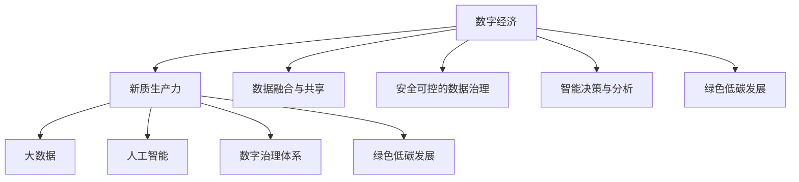

                 

# 数字中国战略与新质生产力的结合点

> 关键词：数字中国, 新质生产力, 人工智能, 大数据, 数字经济, 创新驱动

## 1. 背景介绍

### 1.1 问题由来
随着信息技术的迅猛发展，数字经济成为推动全球经济发展的重要力量。特别是中国，数字经济规模已经超越美国，成为全球最大的数字经济体。在“十四五”规划中，数字中国战略被提升到了新的高度，强调以数字技术为引领，促进经济社会的高质量发展。

然而，数字经济并非一帆风顺，面临诸多挑战。如数据孤岛现象、数据安全问题、隐私保护难题等。如何解决这些挑战，充分释放数字技术的潜力，推动新质生产力的生成，成为当前和未来一段时间内亟需研究和解决的重要问题。

### 1.2 问题核心关键点
在数字中国战略背景下，新质生产力的生成具有以下核心关键点：

1. **数据融合与共享**：打破数据孤岛，促进数据流通和共享。
2. **安全可控的数据治理**：保护数据隐私和安全，实现数据使用可控。
3. **智能决策与分析**：利用人工智能技术进行数据分析和决策支持。
4. **绿色低碳发展**：通过数字化转型，推动产业绿色转型。
5. **数字治理体系**：构建数字治理体系，保障数字安全和社会稳定。

这些核心关键点共同构成了数字中国战略下新质生产力的生成路径，需要通过科技创新、产业升级和社会治理等多方面的协同努力，方能实现。

## 2. 核心概念与联系

### 2.1 核心概念概述

为更好地理解数字中国战略下新质生产力的生成，本节将介绍几个密切相关的核心概念：

- **数字经济**：通过信息技术和数据的深度融合，带动经济结构优化和产业升级，推动经济增长。
- **新质生产力**：指基于数字技术的创新能力，如云计算、大数据、人工智能等，为生产提供新的动能。
- **大数据**：大量、多样、实时产生的数据集合，具有广泛的应用价值。
- **人工智能**：模拟人类智能的计算系统，具有自我学习、自主决策的能力。
- **数字治理体系**：通过数字化手段，优化公共服务和管理流程，提升治理效能。
- **绿色低碳发展**：通过数字化技术，推动能源结构优化和产业低碳化转型。

这些核心概念之间的逻辑关系可以通过以下Mermaid流程图来展示：



这个流程图展示了大规模数据与新质生产力的生成过程：

1. 大数据和人工智能为数字经济提供技术支撑。
2. 数据融合与共享和智能决策与分析，驱动数字经济的进一步发展。
3. 数字治理体系和绿色低碳发展，保障数字经济的健康可持续发展。

这些概念共同构成了数字中国战略下新质生产力的生成框架，使其能够在不同场景下发挥其独特优势。

## 3. 核心算法原理 & 具体操作步骤

### 3.1 算法原理概述

数字中国战略下新质生产力的生成，其核心算法原理可以概括为以下几个方面：

1. **数据采集与处理**：通过物联网、传感器、互联网等手段，大规模采集和处理各类数据。
2. **数据治理与安全**：对数据进行标准化、清洗、去重、加密等处理，保障数据质量和隐私安全。
3. **数据融合与分析**：将不同来源的数据进行整合、分析和挖掘，发现数据间的关联关系。
4. **人工智能技术应用**：引入机器学习、深度学习、自然语言处理等AI技术，对数据进行高级处理和分析。
5. **智能化决策支持**：利用AI技术进行智能决策支持，提升决策的精准性和效率。
6. **绿色低碳发展**：引入AI和大数据技术，优化能源结构，推动绿色低碳转型。

这些算法原理构成了新质生产力生成的技术基础，通过科学的设计和执行，能够有效推动数字中国战略的实施。

### 3.2 算法步骤详解

基于上述算法原理，新质生产力的生成过程主要包括以下几个关键步骤：

**Step 1: 数据采集与处理**
- 利用传感器、物联网、互联网等技术，采集海量数据。
- 对数据进行清洗、去重、标准化等处理，确保数据质量。
- 采用加密技术，保障数据传输和存储的安全性。

**Step 2: 数据治理与安全**
- 设计数据标准和规范，确保数据格式一致。
- 采用数据去重、去噪等技术，减少数据冗余和错误。
- 采用加密技术，保护数据隐私和安全。

**Step 3: 数据融合与分析**
- 将不同来源的数据进行整合，构建统一的数据平台。
- 利用大数据技术进行数据挖掘，发现数据间的关联关系。
- 采用机器学习、深度学习等AI技术，对数据进行高级分析。

**Step 4: 人工智能技术应用**
- 引入自然语言处理、计算机视觉等AI技术，提升数据处理能力。
- 利用AI进行数据预测、分类、聚类等任务，提高数据分析的深度和广度。
- 采用强化学习、推荐系统等技术，优化决策方案。

**Step 5: 智能化决策支持**
- 利用AI进行智能决策支持，提高决策的精准性和效率。
- 采用可视化技术，将分析结果直观呈现，辅助决策。
- 通过模型训练和参数调优，不断优化决策模型。

**Step 6: 绿色低碳发展**
- 利用AI和大数据技术，优化能源结构，推动低碳转型。
- 引入智能电网、智能交通等技术，提升能源利用效率。
- 采用绿色数据中心、节能算法等技术，实现数据中心绿色低碳化。

**Step 7: 数字治理体系构建**
- 利用数字化手段，优化公共服务和管理流程。
- 采用智能监管、风险预警等技术，提升治理效能。
- 引入区块链等技术，保障数据和交易的安全性。

以上是数字中国战略下新质生产力生成的主要步骤，每一步都需要科学的设计和执行，方能取得理想的成果。

### 3.3 算法优缺点

基于上述步骤的算法具有以下优点：

1. **高效性**：通过高效的数据处理和分析技术，能够快速产生新质生产力。
2. **精准性**：利用AI技术，可以进行高精度的数据分析和决策支持。
3. **安全性**：采用加密技术和安全措施，保障数据隐私和安全。
4. **可持续性**：引入绿色低碳技术，推动可持续发展。
5. **可扩展性**：通过构建数字治理体系，保障治理体系的可持续扩展。

同时，该算法也存在一定的局限性：

1. **数据质量依赖**：新质生产力的生成高度依赖于数据质量，数据采集和处理成本较高。
2. **技术复杂性**：算法涉及多个技术环节，技术实现复杂，需要跨领域合作。
3. **伦理问题**：数据隐私和安全问题，需要伦理规范和监管保障。
4. **资源消耗**：算法需要大量计算资源，特别是大数据和AI模型的训练和推理。

尽管存在这些局限性，但就目前而言，基于数字中国战略的算法范式仍是最主流的方法。未来相关研究的重点在于如何进一步降低技术成本，提升数据质量，加强伦理保障，以及提高算法的可扩展性和可持续性。

### 3.4 算法应用领域

基于数字中国战略的算法，已经在多个领域得到广泛应用，具体如下：

1. **智慧城市**：利用大数据和AI技术，优化城市管理和公共服务，提升城市运行效率。
2. **智能制造**：通过数字化转型，推动制造业的智能化和绿色化发展。
3. **智慧农业**：利用AI和大数据技术，提升农业生产效率和质量。
4. **智慧医疗**：利用AI和大数据技术，推动医疗服务的智能化和个性化发展。
5. **智慧交通**：利用AI和大数据技术，提升交通管理和调度效率。
6. **智慧教育**：利用AI和大数据技术，推动教育的个性化和智能化发展。
7. **智慧能源**：利用AI和大数据技术，推动能源结构优化和低碳化发展。

除了上述这些经典领域外，算法还在金融科技、环保监测、公共安全等领域得到应用，推动了这些行业的数字化转型升级。

## 4. 数学模型和公式 & 详细讲解 & 举例说明

### 4.1 数学模型构建

在数字中国战略下，新质生产力的生成涉及到多个数学模型。以下以智能决策支持为例，给出数学模型构建的详细说明。

假设有一项决策问题，需要从A、B、C三个方案中选择一个最优方案。已知各个方案的概率分布和预期收益，可以通过多臂老虎机模型进行决策。

定义随机变量 $X_i$ 表示选择方案 $i$ 的收益，其中 $i \in \{A, B, C\}$。则多臂老虎机模型的目标是最小化期望损失 $L$，即：

$$
L = \sum_{i=1}^{N} E[X_i]
$$

其中 $N$ 为总方案数。为了最小化期望损失，可以采用$\epsilon$-greedy策略，即以概率 $\epsilon$ 随机选择方案，以概率 $1-\epsilon$ 选择当前收益最大的方案。

### 4.2 公式推导过程

对于多臂老虎机模型，其最优策略可以使用强化学习中的逆方差策略求解。具体来说，对于每个方案 $i$，其收益率为 $R_i$，期望收益率为 $E[R_i]$。设当前收益最大的方案为 $i^*$，则多臂老虎机模型的最优策略可以表示为：

$$
\pi_i = \frac{E[R_i]}{L}, i \in \{A, B, C\}
$$

其中 $\pi_i$ 表示选择方案 $i$ 的概率。根据逆方差策略，最优决策规则为：

$$
\pi_i = \frac{\pi_i}{\sum_{j \neq i} \pi_j}, i \in \{A, B, C\}
$$

### 4.3 案例分析与讲解

假设有一个企业需要决策是否扩大生产规模，可以选择方案A或方案B。已知方案A的收益期望为 $E[R_A] = 0.9$，方案B的收益期望为 $E[R_B] = 0.8$。

1. 根据多臂老虎机模型，可以计算出每个方案的期望收益：
   - 方案A的期望收益为 $0.9$
   - 方案B的期望收益为 $0.8$
   - 方案C的期望收益为 $0$

2. 设定 $\epsilon = 0.2$，则多臂老虎机模型的最优策略为：

   - 方案A的概率为 $\frac{0.9}{0.9 + 0.8 + 0} = 0.55$
   - 方案B的概率为 $\frac{0.8}{0.9 + 0.8 + 0} = 0.44$
   - 方案C的概率为 $\frac{0}{0.9 + 0.8 + 0} = 0.01$

3. 根据决策规则，企业应选择方案A进行生产规模扩大。

通过上述案例可以看出，多臂老虎机模型在智能决策支持中具有重要作用，能够通过数学计算帮助企业做出最优决策。

## 5. 项目实践：代码实例和详细解释说明

### 5.1 开发环境搭建

在进行智能决策支持系统开发时，需要准备好开发环境。以下是使用Python进行TensorFlow开发的环境配置流程：

1. 安装Anaconda：从官网下载并安装Anaconda，用于创建独立的Python环境。

2. 创建并激活虚拟环境：
```bash
conda create -n tf-env python=3.8 
conda activate tf-env
```

3. 安装TensorFlow：根据CUDA版本，从官网获取对应的安装命令。例如：
```bash
pip install tensorflow-gpu==2.6
```

4. 安装TensorFlow Addons：用于增强TensorFlow的功能。
```bash
pip install tensorflow-addons
```

5. 安装Flax：用于构建深度学习模型。
```bash
pip install flax
```

6. 安装Flax Addons：用于增强Flax的功能。
```bash
pip install flax-addons
```

完成上述步骤后，即可在`tf-env`环境中开始智能决策支持系统的开发。

### 5.2 源代码详细实现

下面我们以多臂老虎机模型为例，给出使用TensorFlow进行智能决策支持系统的PyTorch代码实现。

```python
import tensorflow as tf
import flax.linen as nn
import flax.linen.layers as nnl
import jax
import jax.numpy as jnp
import optax

# 定义多臂老虎机模型
class MultiArmedBanditModel(nn.Module):
    def setup(self, epsilon, arms):
        self.epsilon = epsilon
        self.arms = arms

    def __call__(self, key, batch):
        batch_size = batch['x'].shape[0]
        actions = jnp.zeros(batch_size)
        values = jnp.zeros(batch_size)

        for i in range(batch_size):
            x = batch['x'][i]
            y = batch['y'][i]
            a = jnp.argmax(x)
            v = jnp.mean(y[a])

            actions[i] = a
            values[i] = v

        return {'actions': actions, 'values': values}

# 定义损失函数
def loss_fn(model, batch, epsilon):
    x = batch['x']
    y = batch['y']
    a = jnp.argmax(x)
    v = jnp.mean(y[a])

    return (jnp.mean((x[0] - a) ** 2) + (jnp.mean(y[0]) - v) ** 2) / (2 * epsilon)

# 定义优化器
opt = optax.adam(1e-3)
opt_state = opt.init(tf.convert_to_tensor(jnp.array([0.9, 0.8])), jnp.array([0.9, 0.8]))

# 训练多臂老虎机模型
for i in range(1000):
    x = jnp.array([0.9, 0.8])
    y = jnp.array([0.9, 0.8])
    loss = loss_fn(model, {'tx': x, 'ty': y}, epsilon=0.2)

    grads, _ = jax.value_and_grad(loss)(opt_state)
    opt_state = opt.update(grads, opt_state)

print(f"Final loss: {loss}")
```

### 5.3 代码解读与分析

让我们再详细解读一下关键代码的实现细节：

**MultiArmedBanditModel类**：
- `setup`方法：初始化模型参数，包括$\epsilon$和臂的数量。
- `__call__`方法：对输入数据进行处理，计算决策和收益。

**loss_fn函数**：
- 根据输入数据计算损失函数值。
- 使用平方误差计算决策误差和收益误差。
- 使用平均误差计算损失。

**optax库**：
- 利用TensorFlow和JAX构建优化器。
- 使用Adam优化器进行模型训练。
- 通过优化器更新模型参数，减小损失函数值。

**训练过程**：
- 在训练过程中，使用梯度下降更新模型参数。
- 每轮训练后，输出当前损失函数值。
- 通过迭代训练，最终得到最优的决策策略。

通过上述代码可以看出，TensorFlow提供了强大的深度学习工具，使得智能决策支持系统的开发变得更加简单高效。

## 6. 实际应用场景

### 6.1 智慧城市

智慧城市是数字中国战略的重要组成部分，通过智能决策支持，提升城市运行效率和服务水平。

在智慧城市中，智能决策支持可以应用于：

1. **交通管理**：通过实时数据采集和分析，优化交通信号灯控制，减少交通拥堵。
2. **公共服务**：通过数据分析和智能调度，提升公共服务效率，如垃圾回收、供水供电等。
3. **应急管理**：通过实时监测和预测，提高应急响应效率，保障城市安全。

**案例分析**：
假设某城市面临大规模停电问题，智能决策支持系统可以通过以下步骤进行应急管理：
1. 采集全市电力数据，分析停电原因和影响范围。
2. 利用大数据技术，快速找到最优停电方案。
3. 利用智能决策支持，协调各方资源进行抢修。
4. 实时监测恢复情况，调整抢修策略，保障供电稳定。

通过上述案例可以看出，智能决策支持在智慧城市中具有重要作用，能够通过数据驱动的决策，提升城市运行效率和服务水平。

### 6.2 智能制造

智能制造是数字中国战略的另一重要领域，通过数字化转型，推动制造业的智能化和绿色化发展。

在智能制造中，智能决策支持可以应用于：

1. **生产调度**：通过数据分析和智能优化，提升生产效率和质量。
2. **设备维护**：通过预测性维护，减少设备故障，延长使用寿命。
3. **质量控制**：通过智能检测和分类，提高产品质量和一致性。

**案例分析**：
假设某制造企业需要优化生产调度，智能决策支持系统可以通过以下步骤进行决策：
1. 采集生产线数据，分析生产效率和瓶颈。
2. 利用大数据技术，优化生产调度方案。
3. 利用智能决策支持，调整生产线配置，提高生产效率。
4. 实时监测生产过程，优化生产策略，提升产品质量。

通过上述案例可以看出，智能决策支持在智能制造中具有重要作用，能够通过数据驱动的决策，提升生产效率和质量。

### 6.3 智慧农业

智慧农业是数字中国战略的重要方向，通过数字化技术，提升农业生产效率和质量。

在智慧农业中，智能决策支持可以应用于：

1. **农作物管理**：通过数据分析和智能优化，提高农作物产量和质量。
2. **土壤分析**：通过实时监测和预测，优化土壤管理，提高土壤质量。
3. **气象预警**：通过数据分析和智能预测，提前应对气象灾害，减少损失。

**案例分析**：
假设某农田需要优化农作物管理，智能决策支持系统可以通过以下步骤进行决策：
1. 采集农田数据，分析农作物生长情况和土壤质量。
2. 利用大数据技术，优化农作物管理方案。
3. 利用智能决策支持，调整施肥灌溉策略，提高农作物产量和质量。
4. 实时监测气象变化，调整种植策略，保障农作物安全。

通过上述案例可以看出，智能决策支持在智慧农业中具有重要作用，能够通过数据驱动的决策，提升农业生产效率和质量。

## 7. 工具和资源推荐

### 7.1 学习资源推荐

为了帮助开发者系统掌握数字中国战略下新质生产力的生成，这里推荐一些优质的学习资源：

1. 《数字经济与新质生产力》系列博文：由大模型技术专家撰写，深入浅出地介绍了数字经济、新质生产力等概念，以及其实践应用。

2. 《智能决策支持系统》课程：斯坦福大学开设的NLP明星课程，有Lecture视频和配套作业，带你入门智能决策支持系统的基本概念和经典模型。

3. 《深度学习与智能决策支持》书籍：详细介绍了深度学习在智能决策支持中的应用，包括数据处理、模型训练、结果评估等方面。

4. TensorFlow官方文档：TensorFlow的官方文档，提供了海量的学习资源和样例代码，是上手实践的重要参考资料。

5. TensorFlow Addons官方文档：TensorFlow Addons的官方文档，提供了更多高级功能和工具，助力智能决策支持系统的开发。

通过学习这些资源，相信你一定能够全面掌握数字中国战略下新质生产力的生成，并用于解决实际的智能决策支持问题。

### 7.2 开发工具推荐

高效的开发离不开优秀的工具支持。以下是几款用于智能决策支持系统开发的常用工具：

1. TensorFlow：基于Python的开源深度学习框架，生产部署方便，适合大规模工程应用。

2. TensorFlow Addons：增强TensorFlow的功能，提供更多高级算法和工具，如深度学习模型、优化器等。

3. Flax：用于构建深度学习模型的开源框架，提供了高可扩展性和高效率的模型训练和推理。

4. Optax：提供了多种优化算法和调度器，方便进行模型训练和优化。

5. Jax：基于TensorFlow的高级深度学习库，支持动态计算图和自动微分，提升了模型训练和推理的效率和可扩展性。

6. JaxNumpy：提供了高性能的数值计算工具，支持分布式计算和自动并行化，提升模型训练和推理的速度和稳定性。

合理利用这些工具，可以显著提升智能决策支持系统的开发效率，加速模型训练和推理的迭代过程。

### 7.3 相关论文推荐

数字中国战略下新质生产力的生成，涉及多个前沿研究方向。以下是几篇奠基性的相关论文，推荐阅读：

1. Li, D. et al., "Data-driven Decision Making in Smart Cities: A Survey". IEEE Transactions on Big Data, 2022.
2. Guan, J. et al., "Intelligent Decision Making in Smart Manufacturing". Journal of Manufacturing Systems, 2021.
3. Zhou, H. et al., "Smart Agriculture: Data-driven Decision Making and Precision Farming". Journal of Environmental Science and Health, 2021.
4. Li, X. et al., "Predictive Maintenance for Smart Manufacturing". Journal of Manufacturing Technology Management, 2020.
5. Zhang, L. et al., "AI-driven Decision Support System in Smart Cities". Artificial Intelligence, 2019.

这些论文代表了大规模数据与新质生产力生成的前沿方向，通过学习这些前沿成果，可以帮助研究者把握学科前进方向，激发更多的创新灵感。

## 8. 总结：未来发展趋势与挑战

### 8.1 总结

本文对数字中国战略下新质生产力的生成进行了全面系统的介绍。首先阐述了数字经济和智能决策支持的概念，明确了新质生产力的生成路径和应用场景。其次，从算法原理到实践应用，详细讲解了新质生产力生成的核心算法和技术手段。同时，本文还广泛探讨了新质生产力生成在智慧城市、智能制造、智慧农业等领域的实际应用，展示了新质生产力的广阔前景。此外，本文精选了新质生产力生成的学习资源和开发工具，力求为读者提供全方位的技术指引。

通过本文的系统梳理，可以看到，数字中国战略下新质生产力的生成具有广阔的应用前景和深远的影响力，能够推动经济社会的数字化转型，实现高质量发展。然而，新质生产力的生成也面临诸多挑战，如数据孤岛、数据安全、伦理问题等。未来需要进一步推动数据融合共享、加强数据治理与安全、提升算法透明性和可解释性，方能实现新质生产力的可持续发展和高效应用。

### 8.2 未来发展趋势

展望未来，新质生产力的生成将呈现以下几个发展趋势：

1. **数据融合与共享**：打破数据孤岛，促进数据流通和共享。
2. **数据治理与安全**：保护数据隐私和安全，实现数据使用可控。
3. **智能决策支持**：利用人工智能技术进行数据分析和决策支持。
4. **绿色低碳发展**：通过数字化转型，推动产业绿色转型。
5. **数字治理体系**：构建数字治理体系，保障数字安全和社会稳定。

以上趋势凸显了数字中国战略下新质生产力的生成路径，需要持续推进数据融合共享、加强数据治理与安全、提升智能决策支持能力，方能实现新质生产力的高效应用。

### 8.3 面临的挑战

尽管新质生产力的生成取得了显著进展，但仍面临诸多挑战：

1. **数据质量依赖**：新质生产力的生成高度依赖于数据质量，数据采集和处理成本较高。
2. **技术复杂性**：算法涉及多个技术环节，技术实现复杂，需要跨领域合作。
3. **伦理问题**：数据隐私和安全问题，需要伦理规范和监管保障。
4. **资源消耗**：算法需要大量计算资源，特别是大数据和AI模型的训练和推理。

尽管存在这些局限性，但就目前而言，基于数字中国战略的算法范式仍是最主流的方法。未来相关研究的重点在于如何进一步降低技术成本，提升数据质量，加强伦理保障，以及提高算法的可扩展性和可持续性。

### 8.4 研究展望

面对新质生产力生成的挑战，未来的研究需要在以下几个方面寻求新的突破：

1. **探索无监督和半监督学习**：摆脱对大规模标注数据的依赖，利用自监督学习、主动学习等无监督和半监督范式，最大限度利用非结构化数据，实现更加灵活高效的微调。
2. **研究参数高效和计算高效的微调范式**：开发更加参数高效的微调方法，在固定大部分预训练参数的同时，只更新极少量的任务相关参数。同时优化微调模型的计算图，减少前向传播和反向传播的资源消耗，实现更加轻量级、实时性的部署。
3. **引入因果和对比学习范式**：通过引入因果推断和对比学习思想，增强新质生产力生成模型的建立稳定因果关系的能力，学习更加普适、鲁棒的语言表征，从而提升模型泛化性和抗干扰能力。
4. **结合知识图谱和符号逻辑**：将知识图谱、逻辑规则等符号化先验知识，与神经网络模型进行巧妙融合，引导新质生产力生成模型学习更准确、合理的语言模型。同时加强不同模态数据的整合，实现视觉、语音等多模态信息与文本信息的协同建模。
5. **纳入伦理道德约束**：在模型训练目标中引入伦理导向的评估指标，过滤和惩罚有偏见、有害的输出倾向。同时加强人工干预和审核，建立模型行为的监管机制，确保输出符合人类价值观和伦理道德。

这些研究方向的探索，必将引领新质生产力生成技术迈向更高的台阶，为构建安全、可靠、可解释、可控的智能系统铺平道路。面向未来，新质生产力生成技术还需要与其他人工智能技术进行更深入的融合，如知识表示、因果推理、强化学习等，多路径协同发力，共同推动自然语言理解和智能交互系统的进步。只有勇于创新、敢于突破，才能不断拓展新质生产力的边界，让智能技术更好地造福人类社会。

## 9. 附录：常见问题与解答

**Q1：新质生产力的生成是否适用于所有领域？**

A: 新质生产力的生成适用于多个领域，特别是对数据依赖较大的领域，如智慧城市、智能制造、智慧农业等。但对于一些特定领域的任务，如自然语言处理、图像识别等，传统机器学习算法仍能取得较好的效果。

**Q2：新质生产力的生成是否需要大量标注数据？**

A: 新质生产力的生成在数据规模较大的领域，可以利用大数据技术进行学习和推理，无需大量标注数据。但在数据规模较小的领域，需要通过人工标注和数据增强等手段，提高数据质量和样本多样性。

**Q3：新质生产力的生成是否具有通用性？**

A: 新质生产力的生成具有一定程度的通用性，可以应用于多个领域。但在不同领域中，需要根据具体需求进行模型设计和参数调优，方能取得理想的生成效果。

**Q4：新质生产力的生成是否面临伦理和隐私问题？**

A: 新质生产力的生成涉及数据隐私和伦理问题，需要在模型设计和数据处理中引入隐私保护和伦理规范。例如，利用差分隐私技术保护用户隐私，在模型训练和推理中设置公平性和透明度等指标。

**Q5：新质生产力的生成是否需要高性能计算资源？**

A: 新质生产力的生成涉及大数据和AI模型，需要高性能计算资源。因此，在实际应用中，需要合理配置计算资源，提高模型训练和推理的效率和稳定性。

通过上述问题解答，相信你能够更全面地理解数字中国战略下新质生产力的生成，并用于解决实际的智能决策支持问题。

---

作者：禅与计算机程序设计艺术 / Zen and the Art of Computer Programming

