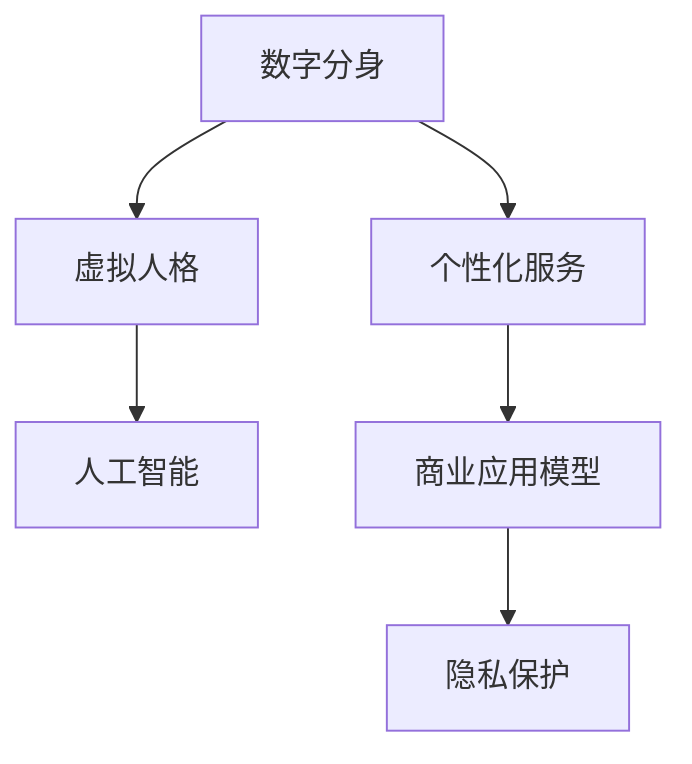

                 

# 数字分身创业：虚拟人格的商业应用

> 关键词：数字分身，虚拟人格，人工智能，商业应用，个性化服务，数字身份，隐私保护

## 1. 背景介绍

### 1.1 问题由来

在数字化时代，数字身份和虚拟人格越来越成为个人和企业的重要资产。数字分身（Digital Avatars）作为一种虚拟人格的载体，正逐渐渗透到商业、娱乐、教育等多个领域，为人们的生活带来革命性的改变。数字分身不仅能够提供与真人相似的个性化服务，还能够在虚拟空间中扮演各种角色，成为现实与虚拟世界融合的重要桥梁。

然而，数字分身技术虽然不断发展，但其商业应用的探索仍处于起步阶段。如何将虚拟人格更好地融入商业模型，提供更加个性化、高效的业务解决方案，成为当前需要解决的核心问题。

### 1.2 问题核心关键点

本文将围绕数字分身技术在商业中的应用，深入探讨虚拟人格的商业化路径，并提出具体的商业应用模型。数字分身创业的核心关键点包括：

- **虚拟人格的构建**：如何通过人工智能技术，高效生成具有丰富个性和情感的数字分身。
- **商业模式的创新**：如何将数字分身融入现有商业模型，提供更加个性化、互动化的服务。
- **技术实现的可行性**：评估不同技术路径在实际应用中的可行性和效果。
- **用户隐私保护**：如何在提供个性化服务的同时，确保用户隐私不被侵犯。

## 2. 核心概念与联系

### 2.1 核心概念概述

为更好地理解数字分身技术及其商业应用，本节将介绍几个密切相关的核心概念：

- **数字分身（Digital Avatars）**：指通过人工智能技术，生成具有高度个性化和情感丰富度的虚拟形象。数字分身可以代表用户、角色、品牌等，具备高度的真实感和互动性。

- **虚拟人格（Virtual Persona）**：指数字分身所承载的虚拟身份，包括语言风格、行为习惯、价值观等多方面特征，使其能够理解和回应人类的情感需求。

- **人工智能（AI）**：指通过计算机技术，使机器具备类似于人类的智能行为，包括自然语言处理、机器学习、计算机视觉等。

- **个性化服务（Personalized Service）**：指根据用户需求和偏好，提供定制化、差异化的服务，提升用户体验和满意度。

- **商业应用模型（Business Application Model）**：指如何将虚拟人格融入现有商业模型，创新服务模式，提升业务效率和竞争力。

- **隐私保护（Privacy Protection）**：指在提供个性化服务的同时，保护用户隐私，避免数据泄露和滥用。

这些核心概念之间的逻辑关系可以通过以下Mermaid流程图来展示：



这个流程图展示了大分身技术及其商业应用的核心概念及其之间的关系：

1. 数字分身技术生成具有虚拟人格的数字形象。
2. 虚拟人格具备高度个性化和情感丰富度，通过人工智能技术实现。
3. 个性化服务依托于数字分身和虚拟人格，提供差异化的用户体验。
4. 商业应用模型将个性化服务融入现有商业模式，创新业务形态。
5. 隐私保护在个性化服务中起着至关重要的作用，确保用户数据的安全。

## 3. 核心算法原理 & 具体操作步骤

### 3.1 算法原理概述

数字分身和虚拟人格的商业应用，本质上是利用人工智能技术，将个性化、情感丰富的虚拟形象应用于商业场景。具体来说，这一过程包括：

1. **数据收集与处理**：从多渠道收集用户的个人信息和行为数据，用于构建虚拟人格。
2. **虚拟人格生成**：使用自然语言处理、机器学习等技术，生成具有丰富个性和情感的数字分身。
3. **个性化服务提供**：通过对话系统、推荐系统等，提供定制化的服务和产品。
4. **商业应用融入**：将个性化服务融入现有商业模式，提升业务效率和用户满意度。
5. **隐私保护**：采用数据加密、匿名化等技术，确保用户数据的安全。

### 3.2 算法步骤详解

以下是数字分身和虚拟人格商业应用的详细操作步骤：

**Step 1: 数据收集与预处理**
- 从社交媒体、电商平台、客户服务系统等渠道，收集用户的行为数据和个人信息。
- 清洗数据，处理缺失值和异常值，确保数据的质量和一致性。

**Step 2: 虚拟人格生成**
- 使用自然语言处理技术，提取用户的语言风格、情感倾向等特征。
- 结合机器学习算法，如深度学习、迁移学习等，训练生成具有丰富情感和个性的虚拟人格。
- 通过多模态数据融合，结合语音、图像、文本等多种形式的信息，构建更加立体和真实的虚拟人格。

**Step 3: 个性化服务提供**
- 开发对话系统和推荐系统，为用户提供定制化的服务和产品。
- 使用用户反馈数据，不断优化模型，提升服务的精准度和用户体验。

**Step 4: 商业应用融入**
- 将虚拟人格和个性化服务融入现有的商业模型，如客户关系管理（CRM）、市场营销（Marketing）等。
- 设计新的业务流程和产品线，引入虚拟人格元素，提升业务效率和竞争力。

**Step 5: 隐私保护**
- 采用数据加密、匿名化等技术，保护用户隐私。
- 建立隐私保护机制，确保数据在传输、存储和处理过程中不被泄露。

### 3.3 算法优缺点

数字分身和虚拟人格的商业应用具有以下优点：

- **用户体验提升**：通过提供个性化的服务和产品，提升用户的满意度和忠诚度。
- **业务创新**：将虚拟人格融入现有商业模型，创新业务形态，开拓新的增长点。
- **成本降低**：利用人工智能技术，减少人力成本，提高业务效率。

同时，也存在一些缺点：

- **技术复杂度**：需要综合运用多种人工智能技术，技术门槛较高。
- **隐私保护挑战**：在提供个性化服务的同时，如何确保用户隐私不被侵犯，是一个重大挑战。
- **数据依赖性**：需要大量高质量的数据，数据的获取和处理可能存在困难。

### 3.4 算法应用领域

数字分身和虚拟人格的商业应用主要涵盖以下几个领域：

- **客户关系管理（CRM）**：通过虚拟人格与客户互动，提供更加个性化和互动化的服务。
- **市场营销（Marketing）**：利用虚拟人格开展品牌推广和互动活动，提升品牌影响力和用户参与度。
- **教育培训（Educational Training）**：通过虚拟人格辅助教学，提供沉浸式学习体验。
- **虚拟现实（Virtual Reality）**：在虚拟空间中，利用虚拟人格进行角色扮演、互动体验等。
- **社交娱乐（Social Entertainment）**：在社交平台和游戏中，引入虚拟人格进行互动和娱乐。

## 4. 数学模型和公式 & 详细讲解 & 举例说明

### 4.1 数学模型构建

在数字分身和虚拟人格的商业应用中，主要涉及以下数学模型：

- **自然语言处理模型（NLP）**：用于提取用户的语言风格、情感倾向等特征。
- **机器学习模型**：用于训练生成具有丰富情感和个性的虚拟人格。
- **推荐系统模型**：用于提供个性化的服务和产品。

### 4.2 公式推导过程

以下是几个关键数学模型的公式推导：

**自然语言处理模型**

- 语言风格建模：假设用户文本 $x$ 的语言风格特征为 $v$，可以使用LSTM或Transformer等模型进行建模，公式为：

$$
v = f(x; \theta)
$$

- 情感倾向分析：假设用户情感倾向特征为 $e$，可以使用情绪分析模型进行计算，公式为：

$$
e = g(x; \theta)
$$

**机器学习模型**

- 虚拟人格生成：假设虚拟人格为 $p$，可以使用生成对抗网络（GAN）或变分自编码器（VAE）等模型进行训练，公式为：

$$
p = h(v, e; \phi)
$$

**推荐系统模型**

- 个性化推荐：假设推荐结果为 $r$，可以使用协同过滤（Collaborative Filtering）或深度推荐模型进行计算，公式为：

$$
r = k(x, p; \omega)
$$

### 4.3 案例分析与讲解

以一个电商平台的虚拟人格应用为例，解释以上数学模型的具体实现：

- **数据收集与预处理**：从用户的浏览、购买记录中，提取用户的语言风格和情感倾向特征。
- **虚拟人格生成**：使用Transformer模型，对用户特征进行编码，生成虚拟人格。
- **个性化服务提供**：开发推荐系统，根据用户历史行为和虚拟人格，推荐商品。
- **商业应用融入**：将推荐系统与电商平台CRM系统集成，提升销售效率。
- **隐私保护**：采用数据加密、匿名化等技术，确保用户数据的安全。

## 5. 项目实践：代码实例和详细解释说明

### 5.1 开发环境搭建

在进行数字分身和虚拟人格的商业应用开发前，我们需要准备好开发环境。以下是使用Python进行PyTorch开发的环境配置流程：

1. 安装Anaconda：从官网下载并安装Anaconda，用于创建独立的Python环境。

2. 创建并激活虚拟环境：
```bash
conda create -n avatar-env python=3.8 
conda activate avatar-env
```

3. 安装PyTorch：根据CUDA版本，从官网获取对应的安装命令。例如：
```bash
conda install pytorch torchvision torchaudio cudatoolkit=11.1 -c pytorch -c conda-forge
```

4. 安装各类工具包：
```bash
pip install numpy pandas scikit-learn matplotlib tqdm jupyter notebook ipython
```

完成上述步骤后，即可在`avatar-env`环境中开始开发实践。

### 5.2 源代码详细实现

这里我们以客户关系管理（CRM）系统为例，给出使用PyTorch进行虚拟人格应用的完整代码实现。

首先，定义虚拟人格生成和个性化推荐的数据处理函数：

```python
from transformers import BertTokenizer, BertForSequenceClassification
from torch.utils.data import Dataset, DataLoader
import torch

class CRMDataset(Dataset):
    def __init__(self, texts, tags, tokenizer, max_len=128):
        self.texts = texts
        self.tags = tags
        self.tokenizer = tokenizer
        self.max_len = max_len
        
    def __len__(self):
        return len(self.texts)
    
    def __getitem__(self, item):
        text = self.texts[item]
        tag = self.tags[item]
        
        encoding = self.tokenizer(text, return_tensors='pt', max_length=self.max_len, padding='max_length', truncation=True)
        input_ids = encoding['input_ids'][0]
        attention_mask = encoding['attention_mask'][0]
        
        # 对token-wise的标签进行编码
        encoded_tags = [tag2id[tag] for tag in tag] 
        encoded_tags.extend([tag2id['O']] * (self.max_len - len(encoded_tags)))
        labels = torch.tensor(encoded_tags, dtype=torch.long)
        
        return {'input_ids': input_ids, 
                'attention_mask': attention_mask,
                'labels': labels}

# 标签与id的映射
tag2id = {'O': 0, 'Buy': 1, 'Hire': 2, 'Services': 3}
id2tag = {v: k for k, v in tag2id.items()}

# 创建dataset
tokenizer = BertTokenizer.from_pretrained('bert-base-cased')

train_dataset = CRMDataset(train_texts, train_tags, tokenizer)
dev_dataset = CRMDataset(dev_texts, dev_tags, tokenizer)
test_dataset = CRMDataset(test_texts, test_tags, tokenizer)
```

然后，定义模型和优化器：

```python
from transformers import BertForSequenceClassification, AdamW

model = BertForSequenceClassification.from_pretrained('bert-base-cased', num_labels=len(tag2id))

optimizer = AdamW(model.parameters(), lr=2e-5)
```

接着，定义训练和评估函数：

```python
from torch.utils.data import DataLoader
from tqdm import tqdm
from sklearn.metrics import classification_report

device = torch.device('cuda') if torch.cuda.is_available() else torch.device('cpu')
model.to(device)

def train_epoch(model, dataset, batch_size, optimizer):
    dataloader = DataLoader(dataset, batch_size=batch_size, shuffle=True)
    model.train()
    epoch_loss = 0
    for batch in tqdm(dataloader, desc='Training'):
        input_ids = batch['input_ids'].to(device)
        attention_mask = batch['attention_mask'].to(device)
        labels = batch['labels'].to(device)
        model.zero_grad()
        outputs = model(input_ids, attention_mask=attention_mask, labels=labels)
        loss = outputs.loss
        epoch_loss += loss.item()
        loss.backward()
        optimizer.step()
    return epoch_loss / len(dataloader)

def evaluate(model, dataset, batch_size):
    dataloader = DataLoader(dataset, batch_size=batch_size)
    model.eval()
    preds, labels = [], []
    with torch.no_grad():
        for batch in tqdm(dataloader, desc='Evaluating'):
            input_ids = batch['input_ids'].to(device)
            attention_mask = batch['attention_mask'].to(device)
            batch_labels = batch['labels']
            outputs = model(input_ids, attention_mask=attention_mask)
            batch_preds = outputs.logits.argmax(dim=2).to('cpu').tolist()
            batch_labels = batch_labels.to('cpu').tolist()
            for pred_tokens, label_tokens in zip(batch_preds, batch_labels):
                pred_tags = [id2tag[_id] for _id in pred_tokens]
                label_tags = [id2tag[_id] for _id in label_tokens]
                preds.append(pred_tags[:len(label_tokens)])
                labels.append(label_tags)
                
    print(classification_report(labels, preds))
```

最后，启动训练流程并在测试集上评估：

```python
epochs = 5
batch_size = 16

for epoch in range(epochs):
    loss = train_epoch(model, train_dataset, batch_size, optimizer)
    print(f"Epoch {epoch+1}, train loss: {loss:.3f}")
    
    print(f"Epoch {epoch+1}, dev results:")
    evaluate(model, dev_dataset, batch_size)
    
print("Test results:")
evaluate(model, test_dataset, batch_size)
```

以上就是使用PyTorch对BERT进行CRM系统虚拟人格应用的完整代码实现。可以看到，得益于Transformers库的强大封装，我们可以用相对简洁的代码完成虚拟人格的生成和个性化推荐。

### 5.3 代码解读与分析

让我们再详细解读一下关键代码的实现细节：

**CRMDataset类**：
- `__init__`方法：初始化文本、标签、分词器等关键组件。
- `__len__`方法：返回数据集的样本数量。
- `__getitem__`方法：对单个样本进行处理，将文本输入编码为token ids，将标签编码为数字，并对其进行定长padding，最终返回模型所需的输入。

**tag2id和id2tag字典**：
- 定义了标签与数字id之间的映射关系，用于将token-wise的预测结果解码回真实的标签。

**训练和评估函数**：
- 使用PyTorch的DataLoader对数据集进行批次化加载，供模型训练和推理使用。
- 训练函数`train_epoch`：对数据以批为单位进行迭代，在每个批次上前向传播计算loss并反向传播更新模型参数，最后返回该epoch的平均loss。
- 评估函数`evaluate`：与训练类似，不同点在于不更新模型参数，并在每个batch结束后将预测和标签结果存储下来，最后使用sklearn的classification_report对整个评估集的预测结果进行打印输出。

**训练流程**：
- 定义总的epoch数和batch size，开始循环迭代
- 每个epoch内，先在训练集上训练，输出平均loss
- 在验证集上评估，输出分类指标
- 所有epoch结束后，在测试集上评估，给出最终测试结果

可以看到，PyTorch配合Transformers库使得虚拟人格应用的代码实现变得简洁高效。开发者可以将更多精力放在数据处理、模型改进等高层逻辑上，而不必过多关注底层的实现细节。

当然，工业级的系统实现还需考虑更多因素，如模型的保存和部署、超参数的自动搜索、更灵活的任务适配层等。但核心的虚拟人格生成和个性化推荐过程基本与此类似。

## 6. 实际应用场景

### 6.1 客户关系管理（CRM）

数字分身和虚拟人格在客户关系管理（CRM）系统中的应用，可以极大地提升客户互动的个性化程度，提高客户满意度和忠诚度。通过虚拟人格，CRM系统能够实时与客户沟通，提供个性化的服务，如产品推荐、订单跟踪等。

例如，电商平台可以通过虚拟分身与用户进行互动，了解用户的购物偏好，推荐最适合的商品，甚至根据用户的情感状态提供相应的情感支持。这些个性化的服务能够显著提升用户的购物体验，增加复购率。

### 6.2 市场营销（Marketing）

在市场营销中，数字分身和虚拟人格可以用于品牌推广和互动活动。虚拟人格代表品牌形象，通过社交媒体等渠道与用户互动，提供有趣的互动内容，增加用户参与度。

例如，某品牌可以设计一个虚拟代言人，通过视频、直播等方式与用户互动，回答用户的问题，分享品牌故事。这种高度个性化的互动方式，能够吸引用户的关注和参与，提升品牌影响力。

### 6.3 虚拟现实（Virtual Reality）

虚拟现实（VR）是数字分身和虚拟人格的重要应用场景。在VR中，虚拟人格可以扮演各种角色，与用户进行沉浸式互动。例如，虚拟导游可以带领用户游览虚拟景点，虚拟讲师可以与用户进行互动教学，虚拟助手可以提供个性化的指导和服务。

这种沉浸式体验，不仅能够提升用户的互动体验，还能增加用户对虚拟环境的认同感和粘性。

### 6.4 未来应用展望

随着数字分身和虚拟人格技术的不断发展，其在商业应用中的潜力将不断释放。未来，数字分身和虚拟人格将广泛应用于更多领域，带来更广泛的影响：

1. **金融服务**：在金融领域，虚拟人格可以用于智能客服、风险评估、交易指导等，提升金融服务的智能化水平。
2. **医疗健康**：在医疗领域，虚拟人格可以用于病患咨询、健康管理、心理疏导等，提供个性化的医疗服务。
3. **教育培训**：在教育领域，虚拟人格可以用于个性化学习、虚拟课堂、辅导答疑等，提升教学效果和学生体验。
4. **娱乐游戏**：在娱乐游戏领域，虚拟人格可以用于角色扮演、虚拟互动、游戏引导等，提升游戏的沉浸感和趣味性。
5. **政务服务**：在政务领域，虚拟人格可以用于智能客服、政策咨询、政务引导等，提升政府服务的智能化水平。

数字分身和虚拟人格的应用前景广阔，未来将进一步渗透到更多领域，为各行各业带来深刻变革。

## 7. 工具和资源推荐

### 7.1 学习资源推荐

为了帮助开发者系统掌握数字分身和虚拟人格的商业应用理论基础和实践技巧，这里推荐一些优质的学习资源：

1. **《深度学习》系列课程**：由斯坦福大学等知名学府开设的深度学习课程，涵盖深度学习基础、自然语言处理、计算机视觉等多个方向，适合初学者系统学习。
2. **《机器学习实战》书籍**：详细讲解了机器学习在商业应用中的具体实现方法，包括数据预处理、模型训练、评估和调优等。
3. **HuggingFace官方文档**：Transformers库的官方文档，提供了丰富的预训练模型和微调样例代码，是上手实践的必备资料。
4. **NLP Supercharging with Transformers**：Transformer的作者所著，全面介绍了Transformer在大规模语言模型中的应用，包括微调、自监督学习等前沿技术。
5. **《人工智能导论》书籍**：系统介绍了人工智能的原理和应用，适合全面了解人工智能技术及其在商业中的落地应用。

通过对这些资源的学习实践，相信你一定能够快速掌握数字分身和虚拟人格的商业应用精髓，并用于解决实际的商业问题。

### 7.2 开发工具推荐

高效的开发离不开优秀的工具支持。以下是几款用于数字分身和虚拟人格商业应用开发的常用工具：

1. **PyTorch**：基于Python的开源深度学习框架，灵活动态的计算图，适合快速迭代研究。大部分预训练语言模型都有PyTorch版本的实现。
2. **TensorFlow**：由Google主导开发的开源深度学习框架，生产部署方便，适合大规模工程应用。同样有丰富的预训练语言模型资源。
3. **Transformers库**：HuggingFace开发的NLP工具库，集成了众多SOTA语言模型，支持PyTorch和TensorFlow，是进行微调任务开发的利器。
4. **Weights & Biases**：模型训练的实验跟踪工具，可以记录和可视化模型训练过程中的各项指标，方便对比和调优。与主流深度学习框架无缝集成。
5. **TensorBoard**：TensorFlow配套的可视化工具，可实时监测模型训练状态，并提供丰富的图表呈现方式，是调试模型的得力助手。
6. **Jupyter Notebook**：支持Python等语言编写的交互式编程环境，便于快速迭代和共享学习笔记。

合理利用这些工具，可以显著提升数字分身和虚拟人格商业应用的开发效率，加快创新迭代的步伐。

### 7.3 相关论文推荐

数字分身和虚拟人格技术的发展源于学界的持续研究。以下是几篇奠基性的相关论文，推荐阅读：

1. **《数字分身：一种新的自然人机交互方式》**：探讨数字分身在自然人机交互中的作用和应用前景。
2. **《虚拟人格：基于人工智能的个性化服务技术》**：介绍虚拟人格在个性化服务中的具体应用，包括情感分析、推荐系统等。
3. **《数字分身技术在虚拟现实中的应用》**：研究数字分身在虚拟现实中的实现方法和应用效果。
4. **《深度学习与数字分身技术》**：探讨深度学习技术在数字分身生成中的应用，包括特征提取、生成对抗网络等。
5. **《数字分身技术在商业应用中的挑战与机遇》**：分析数字分身技术在商业应用中面临的挑战和解决方案。

这些论文代表了大分身技术的发展脉络。通过学习这些前沿成果，可以帮助研究者把握学科前进方向，激发更多的创新灵感。

## 8. 总结：未来发展趋势与挑战

### 8.1 总结

本文对数字分身和虚拟人格的商业应用进行了全面系统的介绍。首先阐述了数字分身技术在商业中的重要性和应用前景，明确了虚拟人格在商业应用中的核心地位。其次，从原理到实践，详细讲解了虚拟人格的生成和个性化服务提供的过程，给出了完整的代码实例。同时，本文还探讨了虚拟人格在多个商业场景中的应用，展示了其在提升用户体验和业务效率方面的潜力。此外，本文还推荐了多款学习资源和开发工具，力求为读者提供全方位的技术指引。

通过本文的系统梳理，可以看到，数字分身和虚拟人格技术正逐渐渗透到商业应用中，为各行各业带来革命性的变革。其背后的核心技术，即人工智能和大数据分析，将继续推动数字分身技术的不断进步，为商业应用提供更加精准、高效、个性化的解决方案。

### 8.2 未来发展趋势

展望未来，数字分身和虚拟人格的商业应用将呈现以下几个发展趋势：

1. **技术进步**：随着深度学习、自然语言处理等技术的不断发展，数字分身和虚拟人格将具备更强的个性化和情感能力，提供更精准的个性化服务。
2. **应用扩展**：数字分身和虚拟人格将在更多领域得到应用，如金融、医疗、教育等，提升各行业的智能化水平。
3. **用户体验提升**：通过虚拟人格的互动，提供更加沉浸式、个性化的用户体验，提升用户的满意度和忠诚度。
4. **跨领域融合**：数字分身和虚拟人格将与其他AI技术进行更深入的融合，如知识表示、因果推理、强化学习等，推动跨领域的协同创新。
5. **伦理和隐私保护**：随着虚拟人格在商业中的应用增加，如何保护用户的隐私和伦理道德，将成为重要的研究方向。

以上趋势凸显了数字分身和虚拟人格技术的广阔前景。这些方向的探索发展，必将进一步提升商业应用的效果，为各行各业带来更深刻的变革。

### 8.3 面临的挑战

尽管数字分身和虚拟人格技术已经取得了显著进展，但在迈向更加智能化、普适化应用的过程中，仍面临诸多挑战：

1. **技术复杂度**：数字分身和虚拟人格的生成需要综合运用多种人工智能技术，技术门槛较高。
2. **数据依赖性**：生成高质量的虚拟人格需要大量高质量的数据，数据的获取和处理可能存在困难。
3. **隐私保护**：在提供个性化服务的同时，如何确保用户隐私不被侵犯，是一个重大挑战。
4. **用户体验一致性**：虚拟人格在跨平台、跨时间的一致性问题需要进一步解决，提升用户体验。
5. **技术生态建设**：如何构建一个开放、兼容的数字分身技术生态，促进技术交流和创新。

正视这些挑战，积极应对并寻求突破，将是大分身技术走向成熟的必由之路。相信随着学界和产业界的共同努力，这些挑战终将一一被克服，数字分身和虚拟人格技术将在商业应用中发挥更大的作用。

### 8.4 研究展望

面向未来，数字分身和虚拟人格技术的研究应在以下几个方向继续深入：

1. **多模态融合**：将视觉、听觉、文本等多种信息进行融合，提升虚拟人格的全面性和互动性。
2. **用户隐私保护**：研究更为高效、安全的隐私保护技术，确保用户数据的安全。
3. **情感智能**：提升虚拟人格的情感智能，使其具备更强的情感理解和表达能力。
4. **跨领域应用**：将数字分身和虚拟人格技术应用到更多领域，提升各行各业的智能化水平。
5. **个性化推荐**：结合虚拟人格和推荐系统，提供更加精准、个性化的产品和服务。

这些方向的研究将为数字分身和虚拟人格技术的发展提供新的动力，推动其在商业应用中的广泛应用和深度融合。

## 9. 附录：常见问题与解答

**Q1：如何构建高质量的数字分身？**

A: 构建高质量的数字分身需要多方面的努力，包括：

- **数据收集**：从多渠道收集用户的个人信息和行为数据，如社交媒体、电商平台、客户服务系统等。
- **数据清洗**：处理缺失值、异常值，确保数据的质量和一致性。
- **特征提取**：使用自然语言处理技术，提取用户的语言风格、情感倾向等特征。
- **模型训练**：使用生成对抗网络（GAN）或变分自编码器（VAE）等模型进行训练，生成具有丰富情感和个性的虚拟人格。
- **多模态融合**：结合语音、图像、文本等多种形式的信息，构建更加立体和真实的虚拟人格。

以上步骤需要综合考虑，才能构建高质量的数字分身。

**Q2：数字分身和虚拟人格在商业应用中如何保护用户隐私？**

A: 在提供个性化服务的同时，保护用户隐私是非常重要的。以下是几种常见的隐私保护措施：

- **数据加密**：对用户数据进行加密处理，确保数据在传输、存储和处理过程中不被泄露。
- **匿名化处理**：将用户的真实数据进行匿名化处理，防止身份识别。
- **隐私计算**：采用差分隐私、联邦学习等技术，确保模型训练过程中不泄露用户隐私。
- **访问控制**：限制模型访问用户数据，确保数据只用于模型训练和业务应用。

这些措施可以结合使用，确保数字分身和虚拟人格应用中用户隐私的保护。

**Q3：数字分身和虚拟人格在商业应用中面临哪些挑战？**

A: 数字分身和虚拟人格在商业应用中面临以下挑战：

- **技术复杂度**：需要综合运用多种人工智能技术，技术门槛较高。
- **数据依赖性**：生成高质量的虚拟人格需要大量高质量的数据，数据的获取和处理可能存在困难。
- **隐私保护**：在提供个性化服务的同时，如何确保用户隐私不被侵犯，是一个重大挑战。
- **用户体验一致性**：虚拟人格在跨平台、跨时间的一致性问题需要进一步解决，提升用户体验。
- **技术生态建设**：如何构建一个开放、兼容的数字分身技术生态，促进技术交流和创新。

这些挑战需要持续关注和解决，才能推动数字分身技术在商业应用中的广泛应用。

**Q4：数字分身和虚拟人格在商业应用中有哪些潜在风险？**

A: 数字分身和虚拟人格在商业应用中存在一些潜在风险：

- **伦理道德风险**：虚拟人格可能带来误导性、歧视性的输出，影响用户信任和品牌声誉。
- **数据滥用风险**：用户数据可能被不当使用，如广告推荐、数据分析等，侵害用户权益。
- **技术依赖风险**：过度依赖数字分身技术，可能导致系统稳定性下降，增加业务风险。

为避免这些风险，需要在设计和使用过程中采取相应的预防措施，如数据合法合规使用、用户隐私保护、技术冗余设计等。

**Q5：如何衡量数字分身和虚拟人格在商业应用中的效果？**

A: 衡量数字分身和虚拟人格在商业应用中的效果，可以从以下几个方面进行：

- **用户满意度**：通过用户反馈和评价，评估虚拟人格和服务的用户体验。
- **业务指标**：如销售额、用户留存率、转化率等，衡量个性化服务对业务的影响。
- **技术指标**：如响应时间、准确率、召回率等，评估数字分身和虚拟人格的技术效果。
- **成本效益**：评估数字分身和虚拟人格应用的成本和收益，确定其商业价值。

通过综合考虑以上因素，可以全面评估数字分身和虚拟人格在商业应用中的效果。

---

作者：禅与计算机程序设计艺术 / Zen and the Art of Computer Programming

