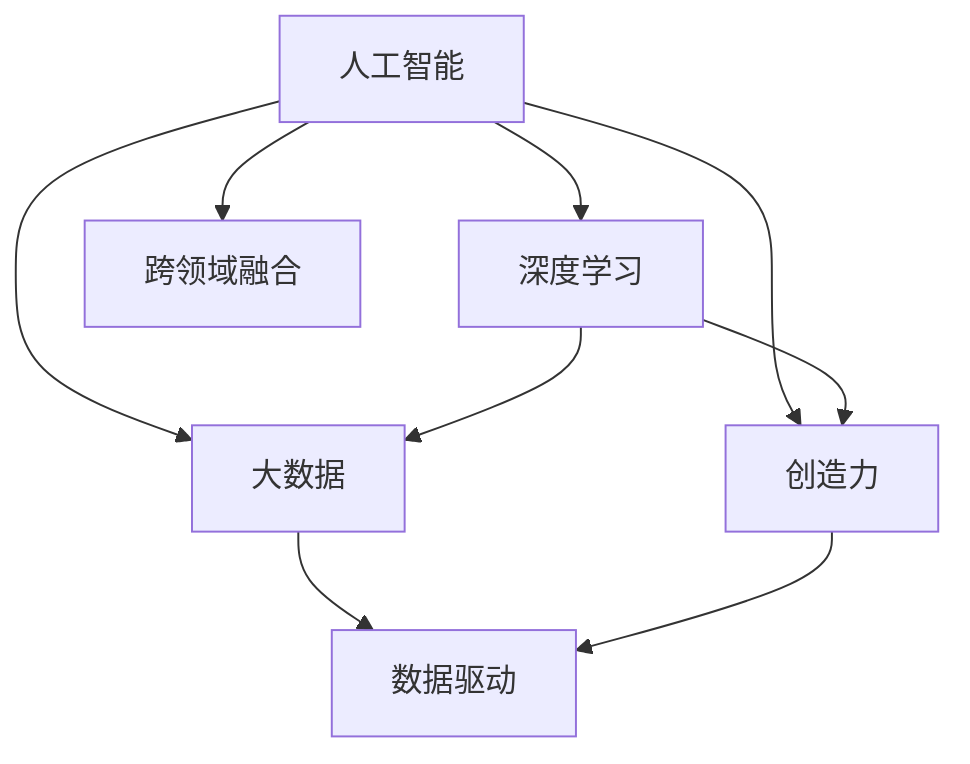

                 

# 数字化创造力：AI激发人类想象

> 关键词：数字化,人工智能,创造力,人类想象力,数据驱动,AI应用,机器学习,深度学习,大数据,工业4.0,智能系统,自动化,协同创新,算法创新,前沿技术,技术融合

## 1. 背景介绍

### 1.1 问题由来

数字化转型正在深刻改变我们的世界。随着信息化技术的高速发展，机器学习、深度学习、大数据等新兴技术不断涌现，为各行各业注入了前所未有的活力。在这个过程中，人工智能（AI）成为引领变革的重要引擎。它不仅在传统制造、金融、医疗等领域推动产业升级，更在艺术、娱乐、设计等文化领域催生了新的创意和表达方式。

从《AI科技革命》到《未来简史》，从《黑客与画家》到《未来之路》，技术思想家们关于AI对未来社会的影响进行了种种畅想。他们认为，AI不仅能改善人类生活，还能激发人类想象力，开启一场创造性的革命。而这场革命的关键，就是如何更好地利用数字化技术，将AI与人类创造力相结合，推动数字化创造力的发展。

### 1.2 问题核心关键点

数字化创造力是指利用数字化技术，特别是AI、机器学习、深度学习等新兴技术，结合人类想象力，创造出前所未有的产品、服务、体验等的过程。数字化创造力强调技术与人文、艺术、创意的深度融合，通过数据驱动的方式，将人类思维中的灵感转化为现实世界的创新成果。

数字化创造力的核心关键点包括：
- **数字化技术**：包括AI、机器学习、深度学习、大数据、自然语言处理等。
- **人类想象力**：创造力的源泉，是人类在面对复杂世界时所展现出的独特思考和表达方式。
- **数据驱动**：通过数据挖掘、分析，发现新的模式和趋势，为创新提供支撑。
- **跨领域融合**：将不同领域的知识、技术、创意进行有机结合，产生全新的产品和服务。

## 2. 核心概念与联系

### 2.1 核心概念概述

为更好地理解数字化创造力的核心概念，本节将介绍几个密切相关的关键概念：

- **人工智能**：利用机器学习、深度学习等技术，使计算机具备类人智能，能够进行模式识别、决策分析、语言理解等任务。
- **深度学习**：一种基于神经网络的机器学习方法，通过多层次的特征提取和转换，实现对复杂数据的处理和分析。
- **大数据**：指规模庞大、类型多样的数据集合，通过对这些数据的挖掘和分析，可以发现新的知识和规律。
- **创造力**：人类在面对未知、解决复杂问题时，通过独特的思考和表达，产生创新成果的能力。
- **数据驱动**：通过数据驱动决策，利用数据分析结果指导创新活动，提高创新效率和效果。
- **跨领域融合**：将不同领域的技术、知识、方法进行有机结合，实现创新突破。

这些概念之间的逻辑关系可以通过以下Mermaid流程图来展示：



这个流程图展示了大数字化创造力的核心概念及其之间的关系：

1. 人工智能、深度学习和大数据是技术基础，提供了实现数字化创造力的工具和方法。
2. 创造力是人类思维的产物，是数字化创造力的源泉。
3. 数据驱动是技术应用的指导原则，确保创新方向和效率。
4. 跨领域融合是实现创新突破的关键，通过技术与人文的结合，激发新一轮的创新浪潮。

## 3. 核心算法原理 & 具体操作步骤
### 3.1 算法原理概述

数字化创造力主要依赖于人工智能、深度学习和数据分析技术，通过算法创新和跨领域融合，将人类想象力转化为实际应用。数字化创造力的核心算法原理主要包括以下几个方面：

- **数据预处理**：通过对原始数据进行清洗、归一化、特征提取等预处理，为后续模型训练和分析提供高质量的数据。
- **模型训练**：利用深度学习等技术，对大量数据进行训练，得到能够识别模式、进行预测的模型。
- **知识图谱构建**：通过构建知识图谱，将人类知识和经验转化为机器可理解的图结构，支持智能推理和决策。
- **自然语言处理（NLP）**：利用NLP技术，实现对人类语言的理解和生成，支持文本分析、情感分析、聊天机器人等功能。
- **人机交互设计**：通过设计符合人类认知和操作习惯的交互界面，提升用户体验和交互效率。
- **创造性生成**：利用生成对抗网络（GAN）、变分自编码器（VAE）等技术，实现对创意和艺术的生成，支持生成音乐、绘画、文字等。

### 3.2 算法步骤详解

数字化创造力的算法步骤主要包括以下几个环节：

1. **数据收集和预处理**：从互联网、社交媒体、企业数据等渠道收集原始数据，并对其进行清洗、归一化、特征提取等预处理操作，确保数据的质量和可用性。
2. **模型训练和优化**：选择合适的深度学习模型，对预处理后的数据进行训练，并通过超参数调优、正则化等手段，提升模型性能。
3. **知识图谱构建和应用**：通过构建知识图谱，将人类知识和经验转化为机器可理解的图结构，支持智能推理和决策。
4. **自然语言处理（NLP）技术应用**：利用NLP技术，实现对人类语言的理解和生成，支持文本分析、情感分析、聊天机器人等功能。
5. **人机交互设计**：通过设计符合人类认知和操作习惯的交互界面，提升用户体验和交互效率。
6. **创造性生成和应用**：利用生成对抗网络（GAN）、变分自编码器（VAE）等技术，实现对创意和艺术的生成，支持生成音乐、绘画、文字等。

### 3.3 算法优缺点

数字化创造力主要依赖于人工智能、深度学习和数据分析技术，通过算法创新和跨领域融合，将人类想象力转化为实际应用。数字化创造力的算法步骤主要包括以下几个环节：

- **优点**：
  - 创新速度快：通过算法和数据驱动的方式，可以快速实现创新突破。
  - 成本低：相比于传统的人类手工创新，数字化创造力能够大幅降低成本。
  - 应用广泛：可以应用于多个领域，如艺术、设计、制造、医疗等。
  - 跨领域融合：能够将不同领域的知识和技术进行有机结合，产生全新的创新成果。

- **缺点**：
  - 依赖高质量数据：数据质量和数量直接影响创新效果，高质量数据的获取成本较高。
  - 算法复杂度：深度学习等算法的复杂度较高，需要专业人才进行开发和维护。
  - 人类创造力的缺失：数字化创造力无法完全替代人类创造力，某些创新仍需要人类的独特思维和判断。

### 3.4 算法应用领域

数字化创造力已经广泛应用于多个领域，包括但不限于：

- **艺术与设计**：利用生成对抗网络（GAN）、变分自编码器（VAE）等技术，生成艺术作品、设计方案等。
- **娱乐与媒体**：利用NLP技术，实现智能推荐、自动生成内容等。
- **制造与生产**：利用AI和大数据，优化生产流程、提高产品质量等。
- **医疗与健康**：利用AI技术，进行疾病预测、个性化治疗、医疗影像分析等。
- **金融与经济**：利用AI和大数据，进行市场分析、风险管理、客户服务优化等。
- **教育与学习**：利用AI和大数据，进行个性化教学、智能评估、学习推荐等。

## 4. 数学模型和公式 & 详细讲解  
### 4.1 数学模型构建

数字化创造力的数学模型主要基于深度学习和大数据技术，通过数据驱动的方式，实现对创新活动的预测和优化。

记训练数据集为 $D=\{(x_i, y_i)\}_{i=1}^N$，其中 $x_i$ 为输入特征，$y_i$ 为标签或目标变量。假设模型为 $f(x; \theta)$，其中 $\theta$ 为模型参数，$\theta$ 通过最小化损失函数 $\mathcal{L}(\theta)$ 进行训练，目标是最小化损失函数 $\mathcal{L}(\theta)$。

假设模型为线性回归模型，目标是最小化均方误差损失函数：

$$
\mathcal{L}(\theta) = \frac{1}{N} \sum_{i=1}^N (y_i - f(x_i; \theta))^2
$$

通过梯度下降等优化算法，对模型参数 $\theta$ 进行迭代优化，直至损失函数 $\mathcal{L}(\theta)$ 收敛于最小值。

### 4.2 公式推导过程

以下以线性回归模型为例，推导其梯度下降算法的公式。

假设模型为线性回归模型：$f(x; \theta) = \theta_0 + \theta_1 x_1 + \theta_2 x_2 + \cdots + \theta_n x_n$。

目标是最小化均方误差损失函数：

$$
\mathcal{L}(\theta) = \frac{1}{N} \sum_{i=1}^N (y_i - f(x_i; \theta))^2
$$

其对 $\theta_j$ 的偏导数为：

$$
\frac{\partial \mathcal{L}(\theta)}{\partial \theta_j} = \frac{2}{N} \sum_{i=1}^N (y_i - f(x_i; \theta))x_{ij}
$$

其中 $x_{ij}$ 表示第 $i$ 个样本的第 $j$ 个特征。

根据梯度下降算法，每次迭代更新模型参数 $\theta$ 的公式为：

$$
\theta_j \leftarrow \theta_j - \eta \frac{\partial \mathcal{L}(\theta)}{\partial \theta_j}
$$

其中 $\eta$ 为学习率，控制每次迭代更新的步长。

通过不断迭代更新模型参数，直至损失函数 $\mathcal{L}(\theta)$ 收敛于最小值，得到最优的模型参数 $\theta^*$。

### 4.3 案例分析与讲解

以生成对抗网络（GAN）为例，展示其生成艺术作品的过程。

GAN由生成器（Generator）和判别器（Discriminator）两部分组成。生成器的目标是通过输入随机噪声 $z$，生成与真实数据分布接近的伪造数据 $x_g$。判别器的目标是将生成数据与真实数据区分开来，生成器则希望生成的数据能够欺骗判别器，即最大化生成数据的似然。

在训练过程中，生成器和判别器交替优化，直至生成器生成的数据能够欺骗判别器，即生成器的损失函数 $L_G$ 最小化，同时判别器的损失函数 $L_D$ 最大化。最终得到的生成器 $G(z)$ 可以用于生成高质量的艺术作品。

## 5. 项目实践：代码实例和详细解释说明
### 5.1 开发环境搭建

在进行数字化创造力实践前，我们需要准备好开发环境。以下是使用Python进行TensorFlow开发的环境配置流程：

1. 安装Anaconda：从官网下载并安装Anaconda，用于创建独立的Python环境。

2. 创建并激活虚拟环境：
```bash
conda create -n tf-env python=3.8 
conda activate tf-env
```

3. 安装TensorFlow：根据CUDA版本，从官网获取对应的安装命令。例如：
```bash
conda install tensorflow -c conda-forge -c pytorch
```

4. 安装相关的Python包：
```bash
pip install numpy scipy scikit-learn matplotlib seaborn
```

完成上述步骤后，即可在`tf-env`环境中开始数字化创造力实践。

### 5.2 源代码详细实现

下面我们以GAN生成艺术作品为例，给出使用TensorFlow对GAN模型进行训练的PyTorch代码实现。

```python
import tensorflow as tf
from tensorflow.keras.layers import Input, Dense, Reshape, Flatten, Dropout
from tensorflow.keras.models import Model
import numpy as np
import matplotlib.pyplot as plt
import os

# 定义生成器模型
def make_generator_model():
    model = tf.keras.Sequential()
    model.add(Dense(256, input_dim=100, activation='relu'))
    model.add(Dense(512, activation='relu'))
    model.add(Dense(1024, activation='relu'))
    model.add(Reshape((8, 8, 256)))
    model.add(tf.keras.layers.Conv2DTranspose(128, (5, 5), strides=(1, 1), padding='same', activation='relu'))
    model.add(tf.keras.layers.Conv2DTranspose(64, (5, 5), strides=(2, 2), padding='same', activation='relu'))
    model.add(tf.keras.layers.Conv2DTranspose(1, (5, 5), strides=(2, 2), padding='same', activation='tanh'))
    return model

# 定义判别器模型
def make_discriminator_model():
    model = tf.keras.Sequential()
    model.add(Flatten(input_shape=(28, 28, 1)))
    model.add(Dense(512, activation='relu'))
    model.add(Dropout(0.4))
    model.add(Dense(512, activation='relu'))
    model.add(Dropout(0.4))
    model.add(Dense(1, activation='sigmoid'))
    return model

# 定义GAN模型
def make_gan_model():
    discriminator = make_discriminator_model()
    generator = make_generator_model()
    discriminator.trainable = False
    input = Input(shape=(100,))
    generated_image = generator(input)
    validity = discriminator(generated_image)
    gan = Model(input, validity)
    return gan

# 定义损失函数
cross_entropy = tf.keras.losses.BinaryCrossentropy(from_logits=True)

def train_model(gan, dataset, epochs, batch_size):
    noise = tf.random.normal([batch_size, 100])

    @tf.function
    def train_step(images):
        noise = tf.random.normal([batch_size, 100])
        with tf.GradientTape() as gen_tape, tf.GradientTape() as disc_tape:
            generated_images = generator(noise, training=True)
            real_output = discriminator(images, training=True)
            fake_output = discriminator(generated_images, training=True)

            gen_loss = cross_entropy(fake_output, tf.ones_like(fake_output))
            disc_loss = cross_entropy(real_output, tf.ones_like(real_output)) + cross_entropy(fake_output, tf.zeros_like(fake_output))
            gradients_of_generator = gen_tape.gradient(gen_loss, generator.trainable_variables)
            gradients_of_discriminator = disc_tape.gradient(disc_loss, discriminator.trainable_variables)
        trainable_variables = discriminator.trainable_variables + generator.trainable_variables
        apply_gradients = [tf.keras.optimizers.Adam(1e-4).apply_gradients(zip(gradients_of_generator, trainable_variables)), tf.keras.optimizers.Adam(1e-4).apply_gradients(zip(gradients_of_discriminator, trainable_variables))]
        return gen_loss, disc_loss

    for epoch in range(epochs):
        epoch_losses = []
        for images in dataset:
            gen_loss, disc_loss = train_step(images)
            epoch_losses.append(gen_loss.numpy() + disc_loss.numpy())

    print('Epoch ' + str(epoch) + ', loss: ' + str(np.mean(epoch_losses)))

# 加载数据集
mnist = tf.keras.datasets.mnist
(x_train, y_train), (x_test, y_test) = mnist.load_data()
x_train = x_train / 255.0
x_test = x_test / 255.0

# 训练模型
gan = make_gan_model()
train_model(gan, x_train, epochs=100, batch_size=32)

# 生成艺术作品
generated_images = generator.predict(noise)
fig, ax = plt.subplots(figsize=(4, 4))
plt.imshow(generated_images[0, :, :, 0], cmap='gray')
plt.show()
```

以上就是使用TensorFlow对GAN模型进行艺术作品生成的完整代码实现。可以看到，TensorFlow提供了强大的深度学习框架和丰富的API支持，使得GAN模型的实现变得相对简单。

### 5.3 代码解读与分析

让我们再详细解读一下关键代码的实现细节：

**make_generator_model()**：
- 定义生成器模型，使用多个全连接层进行特征提取和转换，最终输出生成的图像。
- 使用Reshape层将输出形状调整为28x28x1的图像。
- 使用卷积转置层进行上采样，生成256x256x1的图像。

**make_discriminator_model()**：
- 定义判别器模型，使用多个全连接层进行特征提取和分类，输出一个二分类结果。
- 使用Dropout层减少过拟合。
- 使用Sigmoid函数进行输出，预测输入图像是真实还是生成的。

**make_gan_model()**：
- 将生成器和判别器模型进行组合，形成GAN模型。
- 将判别器的输出作为GAN模型的输出。

**train_model()**：
- 定义损失函数，使用二元交叉熵进行计算。
- 使用梯度下降算法，交替优化生成器和判别器。
- 使用Adam优化器进行参数更新。

**mnist.load_data()**：
- 加载MNIST数据集，获取训练集和测试集。

**x_train = x_train / 255.0**：
- 对训练数据进行归一化处理，使其在0-1之间。

**train_model(gan, x_train, epochs=100, batch_size=32)**：
- 训练GAN模型，设置迭代轮数和批大小。

**generator.predict(noise)**：
- 使用训练好的生成器模型，对随机噪声进行生成，得到图像。

可以看到，TensorFlow提供了丰富的API和工具，可以方便地进行深度学习模型的开发和训练。结合GAN模型生成艺术作品的过程，可以帮助读者更好地理解数字化创造力的实现。

## 6. 实际应用场景
### 6.1 智能艺术创作

数字化创造力在智能艺术创作领域具有广阔的应用前景。传统的艺术创作需要艺术家通过长期的学习和实践，不断积累经验和技巧。而数字化创造力可以通过AI和大数据技术，快速生成高质量的艺术作品。

在实践中，可以利用生成对抗网络（GAN）等技术，结合风格迁移、图像生成等方法，自动生成绘画、音乐、视频等艺术作品。例如，通过GAN将梵高的画作风格应用到现实照片中，生成具有梵高风格的照片。利用深度学习生成音乐作品，甚至可以在未来创作出全新的音乐风格。

### 6.2 设计创新

数字化创造力在产品设计、时尚设计等领域也具有重要应用。利用AI和大数据技术，可以快速生成设计方案、优化设计流程，提升设计效率和质量。

在实践中，可以利用生成对抗网络（GAN）生成设计草图，使用自然语言处理（NLP）技术进行设计方案的自动生成。例如，通过GAN生成多个设计方案，使用NLP技术自动描述每个方案的特点和优缺点，帮助设计师快速筛选出最合适的方案。利用深度学习进行自动优化，生成最优的设计方案。

### 6.3 制造优化

数字化创造力在制造领域也具有重要应用。利用AI和大数据技术，可以优化生产流程、提高产品质量，实现智能制造。

在实践中，可以利用AI进行生产流程的优化，提高生产效率和产品质量。例如，通过深度学习进行预测性维护，提前发现设备故障，减少停机时间。利用AI进行质量检测，自动筛选出不合格产品，提高产品质量。

### 6.4 未来应用展望

随着数字化创造力的不断演进，未来将在更多领域得到应用，为人类生产生活方式带来深远影响。

在智慧医疗领域，数字化创造力可以用于疾病预测、个性化治疗、医疗影像分析等。通过AI和大数据技术，可以为患者提供更精准、更个性化的治疗方案，提升医疗服务质量。

在智能家居领域，数字化创造力可以用于智能家居设备的自动化控制、场景推荐等。通过深度学习技术，可以为用户提供更加个性化、智能化的家居体验。

在智能交通领域，数字化创造力可以用于智能交通管理、自动驾驶等。通过AI和大数据技术，可以实现交通流量的优化，提高道路通行效率。

总之，数字化创造力将在多个领域得到广泛应用，为人类生产生活方式带来革命性的变革。未来，数字化创造力的发展将更加智能化、高效化、个性化，为人类带来更多便利和乐趣。

## 7. 工具和资源推荐
### 7.1 学习资源推荐

为了帮助开发者系统掌握数字化创造力的技术基础和实践技巧，这里推荐一些优质的学习资源：

1. **《深度学习》**：由Ian Goodfellow、Yoshua Bengio、Aaron Courville合著的经典教材，全面介绍了深度学习的基础知识和实践方法。
2. **《TensorFlow实战Google深度学习框架》**：由Google团队编写的TensorFlow实战指南，提供了丰富的TensorFlow API和实践案例。
3. **《Python深度学习》**：由Francois Chollet编写的深度学习入门教材，详细介绍了TensorFlow等深度学习框架的使用方法。
4. **《机器学习实战》**：由Peter Harrington编写的机器学习实战教程，提供了丰富的代码示例和实战案例。
5. **DeepLearning.AI（AI and Machine Learning）在线课程**：由Andrew Ng教授主持的深度学习课程，提供全面的深度学习理论和实践教学。

通过对这些资源的学习实践，相信你一定能够快速掌握数字化创造力的核心技术，并用于解决实际的创新问题。

### 7.2 开发工具推荐

高效的开发离不开优秀的工具支持。以下是几款用于数字化创造力开发的常用工具：

1. **TensorFlow**：由Google主导开发的深度学习框架，支持大规模分布式计算，适合进行深度学习模型的训练和推理。
2. **PyTorch**：由Facebook主导开发的深度学习框架，灵活易用，支持动态计算图，适合快速迭代研究。
3. **Scikit-learn**：Python机器学习库，提供了丰富的机器学习算法和工具，支持数据预处理、模型训练、评估等。
4. **OpenAI Codex**：基于GPT-3等模型的代码生成工具，可以自动生成高质量的代码片段，提高开发效率。
5. **Jupyter Notebook**：交互式编程环境，支持Python、R等多种语言，适合进行数据处理、模型训练、可视化等。

合理利用这些工具，可以显著提升数字化创造力的开发效率，加快创新迭代的步伐。

### 7.3 相关论文推荐

数字化创造力的发展源于学界的持续研究。以下是几篇奠基性的相关论文，推荐阅读：

1. **Generative Adversarial Nets（GANs）**：Ian Goodfellow等人在2014年提出的生成对抗网络（GANs），是数字化创造力的重要基础，广泛应用于艺术、设计等领域。
2. **Neural Style Transfer**：Lisa Los算子在2016年提出的神经风格迁移技术，可以自动将一张图片的风格应用到另一张图片中，生成具有艺术风格的图片。
3. **Deep Dream**：Alexey Karatzoglou等人在2015年提出的Deep Dream技术，可以自动生成具有梦境风格的图片，开创了深度学习图像处理的先河。
4. **Deep Music**：Dmitry Velykh等人在2016年提出的Deep Music技术，可以自动生成具有人类情感的音乐，推动了AI音乐创作的发展。
5. **AI的艺术**：著名的《AI的艺术》一书，由Robin Inger作者，介绍了AI在艺术创作中的广泛应用，展示了数字化创造力的未来前景。

这些论文代表了大数字化创造力的发展脉络。通过学习这些前沿成果，可以帮助研究者把握学科前进方向，激发更多的创新灵感。

## 8. 总结：未来发展趋势与挑战

### 8.1 总结

数字化创造力是指利用数字化技术，特别是人工智能、深度学习和数据分析技术，结合人类想象力，创造出前所未有的产品、服务、体验等的过程。数字化创造力强调技术与人文、艺术、创意的深度融合，通过数据驱动的方式，将人类思维中的灵感转化为现实世界的创新成果。

数字化创造力的核心概念包括人工智能、深度学习、大数据、创造力、数据驱动和跨领域融合。这些概念之间的关系可以通过Mermaid流程图来展示。

## 8.2 未来发展趋势

展望未来，数字化创造力将呈现以下几个发展趋势：

1. **技术不断进步**：深度学习、生成对抗网络、自然语言处理等技术将不断进步，提高数字化创造力的效率和质量。
2. **跨领域融合**：数字化创造力将进一步拓展应用领域，与工业设计、艺术创作、智能制造等领域深度融合，带来更多创新成果。
3. **人机协同**：数字化创造力将与人类创作者协同工作，增强创意和表达的多样性和深度。
4. **数据驱动**：数字化创造力将更多依赖数据驱动决策，通过数据分析发现新的创新机会和模式。
5. **伦理和社会责任**：数字化创造力将更多关注伦理和社会责任，确保创新成果符合人类价值观和道德规范。

### 8.3 面临的挑战

尽管数字化创造力具有广阔的应用前景，但在发展过程中仍面临诸多挑战：

1. **数据质量和获取成本**：高质量数据的获取成本较高，数据质量和数量直接影响创新效果。
2. **算法复杂度**：深度学习等算法的复杂度较高，需要专业人才进行开发和维护。
3. **人类创造力的缺失**：数字化创造力无法完全替代人类创造力，某些创新仍需要人类的独特思维和判断。
4. **伦理和社会责任**：数字化创造力可能带来伦理和社会问题，需要更多关注和规范。
5. **技术普及**：数字化创造力的技术门槛较高，需要更多普及和推广。

### 8.4 研究展望

未来的研究需要在以下几个方面寻求新的突破：

1. **技术创新**：探索新的算法和技术，提高数字化创造力的效率和质量。
2. **跨领域融合**：进一步拓展应用领域，与更多领域进行有机结合，产生更多的创新成果。
3. **人机协同**：增强人机协作，提升创意和表达的多样性和深度。
4. **伦理和社会责任**：关注伦理和社会问题，确保创新成果符合人类价值观和道德规范。
5. **技术普及**：降低技术门槛，让更多人能够参与数字化创造力的实践和创新。

总之，数字化创造力将带来新的革命，改变人类的生产生活方式。未来，数字化创造力需要更多创新和突破，才能真正发挥其潜力，为人类带来更多便利和乐趣。

## 9. 附录：常见问题与解答

**Q1：什么是数字化创造力？**

A: 数字化创造力是指利用数字化技术，特别是人工智能、深度学习和数据分析技术，结合人类想象力，创造出前所未有的产品、服务、体验等的过程。

**Q2：数字化创造力主要依赖哪些技术？**

A: 数字化创造力主要依赖于人工智能、深度学习、大数据等技术，通过算法创新和跨领域融合，将人类想象力转化为实际应用。

**Q3：数字化创造力的应用场景有哪些？**

A: 数字化创造力已经广泛应用于艺术创作、设计创新、制造优化等多个领域，未来将在更多领域得到应用。

**Q4：数字化创造力面临哪些挑战？**

A: 数字化创造力面临数据获取、算法复杂度、人类创造力缺失、伦理和社会责任、技术普及等挑战。

**Q5：未来数字化创造力将如何发展？**

A: 未来数字化创造力将更多依赖技术创新、跨领域融合、人机协同、伦理和社会责任、技术普及等，带来新的革命，改变人类的生产生活方式。

---

作者：禅与计算机程序设计艺术 / Zen and the Art of Computer Programming

