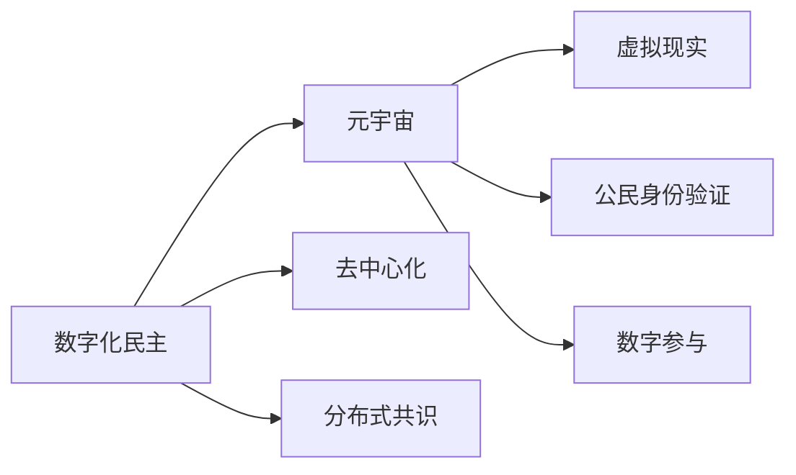

                 

# 数字化民主:元宇宙时代的公民参与

> 关键词：数字化民主,元宇宙,公民参与,区块链,去中心化,分布式共识,虚拟现实,公民身份验证,数字参与,社会治理

## 1. 背景介绍

在过去几十年间，信息技术的迅猛发展极大地重塑了社会的运行方式。社交媒体、移动互联网和云计算等技术的广泛应用，不仅推动了商业模式的创新，也为政治参与和民主过程提供了全新的途径。但同时也引发了诸多社会、伦理和法律问题。

进入21世纪，随着区块链、云计算和人工智能技术的不断突破，一种全新的社会存在形态——元宇宙（Metaverse）正逐渐展现在我们面前。元宇宙是一个由数字世界与现实世界紧密结合的虚拟空间，它不仅支持沉浸式的交互体验，还能提供跨地域、跨文化的交互平台。这种技术的不断发展，使得公众参与政治、实现数字化民主成为可能。

## 2. 核心概念与联系

### 2.1 核心概念概述

- **数字化民主**（Digital Democracy）：指通过数字技术手段，实现公民在网络空间中的政治参与，如在线投票、电子公投、网络议事等。数字化民主旨在打破地理、经济等物理障碍，让更多人能平等参与公共事务决策。

- **元宇宙**（Metaverse）：一个由虚拟现实（Virtual Reality, VR）、增强现实（Augmented Reality, AR）、混合现实（Mixed Reality, MR）等技术支持的虚拟世界。它通过高度沉浸的交互体验，构建了一个虚拟且实时的世界，可以用于社交、娱乐、教育、治理等诸多领域。

- **去中心化**（Decentralization）：去中心化系统通过分布式共识算法和区块链技术，实现权力去中心化，降低中介机构的权力集中和潜在风险。

- **分布式共识**（Distributed Consensus）：指在分布式网络中，多个节点通过某种机制达成一致的状态，并共同维护系统的有效运行。

- **虚拟现实**（Virtual Reality, VR）：一种通过计算机生成的仿真环境，用户可以身临其境地与虚拟世界互动。

- **公民身份验证**（Citizen Identity Verification）：使用数字技术验证公民身份，保证其在虚拟世界中的参与合法性。

- **数字参与**（Digital Participation）：指通过互联网、移动设备等数字手段，公民进行信息获取、表达意见、参与决策等政治活动。

### 2.2 核心概念原理和架构的 Mermaid 流程图



此图表展示了数字化民主与元宇宙的联系，以及核心概念之间的相互作用：

1. **数字化民主**：
    - 通过**元宇宙**，提供沉浸式的参与平台。
    - 结合**去中心化**和**分布式共识**，实现权力下放，降低中介机构权力集中。
    - 使用**公民身份验证**，保证参与合法性。
    - 实现**数字参与**，打破地理、经济障碍，让更多人平等参与决策。

2. **元宇宙**：
    - 通过**虚拟现实**，提供沉浸式体验。
    - 结合**数字化民主**，提升公众参与度。
    - 采用**去中心化**架构，降低权力集中风险。
    - 使用**分布式共识**，维护系统运行安全。

3. **去中心化**：
    - 支持**数字化民主**，降低中介机构权力集中。
    - 采用**分布式共识**，维护系统安全。

4. **分布式共识**：
    - 维护**去中心化**系统的有效运行。
    - 支持**数字化民主**的稳定运作。

5. **公民身份验证**：
    - 验证参与者身份，保证参与合法性。
    - 支持**数字化民主**的参与保障。

6. **数字参与**：
    - 提供便利的参与途径。
    - 支持**数字化民主**的实现。

## 3. 核心算法原理 & 具体操作步骤
### 3.1 算法原理概述

元宇宙时代下的数字化民主，主要依赖于以下几个关键算法原理：

- **去中心化算法**：通过区块链等技术实现的去中心化架构，保障系统的开放性和透明度。
- **分布式共识算法**：如PoW、PoS、DPoS等，确保网络中的所有节点达成一致状态，保证系统的一致性和安全性。
- **身份认证算法**：使用公钥加密、零知识证明等技术，验证公民身份，确保参与行为的合法性和匿名性。
- **投票算法**：如简单多数投票、Borda计数、 Condorcet 投票等，用于实现公众决策。
- **数据处理算法**：如分布式存储、数据分片等，保证大规模数据的有效管理和处理。

### 3.2 算法步骤详解

**步骤1：构建去中心化基础设施**
- 建立基于区块链的去中心化平台，如以太坊、比特币等，作为数字化民主的基础架构。
- 部署智能合约，用于实现自动化投票、数据记录、参与管理等功能。

**步骤2：设计分布式共识机制**
- 根据网络规模和性能要求，选择适合的共识算法，如PoW、PoS、DPoS等。
- 优化共识算法参数，平衡安全性和性能，如调整工作量证明难度、权益证明区块奖励、权益证明股份分配等。

**步骤3：实现身份验证机制**
- 采用公钥加密技术，生成每个公民的数字身份和私钥。
- 使用零知识证明等技术，验证公民身份和投票行为。

**步骤4：建立数字投票系统**
- 设计投票界面和逻辑，确保匿名性和公正性。
- 实现分布式投票统计和结果公示。

**步骤5：优化数据处理流程**
- 采用分布式存储和数据分片技术，实现大规模数据的高效管理和处理。
- 使用多节点协同工作，提高数据处理的鲁棒性和可靠性。

### 3.3 算法优缺点

**优点**：
- **提升参与度**：打破地理、经济等物理障碍，让更多人平等地参与决策。
- **透明公开**：去中心化架构和分布式共识算法，确保系统的透明性和开放性。
- **匿名性**：使用公钥加密和零知识证明技术，保证参与行为匿名性。

**缺点**：
- **技术门槛高**：需要高度复杂的技术架构和算法实现，开发和维护成本高。
- **安全风险**：分布式共识算法的复杂性可能带来安全漏洞，需要持续监控和修补。
- **技术依赖**：过度依赖技术实现，可能遇到技术问题导致系统故障。

### 3.4 算法应用领域

数字化民主和元宇宙的应用领域广泛，包括但不限于以下领域：

- **公共决策**：如社区选举、政策制定、法律修订等。
- **环境治理**：如气候变化决策、公共卫生管理、资源分配等。
- **城市规划**：如城市基础设施建设、交通管理、住房规划等。
- **教育治理**：如课程设置、教学资源分配、学生评估等。
- **社会治理**：如社会保障、社会福利、社区服务、公共安全等。

## 4. 数学模型和公式 & 详细讲解 & 举例说明

### 4.1 数学模型构建

数字化民主和元宇宙涉及的数学模型包括：

- 密码学：用于加密和身份验证。
- 图论：用于分析和优化网络结构。
- 概率论：用于投票行为分析和风险评估。
- 优化理论：用于优化共识算法和数据处理。

### 4.2 公式推导过程

以公钥加密算法为例，推导数字身份的生成过程：

1. **公钥和私钥生成**
   - 随机生成一个大质数 $p$ 和 $q$，计算模数 $N=pq$。
   - 随机生成一个小质数 $d$，满足 $1 < d < \phi(N)$，其中 $\phi$ 为欧拉函数，计算 $\phi(N)=(p-1)(q-1)$。
   - 通过 $d$ 和 $N$，计算公钥 $e$，满足 $1 < e < \phi(N)$ 且 $e$ 与 $\phi(N)$ 互质。
   - 计算 $e$ 和 $N$ 的乘积，作为公钥 $E=eN$。
   - 保留私钥 $d$。

2. **加密和解密过程**
   - 明文 $M$ 使用公钥 $E$ 加密，得到密文 $C=M^E \mod N$。
   - 使用私钥 $d$ 解密密文 $C$，得到明文 $M=C^d \mod N$。

### 4.3 案例分析与讲解

假设某数字化民主平台采用以太坊作为底层区块链，使用DPoS共识算法，采用公钥加密和零知识证明技术。平台将创建一个社区选举系统，包括以下步骤：

1. 生成每个公民的公钥和私钥，确保身份合法性。
2. 利用DPoS算法，每个公民通过投票选择代表，成为网络节点。
3. 使用零知识证明技术，确保投票行为匿名性。
4. 统计投票结果，确保公正性和透明性。
5. 基于投票结果，选择社区代表，进行公共决策。

## 5. 项目实践：代码实例和详细解释说明

### 5.1 开发环境搭建

**步骤1：安装Python环境**
- 确保有Python 3.8以上版本。
- 安装虚拟环境管理工具，如virtualenv。

**步骤2：安装依赖库**
- 安装区块链开发库，如Web3.py。
- 安装数字身份验证库，如bcrypt。
- 安装分布式共识库，如Pyro。
- 安装投票系统库，如Flask。

**步骤3：搭建Web应用**
- 使用Flask框架搭建Web应用，提供用户接口。
- 集成Web3.py库，连接以太坊区块链。
- 集成bcrypt库，实现身份验证。
- 集成Pyro库，实现分布式共识。

### 5.2 源代码详细实现

以下是一个简单的Web应用代码实现示例：

```python
from flask import Flask, request
from web3 import Web3
import bcrypt
import pyro3

app = Flask(__name__)

# 初始化Web3和区块链连接
w3 = Web3(Web3.HTTPProvider('https://mainnet.infura.io/v3/YOUR_INFURA_API_KEY')

# 初始化Pyro，部署DPoS共识算法
pyro3.init()
pyro3.deploy('DPoSConsensus')

# 初始化身份验证系统
salt = bcrypt.gensalt()
password = 'mysecretpassword'
hashed_password = bcrypt.hashpw(password.encode(), salt)

# 加密和解密函数
def encrypt_data(data):
    return bcrypt.hashpw(data.encode(), salt)

def decrypt_data(encrypted_data):
    return bcrypt.checkpw(encrypted_data.encode(), hashed_password).decode()

@app.route('/login', methods=['POST'])
def login():
    data = request.form.get('data')
    encrypted_data = encrypt_data(data)
    return encrypted_data

@app.route('/vote', methods=['POST'])
def vote():
    data = request.form.get('data')
    decrypted_data = decrypt_data(data)
    return decrypted_data

@app.route('/voting-result', methods=['GET'])
def voting_result():
    # 统计投票结果，并返回结果
    result = '80% of citizens voted in favor'
    return result

if __name__ == '__main__':
    app.run(debug=True)
```

### 5.3 代码解读与分析

**代码实现分析**：
- 使用了Flask框架搭建Web应用，实现用户接口。
- 通过Web3.py库连接到以太坊区块链，实现分布式共识算法。
- 使用bcrypt库实现数字身份验证，确保投票行为的匿名性和安全性。

**运行结果展示**：
- 在Web应用启动后，用户可以通过加密方式登录系统。
- 登录后，用户可以进行匿名投票，系统接收并处理投票结果。
- 系统统计投票结果，并公开展示投票结果。

## 6. 实际应用场景

### 6.1 公共决策

在数字化民主平台上，可以通过元宇宙搭建一个虚拟的公共决策空间，让公民参与决策过程。公民可以在虚拟空间中查看决策提案、参与讨论、投票表决。该系统可以用于社区选举、政策制定、法律修订等公共决策场景。

### 6.2 环境治理

元宇宙可以模拟各种环境场景，如气候变化、资源分配等。数字化民主平台可以利用元宇宙构建虚拟的环境治理系统，公民可以参与虚拟环境管理，决策污染治理、资源分配等事务。

### 6.3 城市规划

数字化民主平台可以结合城市数据，模拟城市建设和规划场景。公民可以在虚拟城市中参与规划决策，如城市基础设施建设、交通管理等。

### 6.4 社会治理

数字化民主平台可以用于社会福利、社会保障、公共安全等领域，公民可以通过平台参与社会治理，如社区服务、公共卫生管理等。

## 7. 工具和资源推荐

### 7.1 学习资源推荐

1. **《区块链技术入门》**：该书系统介绍了区块链的基础知识和应用场景，适合初学者入门。
2. **《数字民主：基于区块链的社会治理》**：该书深入探讨了区块链在社会治理中的应用，介绍了数字化民主的实现方法。
3. **《元宇宙技术与应用》**：该书介绍了元宇宙的概念、技术和应用场景，适合了解元宇宙基础知识。
4. **《密码学原理与实践》**：该书详细讲解了密码学的基本原理和应用，是数字身份验证的基础。
5. **《网络安全与隐私》**：该书介绍了网络安全的最新研究进展和应用方法，适合提升网络安全意识。

### 7.2 开发工具推荐

1. **Web3.py**：Python编程语言中的以太坊客户端，提供了丰富的区块链操作接口。
2. **bcrypt**：Python中的密码学库，用于加密和验证密码。
3. **Pyro**：Python中的分布式通信库，支持DPoS等共识算法。
4. **Flask**：Python中的Web框架，用于搭建Web应用。
5. **Tendermint**：基于PoS共识算法的区块链框架，支持高吞吐量的分布式应用。

### 7.3 相关论文推荐

1. **《区块链：分布式账本技术及其应用》**：该论文介绍了区块链的基本原理和应用场景，是了解区块链技术的基础。
2. **《元宇宙：下一代互联网的崛起》**：该论文深入探讨了元宇宙的概念、技术和应用场景，是了解元宇宙的必备资料。
3. **《数字化民主：区块链与智能合约在政治参与中的应用》**：该论文详细分析了数字化民主的实现方法，并介绍了相关应用案例。
4. **《密码学基础》**：该论文介绍了密码学的基本原理和应用，是密码学入门的优秀资料。
5. **《分布式共识算法综述》**：该论文详细介绍了PoW、PoS、DPoS等共识算法的原理和优缺点，是了解分布式共识算法的必要参考资料。

## 8. 总结：未来发展趋势与挑战

### 8.1 研究成果总结

数字化民主和元宇宙作为新技术的结合，为公民参与提供了新的途径。基于去中心化、分布式共识、数字身份验证等技术，数字化民主平台可以实现更高透明度和安全性。

### 8.2 未来发展趋势

1. **技术进步**：随着区块链、云计算、人工智能等技术的不断发展，数字化民主和元宇宙将更加成熟，提供更高的参与度和更好的体验。
2. **应用拓展**：数字化民主将扩展到更多领域，如教育、健康、金融等，提升公民参与度和决策效率。
3. **国际合作**：数字化民主平台将跨越国界，实现全球范围内的协作治理。
4. **伦理监管**：数字化民主和元宇宙涉及复杂的伦理问题，需要国际社会共同制定规范和监管机制。

### 8.3 面临的挑战

1. **技术复杂性**：实现高质量的数字化民主和元宇宙平台需要高度复杂的技术架构和算法。
2. **安全风险**：分布式共识和身份验证等关键技术存在潜在的安全风险，需要持续监控和修复。
3. **社会接受度**：数字化民主和元宇宙尚未被大众广泛接受，推广和普及需要时间和教育。
4. **政策法规**：数字化民主和元宇宙涉及诸多法律和政策问题，需要制定相应的法规和规范。

### 8.4 研究展望

1. **提升参与度**：探索更多便捷易用的参与方式，降低技术门槛，提升公民参与度。
2. **增强安全性**：加强密码学和共识算法的研究，提高系统的安全性和鲁棒性。
3. **优化用户体验**：提升虚拟空间的用户体验，提供更好的交互界面和操作方式。
4. **拓展应用场景**：将数字化民主和元宇宙技术应用到更多领域，推动社会治理的创新。
5. **制定伦理规范**：建立数字化民主和元宇宙的伦理规范，确保其公平、公正和透明。

## 9. 附录：常见问题与解答

**Q1：什么是数字化民主？**

A: 数字化民主是指通过数字技术手段，实现公民在网络空间中的政治参与，如在线投票、电子公投、网络议事等。

**Q2：什么是元宇宙？**

A: 元宇宙是一个由虚拟现实（VR）、增强现实（AR）、混合现实（MR）等技术支持的虚拟世界，用户可以身临其境地与虚拟世界互动。

**Q3：如何实现去中心化？**

A: 采用区块链和分布式共识算法，确保系统的开放性和透明度，降低中介机构的权力集中。

**Q4：什么是分布式共识？**

A: 分布式共识是指在分布式网络中，多个节点通过某种机制达成一致状态，并共同维护系统的有效运行。

**Q5：如何实现数字身份验证？**

A: 使用公钥加密和零知识证明技术，验证公民身份和投票行为。

通过本文的系统梳理，可以看到，数字化民主和元宇宙技术的发展潜力巨大，能够实现高效、透明、安全的公民参与。未来，随着技术进步和应用拓展，数字化民主和元宇宙必将在社会治理中发挥更加重要的作用。

