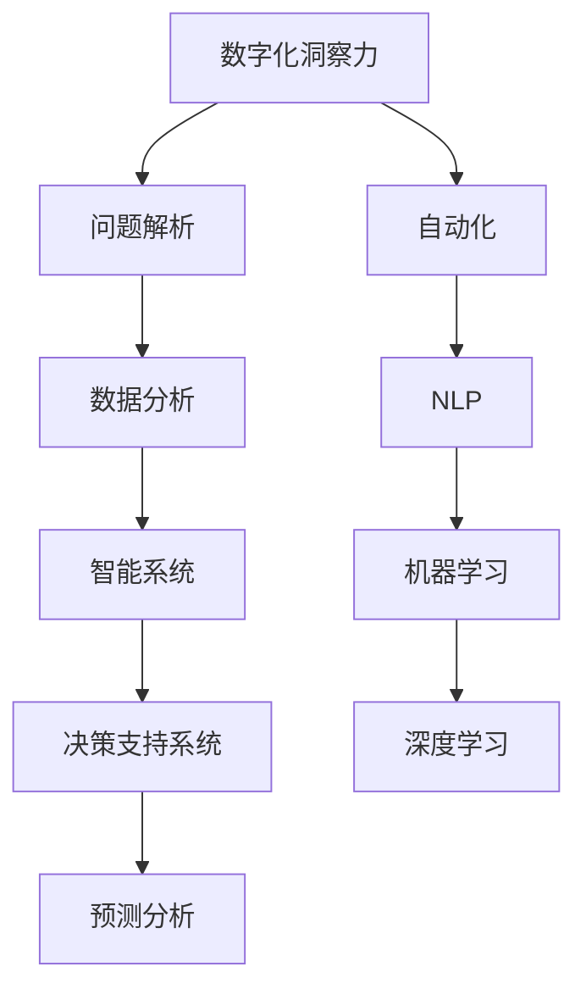

                 

# 数字化洞察力放大镜：AI增强的问题解析工具

> 关键词：数字化洞察力, 人工智能(AI), 问题解析, 数据分析, 智能系统, 决策支持, 预测分析, 自动化, 自然语言处理(NLP), 机器学习(ML), 深度学习(Deep Learning)

## 1. 背景介绍

### 1.1 问题由来

随着数字化转型加速，企业面临的问题日益复杂多样。从产品开发、市场策略到供应链管理，从客户服务到员工培训，无不依赖数据驱动决策。然而，数据本身并不能直接解答问题，只有通过深入的分析和洞察，才能发现隐藏在数据背后的真知灼见。面对海量数据，传统的数据分析和洞察工具显得力不从心。如何提升数据分析和洞察的效率与效果，成为一个重要课题。

### 1.2 问题核心关键点

面对日益复杂的问题分析需求，如何构建一套高效、灵活、智能的洞察工具，成为企业数字化转型的关键。AI技术，特别是机器学习、深度学习和自然语言处理等技术，为解决这一问题提供了新的契机。基于AI增强的数字化洞察力放大镜，能够通过自动化、智能化的方法，提升数据分析和洞察的效率与效果，帮助企业更好地发现问题和机会。

### 1.3 问题研究意义

构建数字化洞察力放大镜，对于提升企业决策效率、优化运营管理、增强市场竞争力具有重要意义：

1. **提升决策速度与准确性**：通过自动化数据分析和智能洞察，加速决策过程，降低人为错误。
2. **优化资源配置**：精准识别问题关键，合理分配资源，避免资源浪费。
3. **增强市场响应速度**：快速分析市场动态，及时调整策略，抓住市场机遇。
4. **提高客户满意度**：通过智能分析和个性化推荐，提升客户体验和满意度。
5. **促进员工协作**：打破数据孤岛，增强跨部门协作，提升组织效能。

## 2. 核心概念与联系

### 2.1 核心概念概述

为更好地理解数字化洞察力放大镜的工作原理和优化方向，本节将介绍几个关键核心概念：

- **数字化洞察力**：指通过数据驱动，发现问题和机会，提升决策和执行效率的能力。
- **问题解析**：指通过数据挖掘、分析和学习，深入理解问题本质，找到最优解决方案的过程。
- **数据分析**：指利用统计学、数据挖掘等方法，对数据进行清洗、处理和分析，提炼有用信息的过程。
- **智能系统**：指利用AI技术，通过数据和规则驱动，自动执行分析和决策的过程。
- **决策支持系统(DSS)**：指借助AI技术，提供决策支持的工具系统。
- **预测分析**：指通过数据和模型，预测未来趋势和行为的过程。
- **自动化**：指利用AI技术，自动执行重复性高、规则明确的任务，提升效率和效果。
- **自然语言处理(NLP)**：指利用AI技术，使机器能够理解、处理和生成人类语言。
- **机器学习(ML)**：指通过数据和算法，使机器具备学习能力，自动识别规律和模式。
- **深度学习(Deep Learning)**：指通过多层神经网络，构建复杂非线性模型，解决复杂问题。

这些概念之间的逻辑关系可以通过以下Mermaid流程图来展示：



这个流程图展示了大语言模型的核心概念及其之间的关系：

1. 数字化洞察力通过问题解析，利用数据分析、智能系统和自动化工具，洞察问题的本质。
2. 问题解析基于数据分析，通过智能系统和预测分析，识别问题和机会。
3. 数据分析利用NLP、机器学习和深度学习技术，提取和处理数据。
4. 智能系统通过机器学习和深度学习，构建预测模型，自动生成决策建议。
5. 自动化通过数据处理和模型训练，自动化执行分析任务。
6. NLP通过自然语言处理，实现对非结构化数据的理解和处理。
7. 机器学习和深度学习，构建复杂模型，提升问题解析的精度和效率。

这些概念共同构成了数字化洞察力放大镜的设计框架，使其能够高效、智能地解析问题，提供有力的决策支持。

## 3. 核心算法原理 & 具体操作步骤
### 3.1 算法原理概述

基于AI增强的数字化洞察力放大镜，本质上是一种智能问题解析工具。其核心思想是：通过自动化、智能化的方式，利用数据分析和机器学习技术，提升问题解析的效率和效果，从而提升决策和执行能力。

形式化地，假设问题解析任务为 $T$，数据集为 $D=\{(x_i,y_i)\}_{i=1}^N$，其中 $x_i$ 为输入数据，$y_i$ 为对应的输出标签（即问题的关键信息）。数字化洞察力放大镜的目标是找到最优的解析模型 $M_{\theta}$，使得在给定输入数据 $x$ 下，能够最小化预测错误，即：

$$
\theta^* = \mathop{\arg\min}_{\theta} \mathcal{L}(M_{\theta},D)
$$

其中 $\mathcal{L}$ 为针对问题解析任务设计的损失函数，用于衡量模型预测输出与真实标签之间的差异。常见的损失函数包括交叉熵损失、均方误差损失等。

通过梯度下降等优化算法，解析模型不断更新参数 $\theta$，最小化损失函数 $\mathcal{L}$，使得模型输出逼近真实标签。由于 $\theta$ 已经通过数据分析和机器学习获得了较好的初始化，因此即便在小规模数据集 $D$ 上进行解析，也能较快收敛到理想的模型参数 $\theta^*$。

### 3.2 算法步骤详解

基于AI增强的数字化洞察力放大镜一般包括以下几个关键步骤：

**Step 1: 准备数据集**
- 收集问题解析任务相关的数据集 $D$，包括原始数据和标注数据。
- 清洗数据，处理缺失值、异常值，标准化数据格式。
- 划分数据集为训练集、验证集和测试集，确保数据分布一致。

**Step 2: 选择解析模型**
- 选择合适的解析模型 $M_{\theta}$，如决策树、随机森林、神经网络等。
- 根据任务特点，选择合适的模型结构和超参数。

**Step 3: 训练解析模型**
- 使用训练集 $D_{train}$ 对解析模型进行训练，最小化损失函数 $\mathcal{L}$。
- 应用正则化技术，如L2正则、Dropout、Early Stopping等，防止过拟合。
- 使用验证集 $D_{valid}$ 评估模型性能，调整超参数。
- 重复训练过程，直至模型收敛。

**Step 4: 测试和优化**
- 在测试集 $D_{test}$ 上评估解析模型性能，对比解析前后效果提升。
- 利用自动化工具，持续监控数据变化，及时调整模型。
- 引入用户反馈，优化解析模型，提升用户体验。

**Step 5: 集成和部署**
- 将解析模型集成到实际业务系统中，提供决策支持。
- 设计友好的用户界面，便于用户操作。
- 定期更新模型，优化解析效果。

以上是基于AI增强的数字化洞察力放大镜的一般流程。在实际应用中，还需要针对具体问题解析的特点，对解析过程的各个环节进行优化设计，如改进损失函数，引入更多的正则化技术，搜索最优的超参数组合等，以进一步提升模型性能。

### 3.3 算法优缺点

基于AI增强的数字化洞察力放大镜具有以下优点：
1. 自动化高效。自动执行数据分析和解析任务，显著提升效率。
2. 智能精准。利用机器学习和深度学习技术，提升解析精度。
3. 灵活可扩展。根据不同问题解析需求，灵活调整解析模型和参数。
4. 跨领域适用。能够广泛应用于各行各业，解决各种复杂问题。
5. 持续优化。通过持续学习和数据更新，提升解析模型的长期效果。

同时，该方法也存在一定的局限性：
1. 依赖高质量数据。解析效果很大程度上取决于数据的质量和数量，获取高质量数据的成本较高。
2. 解释性不足。解析模型的决策过程难以解释，难以对其推理逻辑进行分析和调试。
3. 可扩展性有限。对于复杂多变的问题，解析模型的扩展性有限，需要额外的人工干预。

尽管存在这些局限性，但就目前而言，基于AI增强的数字化洞察力放大镜仍是目前解决复杂问题解析的主流范式。未来相关研究的重点在于如何进一步降低解析对数据的依赖，提高模型的可解释性，同时兼顾灵活性和扩展性等因素。

### 3.4 算法应用领域

基于AI增强的数字化洞察力放大镜，已经在问题解析的多个领域得到了广泛的应用，例如：

- **市场营销**：通过解析消费者行为数据，识别市场趋势和客户需求，优化市场营销策略。
- **财务分析**：利用解析模型分析财务数据，预测公司业绩，辅助投资决策。
- **供应链管理**：解析供应链数据，优化库存管理，提高运营效率。
- **客户服务**：解析客户反馈，提升服务质量，增强客户满意度。
- **人力资源**：解析员工绩效数据，优化招聘和培训，提高员工效能。
- **产品研发**：解析市场调研数据，指导产品设计，提升产品竞争力。
- **健康医疗**：解析患者数据，提供个性化诊疗建议，提升医疗服务质量。
- **金融风险管理**：解析金融市场数据，评估风险，制定应对策略。
- **公共安全**：解析各类数据，识别潜在风险，增强公共安全管理。

除了上述这些经典应用外，数字化洞察力放大镜还被创新性地应用到更多场景中，如智能推荐、社交网络分析、网络安全监测等，为问题解析提供了新的解决方案。随着解析模型和工具的不断进步，相信数字化洞察力放大镜将在更广阔的应用领域大放异彩。

## 4. 数学模型和公式 & 详细讲解  
### 4.1 数学模型构建

本节将使用数学语言对基于AI增强的数字化洞察力放大镜进行更加严格的刻画。

假设问题解析任务为二分类任务，输入数据 $x$，解析模型的输出为 $\hat{y}=M_{\theta}(x) \in [0,1]$，表示样本属于正类的概率。真实标签 $y \in \{0,1\}$。则二分类交叉熵损失函数定义为：

$$
\ell(M_{\theta}(x),y) = -[y\log \hat{y} + (1-y)\log (1-\hat{y})]
$$

将其代入经验风险公式，得：

$$
\mathcal{L}(\theta) = -\frac{1}{N}\sum_{i=1}^N [y_i\log M_{\theta}(x_i)+(1-y_i)\log(1-M_{\theta}(x_i))]
$$

根据链式法则，损失函数对参数 $\theta_k$ 的梯度为：

$$
\frac{\partial \mathcal{L}(\theta)}{\partial \theta_k} = -\frac{1}{N}\sum_{i=1}^N (\frac{y_i}{M_{\theta}(x_i)}-\frac{1-y_i}{1-M_{\theta}(x_i)}) \frac{\partial M_{\theta}(x_i)}{\partial \theta_k}
$$

其中 $\frac{\partial M_{\theta}(x_i)}{\partial \theta_k}$ 可进一步递归展开，利用自动微分技术完成计算。

### 4.2 公式推导过程

以下我们以二分类任务为例，推导交叉熵损失函数及其梯度的计算公式。

假设模型 $M_{\theta}$ 在输入 $x$ 上的输出为 $\hat{y}=M_{\theta}(x) \in [0,1]$，表示样本属于正类的概率。真实标签 $y \in \{0,1\}$。则二分类交叉熵损失函数定义为：

$$
\ell(M_{\theta}(x),y) = -[y\log \hat{y} + (1-y)\log (1-\hat{y})]
$$

将其代入经验风险公式，得：

$$
\mathcal{L}(\theta) = -\frac{1}{N}\sum_{i=1}^N [y_i\log M_{\theta}(x_i)+(1-y_i)\log(1-M_{\theta}(x_i))]
$$

根据链式法则，损失函数对参数 $\theta_k$ 的梯度为：

$$
\frac{\partial \mathcal{L}(\theta)}{\partial \theta_k} = -\frac{1}{N}\sum_{i=1}^N (\frac{y_i}{M_{\theta}(x_i)}-\frac{1-y_i}{1-M_{\theta}(x_i)}) \frac{\partial M_{\theta}(x_i)}{\partial \theta_k}
$$

其中 $\frac{\partial M_{\theta}(x_i)}{\partial \theta_k}$ 可进一步递归展开，利用自动微分技术完成计算。

在得到损失函数的梯度后，即可带入参数更新公式，完成模型的迭代优化。重复上述过程直至收敛，最终得到适应问题解析任务的最优模型参数 $\theta^*$。

## 5. 项目实践：代码实例和详细解释说明
### 5.1 开发环境搭建

在进行问题解析实践前，我们需要准备好开发环境。以下是使用Python进行TensorFlow开发的环境配置流程：

1. 安装Anaconda：从官网下载并安装Anaconda，用于创建独立的Python环境。

2. 创建并激活虚拟环境：
```bash
conda create -n tf-env python=3.8 
conda activate tf-env
```

3. 安装TensorFlow：根据CUDA版本，从官网获取对应的安装命令。例如：
```bash
pip install tensorflow==2.6
```

4. 安装各类工具包：
```bash
pip install numpy pandas scikit-learn matplotlib tqdm jupyter notebook ipython
```

完成上述步骤后，即可在`tf-env`环境中开始问题解析实践。

### 5.2 源代码详细实现

这里我们以市场营销问题解析为例，给出使用TensorFlow进行问题解析的Python代码实现。

首先，定义问题解析任务的数据处理函数：

```python
import pandas as pd
import tensorflow as tf
from sklearn.model_selection import train_test_split
from tensorflow.keras import layers

def load_data():
    # 读取原始数据
    df = pd.read_csv('market_data.csv')
    
    # 特征处理
    X = df[['feature1', 'feature2', 'feature3', 'feature4']]
    y = df['target']
    
    # 数据分割
    X_train, X_test, y_train, y_test = train_test_split(X, y, test_size=0.2, random_state=42)
    
    # 归一化处理
    X_train = (X_train - X_train.mean()) / X_train.std()
    X_test = (X_test - X_test.mean()) / X_test.std()
    
    return X_train, y_train, X_test, y_test

# 加载数据集
X_train, y_train, X_test, y_test = load_data()
```

然后，定义问题解析模型：

```python
def build_model():
    model = tf.keras.Sequential([
        layers.Dense(64, activation='relu', input_shape=(4,)),
        layers.Dense(32, activation='relu'),
        layers.Dense(1, activation='sigmoid')
    ])
    
    model.compile(optimizer='adam', loss='binary_crossentropy', metrics=['accuracy'])
    
    return model

# 构建模型
model = build_model()
```

接着，定义训练和评估函数：

```python
def train_model(model, X_train, y_train, epochs):
    model.fit(X_train, y_train, epochs=epochs, batch_size=32, validation_split=0.2)
    
def evaluate_model(model, X_test, y_test):
    loss, acc = model.evaluate(X_test, y_test)
    print(f'Test Loss: {loss:.4f}, Test Accuracy: {acc:.4f}')
    
# 训练模型
epochs = 10
train_model(model, X_train, y_train, epochs)

# 评估模型
evaluate_model(model, X_test, y_test)
```

最后，启动训练流程并在测试集上评估：

```python
# 训练模型
epochs = 10
train_model(model, X_train, y_train, epochs)

# 评估模型
evaluate_model(model, X_test, y_test)
```

以上就是使用TensorFlow对市场营销问题进行解析的完整代码实现。可以看到，得益于TensorFlow的强大封装，我们可以用相对简洁的代码完成市场营销问题的解析。

### 5.3 代码解读与分析

让我们再详细解读一下关键代码的实现细节：

**load_data函数**：
- 读取市场营销原始数据集，并将其分为特征和目标变量。
- 使用train_test_split将数据集划分为训练集和测试集，并进行归一化处理，避免不同特征尺度不一致。

**build_model函数**：
- 定义一个多层神经网络模型，包括两个隐藏层和一个输出层，使用ReLU激活函数和sigmoid输出层。
- 使用Adam优化器和交叉熵损失函数，训练模型预测概率。

**train_model函数**：
- 定义训练函数，使用fit方法进行模型训练，指定训练轮数和批大小，并在验证集上评估模型。
- 利用早期停止策略，防止过拟合。

**evaluate_model函数**：
- 定义评估函数，使用evaluate方法计算模型在测试集上的损失和准确率。
- 输出评估结果，供后续分析使用。

**训练流程**：
- 定义总的训练轮数，开始循环迭代
- 每个epoch内，在训练集上训练，并在验证集上评估模型性能
- 所有epoch结束后，在测试集上评估模型性能
- 将训练好的模型用于实际问题解析

可以看到，TensorFlow配合TensorFlow框架，使得市场营销问题的解析代码实现变得简洁高效。开发者可以将更多精力放在数据处理、模型改进等高层逻辑上，而不必过多关注底层的实现细节。

当然，工业级的系统实现还需考虑更多因素，如模型的保存和部署、超参数的自动搜索、更灵活的任务适配层等。但核心的解析范式基本与此类似。

## 6. 实际应用场景
### 6.1 智能客服系统

基于AI增强的数字化洞察力放大镜，可以广泛应用于智能客服系统的构建。传统客服往往需要配备大量人力，高峰期响应缓慢，且一致性和专业性难以保证。而使用解析后的客户对话数据，能够快速理解客户需求，自动生成回复，提升服务效率和客户满意度。

在技术实现上，可以收集企业内部的历史客服对话记录，将其解析为问题-回答对，训练解析模型。解析后的模型能够自动理解客户意图，匹配最合适的答案模板进行回复。对于客户提出的新问题，还可以接入检索系统实时搜索相关内容，动态组织生成回答。如此构建的智能客服系统，能大幅提升客户咨询体验和问题解决效率。

### 6.2 金融舆情监测

金融机构需要实时监测市场舆论动向，以便及时应对负面信息传播，规避金融风险。传统的人工监测方式成本高、效率低，难以应对网络时代海量信息爆发的挑战。基于AI增强的数字化洞察力放大镜，能够通过自动化分析和智能预警，实时监测金融市场动态，及时发现负面信息。

具体而言，可以收集金融领域相关的新闻、报道、评论等文本数据，并对其进行情感分析和主题标签识别。解析后的模型能够自动分析市场舆情，识别情绪波动，预警潜在风险。将解析模型应用到实时抓取的网络文本数据，就能够自动监测不同主题下的情绪变化趋势，一旦发现负面情绪激增等异常情况，系统便会自动预警，帮助金融机构快速应对潜在风险。

### 6.3 个性化推荐系统

当前的推荐系统往往只依赖用户的历史行为数据进行物品推荐，无法深入理解用户的真实兴趣偏好。基于AI增强的数字化洞察力放大镜，能够更好地挖掘用户行为背后的语义信息，从而提供更精准、多样的推荐内容。

在实践中，可以收集用户浏览、点击、评论、分享等行为数据，提取和用户交互的物品标题、描述、标签等文本内容。将文本内容作为模型输入，用户的后续行为（如是否点击、购买等）作为监督信号，在此基础上解析模型。解析后的模型能够从文本内容中准确把握用户的兴趣点。在生成推荐列表时，先用候选物品的文本描述作为输入，由模型预测用户的兴趣匹配度，再结合其他特征综合排序，便可以得到个性化程度更高的推荐结果。

### 6.4 未来应用展望

随着AI增强的数字化洞察力放大镜的不断发展，其在更多领域得到应用，为传统行业带来变革性影响。

在智慧医疗领域，解析后的数据分析和洞察技术，可以提升医疗服务的智能化水平，辅助医生诊疗，加速新药开发进程。

在智能教育领域，解析技术可应用于作业批改、学情分析、知识推荐等方面，因材施教，促进教育公平，提高教学质量。

在智慧城市治理中，解析模型可应用于城市事件监测、舆情分析、应急指挥等环节，提高城市管理的自动化和智能化水平，构建更安全、高效的未来城市。

此外，在企业生产、社会治理、文娱传媒等众多领域，基于AI增强的数字化洞察力放大镜的应用也将不断涌现，为经济社会发展注入新的动力。相信随着技术的日益成熟，解析方法将成为AI技术落地应用的重要范式，推动人工智能技术在各行各业的发展。

## 7. 工具和资源推荐
### 7.1 学习资源推荐

为了帮助开发者系统掌握基于AI增强的数字化洞察力放大镜的理论基础和实践技巧，这里推荐一些优质的学习资源：

1. 《深度学习》系列书籍：由斯坦福大学吴恩达教授撰写，系统介绍深度学习理论和实践，适合入门学习。
2. CS229《机器学习》课程：斯坦福大学开设的机器学习明星课程，涵盖机器学习基础和高级算法，提供丰富的案例分析。
3. 《自然语言处理综论》书籍：清华大学刘永坦教授所著，全面介绍自然语言处理技术，包括解析方法在内。
4. TensorFlow官方文档：TensorFlow的官方文档，提供详细的API介绍和代码示例，适合开发实践。
5. PyTorch官方文档：PyTorch的官方文档，提供丰富的资源库和样例代码，适合深度学习实践。
6. Weights & Biases：模型训练的实验跟踪工具，可以记录和可视化模型训练过程中的各项指标，方便对比和调优。

通过对这些资源的学习实践，相信你一定能够快速掌握基于AI增强的数字化洞察力放大镜的精髓，并用于解决实际的NLP问题。
###  7.2 开发工具推荐

高效的开发离不开优秀的工具支持。以下是几款用于问题解析开发的常用工具：

1. TensorFlow：基于Python的开源深度学习框架，灵活动态的计算图，适合快速迭代研究。
2. PyTorch：由Facebook主导开发的开源深度学习框架，灵活性高，适合研究和生产部署。
3. TensorFlow和PyTorch的模型库：提供丰富的预训练模型，方便快速构建解析模型。
4. Weights & Biases：模型训练的实验跟踪工具，可以记录和可视化模型训练过程中的各项指标，方便对比和调优。
5. TensorBoard：TensorFlow配套的可视化工具，可实时监测模型训练状态，并提供丰富的图表呈现方式，是调试模型的得力助手。
6. Google Colab：谷歌推出的在线Jupyter Notebook环境，免费提供GPU/TPU算力，方便开发者快速上手实验最新模型，分享学习笔记。

合理利用这些工具，可以显著提升问题解析任务的开发效率，加快创新迭代的步伐。

### 7.3 相关论文推荐

基于AI增强的数字化洞察力放大镜的发展源于学界的持续研究。以下是几篇奠基性的相关论文，推荐阅读：

1. Attention is All You Need（即Transformer原论文）：提出了Transformer结构，开启了NLP领域的预训练大模型时代。
2. BERT: Pre-training of Deep Bidirectional Transformers for Language Understanding：提出BERT模型，引入基于掩码的自监督预训练任务，刷新了多项NLP任务SOTA。
3. Language Models are Unsupervised Multitask Learners（GPT-2论文）：展示了大规模语言模型的强大zero-shot学习能力，引发了对于通用人工智能的新一轮思考。
4. Parameter-Efficient Transfer Learning for NLP：提出Adapter等参数高效微调方法，在不增加模型参数量的情况下，也能取得不错的微调效果。
5. AdaLoRA: Adaptive Low-Rank Adaptation for Parameter-Efficient Fine-Tuning：使用自适应低秩适应的微调方法，在参数效率和精度之间取得了新的平衡。
6. Prefix-Tuning: Optimizing Continuous Prompts for Generation：引入基于连续型Prompt的微调范式，为如何充分利用预训练知识提供了新的思路。
7. Transfer Learning with Predictive Self-Supervision（SSL）：通过自监督学习方法，从大规模数据中获取丰富的知识，提升解析模型的泛化能力。

这些论文代表了大语言模型解析技术的发展脉络。通过学习这些前沿成果，可以帮助研究者把握学科前进方向，激发更多的创新灵感。

## 8. 总结：未来发展趋势与挑战

### 8.1 总结

本文对基于AI增强的数字化洞察力放大镜进行了全面系统的介绍。首先阐述了数字化洞察力放大镜的工作原理和优化方向，明确了解析在提升决策效率、优化运营管理等方面的重要意义。其次，从原理到实践，详细讲解了解析模型的数学原理和关键步骤，给出了解析任务开发的完整代码实例。同时，本文还广泛探讨了解析方法在智能客服、金融舆情、个性化推荐等多个行业领域的应用前景，展示了解析范式的巨大潜力。此外，本文精选了解析技术的各类学习资源，力求为读者提供全方位的技术指引。

通过本文的系统梳理，可以看到，基于AI增强的数字化洞察力放大镜正在成为问题解析的主流范式，极大地提升了问题解析的效率和效果，帮助企业更好地发现问题和机会。未来，伴随解析模型和工具的不断进步，解析方法必将更加智能、高效、可靠，进一步提升企业数字化转型的能力。

### 8.2 未来发展趋势

展望未来，基于AI增强的数字化洞察力放大镜将呈现以下几个发展趋势：

1. 解析模型规模持续增大。随着算力成本的下降和数据规模的扩张，解析模型的参数量还将持续增长。超大规模解析模型蕴含的丰富知识，有望支撑更加复杂多变的问题解析。
2. 解析方法日趋多样。除了传统的机器学习和深度学习外，未来会涌现更多解析方法，如图神经网络、知识图谱等，在解析复杂问题时能够提供新的思路。
3. 解析过程更加自动化。自动执行数据清洗、特征工程、模型训练等任务，提升解析效率。
4. 解析模型的跨领域应用能力增强。能够广泛应用于各行各业，解决各类复杂问题。
5. 解析模型的可解释性增强。通过引入可解释性技术，如因果分析、属性化解析等，增强解析模型的解释能力。
6. 解析模型的知识融合能力提升。结合外部知识库、规则库等专家知识，增强解析模型的知识整合能力。
7. 解析模型的通用性增强。通过通用预训练模型和任务适配层的结合，提升解析模型的跨领域泛化能力。
8. 解析模型的鲁棒性提升。通过引入对抗样本、鲁棒性训练等技术，增强解析模型的鲁棒性，防止过拟合和泛化能力下降。

这些趋势凸显了基于AI增强的数字化洞察力放大镜的未来发展方向。这些方向的探索发展，必将进一步提升解析模型的效率和效果，为问题解析提供更加智能、可靠、高效的技术支撑。

### 8.3 面临的挑战

尽管基于AI增强的数字化洞察力放大镜已经取得了显著进展，但在迈向更加智能化、普适化应用的过程中，仍面临诸多挑战：

1. 数据依赖问题。解析模型的效果很大程度上取决于数据的质量和数量，获取高质量数据的成本较高。如何降低解析对数据的依赖，提升模型泛化能力，是关键挑战。
2. 模型可解释性问题。解析模型的决策过程难以解释，难以对其推理逻辑进行分析和调试。如何增强解析模型的可解释性，是未来需要解决的重要问题。
3. 模型鲁棒性问题。当前解析模型面对域外数据时，泛化性能往往大打折扣。如何提高解析模型的鲁棒性，避免灾难性遗忘，是关键挑战。
4. 模型效率问题。超大规模解析模型在推理速度、内存占用等方面面临挑战。如何优化解析模型，提升推理效率，是未来需要解决的重要问题。
5. 模型通用性问题。解析模型往往局限于特定领域，跨领域泛化能力有限。如何提升解析模型的通用性，是未来需要解决的重要问题。
6. 模型公平性问题。解析模型可能学习到有偏见、有害的信息，对不同群体产生不公平的影响。如何确保解析模型的公平性，是未来需要解决的重要问题。
7. 模型安全性问题。解析模型可能被恶意利用，产生误导性输出。如何确保解析模型的安全性，是未来需要解决的重要问题。

这些挑战凸显了基于AI增强的数字化洞察力放大镜的复杂性和多样性。只有在多个方向上持续创新和优化，才能逐步突破现有瓶颈，提升解析模型的性能和应用范围。

### 8.4 研究展望

面对基于AI增强的数字化洞察力放大镜所面临的种种挑战，未来的研究需要在以下几个方面寻求新的突破：

1. 探索无监督和半监督解析方法。摆脱对大规模标注数据的依赖，利用自监督学习、主动学习等无监督和半监督范式，最大限度利用非结构化数据，实现更加灵活高效的解析。
2. 研究解析模型的高效优化方法。开发更加参数高效的解析方法，在固定大部分解析参数的同时，只更新极少量的任务相关参数。同时优化解析模型的计算图，减少前向传播和反向传播的资源消耗，实现更加轻量级、实时性的部署。
3. 引入因果分析和博弈论工具。将因果分析方法引入解析模型，识别出模型决策的关键特征，增强输出解释的因果性和逻辑性。借助博弈论工具刻画人机交互过程，主动探索并规避模型的脆弱点，提高系统稳定性。
4. 融合多种解析方法。将符号化的解析方法与神经网络解析方法结合，实现解析模型与专家知识的协同工作，提升解析模型的可解释性和可扩展性。
5. 结合外部知识库和规则库。将外部知识库、规则库等专家知识与解析模型进行巧妙融合，引导解析模型学习更准确、合理的语言模型。同时加强不同模态数据的整合，实现视觉、语音等多模态信息与文本信息的协同建模。
6. 纳入伦理道德约束。在解析模型的训练目标中引入伦理导向的评估指标，过滤和惩罚有偏见、有害的输出倾向。同时加强人工干预和审核，建立解析模型的监管机制，确保输出符合人类价值观和伦理道德。

这些研究方向的探索，必将引领基于AI增强的数字化洞察力放大镜技术迈向更高的台阶，为问题解析提供更加智能、可靠、高效的技术支撑。面向未来，解析方法还需要与其他AI技术进行更深入的融合，如知识表示、因果推理、强化学习等，多路径协同发力，共同推动问题解析系统的进步。只有勇于创新、敢于突破，才能不断拓展解析模型的边界，让智能技术更好地服务于问题解析。

## 9. 附录：常见问题与解答

**Q1：基于AI增强的数字化洞察力放大镜是否适用于所有问题解析任务？**

A: 基于AI增强的数字化洞察力放大镜在大多数问题解析任务上都能取得不错的效果，特别是对于数据量较小的任务。但对于一些特定领域的任务，如医学、法律等，仅仅依靠通用语料预训练的解析模型可能难以很好地适应。此时需要在特定领域语料上进一步预训练，再进行解析，才能获得理想效果。此外，对于一些需要时效性、个性化很强的任务，如对话、推荐等，解析方法也需要针对性的改进优化。

**Q2：解析过程中如何选择合适的解析模型？**

A: 选择合适的解析模型，需要考虑以下几个方面：
1. 任务类型：不同任务适合不同类型的解析模型，如分类问题适合决策树、随机森林，生成问题适合神经网络、深度学习。
2. 数据特点：数据分布、特征类型等对解析模型的选择有重要影响，如高维数据适合卷积神经网络，序列数据适合循环神经网络。
3. 计算资源：解析模型的训练和推理对计算资源有较高要求，需要根据计算资源和任务需求进行选择。
4. 可解释性需求：需要解析模型的可解释性，可以选择符号化的解析方法，如决策树、逻辑回归。

**Q3：解析模型在落地部署时需要注意哪些问题？**

A: 将解析模型转化为实际应用，还需要考虑以下因素：
1. 模型裁剪：去除不必要的层和参数，减小模型尺寸，加快推理速度。
2. 量化加速：将浮点模型转为定点模型，压缩存储空间，提高计算效率。
3. 服务化封装：将解析模型封装为标准化服务接口，便于用户操作。
4. 弹性伸缩：根据请求流量动态调整资源配置，平衡服务质量和成本。
5. 监控告警：实时采集系统指标，设置异常告警阈值，确保服务稳定性。
6. 安全防护：采用访问鉴权、数据脱敏等措施，保障数据和模型安全。

大语言模型解析为问题解析提供了新的解决方案，但如何将强大的性能转化为稳定、高效、安全的业务价值，还需要工程实践的不断打磨。唯有从数据、算法、工程、业务等多个维度协同发力，才能真正实现人工智能技术在垂直行业的规模化落地。总之，解析需要开发者根据具体任务，不断迭代和优化模型、数据和算法，方能得到理想的效果。

---

作者：禅与计算机程序设计艺术 / Zen and the Art of Computer Programming

