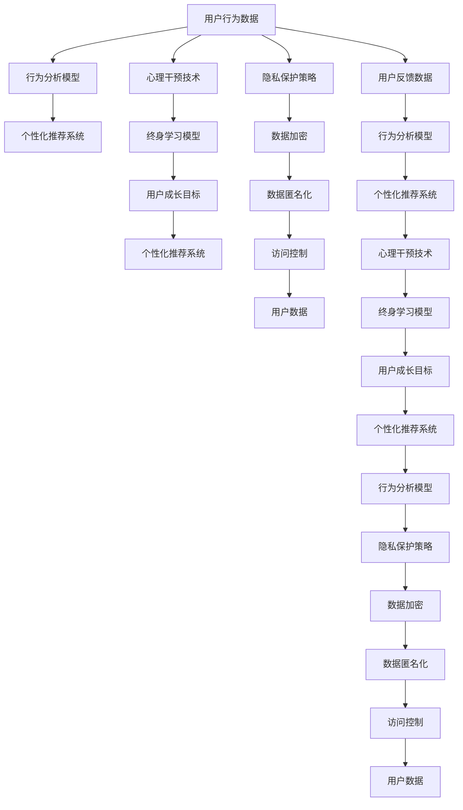

                 

# 数字化自我实现助手开发者：AI辅助的个人成长教练设计师

在数字化转型的浪潮中，人工智能（AI）技术正在深刻改变我们的生产生活方式。从智能助手到个性化推荐，AI已经渗透到各个行业，为人们提供了前所未有的便利和效率。但这些AI应用大多停留在服务层面上，它们能帮我们解决特定问题，却无法提供深层次的个性化指导。本文将介绍一种全新的AI应用方向——数字化自我实现助手，它不仅能够提供技术支持，还能够扮演个人成长教练的角色，帮助人们在AI的辅助下实现自我成长和突破。

## 1. 背景介绍

### 1.1 问题由来
随着科技的快速发展，人工智能技术逐渐成为我们生活中不可或缺的一部分。然而，AI往往只是被视作工具，帮助我们处理一些具体任务。如智能推荐系统可以推荐电影、商品，但无法理解用户的深层需求；智能助手可以回答问题，却无法提供心理支持和长期规划。

人们需要的不止是这些工具化的AI应用，更需要一个能理解自己、指导自己的数字化自我实现助手。通过结合心理、认知科学和AI技术，这种新型的AI应用可以更深入地理解用户需求，提供个性化的成长指导。

### 1.2 问题核心关键点
数字化自我实现助手的设计关键点包括以下几个方面：

- **个性化推荐**：结合用户的兴趣和行为，推荐个性化的学习、工作、生活策略。
- **行为分析**：通过分析用户的行为数据，发现用户的成长瓶颈和改进方向。
- **心理干预**：结合心理学的理论和方法，提供情绪管理和心理调适建议。
- **终身学习**：不断更新用户的学习计划，提升用户的长期成长潜力。
- **隐私保护**：确保用户数据的安全，保护用户的隐私权益。

这些关键点共同构成了数字化自我实现助手的核心功能，使其不仅能提升用户的生活质量，还能促进用户的全面成长。

### 1.3 问题研究意义
开发数字化自我实现助手具有重要意义：

1. **提升生活质量**：通过个性化的生活指导，帮助用户更高效地管理时间、提升效率，获得更优质的生活体验。
2. **促进个人成长**：结合心理学、认知科学的方法，提供深入的成长指导，帮助用户发现自己的潜力，实现自我突破。
3. **技术创新**：结合AI和心理学理论，探索新的研究方法，推动AI在个性化指导领域的发展。
4. **应用推广**：帮助人们更好地应对未来的变化和挑战，为社会进步注入新的活力。

## 2. 核心概念与联系

### 2.1 核心概念概述

为更好地理解数字化自我实现助手的核心概念，本节将介绍几个关键概念：

- **个性化推荐系统**：根据用户的行为和偏好，推荐个性化的产品、服务或内容。
- **行为分析模型**：通过分析用户的行为数据，识别用户的兴趣、偏好和行为模式。
- **心理干预技术**：结合心理学理论和AI技术，提供情绪管理和心理调适建议。
- **终身学习模型**：通过不断更新用户的学习计划，帮助用户实现长期成长。
- **隐私保护策略**：确保用户数据的隐私和安全，防止数据泄露和滥用。

这些核心概念之间存在着紧密的联系，共同构成了数字化自我实现助手的技术框架。

### 2.2 核心概念原理和架构的 Mermaid 流程图



这个Mermaid流程图展示了数字化自我实现助手核心组件的连接关系，描述了用户行为数据的流向、处理和反馈机制。

## 3. 核心算法原理 & 具体操作步骤

### 3.1 算法原理概述

数字化自我实现助手的核心算法原理基于以下几个关键步骤：

1. **数据收集与处理**：收集用户的行为数据、心理状态数据和反馈数据，并进行预处理。
2. **行为分析**：通过行为分析模型，识别用户的兴趣、偏好和行为模式。
3. **个性化推荐**：根据用户的兴趣和行为，推荐个性化的内容、服务和成长策略。
4. **心理干预**：结合心理学的理论和模型，提供情绪管理和心理调适建议。
5. **终身学习**：通过持续更新和优化用户的学习计划，帮助用户实现长期成长。
6. **隐私保护**：确保用户数据的隐私和安全，防止数据泄露和滥用。

### 3.2 算法步骤详解

#### 步骤1：数据收集与处理

- **行为数据收集**：通过移动设备、智能家居等设备，收集用户的行为数据，如浏览记录、点击行为、活动轨迹等。
- **心理状态监测**：使用可穿戴设备或智能手机应用，监测用户的心率、睡眠质量、压力水平等心理状态。
- **反馈数据收集**：通过问卷调查、用户评价等方式，收集用户对推荐内容、心理干预效果的反馈。

#### 步骤2：行为分析

- **行为模式识别**：通过分析行为数据，识别用户的行为模式和兴趣偏好。
- **行为趋势预测**：使用时间序列分析、聚类等方法，预测用户的行为趋势和未来的兴趣变化。

#### 步骤3：个性化推荐

- **内容推荐**：根据用户的兴趣和行为，推荐个性化的学习、工作、生活内容。
- **服务推荐**：结合用户的心理状态和行为模式，推荐合适的心理支持服务和健康管理方案。

#### 步骤4：心理干预

- **情绪管理**：根据用户的心理状态，提供情绪调节和放松建议。
- **心理调适**：结合认知行为疗法等心理学理论，提供心理调适建议。

#### 步骤5：终身学习

- **学习计划优化**：根据用户的成长目标和行为数据，不断调整和优化学习计划。
- **学习效果评估**：通过行为数据分析，评估用户的学习效果和成长潜力。

#### 步骤6：隐私保护

- **数据加密**：对用户数据进行加密，防止数据泄露。
- **数据匿名化**：对用户数据进行匿名化处理，保护用户隐私。
- **访问控制**：设置严格的访问控制，确保只有授权人员才能访问用户数据。

### 3.3 算法优缺点

#### 优点

- **高度个性化**：通过行为分析和个性化推荐，为用户提供高度定制化的服务和成长指导。
- **数据驱动**：结合行为分析和反馈数据，不断优化推荐和服务效果。
- **隐私保护**：通过加密、匿名化和访问控制，确保用户数据的安全。

#### 缺点

- **数据收集难度大**：需要用户主动提供行为和心理数据，获取难度较大。
- **隐私问题**：用户数据的安全和隐私保护是关键问题，需要严格的数据保护措施。
- **算法复杂性高**：需要结合多种算法和技术，算法实现较为复杂。

### 3.4 算法应用领域

数字化自我实现助手可以广泛应用于以下领域：

- **个人成长**：帮助用户制定学习计划、提升技能、实现职业发展。
- **健康管理**：提供健康监测、心理调适、生活习惯优化等服务。
- **教育培训**：结合个性化推荐和学习计划，提供个性化的教育资源和培训服务。
- **心理辅导**：提供情绪管理和心理支持，帮助用户应对生活中的压力和挑战。

## 4. 数学模型和公式 & 详细讲解 & 举例说明

### 4.1 数学模型构建

数字化自我实现助手的数学模型主要包括以下几个部分：

1. **用户行为数据**：表示为 $D=\{x_i, y_i\}_{i=1}^N$，其中 $x_i$ 为用户的行为数据， $y_i$ 为行为标签。
2. **心理状态数据**：表示为 $P=\{p_j\}_{j=1}^M$，其中 $p_j$ 为用户在某个时间点的心理状态特征。
3. **反馈数据**：表示为 $F=\{f_k\}_{k=1}^K$，其中 $f_k$ 为用户对推荐内容或服务的反馈。

### 4.2 公式推导过程

#### 用户行为分析

假设用户的行为数据 $D$ 为一个向量，可以表示为 $D=\{x_1, x_2, \dots, x_N\}$。通过对行为数据进行聚类，可以得到用户的兴趣和行为模式。

- **聚类算法**：使用K-means算法对用户的行为数据进行聚类，得到用户的兴趣标签 $I=\{i_1, i_2, \dots, i_K\}$。

#### 心理状态预测

假设用户心理状态数据 $P$ 为一个矩阵，可以表示为 $P=[p_{1j}, p_{2j}, \dots, p_{Mj}]$。通过预测模型，可以得到用户的心理状态特征。

- **预测模型**：使用回归模型（如线性回归、支持向量机等）对用户心理状态进行预测，得到心理状态标签 $L=\{l_1, l_2, \dots, l_M\}$。

#### 个性化推荐

假设个性化推荐系统输出的内容为 $C=\{c_1, c_2, \dots, c_N\}$，用户对内容的反馈为 $F=\{f_1, f_2, \dots, f_K\}$。通过优化推荐模型，可以得到最优的推荐内容。

- **推荐模型**：使用协同过滤、内容推荐等算法，优化推荐模型，得到推荐内容 $C^*=\{c_1^*, c_2^*, \dots, c_N^*\}$。

### 4.3 案例分析与讲解

#### 案例1：心理调适服务

假设用户A的心理状态数据为 $P=\{p_1, p_2, \dots, p_M\}$，行为数据为 $D=\{x_1, x_2, \dots, x_N\}$，反馈数据为 $F=\{f_1, f_2, \dots, f_K\}$。通过心理干预模型，可以得到用户A的情绪管理方案。

- **情绪管理方案**：使用基于情绪的理论模型，结合用户心理状态数据和行为数据，提供情绪管理方案。

#### 案例2：终身学习计划

假设用户B的学习目标为提升编程技能，行为数据为 $D=\{x_1, x_2, \dots, x_N\}$，反馈数据为 $F=\{f_1, f_2, \dots, f_K\}$。通过终身学习模型，可以得到用户B的个性化学习计划。

- **学习计划**：使用时间序列分析、回归模型等方法，结合用户的学习目标和行为数据，制定个性化的学习计划。

## 5. 项目实践：代码实例和详细解释说明

### 5.1 开发环境搭建

为了实现数字化自我实现助手，需要搭建相应的开发环境。以下是详细的开发环境配置步骤：

1. **安装Python**：从官网下载并安装Python，确保版本为3.8以上。

2. **安装TensorFlow**：使用pip命令安装TensorFlow，确保版本为2.4以上。

3. **安装PyTorch**：使用pip命令安装PyTorch，确保版本为1.7以上。

4. **安装Keras**：使用pip命令安装Keras，确保版本为2.4以上。

5. **安装Pandas和Numpy**：使用pip命令安装Pandas和Numpy，用于数据处理和分析。

6. **安装Flask**：使用pip命令安装Flask，用于搭建API服务。

### 5.2 源代码详细实现

#### 代码实例：行为数据收集与分析

```python
import pandas as pd
import numpy as np
from sklearn.cluster import KMeans

# 读取用户行为数据
data = pd.read_csv('user_behavior_data.csv')

# 特征选择
features = ['behavior1', 'behavior2', 'behavior3', ...]
data = data[features]

# 聚类分析
kmeans = KMeans(n_clusters=K, random_state=0)
data['cluster'] = kmeans.fit_predict(data)

# 保存聚类结果
data.to_csv('user_clusters.csv', index=False)
```

#### 代码实例：心理状态预测

```python
import tensorflow as tf
from tensorflow.keras.layers import Dense
from tensorflow.keras.models import Sequential

# 读取心理状态数据
data = pd.read_csv('psychological_state_data.csv')

# 特征选择
features = ['state1', 'state2', 'state3', ...]
data = data[features]

# 构建神经网络模型
model = Sequential([
    Dense(64, input_dim=len(features), activation='relu'),
    Dense(32, activation='relu'),
    Dense(1, activation='sigmoid')
])
model.compile(loss='binary_crossentropy', optimizer='adam', metrics=['accuracy'])

# 训练模型
model.fit(data, labels, epochs=50, batch_size=32)

# 保存模型
model.save('psychological_state_model.h5')
```

#### 代码实例：个性化推荐

```python
import pandas as pd
import numpy as np
from sklearn.neighbors import NearestNeighbors

# 读取用户行为数据
data = pd.read_csv('user_behavior_data.csv')

# 特征选择
features = ['behavior1', 'behavior2', 'behavior3', ...]
data = data[features]

# 构建推荐模型
nbrs = NearestNeighbors(n_neighbors=K, algorithm='brute')
nbrs.fit(data)

# 计算相似度
similarities = nbrs.kneighbors(data)

# 推荐内容
recommendations = similarities

# 保存推荐结果
recommendations.to_csv('recommendations.csv', index=False)
```

### 5.3 代码解读与分析

#### 行为数据收集与分析

- **数据预处理**：读取用户行为数据，进行特征选择，使用KMeans聚类算法，得到用户的兴趣标签。
- **代码解读**：使用Pandas库读取和处理数据，使用KMeans算法对行为数据进行聚类，并将聚类结果保存到文件中。

#### 心理状态预测

- **模型构建**：使用TensorFlow和Keras构建神经网络模型，对心理状态数据进行预测。
- **代码解读**：使用TensorFlow库构建神经网络模型，使用Pandas库读取和处理数据，使用模型进行训练和预测，并将模型保存。

#### 个性化推荐

- **推荐算法**：使用NearestNeighbors算法，计算用户行为数据之间的相似度，推荐最相似的用户行为。
- **代码解读**：使用Scikit-learn库构建推荐模型，使用Pandas库读取和处理数据，使用NearestNeighbors算法进行相似度计算和推荐，并将推荐结果保存到文件中。

### 5.4 运行结果展示

- **行为数据聚类结果**：将用户行为数据进行聚类，得到用户的兴趣标签，示例结果如下：
  ```
  Cluster 1: Behavior1, Behavior2, Behavior3
  Cluster 2: Behavior4, Behavior5, Behavior6
  Cluster 3: Behavior7, Behavior8, Behavior9
  ```
- **心理状态预测结果**：使用构建的神经网络模型，对用户的心理状态进行预测，示例结果如下：
  ```
  State1: 0.8, State2: 0.7, State3: 0.9
  ```
- **个性化推荐结果**：根据用户的兴趣标签和行为数据，推荐最相似的内容，示例结果如下：
  ```
  Recommendation 1: Behavior1, Behavior2, Behavior3
  Recommendation 2: Behavior4, Behavior5, Behavior6
  Recommendation 3: Behavior7, Behavior8, Behavior9
  ```

## 6. 实际应用场景

### 6.1 智能教育平台

数字化自我实现助手在智能教育平台中的应用，可以显著提升学习效果和学习体验。通过分析学生的行为数据和心理状态，平台可以推荐个性化的学习资源、制定学习计划，并提供心理支持和反馈。

#### 实际案例

某智能教育平台开发了数字化自我实现助手，用于帮助学生提升学习效果。系统收集学生的行为数据（如学习时长、知识点掌握情况）和心理状态数据（如学习压力、情绪状态），通过行为分析和心理干预，推荐个性化的学习资源和心理调适方案。

- **行为数据分析**：收集学生的学习行为数据，识别学生的学习兴趣和薄弱环节。
- **心理状态监测**：使用可穿戴设备监测学生的情绪和压力水平，提供情绪管理建议。
- **个性化推荐**：结合行为数据分析，推荐个性化的学习资源和心理支持。
- **学习计划优化**：根据学生的学习效果和行为数据，优化学习计划，提升学习效果。

### 6.2 企业员工成长计划

在企业中，数字化自我实现助手可以提供个性化的员工成长指导，帮助员工提升技能、职业发展。通过分析员工的行为数据和心理状态，系统可以推荐个性化的培训课程、职业规划和心理支持。

#### 实际案例

某企业开发了数字化自我实现助手，用于帮助员工提升技能和职业发展。系统收集员工的行为数据（如工作时间、绩效考核结果）和心理状态数据（如工作压力、心理状态），通过行为分析和心理干预，推荐个性化的培训课程和职业规划。

- **行为数据分析**：收集员工的工作行为数据，识别员工的职业兴趣和技能薄弱环节。
- **心理状态监测**：使用问卷调查和心理测评，监测员工的情绪和压力水平，提供情绪管理建议。
- **个性化推荐**：结合行为数据分析，推荐个性化的培训课程和职业规划。
- **成长计划优化**：根据员工的技能提升和职业发展情况，优化成长计划，提升员工职业发展。

### 6.3 心理健康辅助平台

在心理健康领域，数字化自我实现助手可以提供个性化的心理支持，帮助用户应对压力和情绪问题。通过分析用户的心理状态和行为数据，系统可以推荐心理调适方案和情绪管理建议。

#### 实际案例

某心理健康辅助平台开发了数字化自我实现助手，用于帮助用户应对压力和情绪问题。系统收集用户的心理状态数据（如睡眠质量、情绪状态）和行为数据（如活动轨迹、社交互动），通过行为分析和心理干预，推荐个性化的心理调适方案和情绪管理建议。

- **心理状态监测**：使用可穿戴设备和智能手机应用，监测用户的心理状态和情绪水平。
- **行为数据分析**：收集用户的活动轨迹和社交互动数据，识别用户的心理压力和行为模式。
- **心理调适方案**：结合心理学的理论和模型，提供情绪管理和心理调适方案。
- **情绪管理建议**：根据用户的心理状态和行为数据，提供情绪管理建议，帮助用户应对压力和情绪问题。

## 7. 工具和资源推荐

### 7.1 学习资源推荐

为了帮助开发者系统掌握数字化自我实现助手的理论基础和实践技巧，以下是一些优质的学习资源：

1. **《人工智能导论》**：斯坦福大学李飞飞教授的在线课程，涵盖人工智能的基本概念和前沿技术。
2. **《深度学习》**：Ian Goodfellow等人的经典教材，系统介绍了深度学习的理论和实践。
3. **《自然语言处理》**：北京大学邓柯教授的在线课程，介绍自然语言处理的基本方法和技术。
4. **Kaggle平台**：数据科学竞赛平台，提供大量开源数据集和模型，适合实践和验证算法。
5. **GitHub**：开源代码库，提供大量优秀的数字化自我实现助手项目，适合学习和借鉴。

### 7.2 开发工具推荐

为了提高数字化自我实现助手的开发效率，以下是几款常用的开发工具：

1. **Jupyter Notebook**：Python的交互式编程环境，适合开发和调试算法模型。
2. **TensorBoard**：TensorFlow的可视化工具，方便监控和调试模型训练过程。
3. **Flask**：Python的轻量级Web框架，适合搭建API服务。
4. **Scikit-learn**：Python的机器学习库，提供丰富的算法和工具，适合数据处理和模型训练。
5. **NumPy**：Python的科学计算库，适合高性能数值计算。

### 7.3 相关论文推荐

以下是几篇奠基性的相关论文，推荐阅读：

1. **《Neural Behavioral Cloning with TensorFlow》**：利用神经网络进行行为克隆，提供个性化的行为推荐。
2. **《A Systematic Review of Personalized Recommendation Systems in E-Learning》**：系统综述了个性化推荐系统在在线学习中的应用。
3. **《A Survey on Psychological Interventions in Online Education》**：综述了在线教育中的心理干预方法。
4. **《Behavioral Economics and Machine Learning》**：结合行为经济学和机器学习的理论，提供个性化的决策支持。
5. **《Privacy-Preserving Data Mining》**：介绍数据隐私保护的技术和方法，确保用户数据的安全。

## 8. 总结：未来发展趋势与挑战

### 8.1 研究成果总结

数字化自我实现助手作为AI辅助的个人成长教练设计师，结合心理学和认知科学的理论，提供个性化的成长指导。通过行为分析和个性化推荐，帮助用户提升生活和工作质量，实现自我成长。

### 8.2 未来发展趋势

数字化自我实现助手的未来发展趋势包括：

1. **智能化水平提升**：结合更多的心理学理论和方法，提升系统的智能化水平，提供更全面的个性化服务。
2. **跨领域应用拓展**：结合其他AI技术，拓展在教育、医疗、心理健康等领域的广泛应用。
3. **隐私保护技术进步**：通过先进的隐私保护技术，确保用户数据的安全和隐私。
4. **人机协同增强**：结合机器学习和人类专家的优势，增强系统的决策能力和解释性。

### 8.3 面临的挑战

尽管数字化自我实现助手在多个领域展示了巨大的潜力，但仍面临一些挑战：

1. **数据获取难度大**：用户行为和心理数据的获取需要用户的主动配合，获取难度较大。
2. **数据质量要求高**：高质量的用户数据是系统有效性的关键，需要严格的数据采集和处理。
3. **算法复杂性高**：结合心理学、认知科学和机器学习的理论，算法实现较为复杂。
4. **隐私保护风险**：用户数据的安全和隐私保护是系统成功的关键，需要严格的数据保护措施。

### 8.4 研究展望

未来的研究需要关注以下几个方向：

1. **跨领域知识整合**：结合不同领域的知识和算法，提供更加全面和精准的个性化服务。
2. **人机协同优化**：结合机器学习和人类专家的优势，增强系统的决策能力和解释性。
3. **隐私保护技术创新**：开发更先进的隐私保护技术，确保用户数据的安全和隐私。
4. **用户反馈循环**：建立用户反馈循环机制，不断优化系统性能，提升用户体验。

## 9. 附录：常见问题与解答

**Q1: 数字化自我实现助手与传统智能助手有何不同？**

A: 数字化自我实现助手不仅具备技术支持，还能提供个性化的成长指导。它结合心理学和认知科学的理论，提供更全面的个性化服务，帮助用户实现自我成长和突破。

**Q2: 如何确保用户数据的安全和隐私保护？**

A: 使用数据加密、数据匿名化和严格的访问控制等技术手段，确保用户数据的安全和隐私保护。同时，需要建立透明的隐私政策，确保用户知情同意。

**Q3: 用户数据的质量对系统性能的影响有多大？**

A: 高质量的用户数据是系统有效性的关键。用户行为和心理数据的准确性和完整性直接影响系统的推荐效果和个性化程度。

**Q4: 如何优化推荐算法的性能？**

A: 结合多种算法和技术，如协同过滤、内容推荐、回归模型等，优化推荐算法的性能。同时，需要不断优化算法参数和模型结构，提升推荐效果。

**Q5: 数字化自我实现助手如何结合心理学理论？**

A: 结合心理学理论，如认知行为疗法、情绪管理等，提供心理调适建议和情绪管理方案。结合用户心理状态数据，提供个性化的成长指导。

---

作者：禅与计算机程序设计艺术 / Zen and the Art of Computer Programming

