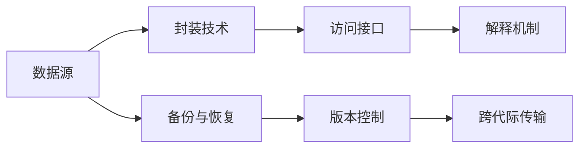

                 

# 数字化遗产时间胶囊创业：跨代际的信息传递

## 1. 背景介绍

随着科技的飞速发展，数字化遗产问题日益突出。如何确保子孙后代能够访问到先辈们留存的信息，成为了数字化时代的一个重要课题。数字遗产通常包括文档、图片、视频、代码等多种形式，存储在不同类型的数据库或文件系统中。要使这些遗产能够跨代际传承，需要进行有效的数字化遗产管理与保护。

数字化遗产时间胶囊的创业，是一种通过技术手段保存和传递人类文化遗产的新模式。它将具有历史价值的信息封装在特定的数字化空间中，由未来的用户通过特定的接口进行访问和解释。这种创业模式的提出，对于保存和传承人类智慧，具有深远意义。

本文将深入探讨数字化遗产时间胶囊的原理、构建方法、实际应用及未来发展方向。

## 2. 核心概念与联系

### 2.1 核心概念概述

数字化遗产时间胶囊（Digital Heritage Capsule）是指利用数字技术将具有历史价值的信息，封装在一个特定的数字化空间中，通过跨代际的技术手段实现信息传递。其核心组成包括：

- **数据源**：原始的信息数据，包括文本、图片、视频、代码等。
- **封装技术**：将数据封装进特定格式的容器，如NFT（非同质化代币）、区块链等。
- **访问接口**：未来用户能够访问胶囊的接口，可以是Web应用程序、移动应用程序或虚拟现实（VR）环境等。
- **解释机制**：用于解释胶囊内容的辅助工具和算法，如自然语言处理（NLP）、图像识别、代码解释器等。

### 2.2 核心概念原理和架构的 Mermaid 流程图



## 3. 核心算法原理 & 具体操作步骤

### 3.1 算法原理概述

数字化遗产时间胶囊的构建基于分布式数据存储与封装技术。其核心流程包括数据封装、分布式存储、版本控制和跨代际传输。每个环节都需要相应的算法和技术支持，以达到可靠、高效、安全的保存与访问效果。

### 3.2 算法步骤详解

#### 3.2.1 数据封装

数据封装是将原始数据压缩成特定格式，并添加必要的元数据和验证信息。常用的封装技术包括：

- **NFT技术**：通过区块链技术将数据加密封装成NFT，确保数据的不可篡改性和唯一性。
- **Hierarchicalarchical Wormhole（HWP）技术**：将数据分层次封装，通过多层加密保护数据安全。
- **格式转换与压缩**：将数据转换为二进制格式，并使用高效压缩算法，减少存储空间。

#### 3.2.2 分布式存储

分布式存储是将封装好的数据分布在多个节点上进行存储，以提高数据冗余和可靠性。常用的分布式存储技术包括：

- **IPFS（InterPlanetary File System）**：基于分布式网络的非集中式文件存储系统。
- **Amazon S3**：亚马逊云存储服务，提供高可扩展性的分布式存储方案。
- **GlusterFS**：开源分布式文件系统，支持跨节点数据存储与访问。

#### 3.2.3 版本控制

版本控制是为了确保数据的一致性和可追溯性，对每个版本的封装数据进行管理。常用的版本控制技术包括：

- **Git**：开源的分布式版本控制系统，支持代码的版本控制，也可用于封装数据的版本管理。
- **Subversion**：集中式版本控制系统，适合团队协作管理。
- **GitLab**：结合版本控制与持续集成/持续部署（CI/CD）功能的平台。

#### 3.2.4 跨代际传输

跨代际传输是指将数据封装并通过特定的传输协议，实现不同代际之间的数据传递。常用的跨代际传输技术包括：

- **HTTPS**：安全传输协议，确保数据传输过程中的安全性。
- **WebSocket**：基于TCP的实时通信协议，支持数据的高效传输。
- **Web3.0技术**：利用区块链等技术，实现数据的高安全性和高可靠传输。

### 3.3 算法优缺点

#### 3.3.1 优点

- **安全性**：通过加密、分布式存储和版本控制等技术，确保数据的安全性和完整性。
- **可靠性**：多节点分布式存储，提高数据的冗余性和可靠性。
- **扩展性**：基于分布式存储和版本控制，支持数据的无限扩展和追溯。
- **可访问性**：通过访问接口和解释机制，使数据易于访问和解释。

#### 3.3.2 缺点

- **复杂性**：封装、存储和传输技术的复杂性较高，需要跨学科的知识。
- **成本**：区块链和分布式存储技术的部署成本较高，不适合小型创业项目。
- **技术门槛**：需要专业的技术团队和持续的技术支持。
- **隐私保护**：在封装和传输过程中，需要考虑用户隐私的保护。

### 3.4 算法应用领域

数字化遗产时间胶囊的应用领域广泛，主要涵盖以下几个方面：

- **文化遗产保护**：将历史文物、文献等文化资料封装为时间胶囊，确保其能够传承。
- **家族记录管理**：保存家族成员的出生、成长、重要事件等记录，供后代查看。
- **企业档案管理**：保存企业的历史资料、项目记录等，供企业内部参考。
- **个人数据管理**：保存个人的日记、信件、照片等，供后代了解个人生活轨迹。
- **数字艺术收藏**：将数字艺术品封装为时间胶囊，确保其长久保存和传承。

## 4. 数学模型和公式 & 详细讲解 & 举例说明

### 4.1 数学模型构建

假设我们要构建一个包含文本数据$D$的时间胶囊，其数学模型构建如下：

- **输入**：原始文本数据$D$，表示为$(x_1, x_2, ..., x_n)$。
- **输出**：封装后的时间胶囊数据$C$，表示为$(y_1, y_2, ..., y_m)$。
- **封装算法**：$F(D) = C$。

### 4.2 公式推导过程

封装算法$F$的推导如下：

1. **预处理**：对原始文本数据进行预处理，包括去除噪声、分割句子、去除停用词等操作，得到处理后的文本数据$D'$。
2. **编码**：将处理后的文本数据$D'$转换为数字表示，可以使用词嵌入（Word Embedding）技术，得到数字序列$D''$。
3. **压缩**：对数字序列$D''$进行压缩，可以使用哈夫曼编码、LZ77算法等，得到压缩后的数字序列$D'''$。
4. **封装**：将压缩后的数字序列$D'''$封装成特定格式的时间胶囊数据$C$。

### 4.3 案例分析与讲解

以一段历史文献为例，其封装过程如下：

1. **预处理**：去除原始文本中的噪声和格式化错误，将文本分割成句子。
2. **编码**：使用Word2Vec技术对每个句子进行编码，得到向量表示。
3. **压缩**：使用LZ77算法对向量进行压缩，减少存储空间。
4. **封装**：将压缩后的向量序列封装成NFT，生成时间胶囊数据。

## 5. 项目实践：代码实例和详细解释说明

### 5.1 开发环境搭建

要搭建一个数字化遗产时间胶囊的开发环境，需要以下工具：

1. **Python**：作为开发语言。
2. **Flask**：用于构建Web应用程序。
3. **IPFS**：作为分布式存储后端。
4. **NFT库**：如Filecoin库，用于封装时间胶囊数据。
5. **Git**：版本控制系统，用于数据版本管理。

### 5.2 源代码详细实现

以下是一个使用Python和Flask构建时间胶囊的代码实现：

```python
from flask import Flask, request, jsonify
import numpy as np
import cv2
import IPFS
import os

app = Flask(__name__)

# 加载图像数据
def load_image(image_path):
    img = cv2.imread(image_path)
    return img

# 预处理图像数据
def preprocess_image(img):
    gray = cv2.cvtColor(img, cv2.COLOR_BGR2GRAY)
    return gray

# 将图像数据压缩并封装
def compress_image(gray):
    return gray.tobytes()

# 将时间胶囊数据保存到IPFS
def save_to_ipfs(image_data):
    client = IPFS.Client()
    response = client.add(image_data)
    hash = response[0]
    return hash

# 封装时间胶囊
def create_capsule(image_data):
    # 加载原始图像数据
    img = load_image(image_path)
    
    # 预处理图像数据
    gray = preprocess_image(img)
    
    # 压缩并封装图像数据
    compressed_data = compress_image(gray)
    
    # 将数据保存到IPFS
    hash = save_to_ipfs(compressed_data)
    
    return hash

@app.route('/create_capsule', methods=['POST'])
def create_capsule_endpoint():
    image_data = request.files.get('image')
    if image_data:
        hash = create_capsule(image_data)
        return jsonify(hash=hash)
    else:
        return jsonify(error='Invalid request')

if __name__ == '__main__':
    app.run(debug=True, host='0.0.0.0', port=5000)
```

### 5.3 代码解读与分析

**load_image函数**：加载图像数据，使用OpenCV库进行图像读取和预处理。

**preprocess_image函数**：对图像数据进行灰度化处理，减少存储空间。

**compress_image函数**：使用numpy库将图像数据转换为字节流，并进行压缩。

**save_to_ipfs函数**：将压缩后的图像数据保存到IPFS网络中，返回对应的哈希值。

**create_capsule函数**：封装时间胶囊，包括加载、预处理、压缩和封装步骤，最终返回封装后的哈希值。

**create_capsule_endpoint函数**：Flask应用的端点函数，用于接收用户上传的图像数据，并封装成时间胶囊数据。

### 5.4 运行结果展示

假设我们上传了一张历史文献的图像，运行上述代码，即可得到封装后的时间胶囊数据的哈希值。

```sh
curl -X POST -F "image=@history_document.jpg" http://127.0.0.1:5000/create_capsule
```

## 6. 实际应用场景

### 6.1 文化遗产保护

在文化遗产保护领域，数字化遗产时间胶囊可以用于保存和展示历史文物、考古发掘报告、历史文献等。通过时间胶囊，后世用户可以更直观地了解和体验先辈们的文化传承。

### 6.2 家族记录管理

家族记录管理方面，数字化遗产时间胶囊可以用于保存家族成员的出生、成长、婚姻、葬礼等重要事件的记录。这些记录不仅具有家族意义，还对社会历史研究有重要价值。

### 6.3 企业档案管理

企业档案管理方面，数字化遗产时间胶囊可以用于保存企业的重要会议记录、项目资料、技术文档等，供企业内部和外部参考。

### 6.4 个人数据管理

个人数据管理方面，数字化遗产时间胶囊可以用于保存个人的日记、信件、照片等，供后代了解个人生活轨迹。

### 6.5 数字艺术收藏

数字艺术收藏方面，数字化遗产时间胶囊可以用于保存数字艺术品，如数字绘画、3D模型、数字音乐等，确保其长久保存和传承。

## 7. 工具和资源推荐

### 7.1 学习资源推荐

1. **《区块链技术与数字遗产保护》**：介绍区块链技术在数字遗产保护中的应用，包括NFT、IPFS等。
2. **《数字遗产管理与保护》**：讨论数字化遗产的管理与保护策略，涵盖数据封装、存储、传输等技术。
3. **《数字文化遗产研究》**：介绍数字文化遗产的概念、特征、保护与传播方法。

### 7.2 开发工具推荐

1. **PyTorch**：深度学习框架，支持各种模型的构建和训练。
2. **Flask**：Python Web框架，用于构建时间胶囊的Web应用程序。
3. **Git**：版本控制系统，支持数据版本管理。
4. **Jupyter Notebook**：交互式编程环境，用于数据分析和模型调试。

### 7.3 相关论文推荐

1. **《数字化遗产的保护与传承：基于区块链技术的方案》**：探讨区块链技术在数字化遗产保护中的应用。
2. **《数字化遗产管理系统的设计与实现》**：介绍数字化遗产管理系统的架构与实现方法。
3. **《数字文化遗产的智能保护与传播》**：讨论数字文化遗产的智能保护和传播方法。

## 8. 总结：未来发展趋势与挑战

### 8.1 研究成果总结

本文对数字化遗产时间胶囊的原理、构建方法、实际应用及未来发展方向进行了详细探讨。通过技术手段实现跨代际的信息传递，为保存和传承人类智慧提供了新思路。数字化遗产时间胶囊的构建，结合了数据封装、分布式存储、版本控制和跨代际传输等技术，能够有效地保护和传播文化遗产。

### 8.2 未来发展趋势

数字化遗产时间胶囊的未来发展趋势如下：

1. **跨平台支持**：开发多平台的访问接口，支持桌面端、移动端、VR环境等。
2. **自动化封装**：开发自动化封装工具，简化用户操作，提高封装效率。
3. **跨语言支持**：支持多种语言的时间胶囊封装与访问，提高全球用户的使用体验。
4. **元数据管理**：增加元数据管理功能，记录时间胶囊的创建、修改、访问等详细信息。
5. **社区驱动**：开发社区驱动的元数据管理与注释工具，增强用户参与度。

### 8.3 面临的挑战

数字化遗产时间胶囊的实现面临以下挑战：

1. **数据隐私**：在数据封装和传输过程中，需要考虑用户隐私的保护。
2. **技术复杂性**：封装、存储和传输技术的复杂性较高，需要跨学科的知识。
3. **成本问题**：区块链和分布式存储技术的部署成本较高，不适合小型创业项目。
4. **安全问题**：数据加密、存储和传输过程中需要保证数据的安全性和完整性。
5. **标准化问题**：缺乏统一的数字化遗产时间胶囊标准，影响跨平台和跨代际的互操作性。

### 8.4 研究展望

未来的研究应关注以下几个方向：

1. **标准化研究**：制定统一的数字化遗产时间胶囊标准，推动跨平台和跨代际的互操作性。
2. **隐私保护**：研究隐私保护技术，确保时间胶囊数据在传输和存储过程中的安全性。
3. **自动化封装**：开发自动化封装工具，简化用户操作，提高封装效率。
4. **元数据管理**：增加元数据管理功能，记录时间胶囊的创建、修改、访问等详细信息。
5. **跨语言支持**：支持多种语言的时间胶囊封装与访问，提高全球用户的使用体验。

总之，数字化遗产时间胶囊的实现需要多学科的协作与创新，未来在标准化、隐私保护、自动化封装等方面仍需不断努力，才能实现其广泛应用。

## 9. 附录：常见问题与解答

### 常见问题

**Q1: 数字化遗产时间胶囊的主要应用场景有哪些？**

A: 数字化遗产时间胶囊可以应用于文化遗产保护、家族记录管理、企业档案管理、个人数据管理、数字艺术收藏等领域。

**Q2: 数字化遗产时间胶囊的封装技术有哪些？**

A: 常用的封装技术包括NFT、Hierarchicalarchical Wormhole（HWP）、格式转换与压缩等。

**Q3: 如何将时间胶囊数据保存到IPFS？**

A: 可以使用IPFS客户端的add方法，将时间胶囊数据保存到IPFS网络中，并返回对应的哈希值。

**Q4: 如何保护时间胶囊数据的隐私？**

A: 在数据封装和传输过程中，需要考虑用户隐私的保护，可以使用加密技术、访问控制等手段。

**Q5: 如何实现跨平台支持？**

A: 开发多平台的访问接口，支持桌面端、移动端、VR环境等，以便用户在不同平台上访问时间胶囊。

通过回答这些问题，可以帮助读者更好地理解数字化遗产时间胶囊的核心技术和应用场景，从而推动这一创新领域的进一步发展。

---

作者：禅与计算机程序设计艺术 / Zen and the Art of Computer Programming

