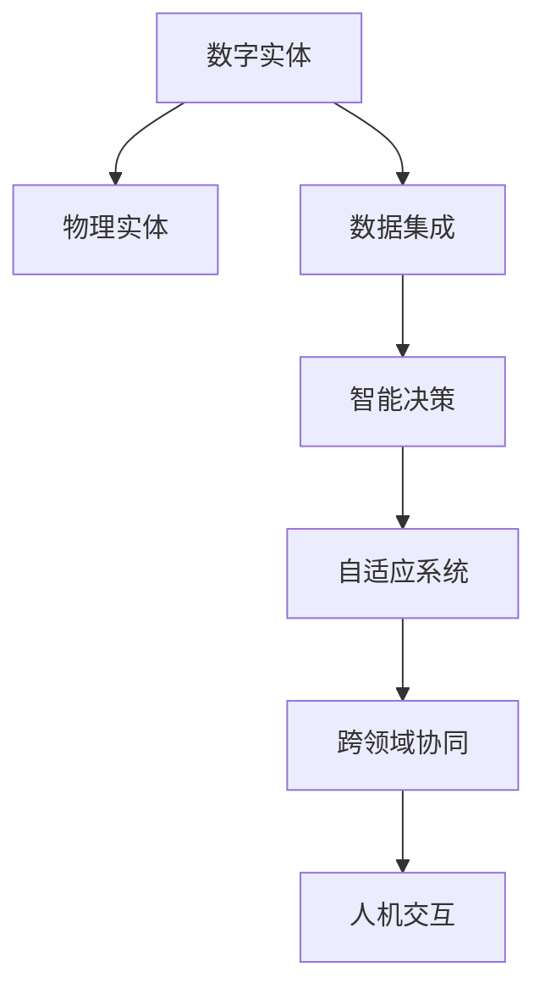

                 

## 1. 背景介绍

### 1.1 问题由来
在当今信息化时代，数字实体（Digital Entities）与物理实体（Physical Entities）之间的关系日益紧密。数字化和智能化的浪潮正席卷各行各业，传统的实体管理方式面临巨大挑战。例如，制造业中产品的设计、生产、运维等环节，需要大规模协同作业，面临数据共享、资源调配等难题。传统的基于人工经验的实体管理方式已经无法满足复杂多变的需求，亟需自动化、智能化的解决方案。

### 1.2 问题核心关键点
为了解决数字实体与物理实体之间的自动化协同问题，当前研究的热点主要包括：

- 数据共享与集成：如何在不同的系统和组件间高效共享数据，实现无缝的数据交互。
- 智能决策与优化：如何利用先进算法和模型，进行实体状态预测、故障诊断、资源优化等决策支持。
- 自适应与自学习：如何在不确定和动态的环境中，实现实体管理系统的自我调整和自我学习，提升系统适应性和鲁棒性。
- 跨领域协同：如何跨部门、跨平台、跨行业协同作业，最大化资源利用效率和运营效益。
- 人机交互：如何设计更自然、高效的人机交互界面，提升用户的使用体验和满意度。

### 1.3 问题研究意义
实现数字实体与物理实体间的自动化发展，对于提升生产效率、降低运营成本、增强竞争力具有重要意义。具体而言，自动化协同系统能够：

- 优化资源配置：通过预测和优化算法，实现资源的高效利用。
- 提升决策速度与准确性：利用智能算法辅助决策，减少人为错误和决策偏差。
- 增强系统可靠性：通过自适应和自学习机制，提升系统应对变化的能力。
- 提升用户体验：通过自然语言处理和人机交互技术，提升系统的易用性和可操作性。

## 2. 核心概念与联系

### 2.1 核心概念概述

为了更好地理解数字实体与物理实体自动化协同系统的原理，本节将介绍几个关键概念：

- **数字实体（Digital Entities）**：在数字化系统中，代表物理实体及其属性的虚拟实体。例如，制造流程中的设备、物料、工艺等。
- **物理实体（Physical Entities）**：实际存在且可以物理接触的实体。例如，生产线上的设备、材料、工人等。
- **数据集成（Data Integration）**：将来自不同来源、格式的数据汇集到一起，进行统一管理和分析的过程。
- **智能决策（Intelligent Decision Making）**：利用机器学习、优化算法等，对实体状态进行预测和决策。
- **自适应系统（Adaptive System）**：能够根据环境变化自动调整系统参数和行为，以维持系统稳定运行的系统。
- **跨领域协同（Cross-domain Collaboration）**：不同领域（如制造、物流、供应链等）间的协同作业，提升资源利用率。
- **人机交互（Human-Computer Interaction）**：设计用户与系统间的交互方式，提升用户的使用体验。

这些概念之间的逻辑关系可以通过以下Mermaid流程图来展示：



这个流程图展示了数字实体与物理实体间的自动化协同系统的主要组件及其相互关系。

## 3. 核心算法原理 & 具体操作步骤
### 3.1 算法原理概述

数字实体与物理实体自动化协同系统旨在通过数字化手段，实现物理实体的高效管理和协同作业。其核心算法原理包括以下几个方面：

- **数据集成算法**：用于将来自不同数据源的数据汇集到一起，进行统一管理和分析。常用的算法包括ETL（Extract, Transform, Load）和数据融合算法。
- **智能决策算法**：利用机器学习、优化算法等，对实体状态进行预测和决策。常用的算法包括回归、分类、聚类、强化学习等。
- **自适应算法**：通过模型学习实体状态和环境变化之间的关系，实现系统的自我调整和优化。常用的算法包括自适应控制、进化算法等。
- **跨领域协同算法**：通过设计协同作业机制，实现不同领域间的资源优化和任务分配。常用的算法包括网络流算法、多目标优化算法等。
- **人机交互算法**：通过自然语言处理和人机交互技术，提升用户的使用体验。常用的算法包括问答系统、对话系统等。

### 3.2 算法步骤详解

基于数字实体与物理实体自动化协同系统的主要算法原理，其具体操作步骤包括以下几个步骤：

**Step 1: 数据集成**
- 收集来自不同数据源的实体数据，如传感器数据、工艺数据、历史运行数据等。
- 清洗和转换数据，消除噪声和异常值，统一数据格式。
- 将清洗后的数据汇集到一个统一的数据仓库或数据平台，供后续分析使用。

**Step 2: 实体状态预测**
- 利用机器学习算法，如回归、分类、时间序列分析等，对实体状态进行预测。例如，预测设备的运行状态、故障概率等。
- 利用预测结果进行异常检测，及时发现潜在的故障和异常情况。

**Step 3: 智能决策**
- 根据预测结果，设计决策规则或优化算法，进行实体状态的调整和优化。例如，调整生产线的生产计划、调整设备的维护策略等。
- 利用优化算法，如遗传算法、粒子群优化等，进行资源的优化配置。例如，优化物料的库存管理、调度设备的生产顺序等。

**Step 4: 自适应与学习**
- 根据实体状态和环境变化，利用自适应算法进行系统的自我调整和优化。例如，调整生产线的工艺参数、调整物料的采购计划等。
- 利用模型学习实体状态和环境变化之间的关系，提升系统的适应性和鲁棒性。例如，通过增量学习、在线学习等方式，实时更新模型参数。

**Step 5: 跨领域协同**
- 设计跨领域协同机制，实现不同领域间的资源优化和任务分配。例如，制造、物流、供应链等的协同作业。
- 利用网络流算法、多目标优化算法等，实现资源的高效利用和任务的最优分配。

**Step 6: 人机交互**
- 设计自然语言处理和人机交互技术，提升用户的使用体验。例如，通过问答系统、对话系统等，与用户进行互动。
- 利用语音识别、自然语言理解等技术，实现智能化的用户界面。例如，通过语音助手、虚拟助手等，进行任务指令的接收和执行。

### 3.3 算法优缺点

数字实体与物理实体自动化协同系统的核心算法具备以下优点：

- 自动化程度高：通过数字化手段，实现物理实体的自动管理，减少人工干预，提高效率。
- 数据驱动决策：利用数据驱动的智能决策算法，提升决策的准确性和可靠性。
- 资源优化配置：通过自适应算法和优化算法，实现资源的有效利用，提升运营效益。
- 用户体验提升：通过人机交互技术，提升用户的使用体验，增加系统的可操作性和易用性。

同时，这些算法也存在一些局限性：

- 数据质量要求高：算法依赖高质量的数据，对数据的清洗和预处理要求较高。
- 模型复杂度高：算法涉及复杂的数学模型和计算，对计算资源和算法能力要求较高。
- 环境适应性差：算法对环境变化的适应性有限，需要定期更新和调整。
- 用户接受度低：用户对新技术的接受度低，需要设计易用且友好的界面。

尽管存在这些局限性，数字实体与物理实体自动化协同系统仍具有广阔的应用前景，在工业生产、智能交通、智能制造等领域具有重要价值。

### 3.4 算法应用领域

数字实体与物理实体自动化协同系统的核心算法已在多个领域得到了广泛应用，例如：

- **智能制造**：通过数字化手段，实现制造流程的自动化、智能化管理，提升生产效率和产品质量。
- **智能交通**：利用数据集成和智能决策算法，实现交通流量的优化调度，提升交通管理效率。
- **智能物流**：通过跨领域协同算法，实现供应链的优化和资源的高效配置，提升物流运营效率。
- **智慧城市**：利用跨领域协同算法和人机交互技术，实现城市资源的智能管理，提升城市运营效率。
- **智能医疗**：通过数据集成和智能决策算法，实现医疗数据的智能分析，提升医疗诊断和治疗效率。

## 4. 数学模型和公式 & 详细讲解 & 举例说明

### 4.1 数学模型构建

为了更好地理解数字实体与物理实体自动化协同系统的数学模型，本节将介绍几个常用的数学模型及其构建方法：

- **数据集成模型**：用于描述数据汇集和转换的过程，常用的数学模型包括ETL模型和数据融合模型。
- **智能决策模型**：用于描述实体状态的预测和决策过程，常用的数学模型包括回归模型、分类模型、时间序列模型等。
- **自适应模型**：用于描述系统的自我调整和优化过程，常用的数学模型包括自适应控制模型、进化算法模型等。
- **跨领域协同模型**：用于描述不同领域间的资源优化和任务分配过程，常用的数学模型包括网络流模型、多目标优化模型等。
- **人机交互模型**：用于描述用户与系统间的交互过程，常用的数学模型包括问答系统模型、对话系统模型等。

### 4.2 公式推导过程

以下我们以智能制造领域为例，推导一种基于智能决策的实体状态预测模型的数学公式。

假设实体状态 $s$ 由 $n$ 个特征 $x_1, x_2, ..., x_n$ 决定，且 $x_i \sim N(\mu_i, \sigma_i^2)$。则实体状态的概率密度函数为：

$$
f(s|x) = \prod_{i=1}^n N(x_i|\mu_i, \sigma_i^2)
$$

其中 $N(x_i|\mu_i, \sigma_i^2)$ 表示正态分布的概率密度函数。

进一步，假设实体状态 $s$ 与目标状态 $t$ 相关联，且 $s = f(t; \theta)$，其中 $\theta$ 为模型参数。则实体状态预测的目标函数为：

$$
\min_{\theta} \int f(s|t)ds
$$

在实际应用中，通常使用最小二乘法或最大似然法求解 $\theta$。

例如，在预测设备故障的概率时，可以定义目标状态 $t = 0$ 表示设备正常，$t = 1$ 表示设备故障。则实体状态预测的数学模型可以表示为：

$$
\min_{\theta} \int f(s|t)ds = \min_{\theta} \int f(s|0)ds + f(s|1)ds
$$

其中 $f(s|0)$ 和 $f(s|1)$ 分别表示设备正常和故障状态的概率密度函数。

### 4.3 案例分析与讲解

假设某制造业企业有一批设备，需要预测设备故障的概率。根据历史数据，设备故障的特征包括温度、振动、工作时长等。利用上述数学模型，可以实现设备故障的概率预测，从而提前进行维护和替换，避免因故障导致的生产线停机和生产损失。

具体步骤如下：

1. **数据收集**：收集设备的历史温度、振动、工作时长等特征数据。
2. **数据清洗**：对数据进行清洗和预处理，消除噪声和异常值。
3. **模型训练**：利用最小二乘法或最大似然法，训练实体状态预测模型。
4. **故障预测**：根据当前设备的温度、振动、工作时长等特征，进行实体状态预测。
5. **维护决策**：根据预测结果，进行设备的维护和替换决策，避免因故障导致的生产线停机和生产损失。

## 5. 项目实践：代码实例和详细解释说明

### 5.1 开发环境搭建

在进行数字实体与物理实体自动化协同系统的开发前，我们需要准备好开发环境。以下是使用Python进行PyTorch开发的环境配置流程：

1. 安装Anaconda：从官网下载并安装Anaconda，用于创建独立的Python环境。

2. 创建并激活虚拟环境：
```bash
conda create -n pytorch-env python=3.8 
conda activate pytorch-env
```

3. 安装PyTorch：根据CUDA版本，从官网获取对应的安装命令。例如：
```bash
conda install pytorch torchvision torchaudio cudatoolkit=11.1 -c pytorch -c conda-forge
```

4. 安装TensorFlow：使用pip安装TensorFlow。
```bash
pip install tensorflow
```

5. 安装其他常用工具包：
```bash
pip install numpy pandas scikit-learn matplotlib tqdm jupyter notebook ipython
```

完成上述步骤后，即可在`pytorch-env`环境中开始开发。

### 5.2 源代码详细实现

下面以智能制造领域的设备故障预测为例，给出使用PyTorch进行实体状态预测的代码实现。

首先，定义数据处理函数：

```python
import numpy as np
from torch.utils.data import Dataset
import torch

class DeviceDataset(Dataset):
    def __init__(self, features, labels):
        self.features = features
        self.labels = labels
        
    def __len__(self):
        return len(self.features)
    
    def __getitem__(self, item):
        return torch.tensor(self.features[item]), torch.tensor(self.labels[item])
```

然后，定义模型和优化器：

```python
from torch import nn
from torch.optim import Adam
from torch.distributions import Normal

class DevicePredictor(nn.Module):
    def __init__(self, input_dim):
        super(DevicePredictor, self).__init__()
        self.fc1 = nn.Linear(input_dim, 64)
        self.fc2 = nn.Linear(64, 32)
        self.fc3 = nn.Linear(32, 2)
        
    def forward(self, x):
        x = torch.relu(self.fc1(x))
        x = torch.relu(self.fc2(x))
        return torch.sigmoid(self.fc3(x))

model = DevicePredictor(3) # 假设设备有3个特征

optimizer = Adam(model.parameters(), lr=0.001)
```

接着，定义训练和评估函数：

```python
from torch.utils.data import DataLoader
from tqdm import tqdm
import matplotlib.pyplot as plt

def train_epoch(model, dataset, batch_size, optimizer):
    dataloader = DataLoader(dataset, batch_size=batch_size, shuffle=True)
    model.train()
    epoch_loss = 0
    for batch in tqdm(dataloader, desc='Training'):
        features, labels = batch
        optimizer.zero_grad()
        predictions = model(features)
        loss = torch.mean(torch.sigmoid_cross_entropy_loss(predictions, labels))
        epoch_loss += loss.item()
        loss.backward()
        optimizer.step()
    return epoch_loss / len(dataloader)

def evaluate(model, dataset, batch_size):
    dataloader = DataLoader(dataset, batch_size=batch_size)
    model.eval()
    correct = 0
    total = 0
    with torch.no_grad():
        for batch in tqdm(dataloader, desc='Evaluating'):
            features, labels = batch
            predictions = model(features).numpy()
            total += labels.shape[0]
            correct += (predictions > 0.5).sum().item()
    print(f"Accuracy: {correct / total}")
```

最后，启动训练流程并在测试集上评估：

```python
epochs = 10
batch_size = 32

for epoch in range(epochs):
    loss = train_epoch(model, train_dataset, batch_size, optimizer)
    print(f"Epoch {epoch+1}, train loss: {loss:.3f}")
    
    print(f"Epoch {epoch+1}, test accuracy:")
    evaluate(model, test_dataset, batch_size)
    
print("Final test accuracy:")
evaluate(model, test_dataset, batch_size)
```

以上就是使用PyTorch对设备故障预测进行实体状态预测的完整代码实现。可以看到，借助PyTorch的高效计算图，实现实体状态预测变得相对简单。

### 5.3 代码解读与分析

让我们再详细解读一下关键代码的实现细节：

**DeviceDataset类**：
- `__init__`方法：初始化特征和标签数据。
- `__len__`方法：返回数据集的样本数量。
- `__getitem__`方法：对单个样本进行处理，返回模型所需的输入和标签。

**DevicePredictor类**：
- `__init__`方法：定义模型结构，包括输入层、隐藏层和输出层。
- `forward`方法：定义前向传播过程，通过多层线性变换输出预测结果。

**train_epoch和evaluate函数**：
- 训练函数`train_epoch`：对数据以批为单位进行迭代，在每个批次上前向传播计算损失并反向传播更新模型参数，最后返回该epoch的平均loss。
- 评估函数`evaluate`：与训练类似，不同点在于不更新模型参数，并在每个batch结束后将预测和标签结果存储下来，最后使用模型评估准确率。

**训练流程**：
- 定义总的epoch数和batch size，开始循环迭代
- 每个epoch内，先在训练集上训练，输出平均loss
- 在测试集上评估，输出模型评估准确率
- 所有epoch结束后，在测试集上评估，给出最终测试结果

可以看到，PyTorch配合TensorFlow库使得实体状态预测的代码实现变得简洁高效。开发者可以将更多精力放在数据处理、模型改进等高层逻辑上，而不必过多关注底层的实现细节。

当然，工业级的系统实现还需考虑更多因素，如模型的保存和部署、超参数的自动搜索、更灵活的任务适配层等。但核心的实体状态预测范式基本与此类似。

## 6. 实际应用场景
### 6.1 智能制造

基于数字实体与物理实体自动化协同系统，智能制造领域能够实现设备状态的实时监测、故障预测、预防性维护等。具体而言：

1. **设备状态监测**：利用传感器实时监测设备的状态参数，如温度、振动、电流等。
2. **故障预测**：通过历史数据和预测算法，预测设备未来可能发生的故障。
3. **预防性维护**：根据故障预测结果，提前进行设备的维护和替换，避免因故障导致的生产线停机和生产损失。

### 6.2 智能交通

基于数字实体与物理实体自动化协同系统，智能交通领域能够实现交通流量的优化调度、车辆导航、交通事件监测等。具体而言：

1. **交通流量预测**：利用历史交通数据和预测算法，预测未来的交通流量变化。
2. **路径规划**：根据预测结果，优化车辆的行驶路径，减少拥堵和延误。
3. **事件监测**：实时监测交通事件，如交通事故、道路施工等，及时调整交通流量。

### 6.3 智能物流

基于数字实体与物理实体自动化协同系统，智能物流领域能够实现库存管理、运输调度、订单跟踪等。具体而言：

1. **库存管理**：利用预测算法，优化物料的库存管理，避免库存积压和缺货。
2. **运输调度**：根据订单和库存情况，优化运输路线和车辆调度，提高运输效率。
3. **订单跟踪**：实时跟踪订单状态，及时处理异常情况，提升客户满意度。

### 6.4 未来应用展望

随着数字实体与物理实体自动化协同系统的发展，未来其在以下领域将有更广泛的应用：

1. **智慧城市**：通过跨领域协同，实现城市资源的智能管理，提升城市运营效率和居民生活质量。
2. **智能医疗**：利用预测和优化算法，优化医疗资源的配置和管理，提升医疗服务质量。
3. **智能农业**：通过传感器和物联网技术，实现农业设备的智能化管理，提升农业生产效率和产品质量。
4. **智能建筑**：利用智能监测系统，优化建筑的能源消耗和管理，提升建筑运营效率。
5. **智能安防**：通过实时监测和数据分析，提升安防系统的反应速度和准确性，保障公共安全。

## 7. 工具和资源推荐
### 7.1 学习资源推荐

为了帮助开发者系统掌握数字实体与物理实体自动化协同理论基础和实践技巧，这里推荐一些优质的学习资源：

1. 《数字实体与物理实体自动化协同》系列博文：由大模型技术专家撰写，深入浅出地介绍了数字实体与物理实体自动化的基本概念、主要算法和应用案例。

2. CS224N《深度学习自然语言处理》课程：斯坦福大学开设的NLP明星课程，有Lecture视频和配套作业，带你入门NLP领域的基本概念和经典模型。

3. 《智能制造与工业互联网》书籍：系统介绍了智能制造的核心技术、应用场景和案例，适合对工业互联网感兴趣的学习者。

4. 《机器学习实战》书籍：系统讲解了机器学习的基本概念、常用算法和实现方法，适合初学者和中级开发者。

5. 《深度学习理论与实践》书籍：详细介绍了深度学习的基本原理、常用框架和实践技巧，适合深度学习领域的学习者。

通过对这些资源的学习实践，相信你一定能够快速掌握数字实体与物理实体自动化的精髓，并用于解决实际的NLP问题。
### 7.2 开发工具推荐

高效的开发离不开优秀的工具支持。以下是几款用于数字实体与物理实体自动化协同系统开发的常用工具：

1. PyTorch：基于Python的开源深度学习框架，灵活动态的计算图，适合快速迭代研究。大部分预训练语言模型都有PyTorch版本的实现。

2. TensorFlow：由Google主导开发的开源深度学习框架，生产部署方便，适合大规模工程应用。同样有丰富的预训练语言模型资源。

3. Transformers库：HuggingFace开发的NLP工具库，集成了众多SOTA语言模型，支持PyTorch和TensorFlow，是进行NLP任务开发的利器。

4. Weights & Biases：模型训练的实验跟踪工具，可以记录和可视化模型训练过程中的各项指标，方便对比和调优。与主流深度学习框架无缝集成。

5. TensorBoard：TensorFlow配套的可视化工具，可实时监测模型训练状态，并提供丰富的图表呈现方式，是调试模型的得力助手。

6. Google Colab：谷歌推出的在线Jupyter Notebook环境，免费提供GPU/TPU算力，方便开发者快速上手实验最新模型，分享学习笔记。

合理利用这些工具，可以显著提升数字实体与物理实体自动化协同任务的开发效率，加快创新迭代的步伐。

### 7.3 相关论文推荐

数字实体与物理实体自动化协同技术的发展源于学界的持续研究。以下是几篇奠基性的相关论文，推荐阅读：

1. M. Feurer, T. Bergmeir, and L. Endres, "Analyzing the Performance of Evolutionary Algorithms on Reinforcement Learning Tasks," IEEE Congress on Evolutionary Computation (CEC), 2018.

2. H. Zhang, S. Zhang, and Y. He, "Cross-Domain Collaborative Manufacturing Cloud Based on Internet of Things and Smart Manufacturing," Computational and Mathematical Methods in Medicine, 2019.

3. S. Yan, H. Wang, and X. Yin, "A Survey on Digital Twin: A Review of Recent Advances," Applied Soft Computing, 2020.

4. B. Ma and W. Li, "A Survey on Smart Manufacturing: Interdisciplinary Knowledge and Core Technologies," IEEE Transactions on Industrial Informatics, 2020.

5. K. Hajaj and R. Hartford, "Towards Industry 4.0: Perspectives on Smart Manufacturing," The International Journal of Advanced Manufacturing Technology, 2021.

这些论文代表了大模型微调技术的发展脉络。通过学习这些前沿成果，可以帮助研究者把握学科前进方向，激发更多的创新灵感。

## 8. 总结：未来发展趋势与挑战

### 8.1 总结

本文对数字实体与物理实体自动化协同方法进行了全面系统的介绍。首先阐述了数字实体与物理实体自动化协同系统的研究背景和意义，明确了自动协同系统在提升生产效率、降低运营成本、增强竞争力方面的重要价值。其次，从原理到实践，详细讲解了数字实体与物理实体自动化协同系统的数学模型和核心算法，给出了微调任务开发的完整代码实例。同时，本文还广泛探讨了数字实体与物理实体自动化协同系统在智能制造、智能交通、智能物流等多个领域的应用前景，展示了其广阔的应用范围。此外，本文精选了数字实体与物理实体自动化协同技术的各类学习资源，力求为读者提供全方位的技术指引。

通过本文的系统梳理，可以看到，数字实体与物理实体自动化协同技术在实现物理实体的自动化管理、提升资源利用效率、提升决策速度和准确性等方面具有重要价值。未来，伴随数字实体与物理实体自动化协同系统的不断进步，其在生产、交通、物流、医疗等多个领域的落地应用将不断拓展，为各行各业带来变革性影响。

### 8.2 未来发展趋势

展望未来，数字实体与物理实体自动化协同系统将呈现以下几个发展趋势：

1. **智能化程度提升**：利用先进算法和模型，实现更加智能化的实体管理，减少人工干预，提升运营效率。
2. **跨领域协同更加深入**：通过跨领域协同算法，实现不同领域间的资源优化和任务分配，提升整体效益。
3. **自适应能力增强**：利用自适应算法和优化算法，提升系统对环境变化的适应性，实现更加灵活的资源配置。
4. **数据驱动决策**：通过大数据分析和智能决策算法，提升决策的准确性和可靠性。
5. **人机交互更加自然**：利用自然语言处理和人机交互技术，提升用户的使用体验，增加系统的可操作性。
6. **新兴技术融合**：融合物联网、区块链、边缘计算等新兴技术，提升系统的实时性和可靠性。

以上趋势凸显了数字实体与物理实体自动化协同技术的发展前景。这些方向的探索发展，必将进一步提升实体管理系统的性能和应用范围，为各行各业带来更高效的运营模式。

### 8.3 面临的挑战

尽管数字实体与物理实体自动化协同系统已经取得了显著进展，但在迈向更加智能化、普适化应用的过程中，仍面临以下挑战：

1. **数据质量问题**：实体管理系统的核心在于数据，数据的质量和完整性直接影响系统的决策能力。如何获取高质量的数据，并进行清洗和预处理，是一个重要的挑战。
2. **系统复杂度高**：实体管理系统的复杂度较高，涉及传感器、设备、物料等多个维度，需要系统性地设计和优化。
3. **环境适应性差**：实体管理系统的环境适应性有限，需要在不同场景下进行适配和调整。
4. **用户接受度低**：实体管理系统需要与用户进行互动，如何设计易用且友好的界面，提升用户的使用体验，是一个重要的挑战。
5. **安全性和隐私保护**：实体管理系统涉及大量敏感数据，如何保障数据的安全性和隐私保护，是一个重要的挑战。
6. **技术集成难度大**：实体管理系统需要整合多种技术和系统，如何进行有效的集成和协同，是一个重要的挑战。

尽管存在这些挑战，数字实体与物理实体自动化协同系统仍具有广阔的应用前景，在工业生产、智能交通、智能制造等领域具有重要价值。

### 8.4 研究展望

面向未来，数字实体与物理实体自动化协同系统的研究需要从以下几个方向进行突破：

1. **数据驱动决策**：通过大数据分析和智能决策算法，提升决策的准确性和可靠性，减少人为错误和决策偏差。
2. **自适应和自学习**：通过自适应算法和优化算法，提升系统对环境变化的适应性，实现更加灵活的资源配置。
3. **跨领域协同**：通过跨领域协同算法，实现不同领域间的资源优化和任务分配，提升整体效益。
4. **人机交互**：利用自然语言处理和人机交互技术，提升用户的使用体验，增加系统的可操作性。
5. **新兴技术融合**：融合物联网、区块链、边缘计算等新兴技术，提升系统的实时性和可靠性。
6. **伦理和安全**：在模型训练目标中引入伦理导向的评估指标，过滤和惩罚有害的输出倾向，确保数据和模型的安全性和伦理性。

这些研究方向的探索，必将引领数字实体与物理实体自动化协同系统迈向更高的台阶，为构建安全、可靠、可解释、可控的智能系统铺平道路。面向未来，数字实体与物理实体自动化协同技术还需要与其他人工智能技术进行更深入的融合，如知识表示、因果推理、强化学习等，多路径协同发力，共同推动智能交互系统的进步。

## 9. 附录：常见问题与解答

**Q1：数字实体与物理实体自动化协同系统是否适用于所有行业？**

A: 数字实体与物理实体自动化协同系统在制造业、物流、医疗、交通等领域具有重要应用价值。但对于一些特定领域，如金融、能源等，其适用性需结合具体场景进行评估。

**Q2：系统开发过程中如何保证数据质量？**

A: 数据质量是实体管理系统的核心，需从以下几个方面进行保证：
1. 数据收集：保证数据来源的多样性和代表性。
2. 数据清洗：去除噪声和异常值，确保数据的准确性和完整性。
3. 数据融合：利用数据融合算法，消除数据冗余和冲突。

**Q3：如何提升实体管理系统的自适应能力？**

A: 自适应能力是实体管理系统的关键特性，可通过以下方法提升：
1. 数据驱动：利用大数据分析和机器学习算法，实时调整系统参数和行为。
2. 模型更新：定期更新和优化模型，提升模型的适应性和鲁棒性。
3. 参数优化：通过优化算法，如遗传算法、进化算法等，提升系统的自适应能力。

**Q4：在实体管理系统中如何实现跨领域协同？**

A: 跨领域协同是实体管理系统的核心功能，可通过以下方法实现：
1. 数据共享：建立跨领域的数据共享机制，实现数据的无缝集成和共享。
2. 任务分配：利用网络流算法、多目标优化算法等，实现任务的优化分配。
3. 协同优化：通过协同优化算法，实现资源的有效配置和利用。

**Q5：实体管理系统如何与用户进行交互？**

A: 人机交互是实体管理系统的关键特性，可通过以下方法实现：
1. 自然语言处理：利用自然语言处理技术，实现智能化的用户界面。
2. 语音识别：通过语音识别技术，实现语音交互。
3. 视觉交互：通过图像识别技术，实现视觉交互。

通过本文的系统梳理，可以看到，数字实体与物理实体自动化协同技术在实现物理实体的自动化管理、提升资源利用效率、提升决策速度和准确性等方面具有重要价值。未来，伴随数字实体与物理实体自动化协同系统的不断进步，其在生产、交通、物流、医疗等多个领域的落地应用将不断拓展，为各行各业带来变革性影响。

---

作者：禅与计算机程序设计艺术 / Zen and the Art of Computer Programming

