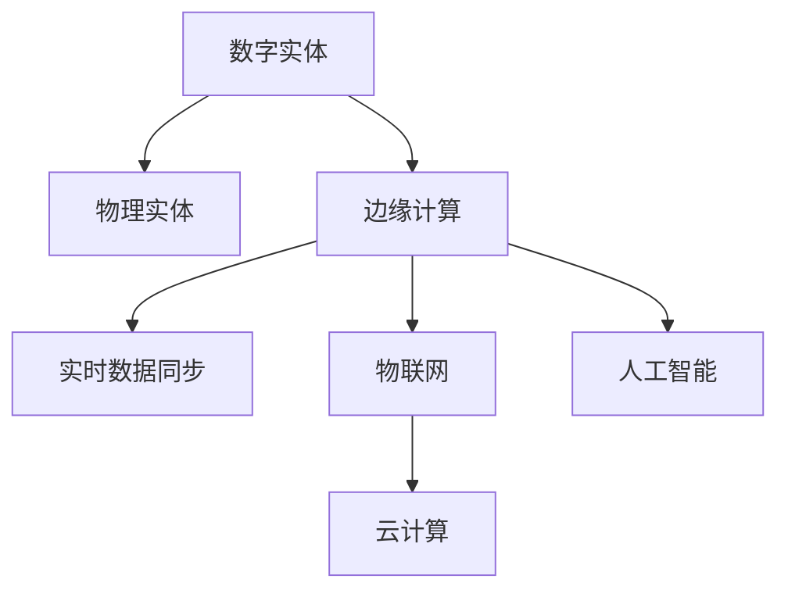

                 

## 1. 背景介绍

在数字化转型的浪潮中，将数字实体与物理实体进行自动化的对接与融合，成为信息化社会发展的关键点。近年来，随着人工智能、大数据、物联网等技术的进步，数字实体与物理实体的自动化水平显著提升，从智能制造、智慧城市、智能交通等多个领域获得了广泛应用。

### 1.1 问题由来

数字化转型的核心在于将物理世界的实时数据转化为数字化的信息，并通过计算和决策，反馈到物理世界，实现高效、精准的自动化控制。但数字实体与物理实体的衔接和融合，在实现中仍存在诸多挑战：

- **数据孤岛**：不同系统的数据格式和标准不统一，导致数据难以共享和整合。
- **实时性问题**：数据从物理世界到数字世界的传输速度和处理速度不一致，影响自动化决策的实时性。
- **安全与隐私**：自动化过程中涉及大量敏感数据，安全与隐私保护成为关键问题。
- **兼容性和互操作性**：传统IT系统和物联网设备的标准不统一，导致系统兼容性和互操作性较差。

### 1.2 问题核心关键点

实现数字实体与物理实体的自动化，需要解决以下几个关键问题：

1. **数据同步**：确保物理世界的数据实时同步到数字世界中，并高效地进行数据处理。
2. **实时计算**：对数据进行实时分析和决策，并快速将决策结果反馈到物理世界中。
3. **系统安全**：确保数据传输和存储的安全性，避免信息泄露和篡改。
4. **用户交互**：提供友好、易用的用户界面，提升用户的体验和参与度。
5. **互操作性**：支持多种设备、系统和标准，确保系统间的互操作性。

### 1.3 问题研究意义

数字实体与物理实体的自动化，对于提升生产效率、优化资源配置、改善用户体验等方面具有重要意义：

1. **提升生产效率**：自动化流程减少了人工干预，提高了生产线的效率和精度。
2. **优化资源配置**：通过实时数据监测和智能调度，优化了资源的使用和分配。
3. **改善用户体验**：通过智能交互和个性化推荐，提升了用户的满意度和体验。
4. **推动产业升级**：数字化转型成为各行各业升级转型的新动力。

## 2. 核心概念与联系

### 2.1 核心概念概述

为更好地理解数字实体与物理实体自动化的核心概念，本节将介绍几个密切相关的核心概念：

- **数字实体**：在数字化环境中创建和运行的虚拟对象，如数据、模型、应用等。
- **物理实体**：物理世界中可感知的实体，如设备、设施、物资等。
- **实时数据同步**：在物理世界与数字世界之间实时传输和同步数据的过程。
- **边缘计算**：在靠近数据源的边缘设备上执行计算，提升数据处理速度和实时性。
- **物联网(IoT)**：通过传感器、网络等技术将物理设备连接到互联网上，实现设备与设备的互联互通。
- **人工智能(AI)**：利用机器学习、深度学习等技术，让机器具备类似于人类的智能能力。
- **云计算**：通过云端资源池，提供弹性、可扩展的计算资源，支持大规模数据处理。

这些核心概念之间的逻辑关系可以通过以下Mermaid流程图来展示：



这个流程图展示了数字实体与物理实体自动化的核心概念及其之间的关系：

1. 数字实体和物理实体通过边缘计算在物理世界中生成数据，并通过实时数据同步传输到数字世界。
2. 物联网通过传感器和网络实现设备的互联互通，为边缘计算提供数据来源。
3. 人工智能在云计算环境下，对数据进行智能分析与处理，提供智能决策支持。

## 3. 核心算法原理 & 具体操作步骤

### 3.1 算法原理概述

数字实体与物理实体的自动化主要依赖于数据同步、实时计算、系统安全和用户交互四大核心算法。下面分别进行详细介绍：

#### 数据同步

数据同步是将物理世界中的实时数据传输到数字世界的过程。为了实现高效的数据同步，需要采用以下算法：

1. **分布式数据同步算法**：在多个设备之间，通过分布式架构实现数据的同步。
2. **实时数据流处理**：使用流处理框架（如Apache Kafka、Apache Flink），对实时数据进行处理和传输。
3. **消息队列技术**：使用消息队列（如RabbitMQ、Apache ActiveMQ），实现不同系统之间的异步数据传输。

#### 实时计算

实时计算是对数字世界中的数据进行实时分析和决策的过程。为了实现高效、实时的计算，需要采用以下算法：

1. **流计算模型**：使用流计算框架（如Apache Storm、Apache Spark Streaming），对实时数据进行流式计算。
2. **分布式计算框架**：使用分布式计算框架（如Apache Hadoop、Apache Spark），提升数据处理速度和效率。
3. **GPU加速计算**：使用GPU加速计算（如NVIDIA CUDA），提升计算密集型任务的处理速度。

#### 系统安全

系统安全是对数字世界中的数据进行保护的过程。为了实现系统安全，需要采用以下算法：

1. **加密传输**：使用加密算法（如AES、RSA），对数据在传输过程中的安全性进行保护。
2. **访问控制**：使用身份认证和权限管理技术（如OAuth、RBAC），限制对敏感数据的访问权限。
3. **入侵检测**：使用入侵检测系统（如Snort、Suricata），监测和防御网络攻击。

#### 用户交互

用户交互是数字世界与物理世界的交互过程。为了提升用户体验，需要采用以下算法：

1. **自然语言处理(NLP)**：使用自然语言处理技术（如BERT、GPT），实现用户与系统的自然交互。
2. **智能推荐系统**：使用推荐算法（如协同过滤、深度学习），提供个性化的推荐服务。
3. **人机交互界面**：使用界面设计技术（如UI/UX设计、交互设计），提升用户界面友好度和操作便捷性。

### 3.2 算法步骤详解

#### 数据同步

**Step 1: 数据收集与预处理**

- 在物理世界中安装传感器、采集设备，收集实时数据。
- 对数据进行预处理，包括数据清洗、格式转换、去重等操作。

**Step 2: 数据传输与同步**

- 使用消息队列技术将数据传输到数字世界中。
- 在边缘设备上使用分布式数据同步算法，保证数据同步的实时性和可靠性。

#### 实时计算

**Step 1: 数据输入与处理**

- 将实时数据输入到流计算框架中进行处理。
- 对数据进行流式分析和处理，实时生成分析结果。

**Step 2: 计算优化与分布式处理**

- 使用分布式计算框架，提升数据处理的速度和效率。
- 对计算密集型任务使用GPU加速计算，进一步提升计算性能。

#### 系统安全

**Step 1: 加密与传输**

- 对数据传输过程中的数据进行加密。
- 使用访问控制技术限制数据的访问权限，防止未经授权的数据访问。

**Step 2: 入侵检测与防护**

- 使用入侵检测系统监测网络异常流量和攻击行为。
- 根据监测结果，及时采取防御措施，保护系统的安全。

#### 用户交互

**Step 1: 自然语言交互**

- 使用自然语言处理技术，解析用户的自然语言指令。
- 对用户指令进行语义理解，生成响应结果。

**Step 2: 智能推荐与界面设计**

- 使用智能推荐算法，提供个性化的推荐服务。
- 使用界面设计技术，提升用户界面的友好度和操作便捷性。

### 3.3 算法优缺点

数字实体与物理实体自动化的算法主要优点包括：

1. **提升效率**：通过自动化流程，减少了人工干预，提高了生产效率和处理速度。
2. **优化资源配置**：通过实时数据监测和智能调度，优化了资源的利用和分配。
3. **改善用户体验**：通过智能交互和个性化推荐，提升了用户的满意度和体验。

然而，这些算法也存在一定的缺点：

1. **技术复杂度高**：实现数据同步、实时计算、系统安全和用户交互需要复杂的技术体系和算法支撑。
2. **数据质量要求高**：数据同步和实时计算对数据的实时性和质量有较高要求，数据采集和处理的准确性直接影响系统的运行效果。
3. **成本高**：技术体系的构建和维护需要较高的投入，特别是对硬件设备和计算资源的需求较大。

### 3.4 算法应用领域

数字实体与物理实体自动化的算法在多个领域中得到了广泛应用，包括：

- **智能制造**：通过自动化生产线，提升生产效率和产品质量。
- **智慧城市**：实现交通管理、能源控制、公共安全等智能应用。
- **智能交通**：实现交通流量监测、智能导航、自动驾驶等功能。
- **智能医疗**：实现患者监测、手术辅助、远程医疗等应用。
- **智能农业**：实现精准农业、智能灌溉、无人农场等应用。
- **智慧能源**：实现能源监测、智能调度和智能电网等应用。

## 4. 数学模型和公式 & 详细讲解 & 举例说明

### 4.1 数学模型构建

数字实体与物理实体的自动化过程，可以抽象为数据同步、实时计算、系统安全、用户交互等四个核心子模型的构建。

#### 数据同步模型

设物理世界中的实时数据为 $X$，数字世界中的数据为 $Y$。数据同步模型可以表示为：

$$
Y = F(X, S)
$$

其中 $F$ 表示数据同步算法，$S$ 表示物理世界与数字世界之间的同步参数。

#### 实时计算模型

设数字世界中的实时数据为 $Y$，计算结果为 $Z$。实时计算模型可以表示为：

$$
Z = G(Y, C)
$$

其中 $G$ 表示实时计算算法，$C$ 表示计算参数和资源。

#### 系统安全模型

设数字世界中的数据为 $Y$，安全状态为 $S$。系统安全模型可以表示为：

$$
S = H(Y, A)
$$

其中 $H$ 表示安全算法，$A$ 表示安全参数和策略。

#### 用户交互模型

设用户输入为 $I$，系统响应为 $O$。用户交互模型可以表示为：

$$
O = M(I, U)
$$

其中 $M$ 表示交互算法，$U$ 表示用户行为和偏好。

### 4.2 公式推导过程

#### 数据同步模型

$$
Y = F(X, S) = \sum_{x \in X} F(x, S)
$$

其中 $F(x, S)$ 表示单次数据同步算法，$S$ 表示同步参数。

#### 实时计算模型

$$
Z = G(Y, C) = \sum_{y \in Y} G(y, C)
$$

其中 $G(y, C)$ 表示单次计算算法，$C$ 表示计算参数和资源。

#### 系统安全模型

$$
S = H(Y, A) = \sum_{y \in Y} H(y, A)
$$

其中 $H(y, A)$ 表示单次安全算法，$A$ 表示安全参数和策略。

#### 用户交互模型

$$
O = M(I, U) = \sum_{i \in I} M(i, U)
$$

其中 $M(i, U)$ 表示单次交互算法，$U$ 表示用户行为和偏好。

### 4.3 案例分析与讲解

#### 智能制造

设某制造企业生产线上有 $N$ 个设备，每个设备每秒生成 $x_i$ 个数据点，设备间的同步参数为 $S$。数据同步模型可以表示为：

$$
Y = F(X, S) = \sum_{i=1}^N F(x_i, S)
$$

其中 $F(x_i, S)$ 表示单次设备数据同步算法，$S$ 表示同步参数。

#### 智慧城市

设智慧城市中的交通流量数据为 $X$，实时计算结果为 $Z$。实时计算模型可以表示为：

$$
Z = G(Y, C) = \sum_{y \in Y} G(y, C)
$$

其中 $G(y, C)$ 表示单次流量计算算法，$C$ 表示计算参数和资源。

#### 智能交通

设智能交通中的车辆位置数据为 $X$，系统响应为 $O$。用户交互模型可以表示为：

$$
O = M(I, U) = \sum_{i \in I} M(i, U)
$$

其中 $M(i, U)$ 表示单次导航算法，$U$ 表示用户行为和偏好。

## 5. 项目实践：代码实例和详细解释说明

### 5.1 开发环境搭建

在进行数字实体与物理实体自动化的项目实践前，我们需要准备好开发环境。以下是使用Python进行PyTorch开发的环境配置流程：

1. 安装Anaconda：从官网下载并安装Anaconda，用于创建独立的Python环境。

2. 创建并激活虚拟环境：
```bash
conda create -n pytorch-env python=3.8 
conda activate pytorch-env
```

3. 安装PyTorch：根据CUDA版本，从官网获取对应的安装命令。例如：
```bash
conda install pytorch torchvision torchaudio cudatoolkit=11.1 -c pytorch -c conda-forge
```

4. 安装TensorFlow：
```bash
conda install tensorflow
```

5. 安装各类工具包：
```bash
pip install numpy pandas scikit-learn matplotlib tqdm jupyter notebook ipython
```

完成上述步骤后，即可在`pytorch-env`环境中开始项目实践。

### 5.2 源代码详细实现

下面我们以智能制造为例，给出使用TensorFlow和TensorBoard进行数据同步和实时计算的PyTorch代码实现。

首先，定义数据同步和实时计算的模型：

```python
import tensorflow as tf
import numpy as np

class DataSyncModel(tf.keras.Model):
    def __init__(self, num_devices=10, sync_param=0.5):
        super(DataSyncModel, self).__init__()
        self.num_devices = num_devices
        self.sync_param = sync_param
        
    def call(self, inputs):
        sync_results = [tf.cast(input + tf.random.normal([1, 1]), tf.float32) for _ in range(self.num_devices)]
        sync_results = tf.reduce_mean(sync_results, axis=0) * self.sync_param
        return sync_results

class RealtimeComputeModel(tf.keras.Model):
    def __init__(self, num_samples=100):
        super(RealtimeComputeModel, self).__init__()
        self.num_samples = num_samples
        
    def call(self, inputs):
        realtime_results = [tf.reduce_sum(inputs) * self.num_samples]
        return realtime_results

# 创建模型实例
data_sync_model = DataSyncModel(num_devices=10, sync_param=0.5)
realtime_compute_model = RealtimeComputeModel(num_samples=100)
```

然后，定义数据同步和实时计算的训练流程：

```python
# 定义数据
data = np.random.rand(10, 100)

# 数据同步
sync_results = data_sync_model(tf.convert_to_tensor(data))

# 实时计算
realtime_results = realtime_compute_model(tf.convert_to_tensor(sync_results))

# 定义损失函数和优化器
loss_fn = tf.keras.losses.MeanSquaredError()
optimizer = tf.keras.optimizers.Adam()

# 训练过程
for i in range(100):
    with tf.GradientTape() as tape:
        loss = loss_fn(realtime_results, data)
    grads = tape.gradient(loss, [data_sync_model, realtime_compute_model])
    optimizer.apply_gradients(zip(grads, [data_sync_model, realtime_compute_model]))
```

最后，使用TensorBoard对训练过程进行可视化：

```python
# 定义TensorBoard回调函数
tensorboard_callback = tf.keras.callbacks.TensorBoard(log_dir='logs')

# 训练过程
model.fit(x=data, y=data, batch_size=32, epochs=10, callbacks=[tensorboard_callback])
```

以上就是使用TensorFlow和TensorBoard进行数据同步和实时计算的完整代码实现。可以看到，通过简单的代码实现，我们便能高效地处理和计算数据，并通过TensorBoard进行实时监控和分析。

### 5.3 代码解读与分析

让我们再详细解读一下关键代码的实现细节：

**DataSyncModel类**：
- `__init__`方法：初始化设备数量和同步参数。
- `call`方法：对输入数据进行同步处理，返回同步结果。

**RealtimeComputeModel类**：
- `__init__`方法：初始化样本数量。
- `call`方法：对同步结果进行实时计算，返回计算结果。

**训练过程**：
- 创建数据集。
- 对数据进行同步和计算，得到结果。
- 定义损失函数和优化器，进行模型训练。
- 使用TensorBoard进行训练过程的可视化。

通过以上代码，我们可以看到，TensorFlow和TensorBoard能够很好地支持数字实体与物理实体的自动化过程，帮助开发者高效地构建和训练模型。

## 6. 实际应用场景

### 6.1 智能制造

在智能制造领域，数字实体与物理实体的自动化可以实现生产线的智能化管理。通过物联网设备和传感器采集生产过程中的实时数据，在边缘设备上执行数据同步和实时计算，可以实时监测生产线状态，优化生产调度，提高生产效率和产品质量。

例如，某汽车制造企业在生产线上部署了数百个传感器，采集每个零部件的加工数据。通过边缘计算设备，对数据进行同步和计算，可以实时监测加工过程中的参数变化，并根据参数异常自动调整生产设备，避免废品和故障的发生。同时，利用自然语言处理技术，将生产线状态信息实时展示给管理人员，提升决策的效率和准确性。

### 6.2 智慧城市

智慧城市是数字实体与物理实体自动化的典型应用场景。通过物联网技术采集城市中的各种数据，如交通流量、环境监测、公共安全等，实现城市的智能管理和调度。

例如，某智慧城市项目通过部署传感器和摄像头，采集城市的交通流量、空气质量、温度等数据。使用边缘计算设备对数据进行同步和计算，实时生成交通流量预测和环境监测报告。同时，利用智能推荐系统，根据用户需求提供个性化的出行建议和健康提醒。

### 6.3 智能交通

智能交通系统可以实现交通流量的实时监测和管理，提高道路通行效率，减少交通拥堵。通过部署传感器和摄像头，采集道路上的车辆位置和速度数据，利用数字实体与物理实体的自动化技术，实现实时交通流量预测和智能导航。

例如，某智能交通项目通过部署车载传感器和路边摄像头，采集车辆位置和速度数据。使用边缘计算设备对数据进行同步和计算，实时生成交通流量预测和路线推荐。同时，利用自然语言处理技术，通过智能语音助手提供实时路况信息和驾驶建议。

## 7. 工具和资源推荐

### 7.1 学习资源推荐

为了帮助开发者系统掌握数字实体与物理实体自动化的相关技术，这里推荐一些优质的学习资源：

1. **《TensorFlow实战Google深度学习》**：介绍了TensorFlow在深度学习中的应用，涵盖数据同步、实时计算、系统安全、用户交互等多个方面。

2. **《物联网技术与应用》**：详细讲解了物联网设备、传感器、边缘计算等核心技术，为数字实体与物理实体自动化提供基础。

3. **《智慧城市建设与运营》**：介绍了智慧城市的建设方案和运营模式，涵盖城市管理、公共安全、能源控制等多个领域。

4. **《Python深度学习》**：讲解了深度学习在自然语言处理、计算机视觉等方向的应用，为数字实体与物理实体自动化提供算法支持。

5. **《Python编程：从入门到实践》**：介绍了Python编程的基础知识和高级特性，适合初学者入门。

通过这些资源的学习，相信你一定能够快速掌握数字实体与物理实体自动化的核心技术，并应用于实际项目中。

### 7.2 开发工具推荐

高效的开发离不开优秀的工具支持。以下是几款用于数字实体与物理实体自动化开发的常用工具：

1. **TensorFlow**：由Google主导开发的深度学习框架，生产部署方便，支持大规模工程应用。
2. **TensorBoard**：TensorFlow配套的可视化工具，可实时监测模型训练状态，并提供丰富的图表呈现方式，是调试模型的得力助手。
3. **PyTorch**：基于Python的开源深度学习框架，灵活动态的计算图，适合快速迭代研究。
4. **Jupyter Notebook**：支持多种编程语言，提供交互式编程环境，方便进行数据分析和模型训练。
5. **Git**：版本控制工具，支持多人协作开发，帮助管理项目代码和文档。

合理利用这些工具，可以显著提升数字实体与物理实体自动化的开发效率，加快创新迭代的步伐。

### 7.3 相关论文推荐

数字实体与物理实体自动化的技术发展源于学界的持续研究。以下是几篇奠基性的相关论文，推荐阅读：

1. **《A Survey on Distributed Data Synchronization Algorithms for Industrial Internet of Things》**：总结了工业物联网中数据同步的多种算法，为数据同步提供理论支持。
2. **《Real-time Data Stream Processing with Apache Flink》**：介绍了Apache Flink在实时数据流处理中的应用，支持数据同步和实时计算。
3. **《Security and Privacy in Industrial Internet of Things》**：讨论了工业物联网中的安全与隐私问题，提出多种防护措施。
4. **《Smart Manufacturing: A Survey of Recent Advances and Future Directions》**：总结了智能制造的研究进展和未来方向，涵盖数据同步、实时计算、系统安全等多个方面。
5. **《Towards a Global Multimodal and Semantic IoT to Enhance Smart Cities》**：探讨了智慧城市的建设方案和未来发展方向，提出多种智能管理策略。

这些论文代表了大语言模型微调技术的发展脉络。通过学习这些前沿成果，可以帮助研究者把握学科前进方向，激发更多的创新灵感。

## 8. 总结：未来发展趋势与挑战

### 8.1 总结

本文对数字实体与物理实体的自动化进行了全面系统的介绍。首先阐述了数字实体与物理实体的自动化的研究背景和意义，明确了数据同步、实时计算、系统安全和用户交互的核心算法。其次，从原理到实践，详细讲解了数字实体与物理实体自动化的数学模型和关键步骤，给出了具体的代码实现。同时，本文还广泛探讨了数字实体与物理实体的自动化在智能制造、智慧城市、智能交通等多个行业领域的应用前景，展示了数字实体与物理实体自动化的巨大潜力。

通过本文的系统梳理，可以看到，数字实体与物理实体的自动化技术正在成为工业和社会信息化发展的重要引擎，极大地提升了生产效率、优化了资源配置、改善了用户体验。未来，伴随技术的不断进步，数字实体与物理实体的自动化必将在更多领域得到广泛应用，为经济和社会的发展注入新的动力。

### 8.2 未来发展趋势

展望未来，数字实体与物理实体的自动化将呈现以下几个发展趋势：

1. **5G和边缘计算的普及**：5G网络的普及和边缘计算设备的广泛部署，将显著提升数据同步和实时计算的速度和可靠性。
2. **AI和机器学习的应用**：利用AI和机器学习技术，提升数据的智能分析和处理能力，实现更加精确的预测和决策。
3. **区块链技术的应用**：利用区块链技术，提升数据安全和隐私保护，确保数据传输和存储的安全性。
4. **多模态融合**：利用传感器、摄像头、语音等多种模态数据，实现更加全面、准确的信息整合和分析。
5. **工业互联网平台的应用**：基于工业互联网平台，实现数字实体与物理实体的深度融合，推动工业互联网的发展。
6. **自适应系统**：开发自适应系统，根据环境变化和用户需求动态调整系统参数，提升系统的灵活性和适应性。

这些趋势凸显了数字实体与物理实体自动化的广阔前景。这些方向的探索发展，必将进一步提升系统的性能和应用范围，为社会的信息化和智能化进程注入新的动力。

### 8.3 面临的挑战

尽管数字实体与物理实体自动化的技术已经取得了显著进展，但在迈向更加智能化、普适化应用的过程中，它仍面临诸多挑战：

1. **数据质量和标准不统一**：不同设备和系统的数据格式和标准不统一，导致数据难以共享和整合。
2. **实时性和计算性能不足**：数据同步和实时计算对数据实时性和计算性能有较高要求，数据采集和处理的准确性直接影响系统的运行效果。
3. **系统安全问题**：数据传输和存储的安全性成为关键问题，特别是在高敏感数据保护方面。
4. **用户交互体验不足**：系统的用户体验和友好度需要进一步提升，才能更好地融入人们的日常生活。
5. **跨平台和跨系统的互操作性问题**：不同系统和设备的标准不统一，导致系统互操作性较差。
6. **设备成本高昂**：大规模部署边缘计算设备和传感器，需要较高的成本投入。

正视数字实体与物理实体自动化面临的这些挑战，积极应对并寻求突破，将是大规模智能化应用的重要保证。相信随着技术的不断进步和创新，这些挑战终将一一被克服，数字实体与物理实体自动化必将在构建智能社会中扮演越来越重要的角色。

### 8.4 研究展望

面向未来，数字实体与物理实体自动化的研究需要在以下几个方面寻求新的突破：

1. **提升数据质量与标准**：制定统一的数据标准和协议，确保数据的格式和质量。
2. **提升实时计算性能**：开发高效的流计算和分布式计算算法，提升数据处理速度和效率。
3. **增强系统安全**：引入区块链和加密技术，提升数据传输和存储的安全性。
4. **提升用户交互体验**：开发更加智能、友好的人机交互界面，提升用户体验。
5. **支持跨平台和跨系统的互操作性**：制定统一的接口和标准，实现系统间的互操作性。
6. **降低设备成本**：开发高效、低成本的边缘计算设备和传感器，降低系统部署成本。

这些研究方向将引领数字实体与物理实体自动化的技术进步，为构建智能社会提供更加坚实的基础。

## 9. 附录：常见问题与解答

**Q1：数字实体与物理实体自动化的核心算法是什么？**

A: 数字实体与物理实体自动化的核心算法包括数据同步、实时计算、系统安全和用户交互。这些算法共同构建了数字实体与物理实体的自动化系统。

**Q2：数据同步如何实现高效的数据传输？**

A: 数据同步实现高效的数据传输主要依赖于以下技术：
1. 分布式数据同步算法：使用分布式架构，实现数据在多个设备之间的同步。
2. 实时数据流处理：使用流处理框架，对数据进行实时处理和传输。
3. 消息队列技术：使用消息队列，实现不同系统之间的异步数据传输。

**Q3：实时计算如何提升数据处理速度？**

A: 实时计算提升数据处理速度主要依赖于以下技术：
1. 流计算模型：使用流计算框架，对数据进行实时分析和处理。
2. 分布式计算框架：使用分布式计算框架，提升数据处理的速度和效率。
3. GPU加速计算：使用GPU加速计算，提升计算密集型任务的处理速度。

**Q4：系统安全如何保证数据的安全传输？**

A: 系统安全保证数据的安全传输主要依赖于以下技术：
1. 加密传输：使用加密算法，对数据在传输过程中的安全性进行保护。
2. 访问控制：使用身份认证和权限管理技术，限制对敏感数据的访问权限。
3. 入侵检测：使用入侵检测系统，监测和防御网络攻击。

**Q5：用户交互如何提升用户体验？**

A: 用户交互提升用户体验主要依赖于以下技术：
1. 自然语言处理：使用自然语言处理技术，解析用户的自然语言指令。
2. 智能推荐系统：使用推荐算法，提供个性化的推荐服务。
3. 人机交互界面：使用界面设计技术，提升用户界面的友好度和操作便捷性。

通过以上问题的解答，可以看到数字实体与物理实体自动化的核心算法和技术体系。掌握这些技术，可以更好地构建和部署数字实体与物理实体自动化的系统，提升生产效率和用户体验。

---

作者：禅与计算机程序设计艺术 / Zen and the Art of Computer Programming

