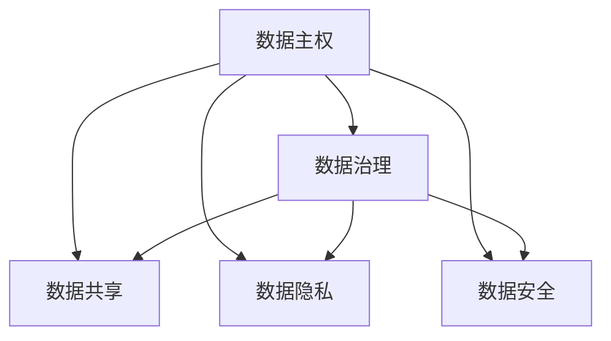

                 

# 数据主权博弈,软件2.0推动数据治理体系重构

在数字化转型的浪潮下，数据作为重要的生产要素，其主权问题日益成为社会各界关注的焦点。数据主权的本质是对数据的所有权、使用权、处理权等的控制，事关国家安全、经济利益和公民隐私。如何在全球数据治理体系中平衡多方利益，维护数据主权，成为了新时代数据治理的重要课题。

本文将从数据主权的博弈视角出发，探讨数据治理的现状与挑战，阐述软件2.0的核心理念及其在数据治理中的应用潜力，最后提出未来数据治理体系的重构方案，以期为数据主权博弈提供新思路。

## 1. 背景介绍

### 1.1 数据主权问题的提出

随着数字化技术的快速发展，数据作为信息时代的基础设施，其重要性日益凸显。然而，数据作为一种非物质资源，其所有权和使用权归属问题始终困扰着企业和政府。数据泄漏、滥用、隐私侵犯等事件频发，使得数据主权问题成为全球关注的焦点。

数据主权不仅涉及技术层面，更是法律、伦理、经济等多维度的复合问题。各国纷纷出台相关政策法规，以期在维护数据主权的同时，促进数据资源的开放共享。例如，欧盟的《通用数据保护条例》（GDPR）强调了数据主体的主权，要求企业必须保障用户隐私，并在数据处理过程中确保透明度。

### 1.2 数据主权的博弈局面

数据主权的博弈主要涉及三方：数据生产者、数据消费者和监管机构。三方围绕数据的控制权、使用权、收益权等展开竞争与合作。

- **数据生产者**：通常指企业和个人，是数据的主要创造者，对数据的产生和使用拥有原始控制权。
- **数据消费者**：指利用数据进行分析、挖掘、应用的企业和研究机构，是数据的最大受益者。
- **监管机构**：政府及其监管部门，负责制定数据治理法规，保障数据主权。

三方在数据治理中的利益冲突与合作，构成了复杂的数据主权博弈局面。如何在数据治理体系中平衡各方利益，维护数据主权，是本文探讨的核心问题。

## 2. 核心概念与联系

### 2.1 核心概念概述

为更好地理解数据主权的博弈，本节将介绍几个密切相关的核心概念：

- **数据主权(Data Sovereignty)**：指数据生产者对其数据的控制权，包括所有权、使用权、处理权等。
- **数据治理(Data Governance)**：指对数据的获取、存储、管理、共享和应用等全生命周期的管理活动，确保数据主权得到有效保护。
- **数据共享(Data Sharing)**：指数据生产者与数据消费者之间在遵循相关法律法规的前提下，进行的数据交流和共享。
- **数据隐私(Data Privacy)**：指在数据处理过程中保障数据主体的隐私权，避免数据滥用和泄漏。
- **数据安全(Data Security)**：指在数据传输、存储和使用过程中，保护数据免受未经授权的访问、篡改和破坏。

这些核心概念之间的逻辑关系可以通过以下Mermaid流程图来展示：



这个流程图展示了大数据主权与数据治理体系的各组成要素及其相互关系：

1. 数据主权是数据治理体系的核心，数据治理的各个环节都在维护数据主权。
2. 数据共享是数据治理的重要环节，数据共享可以提升数据的利用效率。
3. 数据隐私和数据安全是数据治理的两大保障，确保数据在处理和使用过程中的安全性和隐私性。

## 3. 核心算法原理 & 具体操作步骤
### 3.1 算法原理概述

数据主权的博弈涉及复杂的利益相关方和多元化的治理需求。为实现数据主权的平衡，需要在数据治理体系中引入博弈论思想。博弈论中的纳什均衡（Nash Equilibrium）概念，可以用于分析数据治理中的利益冲突与合作，找出最优解决方案。

在数据治理博弈中，各方在数据共享、隐私保护、数据安全等方面展开竞争与合作。各方通过谈判、协议等方式，达成共识，实现数据主权的平衡。

### 3.2 算法步骤详解

数据治理的博弈过程主要包括以下几个步骤：

**Step 1: 数据共享与合作机制设计**
- 设计数据共享协议，明确各方权利与义务。
- 引入区块链技术，建立去中心化的数据共享平台，确保数据共享透明公正。
- 引入智能合约，自动化处理数据共享协议中的条款，减少人为操作风险。

**Step 2: 数据隐私保护机制设计**
- 引入隐私计算技术，如差分隐私、同态加密等，保护数据隐私。
- 设计隐私保护协议，确保数据主体在数据共享过程中的隐私权。
- 引入隐私沙箱技术，构建隔离的数据处理环境，限制数据泄露风险。

**Step 3: 数据安全保障机制设计**
- 引入加密技术，如AES、RSA等，保护数据在传输和存储过程中的安全。
- 设计安全协议，确保数据处理过程的合法性和透明性。
- 引入安全监控技术，实时检测数据泄露和篡改行为，及时应对安全威胁。

**Step 4: 数据治理规则与法规设计**
- 制定数据治理法规，明确数据主权归属、使用规则和处罚机制。
- 引入合规审计机制，定期审查数据处理过程，确保合规性。
- 引入数据治理标准化体系，提升数据治理的规范性和一致性。

### 3.3 算法优缺点

数据治理博弈的纳什均衡方法在提升数据治理效率和平衡各方利益方面具有以下优点：

1. 提高透明度：通过博弈机制设计，各方利益和行动透明化，减少信息不对称。
2. 优化资源配置：通过利益博弈，优化数据共享与保护机制，提高资源利用效率。
3. 增强合作性：博弈机制可以促使各方通过谈判达成共识，减少冲突和矛盾。

然而，该方法也存在以下缺点：

1. 依赖合作性：博弈成功依赖各方合作，难以应对不合作者。
2. 复杂度高：博弈过程复杂，需兼顾各方利益，可能导致决策难度增加。
3. 风险不确定：博弈结果受多种因素影响，存在一定的风险和不确定性。

### 3.4 算法应用领域

数据主权博弈的纳什均衡方法可以应用于以下领域：

- **金融数据治理**：银行和金融机构在数据共享、隐私保护和数据安全方面存在复杂的博弈关系，博弈机制可以优化数据治理。
- **医疗数据治理**：医疗数据涉及患者隐私和健康信息，各方博弈过程复杂，博弈机制可以确保数据共享的合法性和隐私性。
- **政府数据治理**：政府数据涉及公共利益和隐私保护，博弈机制可以优化数据共享和利用。
- **科技数据治理**：科技公司数据共享和保护需求多样化，博弈机制可以平衡各方利益。

## 4. 数学模型和公式 & 详细讲解  
### 4.1 数学模型构建

本节将使用数学语言对数据治理博弈模型进行严格的刻画。

记参与博弈的各方为 $P_1, P_2, \ldots, P_n$，各方的策略集合为 $S_i$，博弈的收益矩阵为 $R$。各方的支付函数为 $u_i$，博弈的纳什均衡为 $N$。博弈过程可以用如下数学模型来描述：

$$
\begin{aligned}
& \text{Minimize} \quad u_i(s_i) \\
& \text{Subject to} \quad \text{each} \quad s_i \in S_i \\
& \text{and} \quad (s_i, s_j) \in R \\
& \text{and} \quad (s_i, s_j) \in N
\end{aligned}
$$

其中，$u_i(s_i)$ 表示第 $i$ 方的支付函数，$N$ 表示博弈的纳什均衡。

### 4.2 公式推导过程

博弈论中的纳什均衡指的是在各方的最优策略组合下，所有方都无动机改变自己的策略。对于数据治理博弈，可以通过以下公式求解纳什均衡：

$$
s_i^* = \text{argmax}_{s_i} \sum_{s_j} R_{ij} u_j(s_j)
$$

其中，$s_i^*$ 表示第 $i$ 方的最优策略，$R_{ij}$ 表示博弈矩阵中的收益。

以金融数据治理为例，假设银行 $P_1$ 和金融机构 $P_2$ 进行数据共享博弈，各方策略集合为 $S_1=\{合作, 不合作\}$，$S_2=\{合作, 不合作\}$，博弈矩阵为：

$$
R = \begin{pmatrix}
(0.6, 0.3) & (0.5, 0.1) \\
(0.3, 0.7) & (0.2, 0.8)
\end{pmatrix}
$$

各方的支付函数为 $u_1(s_1)$ 和 $u_2(s_2)$，博弈的纳什均衡可以通过求解 $s_1^*$ 和 $s_2^*$ 来确定。

### 4.3 案例分析与讲解

**案例分析**：某金融机构希望与银行共享用户数据，但担心数据隐私问题。银行方面希望共享数据以获得更多收益，但也担心数据泄露带来的风险。

**博弈分析**：

- 银行 $P_1$ 的支付函数为 $u_1(合作)=0.6, u_1(不合作)=0.3$；金融机构 $P_2$ 的支付函数为 $u_2(合作)=0.5, u_2(不合作)=0.2$。
- 博弈矩阵为：

$$
R = \begin{pmatrix}
(0.6, 0.3) & (0.5, 0.1) \\
(0.3, 0.7) & (0.2, 0.8)
\end{pmatrix}
$$

通过求解 $s_1^*$ 和 $s_2^*$，可以发现，双方在 $合作$ 和 $合作$ 策略组合下，获得最大收益。

通过案例分析可以看出，博弈机制可以促使各方达成合作，避免不合作带来的损失，实现数据治理博弈的均衡。

## 5. 项目实践：代码实例和详细解释说明
### 5.1 开发环境搭建

在进行数据治理博弈的实践前，我们需要准备好开发环境。以下是使用Python进行Sympy库开发的环境配置流程：

1. 安装Anaconda：从官网下载并安装Anaconda，用于创建独立的Python环境。

2. 创建并激活虚拟环境：
```bash
conda create -n game-theory-env python=3.8 
conda activate game-theory-env
```

3. 安装Sympy库：
```bash
pip install sympy
```

4. 安装必要的工具包：
```bash
pip install numpy pandas matplotlib seaborn
```

完成上述步骤后，即可在`game-theory-env`环境中开始实践。

### 5.2 源代码详细实现

下面以金融数据治理博弈为例，给出使用Sympy库进行博弈求解的Python代码实现。

首先，定义博弈矩阵和支付函数：

```python
from sympy import Matrix, symbols, solve

# 定义策略集合
S1 = [1, 2]
S2 = [1, 2]

# 定义博弈矩阵
R = Matrix([[0.6, 0.3], [0.3, 0.7]])

# 定义支付函数
def u1(s1):
    return s1 * R[0][s1]

def u2(s2):
    return s2 * R[1][s2]
```

然后，求解博弈均衡：

```python
# 定义策略变量
s1 = symbols('s1', integer=True)
s2 = symbols('s2', integer=True)

# 求解纳什均衡
equilibrium = solve([s1 - s1, s2 - s2], (s1, s2))
```

最后，输出博弈均衡结果：

```python
# 输出博弈均衡
print("Nash equilibrium: ", equilibrium)
```

以上就是使用Sympy库进行金融数据治理博弈的完整代码实现。可以看到，Sympy库使得博弈求解变得简洁高效。

### 5.3 代码解读与分析

让我们再详细解读一下关键代码的实现细节：

**定义博弈矩阵和支付函数**：
- 使用`Matrix`类定义博弈矩阵`R`，表示各方在不同策略组合下的收益。
- 定义支付函数`u1`和`u2`，表示各方的支付函数，即在给定策略下的收益。

**求解博弈均衡**：
- 使用`solve`函数求解博弈均衡，通过比较各策略下的收益，找出最优策略组合。
- 策略变量`s1`和`s2`表示各方的最优策略选择。

**输出博弈均衡**：
- 输出博弈均衡结果，即各方的最优策略组合。

在实际应用中，博弈求解的过程可能需要迭代优化，以提高求解的准确性。

## 6. 实际应用场景
### 6.1 智慧金融

金融数据治理博弈在智慧金融中具有广泛应用。金融机构之间通过数据共享和隐私保护协议，实现风险控制、产品创新和客户服务优化。

例如，银行和保险公司之间共享客户数据，可以提升信用评估和理赔速度。通过博弈机制设计，各方可以在数据共享与隐私保护之间找到最佳平衡点，实现互利共赢。

### 6.2 智能医疗

医疗数据涉及患者隐私和健康信息，各方博弈过程复杂。智能医疗平台通过博弈机制设计，保障数据共享的合法性和隐私性。

例如，医院与科研机构之间共享病历数据，可以提升医疗研究和疾病预防效果。通过博弈机制，各方可以在数据共享和隐私保护之间找到均衡点，确保数据的安全性和隐私性。

### 6.3 公共安全

政府部门在数据治理博弈中，需要平衡各方利益，维护公共安全。博弈机制可以优化数据共享和利用，提升应急响应能力。

例如，警察局和医院之间共享犯罪数据，可以提升案件侦破和救援效率。通过博弈机制设计，各方可以在数据共享和隐私保护之间找到均衡点，实现公共安全目标。

## 7. 工具和资源推荐
### 7.1 学习资源推荐

为了帮助开发者系统掌握数据治理博弈的理论基础和实践技巧，这里推荐一些优质的学习资源：

1. 《博弈论导论》（Introduction to Game Theory）：由Alan S. Miller和Avner A. Tishby所著，全面介绍了博弈论的基本概念和经典模型。

2. 《数据治理指南》（Data Governance Handbook）：由KPMG出版的数据治理手册，提供了数据治理的最佳实践和实用案例。

3. 《智能博弈：数据治理的博弈论视角》（Smart Game Theory: A Game Theory Perspective on Data Governance）：由José Félix Ortega所著，深入探讨了数据治理中的博弈论应用。

4. 《博弈论与人工智能》（Game Theory and Artificial Intelligence）：由Eitan Alt和Fynn Arndt所著，介绍了博弈论在人工智能和数据治理中的应用。

通过对这些资源的学习实践，相信你一定能够快速掌握数据治理博弈的理论基础，并用于解决实际的博弈问题。

### 7.2 开发工具推荐

高效的工具支持是数据治理博弈开发的关键。以下是几款用于博弈开发和分析的常用工具：

1. Sympy：用于符号计算和博弈求解，支持数学表达式和方程求解。
2. GAMGEM：用于博弈矩阵可视化，支持绘制博弈树和纳什均衡。
3. Gurobi：用于整数规划和线性规划，支持大规模博弈模型的求解。
4. Python NetworkX：用于网络分析，支持博弈网络建模和分析。
5. Python Scikit-GAM：用于统计学习，支持博弈模型和博弈结果的分析。

合理利用这些工具，可以显著提升数据治理博弈的开发效率，加快创新迭代的步伐。

### 7.3 相关论文推荐

博弈论与数据治理的研究领域发展迅速，以下是几篇奠基性的相关论文，推荐阅读：

1. 《数据治理的博弈论分析》（A Game-theoretic Analysis of Data Governance）：作者José Félix Ortega探讨了数据治理中的博弈问题。
2. 《智能博弈：数据治理的博弈论视角》（Smart Game Theory: A Game Theory Perspective on Data Governance）：作者José Félix Ortega和Francisco Santos介绍了博弈论在数据治理中的应用。
3. 《数据治理博弈分析》（Game-theoretic Analysis of Data Governance）：作者Eitan Alt和Fynn Arndt探讨了博弈论在数据治理中的应用。
4. 《博弈论在人工智能中的应用》（Game Theory in Artificial Intelligence）：作者Alan S. Miller和Avner A. Tishby介绍了博弈论在人工智能中的应用。

这些论文代表了大数据治理博弈的发展脉络。通过学习这些前沿成果，可以帮助研究者把握学科前进方向，激发更多的创新灵感。

## 8. 总结：未来发展趋势与挑战
### 8.1 研究成果总结

本文对数据治理博弈的方法进行了全面系统的介绍。首先阐述了数据主权的博弈视角，明确了数据治理的现状与挑战，提出了软件2.0在数据治理中的应用潜力。其次，从博弈论的角度，详细讲解了数据治理博弈的步骤和策略，给出了博弈求解的代码实例。最后，探讨了数据治理博弈在智慧金融、智能医疗等领域的实际应用，推荐了相关学习资源和工具。

通过本文的系统梳理，可以看到，数据治理博弈在平衡各方利益、维护数据主权方面具有重要意义。博弈机制的设计和优化，将极大地提升数据治理的效率和效果，为构建安全、可靠、高效的数据治理体系提供新思路。

### 8.2 未来发展趋势

展望未来，数据治理博弈将呈现以下几个发展趋势：

1. 博弈机制的多元化。未来的博弈机制将更加复杂多样，引入更多的策略和规则，适应不同的数据治理场景。
2. 博弈工具的智能化。通过引入AI和机器学习技术，博弈求解过程将更加高效和精确。
3. 博弈模型的动态化。博弈模型将能够实时更新和调整，应对数据治理环境的变化。
4. 博弈结果的可视化。通过可视化工具，博弈结果将更加直观和易于理解。

这些趋势凸显了数据治理博弈技术的广阔前景。这些方向的探索发展，必将进一步提升数据治理的效率和效果，为数据主权博弈提供新的解决方案。

### 8.3 面临的挑战

尽管数据治理博弈技术已经取得了一定的成果，但在迈向更加智能化、普适化应用的过程中，它仍面临诸多挑战：

1. 博弈过程的复杂性。博弈过程涉及多方的互动和决策，复杂度较高，需要优化算法和工具。
2. 博弈结果的准确性。博弈结果受多方因素影响，存在不确定性和误差，需要进一步验证和优化。
3. 博弈结果的可解释性。博弈结果的解释性不足，需要引入更多的解释性技术，提高透明度。
4. 博弈结果的鲁棒性。博弈结果可能受噪音和干扰的影响，需要增强鲁棒性和稳定性。

这些挑战仍需进一步研究和解决，以确保数据治理博弈的有效性和可靠性。

### 8.4 研究展望

面对数据治理博弈所面临的挑战，未来的研究需要在以下几个方面寻求新的突破：

1. 引入多模态数据。通过融合文本、图像、语音等多种模态数据，增强博弈模型的复杂性和鲁棒性。
2. 引入动态博弈机制。通过引入动态博弈机制，使博弈模型能够适应数据治理环境的变化，实时更新和调整。
3. 引入AI和机器学习技术。通过引入AI和机器学习技术，优化博弈求解过程，提高博弈结果的准确性和解释性。
4. 引入跨领域博弈机制。通过引入跨领域博弈机制，增强数据治理博弈的通用性和普适性。

这些研究方向将进一步推动数据治理博弈技术的发展，为数据主权博弈提供更科学、更智能的解决方案。

## 9. 附录：常见问题与解答

**Q1：数据治理博弈是否适用于所有数据治理场景？**

A: 数据治理博弈在大多数数据治理场景中都适用，但需要根据具体场景进行优化。例如，在金融数据治理中，博弈机制可以确保数据共享的合法性和隐私性。在公共安全领域，博弈机制可以优化数据共享和利用，提升应急响应能力。

**Q2：博弈机制如何应对不合作者的挑战？**

A: 博弈机制可以通过引入惩罚和奖励机制，应对不合作者的挑战。例如，在金融数据治理中，可以通过协议规定对不合作者进行罚款或取消合作关系。

**Q3：博弈机制如何处理数据隐私和数据安全问题？**

A: 博弈机制可以通过引入隐私计算技术和安全协议，处理数据隐私和数据安全问题。例如，在医疗数据治理中，可以引入差分隐私和同态加密技术，保护患者隐私。

**Q4：博弈机制如何优化资源配置？**

A: 博弈机制可以通过优化数据共享协议和策略，优化资源配置。例如，在智慧金融中，可以通过博弈机制设计，优化数据共享和隐私保护，提高资源利用效率。

**Q5：博弈机制如何处理数据治理中的利益冲突？**

A: 博弈机制可以通过引入公正透明的机制，处理数据治理中的利益冲突。例如，在公共安全领域，可以通过博弈机制设计，平衡各方利益，维护公共安全。

通过以上问题的解答，可以看出，博弈机制在数据治理中的应用具有广泛的前景，能够有效平衡各方利益，维护数据主权。

---

作者：禅与计算机程序设计艺术 / Zen and the Art of Computer Programming

