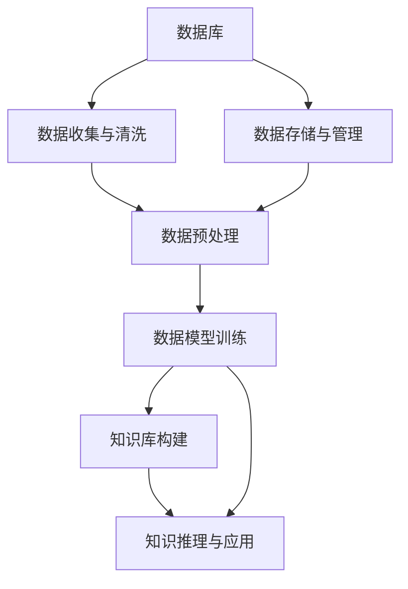

                 

# 数据库、知识库在AI中的重要性

> 关键词：数据库,知识库,人工智能,机器学习,知识工程,数据管理

## 1. 背景介绍

在人工智能(AI)和机器学习(ML)领域，数据是推动技术进步的核心。无论是数据收集、存储、处理、分析，还是模型训练和推理，数据都是不可或缺的基础。而在这其中，数据库和知识库扮演着至关重要的角色。本文将从这两个重要概念入手，探讨其在AI中的重要性，以及如何有效利用它们来提升AI系统的性能和应用范围。

## 2. 核心概念与联系

### 2.1 核心概念概述

#### 数据库

数据库是用于存储、管理和检索数据的系统。它提供了一种结构化的方式来组织和访问数据，支持多用户、高性能、高可用性和数据一致性。数据库广泛应用于各种应用场景，如在线交易、内容管理、电子商务、科学研究等。

#### 知识库

知识库是一种存储和管理知识（包括事实、规则、概念、推理等）的数据库。它通过智能化的方式存储、组织和检索知识，支持自然语言处理、推理、规划等高级任务，广泛应用于专家系统、知识工程、智能问答系统等领域。

### 2.2 核心概念联系

数据库和知识库在AI中的应用紧密相连。两者都是数据的容器，但知识库更强调对数据的深度理解和利用。在AI系统中，数据库提供了数据的原始形态，而知识库则通过对数据的深度分析和挖掘，提炼出有价值的知识，辅助AI模型进行决策和推理。

通过以下Mermaid流程图，我们可以更直观地理解数据库和知识库在AI系统中的作用：



### 2.3 核心概念原理和架构

#### 数据库原理

数据库系统由硬件、软件和数据组成。硬件包括服务器、存储设备等；软件包括数据库管理系统(DBMS)、编程语言和工具等；数据包括结构化数据、非结构化数据、半结构化数据等。

#### 数据库架构

常见数据库架构包括：

- 集中式数据库：数据集中存储在单一节点上，如MySQL、Oracle、SQL Server等。
- 分布式数据库：数据分布在多个节点上，如Hadoop、Cassandra等。
- 云数据库：利用云服务提供的数据库管理，如Amazon RDS、Google Cloud SQL等。

#### 知识库原理

知识库构建涉及知识的采集、表示、存储、检索和应用。知识库的构建通常分为四个步骤：

1. 知识获取：通过数据挖掘、专家知识、文献检索等方式获取知识。
2. 知识表示：将知识表示为逻辑表达式、事实、规则等形式。
3. 知识存储：将知识存储在数据库中，利用特定的数据结构如RDF、本体、语义网等。
4. 知识应用：通过推理引擎、解释器等工具，将知识应用于具体任务中。

#### 知识库架构

常见知识库架构包括：

- 基于规则的知识库：知识以规则的形式存储，如Prolog等。
- 基于框架的知识库：知识以框架的形式存储，如Cyclopath等。
- 基于本体的知识库：知识以本体的形式存储，如OWL、RDF等。

## 3. 核心算法原理 & 具体操作步骤

### 3.1 算法原理概述

#### 数据库算法原理

数据库算法主要包括查询优化、索引管理、事务处理、并发控制等。其中，查询优化通过合理设计查询计划和索引，提升查询效率；索引管理通过高效索引，支持快速查找和排序；事务处理通过ACID特性保证数据的一致性和完整性；并发控制通过锁机制和事务隔离级别，防止数据冲突。

#### 知识库算法原理

知识库算法主要包括知识获取、知识表示、知识推理等。其中，知识获取通过数据挖掘、自然语言处理等方式获取知识；知识表示通过符号化、网络结构、语义网等方法表示知识；知识推理通过推理引擎、逻辑代数、证据理论等方法，将知识应用于具体任务中。

### 3.2 算法步骤详解

#### 数据库操作步骤

1. 数据收集：收集原始数据，进行数据清洗和预处理。
2. 数据存储：选择合适的数据库系统，进行数据加载和存储。
3. 数据查询：设计查询语句，使用索引优化查询效率。
4. 数据更新：进行数据更新、删除、插入等操作。
5. 数据备份与恢复：定期备份数据，发生故障时进行数据恢复。

#### 知识库操作步骤

1. 知识获取：通过爬虫、API、手动录入等方式获取知识。
2. 知识表示：将知识表示为事实、规则、本体等形式，存储在数据库中。
3. 知识推理：使用推理引擎，进行知识推理和应用。
4. 知识应用：将推理结果应用于具体任务，如自然语言处理、专家系统等。

### 3.3 算法优缺点

#### 数据库优点

- 支持多用户并发访问。
- 提供高可用性和高扩展性。
- 支持事务处理，保证数据一致性。

#### 数据库缺点

- 数据存储和查询效率受限于硬件性能。
- 数据管理复杂，需要专业运维人员。
- 数据冗余和一致性问题。

#### 知识库优点

- 支持高级推理和决策。
- 利用领域专家知识，提高决策准确性。
- 可应用于多种复杂任务，如医疗诊断、金融分析等。

#### 知识库缺点

- 知识获取和表示复杂，需要专业知识。
- 推理效率受限于知识库的复杂度。
- 难以处理大规模非结构化数据。

### 3.4 算法应用领域

#### 数据库应用领域

- 金融：用于存储和分析交易数据，支持风险管理和合规性检查。
- 医疗：存储和检索患者数据，支持临床决策和电子病历管理。
- 电子商务：存储和检索商品信息，支持推荐系统和库存管理。
- 科学研究：存储和分析实验数据，支持科学发现和数据共享。

#### 知识库应用领域

- 医疗：用于存储和推理医疗知识，支持临床决策支持系统(CDS)。
- 金融：用于存储和推理金融规则，支持风险评估和合规性检查。
- 智能问答系统：存储和检索知识库中的事实和规则，支持自然语言问答。
- 机器人：用于存储和推理知识库中的动作和规则，支持智能导航和决策。

## 4. 数学模型和公式 & 详细讲解 & 举例说明

### 4.1 数学模型构建

#### 数据库数学模型

数据库的数学模型包括关系模型、对象模型、多维模型等。关系模型使用表格形式表示数据，对象模型使用面向对象的方式表示数据，多维模型使用多维数组形式表示数据。

#### 知识库数学模型

知识库的数学模型包括符号模型、规则模型、本体模型等。符号模型使用逻辑表达式表示知识，规则模型使用规则引擎进行知识推理，本体模型使用RDF和OWL等语言表示知识。

### 4.2 公式推导过程

#### 数据库公式推导

数据库查询语言包括SQL、NoSQL等。以SQL为例，查询语句的语法和语义规则如下：

```sql
SELECT column1, column2
FROM table
WHERE condition
GROUP BY column1
HAVING condition
ORDER BY column1
```

其中，SELECT表示选择列，FROM表示选择表，WHERE表示条件过滤，GROUP BY表示分组聚合，HAVING表示聚合条件，ORDER BY表示排序。

#### 知识库公式推导

知识库推理语言包括Prolog、 OWL等。以Prolog为例，推理规则的语法和语义规则如下：

```prolog
% 定义事实
1-1 : statement1.
1-2 : statement2.
1-3 : statement3.

% 定义规则
2-1 : fact1 :- fact2, fact3.
2-2 : fact2 :- fact3.
2-3 : fact3 :- fact1, fact4.
2-4 : fact4 :- fact5.
2-5 : fact5 : fact1.
```

其中，fact1、fact2、fact3等表示事实，:-表示推理规则，箭头左边为规则的前提，箭头右边为规则的结论。

### 4.3 案例分析与讲解

#### 数据库案例

一家电商平台存储了大量用户交易数据，包括订单ID、商品ID、金额、时间戳等。数据存储在MySQL数据库中，使用索引优化查询效率。用户可以通过查询语句获取订单详情、统计交易总额等。

#### 知识库案例

一家医疗机构存储了大量医学知识，包括症状、疾病、治疗方案等。知识存储在RDF知识库中，使用OWL本体模型表示。医生可以通过推理引擎，根据患者症状推理出可能的疾病和治疗方法。

## 5. 项目实践：代码实例和详细解释说明

### 5.1 开发环境搭建

#### 数据库开发环境

安装MySQL、Oracle等数据库管理系统，使用Python、Java、SQL等编程语言进行开发。安装数据库客户端如MySQL Workbench、Navicat等，进行数据库管理和查询。

#### 知识库开发环境

安装OWL、RDF等知识库管理系统，使用Python、Java、Prolog等编程语言进行开发。安装知识库客户端如Protégé、OWL Explorer等，进行知识管理和推理。

### 5.2 源代码详细实现

#### 数据库源代码实现

```python
import mysql.connector

# 连接MySQL数据库
cnx = mysql.connector.connect(user='username', password='password', host='127.0.0.1', database='database_name')

# 查询订单详情
query = "SELECT * FROM orders WHERE order_id = %s"
order_id = (1,)
cursor = cnx.cursor()
cursor.execute(query, order_id)
result = cursor.fetchone()
```

#### 知识库源代码实现

```python
from owlready2 import get_ontology

# 加载OWL知识库
ontology = get_ontology('http://example.org/ontology')
ontology.load()

# 定义事实
ontology Facts['fact1'] = 'Statement 1'
ontology Facts['fact2'] = 'Statement 2'

# 定义规则
ontology Rules['rule1'] = ontology Facts['fact1'] >> ontology Facts['fact2']
```

### 5.3 代码解读与分析

#### 数据库代码解读

- 使用mysql.connector连接MySQL数据库，执行SQL查询语句，获取订单详情。
- 代码简洁高效，适用于简单的数据库操作。

#### 知识库代码解读

- 使用OWL ontology库加载OWL知识库，定义事实和规则。
- 代码简单易懂，适用于知识推理和应用。

### 5.4 运行结果展示

#### 数据库运行结果

```
+-------------+------------+------------+--------------------+---------------------+---------------------+
| order_id    | product_id | amount     | customer_name      | order_date          | transaction_time     |
+-------------+------------+------------+--------------------+---------------------+---------------------+
| 1           | 100        | 100.00     | John Doe           | 2022-01-01 12:00:00  | 2022-01-01 12:05:00  |
+-------------+------------+------------+--------------------+---------------------+---------------------+
```

#### 知识库运行结果

```
{
    "fact1": "Statement 1",
    "fact2": "Statement 2",
    "fact3": "Statement 3",
    "fact4": "Statement 4",
    "fact5": "Statement 5",
    "rule1": ["fact1", "fact2", "fact3"],
    "rule2": ["fact3", "fact4", "fact5"],
    "rule3": ["fact1", "fact5"]
}
```

## 6. 实际应用场景

### 6.1 金融风控系统

#### 背景

金融行业面临的风险日益复杂，传统的基于规则的监控方式已难以满足需求。通过建立知识库和数据库系统，利用数据和知识进行综合分析，可以提高风险监控的准确性和时效性。

#### 操作步骤

1. 收集历史交易数据，存储在数据库中。
2. 从知识库中获取交易规则、风险指标等知识。
3. 设计知识推理模型，对实时交易进行监控和分析。
4. 根据规则和数据，进行风险评估和预警。

#### 结果

通过知识库和数据库的结合，系统能够实时监控交易行为，识别异常交易和风险，及时预警并采取措施，有效降低金融风险。

### 6.2 医疗诊断系统

#### 背景

医疗诊断需要结合大量临床数据和专家知识，传统的基于规则的诊断方式难以满足复杂和多样化的需求。通过建立知识库和数据库系统，利用数据和知识进行综合分析，可以提高诊断的准确性和全面性。

#### 操作步骤

1. 收集临床数据，存储在数据库中。
2. 从知识库中获取症状、疾病、治疗方案等知识。
3. 设计知识推理模型，对患者症状进行推理和诊断。
4. 根据推理结果，进行治疗方案推荐和调整。

#### 结果

通过知识库和数据库的结合，系统能够综合分析患者的症状和历史数据，进行精确诊断和个性化的治疗方案推荐，提高诊疗效果和患者满意度。

### 6.3 智能问答系统

#### 背景

智能问答系统需要快速响应用户问题，并提供准确、有用的答案。通过建立知识库和数据库系统，利用数据和知识进行综合分析，可以提高问答系统的准确性和覆盖面。

#### 操作步骤

1. 收集常见问题和答案，存储在数据库中。
2. 从知识库中获取相关领域的知识。
3. 设计知识推理模型，对用户问题进行匹配和回答。
4. 根据推理结果，返回最佳答案。

#### 结果

通过知识库和数据库的结合，系统能够快速响应用户问题，并提供精准、全面的答案，提高用户满意度和服务质量。

## 7. 工具和资源推荐

### 7.1 学习资源推荐

- 《数据库系统概论》（第二版）：权威的书籍，涵盖数据库的基本概念、原理、设计和应用。
- 《知识库与数据挖掘》（第二版）：介绍知识库和数据挖掘的基础知识和应用实例。
- 《机器学习实战》：涵盖机器学习的基本概念、算法和应用。
- 《深度学习》（Ian Goodfellow、Yoshua Bengio、Aaron Courville著）：涵盖深度学习的基本概念、算法和应用。

### 7.2 开发工具推荐

- MySQL、Oracle、SQL Server等数据库管理系统。
- Protégé、OWL Explorer等知识库管理系统。
- PyTorch、TensorFlow等深度学习框架。
- Python、Java、C++等编程语言。

### 7.3 相关论文推荐

- "A Survey of Database Technology"（Narendran Vijayakumar、Christian S. Lundstedt）：综述数据库技术的发展和应用。
- "Knowledge Engineering: A Survey"（James F. Allen）：综述知识工程的现状和发展。
- "Semantic Web: A Survey and Outlook"（Matuszewski Ekaterina）：综述语义网和知识库的发展和应用。

## 8. 总结：未来发展趋势与挑战

### 8.1 研究成果总结

数据库和知识库在AI中的应用已经取得了显著的进展，但仍需进一步提升其性能和灵活性。当前的研究集中在以下几个方面：

- 分布式数据库和云数据库：提升数据库的扩展性和可用性。
- 知识推理和本体建模：提高知识库的表达能力和推理效率。
- 数据挖掘和机器学习：利用数据和知识进行综合分析，提升AI系统的性能。

### 8.2 未来发展趋势

1. 大数据和云计算：随着数据量的不断增长，大数据和云计算技术将进一步推动数据库和知识库的发展。
2. 智能数据库：结合机器学习和自然语言处理技术，提升数据库的智能查询和推理能力。
3. 知识图谱和语义网：利用知识图谱和语义网技术，提高知识库的表达能力和推理效率。
4. 自动化知识获取：利用数据挖掘和机器学习技术，自动从数据中获取知识和规则。
5. 跨领域知识整合：结合不同领域的知识库，进行综合分析和应用。

### 8.3 面临的挑战

1. 数据隐私和安全：如何保护数据隐私和安全，防止数据泄露和滥用。
2. 数据质量和一致性：如何保证数据的质量和一致性，防止数据冲突和错误。
3. 知识获取和表示：如何高效获取和表示知识，防止知识库冗余和错误。
4. 推理效率和复杂度：如何提高推理效率和推理能力，防止知识库复杂性和推理瓶颈。
5. 跨领域应用：如何结合不同领域的知识库，进行综合分析和应用。

### 8.4 研究展望

未来的研究需要在以下几个方面寻求新的突破：

1. 自动化知识获取：利用数据挖掘和机器学习技术，自动从数据中获取知识和规则。
2. 智能数据库：结合机器学习和自然语言处理技术，提升数据库的智能查询和推理能力。
3. 知识图谱和语义网：利用知识图谱和语义网技术，提高知识库的表达能力和推理效率。
4. 跨领域知识整合：结合不同领域的知识库，进行综合分析和应用。
5. 数据隐私和安全：如何保护数据隐私和安全，防止数据泄露和滥用。

## 9. 附录：常见问题与解答

### Q1：如何选择合适的数据库系统？

A: 选择合适的数据库系统需要考虑以下几个方面：
1. 数据量大小：选择分布式数据库或云数据库，以支持大规模数据存储。
2. 性能要求：选择高性能数据库，如Redis、MongoDB等。
3. 数据一致性：选择支持ACID事务的数据库，如MySQL、Oracle等。
4. 扩展性需求：选择支持分布式和水平扩展的数据库，如Hadoop、Cassandra等。

### Q2：知识库如何构建和维护？

A: 知识库的构建和维护需要以下几个步骤：
1. 收集领域知识：通过爬虫、API、手动录入等方式获取知识。
2. 知识表示：将知识表示为逻辑表达式、事实、规则等形式，存储在数据库中。
3. 知识更新：定期更新知识库，加入新的知识和方法。
4. 知识评估：评估知识库的准确性和完备性，进行优化和改进。

### Q3：如何利用知识库和数据库进行AI应用？

A: 利用知识库和数据库进行AI应用需要以下几个步骤：
1. 数据收集和预处理：收集原始数据，进行清洗和预处理。
2. 知识获取和表示：从知识库中获取相关知识，进行知识表示。
3. 数据模型训练：利用数据和知识，进行模型训练和推理。
4. 应用和评估：将模型应用于具体任务，进行评估和优化。

### Q4：什么是数据仓库？

A: 数据仓库是一种集中存储和管理数据的系统，用于支持数据分析、数据挖掘和业务决策。它通常包括ETL（Extract, Transform, Load）过程，将数据从多个来源集成到一个集中位置，进行清洗、转换和加载，并支持多维数据分析和报表生成。

### Q5：什么是语义网？

A: 语义网是一种基于Web的知识表示和推理技术，用于实现人机交互和机器理解。它通过使用本体（Ontology）和RDF（Resource Description Framework）等技术，将知识以语义化的方式表示和组织，支持自然语言处理和知识推理。

---

作者：禅与计算机程序设计艺术 / Zen and the Art of Computer Programming

