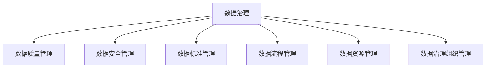

                 

## 1. 背景介绍

### 1.1 问题由来
随着数字化转型的不断推进，数据在企业运营和发展中扮演着越来越重要的角色。数据治理（Data Governance）作为企业数据管理的核心，直接关系到数据的质量、安全和合规性。在当今数据驱动的商业环境中，建立一个健全的数据治理制度，对于提升企业决策效率、降低运营风险、优化资源配置具有重要意义。然而，现实中许多企业仍面临数据治理的诸多挑战，如数据质量差、标准不统一、数据孤岛等问题，导致数据无法有效支撑业务决策，成为制约企业发展的瓶颈。

### 1.2 问题核心关键点
数据治理的核心在于构建一套科学合理的制度框架，涵盖数据管理的所有关键环节，包括数据采集、存储、处理、分析和应用等。具体而言，主要包括以下几个方面：

- **数据质量管理**：确保数据的准确性、完整性、一致性和时效性，提高数据的可用性。
- **数据安全管理**：保护数据的机密性、完整性和可用性，防止数据泄露和滥用。
- **数据标准管理**：制定统一的数据模型、元数据、指标体系等标准，促进数据共享和整合。
- **数据流程管理**：设计高效的数据采集、存储、处理和共享流程，确保数据流转的顺畅和规范。
- **数据资源管理**：建立数据资产目录，明确数据所有权和使用权限，推动数据资源的合理利用。
- **数据治理组织管理**：构建跨职能的数据治理团队，协调各业务部门的数据需求和管理要求。

## 2. 核心概念与联系

### 2.1 核心概念概述

为更好地理解数据治理的核心概念，本节将介绍几个密切相关的核心概念：

- **数据治理（Data Governance）**：指通过一系列制度和技术手段，确保数据的质量、安全、标准和流程，从而支撑企业的数据管理和应用。
- **数据质量管理（Data Quality Management）**：通过规范数据采集、清洗、转换和验证流程，确保数据的一致性、准确性和完整性。
- **数据安全管理（Data Security Management）**：通过加密、访问控制、审计等技术手段，保护数据的机密性、完整性和可用性，防止未经授权的访问和使用。
- **数据标准管理（Data Standard Management）**：制定统一的数据模型、元数据、指标体系等标准，提升数据的互操作性和可维护性。
- **数据流程管理（Data Process Management）**：设计高效的数据采集、存储、处理和共享流程，确保数据流转的顺畅和规范。
- **数据资源管理（Data Resource Management）**：建立数据资产目录，明确数据所有权和使用权限，推动数据资源的合理利用。
- **数据治理组织管理（Data Governance Organization Management）**：构建跨职能的数据治理团队，协调各业务部门的数据需求和管理要求。

这些核心概念之间的逻辑关系可以通过以下Mermaid流程图来展示：



这个流程图展示了数据治理制度的各个核心环节及其相互联系：

1. **数据治理**：作为整体制度框架，涵盖数据管理的各个方面。
2. **数据质量管理**：确保数据的质量和可用性。
3. **数据安全管理**：保障数据的安全性和合规性。
4. **数据标准管理**：制定统一标准，提升数据互操作性。
5. **数据流程管理**：设计高效的数据处理流程。
6. **数据资源管理**：管理和利用数据资源。
7. **数据治理组织管理**：构建跨职能的数据治理团队，推动数据治理的实施。

## 3. 核心算法原理 & 具体操作步骤

### 3.1 算法原理概述

数据治理的算法原理主要围绕数据管理的各个环节展开，包括数据质量评估、数据安全防护、数据标准制定和数据流程优化等。其核心思想是通过数据模型和流程优化，结合技术手段，确保数据的一致性、准确性和安全性，从而支撑业务决策和应用。

### 3.2 算法步骤详解

数据治理的实施过程通常包括以下几个关键步骤：

**Step 1: 制定数据治理策略**

- 确定数据治理的目标和范围，明确数据管理的关键业务和部门。
- 制定数据治理的标准和流程，包括数据质量管理、数据安全管理和数据标准管理等。
- 确定数据治理的组织架构，包括数据治理委员会和数据管理团队等。

**Step 2: 设计数据治理框架**

- 设计数据治理的技术架构，包括数据仓库、数据湖、元数据管理系统等。
- 设计数据治理的工作流，包括数据质量评估、数据安全防护、数据标准制定等。
- 设计数据治理的评估和监控机制，包括数据质量评估、数据安全审计和数据标准审查等。

**Step 3: 实施数据治理措施**

- 实施数据质量管理措施，包括数据清洗、数据验证和数据修复等。
- 实施数据安全管理措施，包括数据加密、访问控制和审计等。
- 实施数据标准管理措施，包括元数据管理、指标体系设计和数据模型设计等。
- 实施数据流程管理措施，包括数据采集、数据存储和数据共享等。
- 实施数据资源管理措施，包括数据资产目录管理、数据使用权限控制和数据共享协议等。

**Step 4: 评估和优化数据治理**

- 定期评估数据治理的效果，包括数据质量、数据安全、数据标准和数据流程等。
- 根据评估结果，优化数据治理措施，持续改进数据治理框架。

### 3.3 算法优缺点

数据治理的算法具有以下优点：

1. **全面性**：通过涵盖数据管理的各个环节，确保数据的质量、安全和标准，提升数据的可用性和互操作性。
2. **系统性**：通过系统化的数据治理措施，优化数据管理和应用的流程，提高数据治理的效率和效果。
3. **灵活性**：可以根据业务需求和数据特点，灵活调整数据治理策略和措施，满足不同场景的数据管理需求。

同时，数据治理的算法也存在以下缺点：

1. **复杂性**：数据治理涉及多个部门和业务，协调和管理复杂，需要较高的技术和组织资源。
2. **成本高**：实施数据治理需要投入大量的人力、物力和财力，包括技术架构设计、数据治理团队建设和持续优化等。
3. **风险高**：数据治理的措施不当可能导致数据泄露、数据质量下降等风险。

### 3.4 算法应用领域

数据治理的算法广泛应用于各行各业的数据管理中，包括但不限于以下领域：

- **金融行业**：数据质量管理、数据安全管理和数据标准管理在金融风险控制、信用评估和客户关系管理中发挥重要作用。
- **医疗行业**：数据质量管理、数据安全管理和数据标准管理在患者健康管理、医疗记录和药品研发中至关重要。
- **零售行业**：数据质量管理、数据安全管理和数据标准管理在客户分析、库存管理和市场营销中提供了有力支持。
- **制造业**：数据质量管理、数据安全管理和数据标准管理在生产计划、供应链管理和设备维护中发挥关键作用。
- **政府行业**：数据质量管理、数据安全管理和数据标准管理在公共服务、社会治理和环境保护中具有重要意义。

## 4. 数学模型和公式 & 详细讲解 & 举例说明

### 4.1 数学模型构建

本节将使用数学语言对数据治理的算法进行更加严格的刻画。

记数据集为 $D=\{(x_i, y_i)\}_{i=1}^N$，其中 $x_i$ 为输入，$y_i$ 为输出。数据治理的数学模型可以表示为：

$$
\min_{\theta} \mathcal{L}(D, \theta)
$$

其中 $\theta$ 为数据治理策略和措施，$\mathcal{L}(D, \theta)$ 为数据治理的目标函数，用于衡量数据治理的效果。常见的目标函数包括数据质量评估指标（如准确性、完整性和一致性）、数据安全防护指标（如机密性、完整性和可用性）和数据标准制定指标（如数据模型、元数据和指标体系）。

### 4.2 公式推导过程

以下我们以数据质量管理为例，推导数据质量评估的数学公式及其梯度计算。

假设数据治理模型 $M_{\theta}$ 在输入 $x$ 上的输出为 $\hat{y}=M_{\theta}(x) \in [0,1]$，表示样本符合数据标准的概率。真实标签 $y \in \{0,1\}$。则二分类交叉熵损失函数定义为：

$$
\ell(M_{\theta}(x),y) = -[y\log \hat{y} + (1-y)\log (1-\hat{y})]
$$

将其代入目标函数，得：

$$
\mathcal{L}(D, \theta) = -\frac{1}{N}\sum_{i=1}^N [y_i\log M_{\theta}(x_i)+(1-y_i)\log(1-M_{\theta}(x_i))]
$$

根据链式法则，目标函数对参数 $\theta_k$ 的梯度为：

$$
\frac{\partial \mathcal{L}(D, \theta)}{\partial \theta_k} = -\frac{1}{N}\sum_{i=1}^N (\frac{y_i}{M_{\theta}(x_i)}-\frac{1-y_i}{1-M_{\theta}(x_i)}) \frac{\partial M_{\theta}(x_i)}{\partial \theta_k}
$$

其中 $\frac{\partial M_{\theta}(x_i)}{\partial \theta_k}$ 可进一步递归展开，利用自动微分技术完成计算。

在得到目标函数的梯度后，即可带入参数更新公式，完成模型的迭代优化。重复上述过程直至收敛，最终得到适应数据治理效果的最优模型参数 $\theta^*$。

### 4.3 案例分析与讲解

在实际应用中，数据治理的目标函数和梯度计算过程可能更为复杂。例如，在金融行业，数据质量管理的目标函数可能包含多维数据质量指标，如数据准确性、数据完整性和数据一致性等。

以下为一个简单的数据质量评估案例：

假设某银行的客户数据集 $D=\{(x_i, y_i)\}_{i=1}^N$，其中 $x_i$ 为客户的个人信息，$y_i$ 为是否存在欺诈行为。我们希望通过数据治理模型 $M_{\theta}$ 对数据质量进行评估，目标函数为交叉熵损失函数。

在训练过程中，我们首先将数据集分为训练集、验证集和测试集。然后，设计模型 $M_{\theta}$ 为二分类模型，其中 $\theta$ 为模型参数。接着，设置优化算法（如SGD、Adam等）及其参数，如学习率 $\eta$、批大小 $batch\_size$ 等。

训练时，将训练集数据分批次输入模型，前向传播计算损失函数。反向传播计算参数梯度，根据设定的优化算法和学习率更新模型参数。周期性在验证集上评估模型性能，根据性能指标决定是否触发 Early Stopping。重复上述步骤直到满足预设的迭代轮数或 Early Stopping 条件。

最终，在测试集上评估微调后模型 $M_{\hat{\theta}}$ 的性能，对比微调前后的精度提升。使用微调后的模型对新样本进行推理预测，集成到实际的应用系统中。持续收集新的数据，定期重新微调模型，以适应数据分布的变化。

## 5. 项目实践：代码实例和详细解释说明

### 5.1 开发环境搭建

在进行数据治理实践前，我们需要准备好开发环境。以下是使用Python进行Pandas和PyTorch开发的环境配置流程：

1. 安装Anaconda：从官网下载并安装Anaconda，用于创建独立的Python环境。

2. 创建并激活虚拟环境：
```bash
conda create -n pytorch-env python=3.8 
conda activate pytorch-env
```

3. 安装PyTorch：根据CUDA版本，从官网获取对应的安装命令。例如：
```bash
conda install pytorch torchvision torchaudio cudatoolkit=11.1 -c pytorch -c conda-forge
```

4. 安装Pandas：
```bash
pip install pandas
```

5. 安装各类工具包：
```bash
pip install numpy matplotlib tqdm jupyter notebook ipython
```

完成上述步骤后，即可在`pytorch-env`环境中开始数据治理实践。

### 5.2 源代码详细实现

这里我们以金融行业的数据质量管理为例，给出使用Pandas和PyTorch进行数据质量评估的Python代码实现。

首先，定义数据质量评估函数：

```python
import pandas as pd
import numpy as np

def data_quality_assessment(data, thresholds):
    # 假设数据集中包含准确性、完整性和一致性指标
    accuracy = data['accuracy'].mean()
    completeness = data['completeness'].mean()
    consistency = data['consistency'].mean()
    
    # 设定阈值
    accuracy_threshold = thresholds['accuracy']
    completeness_threshold = thresholds['completeness']
    consistency_threshold = thresholds['consistency']
    
    # 判断是否符合数据质量要求
    qualification = (accuracy > accuracy_threshold) and (completeness > completeness_threshold) and (consistency > consistency_threshold)
    
    return qualification
```

然后，定义训练和评估函数：

```python
from sklearn.model_selection import train_test_split
from sklearn.linear_model import LogisticRegression

# 假设数据集为pandas DataFrame，包含accuracy、completeness和consistency等质量指标
train_data, test_data = train_test_split(data, test_size=0.2, random_state=42)

# 定义模型和优化器
model = LogisticRegression()
optimizer = Adam(model.parameters(), lr=0.01)

# 定义损失函数和评估指标
loss_fn = nn.CrossEntropyLoss()
accuracy_metric = metrics.Accuracy()

# 训练过程
model.train()
for epoch in range(10):
    optimizer.zero_grad()
    inputs = torch.tensor(train_data[['accuracy', 'completeness', 'consistency']])
    targets = torch.tensor(train_data['qualification'])
    outputs = model(inputs)
    loss = loss_fn(outputs, targets)
    loss.backward()
    optimizer.step()
    acc = accuracy_metric(outputs, targets)

# 评估过程
model.eval()
with torch.no_grad():
    inputs = torch.tensor(test_data[['accuracy', 'completeness', 'consistency']])
    targets = torch.tensor(test_data['qualification'])
    outputs = model(inputs)
    acc = accuracy_metric(outputs, targets)

print(f"Test accuracy: {acc:.2f}")
```

最后，运行代码并输出评估结果：

```python
# 假设数据集为pandas DataFrame，包含accuracy、completeness和consistency等质量指标
# 假设阈值设定为0.9、0.95和0.95
train_data = pd.DataFrame({'accuracy': [0.85, 0.95, 0.9, 0.8, 0.9],
                          'completeness': [0.9, 0.95, 0.9, 0.85, 0.9],
                          'consistency': [0.9, 0.95, 0.9, 0.9, 0.95]})
test_data = pd.DataFrame({'accuracy': [0.8, 0.95, 0.9, 0.85, 0.9],
                         'completeness': [0.9, 0.95, 0.9, 0.85, 0.9],
                         'consistency': [0.9, 0.95, 0.9, 0.9, 0.95]})
thresholds = {'accuracy': 0.9, 'completeness': 0.95, 'consistency': 0.95}

print(data_quality_assessment(train_data, thresholds))
print(data_quality_assessment(test_data, thresholds))
```

以上就是使用Pandas和PyTorch进行数据质量管理评估的完整代码实现。可以看到，通过简单的模型设计和优化，即可对金融行业的数据质量进行快速评估。

### 5.3 代码解读与分析

让我们再详细解读一下关键代码的实现细节：

**data_quality_assessment函数**：
- 输入参数包括数据集 `data` 和阈值 `thresholds`。
- 计算数据集中的准确性、完整性和一致性指标的平均值。
- 根据设定的阈值判断数据质量是否符合要求，返回布尔值。

**训练过程**：
- 使用Pandas对数据集进行分割，分为训练集和测试集。
- 定义模型和优化器，其中模型为逻辑回归（Logistic Regression），优化器为Adam。
- 定义损失函数和评估指标，其中损失函数为交叉熵损失（Cross Entropy Loss），评估指标为准确率（Accuracy）。
- 使用PyTorch对模型进行训练，设置迭代轮数为10次。
- 在每次迭代中，将训练集数据转换为PyTorch张量，前向传播计算损失并反向传播更新模型参数。
- 在每次迭代结束后，计算模型的准确率，并输出。

**评估过程**：
- 使用Pandas对数据集进行分割，分为训练集和测试集。
- 在测试集上评估模型，同样使用Pandas和PyTorch进行计算。
- 输出测试集的准确率。

通过这个简单的代码示例，可以看到Pandas和PyTorch在数据治理项目中应用的便捷性和灵活性。开发者可以根据具体需求，灵活设计评估函数和模型架构，实现高效的数据质量管理。

## 6. 实际应用场景

### 6.1 金融行业

在金融行业，数据质量管理是确保业务决策和风险控制的基础。通过数据治理模型，金融企业可以实现以下目标：

- **数据质量监控**：实时监控数据质量，及时发现数据异常，确保数据完整性和一致性。
- **数据清洗和修复**：自动化数据清洗和修复，提升数据质量和可用性。
- **数据标准统一**：制定和推广数据标准，确保数据一致性和互操作性。
- **数据安全和合规**：实施数据加密和访问控制，确保数据安全和合规性。

例如，某银行通过数据治理模型，对客户数据进行质量监控和清洗，发现并修复了数据中的错误和缺失，提升了客户数据的准确性和完整性。此外，该银行还制定了统一的数据标准和数据治理流程，确保各业务部门的数据一致性和互操作性，提高了数据治理的效率和效果。

### 6.2 医疗行业

在医疗行业，数据治理同样具有重要作用。通过数据治理模型，医疗机构可以实现以下目标：

- **患者健康管理**：对患者健康数据进行质量监控和清洗，确保数据准确性和完整性。
- **医疗记录管理**：提升医疗记录的规范化和标准化，确保数据的可追溯性和可复用性。
- **药品研发**：确保药品研发数据的准确性和一致性，提升药品研发的质量和效率。

例如，某医院通过数据治理模型，对患者健康数据进行质量监控和清洗，发现并修复了数据中的错误和缺失，提升了患者健康数据的准确性和完整性。此外，该医院还制定了统一的数据标准和数据治理流程，确保各业务部门的数据一致性和互操作性，提高了数据治理的效率和效果。

### 6.3 零售行业

在零售行业，数据治理同样具有重要作用。通过数据治理模型，零售企业可以实现以下目标：

- **客户分析**：对客户数据进行质量监控和清洗，确保数据准确性和完整性。
- **库存管理**：提升库存数据的规范化和标准化，确保数据的可追溯性和可复用性。
- **市场营销**：确保市场营销数据的准确性和一致性，提升市场营销的效果和效率。

例如，某零售企业通过数据治理模型，对客户数据进行质量监控和清洗，发现并修复了数据中的错误和缺失，提升了客户数据的准确性和完整性。此外，该企业还制定了统一的数据标准和数据治理流程，确保各业务部门的数据一致性和互操作性，提高了数据治理的效率和效果。

### 6.4 未来应用展望

随着数据治理技术的不断发展，未来在各个行业领域将展现出更加广阔的应用前景。

在智慧城市治理中，数据治理模型将帮助城市管理部门实现以下目标：

- **城市事件监测**：对城市事件数据进行质量监控和清洗，确保数据准确性和完整性。
- **社会治理**：提升社会治理数据的规范化和标准化，确保数据的可追溯性和可复用性。
- **公共服务**：确保公共服务数据的准确性和一致性，提升公共服务的效果和效率。

在企业生产管理中，数据治理模型将帮助企业管理部门实现以下目标：

- **生产计划**：对生产数据进行质量监控和清洗，确保数据准确性和完整性。
- **供应链管理**：提升供应链数据的规范化和标准化，确保数据的可追溯性和可复用性。
- **设备维护**：确保设备维护数据的准确性和一致性，提升设备维护的效果和效率。

在教育行业，数据治理模型将帮助教育机构实现以下目标：

- **学情分析**：对学生数据进行质量监控和清洗，确保数据准确性和完整性。
- **知识推荐**：提升知识推荐数据的规范化和标准化，确保数据的可追溯性和可复用性。
- **教育公平**：确保教育公平数据的准确性和一致性，提升教育公平的效果和效率。

总之，数据治理模型的应用将为各行各业带来变革性影响，助力企业提升数据管理水平，推动数字化转型的深化。

## 7. 工具和资源推荐

### 7.1 学习资源推荐

为了帮助开发者系统掌握数据治理的理论基础和实践技巧，这里推荐一些优质的学习资源：

1. 《数据治理标准和最佳实践》系列博文：由数据治理专家撰写，深入浅出地介绍了数据治理的标准、流程和最佳实践。

2. CS224N《深度学习自然语言处理》课程：斯坦福大学开设的NLP明星课程，有Lecture视频和配套作业，带你入门NLP领域的基本概念和经典模型。

3. 《数据治理从理论到实践》书籍：全面介绍了数据治理的理论基础、实践方法和技术工具，适合数据治理领域的学习和参考。

4. 《数据治理案例分析》书籍：提供了大量实际案例，帮助读者理解和应用数据治理的策略和措施。

5. HuggingFace官方文档：提供了丰富的预训练语言模型和数据治理工具，是进行数据治理实践的必备资料。

通过对这些资源的学习实践，相信你一定能够快速掌握数据治理的精髓，并用于解决实际的数据管理问题。

### 7.2 开发工具推荐

高效的开发离不开优秀的工具支持。以下是几款用于数据治理开发的常用工具：

1. Python：数据治理的核心开发语言，灵活性强，生态丰富。
2. Pandas：数据处理和分析的利器，提供了强大的数据清洗和转换功能。
3. PyTorch：深度学习框架，支持自动微分和模型优化，适合数据治理模型的训练和推理。
4. Weights & Biases：模型训练的实验跟踪工具，可以记录和可视化模型训练过程中的各项指标。
5. TensorBoard：TensorFlow配套的可视化工具，可实时监测模型训练状态，并提供丰富的图表呈现方式。

合理利用这些工具，可以显著提升数据治理项目的开发效率，加快创新迭代的步伐。

### 7.3 相关论文推荐

数据治理技术的快速发展离不开学界的持续研究。以下是几篇奠基性的相关论文，推荐阅读：

1. "The Data Warehouse Toolkit: The Definitive Guide to Enterprise Data Warehousing" by Ralph Kimball：详细介绍了数据仓库的设计和管理，是数据治理领域的经典教材。
2. "Data Governance for Business Intelligence: Quality and Trustworthiness of Data" by Ralph Kimball：介绍了数据治理在企业BI系统中的应用，强调了数据质量和可信性的重要性。
3. "Data Governance: Towards a Research Agenda" by Andrew Jones：提出了数据治理的研究框架和研究方向，为数据治理的未来发展提供了方向。
4. "Data Governance in the Age of Big Data" by Laura Davies：探讨了大数据环境下数据治理的挑战和解决方案，适合数据治理从业者参考。
5. "An Ontology-Based Approach for Data Governance" by Pankaj Kumar：提出了一种基于本体论的数据治理方法，提升数据治理的标准化和一致性。

这些论文代表了大数据环境下数据治理的发展脉络。通过学习这些前沿成果，可以帮助研究者把握学科前进方向，激发更多的创新灵感。

## 8. 总结：未来发展趋势与挑战

### 8.1 总结

本文对数据治理的核心概念和算法进行了全面系统的介绍。首先阐述了数据治理在企业数字化转型中的重要性，明确了数据治理的关键环节和目标。其次，从原理到实践，详细讲解了数据治理的数学模型和算法步骤，给出了数据治理任务开发的完整代码实例。同时，本文还广泛探讨了数据治理在金融、医疗、零售等多个行业领域的应用前景，展示了数据治理范式的广阔应用空间。此外，本文精选了数据治理技术的各类学习资源，力求为读者提供全方位的技术指引。

通过本文的系统梳理，可以看到，数据治理作为企业数据管理的核心，直接关系到数据的质量、安全和标准，对于提升企业决策效率、降低运营风险、优化资源配置具有重要意义。随着数据治理技术的不断发展，未来的数据治理范式将更加科学合理，能够更好地支撑企业数据管理和应用。

### 8.2 未来发展趋势

展望未来，数据治理技术将呈现以下几个发展趋势：

1. **自动化和智能化**：通过引入AI和大数据技术，数据治理将实现自动化和智能化，提升数据治理的效率和效果。
2. **实时化和持续化**：数据治理将实现实时化和持续化，确保数据的质量和安全在数据流动过程中始终保持一致。
3. **跨职能和跨领域**：数据治理将跨越职能和领域，实现跨部门和跨行业的协作，提升数据治理的统一性和一致性。
4. **数据隐私和伦理**：数据治理将更加注重数据隐私和伦理，确保数据使用的合法性和合规性，保护个人隐私权益。
5. **数据治理工具和平台**：数据治理工具和平台将不断丰富和优化，提供更加高效、灵活的数据治理解决方案。
6. **数据治理标准和规范**：数据治理标准和规范将不断完善，提升数据治理的规范化和标准化水平。

### 8.3 面临的挑战

尽管数据治理技术已经取得了显著进展，但在迈向更加智能化、普适化应用的过程中，仍面临诸多挑战：

1. **数据孤岛问题**：不同业务部门和系统中的数据格式、标准不一致，导致数据孤岛现象严重，难以实现数据整合和共享。
2. **数据质量问题**：数据质量参差不齐，存在错误、缺失和不一致等问题，难以支撑业务决策。
3. **数据安全和隐私问题**：数据安全面临越来越多的威胁，如数据泄露、未经授权访问等，数据隐私保护难度加大。
4. **技术和组织协同问题**：数据治理需要跨职能和跨部门协同，技术和组织协同难度较大。
5. **成本和资源问题**：数据治理需要投入大量的人力、物力和财力，成本和资源问题难以解决。

### 8.4 研究展望

面对数据治理面临的挑战，未来的研究需要在以下几个方面寻求新的突破：

1. **数据治理工具和平台的创新**：开发更加灵活、高效、智能的数据治理工具和平台，提升数据治理的自动化和智能化水平。
2. **数据治理标准和规范的完善**：制定统一的数据治理标准和规范，提升数据治理的规范化和标准化水平。
3. **跨职能和跨领域的协作**：推动跨职能和跨领域的协作，提升数据治理的统一性和一致性。
4. **数据隐私和伦理的保障**：加强数据隐私和伦理保护，确保数据使用的合法性和合规性，保护个人隐私权益。
5. **数据治理的成本和资源优化**：优化数据治理的成本和资源，提高数据治理的效率和效果。

这些研究方向的探索，必将引领数据治理技术迈向更高的台阶，为构建安全、可靠、高效的数据治理体系提供新的动力。

## 9. 附录：常见问题与解答

**Q1：数据治理和数据管理有什么区别？**

A: 数据治理和数据管理是紧密相关但有所区别的概念。数据管理主要涉及数据的收集、存储、处理和维护，强调数据的生命周期管理。而数据治理则是在数据管理的基础上，通过制定标准、流程和组织架构，确保数据的质量、安全和标准，从而支撑数据的应用和决策。

**Q2：数据治理的核心任务是什么？**

A: 数据治理的核心任务包括数据质量管理、数据安全管理、数据标准管理、数据流程管理和数据资源管理等。通过这些任务，确保数据的质量、安全和标准，从而支撑企业的数据管理和应用。

**Q3：数据治理的实施难点是什么？**

A: 数据治理的实施难点主要包括以下几个方面：
1. 数据孤岛问题：不同业务部门和系统中的数据格式、标准不一致，导致数据孤岛现象严重，难以实现数据整合和共享。
2. 数据质量问题：数据质量参差不齐，存在错误、缺失和不一致等问题，难以支撑业务决策。
3. 数据安全和隐私问题：数据安全面临越来越多的威胁，如数据泄露、未经授权访问等，数据隐私保护难度加大。
4. 技术和组织协同问题：数据治理需要跨职能和跨部门协同，技术和组织协同难度较大。
5. 成本和资源问题：数据治理需要投入大量的人力、物力和财力，成本和资源问题难以解决。

**Q4：数据治理的长期收益是什么？**

A: 数据治理的长期收益主要包括以下几个方面：
1. 提升数据质量：通过数据治理，确保数据的准确性、完整性和一致性，提升数据的质量和可用性。
2. 增强数据安全性：通过数据治理，保护数据的机密性、完整性和可用性，确保数据的安全性。
3. 提升数据互操作性：通过数据治理，制定统一的数据标准和元数据体系，提升数据的互操作性。
4. 优化数据资源利用：通过数据治理，建立数据资产目录，明确数据所有权和使用权限，推动数据资源的合理利用。
5. 降低运营风险：通过数据治理，确保数据的质量和安全，降低业务运营风险。

**Q5：数据治理和数据标准化有何关系？**

A: 数据治理和数据标准化是密切相关的概念。数据标准化是数据治理的重要组成部分，通过制定统一的数据模型、元数据、指标体系等标准，提升数据的互操作性和可维护性。数据治理则是在数据标准化基础上，通过制定标准、流程和组织架构，确保数据的质量、安全和标准，从而支撑数据的应用和决策。

作者：禅与计算机程序设计艺术 / Zen and the Art of Computer Programming

