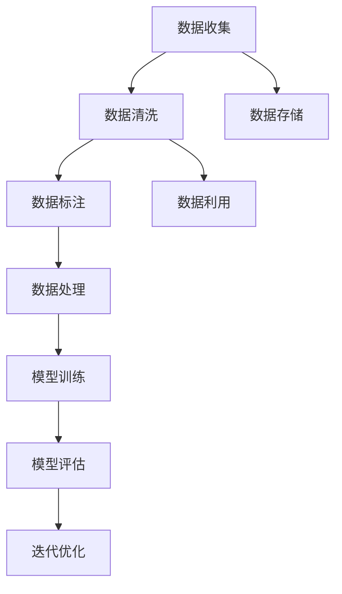

                 

## 1. 背景介绍

在人工智能(AI)领域，尤其是在基础模型建设中，数据管理的质量与效率直接影响模型的性能和可扩展性。高质量的数据集不仅为模型的训练提供了坚实的基础，更是推动模型不断进步的关键。本文将深入探讨数据管理在基础模型中的重要性，从多个角度展开，涵盖数据收集、清洗、处理和利用等环节，以期为AI开发者提供全面且有深度思考的专业见解。

### 1.1 数据的重要性

数据是AI的基石。无论是在图像识别、自然语言处理还是语音识别等应用中，高质量的数据集都是成功训练模型不可或缺的条件。数据不仅提供模型学习的基础，还决定了模型能否泛化到新的场景和数据集。

### 1.2 数据管理的挑战

然而，数据管理并不是一件简单的事情。特别是在AI基础模型的构建中，数据集的规模、多样性、质量和时效性等挑战，使得数据管理成为一项复杂且重要的工作。数据的收集、清洗、标注、存储和利用，每一个环节都需要精心设计和严格控制，以确保模型的性能和稳定性。

## 2. 核心概念与联系

### 2.1 核心概念概述

为更好地理解数据管理在基础模型中的作用，本节将介绍几个关键概念：

- **数据收集**：从不同来源获取原始数据，是数据管理的第一步。数据收集的有效性和可靠性直接影响到后续的清洗和处理工作。
- **数据清洗**：清洗数据以去除噪声、异常值和不一致性，是数据管理的核心环节。好的数据清洗工作能够提高模型训练的效率和准确性。
- **数据标注**：对数据进行标记，赋予其意义和类别，是模型训练的重要基础。标注的准确性和一致性直接影响模型的学习效果。
- **数据存储**：有效存储和管理数据，确保其长期可用性和可访问性。现代数据管理技术，如分布式存储、数据库等，支持大规模数据存储和处理。
- **数据处理**：将原始数据转化为模型可以使用的形式，包括数据归一化、特征工程等。有效的数据处理能够提高模型训练的效率和性能。
- **数据利用**：在模型训练和评估过程中，充分利用数据集，探索数据与模型之间的潜在关系。数据利用是模型迭代优化的关键步骤。

这些核心概念通过以下Mermaid流程图展示它们之间的逻辑联系：



这些概念通过数据流动的形式连接在一起，共同支撑基础模型的构建和优化。

## 3. 核心算法原理 & 具体操作步骤

### 3.1 算法原理概述

数据管理在基础模型中起着至关重要的作用，通过高效的数据收集、清洗和利用，能够显著提升模型的性能和可扩展性。本文将从算法原理的角度，探讨数据管理在基础模型中的重要性。

在模型训练过程中，数据管理主要涉及以下几个关键步骤：

1. **数据收集**：从多个数据源获取原始数据，构建多模态的数据集。
2. **数据清洗**：去除噪声、异常值，保证数据质量。
3. **数据标注**：对数据进行标记，赋予其意义和类别。
4. **数据存储**：将处理后的数据存储到高效的数据库中，便于后续的访问和处理。
5. **数据处理**：将原始数据转化为模型可以使用的形式，包括数据归一化、特征工程等。
6. **数据利用**：在模型训练和评估过程中，充分利用数据集，探索数据与模型之间的潜在关系。

### 3.2 算法步骤详解

**Step 1: 数据收集**

数据收集是数据管理的第一步，通常涉及以下几个步骤：

- 确定数据源：选择可靠的数据源，如公开数据集、公司内部数据等。
- 数据采集：使用爬虫、API接口等方式获取数据。
- 数据整合：将多个数据源的数据进行整合，构建统一的数据集。

**Step 2: 数据清洗**

数据清洗是数据管理中最重要的环节之一，其主要目的是去除数据中的噪声、异常值和不一致性。数据清洗一般包括以下步骤：

- 数据预处理：去除重复数据、处理缺失值、转换数据格式等。
- 异常值检测：使用统计方法或机器学习算法检测并处理异常值。
- 数据对齐：确保不同数据源中的数据能够对齐，统一数据格式。

**Step 3: 数据标注**

数据标注是将原始数据转化为模型可以使用的形式，其步骤如下：

- 数据标记：对数据进行标记，赋予其意义和类别。
- 标签审核：确保标注的一致性和准确性，防止标签噪声。
- 标签扩展：使用多标签学习等方法扩展标签空间，提高模型泛化能力。

**Step 4: 数据存储**

数据存储是将处理后的数据存储到高效的数据库中，便于后续的访问和处理。常用的数据存储方式包括：

- 分布式存储：如Hadoop、Spark等，支持大规模数据存储和处理。
- 关系型数据库：如MySQL、PostgreSQL等，支持复杂的数据查询和事务处理。
- 非关系型数据库：如MongoDB、Redis等，支持高并发的数据读写操作。

**Step 5: 数据处理**

数据处理是将原始数据转化为模型可以使用的形式，其步骤如下：

- 数据归一化：将数据转化为标准化的形式，如0-1之间的值。
- 特征工程：提取、选择和构造特征，提高模型的预测能力。
- 数据增强：通过数据变换和扩充，提高数据的多样性，防止过拟合。

**Step 6: 数据利用**

数据利用是模型训练和评估过程中的关键步骤，其主要目的是充分利用数据集，探索数据与模型之间的潜在关系。数据利用的主要步骤如下：

- 模型训练：使用处理后的数据训练模型。
- 模型评估：使用测试数据评估模型性能。
- 迭代优化：根据评估结果，调整模型参数，优化模型性能。

### 3.3 算法优缺点

数据管理在基础模型中的作用是显而易见的，但也存在一些限制和挑战：

**优点：**

1. **提高模型性能**：通过高效的数据管理，能够提高模型训练的效率和准确性。
2. **增强模型泛化能力**：通过数据清洗和标注，能够提高模型的泛化能力，减少过拟合风险。
3. **支持大规模数据处理**：通过分布式存储和高效的数据处理技术，能够处理大规模数据集。
4. **提高数据利用率**：通过数据清洗和标注，能够充分利用数据集，探索数据与模型之间的潜在关系。

**缺点：**

1. **数据获取难度大**：高质量的数据源获取难度大，尤其是大规模、多样化的数据集。
2. **数据清洗工作量大**：数据清洗和标注工作量大，需要投入大量人力和时间。
3. **数据标注噪声**：标注数据的噪声可能会影响模型的学习效果。
4. **数据存储成本高**：大规模数据的存储和处理需要高昂的存储成本和计算资源。
5. **数据利用复杂**：数据利用的复杂性增加了模型的迭代优化难度。

### 3.4 算法应用领域

数据管理在基础模型中的应用领域非常广泛，涵盖了多个领域，包括：

- **自然语言处理**：如文本分类、情感分析、机器翻译等。
- **计算机视觉**：如图像识别、目标检测、图像生成等。
- **语音识别**：如语音转换、语音识别、语音生成等。
- **推荐系统**：如商品推荐、新闻推荐、广告推荐等。
- **金融分析**：如股票预测、风险评估、信用评分等。
- **医疗健康**：如疾病诊断、健康监测、个性化治疗等。
- **智能制造**：如工业检测、智能调度、质量控制等。

## 4. 数学模型和公式 & 详细讲解 & 举例说明

### 4.1 数学模型构建

数据管理在基础模型中的重要性可以从数学模型构建的角度进行深入分析。假设有一组数据集 $D = \{(x_i, y_i)\}_{i=1}^N$，其中 $x_i$ 是输入特征，$y_i$ 是输出标签。

数据管理的目标是通过以下步骤，优化数据集 $D$，从而提高模型的训练效率和准确性：

1. **数据收集**：通过不同的数据源获取原始数据。
2. **数据清洗**：去除噪声、异常值和不一致性。
3. **数据标注**：对数据进行标记，赋予其意义和类别。
4. **数据存储**：将处理后的数据存储到高效的数据库中。
5. **数据处理**：将原始数据转化为模型可以使用的形式。
6. **数据利用**：在模型训练和评估过程中，充分利用数据集。

### 4.2 公式推导过程

以下以简单的线性回归模型为例，推导数据管理在基础模型中的重要性：

假设线性回归模型的目标是拟合数据集 $D$，模型的形式为 $y = wx + b$，其中 $w$ 和 $b$ 为模型参数。

**Step 1: 数据收集**

数据收集的目的是获取原始数据 $D$，数据的形式为 $(x_i, y_i)$。

**Step 2: 数据清洗**

数据清洗的目的是去除噪声、异常值和不一致性。假设原始数据存在噪声和异常值，可以通过以下公式进行数据清洗：

$$
x_i' = f(x_i) \quad \text{其中} \quad f(x_i) \text{为数据清洗函数}
$$

**Step 3: 数据标注**

数据标注的目的是对数据进行标记，赋予其意义和类别。假设原始数据存在标注噪声，可以通过以下公式进行数据标注：

$$
y_i' = g(y_i) \quad \text{其中} \quad g(y_i) \text{为数据标注函数}
$$

**Step 4: 数据存储**

数据存储的目的是将处理后的数据存储到高效的数据库中。假设处理后的数据存储在数据库 $DB$ 中，数据库的形式为 $(x_i', y_i')$。

**Step 5: 数据处理**

数据处理的目标是将原始数据转化为模型可以使用的形式。假设原始数据需要进行归一化处理，可以通过以下公式进行数据处理：

$$
x_i'' = h(x_i') \quad \text{其中} \quad h(x_i') \text{为数据处理函数}
$$

**Step 6: 数据利用**

数据利用的目的是在模型训练和评估过程中，充分利用数据集。假设模型在数据集 $D''$ 上训练，训练过程可以表示为：

$$
\min_w \frac{1}{N} \sum_{i=1}^N (y_i'' - wx_i'' - b)^2
$$

### 4.3 案例分析与讲解

以自然语言处理（NLP）中的文本分类任务为例，探讨数据管理在基础模型中的重要性。

假设有一组文本分类数据集 $D$，其中包含文本 $x_i$ 和对应的分类标签 $y_i$。

**Step 1: 数据收集**

数据收集的目的是获取原始文本数据 $D$。

**Step 2: 数据清洗**

数据清洗的目的是去除噪声、异常值和不一致性。例如，对于存在拼写错误的文本，可以通过以下公式进行数据清洗：

$$
x_i' = \text{校正}(x_i) \quad \text{其中} \quad \text{校正}(x_i) \text{为文本校正函数}
$$

**Step 3: 数据标注**

数据标注的目的是对文本进行标记，赋予其意义和类别。例如，对于文本 $x_i$，可以通过以下公式进行数据标注：

$$
y_i' = \text{标记}(x_i) \quad \text{其中} \quad \text{标记}(x_i) \text{为文本标注函数}
$$

**Step 4: 数据存储**

数据存储的目的是将处理后的文本数据存储到高效的数据库中。假设处理后的文本数据存储在数据库 $DB$ 中，数据库的形式为 $(x_i', y_i')$。

**Step 5: 数据处理**

数据处理的目标是将原始文本数据转化为模型可以使用的形式。例如，对于文本 $x_i$，可以通过以下公式进行数据处理：

$$
x_i'' = \text{归一化}(x_i') \quad \text{其中} \quad \text{归一化}(x_i') \text{为文本归一化函数}
$$

**Step 6: 数据利用**

数据利用的目的是在模型训练和评估过程中，充分利用文本数据集。假设模型在文本数据集 $D''$ 上训练，训练过程可以表示为：

$$
\min_w \frac{1}{N} \sum_{i=1}^N \text{CrossEntropy}(w, x_i'')
$$

## 5. 项目实践：代码实例和详细解释说明

### 5.1 开发环境搭建

在进行数据管理实践前，我们需要准备好开发环境。以下是使用Python进行PyTorch开发的环境配置流程：

1. 安装Anaconda：从官网下载并安装Anaconda，用于创建独立的Python环境。

2. 创建并激活虚拟环境：
```bash
conda create -n pytorch-env python=3.8 
conda activate pytorch-env
```

3. 安装PyTorch：根据CUDA版本，从官网获取对应的安装命令。例如：
```bash
conda install pytorch torchvision torchaudio cudatoolkit=11.1 -c pytorch -c conda-forge
```

4. 安装TensorFlow：
```bash
pip install tensorflow
```

5. 安装PyTorch和TensorFlow所需的依赖库：
```bash
pip install numpy pandas scikit-learn matplotlib tqdm jupyter notebook ipython
```

完成上述步骤后，即可在`pytorch-env`环境中开始数据管理实践。

### 5.2 源代码详细实现

这里我们以数据清洗为例，给出使用Python对数据集进行清洗的代码实现。

首先，定义数据清洗函数：

```python
import pandas as pd
import numpy as np

def data_cleaning(data):
    # 去除重复数据
    data = data.drop_duplicates()
    
    # 处理缺失值
    data = data.fillna(method='ffill')
    
    # 转换数据格式
    data = data.astype('float32')
    
    return data
```

然后，使用该函数清洗数据集：

```python
# 加载数据集
data = pd.read_csv('data.csv')

# 清洗数据
cleaned_data = data_cleaning(data)
```

接着，将清洗后的数据保存：

```python
cleaned_data.to_csv('cleaned_data.csv', index=False)
```

### 5.3 代码解读与分析

让我们再详细解读一下关键代码的实现细节：

**data_cleaning函数**：
- `drop_duplicates`方法：去除数据集中的重复数据。
- `fillna`方法：处理缺失值，使用前向填充方法。
- `astype`方法：将数据集转换为浮点数格式。

**data变量**：
- `read_csv`方法：从CSV文件中读取数据集。

**cleaned_data变量**：
- `to_csv`方法：将清洗后的数据集保存为CSV文件。

**cleaned_data变量**：
- `index=False`参数：不保存数据集的索引。

可以看到，使用Python和Pandas库，可以轻松实现数据清洗任务。通过简单的代码操作，即可去除数据中的噪声、异常值和不一致性，提高数据质量，为模型训练提供坚实的支持。

## 6. 实际应用场景

### 6.1 智能推荐系统

智能推荐系统是数据管理在基础模型中应用的重要场景之一。通过高效的数据管理，推荐系统能够分析用户行为数据，提取用户偏好，从而提供个性化的推荐内容。

在推荐系统中，数据管理主要涉及以下几个方面：

- 数据收集：收集用户行为数据，如浏览记录、购买记录、评分数据等。
- 数据清洗：去除重复数据、处理缺失值，确保数据质量。
- 数据标注：对用户行为进行标记，如兴趣标签、行为类型等。
- 数据存储：将处理后的数据存储到高效的数据库中，便于后续的访问和处理。
- 数据处理：对用户行为数据进行归一化、特征工程等处理。
- 数据利用：在推荐模型训练和评估过程中，充分利用用户行为数据。

通过高效的数据管理，推荐系统能够从大量数据中提取有价值的信息，提高推荐精度，提升用户体验。

### 6.2 医疗健康

在医疗健康领域，数据管理同样扮演着至关重要的角色。通过高效的数据管理，能够更好地处理和管理患者数据，提高诊断和治疗的准确性。

在医疗健康中，数据管理主要涉及以下几个方面：

- 数据收集：收集患者病历数据、影像数据、实验室数据等。
- 数据清洗：去除重复数据、处理缺失值，确保数据质量。
- 数据标注：对患者数据进行标记，如疾病类型、治疗方案等。
- 数据存储：将处理后的患者数据存储到高效的数据库中，便于后续的访问和处理。
- 数据处理：对患者数据进行归一化、特征工程等处理。
- 数据利用：在医疗模型训练和评估过程中，充分利用患者数据。

通过高效的数据管理，医疗健康领域能够从大量数据中提取有价值的信息，提高诊断和治疗的准确性，提升医疗服务质量。

### 6.3 金融分析

在金融分析领域，数据管理同样扮演着至关重要的角色。通过高效的数据管理，能够更好地处理和管理金融数据，提高金融分析的准确性。

在金融分析中，数据管理主要涉及以下几个方面：

- 数据收集：收集金融市场数据、交易数据、客户数据等。
- 数据清洗：去除重复数据、处理缺失值，确保数据质量。
- 数据标注：对金融数据进行标记，如股票类型、市场指数等。
- 数据存储：将处理后的金融数据存储到高效的数据库中，便于后续的访问和处理。
- 数据处理：对金融数据进行归一化、特征工程等处理。
- 数据利用：在金融模型训练和评估过程中，充分利用金融数据。

通过高效的数据管理，金融分析领域能够从大量数据中提取有价值的信息，提高金融分析的准确性，提升金融服务质量。

## 7. 工具和资源推荐

### 7.1 学习资源推荐

为了帮助开发者系统掌握数据管理在基础模型中的重要性，这里推荐一些优质的学习资源：

1. **《深度学习实战》系列书籍**：由深度学习专家撰写，详细介绍了数据管理在深度学习中的重要性，涵盖数据收集、清洗、标注、存储等环节。

2. **Coursera《深度学习专项课程》**：由深度学习专家Andrew Ng教授主讲，深入浅出地讲解了数据管理在深度学习中的应用。

3. **Kaggle数据科学竞赛**：通过参与实际的数据科学竞赛，学习如何在实际应用中管理数据，提升数据管理技能。

4. **GitHub开源项目**：通过学习开源项目中的数据管理策略，了解如何在实际应用中高效管理数据。

5. **TensorFlow官方文档**：提供丰富的数据管理工具和样例代码，帮助开发者快速上手数据管理。

通过对这些资源的学习实践，相信你一定能够快速掌握数据管理在基础模型中的重要性，并用于解决实际的AI问题。

### 7.2 开发工具推荐

高效的数据管理需要依赖于优秀的工具支持。以下是几款用于数据管理开发的常用工具：

1. **Apache Hadoop**：支持大规模数据存储和处理，适用于分布式数据管理。
2. **Apache Spark**：支持大数据处理和分析，适用于复杂数据管理需求。
3. **Amazon S3**：提供高效的数据存储和检索服务，适用于云环境下的数据管理。
4. **Apache Cassandra**：支持大规模数据存储和高可用性，适用于高并发的数据管理需求。
5. **Apache Kafka**：提供高效的数据流处理服务，适用于实时数据管理需求。

合理利用这些工具，可以显著提升数据管理的效率和效果，确保数据的可靠性和可用性。

### 7.3 相关论文推荐

数据管理在基础模型中的应用源于学界的持续研究。以下是几篇奠基性的相关论文，推荐阅读：

1. **《数据清洗：理论和算法》**：详细介绍了数据清洗的理论和算法，是数据管理的基础。

2. **《大规模分布式数据管理》**：介绍了大规模分布式数据管理的策略和技术，适用于大规模数据管理需求。

3. **《数据标注和注释：实践和挑战》**：讨论了数据标注的实践和挑战，探讨如何提高数据标注质量。

4. **《大数据下的数据管理和处理技术》**：介绍了大数据环境下的数据管理和处理技术，适用于大数据管理需求。

5. **《数据处理和分析技术》**：介绍了数据处理和分析的技术和工具，适用于复杂数据管理需求。

这些论文代表了大数据管理技术的进展，通过学习这些前沿成果，可以帮助研究者掌握数据管理在基础模型中的重要性，推动数据管理技术的进一步发展。

## 8. 总结：未来发展趋势与挑战

### 8.1 总结

本文对数据管理在基础模型中的重要性进行了全面系统的探讨。首先阐述了数据管理在AI基础模型建设中的重要作用，详细介绍了数据收集、清洗、标注、存储和利用等环节，强调了数据管理对模型性能和可扩展性的影响。

通过本文的系统梳理，可以看到，数据管理在基础模型中扮演着至关重要的角色，其重要性不仅体现在模型训练的效率和准确性上，更在于数据质量对模型泛化能力和鲁棒性的影响。未来，随着AI技术的发展，数据管理将面临更多挑战，但同时也会迎来更多机遇。

### 8.2 未来发展趋势

展望未来，数据管理在基础模型中的发展趋势如下：

1. **数据质量管理**：随着数据规模的增大，数据质量管理将变得更加重要。通过高效的数据清洗和标注，能够提高模型的训练效率和泛化能力。

2. **数据自动化管理**：数据管理将逐渐自动化，通过AI技术实现数据收集、清洗和标注的自动化，提高数据管理效率。

3. **数据联邦学习**：数据联邦学习技术将使数据管理更加安全和高效，能够在保护数据隐私的前提下，实现多源数据的协同管理。

4. **数据可视化**：通过数据可视化技术，能够更直观地了解数据特征和分布，辅助数据管理和模型优化。

5. **数据安全和隐私保护**：数据安全和隐私保护将成为数据管理的核心问题，通过加密、匿名化等技术，保护数据隐私。

6. **数据实时处理**：数据实时处理技术将使数据管理更加高效，能够在实时数据产生时及时处理和分析。

### 8.3 面临的挑战

尽管数据管理在基础模型中的作用越来越重要，但在其发展过程中，仍面临诸多挑战：

1. **数据质量和标注质量**：数据质量和标注质量的提升需要大量人力和时间，如何在高效管理数据的同时，保证数据质量和标注质量，是一大难题。

2. **数据安全和隐私保护**：数据安全和隐私保护问题日益严峻，如何在数据管理中保护数据隐私，是一大挑战。

3. **数据存储和处理成本**：大规模数据的存储和处理需要高昂的成本，如何在成本和效率之间找到平衡，是一大挑战。

4. **数据利用和分析复杂性**：数据利用的复杂性增加了模型迭代优化的难度，如何在高效管理数据的同时，充分利用数据进行模型训练和评估，是一大挑战。

### 8.4 研究展望

面对数据管理面临的挑战，未来的研究需要在以下几个方面寻求新的突破：

1. **自动化数据管理**：开发更加自动化和智能化的数据管理工具，提高数据管理效率。

2. **数据联邦学习**：探索数据联邦学习技术，实现多源数据的协同管理和高效利用。

3. **数据安全和隐私保护**：开发更加安全和高效的加密、匿名化技术，保护数据隐私。

4. **实时数据处理**：探索实时数据处理技术，实现数据的实时分析和处理。

5. **数据可视化**：开发更加高效和直观的数据可视化工具，帮助数据管理和模型优化。

6. **跨模态数据管理**：探索跨模态数据管理技术，实现多模态数据的协同管理和高效利用。

通过这些研究方向的探索，数据管理在基础模型中的应用将更加广泛和深入，为AI技术的发展提供坚实的支持。

## 9. 附录：常见问题与解答

**Q1：数据管理在基础模型中的重要性体现在哪些方面？**

A: 数据管理在基础模型中的重要性主要体现在以下几个方面：

1. **数据质量管理**：通过高效的数据清洗和标注，能够提高模型的训练效率和泛化能力。
2. **数据利用率**：通过合理的数据利用，能够充分利用数据集，探索数据与模型之间的潜在关系，提高模型性能。
3. **数据存储和处理**：通过高效的数据存储和处理技术，能够支持大规模数据的存储和处理，提高数据管理效率。
4. **数据安全和隐私保护**：通过加密、匿名化等技术，保护数据隐私，确保数据安全。

**Q2：数据管理过程中需要注意哪些问题？**

A: 数据管理过程中需要注意以下几个问题：

1. **数据质量**：确保数据质量，避免噪声和异常值影响模型训练。
2. **数据标注**：保证数据标注的一致性和准确性，防止标注噪声影响模型学习。
3. **数据存储**：选择合适的数据存储方式，确保数据的长期可用性和可访问性。
4. **数据处理**：合理的数据处理能够提高模型训练效率和精度。
5. **数据安全和隐私保护**：保护数据隐私，防止数据泄露和滥用。

**Q3：如何在高效管理数据的同时，保证数据质量和标注质量？**

A: 要在高效管理数据的同时，保证数据质量和标注质量，可以考虑以下几个方面：

1. **自动化数据管理**：开发更加自动化和智能化的数据管理工具，提高数据管理效率。
2. **数据联邦学习**：探索数据联邦学习技术，实现多源数据的协同管理和高效利用。
3. **数据清洗和标注工具**：使用专业的数据清洗和标注工具，提高数据质量和标注质量。
4. **跨模态数据管理**：探索跨模态数据管理技术，实现多模态数据的协同管理和高效利用。
5. **数据安全和隐私保护**：开发更加安全和高效的加密、匿名化技术，保护数据隐私。

通过这些方法，可以在高效管理数据的同时，保证数据质量和标注质量，提升模型训练和预测的准确性。

**Q4：如何优化数据管理的效率和效果？**

A: 要优化数据管理的效率和效果，可以考虑以下几个方面：

1. **自动化数据管理**：开发更加自动化和智能化的数据管理工具，提高数据管理效率。
2. **数据联邦学习**：探索数据联邦学习技术，实现多源数据的协同管理和高效利用。
3. **数据清洗和标注工具**：使用专业的数据清洗和标注工具，提高数据质量和标注质量。
4. **数据安全和隐私保护**：开发更加安全和高效的加密、匿名化技术，保护数据隐私。
5. **实时数据处理**：探索实时数据处理技术，实现数据的实时分析和处理。

通过这些方法，可以优化数据管理的效率和效果，确保数据的可靠性和可用性，提高模型的训练和预测准确性。

**Q5：如何保护数据安全和隐私？**

A: 保护数据安全和隐私，可以考虑以下几个方面：

1. **数据加密**：使用数据加密技术，确保数据在传输和存储过程中的安全性。
2. **数据匿名化**：对敏感数据进行匿名化处理，防止数据泄露和滥用。
3. **访问控制**：设置严格的访问控制机制，防止未经授权的访问和操作。
4. **数据审计**：记录和审计数据访问和操作日志，确保数据的安全性和合规性。
5. **隐私保护算法**：开发隐私保护算法，如差分隐私、同态加密等，保护数据隐私。

通过这些方法，可以保护数据安全和隐私，确保数据的可靠性和合规性。

---

作者：禅与计算机程序设计艺术 / Zen and the Art of Computer Programming

