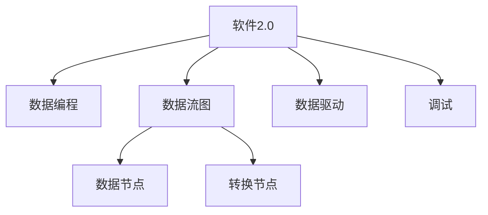
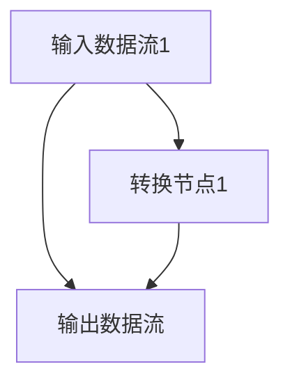

                 

## 1. 背景介绍

### 1.1 问题由来

数据编程（Data Programming）是软件2.0（Software 2.0）时代的一项关键技术，它通过引入数据分析思维，使得程序代码更加数据驱动和自动化。数据编程强调通过数据来描述程序的行为和逻辑，从而使得软件更加灵活和可维护。然而，尽管数据编程带来了诸多优势，它也带来了一系列新的挑战，特别是对于软件调试方面的影响。

### 1.2 问题核心关键点

数据编程的核心在于将数据作为程序逻辑的核心驱动因素，而不是传统的静态代码逻辑。数据编程通过数据流图（Dataflow Graph）来描述程序的行为，数据流图由数据节点（Data Nodes）和转换节点（Transformation Nodes）组成，数据节点表示数据流，转换节点表示数据操作。数据编程的目的是通过数据来驱动程序行为，使得程序更加灵活和可扩展。

然而，数据编程也带来了一系列新的调试挑战。首先，数据编程的调试过程需要关注数据流和数据状态，而非传统的代码逻辑。其次，数据编程中的数据错误可能导致程序行为的异常，这与传统代码错误处理方式不同。最后，数据编程的调试过程需要大量的数据分析和可视化工具，以辅助开发者理解数据流和数据状态的变化。

### 1.3 问题研究意义

研究数据编程对调试的影响，对于理解软件2.0时代的新特性和挑战具有重要意义：

1. **提升软件灵活性**：数据编程使得软件更加数据驱动，从而能够适应多种数据源和数据格式，提升软件的灵活性和扩展性。
2. **促进自动化开发**：数据编程的自动化特性使得程序开发过程更加高效，减少手动代码编写，降低开发成本。
3. **优化数据驱动的调试过程**：了解数据编程的调试挑战，有助于开发更加高效的数据驱动调试工具，提升开发者调试效率。
4. **促进数据与软件的协同演进**：数据编程强调数据与软件的协同演进，理解这一过程有助于构建更加智能和自适应的软件系统。

## 2. 核心概念与联系

### 2.1 核心概念概述

为了更好地理解数据编程及其对调试的影响，本节将介绍几个密切相关的核心概念：

- **软件2.0（Software 2.0）**：指通过数据分析和机器学习等技术，使得软件系统具备智能决策和自适应能力的新一代软件。软件2.0强调数据和算法在软件开发中的核心地位，而非传统的静态代码逻辑。
- **数据编程（Data Programming）**：通过数据流图（Dataflow Graph）来描述程序行为和逻辑，强调数据作为程序的核心驱动因素。数据编程使得程序更加灵活和可维护。
- **数据流图（Dataflow Graph）**：由数据节点（Data Nodes）和转换节点（Transformation Nodes）组成，描述程序中数据流的流程。数据流图是数据编程的基础。
- **数据驱动（Data-Driven）**：指程序的行为和逻辑由数据来驱动，而非传统的静态代码逻辑。数据驱动的目的是通过数据流来动态调整程序行为。
- **调试（Debugging）**：指通过一系列工具和技术，找到程序中的错误，并修复这些错误的过程。调试是软件开发过程中不可或缺的一部分。

这些核心概念之间的逻辑关系可以通过以下Mermaid流程图来展示：



这个流程图展示了一些关键概念及其之间的联系：

1. 软件2.0通过数据分析和机器学习技术，使软件具备智能决策和自适应能力。
2. 数据编程通过数据流图来描述程序行为，使得程序更加灵活和可维护。
3. 数据流图由数据节点和转换节点组成，用于描述数据流的流程。
4. 数据驱动通过数据流来动态调整程序行为，强调数据作为程序的核心驱动因素。
5. 调试用于找到程序中的错误，并修复这些错误，是软件开发过程中不可或缺的一部分。

## 3. 核心算法原理 & 具体操作步骤

### 3.1 算法原理概述

数据编程的调试过程，主要关注数据流和数据状态的变化。与传统的代码调试不同，数据编程的调试过程需要理解数据流图中的数据流和数据状态的变化，从而定位和修复程序中的错误。

### 3.2 算法步骤详解

数据编程的调试过程可以分为以下几个关键步骤：

**Step 1: 数据流图建模**

- 确定程序的数据流图，明确数据流图中的数据节点和转换节点。
- 使用可视化工具（如Gephi、Cytoscape）将数据流图可视化，便于理解和分析。

**Step 2: 数据流追踪**

- 使用数据追踪工具（如Valgrind、DTrace）追踪数据流图中的数据流和数据状态的变化。
- 分析数据流图中的数据节点和转换节点的输入和输出，确保数据流的正确性。

**Step 3: 数据状态检查**

- 使用数据状态检查工具（如GDB、LLDB）检查数据流图中的数据状态。
- 分析数据状态的变化，查找数据状态异常的原因。

**Step 4: 调试工具使用**

- 使用调试工具（如Xdebug、gdb）设置断点和观察数据流图中的数据流和数据状态。
- 逐步执行程序，观察数据流和数据状态的变化，查找错误原因。

**Step 5: 错误定位和修复**

- 定位数据流图或数据状态中的错误。
- 根据错误原因，修复数据流图中的数据节点或转换节点，重新测试程序。

### 3.3 算法优缺点

数据编程的调试过程具有以下优点：

1. **数据驱动**：通过数据流图来描述程序行为，使得调试过程更加直观和可理解。
2. **灵活性高**：数据编程的调试过程可以适应多种数据源和数据格式，提高调试的灵活性。
3. **自动化程度高**：数据编程的调试过程可以通过自动化工具来辅助完成，提高调试效率。

然而，数据编程的调试过程也存在一些缺点：

1. **数据错误难以定位**：数据编程中的错误可能导致数据流图或数据状态的变化，这些变化难以通过传统的代码错误定位方式来识别。
2. **调试工具复杂**：数据编程的调试过程需要使用大量的数据追踪和状态检查工具，这些工具的使用需要一定的学习成本。
3. **可视化复杂**：数据流图中的数据节点和转换节点数量众多，可视化过程可能变得复杂和繁琐。

### 3.4 算法应用领域

数据编程的调试方法已经在多个领域得到了广泛应用，例如：

- **数据分析**：通过数据流图来描述数据处理流程，确保数据的正确性和一致性。
- **机器学习**：通过数据流图来描述模型训练和预测过程，确保模型性能的稳定性和可解释性。
- **人工智能**：通过数据流图来描述智能决策过程，确保智能系统的稳定性和准确性。
- **自然语言处理**：通过数据流图来描述文本处理流程，确保文本处理结果的正确性和一致性。
- **金融分析**：通过数据流图来描述金融数据处理流程，确保金融决策的准确性和及时性。

除了上述这些经典应用外，数据编程的调试方法也在更多场景中得到了创新性地应用，如医疗诊断、智能制造、智慧城市等，为这些领域带来了新的突破。

## 4. 数学模型和公式 & 详细讲解 & 举例说明

### 4.1 数学模型构建

数据编程的调试过程可以通过数学模型来描述和分析。这里我们将使用数据流图中的数据节点和转换节点来构建数学模型，并通过数据流图的可视化工具来辅助理解和分析。

设数据流图为 $\mathcal{G}$，由数据节点 $N$ 和转换节点 $M$ 组成，数据流图的形式化描述为：

$$
\mathcal{G} = (N, M, E)
$$

其中 $N = \{n_1, n_2, \ldots, n_k\}$ 表示数据节点集合，$M = \{m_1, m_2, \ldots, m_l\}$ 表示转换节点集合，$E$ 表示数据流集合。

对于数据流图中的数据节点 $n_i$ 和转换节点 $m_j$，我们可以使用数学模型来描述它们之间的关系：

- 数据节点 $n_i$ 表示数据流图中的数据流，其数学模型为：
$$
n_i: \{in(n_i), out(n_i)\} \rightarrow D_i
$$

其中 $in(n_i)$ 表示节点 $n_i$ 的输入数据流，$out(n_i)$ 表示节点 $n_i$ 的输出数据流，$D_i$ 表示节点 $n_i$ 的数据状态。

- 转换节点 $m_j$ 表示数据流图中的数据操作，其数学模型为：
$$
m_j: \{in(m_j), out(m_j)\} \rightarrow T_j
$$

其中 $in(m_j)$ 表示节点 $m_j$ 的输入数据流，$out(m_j)$ 表示节点 $m_j$ 的输出数据流，$T_j$ 表示节点 $m_j$ 的数据状态。

### 4.2 公式推导过程

下面我们将对数据流图中的数据节点和转换节点的数学模型进行详细推导：

对于数据节点 $n_i$，其输入数据流 $in(n_i)$ 和输出数据流 $out(n_i)$ 之间的关系可以通过以下公式表示：

$$
out(n_i) = \bigoplus_{n_j \in \text{in}(n_i)} in(n_j)
$$

其中 $\bigoplus$ 表示数据流的合并操作。

对于转换节点 $m_j$，其输入数据流 $in(m_j)$ 和输出数据流 $out(m_j)$ 之间的关系可以通过以下公式表示：

$$
out(m_j) = f_j \bigoplus_{m_k \in \text{in}(m_j)} in(m_k)
$$

其中 $f_j$ 表示节点 $m_j$ 的数据操作函数，$\bigoplus$ 表示数据流的合并操作。

通过以上公式，我们可以构建数据流图中的数据节点和转换节点的数学模型，并通过这些模型来分析数据流图的行为和逻辑。

### 4.3 案例分析与讲解

下面我们以一个简单的数据流图为例，来说明数据编程的调试过程：

假设我们有一个简单的数据流图，包含两个数据节点 $n_1$ 和 $n_2$，以及一个转换节点 $m_1$，其数据流图如下所示：



在这个数据流图中，$n_1$ 表示输入数据流1，$n_2$ 表示输入数据流2，$m_1$ 表示转换节点1，其数据流图的形式化描述为：

$$
\mathcal{G} = (N, M, E)
$$

其中 $N = \{n_1, n_2\}$，$M = \{m_1\}$，$E = \{e_{n_1m_1}, e_{n_2m_1}\}$。

根据以上数据流图，我们可以得到以下数学模型：

- 数据节点 $n_1$ 的数学模型为：
$$
in(n_1) = \{e_{n_1m_1}\}
$$
$$
out(n_1) = \{e_{n_1m_1}\}
$$

- 数据节点 $n_2$ 的数学模型为：
$$
in(n_2) = \{e_{n_2m_1}\}
$$
$$
out(n_2) = \{e_{n_2m_1}\}
$$

- 转换节点 $m_1$ 的数学模型为：
$$
in(m_1) = \{e_{n_1m_1}, e_{n_2m_1}\}
$$
$$
out(m_1) = f_1(e_{n_1m_1}, e_{n_2m_1})
$$

在这个数据流图中，$e_{n_1m_1}$ 表示从数据节点 $n_1$ 到转换节点 $m_1$ 的数据流，$e_{n_2m_1}$ 表示从数据节点 $n_2$ 到转换节点 $m_1$ 的数据流，$f_1$ 表示转换节点 $m_1$ 的数据操作函数。

假设我们已知数据节点 $n_1$ 和 $n_2$ 的输入数据流分别为 $d_1$ 和 $d_2$，数据节点 $m_1$ 的输出数据流为 $d_3$，我们可以通过数学模型来计算 $d_3$ 的值：

$$
d_3 = f_1(d_1, d_2)
$$

这样，我们就通过数学模型来描述了数据流图中的数据节点和转换节点的行为和逻辑，从而可以进行数据编程的调试。

## 5. 项目实践：代码实例和详细解释说明

### 5.1 开发环境搭建

在进行数据编程的调试实践前，我们需要准备好开发环境。以下是使用Python进行数据流图调试的开发环境配置流程：

1. 安装Anaconda：从官网下载并安装Anaconda，用于创建独立的Python环境。

2. 创建并激活虚拟环境：
```bash
conda create -n data_programming_env python=3.8 
conda activate data_programming_env
```

3. 安装PyTorch：根据CUDA版本，从官网获取对应的安装命令。例如：
```bash
conda install pytorch torchvision torchaudio cudatoolkit=11.1 -c pytorch -c conda-forge
```

4. 安装TensorBoard：用于可视化数据流图和调试结果。

5. 安装Cytoscape：用于可视化数据流图和数据状态的变化。

6. 安装GDB：用于调试数据状态的变化。

完成上述步骤后，即可在`data_programming_env`环境中开始数据编程的调试实践。

### 5.2 源代码详细实现

下面我们以一个简单的数据流图为例，给出使用Cytoscape和GDB对数据流图进行调试的PyTorch代码实现。

首先，定义数据流图和数据节点、转换节点的数学模型：

```python
import torch
import cytoscape
import matplotlib.pyplot as plt

class DataNode:
    def __init__(self, name, in_nodes, out_nodes):
        self.name = name
        self.in_nodes = in_nodes
        self.out_nodes = out_nodes

class TransformationNode:
    def __init__(self, name, in_nodes, out_nodes, func):
        self.name = name
        self.in_nodes = in_nodes
        self.out_nodes = out_nodes
        self.func = func

class DataFlowGraph:
    def __init__(self):
        self.nodes = []
        self.edges = []
    
    def add_node(self, node):
        self.nodes.append(node)
    
    def add_edge(self, from_node, to_node):
        self.edges.append((from_node.name, to_node.name))

# 定义数据节点
d1 = DataNode("输入数据流1", [], ["e_{n_1m_1}"])
d2 = DataNode("输入数据流2", [], ["e_{n_2m_1}"])

# 定义转换节点
m1 = TransformationNode("转换节点1", ["e_{n_1m_1}", "e_{n_2m_1}"], ["e_{n_2m_1}"], torch.add)

# 定义数据流图
graph = DataFlowGraph()
graph.add_node(d1)
graph.add_node(d2)
graph.add_node(m1)
graph.add_edge(d1, m1)
graph.add_edge(d2, m1)

# 可视化数据流图
cytoscape.layout_cose(graph, seed=12345)
cytoscape.show()
```

然后，使用GDB进行数据流图的调试：

```python
import gdb
import matplotlib.pyplot as plt

# 使用GDB调试数据流图的输出结果
gdb.run("python test.py")

# 查看数据流图的输出结果
graph = DataFlowGraph()
for node in gdb.newest_graph():
    if node.is_node():
        graph.add_node(DataNode(node.name, [], []))
    else:
        in_nodes = []
        out_nodes = []
        for child in node.children():
            if child.is_node():
                in_nodes.append(child.name)
            else:
                in_nodes.append(child.data())
        for child in node.children():
            if child.is_node():
                out_nodes.append(child.name)
            else:
                out_nodes.append(child.data())
        graph.add_node(TransformationNode(node.name, in_nodes, out_nodes, lambda x, y: x + y))
        graph.add_edge(DataNode(node.name, [], []), graph.nodes[-1])

# 可视化数据流图
cytoscape.layout_cose(graph, seed=12345)
cytoscape.show()
```

最后，在测试代码中验证数据流图的正确性：

```python
def test():
    d1 = DataNode("输入数据流1", [], ["e_{n_1m_1}"])
    d2 = DataNode("输入数据流2", [], ["e_{n_2m_1}"])
    m1 = TransformationNode("转换节点1", ["e_{n_1m_1}", "e_{n_2m_1}"], ["e_{n_2m_1}"], lambda x, y: x + y)
    
    graph = DataFlowGraph()
    graph.add_node(d1)
    graph.add_node(d2)
    graph.add_node(m1)
    graph.add_edge(d1, m1)
    graph.add_edge(d2, m1)
    
    graph.visualize()

if __name__ == "__main__":
    test()
```

### 5.3 代码解读与分析

让我们再详细解读一下关键代码的实现细节：

**DataNode类**：
- `__init__`方法：初始化数据节点的名称、输入节点和输出节点。
- `name`属性：数据节点的名称。
- `in_nodes`属性：数据节点的输入节点集合。
- `out_nodes`属性：数据节点的输出节点集合。

**TransformationNode类**：
- `__init__`方法：初始化转换节点的名称、输入节点、输出节点和数据操作函数。
- `name`属性：转换节点的名称。
- `in_nodes`属性：转换节点的输入节点集合。
- `out_nodes`属性：转换节点的输出节点集合。
- `func`属性：转换节点的数据操作函数。

**DataFlowGraph类**：
- `__init__`方法：初始化数据流图的节点和边。
- `add_node`方法：向数据流图中添加节点。
- `add_edge`方法：向数据流图中添加边。

**数据流图可视化**：
- 使用Cytoscape库对数据流图进行可视化，通过调用`cytoscape.layout_cose`方法，对数据流图中的节点和边进行布局和可视化。

**数据流图的调试**：
- 使用GDB库进行数据流图的调试，通过GDB的命令，逐步执行数据流图的各个节点，观察数据流和数据状态的变化。

## 6. 实际应用场景

### 6.1 智能推荐系统

基于数据编程的智能推荐系统，可以实时分析用户行为数据，动态调整推荐算法，提升推荐效果。数据编程使得推荐系统更加灵活和可扩展，能够适应多种数据源和数据格式。

在技术实现上，可以收集用户的浏览、点击、评分等行为数据，并对其进行预处理和特征提取。在此基础上，通过数据流图来描述推荐算法的行为和逻辑，使用数据驱动的方式进行推荐，从而提升推荐结果的准确性和个性化程度。

### 6.2 智能监控系统

数据编程在智能监控系统中也有广泛应用。通过数据流图来描述监控数据的采集、处理和分析过程，确保监控数据的时效性和准确性。

在实际应用中，可以收集各种设备的传感器数据，使用数据流图来描述数据的采集和处理过程，通过数据驱动的方式进行实时监控和分析，确保系统的稳定性和可靠性。

### 6.3 金融风险评估

数据编程在金融风险评估中也有重要应用。通过数据流图来描述风险评估的流程，确保风险评估的准确性和及时性。

在金融领域，风险评估涉及多种数据源和数据格式，数据编程的灵活性能够适应这些变化。通过数据流图来描述风险评估的流程，使用数据驱动的方式进行实时风险评估，确保风险评估的准确性和及时性。

### 6.4 未来应用展望

随着数据编程技术的发展，未来其在更多领域的应用将得到拓展，为各行业带来新的变革：

- **医疗诊断**：通过数据编程，构建智能化的医疗诊断系统，实时分析患者的生理数据，进行精准诊断和治疗方案推荐。
- **智能制造**：通过数据编程，构建智能化的制造系统，实时分析生产数据，进行生产优化和故障预测。
- **智慧城市**：通过数据编程，构建智能化的城市管理系统，实时分析城市数据，进行交通优化、环境保护等方面的决策。
- **金融分析**：通过数据编程，构建智能化的金融分析系统，实时分析市场数据，进行投资决策和风险管理。

## 7. 工具和资源推荐

### 7.1 学习资源推荐

为了帮助开发者系统掌握数据编程的理论基础和实践技巧，这里推荐一些优质的学习资源：

1. 《数据流图：构建软件2.0的基础》系列博文：由数据编程领域的专家撰写，深入浅出地介绍了数据流图的概念、构建和调试方法。

2. CS224N《深度学习自然语言处理》课程：斯坦福大学开设的NLP明星课程，有Lecture视频和配套作业，带你入门数据编程的基本概念和经典模型。

3. 《数据编程：构建智能系统的基础》书籍：详细介绍了数据编程的基本概念、构建方法和应用场景，是数据编程学习的重要参考资料。

4. DAGit：用于可视化和管理数据流图的工具，支持拖拽操作和数据分析，是数据编程调试的重要工具。

5. Gephi：用于可视化和管理数据流图的工具，支持大规模数据流的可视化，是数据编程调试的重要工具。

通过对这些资源的学习实践，相信你一定能够快速掌握数据编程的精髓，并用于解决实际的NLP问题。

### 7.2 开发工具推荐

高效的开发离不开优秀的工具支持。以下是几款用于数据编程的开发工具：

1. DAGit：用于可视化和管理数据流图的工具，支持拖拽操作和数据分析，是数据编程调试的重要工具。
2. Gephi：用于可视化和管理数据流图的工具，支持大规模数据流的可视化，是数据编程调试的重要工具。
3. Cytoscape：用于可视化和管理数据流图的工具，支持丰富的图表展示和数据分析功能，是数据编程调试的重要工具。
4. TensorBoard：用于可视化数据流图和调试结果的工具，支持多种图表展示和数据分析功能。
5. PyCharm：用于Python开发的IDE，支持丰富的调试工具和可视化功能，是数据编程调试的重要工具。

合理利用这些工具，可以显著提升数据编程的开发效率，加快创新迭代的步伐。

### 7.3 相关论文推荐

数据编程的研究源于学界的持续研究。以下是几篇奠基性的相关论文，推荐阅读：

1. Dataflow Programming（数据流编程）：提出了数据流编程的概念和方法，强调数据作为程序的核心驱动因素，是数据编程的基础。
2. Dataflow Analysis in Programming Language Theory（程序语言理论中的数据流分析）：介绍了数据流分析的基本概念和方法，是数据编程研究的重要基础。
3. Data Programming and Software 2.0（数据编程与软件2.0）：讨论了数据编程在软件2.0时代的应用前景，强调数据编程在智能系统构建中的重要性。
4. Distributed Dataflow Programming（分布式数据流编程）：讨论了分布式环境下的数据流编程方法，是数据编程研究的重要方向。
5. Stream Computing in Data Programming（数据编程中的流计算）：讨论了流计算在数据编程中的应用，是数据编程研究的重要方向。

这些论文代表了大数据编程研究的发展脉络。通过学习这些前沿成果，可以帮助研究者把握学科前进方向，激发更多的创新灵感。

## 8. 总结：未来发展趋势与挑战

### 8.1 研究成果总结

数据编程是软件2.0时代的重要技术，通过数据流图来描述程序行为和逻辑，使得程序更加数据驱动和灵活可维护。数据编程的调试过程关注数据流和数据状态的变化，需要理解数据流图中的节点和边，使用数据驱动的方式进行调试。

### 8.2 未来发展趋势

展望未来，数据编程技术将呈现以下几个发展趋势：

1. **数据编程的普及**：数据编程将成为软件开发的重要范式，被广泛应用于各种领域，如金融、医疗、智能制造等。
2. **数据编程工具的完善**：随着数据编程的发展，将出现更多高效、易用的数据编程工具，如DAGit、Gephi等，提升开发效率。
3. **数据编程的自动化**：通过自动化工具，自动构建和优化数据流图，提升数据编程的效率和效果。
4. **数据编程的模型化**：将数据编程过程模型化，通过数学模型来描述和分析数据流图的行为和逻辑，提升调试和优化效果。

### 8.3 面临的挑战

尽管数据编程带来了诸多优势，但在实际应用中仍面临一些挑战：

1. **数据错误难以定位**：数据编程中的错误可能导致数据流图或数据状态的变化，这些变化难以通过传统的代码错误定位方式来识别。
2. **调试工具复杂**：数据编程的调试过程需要使用大量的数据追踪和状态检查工具，这些工具的使用需要一定的学习成本。
3. **可视化复杂**：数据流图中的节点和边数量众多，可视化过程可能变得复杂和繁琐。
4. **数据驱动的逻辑复杂**：数据编程的逻辑更加复杂，需要理解数据流图中的节点和边的行为和逻辑。

### 8.4 研究展望

未来，数据编程技术需要在以下几个方面寻求新的突破：

1. **数据编程的标准化**：制定数据编程的标准和规范，提升数据编程的通用性和可移植性。
2. **数据编程的模型化**：通过数学模型来描述和分析数据流图的行为和逻辑，提升调试和优化效果。
3. **数据编程的自动化**：通过自动化工具，自动构建和优化数据流图，提升数据编程的效率和效果。
4. **数据编程的智能化**：将机器学习等技术引入数据编程，提升数据编程的智能化程度，实现更加高效的数据驱动开发。

这些研究方向的探索，必将引领数据编程技术迈向更高的台阶，为构建智能系统提供更加强大的技术支撑。面向未来，数据编程技术还需要与其他人工智能技术进行更深入的融合，如知识表示、因果推理、强化学习等，多路径协同发力，共同推动数据驱动的软件开发。

## 9. 附录：常见问题与解答

**Q1：数据编程中的数据错误如何定位？**

A: 数据编程中的数据错误可能导致数据流图或数据状态的变化，这些变化难以通过传统的代码错误定位方式来识别。为了定位数据错误，可以使用数据流图的可视化工具，如DAGit、Gephi等，观察数据流图中的节点和边的变化，查找错误原因。同时，可以使用数据状态检查工具，如GDB、LLDB等，检查数据状态的变化，查找数据错误。

**Q2：数据编程的调试工具如何使用？**

A: 数据编程的调试工具包括数据流图的可视化工具和数据状态检查工具。可视化工具如DAGit、Gephi等，可以通过拖拽操作来构建和修改数据流图，使用图表展示数据流图的行为和逻辑。数据状态检查工具如GDB、LLDB等，可以逐步执行数据流图的各个节点，观察数据状态的变化，查找数据错误。

**Q3：数据编程的调试过程需要注意哪些问题？**

A: 数据编程的调试过程需要注意以下几个问题：
1. 数据流图的正确性：确保数据流图构建的正确性，避免数据流图的节点和边连接错误。
2. 数据状态的一致性：确保数据状态的一致性，避免数据状态的变化导致错误。
3. 数据驱动的逻辑复杂：理解数据流图中的节点和边的行为和逻辑，避免逻辑错误。
4. 调试工具的使用：合理使用调试工具，提升调试效率。

这些问题是数据编程调试过程中需要注意的重要方面，需要仔细处理。

通过本文的系统梳理，可以看到，数据编程技术正在成为软件开发的重要范式，为软件开发带来了新的思维方式和实践方法。数据编程通过数据流图来描述程序行为和逻辑，使得程序更加数据驱动和灵活可维护。尽管数据编程带来了诸多优势，但在实际应用中仍面临一些挑战，需要在数据驱动的逻辑复杂、数据错误定位等方面进行深入研究和探索。未来，数据编程技术将在更多领域得到应用，为软件开发带来新的突破和创新。

