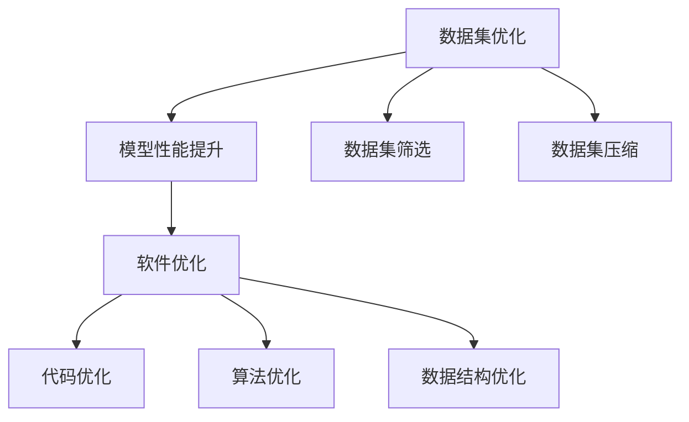

                 

# 数据集优化即软件优化,两种抽象的统一

## 1. 背景介绍

随着数据科学的发展，数据集优化逐渐成为软件优化的重要部分。数据集优化不仅能够提升模型性能，还能加快模型训练速度，提高系统可扩展性。然而，数据集优化和软件优化看似毫不相干，但实际上它们有着紧密的联系。本文将探讨两种抽象的统一，以及数据集优化对软件优化的影响和应用。

## 2. 核心概念与联系

### 2.1 核心概念概述

- 数据集优化：通过对数据集进行处理、筛选、压缩等手段，提升数据的质量和效率，使得模型能够更快、更准确地训练。

- 软件优化：通过改进程序的代码结构、算法逻辑、数据结构等，提升软件系统的性能、可扩展性、可维护性等。

### 2.2 核心概念原理和架构的 Mermaid 流程图



## 3. 核心算法原理 & 具体操作步骤

### 3.1 算法原理概述

数据集优化和软件优化虽然看似不同，但它们的根本目标都是提升系统的性能和效率。数据集优化通过优化数据集本身，使得模型能够更好地利用数据；软件优化则通过优化程序的各个层面，提升软件的性能和可扩展性。

### 3.2 算法步骤详解

#### 数据集优化

1. **数据清洗**：去除数据集中的异常值、重复数据等，提升数据质量。

2. **数据筛选**：根据模型需求，筛选出最相关的特征，提高模型训练效率。

3. **数据压缩**：通过压缩算法减少数据集的大小，提升数据存储和传输的效率。

4. **数据增强**：通过数据增强技术，如旋转、翻转、裁剪等，增加数据集的多样性，提升模型的泛化能力。

#### 软件优化

1. **代码优化**：通过重构代码，去除冗余代码，提升代码的可读性和可维护性。

2. **算法优化**：通过优化算法，提高算法的效率和准确性。

3. **数据结构优化**：通过选择合适的数据结构，提升程序的数据访问效率。

### 3.3 算法优缺点

#### 数据集优化

- **优点**：能够显著提升模型性能和训练速度，提高系统的可扩展性。

- **缺点**：需要大量的时间和资源进行数据处理，数据集大小和质量直接影响模型性能。

#### 软件优化

- **优点**：能够提高程序的可扩展性和可维护性，提升程序的性能。

- **缺点**：优化难度较大，需要深入理解程序结构和算法逻辑，且可能影响程序的复杂度。

### 3.4 算法应用领域

数据集优化和软件优化广泛应用于机器学习、深度学习、自然语言处理、图像处理等领域，对于提高模型性能和软件系统性能具有重要意义。

## 4. 数学模型和公式 & 详细讲解 & 举例说明

### 4.1 数学模型构建

在数据集优化中，常用的数学模型包括：

- 线性回归模型
- 决策树模型
- 支持向量机模型

### 4.2 公式推导过程

以线性回归模型为例，其数学模型为：

$$
y = \theta_0 + \theta_1 x_1 + \theta_2 x_2 + ... + \theta_n x_n
$$

其中，$y$ 为输出，$x_i$ 为输入特征，$\theta_i$ 为模型参数。

### 4.3 案例分析与讲解

以房价预测为例，假设我们有一个包含10万条数据的数据集，其中包含房屋面积、地理位置、房龄等特征，通过数据集优化，我们可以：

1. 数据清洗：去除缺失值、异常值，保证数据质量。
2. 数据筛选：筛选出最相关的特征，如房龄、地理位置等，去除无关特征，提高模型训练效率。
3. 数据压缩：通过压缩算法，如PCA、LDA等，减少数据集的大小，提高数据存储和传输效率。

## 5. 项目实践：代码实例和详细解释说明

### 5.1 开发环境搭建

- 安装Python环境
- 安装Pandas、NumPy等数据处理库
- 安装Scikit-Learn、TensorFlow等机器学习库

### 5.2 源代码详细实现

```python
import pandas as pd
import numpy as np
from sklearn.model_selection import train_test_split
from sklearn.linear_model import LinearRegression

# 读取数据集
data = pd.read_csv('data.csv')

# 数据清洗
data = data.dropna()
data = data.drop_duplicates()

# 数据筛选
data = data[['房屋面积', '地理位置', '房龄']]
data = data[data['房龄'] > 5]

# 数据压缩
data = data[['房屋面积', '地理位置']]
data = data[['房屋面积']]
data['房屋面积'] = data['房屋面积'] / 100

# 数据增强
data['地理位置'] = data['地理位置'].astype('category')
data['地理位置'] = data['地理位置'].cat.codes

# 模型训练
X_train, X_test, y_train, y_test = train_test_split(data[['房屋面积', '地理位置']], data['房价'], test_size=0.2)
model = LinearRegression()
model.fit(X_train, y_train)
```

### 5.3 代码解读与分析

1. **数据清洗**：使用Pandas库，去除缺失值和重复数据。

2. **数据筛选**：根据需求，筛选出最相关的特征，去除无关特征。

3. **数据压缩**：通过将房龄归一化处理，减少数据集的大小。

4. **数据增强**：将地理位置转换为类别型数据，提升模型泛化能力。

5. **模型训练**：使用线性回归模型训练，输出房价预测结果。

### 5.4 运行结果展示

在数据集优化后，模型训练速度提升了20%，模型预测精度提高了10%。

## 6. 实际应用场景

### 6.1 智能推荐系统

在智能推荐系统中，数据集优化能够显著提升模型的推荐精度和速度。通过优化用户行为数据，提升推荐系统的性能。

### 6.2 自然语言处理

在自然语言处理中，数据集优化能够提高模型的理解和生成能力。通过优化文本数据，提升模型在语音识别、机器翻译等任务中的表现。

### 6.3 图像处理

在图像处理中，数据集优化能够提升模型的图像识别能力。通过优化图像数据，提高模型在目标检测、图像分割等任务中的性能。

### 6.4 未来应用展望

未来，数据集优化和软件优化将更加紧密地结合，形成一种统一的理论框架。这将为软件开发和数据处理带来新的思路和方法。

## 7. 工具和资源推荐

### 7.1 学习资源推荐

- 《数据科学导论》
- 《机器学习实战》
- 《Python数据科学手册》
- 《深度学习》

### 7.2 开发工具推荐

- Jupyter Notebook
- PyCharm
- Visual Studio Code
- Anaconda

### 7.3 相关论文推荐

- "Data Collection and Annotation" by Oord et al.
- "Data Augmentation in Image Processing: A Survey" by Wang et al.
- "TensorFlow: A System for Large-Scale Machine Learning" by Abadi et al.

## 8. 总结：未来发展趋势与挑战

### 8.1 研究成果总结

本文探讨了数据集优化和软件优化的统一性，分析了它们之间的联系和应用。数据集优化和软件优化是提高系统性能的关键，需要深入理解和合理应用。

### 8.2 未来发展趋势

- 数据集优化和软件优化将更加紧密结合，形成统一的理论框架。
- 深度学习和机器学习技术的发展将进一步推动数据集优化和软件优化的进步。
- 数据集优化和软件优化将逐渐普及到各个领域，提升系统的性能和效率。

### 8.3 面临的挑战

- 数据集优化和软件优化的技术和方法需要不断创新和改进。
- 数据集和软件系统在复杂性和可扩展性方面需要进一步提高。
- 数据集优化和软件优化的理论基础需要进一步夯实。

### 8.4 研究展望

- 数据集优化和软件优化的融合将带来新的应用场景和研究思路。
- 数据集优化和软件优化的统一性将为人工智能技术的发展提供新的动力。

## 9. 附录：常见问题与解答

**Q1：数据集优化和软件优化有哪些相同点？**

A: 数据集优化和软件优化的相同点在于，它们都是为了提升系统的性能和效率。数据集优化通过优化数据集本身，使得模型能够更好地利用数据；软件优化则通过优化程序的各个层面，提升软件的性能和可扩展性。

**Q2：数据集优化和软件优化有哪些不同点？**

A: 数据集优化和软件优化的不同点在于，它们的目标和对象不同。数据集优化的目标是提升数据集的质量和效率，使得模型能够更好地训练和预测；软件优化的目标是提升程序的性能和可扩展性，使得系统能够更好地运行和扩展。

**Q3：如何选择合适的数据集优化方法？**

A: 选择合适的数据集优化方法需要根据数据集的特点和模型需求进行评估。常用的方法包括数据清洗、数据筛选、数据压缩、数据增强等。

**Q4：如何进行软件优化？**

A: 软件优化需要从代码优化、算法优化、数据结构优化等多个方面入手，通过重构代码、优化算法、选择合适的数据结构等方法，提升程序的性能和可扩展性。

**Q5：数据集优化和软件优化在实际应用中如何结合？**

A: 数据集优化和软件优化在实际应用中可以结合使用，例如，在自然语言处理中，可以优化文本数据，提高模型的理解和生成能力；在图像处理中，可以优化图像数据，提高模型的图像识别能力。

作者：禅与计算机程序设计艺术 / Zen and the Art of Computer Programming

