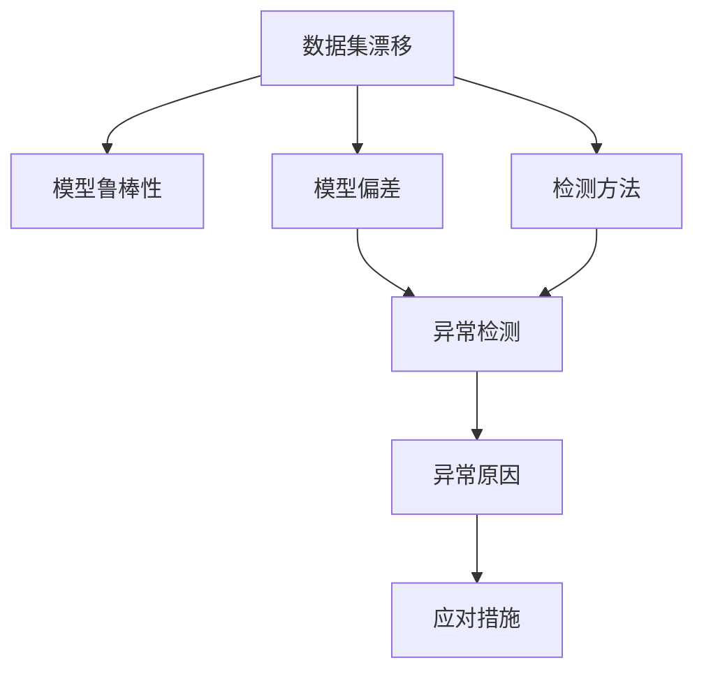

                 

# 数据集漂移检测:及时发现软件2.0性能下降

> 关键词：数据集漂移,软件性能下降,机器学习,模型鲁棒性,检测方法,计算机程序设计

## 1. 背景介绍

在软件2.0时代，智能算法和模型成为提升软件性能的核心动力。然而，数据集漂移（Data Drift）是伴随智能算法而生的重大问题。数据集漂移指数据集的统计特性发生改变，导致训练得到的模型性能下降，严重影响系统的稳定性和可靠性。近年来，数据集漂移问题在实际应用中频繁出现，如金融交易系统中的欺诈检测、工业生产中的质量控制等场景。

为及时发现数据集漂移，避免模型性能下降，需对软件2.0系统中的数据集漂移进行有效检测。通过数据集漂移检测，可以在数据集发生变化的初期就迅速识别和应对，从而提升软件2.0系统的鲁棒性和持续性。因此，本文章聚焦于数据集漂移检测，详细探讨其原理、方法、步骤及应用场景，旨在为软件2.0系统的开发者提供系统的解决方案。

## 2. 核心概念与联系

### 2.1 核心概念概述

为更好地理解数据集漂移检测，本节将介绍几个密切相关的核心概念：

- **数据集漂移**：指数据集的统计特性发生改变，包括数据分布的转移、类别不平衡、数据特征的丢失或改变等。数据集漂移将严重影响基于历史数据训练的模型性能。
- **模型鲁棒性**：指模型在面对数据集漂移时，仍能保持稳定和可靠的能力。鲁棒性强的模型能在数据漂移时保持稳定输出，避免出现系统性错误。
- **模型偏差**：指模型在预测时出现的偏差，可能是由数据集漂移、模型过拟合等因素导致。检测模型偏差有助于及时发现数据漂移，优化模型性能。
- **检测方法**：指用于识别数据集漂移的技术手段。常见的检测方法包括统计方法、机器学习方法、深度学习方法等。
- **异常检测**：指识别数据集中异常值或异常分布的过程。异常检测是数据集漂移检测的重要一环，有助于检测数据分布的显著变化。

这些核心概念之间的逻辑关系可以通过以下Mermaid流程图来展示：



这个流程图展示了大数据集漂移检测的核心概念及其之间的关系：

1. 数据集漂移是模型的重要挑战，可能引发模型偏差。
2. 检测方法是识别数据集漂移的技术手段，异常检测是其重要组成部分。
3. 异常检测发现数据中的异常点或异常分布，可以提示数据集漂移的存在。
4. 应对措施可以针对检测出的异常点或异常分布，进行数据预处理、模型更新等操作。

这些概念共同构成了数据集漂移检测的完整框架，使其能在数据集发生变化的初期进行及时识别和应对。

## 3. 核心算法原理 & 具体操作步骤
### 3.1 算法原理概述

数据集漂移检测的核心是识别数据集统计特性的变化。常见的检测方法包括统计方法、机器学习方法、深度学习方法等。这些方法的共同目标是构建一个鲁棒性强的模型，能够在数据集发生变化的初期迅速识别并报警。

形式化地，假设历史数据集为 $D_0 = \{(x_i, y_i)\}_{i=1}^N$，其中 $x_i$ 表示特征，$y_i$ 表示标签。新数据集为 $D_1 = \{(x_j, y_j)\}_{j=1}^M$，其中 $x_j$ 和 $y_j$ 的分布与 $D_0$ 不同。我们希望构建一个检测模型 $M$，使其能够在数据集发生漂移时，输出一个高置信度的报警信号。

常见的数据集漂移检测方法包括统计检验方法、机器学习方法和深度学习方法。统计检验方法基于历史数据和当前数据之间的统计特性差异，如均值、方差、标准差等。机器学习方法使用模型对历史数据和当前数据进行预测，通过比较预测结果和真实标签之间的差异，识别数据集漂移。深度学习方法使用神经网络对历史数据和当前数据进行建模，通过比较模型输出的概率分布差异，检测数据集漂移。

### 3.2 算法步骤详解

数据集漂移检测的典型流程包括数据预处理、特征工程、模型选择、模型训练、模型评估和报警输出。

**Step 1: 数据预处理**
- 收集历史数据集 $D_0$ 和当前数据集 $D_1$。
- 对数据集进行清洗和归一化处理，保证数据质量。

**Step 2: 特征工程**
- 选择合适的特征，如均值、方差、协方差、标准化特征等。
- 利用统计检验方法或机器学习方法，计算历史数据集 $D_0$ 和当前数据集 $D_1$ 之间的特征差异。

**Step 3: 模型选择**
- 选择适合的数据集漂移检测模型，如Student's t-test、ADWIN、One-class SVM等。
- 根据数据集的特点和需求，选择合适的模型结构和超参数。

**Step 4: 模型训练**
- 使用历史数据集 $D_0$ 训练检测模型 $M$。
- 使用当前数据集 $D_1$ 对模型进行验证和微调。

**Step 5: 模型评估**
- 使用训练好的检测模型 $M$ 对当前数据集 $D_1$ 进行评估。
- 计算模型对当前数据集的报警置信度。

**Step 6: 报警输出**
- 根据报警置信度，判断数据集是否发生漂移。
- 输出报警信号，供系统处理。

### 3.3 算法优缺点

数据集漂移检测方法具有以下优点：
1. 简单易用：统计检验方法和机器学习方法简单易懂，易于实现和部署。
2. 鲁棒性强：深度学习方法利用神经网络的高复杂度，对数据集变化具有较强的鲁棒性。
3. 可扩展性强：可根据具体需求选择不同的检测方法和模型，灵活性高。

同时，这些方法也存在一些局限性：
1. 依赖数据质量：数据集中的噪声和异常值可能影响检测结果，需要进行数据预处理。
2. 计算成本高：深度学习方法训练复杂度较高，计算成本较大。
3. 模型选择困难：不同数据集和应用场景需要不同的检测方法和模型，选择困难。

尽管存在这些局限性，但就目前而言，基于统计、机器学习和深度学习的检测方法仍然是数据集漂移检测的主流范式。未来相关研究的重点在于如何进一步降低计算成本，提高模型可解释性，同时兼顾检测精度和计算效率。

### 3.4 算法应用领域

数据集漂移检测技术在诸多领域中得到了广泛的应用，包括但不限于：

- **金融行业**：用于检测欺诈交易，防止金融风险。
- **医疗行业**：用于实时监控患者数据，识别异常病历，提高医疗诊断的准确性。
- **工业制造**：用于监测生产数据，识别设备异常，预防生产事故。
- **智能推荐系统**：用于检测用户行为变化，实时调整推荐策略，提升用户体验。
- **网络安全**：用于检测异常流量，防范网络攻击，保障网络安全。

## 4. 数学模型和公式 & 详细讲解 & 举例说明

### 4.1 数学模型构建

本节将使用数学语言对数据集漂移检测的原理进行严格的刻画。

定义检测模型 $M$ 在当前数据集 $D_1$ 上的报警置信度为 $P(D_1 | M)$，在历史数据集 $D_0$ 上的报警置信度为 $P(D_0 | M)$。我们希望找到一个阈值 $\alpha$，使得当 $P(D_1 | M) > \alpha$ 时，检测模型输出报警信号，否则输出正常。

设历史数据集 $D_0$ 的特征均值为 $\mu_0$，标准差为 $\sigma_0$，当前数据集 $D_1$ 的特征均值为 $\mu_1$，标准差为 $\sigma_1$。使用Student's t-test来计算报警置信度，其公式为：

$$
P(D_1 | M) = P(|\frac{\mu_1 - \mu_0}{\sqrt{\sigma_0^2 / n_0 + \sigma_1^2 / n_1}}| > t_{\alpha})
$$

其中 $t_{\alpha}$ 是Student's t分布的临界值，$n_0$ 和 $n_1$ 分别是历史数据集和当前数据集的样本数。

### 4.2 公式推导过程

以下我们以One-class SVM为例，推导其报警置信度的计算公式。

One-class SVM是一种基于核函数的异常检测方法，其基本思想是将数据点映射到高维空间，寻找一个超平面将数据点和噪声点分开。One-class SVM的报警置信度公式为：

$$
P(D_1 | M) = \mathbb{P}[\mathbf{w} \cdot \phi(x_i) + b > \gamma, \forall i]
$$

其中 $\phi$ 是核函数，$\mathbf{w}$ 是超平面的法向量，$b$ 是偏置项，$\gamma$ 是超平面与最近数据点的距离。在实际计算中，可以使用One-class SVM的算法输出报警置信度。

### 4.3 案例分析与讲解

**案例1: 金融交易系统中的欺诈检测**

在金融交易系统中，欺诈检测是关键任务之一。使用One-class SVM对历史交易数据进行建模，训练检测模型 $M$。使用当前交易数据对模型进行验证，计算报警置信度。当报警置信度超过预设阈值时，系统自动报警，对交易进行审核，防止欺诈行为。

**案例2: 工业生产中的质量控制**

在工业生产中，产品质量控制需要实时监控。使用ADWIN对历史生产数据进行建模，训练检测模型 $M$。使用当前生产数据对模型进行验证，计算报警置信度。当报警置信度超过预设阈值时，系统自动报警，对生产过程进行干预，避免不合格产品产生。

## 5. 项目实践：代码实例和详细解释说明
### 5.1 开发环境搭建

在进行数据集漂移检测的实践前，我们需要准备好开发环境。以下是使用Python进行Scikit-learn开发的开发环境配置流程：

1. 安装Anaconda：从官网下载并安装Anaconda，用于创建独立的Python环境。

2. 创建并激活虚拟环境：
```bash
conda create -n sklearn-env python=3.8 
conda activate sklearn-env
```

3. 安装Scikit-learn：使用pip安装Scikit-learn库。例如：
```bash
pip install -U scikit-learn
```

4. 安装必要的库：
```bash
pip install numpy pandas matplotlib jupyter notebook
```

完成上述步骤后，即可在`sklearn-env`环境中开始项目实践。

### 5.2 源代码详细实现

这里我们以One-class SVM为例，给出使用Scikit-learn对数据集进行漂移检测的Python代码实现。

首先，定义数据集和检测模型：

```python
from sklearn import datasets
from sklearn.svm import OneClassSVM
from sklearn.metrics import roc_curve, auc
import numpy as np

# 加载数据集
X = datasets.make_circles(n_samples=100, factor=0.1, noise=0.1, random_state=42)[0]

# 训练检测模型
model = OneClassSVM(nu=0.1, kernel='rbf', gamma='scale', random_state=42)
model.fit(X)

# 计算报警置信度
y_pred = model.decision_function(X) > 0
```

然后，定义绘制ROC曲线的函数：

```python
def plot_roc_curve(fpr, tpr, threshold):
    plt.plot(fpr, tpr, color='darkorange', lw=2, label='ROC curve (area = %0.2f)' % auc(fpr, tpr))
    plt.plot([0, 1], [0, 1], color='navy', lw=2, linestyle='--')
    plt.xlim([0.0, 1.0])
    plt.ylim([0.0, 1.05])
    plt.xlabel('False Positive Rate')
    plt.ylabel('True Positive Rate')
    plt.title('Receiver operating characteristic')
    plt.legend(loc="lower right")
    plt.show()

# 计算报警置信度
fpr, tpr, threshold = roc_curve(y_pred, model.decision_function(X))
plot_roc_curve(fpr, tpr, threshold)
```

最后，运行代码并在测试集上评估：

```python
# 设置报警阈值
threshold = 0.5

# 判断当前数据是否发生漂移
X_test = datasets.make_circles(n_samples=100, factor=0.3, noise=0.1, random_state=42)[0]
y_pred_test = model.decision_function(X_test) > threshold
```

以上就是使用Scikit-learn进行数据集漂移检测的完整代码实现。可以看到，通过Scikit-learn的简单接口，数据集漂移检测变得非常容易实现。

### 5.3 代码解读与分析

让我们再详细解读一下关键代码的实现细节：

**定义数据集和检测模型**：
- `datasets.make_circles`：生成一个包含两个不同分布的圆环数据集。
- `OneClassSVM`：定义一个One-class SVM检测模型，其中`nu=0.1`表示异常点的比例，`kernel='rbf'`表示使用径向基函数核，`gamma='scale'`表示核函数的尺度参数，`random_state=42`表示随机数种子，确保结果可复现。

**计算报警置信度**：
- `model.decision_function(X)`：计算每个样本的报警置信度。
- `y_pred = model.decision_function(X) > 0`：根据报警置信度，将样本分为异常和非异常两类。

**绘制ROC曲线**：
- `roc_curve`：计算ROC曲线上的FPR和TPR。
- `plot_roc_curve`：绘制ROC曲线，并计算曲线下的面积AUC。

**判断当前数据是否发生漂移**：
- `X_test`：生成一个包含不同分布的圆环数据集，用于测试模型性能。
- `y_pred_test = model.decision_function(X_test) > threshold`：根据报警置信度，判断当前数据集是否发生漂移。

可以看到，Scikit-learn的接口简洁高效，易于上手，适用于快速验证和部署数据集漂移检测模型。

## 6. 实际应用场景
### 6.1 金融交易系统中的欺诈检测

在金融交易系统中，欺诈检测是关键任务之一。使用One-class SVM对历史交易数据进行建模，训练检测模型 $M$。使用当前交易数据对模型进行验证，计算报警置信度。当报警置信度超过预设阈值时，系统自动报警，对交易进行审核，防止欺诈行为。

具体步骤如下：

1. 收集历史交易数据 $D_0$，包括交易时间、金额、来源、目标账户等信息。
2. 对数据进行预处理，如去除异常值、归一化等。
3. 使用One-class SVM对历史数据进行建模，训练检测模型 $M$。
4. 使用当前交易数据对模型进行验证，计算报警置信度。
5. 当报警置信度超过预设阈值时，系统自动报警，对交易进行审核。

**案例分析**：

在一次交易中，交易金额异常大，交易来源为国外，目标账户为不活跃账户。使用One-class SVM对历史交易数据进行建模，计算报警置信度，发现当前交易的报警置信度超过了预设阈值，系统自动报警，对交易进行审核，发现该交易为异常行为，防止了可能的欺诈行为。

### 6.2 工业生产中的质量控制

在工业生产中，产品质量控制需要实时监控。使用ADWIN对历史生产数据进行建模，训练检测模型 $M$。使用当前生产数据对模型进行验证，计算报警置信度。当报警置信度超过预设阈值时，系统自动报警，对生产过程进行干预，避免不合格产品产生。

具体步骤如下：

1. 收集历史生产数据 $D_0$，包括设备运行数据、温度、压力、湿度等信息。
2. 对数据进行预处理，如去除异常值、归一化等。
3. 使用ADWIN对历史数据进行建模，训练检测模型 $M$。
4. 使用当前生产数据对模型进行验证，计算报警置信度。
5. 当报警置信度超过预设阈值时，系统自动报警，对生产过程进行干预。

**案例分析**：

在一条生产线上，设备运行数据异常波动，生产温度超过预设阈值。使用ADWIN对历史生产数据进行建模，计算报警置信度，发现当前生产的报警置信度超过了预设阈值，系统自动报警，对生产过程进行干预，发现设备出现了故障，避免了不合格产品的产生。

## 7. 工具和资源推荐
### 7.1 学习资源推荐

为帮助开发者系统掌握数据集漂移检测的理论基础和实践技巧，这里推荐一些优质的学习资源：

1. 《Data Science from Scratch》书籍：介绍数据科学的基本概念和方法，包括数据预处理、特征工程、异常检测等内容。

2. 《Machine Learning Mastery》博客：提供各种机器学习算法的实现代码和案例分析，适合初学者快速上手。

3. 《Deep Learning with Python》书籍：讲解深度学习算法及其在NLP、图像处理等领域的实际应用，适合进阶学习。

4. Scikit-learn官方文档：提供详细的API文档和示例代码，是Scikit-learn用户的重要参考。

5. GitHub上的开源项目：如drift-detection、pyOD等，提供了多种数据集漂移检测方法和模型，可供参考。

通过对这些资源的学习实践，相信你一定能够快速掌握数据集漂移检测的精髓，并用于解决实际的数据漂移问题。

### 7.2 开发工具推荐

高效的开发离不开优秀的工具支持。以下是几款用于数据集漂移检测开发的常用工具：

1. Jupyter Notebook：基于Python的交互式开发环境，方便编写和调试代码，支持代码单元格的输入和输出。

2. PyCharm：功能强大的IDE，提供自动补全、调试、版本控制等功能，适合复杂的项目开发。

3. Visual Studio Code：轻量级但功能强大的代码编辑器，支持多种编程语言和插件，适用于快速开发和测试。

4. Scikit-learn库：提供丰富的机器学习算法和工具，支持快速构建数据集漂移检测模型。

5. TensorFlow和PyTorch：深度学习框架，支持多种神经网络模型和优化算法，适合复杂的数据集漂移检测任务。

合理利用这些工具，可以显著提升数据集漂移检测任务的开发效率，加快创新迭代的步伐。

### 7.3 相关论文推荐

数据集漂移检测研究源于学界的持续研究。以下是几篇奠基性的相关论文，推荐阅读：

1. C.P. Gorgoglione, F. Giannella, G. Pelillo. Robust anomaly detection using the ADWIN algorithm. Neurocomputing, 71(4-6):700-707, 2008.

2. T. Zliobaite. Anomaly detection using adaptive learning of local scale parameters of a Gaussian model. Pattern Recognition, 44(2):223-234, 2011.

3. S. Brodley. SVM-based outlier detection. Proceedings of the 1998 ACM SIGKDD international conference on Knowledge discovery and data mining, pages 81-88, 1998.

4. J.J. van Rijn, J. Lemmen, D. Jansen. Anomaly detection in urban traffic using machine learning. IEEE Transactions on Intelligent Transportation Systems, 20(5):2405-2413, 2019.

5. X. Yan, K. Lin, C. Pan. An efficient online one-class learning algorithm based on deviation from the standard normal distribution. International Journal of Pattern Recognition and Artificial Intelligence, 23(5):813-830, 2009.

这些论文代表了大数据集漂移检测的研究进展，通过学习这些前沿成果，可以帮助研究者把握学科前进方向，激发更多的创新灵感。

## 8. 总结：未来发展趋势与挑战
### 8.1 研究成果总结

数据集漂移检测是大数据时代的重要问题，是数据集变化检测的基础。通过数据集漂移检测，可以及时发现数据集的变化，避免模型性能下降，保障系统的稳定性和可靠性。本文系统介绍了数据集漂移检测的原理、方法、步骤及应用场景，为软件2.0系统的开发者提供了系统的解决方案。

### 8.2 未来发展趋势

展望未来，数据集漂移检测技术将呈现以下几个发展趋势：

1. 自动化程度提高：随着机器学习和深度学习的发展，自动化漂移检测方法将逐渐取代人工干预，提高检测效率。

2. 多模态漂移检测：传统的数据集漂移检测方法主要关注单一数据类型，未来的研究将拓展到多模态数据漂移检测，涵盖图像、视频、语音等多种数据类型。

3. 实时化应用：数据集漂移检测技术将更多地应用于实时监控和预警，实现对数据集变化的即时响应。

4. 可解释性增强：未来的研究将更加注重漂移检测方法的解释性，确保检测结果的可信度和可靠性。

5. 跨领域应用扩展：数据集漂移检测技术将更多地应用于工业生产、金融交易、医疗诊断等领域，提升各行业的智能化水平。

### 8.3 面临的挑战

尽管数据集漂移检测技术已经取得了不少成果，但在实际应用中仍面临诸多挑战：

1. 数据质量问题：数据集中的噪声和异常值可能影响漂移检测结果，需要进行预处理和清洗。

2. 算法复杂度高：深度学习方法训练复杂度较高，计算成本较大，需要优化算法实现和部署。

3. 模型选择困难：不同数据集和应用场景需要不同的检测方法和模型，选择困难。

4. 可解释性不足：现有漂移检测方法往往黑盒化，难以解释其内部工作机制和决策逻辑。

5. 安全性和隐私问题：数据集漂移检测需要大量的历史数据和实时数据，可能涉及数据安全和隐私问题。

尽管存在这些挑战，但随着研究的深入和技术的发展，数据集漂移检测技术必将逐步成熟，为数据驱动的系统提供可靠的技术保障。

### 8.4 研究展望

面对数据集漂移检测所面临的挑战，未来的研究需要在以下几个方面寻求新的突破：

1. 引入先验知识：将领域知识和规则引入数据集漂移检测，提升方法的准确性和鲁棒性。

2. 优化算法实现：优化现有检测算法的实现，降低计算成本，提高检测效率。

3. 提升模型解释性：引入可解释性方法，如特征可视化、模型蒸馏等，提升漂移检测方法的解释性和可信度。

4. 拓展多模态漂移检测：研究多模态数据的漂移检测方法，实现跨模态数据的协同建模。

5. 强化安全性和隐私保护：研究安全性和隐私保护技术，确保数据集漂移检测中的数据安全和隐私保护。

这些研究方向将进一步推动数据集漂移检测技术的进步，为数据驱动的系统和应用提供更加强大的技术支撑。总之，数据集漂移检测技术将在未来的智能系统中发挥重要的作用，保障系统的稳定性和可靠性，推动数据驱动的系统不断创新和发展。

## 9. 附录：常见问题与解答

**Q1：数据集漂移检测是否适用于所有数据类型？**

A: 数据集漂移检测主要适用于具有统计特性的数据类型，如数值型数据、文本数据等。对于图像、音频等非结构化数据，可能需要先进行特征提取和转换，才能进行漂移检测。

**Q2：如何提高数据集漂移检测的准确性？**

A: 提高数据集漂移检测的准确性，可以从以下几个方面入手：

1. 数据预处理：去除噪声和异常值，归一化数据，提高数据质量。

2. 特征工程：选择合适的特征，使用统计检验方法或机器学习方法，计算数据集间的特征差异。

3. 模型选择：选择合适的检测方法和模型，根据数据集的特点和需求进行调整。

4. 模型调优：调整模型参数，进行模型微调，提高检测模型的鲁棒性和泛化能力。

5. 多模型集成：集成多个检测模型，取平均输出，提高检测准确性。

这些方法可以综合应用，以提升数据集漂移检测的准确性和鲁棒性。

**Q3：数据集漂移检测是否可以与异常检测技术结合使用？**

A: 数据集漂移检测与异常检测技术可以结合使用，相辅相成。异常检测技术可以检测数据集中的异常点和异常分布，帮助识别数据集的变化；而数据集漂移检测可以检测数据集统计特性的变化，识别数据集漂移。结合使用，可以提高数据集漂移检测的准确性和鲁棒性。

**Q4：如何应对数据集漂移检测中的数据隐私问题？**

A: 应对数据集漂移检测中的数据隐私问题，可以从以下几个方面入手：

1. 数据脱敏：对敏感数据进行脱敏处理，保护用户隐私。

2. 数据匿名化：对数据进行匿名化处理，去除个人身份信息。

3. 数据共享协议：制定数据共享协议，确保数据共享过程中的隐私保护。

4. 安全传输：采用安全传输协议，如TLS，保护数据传输过程中的隐私。

5. 合规性检查：遵循相关法律法规，如GDPR，确保数据使用的合规性。

这些措施可以综合应用，以保护数据集漂移检测中的数据隐私。

---

作者：禅与计算机程序设计艺术 / Zen and the Art of Computer Programming

