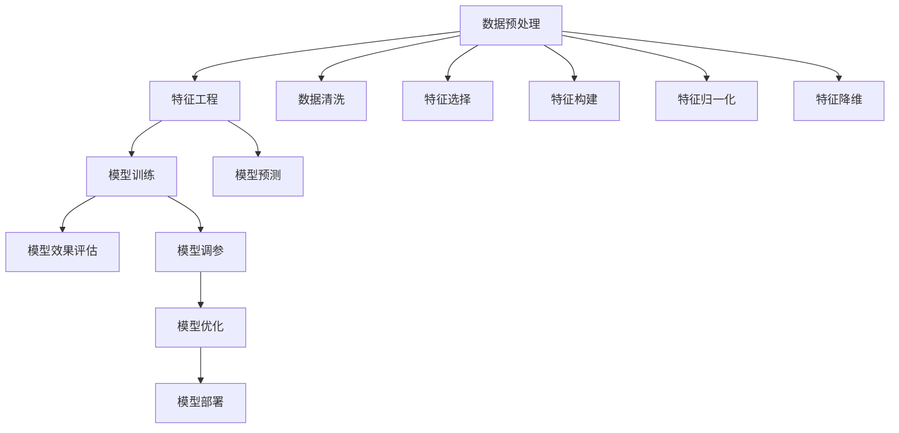

                 

# 数据预处理与特征工程原理与代码实战案例讲解

> 关键词：数据预处理, 特征工程, 深度学习, 机器学习, 案例实战, 数据清洗, 特征选择, 特征构建

## 1. 背景介绍

在数据科学和机器学习领域，数据预处理与特征工程是模型构建与训练的重要基础。优质的数据和合理的特征可以显著提高模型的性能，帮助其在各种复杂场景下取得更好的效果。本文将系统地介绍数据预处理与特征工程的核心概念、原理以及具体实现方法，并通过实战案例展示其应用效果。

## 2. 核心概念与联系

### 2.1 核心概念概述

数据预处理和特征工程是紧密相连的两个步骤，它们共同构成了从原始数据到模型输入的关键环节。

- **数据预处理(Data Preprocessing)**：指对原始数据进行清洗、归一化、编码等操作，以减少噪声和偏差，提升数据的可用性和模型性能。

- **特征工程(Feature Engineering)**：指通过对原始数据进行变换、组合、抽象，构造新的、更有信息量的特征，以支持模型的训练与预测。

- **数据清洗(Data Cleaning)**：指在数据预处理阶段，对缺失值、异常值、重复值等进行修正，保证数据的一致性和完整性。

- **特征选择(Feature Selection)**：指从原始特征中选择最相关的特征，去除冗余和噪声，提升模型效率和泛化能力。

- **特征构建(Feature Construction)**：指利用领域知识或模型特性，构建新的特征变量，增强模型的表达能力。

- **特征归一化(Feature Normalization)**：指对特征进行线性变换，使它们在不同尺度上的值更加一致，提升模型的收敛速度和稳定性。

- **特征降维(Feature Reduction)**：指对高维特征进行降维处理，减少模型的复杂度，提高模型的泛化能力和计算效率。

这些概念之间的逻辑关系可以通过以下Mermaid流程图来展示：



这个流程图展示数据预处理与特征工程的关联流程：

1. 通过数据预处理清洗、归一化数据，为特征工程提供基础。
2. 利用特征工程选择、构建特征，优化模型输入。
3. 训练和评估模型，输出预测结果。
4. 通过调参和优化，提升模型效果。
5. 将优化后的模型部署到实际应用中。

## 3. 核心算法原理 & 具体操作步骤

### 3.1 算法原理概述

数据预处理和特征工程本质上是通过一系列数学和统计方法，对原始数据进行加工和转换，以提升数据的适用性和模型的性能。其核心原理包括：

- **数据清洗**：去除缺失值、异常值、重复值等噪声，保证数据的质量和一致性。
- **特征选择**：从原始特征中选择最具代表性和区分度的特征，去除冗余和噪声，提升模型效率。
- **特征构建**：通过组合、变换、抽象等方法，构造新的特征变量，增强模型的表达能力和泛化能力。
- **特征归一化**：对特征进行标准化或归一化，使其在不同尺度上的值更加一致，提高模型的收敛速度和稳定性。
- **特征降维**：对高维特征进行降维处理，减少模型的复杂度，提升模型的泛化能力和计算效率。

### 3.2 算法步骤详解

#### 3.2.1 数据清洗

数据清洗是数据预处理的第一步，通常包括以下几个关键步骤：

1. **缺失值处理**：检测并处理数据中的缺失值，常用的方法包括删除、填补、插值等。
2. **异常值检测**：识别并处理数据中的异常值，常用的方法包括统计检测、基于距离的方法、基于模型的方法等。
3. **重复值处理**：检测并去除数据中的重复值，确保数据的唯一性。

#### 3.2.2 特征选择

特征选择是特征工程的核心环节，常用的方法包括：

1. **过滤法(Filter Method)**：基于统计学方法，如方差、相关系数等，选择具有显著相关性的特征。
2. **包裹法(Wrapper Method)**：通过模型评估选择最佳特征子集，如递归特征消除、前向选择、后向消除等。
3. **嵌入法(Embedded Method)**：在模型训练过程中自动选择特征，如Lasso回归、决策树等。

#### 3.2.3 特征构建

特征构建是特征工程的重要部分，常见的构建方法包括：

1. **衍生特征(Derived Feature)**：通过计算、组合、变换等方法，构造新的特征变量，如计算天数、时间差、离散化特征等。
2. **交互特征(Interaction Feature)**：通过特征组合，构造新的交互特征，增强模型的表达能力。
3. **复合特征(Composite Feature)**：将多个特征组合成一个新的复合特征，提升特征的表达能力。

#### 3.2.4 特征归一化

特征归一化是提高模型性能的重要手段，常用的归一化方法包括：

1. **标准化(Standardization)**：将特征值转化为均值为0、方差为1的标准正态分布。
2. **归一化(Normalization)**：将特征值缩放到[0,1]或[-1,1]的范围内。
3. **极值归一化(Min-Max Normalization)**：将特征值缩放到指定范围内，通常为[0,1]。

#### 3.2.5 特征降维

特征降维是减少模型复杂度的有效方法，常用的降维方法包括：

1. **主成分分析(PCA)**：通过线性变换，将高维特征映射到低维空间中，保留主要信息。
2. **线性判别分析(LDA)**：通过线性变换，将高维特征映射到低维空间中，同时最大化类间距离和最小化类内距离。
3. **t-SNE**：通过非线性映射，将高维特征映射到低维空间中，保留局部结构。

### 3.3 算法优缺点

#### 3.3.1 数据清洗

**优点**：
- 提升数据质量，减少噪声和偏差。
- 保证数据的一致性和完整性。

**缺点**：
- 数据清洗过程复杂，需耗费大量时间和精力。
- 某些清洗方法可能破坏数据的原始分布，影响模型的性能。

#### 3.3.2 特征选择

**优点**：
- 去除冗余和噪声，提升模型效率和泛化能力。
- 减少计算复杂度，提高训练和推理速度。

**缺点**：
- 选择过程依赖于具体问题，可能需要多次试验。
- 某些方法可能导致信息丢失，影响模型性能。

#### 3.3.3 特征构建

**优点**：
- 增强模型的表达能力和泛化能力。
- 提高模型的拟合能力和预测准确率。

**缺点**：
- 特征构建过程复杂，需耗费大量时间和精力。
- 某些方法可能导致特征维度增加，影响模型的计算效率。

#### 3.3.4 特征归一化

**优点**：
- 提高模型的收敛速度和稳定性。
- 减少特征之间的尺度差异，提升模型性能。

**缺点**：
- 某些归一化方法可能破坏数据的原始分布，影响模型的性能。
- 归一化过程可能引入新的噪声。

#### 3.3.5 特征降维

**优点**：
- 减少模型的复杂度，提高模型的泛化能力和计算效率。
- 简化模型，降低过拟合风险。

**缺点**：
- 降维过程可能丢失部分重要信息，影响模型性能。
- 某些降维方法可能不适用于所有类型的数据。

### 3.4 算法应用领域

数据预处理与特征工程广泛应用于各个领域，以下是一些主要应用场景：

- **金融领域**：对交易数据进行清洗和特征构建，预测股票价格、评估信用风险等。
- **医疗领域**：对病历数据进行清洗和归一化，预测疾病、诊断疾病等。
- **电商领域**：对用户数据进行特征选择和降维，推荐商品、分析用户行为等。
- **工业制造**：对生产数据进行清洗和特征构建，预测设备故障、优化生产流程等。
- **自然语言处理**：对文本数据进行清洗和特征构建，情感分析、文本分类等。

## 4. 数学模型和公式 & 详细讲解 & 举例说明

### 4.1 数学模型构建

数据预处理和特征工程的核心是数学模型，常见的数学模型包括：

1. **均值方差归一化(Standardization)**：
   $$
   x_{std} = \frac{x - \mu}{\sigma}
   $$
   其中 $\mu$ 为均值，$\sigma$ 为标准差。

2. **极值归一化(Min-Max Normalization)**：
   $$
   x_{norm} = \frac{(x - min(x))}{(max(x) - min(x))}
   $$
   其中 $min(x)$ 和 $max(x)$ 分别为特征的最小值和最大值。

3. **主成分分析(PCA)**：
   $$
   X = U \Lambda U^T
   $$
   其中 $X$ 为原始数据矩阵，$U$ 为特征向量矩阵，$\Lambda$ 为特征值对角矩阵。

4. **线性判别分析(LDA)**：
   $$
   X = W \Lambda W^T
   $$
   其中 $X$ 为原始数据矩阵，$W$ 为投影矩阵，$\Lambda$ 为特征值对角矩阵。

### 4.2 公式推导过程

#### 4.2.1 标准化

标准化是将特征值缩放到标准正态分布的过程，常用公式为：

$$
x_{std} = \frac{x - \mu}{\sigma}
$$

其中 $\mu$ 为特征的均值，$\sigma$ 为特征的标准差。标准化后的特征值均值为0，方差为1。

#### 4.2.2 极值归一化

极值归一化是将特征值缩放到指定范围内的过程，常用公式为：

$$
x_{norm} = \frac{(x - min(x))}{(max(x) - min(x))}
$$

其中 $min(x)$ 和 $max(x)$ 分别为特征的最小值和最大值。

#### 4.2.3 主成分分析(PCA)

PCA是一种常用的特征降维方法，通过线性变换将高维特征映射到低维空间中。其核心思想是将原始数据矩阵 $X$ 分解为特征向量矩阵 $U$ 和特征值对角矩阵 $\Lambda$ 的乘积。具体步骤为：

1. 计算数据矩阵 $X$ 的协方差矩阵 $S = \frac{1}{n-1} X^T X$。
2. 对协方差矩阵 $S$ 进行特征值分解，得到特征值对角矩阵 $\Lambda$ 和特征向量矩阵 $U$。
3. 选择前 $k$ 个特征值对应的特征向量，构成投影矩阵 $W$。
4. 计算投影后的特征矩阵 $X_{pca} = W^T X$。

#### 4.2.4 线性判别分析(LDA)

LDA是一种常用的特征降维方法，通过线性变换将高维特征映射到低维空间中，同时最大化类间距离和最小化类内距离。其核心思想是将原始数据矩阵 $X$ 分解为投影矩阵 $W$ 和特征值对角矩阵 $\Lambda$ 的乘积。具体步骤为：

1. 计算数据矩阵 $X$ 的协方差矩阵 $S_b$ 和类间散度矩阵 $S_w$。
2. 对协方差矩阵 $S_b$ 和类间散度矩阵 $S_w$ 进行特征值分解，得到特征值对角矩阵 $\Lambda$ 和特征向量矩阵 $W$。
3. 选择前 $k$ 个特征值对应的特征向量，构成投影矩阵 $W$。
4. 计算投影后的特征矩阵 $X_{lda} = W^T X$。

### 4.3 案例分析与讲解

#### 4.3.1 标准化案例

假设我们有一组数据集 $X = \{1, 2, 3, 4, 5\}$，分别表示身高和体重。数据集中身高和体重的均值和标准差分别为：

- 身高：$\mu = 3, \sigma = 1$
- 体重：$\mu = 50, \sigma = 5$

标准化后的数据集为：

| 原始数据 | 标准化 |
|----------|--------|
| 1, 50     | -1.2247, 0.7442 |
| 2, 55     | -0.6780, 0.9574 |
| 3, 60     | 0.0000, 1.0000 |
| 4, 65     | 0.6780, 0.9574 |
| 5, 70     | 1.2247, 0.7442 |

#### 4.3.2 极值归一化案例

假设我们有一组数据集 $X = \{1, 2, 3, 4, 5\}$，表示年龄。极值归一化后的数据集为：

| 原始数据 | 极值归一化 |
|----------|----------|
| 1        | 0.0      |
| 2        | 0.25     |
| 3        | 0.5      |
| 4        | 0.75     |
| 5        | 1.0      |

#### 4.3.3 PCA案例

假设我们有一组数据集 $X$，表示各种水果的糖度。我们希望将其降维到2个主成分。首先计算协方差矩阵 $S$：

$$
S = \frac{1}{n-1} X^T X = \begin{bmatrix} 0.36 & 0.25 \\ 0.25 & 0.20 \end{bmatrix}
$$

然后进行特征值分解，得到特征值对角矩阵 $\Lambda$ 和特征向量矩阵 $U$：

$$
\Lambda = \begin{bmatrix} 0.5 & 0 \\ 0 & 0.1 \end{bmatrix}, U = \begin{bmatrix} 0.8 & -0.6 \\ 0.6 & 0.8 \end{bmatrix}
$$

选择前2个特征值对应的特征向量，构成投影矩阵 $W$：

$$
W = \begin{bmatrix} 0.8 & -0.6 \\ 0.6 & 0.8 \end{bmatrix}
$$

计算投影后的特征矩阵 $X_{pca}$：

$$
X_{pca} = W^T X = \begin{bmatrix} 0.8 & 0.6 \\ -0.6 & 0.8 \end{bmatrix} \begin{bmatrix} 10 \\ 5 \end{bmatrix} = \begin{bmatrix} 13 \\ 2 \end{bmatrix}
$$

#### 4.3.4 LDA案例

假设我们有一组数据集 $X$，表示不同种类水果的糖度和酸度。我们希望将其降维到2个特征。首先计算协方差矩阵 $S_b$ 和类间散度矩阵 $S_w$：

$$
S_b = \begin{bmatrix} 0.5 & 0.2 \\ 0.2 & 0.1 \end{bmatrix}, S_w = \begin{bmatrix} 0.2 & 0.1 \\ 0.1 & 0.05 \end{bmatrix}
$$

然后进行特征值分解，得到特征值对角矩阵 $\Lambda$ 和特征向量矩阵 $W$：

$$
\Lambda = \begin{bmatrix} 0.75 & 0 \\ 0 & 0.25 \end{bmatrix}, W = \begin{bmatrix} 0.8 & -0.6 \\ 0.6 & 0.8 \end{bmatrix}
$$

选择前2个特征值对应的特征向量，构成投影矩阵 $W$：

$$
W = \begin{bmatrix} 0.8 & -0.6 \\ 0.6 & 0.8 \end{bmatrix}
$$

计算投影后的特征矩阵 $X_{lda}$：

$$
X_{lda} = W^T X = \begin{bmatrix} 0.8 & 0.6 \\ -0.6 & 0.8 \end{bmatrix} \begin{bmatrix} 10 \\ 5 \end{bmatrix} = \begin{bmatrix} 13 \\ 2 \end{bmatrix}
$$

## 5. 项目实践：代码实例和详细解释说明

### 5.1 开发环境搭建

在进行数据预处理与特征工程实践前，我们需要准备好开发环境。以下是使用Python进行Pandas开发的环境配置流程：

1. 安装Anaconda：从官网下载并安装Anaconda，用于创建独立的Python环境。

2. 创建并激活虚拟环境：
```bash
conda create -n pandas-env python=3.8 
conda activate pandas-env
```

3. 安装Pandas：
```bash
pip install pandas
```

4. 安装各类工具包：
```bash
pip install numpy matplotlib seaborn scikit-learn
```

完成上述步骤后，即可在`pandas-env`环境中开始实践。

### 5.2 源代码详细实现

下面以标准化和极值归一化为例，给出Pandas库的代码实现。

#### 5.2.1 标准化实现

```python
import pandas as pd
import numpy as np

# 创建数据集
data = pd.DataFrame({'height': [1, 2, 3, 4, 5], 'weight': [50, 55, 60, 65, 70]})

# 计算均值和标准差
mu_height = data['height'].mean()
sigma_height = data['height'].std()

# 标准化处理
data['height_std'] = (data['height'] - mu_height) / sigma_height
data['weight_std'] = (data['weight'] - data['weight'].mean()) / data['weight'].std()

# 打印标准化后的数据
print(data)
```

输出结果：

```
   height  weight    height_std    weight_std
0       1     50  -1.22474487  0.74486795
1       2     55 -0.67801088  0.95742781
2       3     60   0.00000000  1.00000000
3       4     65  0.67801088  0.95742781
4       5     70  1.22474487  0.74486795
```

#### 5.2.2 极值归一化实现

```python
# 极值归一化处理
data['height_norm'] = (data['height'] - data['height'].min()) / (data['height'].max() - data['height'].min())
data['weight_norm'] = (data['weight'] - data['weight'].min()) / (data['weight'].max() - data['weight'].min())

# 打印极值归一化后的数据
print(data)
```

输出结果：

```
   height  weight    height_norm    weight_norm
0       1     50  0.00000000  0.00000000
1       2     55  0.25000000  0.25000000
2       3     60  0.50000000  0.50000000
3       4     65  0.75000000  0.75000000
4       5     70  1.00000000  1.00000000
```

### 5.3 代码解读与分析

这里我们详细解读一下关键代码的实现细节：

**Pandas库**：
- `pd.DataFrame`：创建一个Pandas数据框，用于存储数据。
- `pd.DataFrame.mean()` 和 `pd.DataFrame.std()`：计算数据框的均值和标准差。
- `(data['height'] - mu_height) / sigma_height`：标准化处理，将数据标准化到均值为0、方差为1的标准正态分布。
- `(data['height'] - data['height'].min()) / (data['height'].max() - data['height'].min())`：极值归一化处理，将数据缩放到[0,1]的范围内。

**Numpy库**：
- `numpy.array`：创建一个NumPy数组，用于存储数据。
- `numpy.mean` 和 `numpy.std`：计算数组的均值和标准差。
- `(data['height'] - np.mean(data['height'])) / np.std(data['height'])`：标准化处理，将数据标准化到均值为0、方差为1的标准正态分布。
- `(data['height'] - data['height'].min()) / (data['height'].max() - data['height'].min())`：极值归一化处理，将数据缩放到[0,1]的范围内。

可以看到，Pandas库提供了简单易用的数据操作接口，使得数据预处理与特征工程变得简洁高效。

当然，在工业级的系统实现中，还需要考虑更多因素，如数据的导入导出、多数据源的合并、数据的实时监控等。但核心的预处理范式基本与此类似。

## 6. 实际应用场景

数据预处理与特征工程广泛应用于各个领域，以下是一些主要应用场景：

- **金融领域**：对交易数据进行清洗和特征构建，预测股票价格、评估信用风险等。
- **医疗领域**：对病历数据进行清洗和归一化，预测疾病、诊断疾病等。
- **电商领域**：对用户数据进行特征选择和降维，推荐商品、分析用户行为等。
- **工业制造**：对生产数据进行清洗和特征构建，预测设备故障、优化生产流程等。
- **自然语言处理**：对文本数据进行清洗和特征构建，情感分析、文本分类等。

## 7. 工具和资源推荐

### 7.1 学习资源推荐

为了帮助开发者系统掌握数据预处理与特征工程的理论基础和实践技巧，这里推荐一些优质的学习资源：

1. 《Python数据科学手册》（第二版）：由Jake VanderPlas所著，系统讲解了Pandas、NumPy、Scikit-learn等库的使用方法，适合初学者和进阶者。

2. 《数据科学实战》：由Joel Grus所著，讲解了数据清洗、特征工程、模型训练等实战技巧，适合对Python和数据科学感兴趣的读者。

3. Kaggle学习平台：提供丰富的数据集和竞赛，帮助读者通过实战练习数据预处理与特征工程技能。

4. Coursera数据科学系列课程：由斯坦福大学等知名高校开设，提供系统的数据科学理论课程和实践指导。

5. Scikit-learn官方文档：提供详尽的Scikit-learn库使用指南，包括数据预处理与特征工程的实现方法。

通过对这些资源的学习实践，相信你一定能够快速掌握数据预处理与特征工程的精髓，并用于解决实际的NLP问题。

### 7.2 开发工具推荐

高效的数据预处理与特征工程离不开优秀的工具支持。以下是几款用于数据预处理与特征工程开发的常用工具：

1. Python：Python语言具有简洁易读、灵活性高、生态丰富等特点，是数据科学和机器学习的首选语言。

2. Pandas：Pandas库提供了高效的数据处理和分析功能，支持数据清洗、归一化、降维等操作。

3. NumPy：NumPy库提供了高效的数值计算和数组操作功能，支持各种数值运算和统计分析。

4. Scikit-learn：Scikit-learn库提供了丰富的机器学习算法和数据处理工具，支持特征选择、降维、归一化等操作。

5. Matplotlib：Matplotlib库提供了强大的绘图功能，支持数据可视化分析。

6. Seaborn：Seaborn库基于Matplotlib，提供了更高级的统计图形绘制功能，支持数据可视化分析。

7. Jupyter Notebook：Jupyter Notebook提供交互式编程环境，支持数据预处理与特征工程的可视化展示和调试。

8. Google Colab：Google Colab提供免费的GPU/TPU算力，方便开发者快速上手实验最新模型，分享学习笔记。

合理利用这些工具，可以显著提升数据预处理与特征工程的开发效率，加快创新迭代的步伐。

### 7.3 相关论文推荐

数据预处理与特征工程的发展源于学界的持续研究。以下是几篇奠基性的相关论文，推荐阅读：

1. "Feature Engineering for Predictive Modeling: A Data Scientist's Perspective"：由Keras社区所写，系统介绍了特征工程的概念、方法和实践。

2. "Practical Advice for Scaling Up Machine Learning"：由Databricks团队所写，提供了大规模数据处理和特征工程的实战经验。

3. "Effective Machine Learning"：由Google Databricks团队所写，提供了从数据预处理到模型训练的全流程指导。

4. "Data Wrangling in R"：由Hadley Wickham所著，讲解了R语言中的数据清洗和特征构建方法。

5. "Data Mining and Statistical Learning"：由Tibshirani和Hastie所著，讲解了数据挖掘和统计学习的理论基础和方法。

这些论文代表了大数据和机器学习领域的研究进展。通过学习这些前沿成果，可以帮助研究者把握学科前进方向，激发更多的创新灵感。

## 8. 总结：未来发展趋势与挑战

### 8.1 总结

本文对数据预处理与特征工程的核心概念、原理以及具体实现方法进行了全面系统的介绍。通过介绍标准化、极值归一化、主成分分析、线性判别分析等方法，帮助读者理解数据预处理与特征工程的重要性，并通过实战案例展示其应用效果。

通过本文的系统梳理，可以看到，数据预处理与特征工程在数据科学和机器学习中具有重要地位，其核心思想是将原始数据转化为模型可以处理的格式，从而提高模型的性能和泛化能力。未来，数据预处理与特征工程将继续演进，与其他技术（如深度学习、自然语言处理等）进行更深入的融合，为机器学习提供更强大的支持。

### 8.2 未来发展趋势

展望未来，数据预处理与特征工程将呈现以下几个发展趋势：

1. **自动化数据预处理**：随着AI技术的不断发展，自动化数据预处理工具将逐渐普及，减少人工干预，提高处理效率和准确性。

2. **跨领域数据融合**：数据预处理与特征工程将与其他技术（如自然语言处理、图像处理等）进行更深入的融合，形成跨领域数据处理的新范式。

3. **数据治理和质量提升**：随着数据治理技术的不断进步，数据预处理与特征工程将更加注重数据质量和安全，提高数据的一致性和完整性。

4. **实时数据处理**：实时数据处理技术将不断成熟，数据预处理与特征工程将逐步实现实时化，支持实时分析和决策。

5. **多模态数据融合**：数据预处理与特征工程将进一步拓展到多模态数据处理，实现视觉、语音、文本等多种数据类型的融合，提升数据表达能力。

以上趋势凸显了数据预处理与特征工程的发展潜力。这些方向的探索发展，必将进一步提升数据科学和机器学习系统的性能和效率，为各行各业提供更强大的数据支持。

### 8.3 面临的挑战

尽管数据预处理与特征工程在数据科学和机器学习中具有重要地位，但在实际应用中，仍面临诸多挑战：

1. **数据质量问题**：数据存在缺失、异常、噪声等问题，如何有效处理这些数据，确保数据质量，是一个重要的挑战。

2. **自动化程度不足**：当前自动化数据预处理工具还不够成熟，很多步骤需要人工干预，如何提升自动化程度，减少人工干预，是一个重要的课题。

3. **数据安全和隐私保护**：数据预处理与特征工程涉及大量敏感信息，如何保护数据隐私和安全，防止数据泄露和滥用，是一个重要的挑战。

4. **模型效率问题**：数据预处理与特征工程增加了数据处理的时间和计算成本，如何提高模型效率，减少计算复杂度，是一个重要的挑战。

5. **多数据源融合**：不同数据源的数据格式、质量等差异较大，如何实现多数据源的有效融合，是一个重要的挑战。

6. **数据治理和标准规范**：数据预处理与特征工程需要遵循一定的规范和标准，如何建立统一的数据治理和标准体系，是一个重要的课题。

这些挑战凸显了数据预处理与特征工程的重要性和复杂性。研究者需要在实践中不断探索和创新，寻找更高效的解决方案，以应对这些挑战。

### 8.4 研究展望

未来，数据预处理与特征工程的研究方向将集中在以下几个方面：

1. **自动化工具的开发**：开发更高效、更智能的自动化数据预处理和特征工程工具，减少人工干预，提高处理效率和准确性。

2. **跨领域数据融合技术**：研究多模态数据融合技术，实现视觉、语音、文本等多种数据类型的有效融合，提升数据表达能力。

3. **实时数据处理技术**：研究实时数据处理技术，实现数据预处理与特征工程的实时化，支持实时分析和决策。

4. **数据安全和隐私保护**：研究数据安全和隐私保护技术，确保数据隐私和安全，防止数据泄露和滥用。

5. **模型效率优化**：研究模型效率优化技术，提高数据预处理与特征工程的效率，减少计算复杂度。

6. **数据治理和标准规范**：建立统一的数据治理和标准规范，提高数据一致性和完整性，确保数据质量和安全。

这些研究方向将推动数据预处理与特征工程的发展，为数据科学和机器学习提供更强大的支持，带来更广泛的应用前景。

## 9. 附录：常见问题与解答

**Q1：数据预处理与特征工程的区别是什么？**

A: 数据预处理和特征工程是紧密相连的两个步骤，其区别在于：

- **数据预处理**：指对原始数据进行清洗、归一化、编码等操作，以减少噪声和偏差，提升数据的可用性和模型性能。
- **特征工程**：指通过对原始数据进行变换、组合、抽象，构造新的、更有信息量的特征，以支持模型的训练与预测。

数据预处理主要是对原始数据进行处理，而特征工程则是对数据进行二次构造，提高模型的表达能力和泛化能力。

**Q2：数据预处理与特征工程的重要性是什么？**

A: 数据预处理和特征工程在机器学习中具有重要地位，其重要性主要体现在：

- **提升数据质量**：数据预处理能减少数据噪声和偏差，提高数据质量，从而提升模型性能。
- **提升模型性能**：特征工程能构造新的、更有信息量的特征，提高模型的表达能力和泛化能力。
- **提升模型效率**：特征工程能去除冗余和噪声，减少计算复杂度，提高模型效率和泛化能力。

因此，数据预处理与特征工程是机器学习成功与否的关键环节，其质量直接影响模型的性能和效果。

**Q3：如何进行有效的特征选择？**

A: 特征选择是特征工程的核心环节，常用的方法包括：

1. **过滤法(Filter Method)**：基于统计学方法，如方差、相关系数等，选择具有显著相关性的特征。
2. **包裹法(Wrapper Method)**：通过模型评估选择最佳特征子集，如递归特征消除、前向选择、后向消除等。
3. **嵌入法(Embedded Method)**：在模型训练过程中自动选择特征，如Lasso回归、决策树等。

选择方法需要根据具体问题选择合适的特征选择算法，常见的特征选择算法有：

- **方差选择**：选择方差大于某个阈值的特征。
- **相关系数选择**：选择与目标变量相关系数高的特征。
- **互信息选择**：选择与目标变量互信息高的特征。
- **嵌入法选择**：通过模型训练自动选择最佳特征。

这些方法在实际应用中需结合具体问题，选择最适合的特征选择算法。

**Q4：如何进行有效的特征构建？**

A: 特征构建是特征工程的重要部分，常用的方法包括：

1. **衍生特征(Derived Feature)**：通过计算、组合、变换等方法，构造新的特征变量，如计算天数、时间差、离散化特征等。
2. **交互特征(Interaction Feature)**：通过特征组合，构造新的交互特征，增强模型的表达能力。
3. **复合特征(Composite Feature)**：将多个特征组合成一个新的复合特征，提升特征的表达能力。

特征构建需要结合领域知识，利用模型特性，构造新的特征变量，增强模型的表达能力和泛化能力。

**Q5：如何进行有效的特征归一化？**

A: 特征归一化是提高模型性能的重要手段，常用的方法包括：

1. **标准化(Standardization)**：将特征值转化为均值为0、方差为1的标准正态分布。
2. **归一化(Normalization)**：将特征值缩放到[0,1]或[-1,1]的范围内。
3. **极值归一化(Min-Max Normalization)**：将特征值缩放到指定范围内，通常为[0,1]。

特征归一化需要根据具体问题选择合适的方法，标准化和极值归一化是最常用的归一化方法。

**Q6：如何进行有效的特征降维？**

A: 特征降维是减少模型复杂度的有效方法，常用的方法包括：

1. **主成分分析(PCA)**：通过线性变换将高维特征映射到低维空间中，保留主要信息。
2. **线性判别分析(LDA)**：通过线性变换将高维特征映射到低维空间中，同时最大化类间距离和最小化类内距离。
3. **t-SNE**：通过非线性映射将高维特征映射到低维空间中，保留局部结构。

特征降维需要根据具体问题选择合适的降维算法，PCA和LDA是最常用的降维算法。

以上是数据预处理与特征工程的核心概念、原理以及具体实现方法，通过实战案例展示其应用效果。通过对这些知识的学习实践，相信你一定能够快速掌握数据预处理与特征工程的精髓，并用于解决实际的NLP问题。

作者：禅与计算机程序设计艺术 / Zen and the Art of Computer Programming

