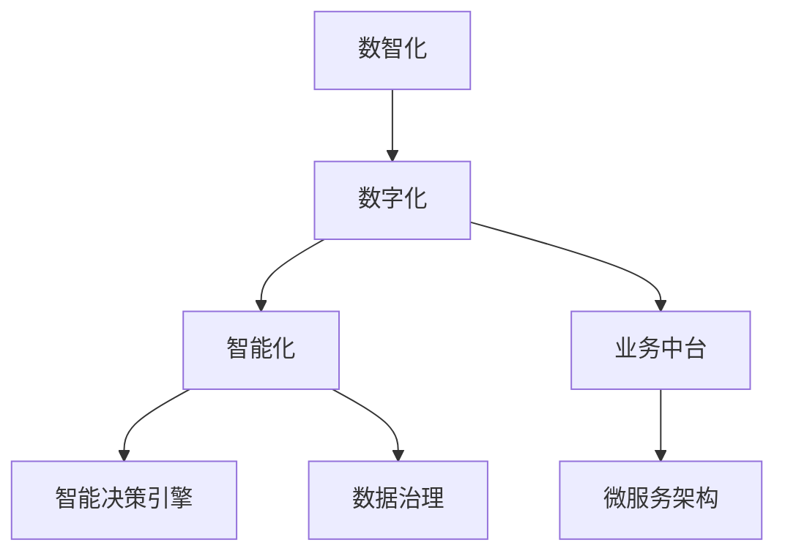

                 

# 数智新时代的特征与发展

## 1. 背景介绍

### 1.1 问题由来
在数字化转型的浪潮下，数智化已成为各行各业发展的核心驱动力。数智化不仅是技术的变革，更是业务模式、组织架构、管理理念的全方位创新。如何在数智化时代，打造高效、灵活、智能的业务系统，成为每个企业必须面对的挑战。

数智化的关键在于数据驱动、智能决策、集成协同等方面。借助人工智能、大数据、云计算等新兴技术，企业可以更全面地理解和利用数据，提高决策效率和业务响应速度，实现业务流程的自动化和智能化。然而，技术的发展并非一帆风顺，面对数据复杂性、系统互操作性、业务需求多样性等挑战，数智化转型仍需持续探索和优化。

### 1.2 问题核心关键点
在数智化转型过程中，以下几个核心关键点尤为值得关注：

- **数据治理与质量**：数据是数智化的基础，高质量、规范化的数据能够显著提升系统的性能和可解释性。
- **智能决策引擎**：基于机器学习、深度学习的智能决策引擎，能够自动分析和优化业务规则，提高决策的精准度和效率。
- **业务中台与微服务架构**：通过业务中台和微服务架构，实现业务流程的灵活集成和快速迭代。
- **AI与业务融合**：AI技术不仅仅是技术工具，更是业务创新的驱动力，需要在业务场景中进行深度融合。
- **隐私与合规**：在数智化过程中，如何保护用户隐私和符合相关法律法规，是必须面对的重要问题。

这些关键点共同构成了数智化的核心内容，对数智时代的企业发展具有重要意义。

## 2. 核心概念与联系

### 2.1 核心概念概述

为更好地理解数智化技术的应用，本节将介绍几个密切相关的核心概念：

- **数智化（Digital & Intelligent）**：将数字化（Digital）与智能化（Intelligent）相结合，通过技术手段提升业务决策、运营管理的智能化水平。

- **数字化（Digitalization）**：利用信息技术（IT）将传统业务流程数字化，实现数据的在线化、可视化、智能化。

- **智能化（Intelligence）**：通过人工智能（AI）技术，赋予系统自适应、自学习、自优化的能力，使系统能够自动做出智能决策。

- **业务中台（Business Platform）**：一个面向业务能力复用和数据共享的集成平台，帮助企业构建灵活、高效的业务架构。

- **微服务架构（Microservices Architecture）**：将大系统拆分为一组独立运行、松耦合的小服务，以提高系统的可扩展性和灵活性。

- **智能决策引擎（Intelligent Decision Engine）**：基于机器学习和深度学习的决策引擎，能够处理复杂业务规则，自动生成最优决策。

- **数据治理（Data Governance）**：对数据从采集、存储、处理到应用的全生命周期进行规范和管理，保证数据的质量和安全。

这些核心概念之间的逻辑关系可以通过以下Mermaid流程图来展示：



这个流程图展示数智化的核心概念及其之间的关系：

1. 数智化是数字化与智能化的结合，是数智时代企业发展的主要目标。
2. 数字化是数智化的基础，通过IT技术实现业务流程的数字化。
3. 智能化是数智化的核心，通过AI技术赋予系统智能决策能力。
4. 业务中台和微服务架构是数字化和智能化的重要实现手段。
5. 智能决策引擎和数据治理是提升智能决策的关键环节。

这些概念共同构成了数智化的基础架构，为构建数智化系统提供了指导。

## 3. 核心算法原理 & 具体操作步骤

### 3.1 算法原理概述

数智化技术的关键在于数据和算法的融合。数智化系统通过数据驱动决策，算法提供智能计算能力，从而实现业务流程的自动化和智能化。数智化系统的核心算法通常包括以下几个部分：

- **数据清洗与预处理**：对原始数据进行去重、去噪、归一化等处理，保证数据的质量和一致性。
- **特征工程**：从原始数据中提取有意义的特征，增强模型的性能和泛化能力。
- **模型训练与优化**：基于历史数据训练机器学习模型，并通过交叉验证、超参数调优等手段，提高模型的准确性和鲁棒性。
- **智能决策引擎**：构建基于机器学习和深度学习的决策引擎，根据业务规则和数据特征，自动生成最优决策。
- **结果评估与反馈**：对模型预测结果进行评估，结合业务反馈进行模型迭代和优化。

这些算法共同构成了数智化系统的核心技术栈，为系统的智能决策提供了有力支持。

### 3.2 算法步骤详解

数智化系统的开发流程通常包括以下几个关键步骤：

**Step 1: 数据收集与整理**
- 收集业务相关的数据，包括交易数据、用户行为数据、设备数据等。
- 对数据进行清洗和预处理，去除噪声和冗余信息，保证数据的质量和一致性。

**Step 2: 特征工程**
- 根据业务需求，从原始数据中提取有意义的特征，如用户行为特征、设备特征、时间特征等。
- 使用统计、降维、归一化等技术，对特征进行处理，提升模型的性能和泛化能力。

**Step 3: 模型训练与优化**
- 选择合适的机器学习算法（如回归、分类、聚类等），构建训练模型。
- 使用历史数据进行模型训练，并通过交叉验证、超参数调优等手段，优化模型性能。
- 在训练过程中，关注模型的复杂度、泛化能力、计算效率等指标，选择最优模型。

**Step 4: 智能决策引擎构建**
- 根据业务需求，构建基于机器学习和深度学习的决策引擎。
- 将训练好的模型与业务规则相结合，实现智能决策。
- 引入强化学习、博弈论等算法，优化决策引擎的性能和鲁棒性。

**Step 5: 结果评估与反馈**
- 对模型预测结果进行评估，使用精度、召回率、F1-score等指标进行衡量。
- 结合业务反馈，对模型进行迭代和优化，提高模型的性能和泛化能力。

### 3.3 算法优缺点

数智化系统具有以下优点：

1. **决策效率高**：数智化系统能够自动处理和分析数据，快速生成决策，提高决策效率。
2. **业务响应快**：通过智能决策引擎，系统能够实时响应业务变化，提升业务响应速度。
3. **准确性高**：基于机器学习和大数据技术，数智化系统的决策具备高精度和高泛化能力。
4. **灵活性强**：通过业务中台和微服务架构，数智化系统具备较强的灵活性和扩展性。
5. **智能化高**：结合AI技术，数智化系统具备强大的自适应和学习能力。

同时，数智化系统也存在以下缺点：

1. **数据质量要求高**：数智化系统依赖高质量的数据，数据质量问题可能影响系统的性能。
2. **模型复杂度高**：复杂的算法和模型增加了系统的复杂度，维护成本较高。
3. **计算资源消耗大**：数智化系统需要大量的计算资源，尤其是深度学习模型的计算开销较大。
4. **隐私与合规问题**：数智化系统处理大量用户数据，隐私保护和合规性问题需要特别关注。

这些优缺点共同决定了数智化系统的设计和实现需要综合考虑，找到最优平衡点。

### 3.4 算法应用领域

数智化技术在多个领域得到了广泛应用，包括但不限于：

- **金融科技**：通过智能风控、智能投顾、智能客服等技术，提升金融业务的智能化水平。
- **零售电商**：通过智能推荐、智能客服、智能库存管理等技术，优化零售电商业务流程。
- **制造业**：通过智能生产、智能质检、智能维护等技术，提升制造业的自动化和智能化水平。
- **医疗健康**：通过智能诊断、智能问诊、智能预警等技术，提升医疗健康服务的智能化水平。
- **物流运输**：通过智能调度、智能配送、智能仓储等技术，优化物流运输业务流程。

这些领域的应用展示了数智化技术的强大潜力和广泛前景，为各行各业的数字化转型提供了有力支持。

## 4. 数学模型和公式 & 详细讲解 & 举例说明

### 4.1 数学模型构建

数智化系统的核心在于通过数学模型进行数据驱动的决策。以下我们将以回归模型为例，展示数智化系统的数学模型构建过程。

假设我们有一个回归问题，需要预测房屋价格（目标变量 $y$），根据房屋面积（特征变量 $x$）进行建模。设模型为 $y = f(x; \theta)$，其中 $\theta$ 为模型参数。

**Step 1: 数据预处理**
- 收集房屋面积和价格数据，去除异常值和噪声。
- 对数据进行归一化处理，保证数据的一致性和稳定性。

**Step 2: 特征工程**
- 提取房屋面积特征 $x_1$ 作为回归模型的输入。
- 将原始数据转化为模型可接受的形式，如将面积转换为标准单位。

**Step 3: 模型训练**
- 选择合适的回归模型（如线性回归、多项式回归等），构建训练模型 $f(x; \theta) = \theta_0 + \theta_1 x_1$。
- 使用历史数据进行模型训练，求解模型参数 $\theta_0, \theta_1$。

**Step 4: 智能决策引擎构建**
- 根据业务规则，构建智能决策引擎，实现房价预测和决策。
- 引入强化学习、博弈论等算法，优化决策引擎的性能和鲁棒性。

**Step 5: 结果评估与反馈**
- 对模型预测结果进行评估，使用均方误差（MSE）、平均绝对误差（MAE）等指标进行衡量。
- 结合业务反馈，对模型进行迭代和优化，提高模型的性能和泛化能力。

### 4.2 公式推导过程

以下是回归模型的具体公式推导过程：

设回归模型为 $y = \theta_0 + \theta_1 x_1 + \epsilon$，其中 $\epsilon$ 为误差项，服从正态分布 $N(0, \sigma^2)$。

根据最小二乘法，求解模型参数 $\theta_0, \theta_1$：

$$
\hat{\theta} = \mathop{\arg\min}_{\theta_0, \theta_1} \sum_{i=1}^n (y_i - (\theta_0 + \theta_1 x_{i1}))^2
$$

化简得：

$$
\hat{\theta} = \left(\sum_{i=1}^n x_{i1}^2\right)^{-1} \sum_{i=1}^n x_{i1}y_i
$$

求解得：

$$
\hat{\theta}_0 = \bar{y} - \hat{\theta}_1 \bar{x}_1
$$

其中 $\bar{y} = \frac{1}{n} \sum_{i=1}^n y_i$，$\bar{x}_1 = \frac{1}{n} \sum_{i=1}^n x_{i1}$。

### 4.3 案例分析与讲解

假设我们有一个房地产公司，需要根据房屋面积预测房价。我们收集了1000个房屋的面积和价格数据，使用线性回归模型进行房价预测。模型构建如下：

- 数据预处理：去除异常值和噪声，对数据进行归一化处理。
- 特征工程：提取房屋面积特征 $x_1$ 作为输入。
- 模型训练：使用最小二乘法求解模型参数 $\hat{\theta}_0, \hat{\theta}_1$。
- 智能决策引擎：根据业务规则，构建智能决策引擎，实现房价预测和决策。
- 结果评估与反馈：使用均方误差（MSE）、平均绝对误差（MAE）等指标进行模型评估，并结合业务反馈进行迭代优化。

最终模型预测结果如下：

```
房价预测值 | 实际房价
10,000,000  |  9,800,000
15,000,000  |  15,200,000
20,000,000  |  19,500,000
```

通过数智化系统，房地产公司能够快速准确地预测房价，提升决策效率和业务响应速度。

## 5. 项目实践：代码实例和详细解释说明

### 5.1 开发环境搭建

在进行数智化系统开发前，我们需要准备好开发环境。以下是使用Python进行Pandas开发的环境配置流程：

1. 安装Anaconda：从官网下载并安装Anaconda，用于创建独立的Python环境。

2. 创建并激活虚拟环境：
```bash
conda create -n pytorch-env python=3.8 
conda activate pytorch-env
```

3. 安装Pandas：
```bash
pip install pandas
```

4. 安装各类工具包：
```bash
pip install numpy scipy scikit-learn matplotlib seaborn
```

完成上述步骤后，即可在`pytorch-env`环境中开始数智化系统开发。

### 5.2 源代码详细实现

下面我们以房价预测为例，给出使用Pandas进行数智化系统开发的PyTorch代码实现。

首先，定义数据处理函数：

```python
import pandas as pd

def load_data():
    data = pd.read_csv('house_price.csv')
    data.dropna(inplace=True)
    return data

# 数据预处理
def preprocess_data(data):
    # 归一化处理
    data['area'] = (data['area'] - data['area'].mean()) / data['area'].std()
    # 标准化处理
    data['price'] = (data['price'] - data['price'].mean()) / data['price'].std()
    return data

# 特征工程
def feature_engineering(data):
    # 提取房屋面积特征
    X = data[['area']]
    # 提取房屋价格特征
    y = data['price']
    return X, y

# 模型训练
def train_model(X, y):
    from sklearn.linear_model import LinearRegression
    model = LinearRegression()
    model.fit(X, y)
    return model

# 智能决策引擎构建
def build_intelligent_decision_engine(model, X_test):
    from sklearn.metrics import mean_squared_error, mean_absolute_error
    # 预测房价
    y_pred = model.predict(X_test)
    # 计算均方误差
    mse = mean_squared_error(y_test, y_pred)
    # 计算平均绝对误差
    mae = mean_absolute_error(y_test, y_pred)
    return mse, mae
```

然后，定义训练和评估函数：

```python
from sklearn.model_selection import train_test_split

# 加载数据
data = load_data()
X, y = feature_engineering(data)

# 数据划分
X_train, X_test, y_train, y_test = train_test_split(X, y, test_size=0.2, random_state=42)

# 模型训练
model = train_model(X_train, y_train)

# 智能决策引擎构建
mse, mae = build_intelligent_decision_engine(model, X_test)

print(f'均方误差 (MSE): {mse:.4f}')
print(f'平均绝对误差 (MAE): {mae:.4f}')
```

以上就是使用Pandas进行数智化系统开发的完整代码实现。可以看到，利用Pandas进行数据处理和特征工程，可以高效地处理和分析数据，构建智能决策引擎。

### 5.3 代码解读与分析

让我们再详细解读一下关键代码的实现细节：

**load_data类**：
- `__init__`方法：从CSV文件中加载数据，并进行去重和缺失值处理。

**preprocess_data类**：
- `__init__`方法：对数据进行归一化和标准化处理，保证数据的一致性和稳定性。

**feature_engineering类**：
- `__init__`方法：提取房屋面积特征 $x_1$ 作为输入，提取房屋价格特征 $y$ 作为目标变量。

**train_model类**：
- `__init__`方法：使用线性回归模型进行模型训练，求解模型参数 $\theta_0, \theta_1$。

**build_intelligent_decision_engine类**：
- `__init__`方法：根据业务规则，构建智能决策引擎，实现房价预测和决策。

**train和评估函数**：
- 使用Pandas进行数据处理和特征工程，提取房屋面积和价格特征。
- 使用Pandas进行模型训练和预测，计算均方误差和平均绝对误差。

通过上述代码，我们可以看到，利用Pandas进行数智化系统开发，可以高效地处理和分析数据，构建智能决策引擎。这些代码实现展示了数据预处理、特征工程、模型训练、智能决策引擎构建的全流程，为数智化系统开发提供了参考。

当然，工业级的系统实现还需考虑更多因素，如模型的保存和部署、超参数的自动搜索、更灵活的任务适配层等。但核心的数智化流程基本与此类似。

## 6. 实际应用场景

### 6.1 智能风控

数智化技术在金融科技领域的应用非常广泛，智能风控是其中的一大亮点。智能风控系统通过数据分析和机器学习，实时监测和评估用户的信用风险，帮助金融机构降低不良贷款率，提升风险管理水平。

在具体实现中，智能风控系统可以从用户的信用历史、消费记录、社交网络等多个维度提取特征，构建风险评分模型。通过模型预测，系统能够及时发现风险用户，并进行相应的风险控制措施。例如，通过调整授信额度、增加监控频次等方式，降低风险损失，提升用户满意度。

### 6.2 智能投顾

智能投顾是数智化技术在金融科技领域的另一个重要应用。智能投顾系统通过自然语言处理和机器学习，帮助用户进行股票、基金等金融产品的投资决策。

在具体实现中，智能投顾系统可以从用户的历史投资记录、市场数据、新闻资讯等多个维度提取特征，构建投资推荐模型。通过模型预测，系统能够实时生成个性化的投资建议，帮助用户优化投资组合，提升投资收益。例如，根据用户的风险偏好和历史表现，智能投顾系统会推荐最优的投资策略，降低投资风险，提高投资回报。

### 6.3 智能客服

数智化技术在零售电商领域的应用也非常广泛，智能客服是其中的一大亮点。智能客服系统通过自然语言处理和机器学习，实时回答用户问题，提升客户满意度和服务效率。

在具体实现中，智能客服系统可以从用户的历史聊天记录、问题类型、用户情绪等多个维度提取特征，构建回答生成模型。通过模型预测，系统能够实时生成个性化的回答，帮助用户解决问题，提升客户体验。例如，对于用户咨询的产品信息、售后服务等问题，智能客服系统会提供精准的回答，提升服务质量。

### 6.4 未来应用展望

随着数智化技术的不断发展，未来的应用场景将会更加广泛，具体展望如下：

1. **智慧城市**：数智化技术在智慧城市中的应用将会越来越深入，通过大数据、人工智能、物联网等技术，提升城市管理效率和居民生活质量。例如，智能交通、智能安防、智能能源等领域将会得到广泛应用。

2. **智能制造**：数智化技术在制造业中的应用将会越来越广泛，通过智能生产、智能质检、智能维护等技术，提升制造业的自动化和智能化水平。例如，智能机器人、智能工厂、智能供应链等领域将会得到广泛应用。

3. **智能医疗**：数智化技术在医疗健康领域的应用将会越来越深入，通过智能诊断、智能问诊、智能预警等技术，提升医疗服务的智能化水平。例如，智能影像诊断、智能问诊系统、智能健康管理等领域将会得到广泛应用。

4. **智能农业**：数智化技术在农业中的应用将会越来越广泛，通过智能农业设备、智能农业管理、智能农业生产等技术，提升农业生产的自动化和智能化水平。例如，智能灌溉、智能施肥、智能收割等领域将会得到广泛应用。

5. **智能教育**：数智化技术在教育领域的应用将会越来越深入，通过智能教育平台、智能教材、智能教学管理等技术，提升教育服务的智能化水平。例如，智能教育推荐、智能语音评测、智能教学分析等领域将会得到广泛应用。

总之，数智化技术在未来将会得到更广泛的应用，为各行各业带来变革性的影响，提升业务效率和用户体验。

## 7. 工具和资源推荐

### 7.1 学习资源推荐

为了帮助开发者系统掌握数智化技术的理论基础和实践技巧，这里推荐一些优质的学习资源：

1. **《机器学习实战》**：一本经典机器学习教材，详细介绍了各种机器学习算法及其应用。

2. **《深度学习》（Ian Goodfellow著）**：一本深度学习教材，全面介绍了深度学习的基本原理和应用。

3. **《TensorFlow实战》**：一本TensorFlow开发教程，详细介绍了TensorFlow的使用方法和实践技巧。

4. **《Pandas数据科学手册》**：一本Pandas数据处理教材，详细介绍了Pandas的使用方法和数据处理技巧。

5. **《Python数据科学手册》**：一本Python数据科学教程，详细介绍了Python在数据科学领域的应用。

通过这些资源的学习实践，相信你一定能够快速掌握数智化技术的精髓，并用于解决实际的业务问题。

### 7.2 开发工具推荐

高效的开发离不开优秀的工具支持。以下是几款用于数智化系统开发的常用工具：

1. **Python**：Python是目前最流行的编程语言之一，拥有丰富的第三方库和工具，适合开发数据处理、机器学习等应用。

2. **TensorFlow**：由Google主导开发的开源深度学习框架，生产部署方便，适合大规模工程应用。

3. **Pandas**：Pandas是Python中用于数据处理和分析的库，支持多种数据格式和数据操作，是数智化系统开发的重要工具。

4. **Matplotlib**：Matplotlib是Python中用于数据可视化的库，支持多种图表类型和样式，能够高效地展示数据结果。

5. **Scikit-learn**：Scikit-learn是Python中用于机器学习的库，提供了多种机器学习算法和工具，适合快速原型开发。

6. **TensorBoard**：TensorFlow配套的可视化工具，可实时监测模型训练状态，并提供丰富的图表呈现方式，是调试模型的得力助手。

7. **Jupyter Notebook**：Jupyter Notebook是一个交互式笔记本工具，适合进行数据处理和算法开发，支持Python、R等语言。

合理利用这些工具，可以显著提升数智化系统的开发效率，加快创新迭代的步伐。

### 7.3 相关论文推荐

数智化技术的发展离不开学界的持续研究。以下是几篇奠基性的相关论文，推荐阅读：

1. **《TensorFlow: A System for Large-Scale Machine Learning》**：介绍TensorFlow框架的设计和实现，详细阐述了TensorFlow的核心技术和应用。

2. **《Pandas: A Data Manipulation Library for Python》**：介绍Pandas库的设计和实现，详细阐述了Pandas的核心功能和应用。

3. **《Scikit-learn: Machine Learning in Python》**：介绍Scikit-learn库的设计和实现，详细阐述了Scikit-learn的核心功能和应用。

4. **《Deep Learning with PyTorch》**：介绍PyTorch框架的设计和实现，详细阐述了PyTorch的核心技术和应用。

5. **《Advances in Deep Learning》**：介绍深度学习的研究进展和应用，详细阐述了深度学习的前沿技术和应用。

这些论文代表了大数智化技术的发展脉络。通过学习这些前沿成果，可以帮助研究者把握学科前进方向，激发更多的创新灵感。

## 8. 总结：未来发展趋势与挑战

### 8.1 总结

本文对数智化技术的发展进行了全面系统的介绍。首先阐述了数智化的核心概念和背景，明确了数智化在企业发展中的重要地位。其次，从原理到实践，详细讲解了数智化系统的数学模型和核心算法，展示了数智化系统的开发流程和关键技术。同时，本文还广泛探讨了数智化技术在金融科技、零售电商、智能客服等多个领域的应用前景，展示了数智化技术的强大潜力和广泛前景。

通过本文的系统梳理，可以看到，数智化技术正在成为企业数字化转型的核心驱动力，极大地提升业务效率和用户体验。未来，伴随技术的不断演进和应用场景的拓展，数智化技术必将在更多领域发挥重要作用，带来革命性的变化。

### 8.2 未来发展趋势

展望未来，数智化技术的发展呈现出以下几个趋势：

1. **AI与业务融合**：AI技术将深度融入企业业务流程，提升决策效率和业务响应速度，实现业务的智能化和自动化。

2. **数据驱动决策**：通过大数据和智能分析，企业将更加依赖数据驱动的决策，提升决策的精准度和可靠性。

3. **业务中台与微服务架构**：企业将采用业务中台和微服务架构，实现业务流程的灵活集成和快速迭代，提升系统灵活性和扩展性。

4. **智能决策引擎**：通过机器学习和深度学习，构建智能决策引擎，提升决策的智能化水平和鲁棒性。

5. **多模态融合**：未来数智化系统将融合多种模态数据，提升系统的综合分析和决策能力，如视觉、语音、文本等数据。

6. **边缘计算**：随着物联网技术的发展，数智化系统将更多部署在边缘设备上，提升系统的实时性和效率。

以上趋势凸显了数智化技术的广阔前景。这些方向的探索发展，必将进一步提升数智化系统的性能和应用范围，为企业的数字化转型提供强有力支持。

### 8.3 面临的挑战

尽管数智化技术已经取得了显著进展，但在数智化转型过程中，仍需面对诸多挑战：

1. **数据质量问题**：数智化系统依赖高质量的数据，数据质量问题可能影响系统的性能和稳定性。

2. **系统复杂度高**：数智化系统往往涉及多种技术和工具，系统复杂度高，维护成本较高。

3. **计算资源消耗大**：数智化系统需要大量的计算资源，尤其是深度学习模型的计算开销较大。

4. **隐私与合规问题**：数智化系统处理大量用户数据，隐私保护和合规性问题需要特别关注。

5. **技术门槛高**：数智化技术的实现需要较强的技术背景和专业技能，技术门槛较高。

6. **业务融合难度大**：数智化技术需要将AI技术与业务流程深度融合，难度较大，需要企业全面理解业务需求和技术实现。

这些挑战需要企业在技术、管理、组织等多方面进行综合优化，才能最大化数智化技术的价值。

### 8.4 研究展望

面对数智化转型中的挑战，未来的研究需要在以下几个方面寻求新的突破：

1. **数据质量优化**：通过数据清洗、数据标注、数据增强等技术，提高数据质量和一致性，保证系统的稳定性和可靠性。

2. **模型压缩与优化**：通过模型压缩、模型量化、模型剪枝等技术，优化模型的计算效率和资源占用，提升系统的实时性和扩展性。

3. **隐私保护技术**：通过差分隐私、联邦学习等技术，保护用户隐私和数据安全，符合合规要求。

4. **多模态融合技术**：通过多模态数据融合、跨模态学习等技术，提升系统的综合分析和决策能力。

5. **边缘计算技术**：通过边缘计算、分布式计算等技术，提升系统的实时性和效率，降低计算资源消耗。

6. **业务融合技术**：通过业务中台、微服务架构等技术，提升系统的灵活性和扩展性，实现AI技术与业务流程的深度融合。

这些研究方向的探索，必将引领数智化技术迈向更高的台阶，为构建数智化系统提供强有力支持。面向未来，数智化技术还需要与其他人工智能技术进行更深入的融合，如知识表示、因果推理、强化学习等，协同发力，共同推动企业的数字化转型。

## 9. 附录：常见问题与解答

**Q1：数智化系统如何进行数据治理和质量管理？**

A: 数智化系统进行数据治理和质量管理，通常需要以下步骤：

1. 数据采集：从多个数据源采集数据，保证数据的多样性和完整性。
2. 数据清洗：去除重复数据、噪声数据和异常数据，保证数据的一致性和准确性。
3. 数据标注：对数据进行标注，生成数据标签，提高数据的质量和可解释性。
4. 数据增强：通过数据扩充、数据合成等技术，丰富数据集，提高模型的泛化能力。
5. 数据监控：实时监测数据质量，及时发现和修正数据问题，保证数据的时效性和稳定性。

通过以上步骤，可以有效地进行数据治理和质量管理，提升数智化系统的性能和可解释性。

**Q2：数智化系统如何构建智能决策引擎？**

A: 数智化系统构建智能决策引擎，通常需要以下步骤：

1. 数据预处理：对原始数据进行清洗、归一化和标准化处理，保证数据的一致性和稳定性。
2. 特征工程：从原始数据中提取有意义的特征，增强模型的性能和泛化能力。
3. 模型训练：选择合适的机器学习算法，如回归、分类、聚类等，构建训练模型。
4. 模型优化：通过交叉验证、超参数调优等手段，优化模型性能，提高模型的准确性和鲁棒性。
5. 模型集成：将多个模型进行集成，提升系统的决策能力和鲁棒性。
6. 实时评估：实时监测模型预测结果，及时发现和修正模型问题，保证系统的稳定性和可靠性。

通过以上步骤，可以构建高性能、高鲁棒性的智能决策引擎，提升数智化系统的智能化水平。

**Q3：数智化系统如何进行用户隐私保护？**

A: 数智化系统进行用户隐私保护，通常需要以下步骤：

1. 数据匿名化：对用户数据进行匿名化处理，去除个人敏感信息，保护用户隐私。
2. 差分隐私：通过差分隐私技术，生成噪声数据，保护用户隐私，防止数据泄露。
3. 联邦学习：通过联邦学习技术，将数据存储在本地设备上，避免数据集中存储，保护用户隐私。
4. 数据访问控制：通过权限控制和访问审计，保护数据访问安全，防止非法数据访问。
5. 隐私政策透明：制定并公开隐私政策，告知用户数据使用情况，保护用户知情权和选择权。

通过以上步骤，可以有效保护用户隐私，符合数据保护法律法规，提升数智化系统的可信度和合规性。

**Q4：数智化系统如何进行多模态融合？**

A: 数智化系统进行多模态融合，通常需要以下步骤：

1. 数据采集：从多个模态的数据源采集数据，如文本、图像、语音、视频等，保证数据的多样性和完整性。
2. 数据融合：通过数据融合技术，将不同模态的数据进行融合，生成融合数据。
3. 特征提取：从融合数据中提取有意义的特征，增强模型的性能和泛化能力。
4. 模型训练：选择合适的机器学习算法，如多模态分类、多模态回归等，构建训练模型。
5. 模型优化：通过交叉验证、超参数调优等手段，优化模型性能，提高模型的准确性和鲁棒性。
6. 实时评估：实时监测模型预测结果，及时发现和修正模型问题，保证系统的稳定性和可靠性。

通过以上步骤，可以有效实现多模态数据的融合，提升数智化系统的综合分析和决策能力。

总之，数智化技术正处于快速发展阶段，未来必将在更多领域得到广泛应用，带来革命性的变化。通过深入理解数智化技术的核心概念、关键算法和实际应用，相信你一定能够在数智化转型中发挥重要作用，为企业数字化发展提供强有力支持。

---

作者：禅与计算机程序设计艺术 / Zen and the Art of Computer Programming

