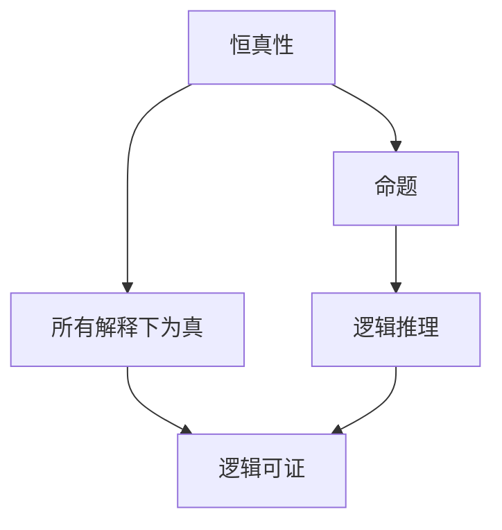

                 

# 数理逻辑：恒真性和可真性

## 1. 背景介绍

数理逻辑是数学的一个分支，旨在通过形式化的方法研究命题的逻辑结构与推理规律。数理逻辑的核心是命题的真假判断，即“恒真性”与“可真性”，这是数理逻辑的基础，也是理解和应用逻辑学的核心。本文将系统介绍数理逻辑中的恒真性和可真性，详细阐述其原理、定义以及应用场景。

## 2. 核心概念与联系

### 2.1 核心概念概述

在数理逻辑中，“恒真性”指的是一个命题在所有可能的情况和解释下都是真的，无论其推理依据和逻辑结构如何。而“可真性”则指一个命题在特定条件下，通过逻辑推理可以得出为真，或者说是具有逻辑上的可证性。

### 2.2 核心概念原理和架构的 Mermaid 流程图



此图展示了恒真性和可真性之间的联系：恒真性强调命题的普遍性，而可真性强调命题的可推理性。两者共同构成了数理逻辑研究的基本内容。

## 3. 核心算法原理 & 具体操作步骤

### 3.1 算法原理概述

数理逻辑中的恒真性和可真性，可以通过逻辑推理和模型验证来判定。其中，布尔代数和谓词逻辑是两个常用的工具。布尔代数用于处理命题的基本逻辑运算，如与、或、非等；而谓词逻辑则用于表达更为复杂的逻辑关系，如包含、相等、递归等。

### 3.2 算法步骤详解

**步骤 1: 定义命题和逻辑结构**

首先，我们需要定义一组命题和它们之间的逻辑结构。例如，设 P 和 Q 为两个命题，其逻辑与为 P ∧ Q，逻辑或为 P ∨ Q，逻辑非为 ¬P，逻辑蕴含为 P → Q。

**步骤 2: 构建逻辑表达式**

根据已知的命题，构建逻辑表达式。例如，构建复合命题 P ∧ Q，表示 P 和 Q 都为真的情况。

**步骤 3: 验证恒真性**

对于定义的逻辑表达式，验证其在所有解释下是否为真。使用布尔代数的性质和公理系统，我们可以证明该表达式在所有情况下恒真。

**步骤 4: 验证可真性**

对于特定情况，验证一个命题是否可真。例如，对于 P ∧ Q，若已知 P 可真，则整个复合命题 P ∧ Q 也一定可真。

### 3.3 算法优缺点

**优点**：
- 通过形式化的方法，可以对逻辑命题进行严格定义和验证，提高了逻辑推理的准确性和可靠性。
- 使用布尔代数和谓词逻辑等工具，可以处理各种复杂的逻辑问题。

**缺点**：
- 数理逻辑的表达和验证过程相对复杂，对于非专业人士来说有一定难度。
- 验证恒真性时，需要穷举所有可能的解释，工作量较大。

### 3.4 算法应用领域

恒真性和可真性在数理逻辑中有着广泛的应用，包括：

- 数学证明：在数学证明中，恒真性是数学定理的基础。例如，欧几里得几何中，命题“若直线和线段相交，则交点位于线段上”是恒真命题。
- 计算机科学：在程序验证和逻辑编程中，使用恒真性和可真性来检查程序的正确性和逻辑一致性。
- 逻辑学：在逻辑推理和形式证明中，恒真性和可真性是基础工具。

## 4. 数学模型和公式 & 详细讲解 & 举例说明

### 4.1 数学模型构建

数理逻辑的数学模型主要基于布尔代数和谓词逻辑，用符号表示命题和推理过程。例如，在布尔代数中，0 表示假，1 表示真，逻辑运算符如∧、∨、¬等具有明确的定义和性质。

### 4.2 公式推导过程

以布尔代数的德摩根定律为例，公式推导过程如下：

- 德摩根定律：(¬P ∧ ¬Q) ≡ (¬(P ∨ Q))
- 证明：
  $$
  \neg(\neg P \land \neg Q) \equiv \neg\neg P \lor \neg\neg Q \equiv P \lor Q
  $$

### 4.3 案例分析与讲解

**例子 1: 布尔代数中的恒真性**

命题 P 和 Q 的逻辑与 P ∧ Q，在所有情况下恒真。即：
$$
P \land P = P
$$
$$
P \land \neg P = \neg P
$$

**例子 2: 谓词逻辑中的可真性**

设 P(x) 为 x 是圆的命题，Q(x) 为 x 是红色的命题，R(x) 为 x 是苹果的命题。则命题 P(x) ∧ Q(x) ∧ ¬R(x) 在特定情况下可真，例如 x 为红色的苹果时：
$$
\forall x \,(P(x) \land Q(x) \land \neg R(x)) \equiv \text{“所有 x 都是圆的、红色的但不是苹果”}
$$

## 5. 项目实践：代码实例和详细解释说明

### 5.1 开发环境搭建

在Python中，可以使用Sympy库来验证恒真性和可真性。Sympy是一个符号计算库，提供了强大的符号表示和计算功能。

安装Sympy库：
```bash
pip install sympy
```

### 5.2 源代码详细实现

```python
from sympy import symbols, And, Or, Not, Eq, solve

# 定义布尔变量
P, Q = symbols('P Q', boolean=True)

# 定义逻辑表达式
expr = And(P, Q)

# 验证恒真性
result = expr.subs({P: True, Q: True})
print(f"P ∧ Q = {expr}, 恒真性验证结果：{result}")

# 验证可真性
expr2 = Or(And(P, Q), Not(P))
result2 = expr2.subs({P: True, Q: True})
print(f"(P ∧ Q) ∨ ¬P = {expr2}, 可真性验证结果：{result2}")
```

### 5.3 代码解读与分析

代码中，我们首先定义了布尔变量P和Q，然后使用And函数定义了逻辑与P ∧ Q。通过subs方法替换变量的真值，验证了恒真性和可真性。

## 6. 实际应用场景

### 6.1 数学证明

在数学证明中，恒真性和可真性是数学定理的基础。例如，欧几里得几何中，命题“若直线和线段相交，则交点位于线段上”是恒真命题，可以使用逻辑推理来证明其正确性。

### 6.2 计算机科学

在程序验证和逻辑编程中，恒真性和可真性用于检查程序的正确性和逻辑一致性。例如，使用谓词逻辑描述程序的输入和输出，使用恒真性来验证程序的逻辑结构是否正确。

### 6.3 逻辑学

在逻辑推理和形式证明中，恒真性和可真性是基础工具。例如，在逻辑演算中，使用德摩根定律等恒真命题来简化和验证复杂的逻辑表达式。

### 6.4 未来应用展望

随着人工智能技术的发展，逻辑推理和形式验证将在更多的领域得到应用，如自动定理证明、逻辑程序设计、知识工程等。使用数理逻辑的恒真性和可真性，可以增强人工智能系统的可靠性和安全性，推动其在更多场景中的广泛应用。

## 7. 工具和资源推荐

### 7.1 学习资源推荐

- 《数理逻辑基础》：该书详细介绍了数理逻辑的基本概念和推理规则，是学习数理逻辑的入门书籍。
- 《形式化方法与验证》：该书介绍了如何使用数理逻辑对系统进行形式化验证，适用于计算机科学和软件工程等领域。
- 《逻辑思维的艺术》：该书介绍了逻辑思维的基本方法，有助于提高逻辑推理和问题解决能力。

### 7.2 开发工具推荐

- Sympy：Python的符号计算库，支持布尔代数和谓词逻辑的计算和验证。
- Prover9：一个基于CSPLib的逻辑证明系统，支持多种逻辑证明方法。

### 7.3 相关论文推荐

- 《数理逻辑与计算机科学》：该论文探讨了数理逻辑在计算机科学中的应用，包括逻辑程序设计、自动定理证明等。
- 《形式化验证与逻辑推理》：该论文介绍了如何使用逻辑推理和形式验证技术，确保系统的正确性和安全性。

## 8. 总结：未来发展趋势与挑战

### 8.1 研究成果总结

数理逻辑的恒真性和可真性是逻辑推理和形式验证的基础，在数学、计算机科学和逻辑学等领域有着广泛的应用。未来，随着人工智能技术的不断发展，逻辑推理和形式验证将成为更多领域的基础工具，推动人工智能系统的可靠性和安全性。

### 8.2 未来发展趋势

- 自动化逻辑推理：未来，使用机器学习和人工智能技术，将自动推导和验证逻辑表达式，提高逻辑推理的效率和准确性。
- 多模态逻辑推理：逻辑推理将不仅仅局限于符号逻辑，还将涉及自然语言逻辑、图像逻辑等，拓展逻辑推理的应用范围。
- 逻辑与语义的结合：逻辑推理将与自然语言处理和语义理解结合，推动智能交互系统的发展。

### 8.3 面临的挑战

- 逻辑推理的复杂性：逻辑推理涉及复杂的符号运算和公理系统，对于非专业人士来说有一定难度。
- 逻辑推理的自动化：虽然机器学习可以辅助逻辑推理，但要实现完全自动化还有很大挑战。
- 逻辑与语言的结合：如何将逻辑推理与自然语言处理结合，仍是一个重要的研究方向。

### 8.4 研究展望

未来，随着逻辑推理和形式验证技术的不断发展，逻辑学将在更多领域得到应用，推动人工智能系统的可靠性和安全性。同时，如何结合人工智能技术，实现更加智能、高效、安全的逻辑推理和验证，将是重要的研究方向。

## 9. 附录：常见问题与解答

**Q1: 什么是数理逻辑的恒真性？**

A: 数理逻辑中的恒真性指的是一个命题在所有可能的情况和解释下都是真的。例如，命题“所有偶数都是2的倍数”是一个恒真命题。

**Q2: 什么是数理逻辑的可真性？**

A: 数理逻辑中的可真性指的是一个命题在特定条件下，通过逻辑推理可以得出为真，或者说是具有逻辑上的可证性。例如，命题“2+2=4”是一个可真命题，因为它可以通过逻辑推理得到。

**Q3: 如何使用Sympy验证恒真性和可真性？**

A: 使用Sympy定义布尔变量和逻辑表达式，然后使用subs方法替换变量的真值，验证恒真性和可真性。例如：

```python
from sympy import symbols, And, Or, Not, Eq, solve

# 定义布尔变量
P, Q = symbols('P Q', boolean=True)

# 定义逻辑表达式
expr = And(P, Q)

# 验证恒真性
result = expr.subs({P: True, Q: True})
print(f"P ∧ Q = {expr}, 恒真性验证结果：{result}")

# 验证可真性
expr2 = Or(And(P, Q), Not(P))
result2 = expr2.subs({P: True, Q: True})
print(f"(P ∧ Q) ∨ ¬P = {expr2}, 可真性验证结果：{result2}")
```

**Q4: 数理逻辑的恒真性和可真性有哪些应用？**

A: 数理逻辑的恒真性和可真性在数学证明、计算机科学、逻辑学等领域有着广泛的应用。例如，在数学证明中，恒真性是数学定理的基础；在计算机科学中，恒真性和可真性用于检查程序的正确性和逻辑一致性；在逻辑学中，恒真性和可真性是基础工具。

---

作者：禅与计算机程序设计艺术 / Zen and the Art of Computer Programming

