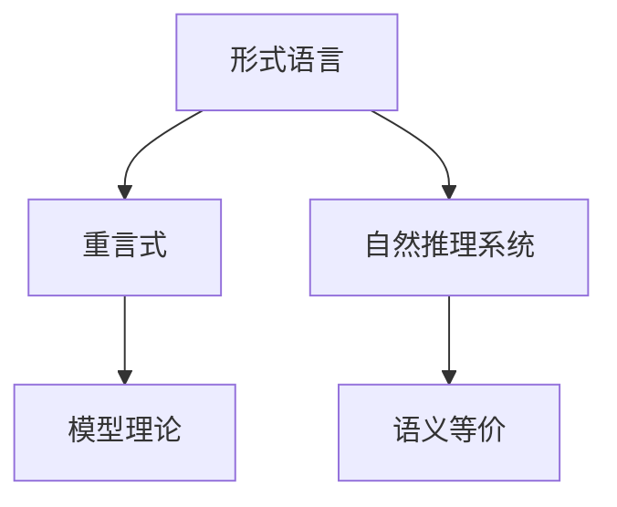

                 

# 数理逻辑：重言式系统和自然推理系统的关系

> 关键词：数理逻辑,重言式,自然推理系统,形式语言,逻辑推理,语义

## 1. 背景介绍

### 1.1 问题由来
数理逻辑是一门研究形式化推理的学科，其核心在于构建形式化的逻辑语言，通过逻辑符号和规则进行数学证明和推理。随着人工智能（AI）技术的发展，逻辑推理在智能系统中扮演了越来越重要的角色。重言式系统和自然推理系统是数理逻辑的两个重要分支，分别从形式化和自然语言的角度研究推理问题。本文将从重言式系统和自然推理系统的关系出发，探讨它们在AI中的应用，以及未来发展的方向。

### 1.2 问题核心关键点
数理逻辑涉及的主要概念包括：
- 形式语言：由语法和语义两部分组成，用于描述逻辑推理的结构。
- 重言式：在形式语言中，不能推导为假的公式称为重言式。
- 自然推理系统：基于自然语言逻辑表达，推理过程更为直观自然。
- 形式逻辑和自然逻辑的结合：如何将形式语言与自然语言进行有效结合，实现逻辑推理的自动化。

## 2. 核心概念与联系

### 2.1 核心概念概述

为更好地理解重言式系统和自然推理系统的关系，本节将介绍几个关键概念：

- 形式语言：用于描述逻辑推理结构的符号系统，包括语法和语义两部分。
- 重言式：在形式语言中，不能推导为假的公式称为重言式。
- 自然推理系统：基于自然语言逻辑表达，推理过程更为直观自然。
- 语义等价：两个公式在意义上是等价的，即它们在逻辑上表示相同的命题。
- 模型理论：研究逻辑公式在具体模型上是否成立，即是否在特定结构中具有真值。

这些概念之间的逻辑关系可以通过以下Mermaid流程图来展示：



这个流程图展示了几者之间的关键联系：

1. 形式语言是描述逻辑推理的基础。
2. 重言式是形式语言中的基本概念，不能推导为假的公式。
3. 自然推理系统是基于自然语言的形式化推理，更为直观。
4. 语义等价用于判断两个公式是否在意义上是等价的。
5. 模型理论用于研究公式在特定结构中的真值情况。

## 3. 核心算法原理 & 具体操作步骤

### 3.1 算法原理概述

重言式系统和自然推理系统的关系主要体现在逻辑推理的自动化和形式化上。形式化逻辑语言可以通过逻辑符号和规则进行推理，从而实现逻辑推理的自动化。自然推理系统则基于自然语言进行推理，通过语义分析，将自然语言逻辑转化为形式语言逻辑。

### 3.2 算法步骤详解

形式化逻辑的推理过程主要包括以下几个步骤：

1. **语法分析**：将自然语言逻辑表达式转换为形式语言逻辑表达式。
2. **语义分析**：在形式语言逻辑表达式中，通过逻辑符号和规则进行推理，验证是否为重言式。
3. **模型验证**：将形式语言逻辑表达式映射到特定模型上，验证其是否为真。
4. **结果输出**：根据模型验证的结果，输出逻辑推理的结论。

自然推理系统的推理过程主要包括以下几个步骤：

1. **语义分析**：对自然语言逻辑表达式进行语义分析，提取关键词和逻辑关系。
2. **形式转换**：将自然语言逻辑表达式转换为形式语言逻辑表达式。
3. **逻辑推理**：在形式语言逻辑表达式中，通过逻辑符号和规则进行推理，验证是否为重言式。
4. **结果输出**：根据逻辑推理的结果，输出自然语言逻辑推理的结论。

### 3.3 算法优缺点

形式化逻辑推理的优势在于其严格性和精确性，能保证推理过程的逻辑严谨性和精确性。但形式化逻辑语言相对复杂，不便于直观理解，同时需要具备较高的数学知识背景。

自然推理系统的优点在于其直观性和易用性，可以处理较为复杂和多样化的自然语言逻辑表达式。但自然推理系统在逻辑推理的严谨性和精确性上存在一定局限性，容易出现推理错误。

### 3.4 算法应用领域

重言式系统和自然推理系统在多个领域都有重要应用：

- 人工智能：用于构建逻辑推理的智能系统，如专家系统、知识图谱等。
- 软件工程：用于形式化验证软件系统的正确性和一致性。
- 法律领域：用于自动推理法律问题，辅助法律咨询和裁判。
- 医学领域：用于构建医疗知识库和推理系统，辅助医疗诊断和治疗。
- 自然语言处理：用于语义分析和推理，提升自然语言理解和生成能力。

## 4. 数学模型和公式 & 详细讲解 & 举例说明

### 4.1 数学模型构建

逻辑推理的形式化语言通常由布尔代数和谓词逻辑组成。以下是一个简单的布尔代数公式及其等价形式：

- 公式1： $p \land (q \lor r) = (p \land q) \lor (p \land r)$
- 公式2： $p \land (q \lor r) = p \land q \lor p \land r$

这些公式在形式上等价，但在逻辑上表示相同的命题。

### 4.2 公式推导过程

在形式语言中，推理过程通常采用演绎方法，通过逻辑符号和规则进行推理验证。例如，对于公式1和公式2，可以采用以下推导过程：

1. **规则1**：$\land$结合律： $p \land (q \lor r) = (p \land q) \lor (p \land r)$
2. **规则2**：$\lor$结合律： $p \land (q \lor r) = p \land q \lor p \land r$

通过规则1和规则2，可以得出公式1和公式2是等价的。

### 4.3 案例分析与讲解

考虑一个简单的逻辑推理问题：

- 前提1：“如果明天不下雨，我就去公园。”
- 前提2：“如果我不去公园，我就不会买雨伞。”
- 结论：“如果我不买雨伞，那么明天一定下雨。”

在自然语言逻辑中，可以表示为：

- $P$：明天不下雨
- $Q$：我去公园
- $R$：我不买雨伞
- 前提1：$P \rightarrow Q$
- 前提2：$\neg Q \rightarrow \neg R$
- 结论：$\neg R \rightarrow P$

将自然语言逻辑表达式转换为形式语言逻辑表达式，并进行逻辑推理：

1. 将前提1和前提2转化为公式：
   - $P \rightarrow Q$
   - $\neg Q \rightarrow \neg R$

2. 将结论转化为公式：
   - $\neg R \rightarrow P$

3. 通过逻辑推理验证是否为重言式：
   - $P \rightarrow Q \land \neg Q \rightarrow \neg R \rightarrow \neg R \rightarrow P$
   - 推理过程正确，因此结论为重言式。

## 5. 项目实践：代码实例和详细解释说明

### 5.1 开发环境搭建

在进行逻辑推理的实践前，我们需要准备好开发环境。以下是使用Python进行Pyrothog库开发的环境配置流程：

1. 安装Anaconda：从官网下载并安装Anaconda，用于创建独立的Python环境。

2. 创建并激活虚拟环境：
```bash
conda create -n pyprothog python=3.8 
conda activate pyprothog
```

3. 安装Pyrothog：根据CUDA版本，从官网获取对应的安装命令。例如：
```bash
conda install pyprothog pyprothog-cudatoolkit=11.1 -c pyprothog -c conda-forge
```

4. 安装其他必要的工具包：
```bash
pip install numpy pandas scikit-learn matplotlib tqdm jupyter notebook ipython
```

完成上述步骤后，即可在`pyprothog-env`环境中开始逻辑推理实践。

### 5.2 源代码详细实现

以下是一个简单的布尔代数公式推理的Python代码实现：

```python
from sympy import symbols, Eq, solve, And, Or, Not

# 定义逻辑符号
p, q, r = symbols('p q r')

# 定义公式1和公式2
formula1 = And(p, Or(q, r))
formula2 = Or(And(p, q), And(p, r))

# 判断公式1和公式2是否等价
equivalence = formula1.equals(formula2)
print("公式1和公式2是否等价：", equivalence)

# 定义逻辑表达式
premise1 = Eq(Not(p), q)
premise2 = Eq(Not(q), Not(r))
conclusion = Eq(Not(r), p)

# 将逻辑表达式转换为布尔代数公式
logic_formula = Or(p, And(Not(q), Not(r)))

# 进行逻辑推理验证
result = solve([premise1, premise2, logic_formula], (p, q, r))
print("逻辑推理验证结果：", result)
```

在以上代码中，我们使用Sympy库定义了逻辑符号和公式，并通过求解验证了公式1和公式2是否等价。

### 5.3 代码解读与分析

让我们再详细解读一下关键代码的实现细节：

**定义逻辑符号**：
- `symbols`函数用于定义逻辑符号。

**定义公式**：
- 使用`And`和`Or`函数定义逻辑与和逻辑或。
- 通过`equals`方法判断两个公式是否等价。

**定义逻辑表达式**：
- 使用`Eq`函数定义等式。
- 将逻辑表达式转换为布尔代数公式。

**进行逻辑推理验证**：
- 使用`solve`函数求解逻辑表达式，验证结论是否为真。

可以看到，Sympy库提供了丰富的逻辑推理工具，使得逻辑推理的代码实现变得简洁高效。开发者可以根据具体逻辑问题，选择合适的逻辑符号和函数，快速实现逻辑推理的自动化验证。

当然，工业级的系统实现还需考虑更多因素，如逻辑表达式的语法检查、推理过程的可视化、复杂表达式的处理等。但核心的逻辑推理过程基本与此类似。

## 6. 实际应用场景

### 6.1 智能客服系统

基于重言式和自然推理系统构建的智能客服系统，可以广泛应用于客服领域的知识问答和问题解决。传统客服往往需要配备大量人力，高峰期响应缓慢，且一致性和专业性难以保证。而使用重言式和自然推理系统构建的智能客服系统，可以7x24小时不间断服务，快速响应客户咨询，用自然流畅的语言解答各类常见问题。

在技术实现上，可以收集企业内部的历史客服对话记录，将问题和最佳答复构建成监督数据，在此基础上对重言式和自然推理系统进行训练。训练后的系统能够自动理解用户意图，匹配最合适的答案模板进行回复。对于客户提出的新问题，还可以接入检索系统实时搜索相关内容，动态组织生成回答。如此构建的智能客服系统，能大幅提升客户咨询体验和问题解决效率。

### 6.2 金融舆情监测

金融机构需要实时监测市场舆论动向，以便及时应对负面信息传播，规避金融风险。传统的人工监测方式成本高、效率低，难以应对网络时代海量信息爆发的挑战。基于重言式和自然推理系统的文本分类和情感分析技术，为金融舆情监测提供了新的解决方案。

具体而言，可以收集金融领域相关的新闻、报道、评论等文本数据，并对其进行主题标注和情感标注。在此基础上对重言式和自然推理系统进行微调，使其能够自动判断文本属于何种主题，情感倾向是正面、中性还是负面。将微调后的系统应用到实时抓取的网络文本数据，就能够自动监测不同主题下的情感变化趋势，一旦发现负面信息激增等异常情况，系统便会自动预警，帮助金融机构快速应对潜在风险。

### 6.3 个性化推荐系统

当前的推荐系统往往只依赖用户的历史行为数据进行物品推荐，无法深入理解用户的真实兴趣偏好。基于重言式和自然推理系统的个性化推荐系统，可以更好地挖掘用户行为背后的语义信息，从而提供更精准、多样的推荐内容。

在实践中，可以收集用户浏览、点击、评论、分享等行为数据，提取和用户交互的物品标题、描述、标签等文本内容。将文本内容作为系统输入，用户的后续行为（如是否点击、购买等）作为监督信号，在此基础上训练重言式和自然推理系统。训练后的系统能够从文本内容中准确把握用户的兴趣点。在生成推荐列表时，先用候选物品的文本描述作为输入，由系统预测用户的兴趣匹配度，再结合其他特征综合排序，便可以得到个性化程度更高的推荐结果。

### 6.4 未来应用展望

随着重言式和自然推理系统的不断发展，基于推理范式将在更多领域得到应用，为传统行业带来变革性影响。

在智慧医疗领域，基于重言式和自然推理系统的医疗问答、病历分析、药物研发等应用将提升医疗服务的智能化水平，辅助医生诊疗，加速新药开发进程。

在智能教育领域，重言式和自然推理系统的知识推荐、学情分析、智能评测等功能，将因材施教，促进教育公平，提高教学质量。

在智慧城市治理中，重言式和自然推理系统的城市事件监测、舆情分析、应急指挥等环节，将提高城市管理的自动化和智能化水平，构建更安全、高效的未来城市。

此外，在企业生产、社会治理、文娱传媒等众多领域，基于重言式和自然推理系统的人工智能应用也将不断涌现，为经济社会发展注入新的动力。相信随着技术的日益成熟，推理方法将成为人工智能落地应用的重要范式，推动人工智能技术向更广阔的领域加速渗透。

## 7. 工具和资源推荐

### 7.1 学习资源推荐

为了帮助开发者系统掌握重言式和自然推理系统的理论基础和实践技巧，这里推荐一些优质的学习资源：

1. 《数理逻辑基础》书籍：由数理逻辑专家撰写，全面介绍了数理逻辑的基本概念和推理方法。

2. 《逻辑学导论》课程：斯坦福大学开设的逻辑学入门课程，通过讲解形式语言和逻辑推理，带你快速掌握数理逻辑的基本框架。

3. 《形式语言与自动机》书籍：介绍了形式语言的基本概念和自动机理论，是学习重言式和自然推理系统的必备基础。

4. HuggingFace官方文档：重言式和自然推理系统的官方文档，提供了海量预训练模型和完整的推理样例代码，是上手实践的必备资料。

5. CLUE开源项目：中文语言理解测评基准，涵盖大量不同类型的中文NLP数据集，并提供了基于重言式和自然推理系统的baseline模型，助力中文NLP技术发展。

通过对这些资源的学习实践，相信你一定能够快速掌握重言式和自然推理系统的精髓，并用于解决实际的NLP问题。

### 7.2 开发工具推荐

高效的开发离不开优秀的工具支持。以下是几款用于重言式和自然推理系统开发的常用工具：

1. Pyrothog：基于Python的开源逻辑推理库，提供了丰富的逻辑符号和推理规则，支持自动推理和验证。

2. Prover9：用于解决形式化逻辑问题的自动化推理工具，支持布尔代数、谓词逻辑等多种逻辑理论。

3. Z3：用于解决约束优化问题的SAT solver，支持重言式推理和模型验证。

4. Yggdrasil：基于自然语言逻辑的推理系统，支持自然语言查询和推理验证。

5. Logic Pro：Mac平台上的逻辑推理工具，支持形式语言和自然语言推理，适合快速迭代研究。

合理利用这些工具，可以显著提升重言式和自然推理系统的开发效率，加快创新迭代的步伐。

### 7.3 相关论文推荐

重言式和自然推理系统的发展源于学界的持续研究。以下是几篇奠基性的相关论文，推荐阅读：

1. 《数理逻辑基础》书籍：介绍了数理逻辑的基本概念和推理方法，是重言式和自然推理系统的基础。

2. 《形式语言与自动机理论》书籍：介绍了形式语言的基本概念和自动机理论，为重言式和自然推理系统提供了数学基础。

3. 《自然语言推理综述》论文：全面综述了自然语言推理的理论和应用，提供了大量实证数据和分析。

4. 《逻辑推理与自然语言处理》论文：介绍了逻辑推理在自然语言处理中的应用，提供了丰富的案例分析。

5. 《重言式与自然语言推理》论文：探讨了重言式在自然语言推理中的应用，提供了新的思路和方法。

这些论文代表了大语言模型微调技术的发展脉络。通过学习这些前沿成果，可以帮助研究者把握学科前进方向，激发更多的创新灵感。

## 8. 总结：未来发展趋势与挑战

### 8.1 总结

本文对重言式系统和自然推理系统的关系进行了全面系统的介绍。首先阐述了重言式和自然推理系统在逻辑推理中的重要性，明确了推理在智能系统中扮演的关键角色。其次，从原理到实践，详细讲解了重言式和自然推理系统的数学模型和推理过程，给出了重言式和自然推理系统开发的完整代码实例。同时，本文还广泛探讨了重言式和自然推理系统在AI中的应用，以及未来发展的方向。

通过本文的系统梳理，可以看到，重言式和自然推理系统在多个领域中都有重要应用，尤其是逻辑推理的自动化和形式化，为AI的发展提供了坚实的基础。未来，伴随逻辑推理技术的持续演进，重言式和自然推理系统必将在构建智能系统的过程中发挥更大的作用。

### 8.2 未来发展趋势

展望未来，重言式和自然推理系统的不断发展将呈现以下几个趋势：

1. 形式化推理与自然语言推理的融合：通过引入自然语言处理技术，提升逻辑推理的直观性和易用性。
2. 逻辑推理的自动化和符号化：通过自动化推理工具和符号化表示，提高逻辑推理的效率和精度。
3. 逻辑推理与机器学习结合：将逻辑推理和机器学习结合，实现更加智能化的推理系统。
4. 逻辑推理的应用场景扩展：逻辑推理技术在更多领域得到应用，如医疗、法律、金融等。
5. 逻辑推理的语义增强：通过语义分析技术，提升逻辑推理的理解能力和推理精度。

以上趋势凸显了重言式和自然推理系统的广阔前景。这些方向的探索发展，必将进一步提升推理系统的性能和应用范围，为构建智能系统提供新的技术路径。

### 8.3 面临的挑战

尽管重言式和自然推理系统已经取得了显著成就，但在迈向更加智能化、普适化应用的过程中，它仍面临着诸多挑战：

1. 逻辑推理的精确性问题：逻辑推理的精确性依赖于符号化的准确性，如何确保逻辑推理的精确性仍是一个重要挑战。
2. 逻辑推理的通用性问题：逻辑推理系统如何更好地应对不同领域的逻辑问题，是一个亟待解决的问题。
3. 逻辑推理的效率问题：逻辑推理的效率需要进一步提高，以应对大规模数据和高复杂度问题的挑战。
4. 逻辑推理的可解释性问题：逻辑推理的结果往往缺乏可解释性，如何提升逻辑推理的可解释性是一个重要课题。
5. 逻辑推理的鲁棒性问题：逻辑推理系统如何更好地应对不确定性，是一个需要解决的重要问题。

### 8.4 研究展望

面对重言式和自然推理系统所面临的挑战，未来的研究需要在以下几个方面寻求新的突破：

1. 引入更多的自然语言处理技术：将自然语言处理技术与逻辑推理结合，提升逻辑推理的直观性和易用性。
2. 开发更高效的推理算法：研究新的推理算法，提升逻辑推理的效率和精度。
3. 引入更多先验知识：将符号化的先验知识，如知识图谱、逻辑规则等，与逻辑推理系统进行结合，提升推理系统的理解能力。
4. 引入逻辑推理与机器学习的结合：将逻辑推理与机器学习结合，实现更加智能化的推理系统。
5. 引入语义增强技术：通过语义分析技术，提升逻辑推理的理解能力和推理精度。

这些研究方向将推动重言式和自然推理系统向更加智能化、普适化、高效化的方向发展，为构建智能系统提供新的技术路径。面向未来，重言式和自然推理系统还需要与其他人工智能技术进行更深入的融合，多路径协同发力，共同推动逻辑推理技术的进步。

## 9. 附录：常见问题与解答

**Q1：重言式和自然推理系统是否适用于所有逻辑推理问题？**

A: 重言式和自然推理系统在大多数逻辑推理问题上都能取得不错的效果，特别是对于数据量较小的逻辑推理问题。但对于一些特定领域的逻辑问题，如数学、物理等，需要进行更多的符号化处理和推理验证。

**Q2：重言式和自然推理系统如何进行符号化处理？**

A: 符号化处理是将自然语言逻辑表达式转换为形式语言逻辑表达式的过程。可以使用形式语言理论中的语法和语义规则进行符号化处理。例如，将“如果A，则B”转换为“A -> B”，将“A或B”转换为“(A|B)”等。

**Q3：如何提高重言式和自然推理系统的效率？**

A: 提高重言式和自然推理系统的效率，需要从多个方面入手：
1. 优化推理算法：研究新的推理算法，提升推理的效率和精度。
2. 引入优化策略：如剪枝、搜索优化等策略，提升推理速度。
3. 使用并行计算：利用多核处理器或分布式计算，提高推理效率。

**Q4：重言式和自然推理系统在实际应用中应注意哪些问题？**

A: 在实际应用中，重言式和自然推理系统需要注意以下问题：
1. 符号化的准确性：确保逻辑推理的符号化准确性，避免推理错误。
2. 推理的鲁棒性：重言式和自然推理系统需要具备鲁棒性，能够应对不确定性。
3. 推理的可解释性：提升推理的可解释性，使结果更加透明和可信。
4. 应用场景的扩展：重言式和自然推理系统需要具备通用性，能够应对不同领域的逻辑问题。

**Q5：如何评估重言式和自然推理系统的性能？**

A: 评估重言式和自然推理系统的性能，需要从多个方面入手：
1. 正确性：评估逻辑推理的正确性，确保结果的准确性。
2. 效率：评估逻辑推理的效率，确保推理的速度和资源消耗。
3. 鲁棒性：评估逻辑推理的鲁棒性，确保系统的稳定性和可靠性。
4. 可解释性：评估推理的可解释性，确保结果的透明和可信。

通过全面评估逻辑推理系统的性能，能够发现其优点和不足，进一步优化推理系统，提升推理效果。

---

作者：禅与计算机程序设计艺术 / Zen and the Art of Computer Programming

