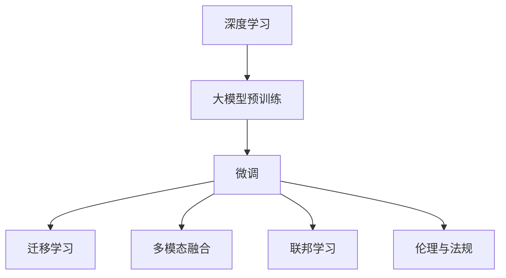

                 

## 1. 背景介绍

### 1.1 问题由来
近年来，人工智能（AI）技术在深度学习、自然语言处理（NLP）、计算机视觉（CV）等领域取得了显著进展。基于深度学习的大模型如BERT、GPT-3等，已经在多个任务上超越了传统机器学习算法，展示了强大的通用智能能力。这些大模型通常在大规模无监督数据上进行预训练，然后通过微调等方式适应特定任务，实现了泛化能力强、适应性广的模型效果。

### 1.2 问题核心关键点
新一代AI技术的应用场景主要围绕大数据、高算力、高精度的深度学习模型展开，旨在解决复杂、动态变化的数据处理和决策问题。其核心关键点包括：

- **大模型预训练**：通过在大规模无监督数据上进行预训练，模型可以学习到广泛的知识，具备强大的泛化能力。
- **微调技术**：通过在预训练模型的基础上，使用下游任务的少量标注数据进行微调，使其适应特定任务。
- **多模态融合**：结合视觉、语音、文本等多种数据源，提升模型对现实世界的理解和建模能力。
- **联邦学习**：通过分布式训练和协作学习，确保模型训练数据的安全性和隐私保护。
- **伦理与法规**：在模型开发和应用过程中，考虑数据隐私、偏见消除、安全防护等问题。

### 1.3 问题研究意义
研究新一代AI技术的应用场景和趋势，对于推动AI技术的产业化、提升各行业的智能化水平、促进社会公平与可持续发展具有重要意义：

1. **推动产业发展**：新一代AI技术能够帮助企业降低研发成本，缩短产品开发周期，提升市场竞争力。
2. **提升行业智能化水平**：AI技术在医疗、金融、制造、交通等领域的广泛应用，能够显著提高行业智能化水平，优化资源配置，提升效率和安全性。
3. **促进社会公平**：通过智能辅助决策，AI技术有助于消除社会不公，提升教育、医疗等公共服务的可及性和公平性。
4. **促进可持续发展**：AI技术在环境保护、能源管理、气候预测等方面的应用，有助于实现资源高效利用，推动绿色发展。

## 2. 核心概念与联系

### 2.1 核心概念概述

为更好地理解新一代AI技术的应用场景和趋势，本节将介绍几个关键概念及其之间的联系：

- **深度学习（Deep Learning）**：一种基于多层神经网络的机器学习技术，能够自动学习数据特征，用于图像识别、语音识别、自然语言处理等任务。
- **大模型（Large Model）**：指具有数亿或更多参数的深度学习模型，如BERT、GPT-3等，能够在大规模数据上进行预训练，具备强大的泛化能力。
- **微调（Fine-Tuning）**：指在预训练模型的基础上，使用下游任务的少量标注数据进行微调，使其适应特定任务。
- **迁移学习（Transfer Learning）**：通过在大规模数据上预训练模型，然后在特定任务上微调，实现模型性能的提升。
- **多模态融合（Multi-modal Fusion）**：结合视觉、语音、文本等多种数据源，提升模型的综合处理能力。
- **联邦学习（Federated Learning）**：通过分布式计算和数据集的分散性，实现模型训练的隐私保护和数据安全。
- **伦理与法规（Ethics & Regulations）**：在模型开发和应用过程中，考虑数据隐私、偏见消除、安全防护等问题，确保技术的健康发展。

这些概念之间存在紧密的联系，通过合理的组合和优化，新一代AI技术能够在各种场景下发挥出其独特的优势，解决复杂、动态变化的数据处理和决策问题。

### 2.2 核心概念原理和架构的 Mermaid 流程图



这个流程图展示了新一代AI技术的基本框架及其关键技术环节：

1. **深度学习**：作为基础技术，深度学习为复杂问题的解决提供了强大的工具。
2. **大模型预训练**：在大规模数据上进行预训练，学习到广泛的知识，为后续任务提供强有力的基础。
3. **微调**：在预训练模型的基础上，使用下游任务的少量标注数据进行微调，提升模型适应性。
4. **迁移学习**：通过在大规模数据上预训练模型，然后在特定任务上微调，实现模型性能的提升。
5. **多模态融合**：结合视觉、语音、文本等多种数据源，提升模型的综合处理能力。
6. **联邦学习**：通过分布式计算和数据集的分散性，实现模型训练的隐私保护和数据安全。
7. **伦理与法规**：在模型开发和应用过程中，考虑数据隐私、偏见消除、安全防护等问题，确保技术的健康发展。

这些技术环节相互依赖、相互促进，共同构建起新一代AI技术的应用框架。

## 3. 核心算法原理 & 具体操作步骤

### 3.1 算法原理概述

新一代AI技术的核心算法原理主要基于深度学习框架，通过大模型预训练和多模态融合，结合联邦学习和微调技术，解决复杂、动态变化的数据处理和决策问题。

具体而言，新一代AI技术的应用场景通常包括以下几个关键步骤：

1. **数据收集与预处理**：从不同来源收集数据，并进行清洗、标注等预处理。
2. **大模型预训练**：在大规模无监督数据上进行预训练，学习到广泛的知识。
3. **微调**：在预训练模型的基础上，使用下游任务的少量标注数据进行微调，提升模型适应性。
4. **多模态融合**：结合视觉、语音、文本等多种数据源，提升模型的综合处理能力。
5. **联邦学习**：通过分布式计算和数据集的分散性，实现模型训练的隐私保护和数据安全。
6. **模型评估与部署**：对模型进行评估，确保其满足实际应用的需求，然后部署到生产环境。

### 3.2 算法步骤详解

#### 步骤1: 数据收集与预处理

- **数据收集**：从不同来源收集数据，包括文本、图像、音频等。
- **数据预处理**：对数据进行清洗、标注、归一化等预处理，确保数据质量和一致性。

#### 步骤2: 大模型预训练

- **选择预训练模型**：根据任务需求选择合适的预训练模型，如BERT、GPT-3等。
- **预训练数据集**：在大规模无监督数据上进行预训练，学习到广泛的知识。
- **模型优化**：通过调整超参数、优化算法等，提升模型的泛化能力。

#### 步骤3: 微调

- **选择微调数据集**：根据任务需求选择合适的微调数据集，通常为少量标注数据。
- **模型初始化**：将预训练模型初始化为微调模型的起点。
- **微调参数**：在微调数据集上进行微调，更新模型参数，提升模型适应性。

#### 步骤4: 多模态融合

- **数据融合**：将不同模态的数据融合在一起，形成统一的表示形式。
- **模型融合**：使用融合模型对融合后的数据进行处理，提升模型综合处理能力。

#### 步骤5: 联邦学习

- **数据集划分**：将数据集划分为多个子集，每个子集由不同的参与方持有。
- **分布式训练**：在每个参与方上进行模型训练，确保数据隐私和安全。
- **模型聚合**：将各个参与方的模型聚合，形成全局模型，提升模型性能。

#### 步骤6: 模型评估与部署

- **模型评估**：使用测试集对模型进行评估，确保其满足实际应用的需求。
- **模型部署**：将模型部署到生产环境，进行实时推理和决策。

### 3.3 算法优缺点

新一代AI技术的优点包括：

- **泛化能力强**：通过预训练和微调，模型能够在大规模数据上学习到广泛的知识，具备较强的泛化能力。
- **适应性强**：通过多模态融合和联邦学习，模型能够适应不同来源、不同格式的数据，提升模型的鲁棒性和可扩展性。
- **隐私保护**：通过联邦学习，模型训练过程可以避免数据的集中存储和传输，确保数据隐私和安全。

然而，该技术也存在一些缺点：

- **数据依赖性高**：模型需要大量高质量的数据进行预训练和微调，获取数据的成本较高。
- **计算资源需求高**：大模型的训练和推理需要大量的计算资源，包括高性能GPU、TPU等。
- **复杂度高**：模型训练和优化过程复杂，需要专业知识和技术积累。
- **伦理和法律问题**：在模型开发和应用过程中，需要考虑数据隐私、偏见消除、安全防护等问题，确保技术的健康发展。

### 3.4 算法应用领域

新一代AI技术在多个领域得到了广泛应用，包括但不限于：

- **医疗健康**：AI技术在医疗影像分析、疾病预测、个性化治疗等方面得到了广泛应用，提升了医疗服务的智能化水平。
- **金融服务**：AI技术在风险评估、信用评分、自动化交易等方面得到了应用，提高了金融服务的效率和精准度。
- **智能制造**：AI技术在设备预测维护、生产优化、质量控制等方面得到了应用，提升了制造业的智能化水平。
- **交通运输**：AI技术在自动驾驶、智能交通管理、物流优化等方面得到了应用，提升了交通系统的效率和安全性。
- **教育培训**：AI技术在智能辅导、个性化推荐、情感分析等方面得到了应用，提升了教育培训的个性化和效率。
- **公共安全**：AI技术在视频监控、犯罪预测、紧急响应等方面得到了应用，提升了公共安全管理水平。

## 4. 数学模型和公式 & 详细讲解 & 举例说明

### 4.1 数学模型构建

新一代AI技术的数学模型通常基于深度学习框架，通过大模型预训练和多模态融合，结合联邦学习和微调技术，解决复杂、动态变化的数据处理和决策问题。

#### 步骤1: 数据收集与预处理

- **数据收集**：从不同来源收集数据，包括文本、图像、音频等。
- **数据预处理**：对数据进行清洗、标注、归一化等预处理，确保数据质量和一致性。

#### 步骤2: 大模型预训练

- **选择预训练模型**：根据任务需求选择合适的预训练模型，如BERT、GPT-3等。
- **预训练数据集**：在大规模无监督数据上进行预训练，学习到广泛的知识。
- **模型优化**：通过调整超参数、优化算法等，提升模型的泛化能力。

#### 步骤3: 微调

- **选择微调数据集**：根据任务需求选择合适的微调数据集，通常为少量标注数据。
- **模型初始化**：将预训练模型初始化为微调模型的起点。
- **微调参数**：在微调数据集上进行微调，更新模型参数，提升模型适应性。

#### 步骤4: 多模态融合

- **数据融合**：将不同模态的数据融合在一起，形成统一的表示形式。
- **模型融合**：使用融合模型对融合后的数据进行处理，提升模型综合处理能力。

#### 步骤5: 联邦学习

- **数据集划分**：将数据集划分为多个子集，每个子集由不同的参与方持有。
- **分布式训练**：在每个参与方上进行模型训练，确保数据隐私和安全。
- **模型聚合**：将各个参与方的模型聚合，形成全局模型，提升模型性能。

#### 步骤6: 模型评估与部署

- **模型评估**：使用测试集对模型进行评估，确保其满足实际应用的需求。
- **模型部署**：将模型部署到生产环境，进行实时推理和决策。

### 4.2 公式推导过程

以下以图像分类任务为例，推导基于大模型预训练的微调过程。

假设预训练模型为 $M_{\theta}$，其中 $\theta$ 为预训练得到的模型参数。给定下游任务 $T$ 的训练集 $D=\{(x_i,y_i)\}_{i=1}^N$，其中 $x_i$ 为输入图像，$y_i$ 为标签。微调的目标是找到新的模型参数 $\hat{\theta}$，使得：

$$
\hat{\theta}=\mathop{\arg\min}_{\theta} \mathcal{L}(M_{\theta},D)
$$

其中 $\mathcal{L}$ 为针对任务 $T$ 设计的损失函数，用于衡量模型预测输出与真实标签之间的差异。常见的损失函数包括交叉熵损失、均方误差损失等。

通过梯度下降等优化算法，微调过程不断更新模型参数 $\theta$，最小化损失函数 $\mathcal{L}$，使得模型输出逼近真实标签。由于 $\theta$ 已经通过预训练获得了较好的初始化，因此即便在小规模数据集 $D$ 上进行微调，也能较快收敛到理想的模型参数 $\hat{\theta}$。

### 4.3 案例分析与讲解

假设我们使用BERT模型进行文本分类任务的微调。首先需要收集一组标注数据，例如电影评论的正面和负面情感标注数据。然后对BERT模型进行微调，具体步骤如下：

1. **数据预处理**：将文本数据转换为BERT模型可以处理的格式，如分词、编码等。
2. **模型初始化**：使用预训练的BERT模型作为微调模型的起点。
3. **微调参数**：在标注数据上进行微调，更新模型参数。
4. **模型评估**：使用测试集对微调后的模型进行评估，计算分类精度等指标。
5. **模型部署**：将微调后的模型部署到生产环境，进行实时推理和决策。

## 5. 项目实践：代码实例和详细解释说明

### 5.1 开发环境搭建

在进行项目实践前，我们需要准备好开发环境。以下是使用Python进行PyTorch开发的环境配置流程：

1. 安装Anaconda：从官网下载并安装Anaconda，用于创建独立的Python环境。

2. 创建并激活虚拟环境：
```bash
conda create -n pytorch-env python=3.8 
conda activate pytorch-env
```

3. 安装PyTorch：根据CUDA版本，从官网获取对应的安装命令。例如：
```bash
conda install pytorch torchvision torchaudio cudatoolkit=11.1 -c pytorch -c conda-forge
```

4. 安装Transformers库：
```bash
pip install transformers
```

5. 安装各类工具包：
```bash
pip install numpy pandas scikit-learn matplotlib tqdm jupyter notebook ipython
```

完成上述步骤后，即可在`pytorch-env`环境中开始项目实践。

### 5.2 源代码详细实现

下面我们以图像分类任务为例，给出使用Transformers库对BERT模型进行微调的PyTorch代码实现。

首先，定义图像分类任务的数据处理函数：

```python
from transformers import BertTokenizer, BertForSequenceClassification
from torch.utils.data import Dataset
import torch

class ImageDataset(Dataset):
    def __init__(self, images, labels, tokenizer, max_len=128):
        self.images = images
        self.labels = labels
        self.tokenizer = tokenizer
        self.max_len = max_len
        
    def __len__(self):
        return len(self.images)
    
    def __getitem__(self, item):
        image = self.images[item]
        label = self.labels[item]
        
        encoding = self.tokenizer(image, return_tensors='pt', max_length=self.max_len, padding='max_length', truncation=True)
        input_ids = encoding['input_ids'][0]
        attention_mask = encoding['attention_mask'][0]
        
        # 将标签转换为id
        label_id = label2id[label]
        
        return {'input_ids': input_ids, 
                'attention_mask': attention_mask,
                'label_id': label_id}

# 标签与id的映射
label2id = {'positive': 1, 'negative': 0}
id2label = {v: k for k, v in label2id.items()}
```

然后，定义模型和优化器：

```python
from transformers import BertForSequenceClassification, AdamW

model = BertForSequenceClassification.from_pretrained('bert-base-cased', num_labels=len(label2id))

optimizer = AdamW(model.parameters(), lr=2e-5)
```

接着，定义训练和评估函数：

```python
from torch.utils.data import DataLoader
from tqdm import tqdm
from sklearn.metrics import classification_report

device = torch.device('cuda') if torch.cuda.is_available() else torch.device('cpu')
model.to(device)

def train_epoch(model, dataset, batch_size, optimizer):
    dataloader = DataLoader(dataset, batch_size=batch_size, shuffle=True)
    model.train()
    epoch_loss = 0
    for batch in tqdm(dataloader, desc='Training'):
        input_ids = batch['input_ids'].to(device)
        attention_mask = batch['attention_mask'].to(device)
        label_id = batch['label_id'].to(device)
        model.zero_grad()
        outputs = model(input_ids, attention_mask=attention_mask, labels=label_id)
        loss = outputs.loss
        epoch_loss += loss.item()
        loss.backward()
        optimizer.step()
    return epoch_loss / len(dataloader)

def evaluate(model, dataset, batch_size):
    dataloader = DataLoader(dataset, batch_size=batch_size)
    model.eval()
    preds, labels = [], []
    with torch.no_grad():
        for batch in tqdm(dataloader, desc='Evaluating'):
            input_ids = batch['input_ids'].to(device)
            attention_mask = batch['attention_mask'].to(device)
            label_id = batch['label_id']
            outputs = model(input_ids, attention_mask=attention_mask)
            batch_preds = outputs.logits.argmax(dim=1).to('cpu').tolist()
            batch_labels = label_id.to('cpu').tolist()
            for pred, label in zip(batch_preds, batch_labels):
                preds.append(pred)
                labels.append(label)
                
    print(classification_report(labels, preds))
```

最后，启动训练流程并在测试集上评估：

```python
epochs = 5
batch_size = 16

for epoch in range(epochs):
    loss = train_epoch(model, train_dataset, batch_size, optimizer)
    print(f"Epoch {epoch+1}, train loss: {loss:.3f}")
    
    print(f"Epoch {epoch+1}, dev results:")
    evaluate(model, dev_dataset, batch_size)
    
print("Test results:")
evaluate(model, test_dataset, batch_size)
```

以上就是使用PyTorch对BERT进行图像分类任务微调的完整代码实现。可以看到，得益于Transformers库的强大封装，我们可以用相对简洁的代码完成BERT模型的加载和微调。

### 5.3 代码解读与分析

让我们再详细解读一下关键代码的实现细节：

**ImageDataset类**：
- `__init__`方法：初始化图像、标签、分词器等关键组件。
- `__len__`方法：返回数据集的样本数量。
- `__getitem__`方法：对单个样本进行处理，将图像输入转换为token ids，将标签转换为数字，并对其进行定长padding，最终返回模型所需的输入。

**label2id和id2label字典**：
- 定义了标签与数字id之间的映射关系，用于将预测结果解码回真实的标签。

**训练和评估函数**：
- 使用PyTorch的DataLoader对数据集进行批次化加载，供模型训练和推理使用。
- 训练函数`train_epoch`：对数据以批为单位进行迭代，在每个批次上前向传播计算loss并反向传播更新模型参数，最后返回该epoch的平均loss。
- 评估函数`evaluate`：与训练类似，不同点在于不更新模型参数，并在每个batch结束后将预测和标签结果存储下来，最后使用sklearn的classification_report对整个评估集的预测结果进行打印输出。

**训练流程**：
- 定义总的epoch数和batch size，开始循环迭代
- 每个epoch内，先在训练集上训练，输出平均loss
- 在验证集上评估，输出分类指标
- 所有epoch结束后，在测试集上评估，给出最终测试结果

可以看到，PyTorch配合Transformers库使得BERT微调的代码实现变得简洁高效。开发者可以将更多精力放在数据处理、模型改进等高层逻辑上，而不必过多关注底层的实现细节。

当然，工业级的系统实现还需考虑更多因素，如模型的保存和部署、超参数的自动搜索、更灵活的任务适配层等。但核心的微调范式基本与此类似。

## 6. 实际应用场景

### 6.1 智能客服系统

基于大语言模型微调的对话技术，可以广泛应用于智能客服系统的构建。传统客服往往需要配备大量人力，高峰期响应缓慢，且一致性和专业性难以保证。而使用微调后的对话模型，可以7x24小时不间断服务，快速响应客户咨询，用自然流畅的语言解答各类常见问题。

在技术实现上，可以收集企业内部的历史客服对话记录，将问题和最佳答复构建成监督数据，在此基础上对预训练对话模型进行微调。微调后的对话模型能够自动理解用户意图，匹配最合适的答案模板进行回复。对于客户提出的新问题，还可以接入检索系统实时搜索相关内容，动态组织生成回答。如此构建的智能客服系统，能大幅提升客户咨询体验和问题解决效率。

### 6.2 金融舆情监测

金融机构需要实时监测市场舆论动向，以便及时应对负面信息传播，规避金融风险。传统的人工监测方式成本高、效率低，难以应对网络时代海量信息爆发的挑战。基于大语言模型微调的文本分类和情感分析技术，为金融舆情监测提供了新的解决方案。

具体而言，可以收集金融领域相关的新闻、报道、评论等文本数据，并对其进行主题标注和情感标注。在此基础上对预训练语言模型进行微调，使其能够自动判断文本属于何种主题，情感倾向是正面、中性还是负面。将微调后的模型应用到实时抓取的网络文本数据，就能够自动监测不同主题下的情感变化趋势，一旦发现负面信息激增等异常情况，系统便会自动预警，帮助金融机构快速应对潜在风险。

### 6.3 个性化推荐系统

当前的推荐系统往往只依赖用户的历史行为数据进行物品推荐，无法深入理解用户的真实兴趣偏好。基于大语言模型微调技术，个性化推荐系统可以更好地挖掘用户行为背后的语义信息，从而提供更精准、多样的推荐内容。

在实践中，可以收集用户浏览、点击、评论、分享等行为数据，提取和用户交互的物品标题、描述、标签等文本内容。将文本内容作为模型输入，用户的后续行为（如是否点击、购买等）作为监督信号，在此基础上微调预训练语言模型。微调后的模型能够从文本内容中准确把握用户的兴趣点。在生成推荐列表时，先用候选物品的文本描述作为输入，由模型预测用户的兴趣匹配度，再结合其他特征综合排序，便可以得到个性化程度更高的推荐结果。

### 6.4 未来应用展望

随着大语言模型微调技术的发展，基于微调范式将在更多领域得到应用，为传统行业带来变革性影响。

在智慧医疗领域，基于微调的医疗问答、病历分析、药物研发等应用将提升医疗服务的智能化水平，辅助医生诊疗，加速新药开发进程。

在智能教育领域，微调技术可应用于作业批改、学情分析、知识推荐等方面，因材施教，促进教育公平，提高教学质量。

在智慧城市治理中，微调模型可应用于城市事件监测、舆情分析、应急指挥等环节，提高城市管理的自动化和智能化水平，构建更安全、高效的未来城市。

此外，在企业生产、社会治理、文娱传媒等众多领域，基于大模型微调的人工智能应用也将不断涌现，为经济社会发展注入新的动力。相信随着技术的日益成熟，微调方法将成为人工智能落地应用的重要范式，推动人工智能技术在垂直行业的规模化落地。总之，微调需要开发者根据具体任务，不断迭代和优化模型、数据和算法，方能得到理想的效果。

## 7. 工具和资源推荐

### 7.1 学习资源推荐

为了帮助开发者系统掌握新一代AI技术的应用场景和趋势，这里推荐一些优质的学习资源：

1. 《深度学习》系列课程：由斯坦福大学、Coursera等机构开设的深度学习相关课程，涵盖深度学习基础、卷积神经网络、循环神经网络等内容。
2. 《自然语言处理》系列课程：由MIT、Stanford等机构开设的自然语言处理相关课程，涵盖文本分类、机器翻译、序列标注等内容。
3. 《计算机视觉》系列课程：由Coursera、edX等机构开设的计算机视觉相关课程，涵盖图像识别、目标检测、图像生成等内容。
4. 《联邦学习》课程：由Tsinghua University、CMU等机构开设的联邦学习相关课程，涵盖分布式训练、隐私保护、模型聚合等内容。
5. 《人工智能伦理》课程：由Tsinghua University、Harvard University等机构开设的人工智能伦理相关课程，涵盖数据隐私、算法偏见、安全防护等内容。

通过对这些资源的学习实践，相信你一定能够快速掌握新一代AI技术的应用场景和趋势，并用于解决实际的AI问题。
###  7.2 开发工具推荐

高效的开发离不开优秀的工具支持。以下是几款用于新一代AI技术开发的常用工具：

1. PyTorch：基于Python的开源深度学习框架，灵活动态的计算图，适合快速迭代研究。大部分预训练语言模型都有PyTorch版本的实现。
2. TensorFlow：由Google主导开发的开源深度学习框架，生产部署方便，适合大规模工程应用。同样有丰富的预训练语言模型资源。
3. Transformers库：HuggingFace开发的NLP工具库，集成了众多SOTA语言模型，支持PyTorch和TensorFlow，是进行AI技术开发的利器。
4. Weights & Biases：模型训练的实验跟踪工具，可以记录和可视化模型训练过程中的各项指标，方便对比和调优。与主流深度学习框架无缝集成。
5. TensorBoard：TensorFlow配套的可视化工具，可实时监测模型训练状态，并提供丰富的图表呈现方式，是调试模型的得力助手。
6. Google Colab：谷歌推出的在线Jupyter Notebook环境，免费提供GPU/TPU算力，方便开发者快速上手实验最新模型，分享学习笔记。

合理利用这些工具，可以显著提升新一代AI技术的开发效率，加快创新迭代的步伐。

### 7.3 相关论文推荐

新一代AI技术的发展源于学界的持续研究。以下是几篇奠基性的相关论文，推荐阅读：

1. Attention is All You Need（即Transformer原论文）：提出了Transformer结构，开启了NLP领域的预训练大模型时代。
2. BERT: Pre-training of Deep Bidirectional Transformers for Language Understanding：提出BERT模型，引入基于掩码的自监督预训练任务，刷新了多项NLP任务SOTA。
3. Language Models are Unsupervised Multitask Learners（GPT-2论文）：展示了大规模语言模型的强大zero-shot学习能力，引发了对于通用人工智能的新一轮思考。
4. Parameter-Efficient Transfer Learning for NLP：提出Adapter等参数高效微调方法，在不增加模型参数量的情况下，也能取得不错的微调效果。
5. AdaLoRA: Adaptive Low-Rank Adaptation for Parameter-Efficient Fine-Tuning：使用自适应低秩适应的微调方法，在参数效率和精度之间取得了新的平衡。
6. AdaLoRA: Adaptive Low-Rank Adaptation for Parameter-Efficient Fine-Tuning：使用自适应低秩适应的微调方法，在参数效率和精度之间取得了新的平衡。
7. Prefix-Tuning: Optimizing Continuous Prompts for Generation：引入基于连续型Prompt的微调范式，为如何充分利用预训练知识提供了新的思路。

这些论文代表了大语言模型微调技术的发展脉络。通过学习这些前沿成果，可以帮助研究者把握学科前进方向，激发更多的创新灵感。

## 8. 总结：未来发展趋势与挑战

### 8.1 总结

本文对新一代AI技术的应用场景和趋势进行了全面系统的介绍。首先阐述了深度学习、大模型预训练、微调、多模态融合、联邦学习等核心技术的应用场景及其重要性，明确了新一代AI技术在多个领域中的独特价值。其次，从原理到实践，详细讲解了新一代AI技术的数学模型和关键步骤，给出了具体案例和代码实现。同时，本文还广泛探讨了新一代AI技术在智能客服、金融舆情、个性化推荐等多个行业领域的应用前景，展示了新一代AI技术的广泛应用。此外，本文精选了新一代AI技术的各类学习资源，力求为开发者提供全方位的技术指引。

通过本文的系统梳理，可以看到，新一代AI技术在深度学习框架的支撑下，通过大模型预训练和多模态融合，结合联邦学习和微调技术，解决复杂、动态变化的数据处理和决策问题，具备广阔的应用前景。得益于预训练模型的强大泛化能力和微调技术的灵活适配能力，新一代AI技术能够在各种场景下发挥出其独特的优势，推动AI技术的产业化进程。未来，随着大模型预训练和多模态融合技术的发展，新一代AI技术的应用场景将更加丰富，性能也将更加强大。

### 8.2 未来发展趋势

展望未来，新一代AI技术将呈现以下几个发展趋势：

1. **预训练模型规模持续增大**：随着算力成本的下降和数据规模的扩张，预训练模型的参数量将继续增长，能够在大规模数据上学习到更广泛的知识，提升模型的泛化能力。
2. **微调技术日趋多样**：未来将涌现更多参数高效和多模态融合的微调方法，在节省计算资源的同时保证微调精度。
3. **联邦学习成为常态**：分布式计算和数据集的分散性将进一步促进联邦学习的应用，实现模型训练的隐私保护和数据安全。
4. **实时推理与动态更新**：通过分布式推理和增量学习，新一代AI技术将能够实时处理动态数据，实现模型的动态更新和优化。
5. **多模态融合与协同建模**：结合视觉、语音、文本等多种数据源，提升模型的综合处理能力，实现多模态信息的协同建模。
6. **伦理与法规意识增强**：在模型开发和应用过程中，考虑数据隐私、偏见消除、安全防护等问题，确保技术的健康发展。

### 8.3 面临的挑战

尽管新一代AI技术已经取得了显著进展，但在迈向更加智能化、普适化应用的过程中，仍面临诸多挑战：

1. **数据获取成本高**：尽管微调技术可以降低对标注数据的依赖，但对于大规模、高质量标注数据的获取仍需高成本。
2. **计算资源需求大**：大模型的训练和推理需要大量的计算资源，包括高性能GPU、TPU等。
3. **模型复杂度高**：新一代AI技术的训练和优化过程复杂，需要专业知识和技术积累。
4. **伦理和法律问题**：在模型开发和应用过程中，需要考虑数据隐私、偏见消除、安全防护等问题，确保技术的健康发展。

### 8.4 研究展望

面对新一代AI技术所面临的挑战，未来的研究需要在以下几个方面寻求新的突破：

1. **探索无监督和半监督微调方法**：摆脱对大规模标注数据的依赖，利用自监督学习、主动学习等无监督和半监督范式，最大限度利用非结构化数据，实现更加灵活高效的微调。
2. **研究参数高效和计算高效的微调范式**：开发更加参数高效和多模态融合的微调方法，在节省计算资源的同时保证微调精度。
3. **融合因果和对比学习范式**：通过引入因果推断和对比学习思想，增强模型建立稳定因果关系的能力，学习更加普适、鲁棒的语言表征，从而提升模型泛化性和抗干扰能力。
4. **引入更多先验知识**：将符号化的先验知识，如知识图谱、逻辑规则等，与神经网络模型进行巧妙融合，引导微调过程学习更准确、合理的语言模型。
5. **结合因果分析和博弈论工具**：将因果分析方法引入微调模型，识别出模型决策的关键特征，增强输出解释的因果性和逻辑性。借助博弈论工具刻画人机交互过程，主动探索并规避模型的脆弱点，提高系统稳定性。
6. **纳入伦理道德约束**：在模型训练目标中引入伦理导向的评估指标，过滤和惩罚有偏见、有害的输出倾向。同时加强人工干预和审核，建立模型行为的监管机制，确保输出符合人类价值观和伦理道德。

## 9. 附录：常见问题与解答

**Q1：新一代AI技术是否适用于所有NLP任务？**

A: 新一代AI技术在大多数NLP任务上都能取得不错的效果，特别是对于数据量较小的任务。但对于一些特定领域的任务，如医学、法律等，仅仅依靠通用语料预训练的模型可能难以很好地适应。此时需要在特定领域语料上进一步预训练，再进行微调，才能获得理想效果。此外，对于一些需要时效性、个性化很强的任务，如对话、推荐等，微调方法也需要针对性的改进优化。

**Q2：微调过程中如何选择合适的学习率？**

A: 微调的学习率一般要比预训练时小1-2个数量级，如果使用过大的学习率，容易破坏预训练权重，导致过拟合。一般建议从1e-5开始调参，逐步减小学习率，直至收敛。也可以使用warmup策略，在开始阶段使用较小的学习率，再逐渐过渡到预设值。需要注意的是，不同的优化器(如AdamW、Adafactor等)以及不同的学习率调度策略，可能需要设置不同的学习率阈值。

**Q3：采用大模型微调时会面临哪些资源瓶颈？**

A: 目前主流的预训练大模型动辄以亿计的参数规模，对算力、内存、存储都提出了很高的要求。GPU/TPU等高性能设备是必不可少的，但即便如此，超大批次的训练和推理也可能遇到显存不足的问题。因此需要采用一些资源优化技术，如梯度积累、混合精度训练、模型并行等，来突破硬件瓶颈。同时，模型的存储和读取也可能占用大量时间和空间，需要采用模型压缩、稀疏化存储等方法进行优化。

**Q4：如何缓解微调过程中的过拟合问题？**

A: 过拟合是微调面临的主要挑战，尤其是在标注数据不足的情况下。常见的缓解策略包括：
1. 数据增强：通过回译、近义替换等方式扩充训练集
2. 正则化：使用L2正则、Dropout、Early Stopping等避免过拟合
3. 对抗训练：引入对抗样本，提高模型鲁棒性
4. 参数高效微调：只调整少量参数(如Adapter、Prefix等)，减小过拟合风险
5. 多模型集成：训练多个微调模型，取平均输出，抑制过拟合

这些策略往往需要根据具体任务和数据特点进行灵活组合。只有在数据、模型、训练、推理等各环节进行全面优化，才能最大限度地发挥大模型微调的威力。

**Q5：微调模型在落地部署时需要注意哪些问题？**

A: 将微调模型转化为实际应用，还需要考虑以下因素：
1. 模型裁剪：去除不必要的层和参数，减小模型尺寸，加快推理速度
2. 量化加速：将浮点模型转为定点模型，压缩存储空间，提高计算效率
3. 服务化封装：将模型封装为标准化服务接口，便于集成调用
4. 弹性伸缩：根据请求流量动态调整资源配置，平衡服务质量和成本
5. 监控告警：实时采集系统指标，设置异常告警阈值，确保服务稳定性
6. 安全防护：采用访问鉴权、数据脱敏等措施，保障数据和模型安全

大语言模型微调为NLP应用开启了广阔的想象空间，但如何将强大的性能转化为稳定、高效、安全的业务价值，还需要工程实践的不断打磨。唯有从数据、算法、工程、业务等多个维度协同发力，才能真正实现人工智能技术在垂直行业的规模化落地。总之，微调需要开发者根据具体任务，不断迭代和优化模型、数据和算法，方能得到理想的效果。

