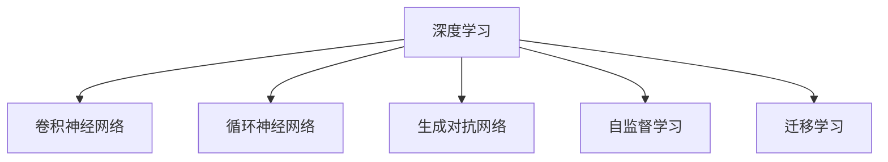

                 

# 新的AI技术栈与传统机器学习工程的区别

在过去的几十年中，机器学习（ML）作为人工智能（AI）的一个分支，一直是数据科学家和工程师们的工具，用于从数据中提取模式并做出预测。然而，随着深度学习（DL）和人工智能技术的发展，AI技术栈正在经历一场革命。本文将探讨新的AI技术栈与传统机器学习工程的区别，以及这些差异如何影响技术的开发和应用。

## 1. 背景介绍

### 1.1 历史背景
传统机器学习工程主要依赖于统计学和数学理论，通过对历史数据的分析来建立预测模型。这些模型通常使用诸如逻辑回归、支持向量机（SVM）、决策树和随机森林等算法。在过去，这些技术需要高度的数学知识、大量的特征工程，以及长时间的模型训练和调参。

随着深度学习的发展，尤其是神经网络在图像识别、语音处理和自然语言处理（NLP）等领域的成功应用，AI技术栈开始转向使用深度神经网络。这些模型能够从原始数据中自动提取特征，并且可以在大规模并行计算设备上进行高效训练，大大简化了机器学习模型的开发过程。

### 1.2 现代背景
目前，AI技术栈包括多个层次的技术，如图表神经网络（CNNs）、递归神经网络（RNNs）、生成对抗网络（GANs）等。这些技术的共同点是利用大量数据和强大的计算资源进行训练，以产生高精度的模型。这些模型通常使用诸如TensorFlow、PyTorch等深度学习框架进行训练和部署。

## 2. 核心概念与联系

### 2.1 核心概念概述
为了更好地理解新的AI技术栈与传统机器学习工程的区别，本节将介绍几个密切相关的核心概念：

- **深度学习**：一种使用多层神经网络进行特征提取和建模的技术。
- **卷积神经网络（CNNs）**：用于处理图像和视频数据的深度学习模型。
- **循环神经网络（RNNs）**：用于处理序列数据（如文本和时间序列数据）的深度学习模型。
- **生成对抗网络（GANs）**：一种训练两个神经网络的技术，一个生成器和一个判别器，以生成与真实数据无法区分的样本。
- **自监督学习**：使用无标签数据进行预训练，学习数据的内在结构。
- **迁移学习**：将一个任务上学习到的知识迁移到另一个相关任务上，以减少新任务的学习成本。

这些核心概念之间的逻辑关系可以通过以下Mermaid流程图来展示：



这个流程图展示了深度学习与CNNs、RNNs、GANs、自监督学习和迁移学习等核心概念之间的联系。这些概念共同构成了新的AI技术栈的基础，使得AI模型能够处理复杂的数据和任务。

## 3. 核心算法原理 & 具体操作步骤

### 3.1 算法原理概述
新的AI技术栈与传统机器学习工程之间的区别在于其核心算法原理。深度学习模型通常采用非线性变换来捕捉复杂数据中的非线性关系，并且能够自动学习特征。相比之下，传统机器学习模型需要手动选择和提取特征，并且在处理非线性关系时，通常依赖于复杂的特征工程。

深度学习模型还利用反向传播算法和优化器来更新模型参数，以最小化损失函数。这种端到端的学习方式使得模型可以同时学习输入特征和输出标签，并且能够处理高维数据。相比之下，传统机器学习模型通常需要手动设计和优化损失函数，并且依赖于手工选择的特征。

### 3.2 算法步骤详解
以下是新的AI技术栈与传统机器学习工程在训练步骤上的主要区别：

**深度学习模型的训练步骤**：
1. **数据准备**：收集并处理数据，以确保数据的质量和可用性。
2. **模型定义**：使用深度学习框架定义模型结构，包括层数、节点数等。
3. **损失函数定义**：定义适用于特定任务的损失函数，如交叉熵、均方误差等。
4. **优化器选择**：选择合适的优化器，如Adam、SGD等。
5. **训练过程**：在训练集上迭代训练模型，最小化损失函数。
6. **验证和调整**：在验证集上评估模型性能，根据需要进行模型调整。
7. **测试过程**：在测试集上评估模型性能，并根据需要进行调整。

**传统机器学习模型的训练步骤**：
1. **数据准备**：收集并处理数据，以确保数据的质量和可用性。
2. **特征工程**：选择和提取与任务相关的特征。
3. **模型选择**：选择适合的机器学习算法，如逻辑回归、SVM、决策树等。
4. **训练过程**：在训练集上迭代训练模型，最小化损失函数。
5. **验证和调整**：在验证集上评估模型性能，根据需要进行模型调整。
6. **测试过程**：在测试集上评估模型性能，并根据需要进行调整。

### 3.3 算法优缺点
新的AI技术栈与传统机器学习工程各有优缺点。

**深度学习的优点**：
1. **自动特征提取**：深度学习模型能够自动学习数据中的特征，减少了手工特征工程的复杂性。
2. **处理复杂数据**：深度学习模型能够处理高维数据，并且可以同时学习输入特征和输出标签。
3. **高精度**：深度学习模型通常能够产生高精度的预测。

**深度学习的缺点**：
1. **数据需求大**：深度学习模型需要大量数据进行训练，以避免过拟合。
2. **计算资源需求高**：深度学习模型需要大量的计算资源进行训练和推理。
3. **可解释性差**：深度学习模型通常被视为“黑箱”，难以解释其内部工作机制。

**传统机器学习的优点**：
1. **解释性强**：传统机器学习模型通常是可解释的，易于理解和调试。
2. **数据需求小**：传统机器学习模型通常对数据的需求较小，可以处理小规模数据。
3. **模型简单**：传统机器学习模型通常结构简单，易于实现。

**传统机器学习的缺点**：
1. **特征工程复杂**：传统机器学习模型需要手动选择和提取特征，增加了模型开发的复杂性。
2. **处理复杂数据能力弱**：传统机器学习模型在处理复杂数据时，通常需要依赖手工特征工程。
3. **精度较低**：传统机器学习模型通常精度较低，难以处理高维数据。

### 3.4 算法应用领域
新的AI技术栈在多个领域得到了广泛应用，例如：

- **计算机视觉**：使用CNNs进行图像分类、对象检测、图像生成等任务。
- **自然语言处理**：使用RNNs进行文本分类、情感分析、机器翻译等任务。
- **语音处理**：使用卷积神经网络和RNNs进行语音识别、说话人识别、语音合成等任务。
- **推荐系统**：使用深度学习模型进行个性化推荐。
- **游戏AI**：使用生成对抗网络进行游戏策略学习。
- **医学影像分析**：使用深度学习模型进行医学影像分类和分割。

## 4. 数学模型和公式 & 详细讲解 & 举例说明

### 4.1 数学模型构建
深度学习模型通常使用以下数学模型：

**卷积神经网络（CNNs）**：
- **输入层**：接受高维输入数据，如图像和视频。
- **卷积层**：通过卷积操作提取特征。
- **池化层**：通过降采样操作减少特征维度。
- **全连接层**：将特征映射到输出空间。

**递归神经网络（RNNs）**：
- **输入层**：接受序列数据，如文本和时间序列。
- **循环层**：通过循环结构处理序列数据。
- **输出层**：将序列数据映射到输出空间。

**生成对抗网络（GANs）**：
- **生成器**：通过神经网络生成与真实数据无法区分的样本。
- **判别器**：通过神经网络判断样本是否为真实数据。
- **损失函数**：定义生成器和判别器的损失函数，使得生成器生成的样本能够欺骗判别器。

### 4.2 公式推导过程
以下是CNNs、RNNs和GANs的公式推导过程：

**卷积神经网络（CNNs）**：
- **卷积层**：
  $$
  y^{(i)}=f(W^{(i)} * x^{(i)} + b^{(i)})
  $$
  其中 $x^{(i)}$ 是输入数据，$W^{(i)}$ 是卷积核，$b^{(i)}$ 是偏置，$f$ 是激活函数。
- **池化层**：
  $$
  y^{(i)}=\max_{j \in [1,...,H-2,K-2]} x^{(i+(j mod H),(k mod W)}
  $$
  其中 $H$ 和 $W$ 是池化核的高度和宽度。

**递归神经网络（RNNs）**：
- **前向传播**：
  $$
  h_t=\sigma(W h_{t-1} + U x_t + b_h)
  $$
  其中 $h_t$ 是隐藏状态，$\sigma$ 是激活函数。
- **后向传播**：
  $$
  \Delta h_t=W^T\Delta y_t \cdot f'(h_t)
  $$

**生成对抗网络（GANs）**：
- **生成器损失函数**：
  $$
  L_G=\mathbb{E}_{x \sim p_{data}} [D(G(x))] + \mathbb{E}_{z \sim p_z} [\log D(G(z))]
  $$
  其中 $D$ 是判别器，$G$ 是生成器，$z$ 是随机噪声。
- **判别器损失函数**：
  $$
  L_D=\mathbb{E}_{x \sim p_{data}} [\log D(x)] + \mathbb{E}_{z \sim p_z} [\log(1-D(G(z)))]
  $$

### 4.3 案例分析与讲解
以下是一个简单的图像分类案例，使用CNNs进行训练和测试：

**数据准备**：
- 收集和处理图像数据，如CIFAR-10数据集。
- 将数据划分为训练集和测试集。

**模型定义**：
- 使用PyTorch定义CNNs模型，包括卷积层、池化层和全连接层。
- 使用ReLU激活函数。

**损失函数和优化器**：
- 使用交叉熵损失函数。
- 使用Adam优化器，设置学习率为0.001。

**训练过程**：
- 在训练集上迭代训练模型，每批处理64张图像。
- 在验证集上评估模型性能，根据需要进行模型调整。

**测试过程**：
- 在测试集上评估模型性能。

## 5. 项目实践：代码实例和详细解释说明

### 5.1 开发环境搭建
在进行AI技术栈项目实践前，我们需要准备好开发环境。以下是使用Python进行PyTorch开发的环境配置流程：

1. 安装Anaconda：从官网下载并安装Anaconda，用于创建独立的Python环境。

2. 创建并激活虚拟环境：
```bash
conda create -n pytorch-env python=3.8 
conda activate pytorch-env
```

3. 安装PyTorch：根据CUDA版本，从官网获取对应的安装命令。例如：
```bash
conda install pytorch torchvision torchaudio cudatoolkit=11.1 -c pytorch -c conda-forge
```

4. 安装TensorBoard：
```bash
pip install tensorboard
```

5. 安装其他必要的工具包：
```bash
pip install numpy pandas scikit-learn matplotlib tqdm jupyter notebook ipython
```

完成上述步骤后，即可在`pytorch-env`环境中开始项目实践。

### 5.2 源代码详细实现
这里我们以手写数字识别为例，使用PyTorch实现CNNs模型。

首先，定义模型类：

```python
import torch
import torch.nn as nn
import torch.optim as optim

class CNN(nn.Module):
    def __init__(self):
        super(CNN, self).__init__()
        self.conv1 = nn.Conv2d(1, 32, 3, 1)
        self.pool = nn.MaxPool2d(2, 2)
        self.conv2 = nn.Conv2d(32, 64, 3, 1)
        self.fc1 = nn.Linear(64 * 28 * 28, 128)
        self.fc2 = nn.Linear(128, 10)

    def forward(self, x):
        x = self.pool(F.relu(self.conv1(x)))
        x = self.pool(F.relu(self.conv2(x)))
        x = x.view(-1, 64 * 28 * 28)
        x = F.relu(self.fc1(x))
        x = self.fc2(x)
        return x
```

然后，定义训练和评估函数：

```python
from torch.utils.data import DataLoader
from torchvision import datasets, transforms

# 定义数据增强操作
transform = transforms.Compose([
    transforms.ToTensor(),
    transforms.Normalize((0.5,), (0.5,))
])

# 加载训练集和测试集
train_dataset = datasets.MNIST('data/', train=True, download=True, transform=transform)
test_dataset = datasets.MNIST('data/', train=False, download=True, transform=transform)

# 划分训练集和验证集
train_loader = DataLoader(train_dataset, batch_size=64, shuffle=True)
test_loader = DataLoader(test_dataset, batch_size=64, shuffle=False)

# 定义模型和优化器
model = CNN()
criterion = nn.CrossEntropyLoss()
optimizer = optim.Adam(model.parameters(), lr=0.001)

# 定义训练和评估函数
def train(model, train_loader, optimizer, criterion, epochs):
    model.train()
    for epoch in range(epochs):
        for batch_idx, (data, target) in enumerate(train_loader):
            optimizer.zero_grad()
            output = model(data)
            loss = criterion(output, target)
            loss.backward()
            optimizer.step()
            if (batch_idx + 1) % 100 == 0:
                print('Train Epoch: {} [{}/{} ({:.0f}%)]\tLoss: {:.6f}'.format(
                    epoch, batch_idx * len(data), len(train_loader.dataset),
                    100. * batch_idx / len(train_loader), loss.item()))

def test(model, test_loader, criterion):
    model.eval()
    test_loss = 0
    correct = 0
    with torch.no_grad():
        for data, target in test_loader:
            output = model(data)
            test_loss += criterion(output, target).item()
            pred = output.argmax(dim=1, keepdim=True)
            correct += pred.eq(target.view_as(pred)).sum().item()

    print('\nTest set: Average loss: {:.4f}, Accuracy: {}/{} ({:.0f}%)\n'.format(
        test_loss / len(test_loader.dataset), correct, len(test_loader.dataset),
        100. * correct / len(test_loader.dataset)))
```

最后，启动训练流程并在测试集上评估：

```python
# 设置训练轮数
epochs = 10

# 训练模型
train(model, train_loader, optimizer, criterion, epochs)

# 在测试集上评估模型
test(model, test_loader, criterion)
```

以上就是使用PyTorch实现CNNs模型对手写数字识别任务进行训练和测试的完整代码实现。可以看到，利用深度学习框架，我们可以用相对简洁的代码完成模型的定义、训练和评估。

### 5.3 代码解读与分析
让我们再详细解读一下关键代码的实现细节：

**CNN类**：
- `__init__`方法：定义卷积层、池化层和全连接层。
- `forward`方法：定义模型的前向传播过程。

**训练函数**：
- 使用DataLoader对数据进行批次化加载，供模型训练和推理使用。
- 定义优化器和损失函数，并设置学习率。
- 在每个epoch内，对训练集数据进行迭代，计算损失函数并更新模型参数。
- 在验证集上评估模型性能，根据需要进行模型调整。

**测试函数**：
- 在测试集上评估模型性能，并打印输出。

## 6. 实际应用场景

### 6.1 自动驾驶

自动驾驶技术是深度学习在实际应用中的重要场景之一。传统的机器学习技术主要依赖于手工设计的特征，而深度学习模型可以自动从传感器数据中学习特征，提高了系统的准确性和鲁棒性。例如，卷积神经网络（CNNs）可以用于图像识别和目标检测，生成对抗网络（GANs）可以用于图像生成和合成。

### 6.2 医疗影像诊断

深度学习在医疗影像诊断领域也有广泛应用。传统的机器学习技术通常依赖于手工设计的特征，而深度学习模型可以直接从原始图像中提取特征，提高了诊断的准确性和效率。例如，卷积神经网络（CNNs）可以用于医学影像分类和分割，生成对抗网络（GANs）可以用于医学图像生成和增强。

### 6.3 自然语言处理

自然语言处理（NLP）是深度学习在实际应用中的另一个重要场景。传统的机器学习技术通常依赖于手工设计的特征，而深度学习模型可以直接从文本数据中学习特征，提高了NLP任务的性能。例如，递归神经网络（RNNs）可以用于文本分类和情感分析，生成对抗网络（GANs）可以用于文本生成和对话系统。

## 7. 工具和资源推荐

### 7.1 学习资源推荐

为了帮助开发者系统掌握深度学习技术的开发和应用，这里推荐一些优质的学习资源：

1. 《深度学习》系列书籍：由深度学习领域的专家撰写，系统介绍了深度学习的基本概念和经典算法。
2. 《Python深度学习》书籍：由深度学习领域的专家撰写，介绍了深度学习在Python中的实现。
3. Coursera深度学习课程：由斯坦福大学开设的深度学习课程，涵盖深度学习的基本概念和经典算法。
4. Udacity深度学习课程：由Udacity开设的深度学习课程，涵盖了深度学习在图像、文本和语音等领域的应用。

通过对这些资源的学习实践，相信你一定能够快速掌握深度学习技术的精髓，并用于解决实际的NLP问题。

### 7.2 开发工具推荐

高效的开发离不开优秀的工具支持。以下是几款用于深度学习开发和部署的常用工具：

1. PyTorch：基于Python的开源深度学习框架，灵活高效的计算图，适合快速迭代研究。
2. TensorFlow：由Google主导开发的开源深度学习框架，生产部署方便，适合大规模工程应用。
3. Keras：基于Python的高级深度学习框架，易于使用，适合快速原型开发。
4. MXNet：由亚马逊开发的高性能深度学习框架，支持多种语言和多种硬件平台。
5. Caffe：由Berkeley Vision and Learning Center开发的高性能深度学习框架，适合图像处理任务。

合理利用这些工具，可以显著提升深度学习模型的开发效率，加快创新迭代的步伐。

### 7.3 相关论文推荐

深度学习技术的发展源于学界的持续研究。以下是几篇奠基性的相关论文，推荐阅读：

1. ImageNet大规模视觉识别挑战（ImageNet Large Scale Visual Recognition Challenge, ImageNet LSVC）：提出ImageNet数据集，并展示了深度学习在图像识别任务上的强大能力。
2. Google的Inception：提出Inception模块，提高了深度学习模型的效率和性能。
3. Facebook的ResNet：提出残差连接模块，解决了深度网络训练中的梯度消失问题，提高了深度网络的深度。
4. OpenAI的GPT系列：提出生成对抗网络（GANs）和Transformer模型，展示了深度学习在自然语言处理任务上的强大能力。
5. AlphaGo：展示了深度学习在棋类游戏中的强大能力，推动了人工智能领域的发展。

这些论文代表了大深度学习技术的发展脉络。通过学习这些前沿成果，可以帮助研究者把握学科前进方向，激发更多的创新灵感。

## 8. 总结：未来发展趋势与挑战

### 8.1 总结

本文对新的AI技术栈与传统机器学习工程的区别进行了全面系统的介绍。首先阐述了深度学习与传统机器学习的核心算法原理，明确了两者之间的区别和联系。其次，从原理到实践，详细讲解了深度学习模型的训练步骤和数学模型，给出了深度学习模型在实际应用中的案例实现。同时，本文还广泛探讨了深度学习模型在自动驾驶、医疗影像诊断、自然语言处理等多个行业领域的应用前景，展示了深度学习技术在实际应用中的强大能力。此外，本文还精选了深度学习技术的各类学习资源，力求为读者提供全方位的技术指引。

通过本文的系统梳理，可以看到，深度学习技术正在成为AI领域的重要范式，极大地拓展了机器学习模型的应用边界，催生了更多的落地场景。得益于深度学习模型的强大计算能力和自动特征提取能力，AI技术栈将在更多领域得到应用，为人类认知智能的进化带来深远影响。

### 8.2 未来发展趋势

展望未来，深度学习技术将呈现以下几个发展趋势：

1. 深度学习模型的规模和复杂度将持续增大。随着算力成本的下降和数据规模的扩张，深度学习模型的参数量将继续增长，模型的深度和宽度也将进一步增加。超大规模深度学习模型蕴含的丰富语言知识，有望支撑更加复杂多变的下游任务。

2. 深度学习技术将进一步与传统机器学习技术融合。深度学习与传统机器学习技术的融合，将使得AI技术栈更加全面和多样化，能够处理更复杂的数据和任务。

3. 深度学习技术将进一步应用于更多的实际应用场景。深度学习技术在自动驾驶、医疗影像诊断、自然语言处理等领域的应用，将使得AI技术栈在实际应用中的价值得到进一步提升。

4. 深度学习技术将进一步扩展到更多行业。深度学习技术在智慧城市、金融、能源等领域的应用，将使得AI技术栈在更多垂直行业得到应用，推动人工智能技术的产业化进程。

以上趋势凸显了深度学习技术的广阔前景。这些方向的探索发展，必将进一步提升深度学习模型的性能和应用范围，为人类认知智能的进化带来深远影响。

### 8.3 面临的挑战

尽管深度学习技术已经取得了瞩目成就，但在迈向更加智能化、普适化应用的过程中，它仍面临着诸多挑战：

1. 数据需求高。深度学习模型需要大量数据进行训练，以避免过拟合。对于小规模数据集，模型容易过拟合。

2. 计算资源需求高。深度学习模型需要大量的计算资源进行训练和推理。对于资源有限的场景，模型训练和推理的效率不高。

3. 可解释性差。深度学习模型通常被视为“黑箱”，难以解释其内部工作机制。对于医疗、金融等高风险应用，算法的可解释性和可审计性尤为重要。

4. 模型鲁棒性不足。深度学习模型面对域外数据时，泛化性能往往大打折扣。对于测试样本的微小扰动，模型的预测也容易发生波动。

5. 训练时间长。深度学习模型需要长时间的训练和调参，才能得到理想的效果。

6. 数据隐私和安全问题。深度学习模型在处理敏感数据时，容易泄露用户的隐私信息，并可能存在安全隐患。

7. 伦理和社会问题。深度学习模型的应用，需要考虑伦理和社会问题，如算法偏见、社会公平等。

正视深度学习面临的这些挑战，积极应对并寻求突破，将使深度学习技术在迈向成熟的路上更进一步。相信随着学界和产业界的共同努力，这些挑战终将一一被克服，深度学习技术必将在构建人机协同的智能时代中扮演越来越重要的角色。

### 8.4 未来突破

面对深度学习技术所面临的种种挑战，未来的研究需要在以下几个方面寻求新的突破：

1. 探索无监督和半监督学习技术。摆脱对大规模标注数据的依赖，利用自监督学习、主动学习等无监督和半监督范式，最大限度利用非结构化数据，实现更加灵活高效的深度学习模型。

2. 研究参数高效和计算高效的深度学习范式。开发更加参数高效的深度学习模型，在固定大部分预训练参数的同时，只更新极少量的任务相关参数。同时优化深度学习模型的计算图，减少前向传播和反向传播的资源消耗，实现更加轻量级、实时性的部署。

3. 融合因果和对比学习范式。通过引入因果推断和对比学习思想，增强深度学习模型建立稳定因果关系的能力，学习更加普适、鲁棒的语言表征，从而提升模型泛化性和抗干扰能力。

4. 引入更多先验知识。将符号化的先验知识，如知识图谱、逻辑规则等，与深度学习模型进行巧妙融合，引导深度学习过程学习更准确、合理的语言模型。同时加强不同模态数据的整合，实现视觉、语音等多模态信息与文本信息的协同建模。

5. 结合因果分析和博弈论工具。将因果分析方法引入深度学习模型，识别出模型决策的关键特征，增强输出解释的因果性和逻辑性。借助博弈论工具刻画人机交互过程，主动探索并规避模型的脆弱点，提高系统稳定性。

6. 纳入伦理道德约束。在深度学习模型的训练目标中引入伦理导向的评估指标，过滤和惩罚有害的输出倾向。同时加强人工干预和审核，建立模型行为的监管机制，确保输出符合人类价值观和伦理道德。

这些研究方向的探索，必将引领深度学习技术迈向更高的台阶，为构建安全、可靠、可解释、可控的智能系统铺平道路。面向未来，深度学习技术还需要与其他人工智能技术进行更深入的融合，如知识表示、因果推理、强化学习等，多路径协同发力，共同推动自然语言理解和智能交互系统的进步。只有勇于创新、敢于突破，才能不断拓展深度学习模型的边界，让智能技术更好地造福人类社会。

## 9. 附录：常见问题与解答

**Q1：深度学习与传统机器学习相比，有哪些优势和劣势？**

A: 深度学习与传统机器学习相比，有以下优势：
1. 自动特征提取：深度学习模型能够自动学习数据中的特征，减少了手工特征工程的复杂性。
2. 处理复杂数据：深度学习模型能够处理高维数据，并且可以同时学习输入特征和输出标签。
3. 高精度：深度学习模型通常能够产生高精度的预测。

但深度学习也有一些劣势：
1. 数据需求大：深度学习模型需要大量数据进行训练，以避免过拟合。
2. 计算资源需求高：深度学习模型需要大量的计算资源进行训练和推理。
3. 可解释性差：深度学习模型通常被视为“黑箱”，难以解释其内部工作机制。

**Q2：深度学习技术在实际应用中，需要注意哪些问题？**

A: 深度学习技术在实际应用中，需要注意以下几个问题：
1. 数据准备：收集和处理数据，确保数据的质量和可用性。
2. 数据增强：通过回译、近义替换等方式扩充训练集，避免过拟合。
3. 正则化：使用L2正则、Dropout、Early Stopping等避免过拟合。
4. 对抗训练：引入对抗样本，提高模型鲁棒性。
5. 参数高效微调：只调整少量参数，减小过拟合风险。
6. 模型裁剪和量化：去除不必要的层和参数，减小模型尺寸，压缩存储空间，提高计算效率。
7. 服务化封装：将模型封装为标准化服务接口，便于集成调用。
8. 弹性伸缩：根据请求流量动态调整资源配置，平衡服务质量和成本。
9. 监控告警：实时采集系统指标，设置异常告警阈值，确保服务稳定性。
10. 安全防护：采用访问鉴权、数据脱敏等措施，保障数据和模型安全。

合理利用这些技术，可以显著提升深度学习模型的开发效率和性能，实现更加高效和稳定的AI应用。

**Q3：深度学习技术在实际应用中，有哪些典型案例？**

A: 深度学习技术在实际应用中有许多典型案例，例如：
1. AlphaGo：展示了深度学习在棋类游戏中的强大能力，推动了人工智能领域的发展。
2. 图像识别：使用CNNs进行图像分类、对象检测、图像生成等任务。
3. 语音识别：使用卷积神经网络和RNNs进行语音识别、说话人识别、语音合成等任务。
4. 自然语言处理：使用RNNs进行文本分类、情感分析、机器翻译等任务。
5. 医疗影像诊断：使用CNNs进行医学影像分类和分割。
6. 自动驾驶：使用CNNs进行图像识别和目标检测，GANs进行图像生成和合成。

这些案例展示了深度学习技术在各个领域的强大应用能力，推动了人工智能技术的产业化进程。

