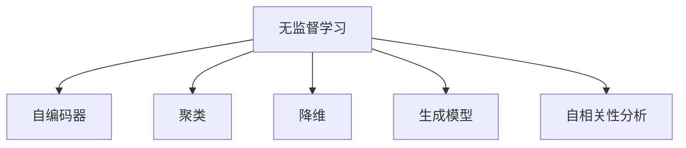

                 

# 无监督学习 (Unsupervised Learning) 原理与代码实例讲解

> 关键词：无监督学习, 自编码器, 聚类, 维度降低, 深度生成模型, 自相关性分析, 分布式假设检验

## 1. 背景介绍

### 1.1 问题由来

随着深度学习技术的发展，人工智能领域在图像识别、语音识别、自然语言处理等领域取得了举世瞩目的成就。然而，许多实际应用中的问题并不是有标签的，如消费者行为预测、社交网络中的社区发现等。这些问题通常数据量巨大，但标注成本极高，难以通过有监督学习方法解决。因此，无监督学习（Unsupervised Learning）方法成为了处理大规模无标签数据的有效手段。

无监督学习是指在缺乏标签数据的条件下，从数据中自动提取结构或模式的一种机器学习方法。这种方法不仅能从数据中发现隐藏的规律和特征，还能减少标注数据的需求，降低成本。无监督学习方法在金融、医疗、自然语言处理、推荐系统等领域有着广泛的应用。

### 1.2 问题核心关键点

无监督学习的核心在于通过数据本身的内在规律和特征，自动发现数据的分布和结构。常见的无监督学习方法包括聚类、降维、生成模型、自相关性分析等。这些方法通过优化损失函数、最大化数据分布的对数似然等手段，使得模型能够学习到数据的潜在结构和特征。

无监督学习的关键在于如何定义损失函数和优化目标。常用的损失函数有重构误差（如自编码器）、密度函数（如高斯混合模型）、互信息（如互信息最大化的自编码器）等。优化目标通常包括最大化数据的概率密度或最小化重构误差。

## 2. 核心概念与联系

### 2.1 核心概念概述

为更好地理解无监督学习，本节将介绍几个密切相关的核心概念：

- 无监督学习（Unsupervised Learning）：指在缺乏标注数据的情况下，通过数据本身的内在规律和特征，自动发现数据的分布和结构。常见的无监督学习方法包括聚类、降维、生成模型、自相关性分析等。
- 自编码器（Autoencoder）：一种基于神经网络的无监督学习方法，通过将输入数据重构为与输入数据相似的输出数据，学习到数据的低维表示。自编码器通常由编码器和解码器组成。
- 聚类（Clustering）：将数据分成若干类，使得同一类内的数据相似度较高，不同类之间的数据相似度较低。常见的聚类算法包括K-means、层次聚类等。
- 降维（Dimensionality Reduction）：将高维数据映射到低维空间，保留关键特征，去除冗余信息。常见的降维方法包括PCA、t-SNE等。
- 生成模型（Generative Model）：通过学习数据的概率分布，生成新的数据样本。常见的生成模型包括高斯混合模型（Gaussian Mixture Model, GMM）、变分自编码器（Variational Autoencoder, VAE）等。
- 自相关性分析（Autocorrelation Analysis）：通过分析数据的时间序列或空间序列，识别其中的自相关性结构，用于时间序列预测、异常检测等。

这些核心概念之间的逻辑关系可以通过以下Mermaid流程图来展示：



这个流程图展示的无监督学习的核心概念及其之间的关系：

1. 无监督学习通过不同的学习方式，从数据中提取结构和特征。
2. 自编码器通过重构数据，学习到数据的低维表示。
3. 聚类通过对数据分组，发现数据的内在结构。
4. 降维将数据映射到低维空间，去除冗余信息。
5. 生成模型通过学习数据分布，生成新数据。
6. 自相关性分析通过分析时间序列或空间序列的自相关性，进行预测或检测异常。

这些概念共同构成了无监督学习的框架，使其能够处理无标签数据，并自动发现数据的潜在结构和特征。

## 3. 核心算法原理 & 具体操作步骤
### 3.1 算法原理概述

无监督学习的核心思想是：通过最大化数据分布的对数似然或最小化重构误差，使得模型能够学习到数据的潜在结构和特征。常见的无监督学习算法包括自编码器、聚类、降维、生成模型等。

以自编码器为例，其原理是通过将输入数据重构为与输入数据相似的输出数据，学习到数据的低维表示。自编码器由编码器和解码器组成，编码器将输入数据映射为低维编码，解码器将低维编码映射回原始数据。自编码器的目标函数通常包括重构误差（即输入数据和输出数据之间的差异）和正则化项（如L2正则化）。通过优化目标函数，自编码器学习到数据的潜在表示。

### 3.2 算法步骤详解

以下是使用PyTorch实现自编码器的详细步骤：

1. 准备数据：收集无标签数据集，并对其预处理，如标准化、归一化等。
2. 设计模型：定义自编码器的编码器和解码器，通常使用多层感知器（MLP）或卷积神经网络（CNN）。
3. 定义损失函数：自编码器的损失函数通常包括重构误差和正则化项。
4. 训练模型：使用优化器对模型进行优化，最小化损失函数。
5. 评估模型：使用测试集评估模型性能，如重构误差。
6. 使用模型：将训练好的自编码器应用于实际问题，如降维、生成新数据等。

### 3.3 算法优缺点

无监督学习的优点在于：

1. 对标注数据的需求较少，可处理大规模无标签数据。
2. 发现数据的内在结构和规律，提高数据的解释性和可理解性。
3. 提高数据的质量和一致性，减少噪声和冗余信息。
4. 提高模型泛化能力，避免过拟合。

无监督学习的缺点在于：

1. 缺乏监督信号，难以直接评估模型性能。
2. 需要大量的计算资源和计算时间，训练成本较高。
3. 模型复杂度较高，难以解释和调试。
4. 对于复杂数据结构，可能难以发现有效的特征。

### 3.4 算法应用领域

无监督学习广泛应用于数据预处理、降维、特征提取、异常检测、聚类分析等多个领域：

- 数据预处理：对无标签数据进行标准化、归一化、去噪等预处理。
- 降维：将高维数据映射到低维空间，保留关键特征，去除冗余信息。
- 特征提取：通过学习数据的低维表示，提取数据的本质特征。
- 异常检测：通过聚类等方法，识别数据中的异常点或异常群集。
- 聚类分析：将数据分成若干类，发现数据的内在结构。

除了上述这些经典应用外，无监督学习还在推荐系统、图像识别、自然语言处理、时间序列预测等领域得到了广泛应用。无监督学习方法的不断演进，使得数据挖掘和数据分析变得更加高效和准确。

## 4. 数学模型和公式 & 详细讲解 & 举例说明

### 4.1 数学模型构建

无监督学习模型的构建通常包括以下几个关键步骤：

1. 定义模型结构：如多层感知器、卷积神经网络等。
2. 定义损失函数：如重构误差、互信息等。
3. 定义优化器：如Adam、SGD等。
4. 定义评估指标：如重构误差、KL散度等。

以自编码器为例，其数学模型构建如下：

- 输入数据：$x \in \mathbb{R}^d$
- 编码器：$h = f(x)$，其中$f$为编码器函数，输出低维编码$h \in \mathbb{R}^k$
- 解码器：$x' = g(h)$，其中$g$为解码器函数，输出重构数据$x' \in \mathbb{R}^d$
- 重构误差：$\mathcal{L}(x', x) = ||x' - x||^2$
- 优化目标：$\min_{\theta} \mathcal{L}(x', x) + \lambda \mathcal{L}_{reg}(\theta)$，其中$\lambda$为正则化系数，$\mathcal{L}_{reg}$为正则化项

### 4.2 公式推导过程

以自编码器为例，其公式推导如下：

1. 重构误差：$\mathcal{L}(x', x) = ||x' - x||^2$
2. 正则化项：$\mathcal{L}_{reg}(\theta) = \frac{\lambda}{2} ||\theta||^2$

综合上述两个目标函数，自编码器的优化目标为：

$$\min_{\theta} \mathcal{L}(x', x) + \lambda \mathcal{L}_{reg}(\theta)$$

通过求解上述优化问题，自编码器学习到数据的低维表示$h$，并通过解码器$g$生成重构数据$x'$。

### 4.3 案例分析与讲解

以MNIST手写数字数据集为例，解释自编码器的训练和应用过程。

**案例背景**：MNIST数据集包含大量手写数字图片，每个图片尺寸为28x28像素，共有10个类别。

**数据预处理**：将每个图片展平为一维向量，并对其进行标准化处理。

**模型构建**：定义一个简单的自编码器，包含两个全连接层，分别为编码器和解码器。

**训练过程**：
1. 将训练集划分为训练集和验证集。
2. 使用Adam优化器对模型进行优化，最小化重构误差和正则化项。
3. 在验证集上评估模型性能，调整超参数。
4. 重复上述步骤，直至模型收敛。

**应用过程**：
1. 对测试集中的每个图片进行编码，得到低维表示。
2. 对低维表示进行可视化，观察数据分布。
3. 对低维表示进行聚类分析，发现数字的类别分布。
4. 对低维表示进行降维，进一步保留关键特征。

**结果分析**：通过自编码器，可以将高维的MNIST图片数据映射到低维空间，保留关键特征，去除冗余信息。通过可视化低维表示，可以直观观察数据的分布和结构。通过聚类分析，可以发现数字的类别分布规律。通过降维，可以进一步提取数据的关键特征，提高模型的解释性和泛化能力。

## 5. 项目实践：代码实例和详细解释说明
### 5.1 开发环境搭建

在进行无监督学习实践前，我们需要准备好开发环境。以下是使用Python进行PyTorch开发的环境配置流程：

1. 安装Anaconda：从官网下载并安装Anaconda，用于创建独立的Python环境。

2. 创建并激活虚拟环境：
```bash
conda create -n pytorch-env python=3.8 
conda activate pytorch-env
```

3. 安装PyTorch：根据CUDA版本，从官网获取对应的安装命令。例如：
```bash
conda install pytorch torchvision torchaudio cudatoolkit=11.1 -c pytorch -c conda-forge
```

4. 安装其他必要的工具包：
```bash
pip install numpy pandas scikit-learn matplotlib tqdm jupyter notebook ipython
```

完成上述步骤后，即可在`pytorch-env`环境中开始无监督学习实践。

### 5.2 源代码详细实现

下面我们以MNIST手写数字数据集为例，实现一个简单的自编码器。

首先，导入必要的库和数据集：

```python
import torch
import torch.nn as nn
import torch.optim as optim
import torchvision.datasets as datasets
import torchvision.transforms as transforms

# 导入MNIST数据集
train_dataset = datasets.MNIST(root='./data', train=True, transform=transforms.ToTensor(), download=True)
test_dataset = datasets.MNIST(root='./data', train=False, transform=transforms.ToTensor())
```

然后，定义自编码器的模型结构：

```python
class Autoencoder(nn.Module):
    def __init__(self):
        super(Autoencoder, self).__init__()
        self.encoder = nn.Sequential(
            nn.Linear(784, 128),
            nn.ReLU(),
            nn.Linear(128, 64),
            nn.ReLU()
        )
        self.decoder = nn.Sequential(
            nn.Linear(64, 128),
            nn.ReLU(),
            nn.Linear(128, 784),
            nn.Sigmoid()
        )

    def forward(self, x):
        encoded = self.encoder(x)
        decoded = self.decoder(encoded)
        return decoded
```

接着，定义优化器和损失函数：

```python
# 定义优化器和损失函数
optimizer = optim.Adam(model.parameters(), lr=0.001)
loss_fn = nn.MSELoss()
```

然后，进行模型训练：

```python
epochs = 10
for epoch in range(epochs):
    model.train()
    total_loss = 0
    for data, target in train_loader:
        optimizer.zero_grad()
        output = model(data.view(-1, 784))
        loss = loss_fn(output, data.view(-1, 784))
        loss.backward()
        optimizer.step()
        total_loss += loss.item()
    print(f'Epoch {epoch+1}, loss: {total_loss/len(train_loader)}')
```

最后，在测试集上评估模型性能：

```python
model.eval()
with torch.no_grad():
    test_loss = 0
    for data, target in test_loader:
        output = model(data.view(-1, 784))
        loss = loss_fn(output, data.view(-1, 784))
        test_loss += loss.item()
    print(f'Test loss: {test_loss/len(test_loader)}')
```

以上就是使用PyTorch实现自编码器的完整代码实现。可以看到，通过简单的线性层堆叠，我们可以构建一个基本的自编码器，并通过Adam优化器进行优化。通过重构误差作为损失函数，我们可以训练自编码器，使其将MNIST数据重构为原始数据。

### 5.3 代码解读与分析

让我们再详细解读一下关键代码的实现细节：

**MNIST数据集**：
- 导入MNIST数据集，并进行标准化处理。

**模型结构**：
- 定义自编码器模型，包含编码器和解码器两个部分。编码器包含两个全连接层，解码器包含两个全连接层。
- 在前向传播中，将输入数据先通过编码器得到低维编码，再通过解码器得到重构数据。

**优化器和损失函数**：
- 使用Adam优化器进行模型训练。
- 使用均方误差（MSE）作为损失函数，计算重构误差。

**训练过程**：
- 在每个epoch中，对训练集数据进行迭代，通过前向传播计算损失函数，通过反向传播更新模型参数，并使用Adam优化器进行参数更新。
- 在每个epoch结束后，计算平均损失，并输出。

**评估过程**：
- 在测试集上对模型进行评估，计算重构误差，并输出。

可以看到，PyTorch提供了丰富的API和工具，使得无监督学习的实践变得简单高效。通过调整模型结构和超参数，可以更好地适应不同类型的数据集和任务。

## 6. 实际应用场景
### 6.1 数据预处理

在实际应用中，无监督学习常常用于数据预处理，去除噪声和冗余信息，提高数据的质量和一致性。例如，在自然语言处理中，可以使用无监督学习对文本进行去噪、分词、标注等预处理。在图像处理中，可以使用无监督学习对图像进行去噪、归一化、增强等预处理。

### 6.2 降维与特征提取

无监督学习的降维和特征提取技术，在数据挖掘和数据分析中具有重要应用。通过降维，可以将高维数据映射到低维空间，保留关键特征，去除冗余信息。常见的降维方法包括PCA、t-SNE等。通过特征提取，可以发现数据的内在结构和规律，提高数据的解释性和可理解性。常见的特征提取方法包括LDA、PCA等。

### 6.3 聚类分析

聚类分析是无监督学习的经典应用之一，通过将数据分成若干类，发现数据的内在结构。常见的聚类算法包括K-means、层次聚类等。聚类分析在市场细分、客户分类、社区发现等领域有着广泛应用。

### 6.4 生成模型

生成模型通过学习数据的概率分布，生成新的数据样本。常见的生成模型包括高斯混合模型（GMM）、变分自编码器（VAE）等。生成模型在图像生成、语音生成、自然语言生成等领域有着重要应用。

### 6.5 异常检测

无监督学习的异常检测技术，可以通过聚类等方法，识别数据中的异常点或异常群集。常见的异常检测算法包括孤立森林、局部离群因子等。异常检测在金融欺诈检测、网络安全、医疗诊断等领域有着重要应用。

### 6.6 数据可视化

无监督学习的数据可视化技术，可以通过聚类等方法，发现数据的内在结构，并进行可视化展示。常见的可视化方法包括t-SNE、UMAP等。数据可视化在数据探索、特征发现、趋势分析等领域有着重要应用。

### 6.7 时间序列预测

无监督学习的时间序列预测技术，可以通过自相关性分析等方法，发现数据的时间序列结构和规律，并进行预测。常见的时间序列预测算法包括ARIMA、LSTM等。时间序列预测在股票预测、气象预测、交通预测等领域有着重要应用。

## 7. 工具和资源推荐
### 7.1 学习资源推荐

为了帮助开发者系统掌握无监督学习的基本概念和实践技巧，这里推荐一些优质的学习资源：

1. 《深度学习》（Ian Goodfellow等著）：该书详细介绍了深度学习的基本概念和前沿技术，包括无监督学习在内。
2. 《统计学习方法》（李航著）：该书系统介绍了机器学习的基本算法和方法，包括聚类、降维、生成模型等。
3. Coursera《机器学习》课程：由斯坦福大学Andrew Ng教授主讲，涵盖了机器学习的基本概念和算法。
4 Udacity《深度学习专项课程》：由Google工程师授课，涵盖了深度学习的基本概念和实践技巧。
5 Kaggle：全球最大的数据科学竞赛平台，提供了丰富的数据集和竞赛机会，可以锻炼数据处理和模型优化能力。

通过对这些资源的学习实践，相信你一定能够快速掌握无监督学习的精髓，并用于解决实际的机器学习问题。

### 7.2 开发工具推荐

高效的开发离不开优秀的工具支持。以下是几款用于无监督学习开发的常用工具：

1. PyTorch：基于Python的开源深度学习框架，灵活动态的计算图，适合快速迭代研究。
2. TensorFlow：由Google主导开发的开源深度学习框架，生产部署方便，适合大规模工程应用。
3. Scikit-learn：Python机器学习库，提供了丰富的数据预处理、聚类、降维等工具。
4. Weights & Biases：模型训练的实验跟踪工具，可以记录和可视化模型训练过程中的各项指标，方便对比和调优。
5. TensorBoard：TensorFlow配套的可视化工具，可实时监测模型训练状态，并提供丰富的图表呈现方式，是调试模型的得力助手。

合理利用这些工具，可以显著提升无监督学习的开发效率，加快创新迭代的步伐。

### 7.3 相关论文推荐

无监督学习的研究源于学界的持续探索。以下是几篇奠基性的相关论文，推荐阅读：

1. Self-Organizing Feature Maps (SOM)：由Kohonen提出的自组织映射算法，通过竞争神经元发现数据的局部结构。
2. Principal Component Analysis (PCA)：由Kruskal和Jolliffe提出的主成分分析算法，通过线性变换发现数据的低维结构。
3. Clustering Algorithms（K-means、Hierarchical Clustering）：由MacQueen和Duda提出的K-means和层次聚类算法，通过将数据分成若干类，发现数据的内在结构。
4. Gaussian Mixture Models (GMM)：由Bishop提出的高斯混合模型算法，通过学习数据的概率分布，发现数据的潜在结构和规律。
5. Variational Autoencoders (VAE)：由Kingma和Welling提出的变分自编码器算法，通过学习数据的概率分布，生成新的数据样本。

这些论文代表了大无监督学习的发展脉络。通过学习这些前沿成果，可以帮助研究者把握学科前进方向，激发更多的创新灵感。

## 8. 总结：未来发展趋势与挑战
### 8.1 总结

本文对无监督学习的基本概念和实践进行了全面系统的介绍。首先阐述了无监督学习的基本原理和核心思想，明确了无监督学习在机器学习中的重要地位。其次，从原理到实践，详细讲解了无监督学习的数学模型和关键步骤，给出了无监督学习任务开发的完整代码实例。同时，本文还广泛探讨了无监督学习在数据预处理、降维、聚类分析等多个领域的应用前景，展示了无监督学习方法的巨大潜力。

通过本文的系统梳理，可以看到，无监督学习在处理无标签数据、自动发现数据结构和特征方面具有独特优势。随着数据规模的不断扩大和计算能力的不断提升，无监督学习将发挥越来越重要的作用。

### 8.2 未来发展趋势

展望未来，无监督学习的发展趋势包括：

1. 深度学习与无监督学习的融合：深度学习将与无监督学习进一步融合，形成更加强大的数据挖掘和分析能力。
2. 大数据与无监督学习的结合：随着大数据技术的发展，无监督学习将能够处理更复杂、更大规模的数据集。
3. 多模态数据的无监督学习：无监督学习将进一步拓展到多模态数据的处理，如图像、语音、文本的联合建模。
4. 无监督学习与强化学习的结合：无监督学习将与强化学习结合，形成更加复杂、灵活的决策系统。
5. 无监督学习与优化算法的结合：无监督学习将与优化算法结合，提高模型的训练效率和泛化能力。
6. 无监督学习与机器学习的融合：无监督学习将成为机器学习的重要分支，与其他机器学习算法融合，提升模型的性能和效果。

以上趋势凸显了无监督学习技术的广阔前景。这些方向的探索发展，必将进一步提升无监督学习方法的精度和效率，为数据挖掘和数据分析带来新的突破。

### 8.3 面临的挑战

尽管无监督学习已经取得了重要成果，但在迈向更加智能化、普适化应用的过程中，它仍面临着诸多挑战：

1. 数据分布的复杂性：无监督学习在处理复杂数据分布时，可能难以发现有效的特征。
2. 模型复杂度：无监督学习模型通常较为复杂，难以解释和调试。
3. 数据噪声的影响：无监督学习对噪声数据较为敏感，需要进行预处理和清洗。
4. 模型的泛化能力：无监督学习模型可能难以泛化到新的数据集，需要进行更多的实验和验证。
5. 模型的可解释性：无监督学习模型的决策过程较为复杂，难以解释和调试。
6. 计算资源的限制：无监督学习模型通常需要大量的计算资源和时间，训练成本较高。

正视无监督学习面临的这些挑战，积极应对并寻求突破，将是无监督学习技术走向成熟的重要步骤。相信随着学界和产业界的共同努力，这些挑战终将一一被克服，无监督学习必将在数据挖掘和数据分析领域发挥更大的作用。

### 8.4 研究展望

面对无监督学习面临的挑战，未来的研究需要在以下几个方面寻求新的突破：

1. 大数据与无监督学习的结合：开发更加高效、灵活的无监督学习算法，能够处理更大规模、更复杂的数据集。
2. 多模态数据的无监督学习：探索多模态数据的联合建模方法，提高模型的解释性和泛化能力。
3. 无监督学习与优化算法的结合：开发更加高效的无监督学习算法，提高模型的训练效率和泛化能力。
4. 无监督学习与机器学习的融合：将无监督学习与其他机器学习算法结合，形成更加全面、高效的数据分析系统。
5. 无监督学习的可解释性：探索更加可解释的无监督学习模型，提高模型的透明度和可解释性。
6. 无监督学习的应用推广：推广无监督学习技术，应用到更多实际问题中，如金融、医疗、社交网络等。

这些研究方向的探索，必将引领无监督学习技术迈向更高的台阶，为数据挖掘和数据分析带来新的突破。面向未来，无监督学习需要与其他人工智能技术进行更深入的融合，如知识表示、因果推理、强化学习等，多路径协同发力，共同推动数据挖掘和数据分析系统的进步。只有勇于创新、敢于突破，才能不断拓展无监督学习的边界，让无监督学习技术更好地造福人类社会。

## 9. 附录：常见问题与解答

**Q1：无监督学习是否适用于所有机器学习任务？**

A: 无监督学习适用于大部分机器学习任务，特别是那些缺乏标注数据的任务。对于标注数据丰富的任务，有监督学习往往更加高效。

**Q2：无监督学习与有监督学习的区别是什么？**

A: 无监督学习与有监督学习的主要区别在于对标注数据的需求。无监督学习不需要标注数据，通过数据本身的内在规律和特征，自动发现数据的分布和结构。而有监督学习需要标注数据，通过有监督信号指导模型学习，提高模型的泛化能力。

**Q3：如何选择合适的无监督学习算法？**

A: 选择合适的无监督学习算法需要考虑数据的特点和任务的需求。例如，对于高维数据，可以考虑降维算法如PCA；对于聚类任务，可以考虑K-means或层次聚类；对于生成模型，可以考虑VAE等。

**Q4：无监督学习的优点和缺点分别是什么？**

A: 无监督学习的优点在于对标注数据的需求较少，可处理大规模无标签数据。其缺点在于缺乏监督信号，难以直接评估模型性能，计算资源和计算时间较高。

**Q5：无监督学习的应用场景有哪些？**

A: 无监督学习广泛应用于数据预处理、降维、特征提取、聚类分析、生成模型、异常检测等多个领域。例如，在金融、医疗、自然语言处理、推荐系统等领域，无监督学习有着广泛的应用。

**Q6：无监督学习与深度学习的结合有哪些方法？**

A: 无监督学习与深度学习的结合方法包括自编码器、变分自编码器、生成对抗网络（GAN）等。这些方法通过深度神经网络进行数据建模，提高模型的泛化能力和解释性。

**Q7：无监督学习的未来发展方向有哪些？**

A: 无监督学习的未来发展方向包括深度学习与无监督学习的融合、大数据与无监督学习的结合、多模态数据的无监督学习、无监督学习与强化学习的结合、无监督学习与优化算法的结合、无监督学习与机器学习的融合等。

这些方向的研究将进一步推动无监督学习技术的发展，提高模型的精度和效率，为数据挖掘和数据分析带来新的突破。

---

作者：禅与计算机程序设计艺术 / Zen and the Art of Computer Programming

