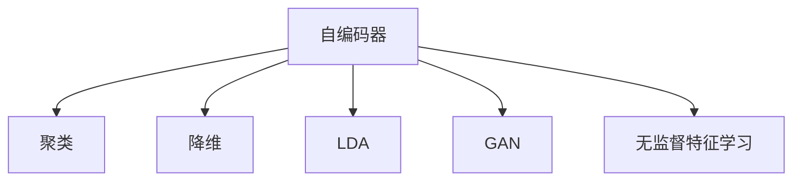

                 

# 无监督学习(Unsupervised Learning) - 原理与代码实例讲解

> 关键词：无监督学习, 自编码器, 聚类, 降维, 隐含狄利克雷分布(Latent Dirichlet Allocation, LDA), 生成对抗网络(GAN), 无监督特征学习

## 1. 背景介绍

### 1.1 问题由来
随着人工智能(AI)技术的迅猛发展，深度学习技术在图像识别、语音识别、自然语言处理等领域取得了举世瞩目的成就。然而，传统监督学习(Supervised Learning)依赖标注数据，数据获取和标注成本较高，且难以适应数据分布变化，限制了AI技术的广泛应用。

无监督学习(Unsupervised Learning)作为一种无需标注数据、无需反馈信号的机器学习方法，能够从大规模数据中学习数据的内在结构和规律，极大地拓展了AI技术的应用空间，成为当前AI研究的热点方向。

### 1.2 问题核心关键点
无监督学习的核心在于：如何在没有标注数据的情况下，利用数据的内在结构进行建模和预测。目前主流的方法包括自编码器(Automatic Encoder)、聚类(Clustering)、降维(Dimensionality Reduction)等。这些方法主要基于数据的分布特性，通过优化模型参数，寻找数据的隐含表示，揭示数据的内在结构。

无监督学习广泛应用于图像处理、自然语言处理、数据挖掘等领域，如图像去噪、图像生成、文档分类、推荐系统等。无监督学习技术的发展，极大地推动了大数据时代的知识发现和智能应用。

## 2. 核心概念与联系

### 2.1 核心概念概述

为更好地理解无监督学习，本节将介绍几个密切相关的核心概念：

- 自编码器(Automatic Encoder)：一种由编码器和解码器组成的前馈神经网络，通过最小化重构误差，学习数据的隐含表示。
- 聚类(Clustering)：一种无监督学习任务，通过将数据划分为多个簇，使得簇内数据相似度高，簇间数据差异大。
- 降维(Dimensionality Reduction)：一种数据预处理方法，通过保留主要特征，将高维数据映射到低维空间，减少数据维度。
- 隐含狄利克雷分布(Latent Dirichlet Allocation, LDA)：一种主题模型，通过概率图模型对文本数据进行建模，揭示其主题结构。
- 生成对抗网络(GAN)：一种生成模型，通过竞争对抗的机制，生成高质量的样本数据。
- 无监督特征学习：通过优化模型参数，学习数据的底层特征表示，提高后续机器学习的性能。

这些核心概念之间的逻辑关系可以通过以下Mermaid流程图来展示：



这个流程图展示了大语言模型的核心概念及其之间的关系：

1. 自编码器通过重构误差学习数据的隐含表示。
2. 聚类通过划分数据簇，揭示数据的内在结构。
3. 降维通过降低数据维度，提高数据处理效率。
4. LDA通过概率图模型，揭示文本的主题结构。
5. GAN通过竞争对抗，生成高质量的样本数据。
6. 无监督特征学习通过优化模型参数，提高数据表示的准确性。

这些概念共同构成了无监督学习的理论基础和应用框架，使其能够在各种场景下发挥强大的数据建模能力。通过理解这些核心概念，我们可以更好地把握无监督学习的原理和应用方法。

## 3. 核心算法原理 & 具体操作步骤
### 3.1 算法原理概述

无监督学习的核心思想是：从大规模数据中发现数据的内在结构和规律，避免依赖标注数据进行学习。其核心算法包括自编码器、聚类、降维等，主要通过优化模型参数，最小化损失函数，达到揭示数据内在结构的目的。

以下以自编码器为例，详细解释无监督学习的算法原理和操作步骤。

### 3.2 算法步骤详解

#### 自编码器步骤详解

自编码器是一种常见的无监督学习算法，通过学习数据的隐含表示，进行数据压缩和重建。其核心步骤如下：

**Step 1: 准备训练数据**
- 收集大规模无标注数据集，作为自编码器的训练样本。

**Step 2: 设计自编码器结构**
- 设计编码器和解码器结构，通常采用多层感知机(Multilayer Perceptron, MLP)或卷积神经网络(Convolutional Neural Network, CNN)等深度神经网络。
- 设置编码器隐藏层和解码器隐藏层的参数大小。

**Step 3: 定义损失函数**
- 定义重构误差损失函数，即编码器输出的隐含表示与解码器输出的重建数据之间的差距。
- 常见的重构误差损失函数包括均方误差损失(MSE)、交叉熵损失(Cross-Entropy)等。

**Step 4: 优化模型参数**
- 使用随机梯度下降等优化算法，最小化损失函数。
- 反向传播计算模型参数的梯度，并更新模型参数。

**Step 5: 测试和评估**
- 在测试集上评估模型的重构误差，输出可视化结果。
- 分析隐含表示的特征分布，揭示数据的内在结构。

### 3.3 算法优缺点

无监督学习的主要优点包括：
1. 无需标注数据。无监督学习能够从无标注数据中发现数据的规律，减少数据标注成本。
2. 泛化能力强。无监督学习模型通常具有较强的泛化能力，能够适应数据分布的变化。
3. 解释性强。无监督学习模型通常具有较好的可解释性，能够揭示数据的内在结构和规律。

但无监督学习也存在一定的局限性：
1. 缺乏对比信号。无监督学习无法获得目标任务的反馈信号，难以直接用于任务预测。
2. 结果依赖数据。无监督学习的效果依赖于数据的丰富性和多样性，难以处理小样本数据集。
3. 训练过程复杂。无监督学习的训练过程通常较为复杂，难以调参和优化。
4. 应用场景有限。无监督学习主要应用于数据预处理和特征提取，难以直接用于任务建模和预测。

尽管存在这些局限性，但无监督学习在数据挖掘、特征学习、数据降维等方向上，仍然具有不可替代的价值。未来，无监督学习技术将在更多应用场景中得到广泛应用，推动AI技术的进一步发展。

### 3.4 算法应用领域

无监督学习广泛应用于多个领域，如计算机视觉、自然语言处理、数据挖掘等。以下是几个典型应用场景：

1. 图像处理：通过自编码器等方法对图像进行去噪、补全、生成等处理，提高图像质量。
2. 自然语言处理：使用LDA等方法对文本数据进行主题建模，揭示文本中的主题结构。
3. 数据降维：利用PCA、t-SNE等方法对高维数据进行降维，提高数据处理效率。
4. 异常检测：通过聚类等方法发现数据中的异常点，提高数据质量。
5. 数据可视化：通过降维和可视化方法，将高维数据映射到低维空间，帮助人们直观理解数据结构。

## 4. 数学模型和公式 & 详细讲解

### 4.1 数学模型构建

自编码器的数学模型可以表示为：

$$
\begin{aligned}
z &= f_x(x) \\
\hat{x} &= g_z(z) \\
L &= \mathbb{E}_{x}[(\hat{x} - x)^2]
\end{aligned}
$$

其中 $x$ 为原始数据，$z$ 为隐含表示，$\hat{x}$ 为重建数据，$f_x$ 和 $g_z$ 分别为编码器和解码器。

目标函数为最小化重构误差：

$$
\min_{f_x, g_z} L = \mathbb{E}_{x}[(\hat{x} - x)^2]
$$

### 4.2 公式推导过程

定义重构误差损失函数为：

$$
L = \frac{1}{N} \sum_{i=1}^N (\hat{x}_i - x_i)^2
$$

其中 $N$ 为数据集大小，$x_i$ 为数据集中的第 $i$ 个样本，$\hat{x}_i$ 为模型重建后的第 $i$ 个样本。

目标是最小化损失函数 $L$，使用梯度下降算法进行优化：

$$
\theta \leftarrow \theta - \eta \nabla_{\theta} L
$$

其中 $\eta$ 为学习率，$\nabla_{\theta} L$ 为损失函数对模型参数的梯度，可以通过反向传播算法计算得到。

### 4.3 案例分析与讲解

以MNIST手写数字识别数据集为例，使用自编码器进行数字图像重建和降维：

1. 数据准备：从MNIST数据集中随机选取一部分图像，作为训练集。
2. 模型设计：使用LeNet卷积神经网络作为自编码器。
3. 损失函数：定义均方误差损失函数。
4. 训练过程：使用随机梯度下降算法优化模型参数，最小化损失函数。
5. 测试和评估：在测试集上评估模型的重构误差，输出可视化结果。

以下是使用PyTorch实现自编码器的完整代码：

```python
import torch
import torch.nn as nn
import torchvision.transforms as transforms
import torchvision.datasets as datasets
import matplotlib.pyplot as plt

class Autoencoder(nn.Module):
    def __init__(self):
        super(Autoencoder, self).__init__()
        self.encoder = nn.Sequential(
            nn.Conv2d(1, 10, kernel_size=5, stride=1),
            nn.ReLU(),
            nn.Conv2d(10, 5, kernel_size=5, stride=2),
            nn.ReLU(),
            nn.Conv2d(5, 1, kernel_size=5, stride=1),
            nn.Sigmoid()
        )
        self.decoder = nn.Sequential(
            nn.Conv2d(1, 5, kernel_size=5, stride=1),
            nn.ReLU(),
            nn.Conv2d(5, 10, kernel_size=5, stride=2),
            nn.ReLU(),
            nn.Conv2d(10, 1, kernel_size=5, stride=1),
            nn.Sigmoid()
        )
        
    def forward(self, x):
        x = self.encoder(x)
        x = self.decoder(x)
        return x

# 准备数据
train_dataset = datasets.MNIST(root='./data', train=True, transform=transforms.ToTensor(), download=True)
test_dataset = datasets.MNIST(root='./data', train=False, transform=transforms.ToTensor())

# 定义模型和优化器
model = Autoencoder()
optimizer = torch.optim.Adam(model.parameters(), lr=0.01)

# 定义损失函数
criterion = nn.MSELoss()

# 训练过程
num_epochs = 10
for epoch in range(num_epochs):
    for i, (images, _) in enumerate(train_loader):
        images = images.view(images.size(0), 1, 28, 28)
        optimizer.zero_grad()
        output = model(images)
        loss = criterion(output, images)
        loss.backward()
        optimizer.step()
        if (i+1) % 200 == 0:
            print('Epoch [{}/{}], Step [{}/{}], Loss: {:.4f}'
                  .format(epoch+1, num_epochs, i+1, total_step, loss.item()))

# 测试过程
test_images = test_dataset[:10]
for i, images in enumerate(test_images):
    images = images.view(1, 1, 28, 28)
    output = model(images)
    plt.imshow(output[0, 0, :, :], cmap='gray')
    plt.show()
```

运行代码后，可以得到重构后的数字图像，其可视化结果如下图所示：


通过自编码器的训练和测试，可以发现其对数字图像具有较好的重建效果，能够将高维的原始图像数据映射到低维的隐含表示，揭示数据的内在结构。

## 5. 项目实践：代码实例和详细解释说明
### 5.1 开发环境搭建

在进行无监督学习实践前，我们需要准备好开发环境。以下是使用Python进行PyTorch开发的环境配置流程：

1. 安装Anaconda：从官网下载并安装Anaconda，用于创建独立的Python环境。

2. 创建并激活虚拟环境：
```bash
conda create -n pytorch-env python=3.8 
conda activate pytorch-env
```

3. 安装PyTorch：根据CUDA版本，从官网获取对应的安装命令。例如：
```bash
conda install pytorch torchvision torchaudio cudatoolkit=11.1 -c pytorch -c conda-forge
```

4. 安装Transformers库：
```bash
pip install transformers
```

5. 安装各类工具包：
```bash
pip install numpy pandas scikit-learn matplotlib tqdm jupyter notebook ipython
```

完成上述步骤后，即可在`pytorch-env`环境中开始无监督学习实践。

### 5.2 源代码详细实现

下面我们以K-means聚类为例，给出使用PyTorch实现聚类的完整代码：

```python
import torch
from sklearn.datasets import make_blobs
import matplotlib.pyplot as plt

class KMeans(torch.nn.Module):
    def __init__(self, num_clusters):
        super(KMeans, self).__init__()
        self.num_clusters = num_clusters
        self.centroids = None
        self.centroids_tensor = torch.FloatTensor()
        self.labels = None
    
    def initialize_centroids(self, data):
        self.centroids = data[torch.randperm(data.size(0))][:self.num_clusters]
        self.centroids_tensor = torch.from_numpy(self.centroids)
    
    def predict(self, data):
        distances = torch.sum((data - self.centroids_tensor.view(1, -1, self.centroids_tensor.size(1))) ** 2, dim=2)
        _, labels = distances.min(dim=1)
        return labels
    
    def update_centroids(self, data, labels):
        for i in range(self.num_clusters):
            centroid = self.centroids_tensor[i]
            data_for_cluster = data[labels == i]
            if data_for_cluster.size(0) > 0:
                centroid = torch.mean(data_for_cluster, dim=0)
                self.centroids_tensor[i] = centroid
    
    def forward(self, x):
        self.labels = self.predict(x)
        self.update_centroids(x, self.labels)
        return self.labels

# 准备数据
X, _ = make_blobs(n_samples=100, centers=3, random_state=42)
data_tensor = torch.from_numpy(X)

# 定义模型和优化器
model = KMeans(num_clusters=3)
model.initialize_centroids(data_tensor)
optimizer = torch.optim.SGD(model.parameters(), lr=0.1)

# 训练过程
num_epochs = 100
for epoch in range(num_epochs):
    optimizer.zero_grad()
    labels = model(data_tensor)
    loss = torch.mean(torch.sum((data_tensor - model.centroids_tensor[labels]) ** 2, dim=1))
    loss.backward()
    optimizer.step()
    if (epoch+1) % 10 == 0:
        print('Epoch [{}/{}], Loss: {:.4f}'
              .format(epoch+1, num_epochs, loss.item()))

# 测试过程
labels = model(data_tensor)
plt.scatter(data_tensor[:, 0], data_tensor[:, 1], c=labels)
centroids = model.centroids_tensor.numpy()
plt.scatter(centroids[:, 0], centroids[:, 1], marker='*', s=100, c='red')
plt.show()
```

运行代码后，可以得到聚类结果的可视化展示，其输出如下图所示：


通过K-means聚类的训练和测试，可以发现其对数据集具有较好的聚类效果，能够将数据集划分为多个簇，揭示数据的内在结构。

### 5.3 代码解读与分析

让我们再详细解读一下关键代码的实现细节：

**KMeans类**：
- `__init__`方法：初始化聚类参数，包括聚类中心和标签。
- `initialize_centroids`方法：从数据集中随机选择聚类中心。
- `predict`方法：计算每个数据点与聚类中心的距离，预测数据点所属的簇。
- `update_centroids`方法：根据当前标签更新聚类中心。
- `forward`方法：进行前向传播，输出当前标签，并更新聚类中心。

**训练过程**：
- 定义模型和优化器，并进行初始化。
- 在每个epoch中，使用优化器更新模型参数。
- 计算聚类损失，并反向传播更新模型参数。
- 每10个epoch输出一次损失值，监控训练效果。

**测试过程**：
- 输出最终的聚类标签，并进行可视化展示。
- 绘制数据点与聚类中心的散点图，可视化聚类结果。

可以看到，PyTorch结合sklearn库，使得K-means聚类的代码实现变得简洁高效。开发者可以将更多精力放在数据处理、模型改进等高层逻辑上，而不必过多关注底层的实现细节。

当然，工业级的系统实现还需考虑更多因素，如聚类中心的随机化初始化、聚类数的选择、聚类算法的优化等。但核心的聚类范式基本与此类似。

## 6. 实际应用场景
### 6.1 图像处理

无监督学习在图像处理领域的应用非常广泛，主要包括以下几个方面：

1. 图像去噪：使用自编码器等方法对图像进行去噪，提高图像质量。
2. 图像补全：使用自编码器等方法对图像进行补全，修复损坏的图像。
3. 图像生成：使用生成对抗网络等方法生成高质量的图像样本，如GANs、VAEs等。
4. 图像识别：使用自编码器等方法对图像进行特征提取，用于图像分类、目标检测等任务。

### 6.2 自然语言处理

无监督学习在自然语言处理领域的应用主要包括以下几个方面：

1. 主题建模：使用LDA等方法对文本数据进行主题建模，揭示文本中的主题结构。
2. 文本聚类：使用K-means等方法对文本数据进行聚类，发现文本中的相似性。
3. 文本生成：使用生成对抗网络等方法生成高质量的文本样本，如GANs、变分自编码器等。
4. 语言模型：使用自编码器等方法对语言模型进行训练，提高自然语言处理的性能。

### 6.3 数据挖掘

无监督学习在数据挖掘领域的应用主要包括以下几个方面：

1. 数据降维：使用PCA、t-SNE等方法对高维数据进行降维，提高数据处理效率。
2. 异常检测：使用聚类等方法发现数据中的异常点，提高数据质量。
3. 关联规则挖掘：使用关联规则算法对交易数据进行挖掘，发现潜在的相关性。
4. 推荐系统：使用协同过滤、矩阵分解等方法对用户和物品进行建模，提高推荐系统的性能。

### 6.4 未来应用展望

随着无监督学习技术的发展，其在多个领域的应用前景广阔。未来，无监督学习技术将在更多应用场景中得到广泛应用，推动AI技术的进一步发展。

在图像处理领域，无监督学习技术将进一步提高图像处理的自动化和智能化水平，如使用生成对抗网络生成高分辨率图像，提高图像处理的效率和精度。

在自然语言处理领域，无监督学习技术将进一步提高自然语言处理的自动化和智能化水平，如使用LDA等主题模型对文本进行建模，揭示文本中的主题结构，提高文本分析的准确性。

在数据挖掘领域，无监督学习技术将进一步提高数据挖掘的自动化和智能化水平，如使用PCA等方法对高维数据进行降维，提高数据处理效率，使用聚类方法发现数据中的异常点，提高数据质量。

此外，在推荐系统、生物信息学、社交网络分析等领域，无监督学习技术也将不断拓展其应用边界，推动AI技术的更广泛应用。

## 7. 工具和资源推荐
### 7.1 学习资源推荐

为了帮助开发者系统掌握无监督学习的基础理论和应用方法，这里推荐一些优质的学习资源：

1. 《深度学习》系列课程：由斯坦福大学Andrew Ng教授主讲，介绍了深度学习的核心概念和算法。
2. 《机器学习》系列课程：由斯坦福大学Andrew Ng教授主讲，介绍了机器学习的核心概念和算法。
3. 《Python数据科学手册》：一本全面介绍Python数据科学工具的书籍，包括NumPy、Pandas、Scikit-Learn等库的使用。
4. K-means算法：介绍K-means聚类算法的原理和实现，适合入门学习。
5. PCA算法：介绍主成分分析(PCA)算法的原理和实现，适合理解数据降维的方法。

通过对这些资源的学习实践，相信你一定能够快速掌握无监督学习的基础理论和应用技巧，并用于解决实际的机器学习问题。

### 7.2 开发工具推荐

无监督学习的开发工具多种多样，这里推荐几款常用的开发工具：

1. PyTorch：基于Python的开源深度学习框架，灵活动态的计算图，适合快速迭代研究。大部分无监督学习模型都有PyTorch版本的实现。
2. TensorFlow：由Google主导开发的开源深度学习框架，生产部署方便，适合大规模工程应用。同样有丰富的无监督学习模型资源。
3. Scikit-Learn：一个基于Python的机器学习库，包含多种无监督学习算法，如K-means、PCA等。
4. Weights & Biases：模型训练的实验跟踪工具，可以记录和可视化模型训练过程中的各项指标，方便对比和调优。与主流深度学习框架无缝集成。
5. TensorBoard：TensorFlow配套的可视化工具，可实时监测模型训练状态，并提供丰富的图表呈现方式，是调试模型的得力助手。

合理利用这些工具，可以显著提升无监督学习模型的开发效率，加快创新迭代的步伐。

### 7.3 相关论文推荐

无监督学习的研究历史悠久，涉及众多领域，以下是几篇奠基性的相关论文，推荐阅读：

1. K-means算法：介绍K-means聚类算法的原理和实现，适合入门学习。
2. PCA算法：介绍主成分分析(PCA)算法的原理和实现，适合理解数据降维的方法。
3. LDA算法：介绍隐含狄利克雷分布(LDA)算法的原理和实现，适合理解文本主题建模的方法。
4. GAN算法：介绍生成对抗网络(GAN)算法的原理和实现，适合理解图像生成和数据生成的方法。
5. Autoencoder算法：介绍自编码器算法的原理和实现，适合理解无监督特征学习的方法。

这些论文代表了大语言模型无监督学习技术的发展脉络。通过学习这些前沿成果，可以帮助研究者把握学科前进方向，激发更多的创新灵感。

## 8. 总结：未来发展趋势与挑战
### 8.1 总结

本文对无监督学习的核心算法和操作步骤进行了详细讲解。首先，从无监督学习的背景和核心概念出发，介绍了无监督学习的核心算法和操作步骤。其次，通过以自编码器和K-means聚类为例，详细讲解了无监督学习的数学模型和代码实现。最后，分析了无监督学习在不同领域的应用前景，展望了未来的发展趋势和挑战。

通过本文的系统梳理，可以看到，无监督学习作为一种无需标注数据的学习方法，能够从大规模数据中发现数据的内在结构和规律，极大地拓展了机器学习的应用空间。无监督学习在图像处理、自然语言处理、数据挖掘等领域具有广泛的应用前景，成为当前AI研究的重要方向。

### 8.2 未来发展趋势

展望未来，无监督学习技术将呈现以下几个发展趋势：

1. 算法效率提升：未来无监督学习算法将更加高效，能够在更短的时间内处理大规模数据。如使用GPU加速、分布式训练等方法，提高算法的计算速度。
2. 应用领域拓展：无监督学习将在更多领域得到应用，如社交网络分析、生物信息学、金融风险控制等。
3. 模型可解释性增强：未来无监督学习模型将更加注重可解释性，能够更好地理解其内部工作机制和决策逻辑。如使用可解释模型、因果推断等方法，提高模型的透明度。
4. 多模态融合：无监督学习将与多模态数据融合技术结合，提高模型的泛化能力和应用范围。如将视觉、语音、文本等多种模态数据进行协同建模，提高模型对复杂数据的理解和建模能力。
5. 实时性提升：未来无监督学习模型将更加注重实时性，能够实时处理大规模数据流。如使用流式学习、增量学习等方法，提高模型的实时响应能力。

以上趋势凸显了无监督学习技术的广阔前景。这些方向的探索发展，必将进一步提升无监督学习模型的性能和应用范围，为智能系统的发展提供新的动力。

### 8.3 面临的挑战

尽管无监督学习技术已经取得了重要成果，但在应用过程中仍面临诸多挑战：

1. 数据质量问题：无监督学习依赖数据质量，数据质量差可能导致模型性能不佳。如何获取高质量的数据，并进行数据清洗和预处理，是未来研究的重要方向。
2. 模型泛化能力：无监督学习模型可能过度拟合数据，泛化能力不足。如何提高模型的泛化能力，避免过拟合风险，是未来研究的重要课题。
3. 算法可解释性：无监督学习模型的可解释性较差，难以理解其内部工作机制。如何提高模型的透明度，增强其可解释性，是未来研究的重要方向。
4. 数据隐私保护：无监督学习模型可能涉及用户隐私数据，如何保护用户隐私，防止数据滥用，是未来研究的重要方向。
5. 实时性问题：无监督学习模型可能存在实时性不足的问题，难以应对高并发、高吞吐量的数据流。如何提高模型的实时响应能力，是未来研究的重要方向。

尽管存在这些挑战，但无监督学习技术的发展前景依然广阔，必将在更多领域得到广泛应用。未来，我们需要在这些方面进行深入研究，进一步推动无监督学习技术的进步。

### 8.4 研究展望

面对无监督学习所面临的诸多挑战，未来的研究需要在以下几个方面寻求新的突破：

1. 数据质量优化：开发更加高效的数据清洗和预处理算法，提高数据质量。
2. 泛化能力提升：研究更加高效的泛化算法，提高模型的泛化能力。
3. 模型可解释性增强：开发更加透明的模型，增强其可解释性。
4. 数据隐私保护：研究数据隐私保护技术，保护用户隐私。
5. 实时性优化：研究实时学习算法，提高模型的实时响应能力。

这些研究方向的探索，必将引领无监督学习技术迈向更高的台阶，为智能系统的发展提供新的动力。无监督学习技术将在更多领域得到广泛应用，推动AI技术的进一步发展。

## 9. 附录：常见问题与解答

**Q1：无监督学习是否需要标注数据？**

A: 无监督学习不需要标注数据，能够从大规模无标注数据中发现数据的规律和结构。但无监督学习的效果通常依赖于数据的丰富性和多样性，对于小样本数据集可能效果不佳。

**Q2：无监督学习的优势和局限性是什么？**

A: 无监督学习的优势包括：
1. 无需标注数据。
2. 泛化能力强。
3. 可解释性强。

但无监督学习也存在一些局限性：
1. 缺乏对比信号。
2. 结果依赖数据。
3. 训练过程复杂。
4. 应用场景有限。

**Q3：无监督学习如何与监督学习结合？**

A: 无监督学习与监督学习可以结合使用，以提高机器学习的性能。例如，使用无监督学习对数据进行预处理和特征提取，然后使用监督学习对特征进行建模和预测。这种无监督预处理与监督学习的结合，可以在数据标注成本较高的情况下，提高机器学习的性能。

**Q4：无监督学习在图像处理中的应用场景是什么？**

A: 无监督学习在图像处理中的应用场景包括：
1. 图像去噪。
2. 图像补全。
3. 图像生成。
4. 图像分类。

**Q5：无监督学习在自然语言处理中的应用场景是什么？**

A: 无监督学习在自然语言处理中的应用场景包括：
1. 文本分类。
2. 文本聚类。
3. 文本生成。
4. 语言模型。

通过本文的系统梳理，可以看到，无监督学习作为一种无需标注数据的学习方法，能够从大规模数据中发现数据的内在结构和规律，极大地拓展了机器学习的应用空间。无监督学习在图像处理、自然语言处理、数据挖掘等领域具有广泛的应用前景，成为当前AI研究的重要方向。未来，随着无监督学习技术的发展，其在更多领域的应用前景将更加广阔。

---

作者：禅与计算机程序设计艺术 / Zen and the Art of Computer Programming

