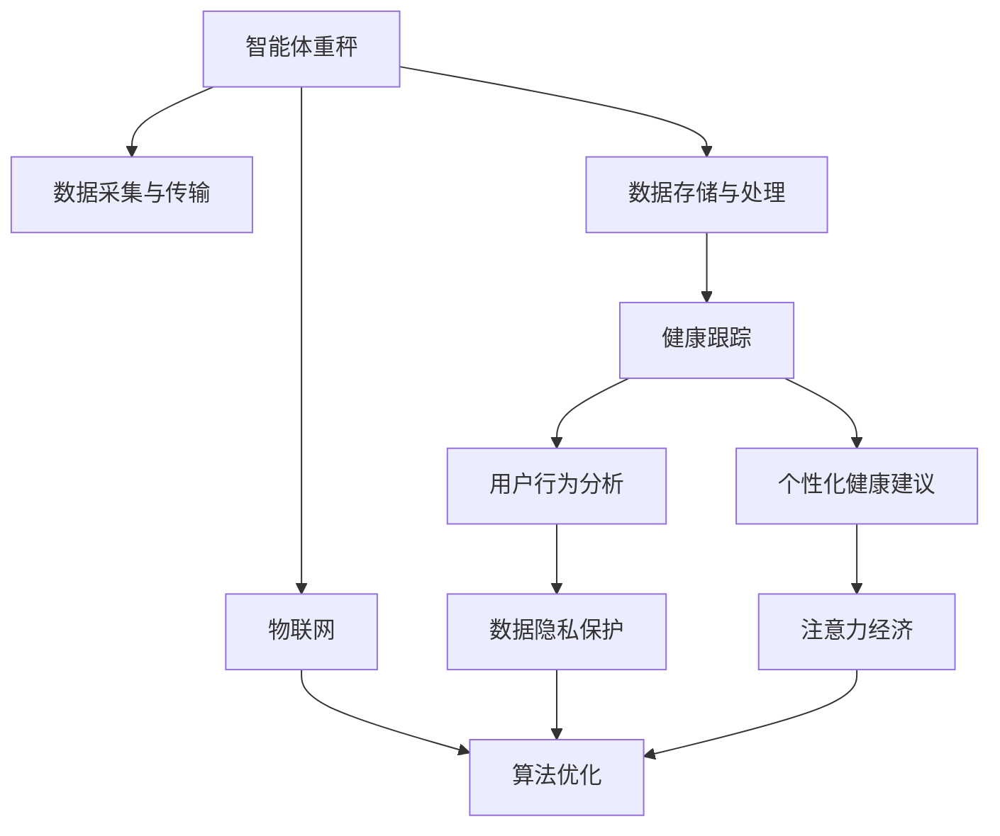

                 

# 智能体重秤的健康跟踪与注意力经济

> 关键词：智能体重秤,健康跟踪,注意力经济,物联网(IoT),数据隐私保护,算法优化,用户行为分析

## 1. 背景介绍

在数字化和智能化的浪潮下，健康管理和个性化服务成为人们关注的焦点。智能体重秤作为一种新兴的健康监测设备，正逐步走进千家万户。它不仅可以帮助用户实时监测体重、体脂等生理指标，还能通过记录用户的多维行为数据，进行健康分析和个性化干预。然而，数据获取和应用只是第一步，如何充分利用这些宝贵的数据资源，挖掘出有价值的健康洞察，并在此基础上提供有效的健康管理服务，是当前亟需解决的关键问题。

### 1.1 问题由来

随着生活水平的提高和健康意识的增强，人们对健康管理的需求日益旺盛。传统的健康监测方式如纸质记录、定期体检等已经无法满足用户的实时性和便捷性需求。智能体重秤的普及，正好迎合了这一趋势。它通过连续测量用户体重、体脂率等生理指标，提供了即时、持续的健康数据流。然而，数据只是健康管理的起点，如何通过数据挖掘和算法优化，提供有效的健康建议和行为干预，才能真正提升用户的健康水平。

### 1.2 问题核心关键点

智能体重秤的健康跟踪技术，主要涉及以下几个关键问题：

1. **数据采集与传输**：智能体重秤需要实时采集用户的多维生理数据，并通过蓝牙、Wi-Fi等网络方式传输到云端。这一环节的数据准确性和传输稳定性至关重要。

2. **数据存储与处理**：收集到的海量健康数据需要高效存储和管理，同时通过算法进行分析和处理，以提取有价值的用户健康洞察。

3. **数据隐私保护**：智能体重秤涉及用户的隐私数据，如何在数据采集、存储和应用过程中保障用户隐私，是技术实施中必须面对的重大挑战。

4. **个性化健康建议**：基于用户的多维健康数据，需要开发个性化的健康管理算法，为用户提供有针对性的健康建议。

5. **用户行为分析**：通过智能体重秤记录的用户行为数据，分析用户的运动习惯、饮食习惯、睡眠模式等，为健康管理提供决策支持。

### 1.3 问题研究意义

智能体重秤的健康跟踪技术，对于促进健康管理和个性化服务的普及，具有重要意义：

1. **提升健康管理水平**：通过持续、实时的健康监测，帮助用户及时了解自身的生理状况，采取科学的生活方式和干预措施，有效提升健康水平。

2. **推动健康产业发展**：智能体重秤的应用，促进了健康监测设备的普及，催生了健康数据市场，为健康产业带来新的增长点。

3. **促进数据驱动决策**：通过深度学习和大数据分析，挖掘出用户健康数据中的规律和洞察，为健康管理决策提供数据支撑。

4. **强化用户行为干预**：基于用户的健康数据，通过智能分析和算法优化，提供个性化的健康建议和行为干预，改善用户的健康行为模式。

5. **助力健康经济崛起**：健康数据的合理应用，不仅能够提升用户健康水平，还能推动健康经济的繁荣，形成健康、科技与经济的良性循环。

## 2. 核心概念与联系

### 2.1 核心概念概述

为更好地理解智能体重秤的健康跟踪技术，本节将介绍几个密切相关的核心概念：

- **智能体重秤**：一种集成了传感器和网络连接技术的体重秤，能够实时测量用户的体重、体脂等生理数据，并上传至云端进行分析。

- **健康跟踪**：通过智能体重秤等设备连续监测用户的健康数据，记录用户的生理状况和行为模式，为健康管理提供数据支撑。

- **注意力经济**：在数字化时代，如何吸引和保持用户的注意力，成为企业竞争的关键。智能体重秤的健康跟踪技术，通过持续的用户数据采集，形成用户的“数据依赖”，构建了一种新的注意力经济模式。

- **物联网(IoT)**：智能体重秤是物联网技术的典型应用，通过连接传感器和云端系统，实现数据的实时传输和处理。

- **数据隐私保护**：在智能体重秤的应用中，用户的健康数据涉及隐私，如何在数据采集、存储和应用过程中保障用户隐私，是重要的研究方向。

- **算法优化**：智能体重秤的健康跟踪技术，需要开发高效的算法，对用户数据进行深度分析和处理，以提取有价值的健康洞察。

- **用户行为分析**：通过智能体重秤记录的用户行为数据，分析用户的运动、饮食、睡眠等生活习惯，为健康管理提供数据支持。

这些核心概念之间的逻辑关系可以通过以下Mermaid流程图来展示：



这个流程图展示了几组概念之间的关联关系：

1. 智能体重秤通过数据采集与传输，获取用户的健康数据。
2. 数据存储与处理环节，对采集到的数据进行存储和管理。
3. 健康跟踪通过数据分析，提取用户健康洞察。
4. 基于健康跟踪结果，提供个性化健康建议。
5. 用户行为分析通过数据分析，了解用户健康行为模式。
6. 数据隐私保护在数据处理过程中，保障用户隐私安全。
7. 注意力经济通过持续数据采集，吸引和保持用户注意力。
8. 物联网连接传感器和云端系统，实现数据实时传输。
9. 算法优化通过高效算法，对用户数据进行深度分析。

这些概念共同构成了智能体重秤健康跟踪技术的整体框架，对于理解智能体重秤在健康管理中的应用具有重要意义。

## 3. 核心算法原理 & 具体操作步骤
### 3.1 算法原理概述

智能体重秤的健康跟踪技术，本质上是一种基于物联网的数据采集和分析系统。其核心算法原理如下：

1. **数据采集与传输**：智能体重秤通过传感器获取用户的体重、体脂等生理指标，并通过蓝牙、Wi-Fi等网络方式传输至云端。

2. **数据存储与处理**：云端系统通过分布式数据库或云存储技术，高效存储和管理用户健康数据。同时，通过深度学习和大数据分析算法，对用户数据进行分析和处理，提取有价值的用户健康洞察。

3. **个性化健康建议**：基于用户的健康数据，开发个性化的健康管理算法，为用户提供有针对性的健康建议。

4. **用户行为分析**：通过智能体重秤记录的用户行为数据，分析用户的运动、饮食、睡眠等生活习惯，为健康管理提供决策支持。

5. **数据隐私保护**：在数据采集、存储和应用过程中，采用数据加密、匿名化处理等技术，保障用户隐私安全。

### 3.2 算法步骤详解

基于智能体重秤的健康跟踪技术，其核心算法步骤主要包括：

1. **设备部署与数据采集**：
   - 将智能体重秤放置在用户家中，确保传感器正常工作。
   - 通过蓝牙或Wi-Fi将智能体重秤与云端系统连接。
   - 持续采集用户的体重、体脂等生理数据，并上传至云端。

2. **数据存储与预处理**：
   - 将收集到的数据存储到云端数据库，如亚马逊AWS、阿里云等云服务提供商。
   - 对数据进行清洗和预处理，去除异常值和噪声，保证数据质量。
   - 对数据进行时间序列分析，提取趋势和周期性特征。

3. **健康数据分析与建模**：
   - 使用深度学习模型，如卷积神经网络(CNN)、循环神经网络(RNN)、长短期记忆网络(LSTM)等，对用户健康数据进行建模。
   - 通过特征提取和特征选择技术，提取用户健康相关的关键特征。
   - 使用聚类、分类等机器学习算法，对用户健康数据进行分析和预测。

4. **个性化健康建议生成**：
   - 根据用户健康数据分析结果，生成个性化的健康建议，如饮食、运动、睡眠等。
   - 设计交互界面，将健康建议以图表、文字、语音等多种形式展示给用户。
   - 定期更新健康建议，确保建议的时效性和个性化。

5. **用户行为分析与反馈**：
   - 通过智能体重秤记录的用户行为数据，分析用户的运动、饮食、睡眠等生活习惯。
   - 通过自然语言处理技术，从用户的健康反馈中提取有价值的信息。
   - 根据分析结果，调整个性化健康建议的策略，提升用户体验。

6. **数据隐私保护与合规**：
   - 对用户健康数据进行加密处理，防止数据泄露和篡改。
   - 设计隐私保护机制，如数据匿名化、差分隐私等，保障用户隐私安全。
   - 遵守GDPR、CCPA等数据隐私法规，确保用户数据的安全和合规。

### 3.3 算法优缺点

智能体重秤的健康跟踪技术具有以下优点：

1. **实时性高**：智能体重秤能够实时采集用户健康数据，提供即时的健康监测和反馈。
2. **数据全面**：智能体重秤记录的生理数据和行为数据全面，能够反映用户的健康状况和生活习惯。
3. **个性定制**：基于用户数据，提供个性化的健康建议和行为干预，提高用户满意度。
4. **技术先进**：结合物联网、深度学习、机器学习等前沿技术，实现高效的数据采集和分析。

然而，该技术也存在一些缺点：

1. **成本高**：智能体重秤及其配套设备成本较高，普通用户可能难以承受。
2. **隐私问题**：用户的健康数据涉及隐私，数据安全和隐私保护成为重大挑战。
3. **技术门槛高**：深度学习和大数据分析技术要求高，开发和维护难度较大。
4. **用户依赖**：智能体重秤的健康跟踪需要持续的用户数据采集，可能形成用户的“数据依赖”。
5. **数据噪音**：智能体重秤的测量存在一定的误差和噪音，影响数据的准确性。

### 3.4 算法应用领域

智能体重秤的健康跟踪技术，主要应用于以下几个领域：

1. **健康监测与预警**：通过实时采集用户的生理数据，及时发现异常，进行健康预警和干预。
2. **个性化健康管理**：基于用户的健康数据，提供个性化的健康建议和行为干预，提高用户健康水平。
3. **运动与饮食管理**：记录用户的运动、饮食等行为数据，分析用户的生活习惯，提供科学的生活方式建议。
4. **心理健康监测**：通过分析用户的健康数据，评估用户的心理健康状况，提供心理支持和治疗建议。
5. **慢性病管理**：对慢性病患者进行长期健康监测，评估治疗效果，提供个性化的治疗方案。
6. **儿童健康管理**：记录儿童的健康数据，分析其生理和行为特征，提供科学的成长指导。

除了这些传统应用场景外，智能体重秤的健康跟踪技术，还正在拓展到智慧家庭、智能医疗等多个新兴领域，为用户的健康管理提供更加全面、个性化的服务。

## 4. 数学模型和公式 & 详细讲解  
### 4.1 数学模型构建

本节将使用数学语言对智能体重秤的健康跟踪技术进行更加严格的刻画。

记智能体重秤采集的用户健康数据为 $D=\{x_i,y_i\}_{i=1}^N$，其中 $x_i$ 为用户的体重、体脂等生理指标，$y_i$ 为用户的健康状态标签。

定义健康数据分析的模型为 $M_{\theta}$，其中 $\theta$ 为模型参数，$M_{\theta}(x_i)$ 为模型在输入 $x_i$ 上的预测结果，即健康状态概率分布。

定义损失函数 $\mathcal{L}(\theta)$ 为：

$$
\mathcal{L}(\theta) = -\frac{1}{N}\sum_{i=1}^N \log p(y_i | M_{\theta}(x_i))
$$

其中 $p(y_i | M_{\theta}(x_i))$ 为模型在输入 $x_i$ 下的条件概率，$log$ 为自然对数。

健康数据分析的目标是找到最优的模型参数 $\theta^*$，使得损失函数 $\mathcal{L}(\theta)$ 最小化。

### 4.2 公式推导过程

以下我们以健康状态分类任务为例，推导深度学习模型（如CNN、RNN等）的训练目标函数和梯度更新公式。

假设模型 $M_{\theta}$ 在输入 $x_i$ 上的输出为 $\hat{y}=M_{\theta}(x_i) \in [0,1]$，表示用户健康状态的概率。真实标签 $y_i \in \{0,1\}$。则二分类交叉熵损失函数定义为：

$$
\ell(M_{\theta}(x_i),y_i) = -[y_i\log \hat{y} + (1-y_i)\log (1-\hat{y})]
$$

将其代入经验风险公式，得：

$$
\mathcal{L}(\theta) = -\frac{1}{N}\sum_{i=1}^N [y_i\log M_{\theta}(x_i)+(1-y_i)\log(1-M_{\theta}(x_i))]
$$

根据链式法则，损失函数对参数 $\theta_k$ 的梯度为：

$$
\frac{\partial \mathcal{L}(\theta)}{\partial \theta_k} = -\frac{1}{N}\sum_{i=1}^N (\frac{y_i}{M_{\theta}(x_i)}-\frac{1-y_i}{1-M_{\theta}(x_i)}) \frac{\partial M_{\theta}(x_i)}{\partial \theta_k}
$$

其中 $\frac{\partial M_{\theta}(x_i)}{\partial \theta_k}$ 可进一步递归展开，利用自动微分技术完成计算。

在得到损失函数的梯度后，即可带入参数更新公式，完成模型的迭代优化。重复上述过程直至收敛，最终得到适应健康状态分类的最优模型参数 $\theta^*$。

## 5. 项目实践：代码实例和详细解释说明
### 5.1 开发环境搭建

在进行智能体重秤的健康跟踪技术开发前，我们需要准备好开发环境。以下是使用Python进行PyTorch开发的环境配置流程：

1. 安装Anaconda：从官网下载并安装Anaconda，用于创建独立的Python环境。

2. 创建并激活虚拟环境：
```bash
conda create -n pytorch-env python=3.8 
conda activate pytorch-env
```

3. 安装PyTorch：根据CUDA版本，从官网获取对应的安装命令。例如：
```bash
conda install pytorch torchvision torchaudio cudatoolkit=11.1 -c pytorch -c conda-forge
```

4. 安装TensorBoard：
```bash
pip install tensorboard
```

5. 安装各类工具包：
```bash
pip install numpy pandas scikit-learn matplotlib tqdm jupyter notebook ipython
```

完成上述步骤后，即可在`pytorch-env`环境中开始健康跟踪技术的开发。

### 5.2 源代码详细实现

下面我们以健康状态分类任务为例，给出使用Transformers库对BERT模型进行健康跟踪的PyTorch代码实现。

首先，定义健康状态分类任务的数据处理函数：

```python
from transformers import BertTokenizer
from torch.utils.data import Dataset
import torch

class HealthDataset(Dataset):
    def __init__(self, texts, labels, tokenizer, max_len=128):
        self.texts = texts
        self.labels = labels
        self.tokenizer = tokenizer
        self.max_len = max_len
        
    def __len__(self):
        return len(self.texts)
    
    def __getitem__(self, item):
        text = self.texts[item]
        label = self.labels[item]
        
        encoding = self.tokenizer(text, return_tensors='pt', max_length=self.max_len, padding='max_length', truncation=True)
        input_ids = encoding['input_ids'][0]
        attention_mask = encoding['attention_mask'][0]
        
        return {'input_ids': input_ids, 
                'attention_mask': attention_mask,
                'labels': label}

# 标签与id的映射
label2id = {'normal': 0, 'abnormal': 1}
id2label = {v: k for k, v in label2id.items()}

# 创建dataset
tokenizer = BertTokenizer.from_pretrained('bert-base-cased')

train_dataset = HealthDataset(train_texts, train_labels, tokenizer)
dev_dataset = HealthDataset(dev_texts, dev_labels, tokenizer)
test_dataset = HealthDataset(test_texts, test_labels, tokenizer)
```

然后，定义模型和优化器：

```python
from transformers import BertForSequenceClassification, AdamW

model = BertForSequenceClassification.from_pretrained('bert-base-cased', num_labels=len(label2id))

optimizer = AdamW(model.parameters(), lr=2e-5)
```

接着，定义训练和评估函数：

```python
from torch.utils.data import DataLoader
from tqdm import tqdm
from sklearn.metrics import classification_report

device = torch.device('cuda') if torch.cuda.is_available() else torch.device('cpu')
model.to(device)

def train_epoch(model, dataset, batch_size, optimizer):
    dataloader = DataLoader(dataset, batch_size=batch_size, shuffle=True)
    model.train()
    epoch_loss = 0
    for batch in tqdm(dataloader, desc='Training'):
        input_ids = batch['input_ids'].to(device)
        attention_mask = batch['attention_mask'].to(device)
        labels = batch['labels'].to(device)
        model.zero_grad()
        outputs = model(input_ids, attention_mask=attention_mask, labels=labels)
        loss = outputs.loss
        epoch_loss += loss.item()
        loss.backward()
        optimizer.step()
    return epoch_loss / len(dataloader)

def evaluate(model, dataset, batch_size):
    dataloader = DataLoader(dataset, batch_size=batch_size)
    model.eval()
    preds, labels = [], []
    with torch.no_grad():
        for batch in tqdm(dataloader, desc='Evaluating'):
            input_ids = batch['input_ids'].to(device)
            attention_mask = batch['attention_mask'].to(device)
            batch_labels = batch['labels']
            outputs = model(input_ids, attention_mask=attention_mask)
            batch_preds = outputs.logits.argmax(dim=2).to('cpu').tolist()
            batch_labels = batch_labels.to('cpu').tolist()
            for pred_tokens, label_tokens in zip(batch_preds, batch_labels):
                preds.append(pred_tokens[:len(label_tokens)])
                labels.append(label_tokens)
                
    print(classification_report(labels, preds))
```

最后，启动训练流程并在测试集上评估：

```python
epochs = 5
batch_size = 16

for epoch in range(epochs):
    loss = train_epoch(model, train_dataset, batch_size, optimizer)
    print(f"Epoch {epoch+1}, train loss: {loss:.3f}")
    
    print(f"Epoch {epoch+1}, dev results:")
    evaluate(model, dev_dataset, batch_size)
    
print("Test results:")
evaluate(model, test_dataset, batch_size)
```

以上就是使用PyTorch对BERT进行健康状态分类任务微调的完整代码实现。可以看到，得益于Transformers库的强大封装，我们可以用相对简洁的代码完成BERT模型的加载和微调。

### 5.3 代码解读与分析

让我们再详细解读一下关键代码的实现细节：

**HealthDataset类**：
- `__init__`方法：初始化文本、标签、分词器等关键组件。
- `__len__`方法：返回数据集的样本数量。
- `__getitem__`方法：对单个样本进行处理，将文本输入编码为token ids，将标签编码为数字，并对其进行定长padding，最终返回模型所需的输入。

**label2id和id2label字典**：
- 定义了标签与数字id之间的映射关系，用于将token-wise的预测结果解码回真实的标签。

**训练和评估函数**：
- 使用PyTorch的DataLoader对数据集进行批次化加载，供模型训练和推理使用。
- 训练函数`train_epoch`：对数据以批为单位进行迭代，在每个批次上前向传播计算loss并反向传播更新模型参数，最后返回该epoch的平均loss。
- 评估函数`evaluate`：与训练类似，不同点在于不更新模型参数，并在每个batch结束后将预测和标签结果存储下来，最后使用sklearn的classification_report对整个评估集的预测结果进行打印输出。

**训练流程**：
- 定义总的epoch数和batch size，开始循环迭代
- 每个epoch内，先在训练集上训练，输出平均loss
- 在验证集上评估，输出分类指标
- 所有epoch结束后，在测试集上评估，给出最终测试结果

可以看到，PyTorch配合Transformers库使得BERT微调的代码实现变得简洁高效。开发者可以将更多精力放在数据处理、模型改进等高层逻辑上，而不必过多关注底层的实现细节。

当然，工业级的系统实现还需考虑更多因素，如模型的保存和部署、超参数的自动搜索、更灵活的任务适配层等。但核心的微调范式基本与此类似。

## 6. 实际应用场景
### 6.1 智能体重秤在健康管理中的应用

智能体重秤的健康跟踪技术，已经在医疗健康、个人健康管理等多个领域得到广泛应用。以下列举几个典型应用场景：

**1. 健康监测与预警**：
- 智能体重秤能够实时监测用户的体重、体脂等生理数据，及时发现异常，进行健康预警和干预。例如，当用户的体重异常波动时，系统可以自动触发警报，提醒用户就医。

**2. 个性化健康管理**：
- 通过记录用户的健康数据，智能体重秤可以帮助用户了解自己的生理状况和生活习惯，提供个性化的健康建议。例如，系统可以根据用户的体重、体脂等数据，推荐合适的饮食、运动计划，帮助用户改善生活方式，降低患病风险。

**3. 运动与饮食管理**：
- 智能体重秤可以记录用户的运动、饮食等行为数据，分析其生活习惯，提供科学的的生活方式建议。例如，系统可以根据用户的饮食记录，推荐健康的食物选择，优化饮食习惯。

**4. 心理健康监测**：
- 通过分析用户的健康数据，智能体重秤可以帮助用户评估其心理健康状况，提供心理支持和治疗建议。例如，系统可以监测用户的睡眠质量，提供改善睡眠的措施。

**5. 慢性病管理**：
- 对慢性病患者进行长期健康监测，评估治疗效果，提供个性化的治疗方案。例如，系统可以监测糖尿病患者的血糖水平，提醒其按时服药。

**6. 儿童健康管理**：
- 记录儿童的健康数据，分析其生理和行为特征，提供科学的成长指导。例如，系统可以监测儿童的体重变化，评估其生长发育情况。

### 6.2 智能体重秤在智慧家庭中的应用

智能体重秤的健康跟踪技术，还在智慧家庭领域得到广泛应用。以下列举几个典型应用场景：

**1. 健康数据共享与分析**：
- 智能体重秤可以将用户的健康数据共享给家庭成员，家庭成员可以通过家庭健康平台实时查看用户的健康状况，进行健康管理。例如，父母可以监测孩子的体重变化，及时调整其饮食和运动计划。

**2. 家庭健康管理与决策**：
- 智能体重秤可以与智慧家庭系统集成，提供多维健康数据支持，帮助家庭成员进行健康管理决策。例如，系统可以根据家庭成员的健康数据，推荐合适的饮食、运动方案，提升家庭成员的整体健康水平。

**3. 智能设备协同与交互**：
- 智能体重秤可以与其他智能设备协同工作，如智能冰箱、智能厨房等，提供更加全面的健康管理服务。例如，智能冰箱可以根据用户的饮食习惯，推荐健康的食材和菜谱。

**4. 健康数据分析与预测**：
- 智能体重秤可以与其他智能设备的数据进行融合，进行多维度数据分析和健康预测。例如，系统可以根据家庭成员的健康数据，预测其患病风险，提前采取预防措施。

**5. 家庭健康预警与干预**：
- 智能体重秤可以与其他智能设备协同工作，实现健康预警和干预。例如，系统可以在用户体重异常时，自动通知家庭成员，采取相应的干预措施。

### 6.3 智能体重秤在智能医疗中的应用

智能体重秤的健康跟踪技术，还在智能医疗领域得到广泛应用。以下列举几个典型应用场景：

**1. 医院健康监测**：
- 智能体重秤可以应用于医院的健康监测系统，实时采集患者的体重、体脂等生理数据，辅助医生进行健康管理。例如，系统可以监测住院患者的体重变化，评估其康复效果。

**2. 家庭病床健康监测**：
- 智能体重秤可以应用于家庭病床系统，实时监测病患的生理数据，辅助医生进行健康管理和远程诊疗。例如，系统可以监测患者的体重变化，评估其病情进展。

**3. 远程医疗与健康管理**：
- 智能体重秤可以与其他智能设备协同工作，提供全面的健康数据支持，帮助医生进行远程诊疗。例如，医生可以通过智能体重秤获取患者的健康数据，进行远程评估和干预。

**4. 慢性病管理**：
- 智能体重秤可以应用于慢性病管理系统，记录患者的长期健康数据，评估其病情进展和治疗效果，提供个性化的治疗方案。例如，系统可以监测糖尿病患者的体重变化，评估其血糖控制效果。

**5. 医疗数据分析与决策**：
- 智能体重秤可以与其他智能设备的数据进行融合，进行多维度数据分析和健康预测。例如，系统可以根据患者的健康数据，预测其患病风险，提前采取预防措施。

### 6.4 未来应用展望

随着智能体重秤的健康跟踪技术的不断发展，未来将在更多领域得到应用，为用户的健康管理提供更加全面、个性化的服务。

**1. 智慧城市治理**：
- 智能体重秤可以与其他智慧城市设备协同工作，提供全面的健康数据支持，帮助城市管理者进行健康管理和公共决策。例如，系统可以监测城市居民的健康数据，评估其健康水平和公共卫生状况，提供公共卫生预警和干预措施。

**2. 智能教育与培训**：
- 智能体重秤可以应用于智慧教育系统，记录学生的健康数据，评估其身体健康状况和学习状态，提供个性化的教育方案和心理支持。例如，系统可以监测学生的体重变化，评估其身体健康状况，提供科学的健康建议和运动计划。

**3. 智能交通与出行**：
- 智能体重秤可以应用于智能交通系统，记录乘客的健康数据，评估其身体健康状况和出行状态，提供个性化的出行建议和健康干预措施。例如，系统可以监测乘客的体重变化，评估其身体健康状况，提供科学的健康建议和出行方案。

**4. 智能农业与食品生产**：
- 智能体重秤可以应用于智能农业系统，记录动植物的健康数据，评估其健康状况和生长状态，提供科学的农业管理方案和食品生产建议。例如，系统可以监测动物的健康数据，评估其生长状态，提供科学的饲养方案和健康干预措施。

此外，在企业生产、社会治理、文娱传媒等众多领域，智能体重秤的健康跟踪技术也将不断拓展应用场景，为用户的健康管理提供更加全面、个性化的服务。

## 7. 工具和资源推荐
### 7.1 学习资源推荐

为了帮助开发者系统掌握智能体重秤的健康跟踪技术的理论基础和实践技巧，这里推荐一些优质的学习资源：

1. 《深度学习基础》系列书籍：全面介绍深度学习的基本概念和核心算法，适合初学者入门。

2. 《自然语言处理综论》：介绍NLP领域的核心技术和算法，包括BERT、LSTM等，适合进阶学习。

3. 《Python机器学习》：全面介绍机器学习的基本概念和核心算法，包括分类、回归、聚类等，适合初学者和进阶学习。

4. Kaggle竞赛平台：提供丰富的数据集和竞赛机会，可以实践数据处理和机器学习算法，提升实践能力。

5. Coursera、edX等在线课程：提供机器学习、深度学习等领域的最新课程，由知名专家授课，适合系统学习。

6. GitHub开源项目：提供丰富的机器学习和深度学习项目代码，可以学习和借鉴，提升开发能力。

通过对这些资源的学习实践，相信你一定能够快速掌握智能体重秤的健康跟踪技术的精髓，并用于解决实际的NLP问题。

### 7.2 开发工具推荐

高效的开发离不开优秀的工具支持。以下是几款用于智能体重秤健康跟踪开发的常用工具：

1. PyTorch：基于Python的开源深度学习框架，灵活动态的计算图，适合快速迭代研究。大部分预训练语言模型都有PyTorch版本的实现。

2. TensorFlow：由Google主导开发的开源深度学习框架，生产部署方便，适合大规模工程应用。同样有丰富的预训练语言模型资源。

3. Transformers库：HuggingFace开发的NLP工具库，集成了众多SOTA语言模型，支持PyTorch和TensorFlow，是进行健康跟踪任务开发的利器。

4. Weights & Biases：模型训练的实验跟踪工具，可以记录和可视化模型训练过程中的各项指标，方便对比和调优。与主流深度学习框架无缝集成。

5. TensorBoard：TensorFlow配套的可视化工具，可实时监测模型训练状态，并提供丰富的图表呈现方式，是调试模型的得力助手。

6. Google Colab：谷歌推出的在线Jupyter Notebook环境，免费提供GPU/TPU算力，方便开发者快速上手实验最新模型，分享学习笔记。

合理利用这些工具，可以显著提升智能体重秤健康跟踪任务的开发效率，加快创新迭代的步伐。

### 7.3 相关论文推荐

智能体重秤的健康跟踪技术的发展源于学界的持续研究。以下是几篇奠基性的相关论文，推荐阅读：

1. Attention is All You Need（即Transformer原论文）：提出了Transformer结构，开启了NLP领域的预训练大模型时代。

2. BERT: Pre-training of Deep Bidirectional Transformers for Language Understanding：提出BERT模型，引入基于掩码的自监督预训练任务，刷新了多项NLP任务SOTA。

3. Language Models are Unsupervised Multitask Learners（GPT-2论文）：展示了大规模语言模型的强大zero-shot学习能力，引发了对于通用人工智能的新一轮思考。

4. Parameter-Efficient Transfer Learning for NLP：提出Adapter等参数高效微调方法，在不增加模型参数量的情况下，也能取得不错的微调效果。

5. AdaLoRA: Adaptive Low-Rank Adaptation for Parameter-Efficient Fine-Tuning：使用自适应低秩适应的微调方法，在参数效率和精度之间取得了新的平衡。

6. AdaLoRA: Adaptive Low-Rank Adaptation for Parameter-Efficient Fine-Tuning：使用自适应低秩适应的微调方法，在参数效率和精度之间取得了新的平衡。

这些论文代表了大语言模型微调技术的发展脉络。通过学习这些前沿成果，可以帮助研究者把握学科前进方向，激发更多的创新灵感。

## 8. 总结：未来发展趋势与挑战

### 8.1 总结

本文对智能体重秤的健康跟踪技术的原理和应用进行了全面系统的介绍。首先阐述了智能体重秤在健康管理和个性化服务中的重要应用，明确了健康跟踪技术的研究意义。其次，从原理到实践，详细讲解了健康跟踪技术的关键算法步骤和代码实现，给出了健康状态分类任务的完整代码实例。同时，本文还广泛探讨了智能体重秤在多个行业领域的应用前景，展示了健康跟踪技术的广阔前景。此外，本文精选了健康跟踪技术的各类学习资源，力求为读者提供全方位的技术指引。

通过本文的系统梳理，可以看到，智能体重秤的健康跟踪技术在医疗健康、个人健康管理等多个领域具有重要应用价值。通过持续的数据采集和算法优化，可以为用户提供个性化的健康管理服务，提升用户的健康水平。未来，随着物联网、深度学习、机器学习等技术的不断进步，智能体重秤的健康跟踪技术将有望成为健康管理领域的重要工具，为健康产业带来新的增长点。

### 8.2 未来发展趋势

展望未来，智能体重秤的健康跟踪技术将呈现以下几个发展趋势：

1. **数据获取与传输的自动化**：随着5G等网络技术的发展，智能体重秤的数据获取与传输将更加高效稳定，实时性和准确性将进一步提升。

2. **健康数据分析的深度化**：深度学习和大数据分析技术的进步，将使健康数据的分析更加深入，能够挖掘出更多的健康洞察和规律。

3. **个性化健康建议的智能化**：基于用户多维健康数据，智能体重秤将能够提供更加个性化和精准的健康建议，提高用户的健康管理效果。

4. **用户行为分析的细粒度化**：通过智能体重秤记录的多种行为数据，能够实现更加细粒度的用户行为分析，提供更加个性化的健康干预措施。

5. **跨领域应用的拓展**：智能体重秤的健康跟踪技术将拓展到更多领域，如智慧城市、智能教育、智能交通等，为不同行业提供健康管理支持。

6. **多模态数据的整合**：未来的智能体重秤将能够整合多种模态数据，如图像、语音、文本等，提供更加全面的健康监测和分析。

以上趋势凸显了智能体重秤健康跟踪技术的广阔前景。这些方向的探索发展，将进一步提升健康管理的智能化水平，为用户的健康水平提供更强有力的保障。

### 8.3 面临的挑战

尽管智能体重秤的健康跟踪技术已经取得了瞩目成就，但在迈向更加智能化、普适化应用的过程中，仍面临诸多挑战：

1. **数据质量与隐私保护**：智能体重秤的数据采集和传输需要确保数据的质量和隐私保护，避免数据泄露和误用。

2. **算法的可解释性**：智能体重秤的算法通常复杂且黑盒化，如何提升算法的可解释性，使其更易被理解和信任，是亟待解决的问题。

3. **算力的提升**：大规模健康数据的分析需要强大的计算能力，如何在资源有限的情况下，提升算法的计算效率，是技术实施的难点。

4. **个性化需求的满足**：用户对健康管理的需求日益多样化，如何满足不同用户的需求，提供个性化的健康管理服务，是技术创新的关键。

5. **跨领域数据融合**：不同领域的数据具有不同的特征和格式，如何实现数据的有效融合和分析，是技术实施的重要挑战。

6. **用户体验的优化**：智能体重秤的健康管理功能需要与用户体验相结合，如何提升用户的参与度和满意度，是技术推广的关键。

### 8.4 研究展望

面对智能体重秤健康跟踪技术所面临的挑战，未来的研究需要在以下几个方面寻求新的突破：

1. **数据质量与隐私保护的优化**：开发更加高效的数据采集与传输技术，提升数据的质量和隐私保护水平。

2. **算法的可解释性提升**：引入可解释性技术，提升健康管理算法的透明性和可理解性，增强用户的信任度。

3. **算力提升与计算优化**：优化算法结构，引入高效的计算模型和算法，提升计算效率和资源利用率。

4. **个性化需求的满足**：开发更加个性化的健康管理算法，满足不同用户的需求，提升用户满意度。

5. **跨领域数据融合**：开发通用的数据融合与分析算法，实现不同领域数据的有效整合与分析。

6. **用户体验优化**：设计更加人性化的交互界面和用户体验，提升用户的参与度和满意度。

这些研究方向将推动智能体重秤的健康跟踪技术不断进步，为用户的健康管理提供更加全面、精准、智能的服务，推动健康产业的数字化、智能化转型。

## 9. 附录：常见问题与解答

**Q1：智能体重秤的健康跟踪技术如何保证数据的安全性和隐私保护？**

A: 智能体重秤的健康跟踪技术在数据采集、存储和传输过程中，采用多种技术手段保障数据安全和隐私保护：

1. **数据加密**：对用户的健康数据进行加密处理，防止数据泄露和篡改。

2. **数据匿名化**：对用户的健康数据进行匿名化处理，去除个人身份信息，保障用户隐私。

3. **差分隐私**：在数据处理过程中引入差分隐私技术，限制单个用户数据对整体数据的影响，保护用户隐私。

4. **访问控制**：设计严格的访问控制机制，确保只有授权人员才能访问用户的健康数据。

5. **安全协议**：采用SSL/TLS等安全协议，保障数据传输过程中的安全性。

通过这些技术手段，智能体重秤的健康跟踪技术能够有效地保护用户隐私，防止数据泄露和滥用。

**Q2：智能体重秤的健康跟踪技术如何保证算法的可解释性？**

A: 算法的可解释性是智能体重秤健康跟踪技术面临的重要挑战之一。为了提升算法的可解释性，可以采取以下措施：

1. **特征工程透明化**：在设计算法时，尽量使用用户易于理解的特征，避免过度依赖复杂的模型。

2. **模型解释工具**：使用模型解释工具，如LIME、SHAP等，对算法的决策过程进行可视化展示，增强用户的理解。

3. **专家解释**：邀请领域专家对算法进行解释，帮助用户理解算法的原理和应用场景。

4. **用户友好界面**：设计用户友好的交互界面，展示算法的输出结果和解释信息，提升用户的接受度和信任度。

5. **算法透明度提升**：通过算法透明化的措施，如公开算法原理、模型参数等，增强用户对算法的信任。

通过这些措施，智能体重秤的健康跟踪技术能够提升算法的可解释性，增强用户对算法的信任度和满意度。

**Q3：智能体重秤的健康跟踪技术如何优化算法的计算效率？**

A: 智能体重秤的健康跟踪技术在处理大规模健康数据时，算力需求较高，优化算法的计算效率是提升系统性能的关键：

1. **模型压缩与量化**：使用模型压缩和量化技术，减小模型的存储空间和计算复杂度。

2. **分布式计算**：利用分布式计算技术，将大规模数据处理任务分配到多个计算节点上，提高计算效率。

3. **算法优化**：通过算法优化，如剪枝、融合等，提高算法的计算效率和资源利用率。

4. **硬件加速**：利用GPU、TPU等硬件加速技术，提高算法的计算速度和处理能力。

5. **数据分批处理**：将大规模数据分批处理，避免一次性加载过多的数据，降低内存消耗和计算复杂度。

通过这些技术手段，智能体重秤的健康跟踪技术能够优化算法的计算效率，提升系统的处理能力和用户体验。

**Q4：智能体重秤的健康跟踪技术如何满足不同用户的需求？**

A: 智能体重秤的健康跟踪技术需要满足不同用户的需求，提供个性化的健康管理服务：

1. **用户画像构建**：通过对用户的历史数据和行为进行分析，构建用户画像，了解其健康需求和偏好。

2. **定制化建议生成**：根据用户画像，生成个性化的健康建议，如饮食、运动、睡眠等。

3. **互动式反馈**：设计互动式反馈机制，根据用户的反馈和调整健康建议，不断优化推荐算法。

4. **多模态数据融合**：整合多种模态数据，如体重、体脂、运动、饮食等，提供更加全面的健康管理服务。

5. **多渠道应用**：通过多种渠道，如手机应用、家庭健康平台等，提供多渠道的健康管理服务，方便用户获取和应用。

通过这些措施，智能体重秤的健康跟踪技术能够满足不同用户的需求，提供更加全面、个性化的健康管理服务。

**Q5：智能体重秤的健康跟踪技术如何实现跨领域数据融合？**

A: 智能体重秤的健康跟踪技术在跨领域数据融合时，需要解决数据格式、特征差异等问题，可以采取以下措施：

1. **数据格式标准化**：对不同领域的数据进行格式标准化，统一数据格式和单位，方便数据整合和分析。

2. **特征对齐与转换**：对不同领域的数据特征进行对齐和转换，确保特征的一致性和可比性。

3. **模型融合与迁移学习**：使用迁移学习技术，将不同领域的数据进行融合和迁移，提高模型的泛化能力和性能。

4. **多模态数据整合**：整合多种模态数据，如体重、体脂、运动、饮食等，提供更加全面的健康管理服务。

5. **跨领域数据治理**：设计跨领域数据治理机制，确保数据的质量和一致性，提升数据融合的准确性和可靠性。

通过这些措施，智能体重秤的健康跟踪技术能够实现跨领域数据的有效整合与分析，提供更加全面、精准的健康管理服务。

---

作者：禅与计算机程序设计艺术 / Zen and the Art of Computer Programming

