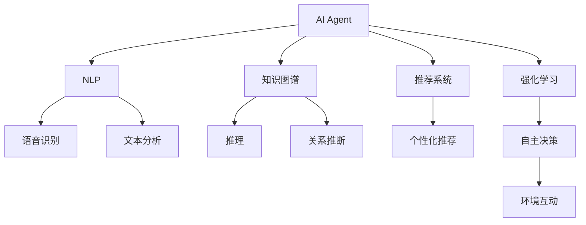
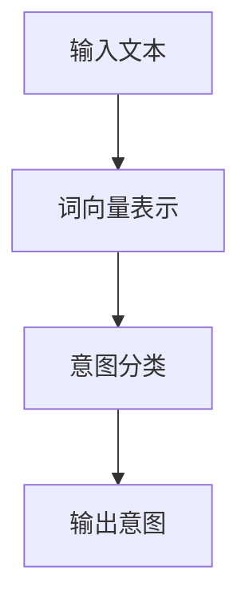

                 

## 1. 背景介绍

### 1.1 问题由来

随着人工智能技术的迅猛发展，AI Agent（人工智能代理）在智能协作系统中扮演着越来越重要的角色。从早期的专家系统到现今的深度学习模型，AI Agent已经在医疗诊断、金融分析、自动驾驶等多个领域展现了其卓越的性能。AI Agent能够自动化地处理大量数据，辅助决策，从而极大地提升了工作效率和准确性。然而，现有的AI Agent还存在诸多局限性，难以应对复杂的协作场景和实时变化的需求。本文旨在探讨AI Agent的现状与未来，分析其在智能协作中的挑战和机遇，展望未来的发展方向。

### 1.2 问题核心关键点

AI Agent的核心关键点包括：

- **协作能力**：在智能协作系统中，AI Agent需要能够与人类用户和系统组件进行高效互动，理解语义，生成自然语言响应，并具备灵活的适应能力。
- **自主性**：AI Agent应具备一定程度的自主性，能够在不同任务间进行知识迁移和决策制定。
- **可解释性**：为了增强可信度和透明度，AI Agent的决策过程应具备一定的可解释性，让用户能够理解其工作原理和依据。
- **多模态处理**：在处理语音、文本、图像等多模态数据时，AI Agent应具备多模态融合和转换的能力。
- **知识更新**：AI Agent应能够持续学习新知识，并在实际应用中不断地进行知识更新和迭代。
- **伦理与安全**：在开发和使用AI Agent时，应充分考虑伦理和安全问题，确保其决策和行为符合社会道德和法律法规。

这些关键点共同构成了AI Agent的功能和技术框架，使其能够在复杂多变的智能协作环境中发挥重要作用。

## 2. 核心概念与联系

### 2.1 核心概念概述

为更好地理解AI Agent在智能协作系统中的应用，本文将介绍几个关键概念及其相互联系：

- **AI Agent**：指具有一定自主性和智能推理能力的软件系统，能够进行知识获取、问题求解、协同工作等复杂任务。
- **自然语言处理(NLP)**：涉及计算机与人类自然语言交互的技术，包括语音识别、文本分析、情感计算等，是AI Agent实现智能协作的基础。
- **知识图谱(KG)**：用于表示知识及其关系的结构化数据库，提供丰富的语义信息，辅助AI Agent进行推理和决策。
- **推荐系统(Recommendation System)**：根据用户行为和偏好，推荐个性化内容或服务，增强AI Agent在协作中的用户体验。
- **强化学习(RL)**：一种通过与环境互动，优化决策策略的学习方法，广泛应用于AI Agent的自主行为和学习。

这些概念之间的逻辑关系可以通过以下Mermaid流程图来展示：



这个流程图展示了几大关键概念及其相互关系：

1. AI Agent通过NLP技术与人类用户进行交互。
2. 知识图谱提供丰富的语义信息，辅助AI Agent进行推理和决策。
3. 推荐系统根据用户行为，提供个性化服务，增强用户体验。
4. 强化学习使AI Agent具备自主决策能力，通过与环境互动优化策略。

## 3. 核心算法原理 & 具体操作步骤

### 3.1 算法原理概述

AI Agent的核心算法原理基于多模态数据的融合、自然语言处理、强化学习等技术。其基本工作流程如下：

1. **数据融合**：将来自不同源的多模态数据（如语音、文本、图像等）进行整合，形成统一的语义表示。
2. **语义理解**：通过NLP技术，解析用户的自然语言请求，理解其意图和背景信息。
3. **知识推理**：利用知识图谱中的语义信息，进行逻辑推理和关系推断，生成合理的回答或决策。
4. **推荐生成**：根据用户的兴趣和行为，使用推荐系统算法生成个性化推荐内容。
5. **自主决策**：通过强化学习，AI Agent不断优化策略，提升决策的准确性和效率。

### 3.2 算法步骤详解

#### 3.2.1 数据融合

数据融合的主要步骤包括：

1. **数据预处理**：对不同来源的数据进行清洗、去噪和标准化处理。
2. **特征提取**：提取各模态数据的特征，进行多模态特征融合。
3. **语义表示**：将融合后的特征映射为语义空间中的向量表示，形成统一语义。

以多模态对话系统为例，融合过程可概括为：

```mermaid
graph TB
    A[语音数据] --> B[文本数据]
    B --> C[图像数据]
    A --> D[文本数据]
    C --> E[图像数据]
    D --> F[文本数据]
    F --> G[图像数据]
    B --"特征提取"-> H
    C --"特征提取"-> H
    D --"特征提取"-> H
    E --"特征提取"-> H
    F --"特征提取"-> H
    G --"特征提取"-> H
    H --> I[语义表示]
```

#### 3.2.2 语义理解

语义理解的核心在于解析用户的自然语言请求，理解其意图和背景信息。常用的方法包括：

1. **意图识别**：通过NLP技术，对用户输入的文本进行意图分类，如询问、命令、请求等。
2. **实体抽取**：识别文本中的实体（如人名、地点、时间等），提取关键信息。
3. **上下文理解**：综合考虑用户的历史交互记录和当前上下文，进行综合推理。

例如，对于用户的查询“明天北京的天气怎么样？”，意图识别可确定其为询问天气，实体抽取可识别“北京”，上下文理解可结合历史记录，提供更准确的回答。

#### 3.2.3 知识推理

知识推理是AI Agent在智能协作中的关键能力，通过逻辑推理和关系推断，生成合理的回答或决策。常用的方法包括：

1. **规则推理**：基于预定义的规则，进行逻辑推理和匹配。
2. **图谱查询**：利用知识图谱中的语义信息，进行关系推断和信息检索。
3. **神经网络**：使用深度学习模型进行推理和预测。

以知识图谱为例，推理过程可概括为：

```mermaid
graph TB
    A[知识节点] --> B[关系链]
    A --> C[关系链]
    B --> D[知识节点]
    C --> E[知识节点]
    D --> F[关系链]
    E --> G[关系链]
    B --"关系推断"-> H
    C --"关系推断"-> H
    D --"关系推断"-> H
    E --"关系推断"-> H
    F --"关系推断"-> H
    G --"关系推断"-> H
    H --> I[推理结果]
```

#### 3.2.4 推荐生成

推荐系统在智能协作中起到重要的增强作用，其核心在于根据用户行为和偏好，生成个性化推荐内容。常用的方法包括：

1. **协同过滤**：基于用户行为，推荐相似用户喜欢的内容。
2. **基于内容的推荐**：根据物品的特征，推荐与用户兴趣匹配度高的内容。
3. **混合推荐**：结合协同过滤和内容推荐，提升推荐精度。

推荐过程可概括为：

```mermaid
graph TB
    A[用户行为数据] --> B[用户特征]
    B --> C[物品特征]
    C --> D[物品推荐]
    A --"协同过滤"-> E
    B --"基于内容的推荐"-> E
    E --> F[推荐结果]
```

#### 3.2.5 自主决策

自主决策是AI Agent的核心能力之一，通过强化学习不断优化决策策略，提升决策的准确性和效率。常用的方法包括：

1. **Q-learning**：基于状态-动作-奖励的模型，优化策略。
2. **策略梯度**：直接优化策略参数，提升决策效果。
3. **深度强化学习**：使用深度神经网络进行状态-动作映射，提升决策精度。

决策过程可概括为：

```mermaid
graph TB
    A[状态] --> B[动作]
    A --"状态动作映射"-> C[奖励]
    B --"状态动作映射"-> C
    C --> D[策略参数]
    D --> E[动作选择]
```

### 3.3 算法优缺点

#### 3.3.1 优点

1. **高效协作**：AI Agent具备多模态数据处理能力，能够高效协作处理复杂任务。
2. **灵活适应**：通过自然语言理解和自主决策，AI Agent能够灵活适应不同场景和需求。
3. **增强用户体验**：推荐系统能够提供个性化服务，增强用户体验。
4. **自主学习能力**：强化学习使AI Agent具备持续学习能力，能够不断优化策略和知识。

#### 3.3.2 缺点

1. **依赖高质量数据**：AI Agent的性能很大程度上取决于输入数据的质量，数据噪声和偏差可能导致错误决策。
2. **可解释性不足**：AI Agent的决策过程往往缺乏可解释性，难以进行调试和解释。
3. **资源消耗高**：AI Agent的处理复杂度较高，对计算资源和时间要求较高。
4. **伦理安全问题**：AI Agent在处理敏感信息时，可能涉及隐私和伦理问题。

## 4. 数学模型和公式 & 详细讲解  
### 4.1 数学模型构建

AI Agent的核心数学模型包括NLP模型、知识图谱模型和强化学习模型。这里以简单的NLP模型为例，进行数学模型构建。

假设NLP模型输入为自然语言文本 $X$，输出为意图分类 $Y$。模型的数学模型如下：

$$
Y = f(X; \theta)
$$

其中 $f$ 为模型函数，$\theta$ 为模型参数。

### 4.2 公式推导过程

以简单的意图分类模型为例，使用sigmoid函数进行意图分类：

$$
p(Y=1|X;\theta) = \sigma(w^TX + b)
$$

其中 $\sigma$ 为sigmoid函数，$w$ 和 $b$ 为模型参数。

### 4.3 案例分析与讲解

以智能客服系统的意图分类为例，使用上述模型进行推理：



## 5. 项目实践：代码实例和详细解释说明

### 5.1 开发环境搭建

为了进行AI Agent的开发实践，需要搭建相应的开发环境。以下是Python和PyTorch的开发环境配置流程：

1. 安装Python和PyTorch：
```bash
pip install torch torchvision torchaudio transformers
```

2. 安装其他依赖库：
```bash
pip install numpy pandas sklearn nltk
```

3. 配置好开发环境后，即可进行AI Agent的开发实践。

### 5.2 源代码详细实现

以智能客服系统的意图分类为例，使用Transformers库进行模型的实现：

```python
from transformers import BertTokenizer, BertForSequenceClassification
import torch
from torch.utils.data import DataLoader

# 定义意图分类模型
model = BertForSequenceClassification.from_pretrained('bert-base-uncased', num_labels=4)
model.to('cuda')

# 定义标签映射
labels = {'Greeting': 0, 'FAQ': 1, 'Complaint': 2, 'Help': 3}

# 定义数据加载函数
def load_data():
    # 加载训练数据和测试数据
    train_data = ...
    test_data = ...
    
    # 构建数据集和数据加载器
    train_dataset = ...
    test_dataset = ...
    train_loader = DataLoader(train_dataset, batch_size=32, shuffle=True)
    test_loader = DataLoader(test_dataset, batch_size=32, shuffle=False)
    
    return train_loader, test_loader

# 定义训练函数
def train(model, train_loader, optimizer, num_epochs=5, device='cuda'):
    # 训练模型
    ...
    
    # 返回训练后的模型
    return model

# 定义测试函数
def test(model, test_loader, device='cuda'):
    # 测试模型
    ...
    
    # 返回测试结果
    return test_result

# 启动训练和测试
train_loader, test_loader = load_data()
model = train(model, train_loader, optimizer, device='cuda')
test_result = test(model, test_loader, device='cuda')
```

### 5.3 代码解读与分析

上述代码实现了简单的意图分类模型，其中：

- `BertForSequenceClassification` 是Transformers库中预训练的BERT模型，用于进行序列分类任务。
- `labels` 定义了意图分类的标签映射。
- `load_data` 函数用于加载训练数据和测试数据，并构建数据集和数据加载器。
- `train` 函数用于训练模型，返回训练后的模型。
- `test` 函数用于测试模型，返回测试结果。

## 6. 实际应用场景

### 6.1 智能客服系统

智能客服系统是AI Agent在实际应用中常见的场景之一。通过微调BERT模型，智能客服系统可以高效处理客户查询，提供自然语言理解和个性化推荐服务，提升客户满意度和业务效率。

### 6.2 金融分析

AI Agent在金融分析中的应用包括股票市场预测、风险评估、信用评分等。通过NLP技术解析财经新闻、公告和报表，利用知识图谱进行关系推断和信息检索，生成预测和评估报告，帮助金融从业者做出更科学的决策。

### 6.3 医疗诊断

AI Agent在医疗诊断中的应用包括疾病诊断、医学知识问答、健康管理等。通过NLP技术解析病历、影像和实验室报告，利用知识图谱进行关系推断和信息检索，生成诊断和治疗建议，提升医疗服务的质量和效率。

### 6.4 未来应用展望

未来，AI Agent在智能协作系统中的应用将更加广泛，其发展方向包括：

1. **多模态融合**：AI Agent将具备更强的多模态数据处理能力，能够综合处理语音、文本、图像等不同形式的数据。
2. **自主学习**：AI Agent将具备更强的自主学习能力，通过持续学习新知识，不断提高决策精度和效率。
3. **可解释性**：AI Agent将具备更强的可解释性，能够提供清晰的决策依据和推理过程，增强用户信任。
4. **跨领域协作**：AI Agent将具备更强的跨领域协作能力，能够与其他AI系统和领域专家进行高效互动。
5. **伦理安全**：AI Agent将具备更强的伦理和安全性，能够确保其决策和行为符合法律法规和社会道德。

## 7. 工具和资源推荐

### 7.1 学习资源推荐

为了帮助开发者掌握AI Agent的开发技术，推荐以下学习资源：

1. **《深度学习》课程**：斯坦福大学深度学习课程，涵盖深度学习的基本概念和算法，适合入门学习。
2. **《自然语言处理》书籍**：自然语言处理领域的经典教材，涵盖NLP的基本技术和应用。
3. **Transformers库文档**：Transformer库的官方文档，提供了详细的API接口和代码示例。
4. **GitHub项目**：GitHub上的AI Agent项目，提供了丰富的开源代码和工具，适合实践学习。
5. **Kaggle竞赛**：Kaggle上的AI Agent竞赛项目，提供了实际应用场景的挑战和解决方案。

### 7.2 开发工具推荐

为了提高AI Agent的开发效率，推荐以下开发工具：

1. **PyTorch**：用于深度学习模型的开发和训练，灵活且高效。
2. **TensorFlow**：用于深度学习模型的开发和训练，支持分布式计算。
3. **NLTK**：用于自然语言处理，提供了丰富的NLP工具和库。
4. **Scikit-learn**：用于机器学习和数据处理，提供了丰富的算法和工具。
5. **Jupyter Notebook**：用于编写和分享Jupyter Notebook格式的代码，方便协同开发。

### 7.3 相关论文推荐

为了深入了解AI Agent的发展现状和前沿技术，推荐以下相关论文：

1. **《深度学习》书籍**：深度学习领域的经典教材，涵盖深度学习的基本概念和算法。
2. **《自然语言处理》书籍**：自然语言处理领域的经典教材，涵盖NLP的基本技术和应用。
3. **《强化学习》书籍**：强化学习领域的经典教材，涵盖强化学习的基本概念和算法。
4. **Transformers库论文**：Transformer库的官方论文，介绍了Transformer模型的架构和应用。
5. **知识图谱论文**：知识图谱领域的经典论文，介绍了知识图谱的基本概念和应用。

## 8. 总结：未来发展趋势与挑战

### 8.1 总结

本文对AI Agent在智能协作系统中的应用进行了详细探讨，从算法原理、操作步骤到实际应用场景，全面分析了AI Agent的现状和未来发展方向。AI Agent通过NLP、知识图谱、推荐系统和强化学习等技术的融合，具备了高效的协作能力和灵活的适应性，能够处理复杂的多模态数据，并在实际应用中取得显著效果。

### 8.2 未来发展趋势

未来，AI Agent在智能协作系统中的应用将更加广泛，其发展趋势包括：

1. **多模态融合**：AI Agent将具备更强的多模态数据处理能力，能够综合处理语音、文本、图像等不同形式的数据。
2. **自主学习**：AI Agent将具备更强的自主学习能力，通过持续学习新知识，不断提高决策精度和效率。
3. **可解释性**：AI Agent将具备更强的可解释性，能够提供清晰的决策依据和推理过程，增强用户信任。
4. **跨领域协作**：AI Agent将具备更强的跨领域协作能力，能够与其他AI系统和领域专家进行高效互动。
5. **伦理安全**：AI Agent将具备更强的伦理和安全性，能够确保其决策和行为符合法律法规和社会道德。

### 8.3 面临的挑战

尽管AI Agent在智能协作系统中的应用前景广阔，但仍面临诸多挑战：

1. **数据质量问题**：AI Agent的性能很大程度上取决于输入数据的质量，数据噪声和偏差可能导致错误决策。
2. **计算资源消耗**：AI Agent的处理复杂度较高，对计算资源和时间要求较高。
3. **可解释性不足**：AI Agent的决策过程往往缺乏可解释性，难以进行调试和解释。
4. **伦理安全问题**：AI Agent在处理敏感信息时，可能涉及隐私和伦理问题。

### 8.4 研究展望

为应对上述挑战，未来需要在以下几个方面进行研究：

1. **数据预处理技术**：研究高质量数据预处理技术，提升数据质量和可靠性。
2. **计算资源优化**：研究计算资源优化技术，降低计算成本和时间消耗。
3. **可解释性增强**：研究可解释性增强技术，提升AI Agent的可解释性和透明度。
4. **伦理安全保障**：研究伦理安全保障技术，确保AI Agent的决策和行为符合法律法规和社会道德。

## 9. 附录：常见问题与解答

### 9.1 常见问题解答

**Q1：AI Agent是否适用于所有应用场景？**

A: AI Agent在处理复杂多变的智能协作任务时具备优势，但不适用于需要极高实时性和精确性的任务，如实时控制系统。

**Q2：AI Agent的自主学习能力如何实现？**

A: AI Agent的自主学习能力主要通过强化学习实现，即通过与环境互动，优化决策策略。在实践中，可以根据具体任务选择合适的强化学习算法进行优化。

**Q3：AI Agent的伦理和安全问题如何解决？**

A: AI Agent的伦理和安全问题需要综合考虑法律法规、用户隐私和社会道德。通过建立严格的审查机制、数据脱敏技术、透明决策过程等方法，可以增强AI Agent的伦理和安全保障。

**Q4：AI Agent的可解释性如何提升？**

A: 提升AI Agent的可解释性需要从模型设计、特征工程、决策过程等多个方面进行综合优化。通过引入可解释性模型、可视化工具、知识图谱等方法，可以增强AI Agent的可解释性和透明度。

---

作者：禅与计算机程序设计艺术 / Zen and the Art of Computer Programming

