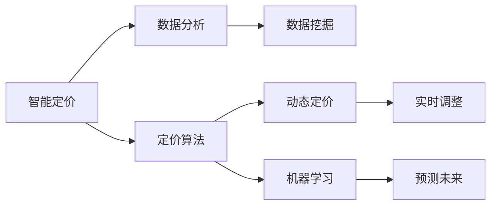
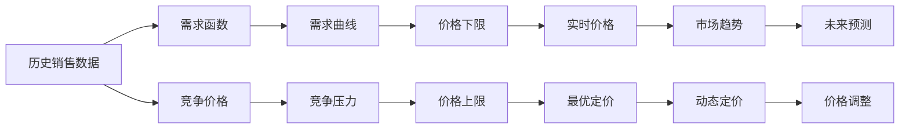

                 

# 智能定价技术的实践应用

在当今竞争激烈的商业环境中，企业定价策略已成为影响市场份额、盈利能力和客户忠诚度的关键因素。随着人工智能（AI）和大数据分析技术的快速发展，智能定价技术正逐渐成为企业决策支持系统的重要组成部分。本文将深入探讨智能定价技术的实践应用，包括核心概念、算法原理、操作步骤、实际案例、应用展望等，旨在帮助企业更好地理解和应用智能定价技术，以提升定价决策的科学性和效率。

## 1. 背景介绍

### 1.1 问题由来

随着全球市场的开放和竞争的加剧，企业面临着前所未有的价格竞争压力。传统的定价方法主要依赖经验、市场调研和人工分析，难以快速响应市场变化，且容易受到主观因素的干扰。然而，大数据和AI技术的应用，使得企业能够从海量数据中挖掘出有价值的定价规律，实现更为精准和动态的定价。

### 1.2 问题核心关键点

智能定价技术的核心在于利用大数据和机器学习算法，对市场、竞争、成本等因素进行综合分析，从而制定出最优化的价格策略。这不仅包括对历史数据的学习，还包括对当前市场环境的实时分析，以及对未来市场趋势的预测。其核心关键点如下：

- 数据分析：从销售记录、市场调研、竞争分析等大量数据中提取有价值的信息。
- 模型构建：利用统计学、机器学习等技术，建立价格预测和优化模型。
- 实时调整：根据实时市场反馈和用户行为数据，实时调整定价策略。
- 预测未来：基于历史和实时数据，对未来市场趋势进行预测和优化。

## 2. 核心概念与联系

### 2.1 核心概念概述

- **智能定价**：利用AI和大数据技术，对市场和竞争环境进行深度分析，动态调整价格策略的过程。
- **动态定价**：根据市场供需关系、用户行为、竞争策略等因素，实时调整价格。
- **定价算法**：包括预测模型和优化算法，用于分析和优化价格策略。
- **数据挖掘**：从历史和实时数据中提取有价值的信息，为定价提供数据支持。
- **机器学习**：通过算法学习市场规律和用户偏好，提升定价决策的准确性和自动化水平。

这些概念之间存在紧密的联系，共同构成了智能定价技术的核心框架。下面通过Mermaid流程图来展示这些概念之间的关系：



### 2.2 核心概念原理和架构

智能定价技术的核心在于构建一个综合的市场分析模型，该模型基于以下基本原理：

1. **需求函数**：通过历史销售数据，建立产品需求与价格之间的函数关系，分析不同价格区间的需求变化。
2. **竞争分析**：分析竞争对手的价格策略和市场份额，预测其价格调整对自身的影响。
3. **成本分析**：考虑生产成本、运营成本等因素，制定合理的价格下限。
4. **市场趋势**：利用时间序列分析和预测技术，预测市场供需关系的变化趋势。

基于上述原理，智能定价技术架构如图：



## 3. 核心算法原理 & 具体操作步骤

### 3.1 算法原理概述

智能定价技术主要通过以下两个算法来实现：

- **预测模型**：利用历史销售数据和市场趋势，建立价格预测模型。常用的算法包括线性回归、决策树、随机森林等。
- **优化算法**：通过动态调整价格，优化企业收益。常用的算法包括遗传算法、粒子群算法、梯度下降等。

### 3.2 算法步骤详解

智能定价技术的实现主要包括以下几个关键步骤：

**Step 1: 数据预处理**

- 收集和整理历史销售数据、市场调研数据、竞争对手价格等。
- 清洗数据，处理缺失值、异常值，确保数据质量和一致性。
- 进行数据标准化和归一化，便于算法处理。

**Step 2: 数据建模**

- 选择适合的数据分析模型，如线性回归、决策树、随机森林等。
- 利用训练数据，训练和验证模型，优化模型参数。
- 对模型进行评估，确保模型的预测能力。

**Step 3: 价格预测**

- 利用训练好的模型，对未来市场和用户需求进行预测。
- 结合市场趋势和竞争对手价格，生成价格预测曲线。

**Step 4: 价格优化**

- 基于价格预测和市场需求，制定初始价格策略。
- 利用优化算法，动态调整价格，优化企业收益。
- 进行实时监控和反馈，调整价格策略。

### 3.3 算法优缺点

智能定价技术具有以下优点：

- 提升定价决策的科学性和准确性。
- 实现动态定价，快速响应市场变化。
- 降低人工干预和主观因素的影响。

同时，智能定价技术也存在以下缺点：

- 对数据质量和一致性的要求较高。
- 模型复杂，训练和优化成本较高。
- 预测结果可能存在偏差，需要持续优化。

### 3.4 算法应用领域

智能定价技术可以应用于多个领域，包括：

- **零售业**：实时调整商品价格，提升销售量和利润率。
- **航空业**：根据航班需求和竞争对手价格，动态调整机票价格。
- **旅游业**：根据季节和预订情况，优化酒店和景点门票价格。
- **金融业**：根据市场趋势和用户行为，优化贷款利率和保险费率。
- **电信业**：根据用户使用情况和市场竞争，调整资费方案。

## 4. 数学模型和公式 & 详细讲解

### 4.1 数学模型构建

智能定价技术涉及多个数学模型，以下以线性回归模型为例进行详细讲解：

**线性回归模型**：

$$
y = \beta_0 + \beta_1x_1 + \beta_2x_2 + \ldots + \beta_nx_n + \epsilon
$$

其中，$y$ 为预测价格，$x_i$ 为影响因素（如季节、促销、竞争价格等），$\beta_i$ 为模型参数，$\epsilon$ 为误差项。

### 4.2 公式推导过程

线性回归模型的推导过程如下：

1. 根据历史数据，计算出$x_i$和$y$的均值$\bar{x}$和$\bar{y}$。
2. 计算$x_i$的协方差矩阵$\Sigma_x$。
3. 计算$\beta_i$的最小二乘估计值：

$$
\beta_i = \frac{\Sigma_{xiy}}{\Sigma_{xx}}
$$

其中，$\Sigma_{xiy}$为$x_i$和$y$的协方差矩阵，$\Sigma_{xx}$为$x_i$的方差矩阵。

### 4.3 案例分析与讲解

以某电商平台的商品定价为例，假设影响商品价格的因素包括季节、促销、竞争价格等。通过历史销售数据和市场调研，建立一个线性回归模型：

$$
P = 1000 + 50S + 20C + 10P
$$

其中，$P$为商品价格，$S$为季节（1-12），$C$为竞争对手价格，$P$为商品自身价格。

利用该模型，可以预测不同季节、促销和竞争价格下的商品价格，进而制定合理的定价策略。

## 5. 项目实践：代码实例和详细解释说明

### 5.1 开发环境搭建

在进行智能定价项目开发前，需要先搭建好开发环境。以下以Python和Pandas为例，介绍环境配置步骤：

1. 安装Anaconda：
```bash
conda install anaconda
```

2. 创建虚拟环境：
```bash
conda create --name pyenv python=3.7
conda activate pyenv
```

3. 安装相关库：
```bash
conda install pandas numpy scikit-learn statsmodels matplotlib
```

4. 安装ML库：
```bash
pip install scikit-learn
```

完成上述配置后，即可在虚拟环境中进行智能定价项目的开发。

### 5.2 源代码详细实现

以下是一个简单的线性回归模型实现示例，用于预测商品价格：

```python
import pandas as pd
from sklearn.linear_model import LinearRegression
from sklearn.metrics import mean_squared_error

# 读取历史销售数据
data = pd.read_csv('sales_data.csv')

# 数据预处理
data = data.dropna()
X = data[['season', 'comp_price', 'promo']]
y = data['price']

# 线性回归模型
model = LinearRegression()
model.fit(X, y)

# 价格预测
X_test = pd.DataFrame({'season': [1, 2, 3], 'comp_price': [200, 150, 180], 'promo': [0, 1, 0]})
y_pred = model.predict(X_test)

# 评估模型
mse = mean_squared_error(y, y_pred)
print('MSE:', mse)
```

### 5.3 代码解读与分析

**读取数据和数据预处理**：

1. 使用Pandas读取历史销售数据，并删除缺失值和异常值。
2. 将数据分为特征$X$和目标变量$y$。

**模型训练和预测**：

1. 使用Scikit-learn库中的线性回归模型进行训练。
2. 对测试集进行价格预测，并评估模型性能。

## 6. 实际应用场景

### 6.1 零售业

智能定价技术在零售业中的应用非常广泛。例如，某大型超市利用智能定价系统，根据季节、节假日和库存情况，实时调整商品价格，以提升销售量和利润率。此外，通过竞争对手价格分析，该系统还能动态调整价格，避免价格战，提升市场竞争力。

### 6.2 航空业

航空公司利用智能定价系统，根据航班需求和竞争对手价格，动态调整机票价格。例如，某航空公司根据预测的客流量和竞争对手票价，实时调整航班票价，以最大化收入。

### 6.3 旅游业

旅游业通过智能定价系统，根据季节和预订情况，优化酒店和景点门票价格。例如，某旅游平台根据节假日预订情况，动态调整酒店价格，提升客房销售率。

### 6.4 金融业

金融机构利用智能定价系统，根据市场趋势和用户行为，优化贷款利率和保险费率。例如，某银行根据用户信用评分和市场利率变化，动态调整贷款利率，以降低风险。

### 6.5 电信业

电信运营商利用智能定价系统，根据用户使用情况和市场竞争，调整资费方案。例如，某运营商根据用户通话量和使用时长，动态调整套餐价格，提升用户粘性。

## 7. 工具和资源推荐

### 7.1 学习资源推荐

智能定价技术的实现需要掌握数据科学和机器学习的相关知识，以下是一些优质的学习资源：

1. 《Python数据科学手册》：系统介绍了Python在数据科学中的应用，包括Pandas、NumPy、Scikit-learn等库的使用。
2. 《机器学习实战》：讲解了机器学习的基本原理和算法实现，结合实战项目进行讲解。
3. 《统计学习方法》：讲解了统计学习的基本原理和算法，包括线性回归、决策树、随机森林等。
4. Coursera和edX上的机器学习和数据科学课程：系统学习机器学习算法和数据科学工具的应用。
5. Kaggle：参与数据科学竞赛，提升实战能力。

通过这些学习资源的学习，可以全面掌握智能定价技术所需的理论和实践技能。

### 7.2 开发工具推荐

智能定价项目的开发需要高效的开发工具和框架支持，以下是一些推荐工具：

1. Jupyter Notebook：提供交互式编程环境，支持Python、R等多种语言。
2. PyCharm：全功能IDE，支持Python、Scikit-learn等库的集成开发。
3. Apache Spark：分布式计算框架，支持大规模数据处理和分析。
4. Dask：分布式任务调度框架，支持Python的数据处理和计算。
5. Airflow：分布式工作流调度系统，支持数据处理和机器学习任务的管理。

这些工具和框架可以大幅提升智能定价项目的开发效率和效果。

### 7.3 相关论文推荐

智能定价技术的实现需要借鉴学术界的最新研究成果，以下是几篇有代表性的相关论文：

1. "A Survey of Dynamic Pricing: Algorithms and Applications"：综述了动态定价算法的理论和应用。
2. "Optimal Dynamic Pricing in Competitive Markets"：讨论了竞争市场中的动态定价策略。
3. "Stochastic Models for Dynamic Pricing"：介绍了随机模型在动态定价中的应用。
4. "Data-Driven Dynamic Pricing for Retail Commodities"：基于数据驱动的零售商品动态定价方法。
5. "Dual Heuristic Methods for Dynamic Pricing"：利用启发式方法进行动态定价优化。

这些论文代表了智能定价技术的研究前沿，提供了丰富的理论和技术支持。

## 8. 总结：未来发展趋势与挑战

### 8.1 总结

智能定价技术的实践应用，通过数据驱动和算法优化，大幅提升了企业定价决策的科学性和效率。本文从核心概念、算法原理、操作步骤等方面，详细介绍了智能定价技术的实现方法。通过实际案例和开发实践，展示了智能定价技术在零售、航空、旅游、金融、电信等多个领域的应用前景。

### 8.2 未来发展趋势

展望未来，智能定价技术将呈现以下几个发展趋势：

1. **多维度数据融合**：利用多源数据融合技术，整合市场、用户、竞争等多个维度信息，提升定价决策的全面性和准确性。
2. **实时分析和调整**：通过实时数据处理和动态优化算法，实现实时定价调整，快速响应市场变化。
3. **机器学习模型优化**：引入更先进的机器学习模型，如深度学习、强化学习等，提升定价决策的自动化和智能化水平。
4. **个性化定价策略**：基于用户行为和偏好，制定个性化定价策略，提升用户体验和满意度。
5. **跨领域应用扩展**：将智能定价技术应用于更多行业领域，如医疗、物流等，推动各行业的数字化转型。

### 8.3 面临的挑战

智能定价技术在实现过程中，仍面临诸多挑战：

1. **数据质量和一致性**：需要高质量、一致性强的数据，才能确保模型训练的准确性和鲁棒性。
2. **模型复杂度**：复杂模型需要较高的计算资源和算法优化，增加了开发和部署成本。
3. **预测准确性**：模型预测结果可能存在偏差，需要持续优化和校准。
4. **实时性要求高**：实时定价需要快速处理大量数据和计算，对系统性能要求较高。
5. **用户接受度**：动态调整价格可能影响用户感知和满意度，需要科学合理的定价策略。

### 8.4 研究展望

未来的研究需要在以下几个方面寻求新的突破：

1. **数据质量和扩展性**：探索更多高质量数据源和数据清洗技术，提升数据质量。
2. **算法优化和效率**：优化算法模型，提高计算效率和预测精度。
3. **多模态数据融合**：整合视觉、语音、文本等多种数据，提升定价决策的全面性和准确性。
4. **个性化定价**：探索基于用户行为和偏好的个性化定价策略，提升用户体验。
5. **跨领域应用**：将智能定价技术应用于更多行业，推动行业数字化转型。

## 9. 附录：常见问题与解答

**Q1：智能定价技术是否适用于所有行业？**

A: 智能定价技术适用于大部分行业，尤其是需要动态调整价格和优化收益的领域。例如，零售、航空、旅游、金融、电信等。

**Q2：智能定价技术需要哪些数据支持？**

A: 智能定价技术需要高质量、一致性强的数据，包括历史销售数据、市场调研数据、竞争价格等。数据的质量和数量直接影响模型的预测能力和决策效果。

**Q3：智能定价技术的实现难度大吗？**

A: 智能定价技术的实现有一定难度，需要掌握数据科学和机器学习的相关知识，但利用开源工具和框架，可以大大简化开发过程。

**Q4：智能定价技术的应用前景如何？**

A: 智能定价技术在多个领域具有广泛的应用前景，通过实时调整价格，提升销售量和利润率，优化资源配置。未来，随着数据技术和算法的发展，智能定价技术将发挥更大的作用。

---

作者：禅与计算机程序设计艺术 / Zen and the Art of Computer Programming

