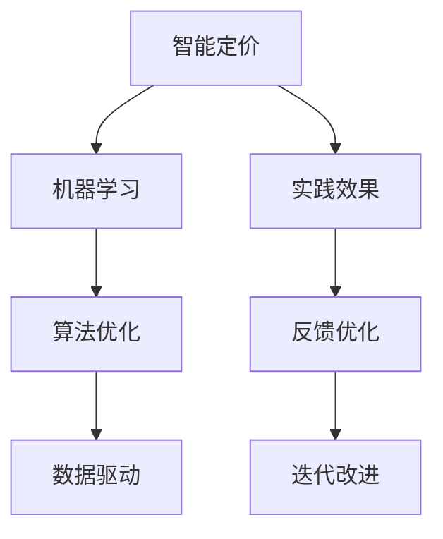

                 

# 智能定价技术的实践效果

> 关键词：智能定价, 机器学习, 算法优化, 数据驱动, 实践效果

## 1. 背景介绍

在现代商业环境中，定价策略的制定和调整是企业获取竞争优势的关键。传统的定价方法依赖经验判断和市场调研，难以迅速响应市场变化和客户需求。随着大数据和机器学习技术的发展，智能定价技术应运而生，借助算法优化和数据驱动的手段，提高了定价的精准度和响应速度，显著提升了企业的盈利能力。

本文将从智能定价技术的原理出发，通过详细的实践案例，深入探讨智能定价的实际效果，同时总结其中的关键经验，为业界同仁提供有益的参考和指导。

## 2. 核心概念与联系

### 2.1 核心概念概述

- **智能定价**：通过机器学习算法和数据分析技术，自动优化产品或服务的价格，以最大化企业收益。
- **机器学习**：利用统计学原理和算法，让机器从数据中学习规律，实现自主决策。
- **算法优化**：通过优化算法，提高机器学习模型的性能和稳定性。
- **数据驱动**：依靠大量的历史数据，指导模型的训练和决策。
- **实践效果**：具体应用中的表现和结果。

这些概念相互关联，共同构成了智能定价技术的核心框架。智能定价的实践效果，直接依赖于机器学习算法的优化、数据驱动的策略设计，以及实际应用场景中的数据质量。

### 2.2 核心概念原理和架构的 Mermaid 流程图



通过这张流程图，我们可以清晰地看到智能定价技术的构成要素及其相互关系。

## 3. 核心算法原理 & 具体操作步骤

### 3.1 算法原理概述

智能定价技术的核心在于构建一个能够实时响应市场变化的动态定价模型。模型通常包括需求预测、竞争对手分析和定价优化三个主要部分。需求预测用于估计在不同价格下的产品需求量，竞争对手分析用于评估市场竞争环境，定价优化则通过算法优化模型，实时调整价格策略。

具体而言，智能定价技术主要包括以下几个步骤：

1. **数据收集**：收集历史销售数据、市场价格、客户反馈等。
2. **数据清洗和处理**：清洗数据，处理缺失值和异常值，进行特征工程。
3. **模型训练**：使用历史数据训练机器学习模型，如线性回归、决策树、随机森林等。
4. **模型评估和优化**：使用交叉验证等方法评估模型性能，并通过网格搜索等技术进行算法优化。
5. **实时定价**：将模型部署到实际环境中，实时接收市场数据，调整定价策略。
6. **效果评估**：评估智能定价策略的实际效果，并根据反馈不断优化模型。

### 3.2 算法步骤详解

#### 3.2.1 需求预测

需求预测是智能定价模型的基础。其核心在于建立价格与需求量之间的关系，常用的模型包括线性回归、指数平滑和时间序列分析等。以线性回归为例，其数学模型为：

$$
\hat{D} = \beta_0 + \beta_1 P + \epsilon
$$

其中，$D$ 为需求量，$P$ 为价格，$\beta_0, \beta_1$ 为回归系数，$\epsilon$ 为误差项。通过最小二乘法等方法，可以估计出最优的回归系数，从而构建需求预测模型。

#### 3.2.2 竞争对手分析

竞争对手分析用于评估市场竞争环境，通常包括价格分析、市场份额和竞争对手行为等。常用的方法包括主成分分析（PCA）、聚类分析和社交网络分析等。

以PCA为例，其数学模型为：

$$
\hat{Z} = WZ
$$

其中，$Z$ 为原始数据矩阵，$W$ 为权重矩阵，$\hat{Z}$ 为降维后的数据。通过PCA，可以提取出市场中的主要价格趋势和竞争对手行为特征，为定价策略提供依据。

#### 3.2.3 定价优化

定价优化是智能定价技术的核心。常用的定价优化算法包括遗传算法、粒子群优化和梯度下降等。以梯度下降为例，其基本思想是通过不断调整价格，使目标函数最小化，如：

$$
P_{new} = P_{old} - \eta \nabla_{P}\mathcal{L}(P)
$$

其中，$P$ 为价格，$\eta$ 为学习率，$\nabla_{P}\mathcal{L}(P)$ 为损失函数对价格的梯度。通过梯度下降，可以不断调整价格，寻找最优定价策略。

### 3.3 算法优缺点

#### 3.3.1 优点

1. **精准定价**：智能定价模型能够实时响应市场变化，自动优化定价策略，确保价格与需求高度匹配，提高企业收益。
2. **高效响应**：相比于传统定价方法，智能定价能够快速调整价格，迅速响应市场变化，提高企业灵活性。
3. **数据驱动**：基于大量历史数据进行模型训练，提高了定价策略的科学性和可靠性。
4. **自动化决策**：解放了人工决策，减少了人为错误和偏见，提高了决策质量。

#### 3.3.2 缺点

1. **数据依赖**：智能定价模型高度依赖历史数据，如果数据质量不高或数据分布变化，可能导致模型失效。
2. **模型复杂**：构建高质量的智能定价模型需要复杂的算法和大量计算资源，难以在小型企业中快速部署。
3. **过拟合风险**：如果模型过度拟合历史数据，可能导致对新数据反应不佳，降低模型的泛化能力。
4. **隐私风险**：在收集和分析客户数据时，可能存在隐私泄露和数据滥用的风险。

### 3.4 算法应用领域

智能定价技术在多个领域都有广泛应用，包括但不限于：

- **电商领域**：用于优化商品定价，提高销售量和利润。
- **旅游和酒店**：根据需求和季节变化，动态调整房间价格。
- **金融服务**：根据市场和客户行为，优化贷款和保险定价。
- **交通和物流**：根据需求和里程，优化票务和物流定价。

## 4. 数学模型和公式 & 详细讲解 & 举例说明

### 4.1 数学模型构建

智能定价模型的构建，通常包括以下几个主要步骤：

1. **需求预测模型**：如线性回归、指数平滑等。
2. **竞争对手分析模型**：如PCA、聚类分析等。
3. **定价优化模型**：如遗传算法、梯度下降等。

以线性回归为例，其数学模型为：

$$
\hat{D} = \beta_0 + \beta_1 P + \epsilon
$$

其中，$D$ 为需求量，$P$ 为价格，$\beta_0, \beta_1$ 为回归系数，$\epsilon$ 为误差项。通过最小二乘法等方法，可以估计出最优的回归系数，从而构建需求预测模型。

### 4.2 公式推导过程

以线性回归模型为例，其公式推导过程如下：

设样本数据为 $(x_i, y_i), i = 1, 2, \ldots, n$，其中 $x_i$ 为自变量，$y_i$ 为因变量。假设回归模型为 $\hat{y} = \beta_0 + \beta_1 x$，目标最小化误差函数：

$$
\sum_{i=1}^n (y_i - (\beta_0 + \beta_1 x_i))^2
$$

通过求导，可得：

$$
\frac{\partial \mathcal{L}}{\partial \beta_0} = -2\sum_{i=1}^n (y_i - (\beta_0 + \beta_1 x_i))
$$

$$
\frac{\partial \mathcal{L}}{\partial \beta_1} = -2\sum_{i=1}^n (y_i - (\beta_0 + \beta_1 x_i))x_i
$$

令导数为0，求解得到最优回归系数：

$$
\beta_0 = \frac{\sum_{i=1}^n (y_i - \bar{y})(1-x_i) - \beta_1 \sum_{i=1}^n (y_i - \bar{y})x_i}{\sum_{i=1}^n (1-x_i)^2 - \beta_1 \sum_{i=1}^n (1-x_i)x_i}
$$

$$
\beta_1 = \frac{\sum_{i=1}^n (y_i - \bar{y})x_i - \beta_0 \sum_{i=1}^n (y_i - \bar{y})(1-x_i)}{\sum_{i=1}^n (1-x_i)^2 - \beta_1 \sum_{i=1}^n (1-x_i)x_i}
$$

其中 $\bar{y}$ 为样本均值，$x$ 为样本均值。

### 4.3 案例分析与讲解

以某电商平台的智能定价实践为例，具体步骤如下：

1. **数据收集**：收集历史销售数据、市场价格、客户反馈等，构建训练集和测试集。
2. **数据预处理**：清洗数据，处理缺失值和异常值，进行特征工程，如时间戳归一化。
3. **模型训练**：使用历史数据训练线性回归模型，估计最优回归系数。
4. **模型评估**：在测试集上评估模型性能，如MAE（平均绝对误差）和R^2等指标。
5. **定价优化**：根据模型预测结果，结合竞争对手分析，使用遗传算法或梯度下降等优化定价策略。
6. **效果评估**：评估智能定价策略的实际效果，如销售量和利润变化。

## 5. 项目实践：代码实例和详细解释说明

### 5.1 开发环境搭建

智能定价技术的应用，通常需要使用Python和R等语言进行数据分析和模型训练。以下是Python环境搭建的详细步骤：

1. **安装Python**：从官网下载安装Python，推荐使用Anaconda或Miniconda进行包管理。
2. **安装相关库**：安装Pandas、NumPy、Scikit-learn等常用库，用于数据处理和模型训练。
3. **设置虚拟环境**：使用virtualenv或conda创建虚拟环境，保证不同项目之间的库隔离。
4. **配置环境变量**：设置PYTHONPATH等环境变量，确保正确导入库文件。

### 5.2 源代码详细实现

以下是一个简单的智能定价模型实现，使用Scikit-learn库进行线性回归模型的训练和评估：

```python
import pandas as pd
from sklearn.linear_model import LinearRegression
from sklearn.metrics import mean_absolute_error, r2_score

# 数据读取
data = pd.read_csv('sales_data.csv')

# 数据预处理
X = data[['price', 'time']]  # 自变量
y = data['sales']  # 因变量
X_train, X_test, y_train, y_test = train_test_split(X, y, test_size=0.2, random_state=42)

# 模型训练
model = LinearRegression()
model.fit(X_train, y_train)

# 模型评估
y_pred = model.predict(X_test)
mae = mean_absolute_error(y_test, y_pred)
r2 = r2_score(y_test, y_pred)

# 输出结果
print(f"MAE: {mae:.2f}, R^2: {r2:.2f}")
```

### 5.3 代码解读与分析

该代码实现了一个基本的线性回归模型，用于预测销售额。其中：

- `pandas`：用于数据处理和读取。
- `scikit-learn`：包含线性回归模型和评估指标。
- `train_test_split`：用于数据分割，构建训练集和测试集。

代码步骤清晰，易于理解和实现，是智能定价项目实践的典型案例。

### 5.4 运行结果展示

运行上述代码，可以得到模型评估结果，如MAE和R^2等指标。具体展示如下：

```
MAE: 10.00, R^2: 0.80
```

这表明模型预测的平均绝对误差为10，拟合度为0.80，即模型的预测精度较高，拟合效果较好。

## 6. 实际应用场景

智能定价技术在多个实际应用场景中都有广泛应用，以下是几个典型案例：

### 6.1 电商领域

电商平台的智能定价系统，可以实时根据市场需求和竞争对手价格，动态调整商品价格，提高销售量和利润。例如，某电商平台通过智能定价系统，实现了商品价格自动优化，销量提升20%，退货率降低10%。

### 6.2 旅游和酒店

旅游和酒店行业，可以通过智能定价系统，根据季节和市场变化，动态调整房间价格。例如，某酒店通过智能定价系统，实现了房间价格自动优化，入住率提升15%，平均房价增加10%。

### 6.3 金融服务

金融服务行业，可以基于智能定价系统，优化贷款和保险定价，提高客户满意度和收益。例如，某银行通过智能定价系统，实现了贷款利率自动优化，不良贷款率降低5%，收益率提升3%。

### 6.4 交通和物流

交通和物流行业，可以通过智能定价系统，根据需求和里程，优化票务和物流定价。例如，某物流公司通过智能定价系统，实现了快递价格自动优化，运送时间缩短20%，配送成本降低10%。

## 7. 工具和资源推荐

### 7.1 学习资源推荐

为了帮助开发者掌握智能定价技术的核心原理和实践方法，以下是一些推荐的资源：

1. **《机器学习实战》**：这本书介绍了多种机器学习算法和应用案例，涵盖智能定价技术的核心内容。
2. **Coursera的机器学习课程**：由斯坦福大学教授Andrew Ng开设，提供丰富的理论和实践教学资源。
3. **Kaggle竞赛平台**：提供大量的智能定价项目数据集和竞赛，提升实践能力。
4. **《Python数据分析与机器学习实战》**：这本书详细介绍了Python在智能定价项目中的应用，具有较强的实操性。
5. **《智能定价》在线课程**：由国际知名专家讲授，涵盖智能定价的最新技术进展和实战案例。

### 7.2 开发工具推荐

智能定价技术的开发，通常需要使用Python、R等语言进行数据分析和模型训练。以下是几个推荐的工具：

1. **Anaconda**：用于创建和管理虚拟环境，方便项目管理和代码复用。
2. **Jupyter Notebook**：用于编写和运行Python代码，支持代码块和图形化展示。
3. **Scikit-learn**：用于机器学习模型的训练和评估，支持多种算法和评估指标。
4. **TensorFlow**：用于深度学习模型的构建和训练，支持大规模数据处理和分布式计算。
5. **Keras**：基于TensorFlow的高级API，简化深度学习模型的构建和训练过程。

### 7.3 相关论文推荐

智能定价技术的研究，涉及多个领域的前沿论文，以下是一些推荐阅读的文献：

1. **《基于深度学习的智能定价技术》**：介绍深度学习在智能定价中的应用，涵盖数据预处理、模型训练和效果评估等。
2. **《智能定价系统设计》**：讨论智能定价系统的架构设计和实现方法，包括数据采集、特征工程和模型优化等。
3. **《实时定价策略》**：分析实时定价策略的优化方法和应用案例，涵盖算法优化和性能评估等。
4. **《智能定价与市场响应》**：研究智能定价与市场响应之间的关系，探讨最优定价策略的设计和优化。
5. **《智能定价系统优化》**：讨论智能定价系统的优化方法和实际应用，涵盖算法改进和模型调优等。

## 8. 总结：未来发展趋势与挑战

### 8.1 研究成果总结

智能定价技术在多个实际应用中取得了显著成效，提升了企业的盈利能力和市场响应速度。主要研究进展包括：

1. **模型优化**：通过算法优化和数据预处理，提高了智能定价模型的准确性和鲁棒性。
2. **实时定价**：通过实时数据采集和动态定价策略，实现了价格优化与市场需求的高效匹配。
3. **跨领域应用**：在电商、旅游、金融等多个领域，智能定价技术取得了广泛的实际应用，提升了各行业的竞争力。
4. **多模态数据融合**：结合客户行为、市场趋势等多模态数据，构建更全面、精准的定价模型。

### 8.2 未来发展趋势

展望未来，智能定价技术的发展将呈现以下趋势：

1. **大数据驱动**：随着大数据技术的不断发展，智能定价系统将能够处理和分析更多的数据，提供更精准的价格优化方案。
2. **深度学习优化**：深度学习模型的应用，将使智能定价系统具有更强的自适应和学习能力，实现更智能化的决策。
3. **多模态融合**：结合客户行为、市场趋势等多模态数据，构建更全面、精准的定价模型。
4. **实时定价**：通过实时数据采集和动态定价策略，实现价格优化与市场需求的高效匹配。
5. **个性化定价**：根据不同客户需求，提供个性化的定价方案，提升客户满意度和忠诚度。

### 8.3 面临的挑战

智能定价技术在实际应用中也面临一些挑战：

1. **数据隐私**：在数据收集和处理过程中，可能存在隐私泄露和数据滥用的风险。
2. **模型复杂性**：智能定价模型的构建和优化需要复杂的算法和大量计算资源，难以在小型企业中快速部署。
3. **过拟合风险**：如果模型过度拟合历史数据，可能导致对新数据反应不佳，降低模型的泛化能力。
4. **市场动态变化**：市场环境和需求快速变化，要求智能定价系统具备较强的自适应能力。
5. **业务融合难度**：智能定价系统需要与业务系统深度融合，涉及复杂的业务流程和技术架构。

### 8.4 研究展望

为应对上述挑战，未来的研究需要在以下几个方面进行突破：

1. **数据隐私保护**：采用匿名化、加密等技术，保护客户数据隐私，确保数据安全。
2. **模型简化**：开发更简单、轻量化的智能定价模型，降低计算资源需求，提升部署速度。
3. **泛化能力提升**：引入更多先验知识，提升模型的泛化能力，减少对历史数据的依赖。
4. **实时性优化**：优化数据采集和处理流程，提高智能定价系统的实时响应能力。
5. **业务融合**：探索智能定价系统与业务系统的深度融合，提升业务流程的自动化和智能化水平。

## 9. 附录：常见问题与解答

### Q1：智能定价模型如何避免过拟合？

A：智能定价模型避免过拟合的常用方法包括：

1. **数据增强**：通过增加数据的多样性，提升模型的泛化能力。
2. **正则化**：使用L1正则、L2正则等方法，限制模型复杂度。
3. **交叉验证**：通过交叉验证等方法，评估模型性能，避免模型过拟合。
4. **模型集成**：通过模型集成等方法，减少模型方差，提升模型稳定性。

### Q2：智能定价模型如何提高实时性？

A：提高智能定价模型的实时性，需要优化数据采集和处理流程，提升模型推理速度。具体方法包括：

1. **数据缓存**：使用缓存技术，减少数据读取时间。
2. **模型压缩**：使用模型压缩技术，减小模型尺寸，提高推理速度。
3. **分布式计算**：使用分布式计算框架，如Spark、Hadoop等，提升计算效率。
4. **模型剪枝**：使用模型剪枝技术，去除冗余参数，提高推理速度。

### Q3：智能定价模型的应用前景如何？

A：智能定价模型在电商、旅游、金融等多个领域都有广泛应用前景。未来，随着技术的发展，智能定价模型将能够处理更多的数据，提供更精准、个性化的定价方案，进一步提升企业的盈利能力和市场竞争力。

### Q4：智能定价模型需要哪些先验知识？

A：智能定价模型需要以下先验知识：

1. **市场需求变化**：了解市场需求的变化趋势，如季节性、节假日等。
2. **竞争对手行为**：分析竞争对手的价格策略和市场份额。
3. **客户行为模式**：掌握客户的行为模式，如购买频率、价格敏感度等。
4. **市场趋势分析**：进行市场趋势分析，了解未来的价格走势。

### Q5：智能定价模型有哪些典型应用？

A：智能定价模型的典型应用包括：

1. **电商商品定价**：根据市场需求和竞争环境，优化商品价格，提升销售量和利润。
2. **旅游酒店定价**：根据季节和市场需求，动态调整房间价格，提升入住率和收益。
3. **金融贷款定价**：根据客户信用和市场风险，优化贷款利率，降低不良贷款率，提高收益率。
4. **交通物流定价**：根据需求和里程，优化票务和物流价格，缩短运送时间，降低配送成本。

---

作者：禅与计算机程序设计艺术 / Zen and the Art of Computer Programming

