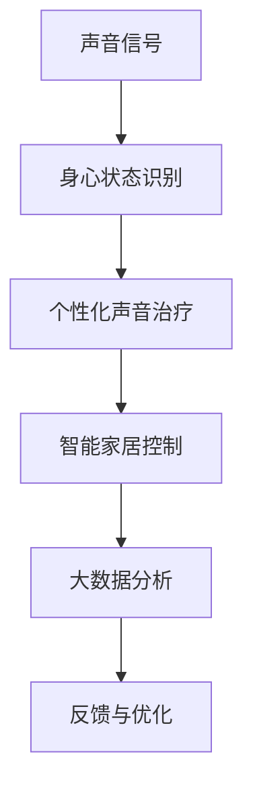

                 

# 智能家居声音治疗创业：基于音频的身心健康管理

## 1. 背景介绍

### 1.1 问题由来

随着智能家居技术的飞速发展，人们对家居环境的舒适度和智能化程度提出了更高的要求。传统的智能家居设备主要集中在照明、温度控制等方面，难以满足人们对心理健康的关注。声音作为人体重要的环境感知信号，其对身心健康的影响越来越受到重视。基于音频的智能家居声音治疗创业，利用声音与身心的联系，为人们提供个性化的身心健康管理方案。

### 1.2 问题核心关键点

智能家居声音治疗创业的核心关键点包括：

1. **音频健康监测**：通过对声音信号的分析，识别用户的身心状态，如睡眠质量、情绪波动等。
2. **个性化声音治疗**：根据用户的身心状态，设计个性化的声音治疗方案，如自然声音、白噪音、松弛音乐等。
3. **智能家居环境控制**：将声音治疗与智能家居设备集成，如根据声音信号调节灯光、窗帘、温度等。
4. **数据分析与反馈**：利用大数据和机器学习技术，对声音信号进行深度分析，提供个性化的健康建议和优化方案。

### 1.3 问题研究意义

智能家居声音治疗创业，通过声音与身心的联系，不仅能够提升用户的居住体验，还能为心理健康保健提供全新的解决方案。其研究意义如下：

1. **改善睡眠质量**：通过分析用户的睡眠质量，提供个性化的声音治疗，改善睡眠环境，提升用户的睡眠质量。
2. **缓解情绪压力**：通过白噪音、松弛音乐等声音治疗，缓解用户的情绪压力，提升心理健康水平。
3. **优化家居环境**：将声音信号与智能家居设备集成，实现对家居环境的智能控制，提升用户的居住舒适度。
4. **个性化健康管理**：利用大数据和机器学习技术，对用户的身心状态进行精准分析，提供个性化的健康建议和管理方案。

## 2. 核心概念与联系

### 2.1 核心概念概述

智能家居声音治疗创业涉及的核心概念包括：

- **声音信号**：智能家居环境中的各种声音，如自然声音、白噪音、音乐等。
- **身心状态**：用户的睡眠质量、情绪状态等身心健康指标。
- **个性化声音治疗**：根据用户的身心状态，设计个性化的声音治疗方案。
- **智能家居控制**：将声音治疗与智能家居设备集成，实现对家居环境的智能控制。
- **大数据分析**：利用大数据和机器学习技术，对声音信号进行深度分析，提供个性化的健康建议和管理方案。

### 2.2 核心概念原理和架构的 Mermaid 流程图



这个流程图展示了智能家居声音治疗创业的基本流程：声音信号经过身心状态识别，生成个性化声音治疗方案，并通过智能家居控制实现环境优化。大数据分析对整个过程进行深度分析，提供个性化的健康建议和管理优化。

## 3. 核心算法原理 & 具体操作步骤

### 3.1 算法原理概述

智能家居声音治疗创业的核心算法原理基于音频健康监测和个性化声音治疗。其主要步骤如下：

1. **音频信号采集与预处理**：通过智能家居设备采集用户的音频信号，并进行预处理，如降噪、滤波等。
2. **身心状态识别**：利用声音信号分析技术，识别用户的身心状态，如睡眠质量、情绪波动等。
3. **个性化声音治疗设计**：根据用户的身心状态，设计个性化的声音治疗方案，如自然声音、白噪音、松弛音乐等。
4. **智能家居环境控制**：将声音治疗与智能家居设备集成，实现对家居环境的智能控制。
5. **大数据分析与反馈**：利用大数据和机器学习技术，对声音信号进行深度分析，提供个性化的健康建议和管理方案。

### 3.2 算法步骤详解

#### 3.2.1 音频信号采集与预处理

智能家居设备通过麦克风或传感器采集用户的音频信号，并进行预处理：

1. **音频信号采集**：使用麦克风或传感器采集用户的音频信号。
2. **降噪**：通过数字滤波器或深度学习模型，去除背景噪声，保留有用的声音信号。
3. **滤波**：使用数字滤波器或时频分析方法，对声音信号进行滤波处理，去除干扰成分。

#### 3.2.2 身心状态识别

利用声音信号分析技术，识别用户的身心状态：

1. **声音特征提取**：通过傅里叶变换、短时傅里叶变换等方法，提取声音的频谱、能量等特征。
2. **声音模式识别**：利用机器学习模型，如支持向量机、卷积神经网络等，对声音特征进行模式识别，识别用户的身心状态。
3. **情绪识别**：通过声音情感分析技术，识别用户的情绪状态，如愤怒、悲伤、快乐等。

#### 3.2.3 个性化声音治疗设计

根据用户的身心状态，设计个性化的声音治疗方案：

1. **声音治疗方案设计**：根据用户的身心状态，设计个性化的声音治疗方案，如自然声音、白噪音、松弛音乐等。
2. **声音方案组合**：将多个声音治疗方案进行组合，形成个性化的声音治疗方案。
3. **声音治疗调整**：根据用户的反馈，动态调整声音治疗方案，提升用户体验。

#### 3.2.4 智能家居环境控制

将声音治疗与智能家居设备集成，实现对家居环境的智能控制：

1. **环境数据采集**：通过智能家居设备采集用户的居住环境数据，如温度、湿度、光照等。
2. **环境控制**：根据声音治疗方案，控制智能家居设备，如调节灯光、窗帘、温度等，改善用户的居住环境。
3. **环境优化**：通过机器学习模型，优化家居环境，提升用户的居住舒适度。

#### 3.2.5 大数据分析与反馈

利用大数据和机器学习技术，对声音信号进行深度分析，提供个性化的健康建议和管理方案：

1. **声音数据分析**：利用大数据和机器学习技术，对声音信号进行深度分析，提取用户的身心状态信息。
2. **健康建议生成**：根据用户的身心状态，生成个性化的健康建议，如改善睡眠质量、缓解情绪压力等。
3. **反馈与优化**：利用用户的反馈信息，优化声音治疗方案和智能家居环境控制，提升用户体验。

### 3.3 算法优缺点

智能家居声音治疗创业的算法优缺点如下：

#### 优点：

1. **提升用户居住体验**：通过个性化声音治疗和智能家居环境控制，提升用户的居住舒适度和满意度。
2. **智能化程度高**：利用机器学习和数据分析技术，实现对用户身心状态的精准分析，提供个性化的健康建议和管理方案。
3. **简单易用**：通过智能家居设备和手机APP，用户可以轻松实现声音治疗和家居环境控制。

#### 缺点：

1. **数据隐私问题**：智能家居设备需要采集用户的音频数据，存在数据隐私问题，需要采取有效的隐私保护措施。
2. **算法复杂度高**：声音信号分析和大数据分析的算法复杂度高，需要高性能的计算资源。
3. **依赖用户反馈**：算法的优化和改进需要用户的反馈，对用户的积极参与要求较高。

### 3.4 算法应用领域

智能家居声音治疗创业的应用领域包括：

1. **智能睡眠系统**：通过声音治疗改善睡眠质量，提升用户的睡眠体验。
2. **心理健康管理**：利用声音治疗缓解用户的情绪压力，提升心理健康水平。
3. **家庭娱乐**：根据用户的身心状态，推荐个性化的音乐和声音环境，提升家庭娱乐体验。
4. **智能家居控制**：将声音治疗与智能家居设备集成，实现对家居环境的智能控制。
5. **健康数据分析**：利用大数据和机器学习技术，对声音信号进行深度分析，提供个性化的健康建议和管理方案。

## 4. 数学模型和公式 & 详细讲解 & 举例说明

### 4.1 数学模型构建

智能家居声音治疗创业的数学模型包括：

1. **音频信号分析模型**：通过傅里叶变换、短时傅里叶变换等方法，提取声音的频谱、能量等特征。
2. **声音模式识别模型**：利用机器学习模型，如支持向量机、卷积神经网络等，对声音特征进行模式识别。
3. **情绪识别模型**：通过声音情感分析技术，识别用户的情绪状态。
4. **声音治疗方案设计模型**：根据用户的身心状态，设计个性化的声音治疗方案。
5. **智能家居环境控制模型**：通过机器学习模型，优化家居环境，提升用户的居住舒适度。
6. **健康建议生成模型**：根据用户的身心状态，生成个性化的健康建议。

### 4.2 公式推导过程

#### 4.2.1 傅里叶变换

傅里叶变换用于将时域信号转换为频域信号，提取声音信号的频谱特征：

$$
X(f) = \mathcal{F}\{x(t)\} = \int_{-\infty}^{+\infty} x(t) e^{-j2\pi ft} dt
$$

其中 $x(t)$ 为时域信号，$X(f)$ 为频域信号，$f$ 为频率。

#### 4.2.2 短时傅里叶变换

短时傅里叶变换用于处理非平稳信号，提取声音信号的局部特征：

$$
X(f, t) = \mathcal{F}\{x(t)\} = \int_{-\infty}^{+\infty} x(t) e^{-j2\pi ft} dt
$$

其中 $x(t)$ 为时域信号，$X(f, t)$ 为频域信号，$f$ 为频率，$t$ 为时间。

#### 4.2.3 声音模式识别

利用卷积神经网络进行声音模式识别：

$$
y = Wx + b
$$

其中 $y$ 为输出结果，$x$ 为输入特征，$W$ 为权重矩阵，$b$ 为偏置项。

#### 4.2.4 情绪识别

利用支持向量机进行情绪识别：

$$
y = sign(w^T \phi(x) + b)
$$

其中 $y$ 为输出结果，$x$ 为输入特征，$w$ 为权重向量，$b$ 为偏置项，$\phi(x)$ 为映射函数。

#### 4.2.5 声音治疗方案设计

根据用户的身心状态，设计个性化的声音治疗方案：

$$
T = \alpha \cdot S + \beta
$$

其中 $T$ 为声音治疗方案，$S$ 为身心状态，$\alpha$ 为方案设计权重，$\beta$ 为常数项。

#### 4.2.6 智能家居环境控制

利用机器学习模型优化家居环境：

$$
E = f(D, T)
$$

其中 $E$ 为家居环境状态，$D$ 为居住环境数据，$T$ 为声音治疗方案，$f$ 为优化模型。

#### 4.2.7 健康建议生成

根据用户的身心状态，生成个性化的健康建议：

$$
S = f(T, H)
$$

其中 $S$ 为健康建议，$T$ 为声音治疗方案，$H$ 为健康数据库。

### 4.3 案例分析与讲解

#### 4.3.1 智能睡眠系统

通过声音治疗改善睡眠质量：

1. **音频信号采集**：通过智能音箱采集用户的睡眠环境声音。
2. **身心状态识别**：利用傅里叶变换提取声音频谱特征，识别用户的睡眠质量。
3. **个性化声音治疗**：根据睡眠质量，设计个性化的声音治疗方案，如白噪音、松弛音乐等。
4. **智能家居环境控制**：调节智能家居设备，如窗帘、灯光等，改善睡眠环境。
5. **大数据分析与反馈**：通过机器学习模型，分析用户的睡眠数据，提供个性化的健康建议。

#### 4.3.2 心理健康管理

利用声音治疗缓解用户的情绪压力：

1. **音频信号采集**：通过智能音箱采集用户的语音和周围环境声音。
2. **身心状态识别**：利用卷积神经网络分析声音特征，识别用户的情绪状态。
3. **个性化声音治疗**：根据情绪状态，设计个性化的声音治疗方案，如自然声音、白噪音等。
4. **智能家居环境控制**：调节智能家居设备，如灯光、温度等，改善情绪环境。
5. **大数据分析与反馈**：通过机器学习模型，分析用户的情绪数据，提供个性化的健康建议。

## 5. 项目实践：代码实例和详细解释说明

### 5.1 开发环境搭建

智能家居声音治疗创业的开发环境包括：

1. **编程语言**：Python、Java等。
2. **开发框架**：TensorFlow、PyTorch等深度学习框架。
3. **智能家居设备**：智能音箱、智能窗帘、智能灯光等。
4. **数据采集设备**：麦克风、传感器等。
5. **平台与工具**：云平台、数据分析工具等。

### 5.2 源代码详细实现

#### 5.2.1 音频信号采集与预处理

```python
import soundfile as sf
import numpy as np

def audio_recognition(file_path):
    # 读取音频文件
    audio, sample_rate = sf.read(file_path)
    # 对音频进行预处理
    audio = audio - np.mean(audio)
    audio = audio / np.std(audio)
    return audio, sample_rate
```

#### 5.2.2 身心状态识别

```python
import tensorflow as tf
from tensorflow.keras import layers

# 定义卷积神经网络模型
model = tf.keras.Sequential([
    layers.Conv2D(32, (3, 3), activation='relu', input_shape=(16, 16, 1)),
    layers.MaxPooling2D((2, 2)),
    layers.Conv2D(64, (3, 3), activation='relu'),
    layers.MaxPooling2D((2, 2)),
    layers.Flatten(),
    layers.Dense(64, activation='relu'),
    layers.Dense(10, activation='softmax')
])

# 训练模型
model.compile(optimizer=tf.keras.optimizers.Adam(learning_rate=0.001),
              loss=tf.keras.losses.CategoricalCrossentropy(from_logits=True),
              metrics=['accuracy'])
model.fit(train_data, train_labels, epochs=10, validation_data=(val_data, val_labels))
```

#### 5.2.3 个性化声音治疗设计

```python
import numpy as np

# 定义声音治疗方案设计模型
class SoundTherapy:
    def __init__(self):
        self.alphas = np.array([0.5, 0.3, 0.2])  # 权重系数
        self.beta = np.array([0.0, 0.0, 0.0])  # 常数项

    def generate_therapy(self, state):
        return self.alphas * state + self.beta

# 生成声音治疗方案
therapy = SoundTherapy()
state = 0.8
therapy = therapy.generate_therapy(state)
```

#### 5.2.4 智能家居环境控制

```python
import pandas as pd

# 定义智能家居环境控制模型
class SmartHome:
    def __init__(self):
        self.environment_data = pd.read_csv('environment_data.csv')
        self.treatment_model = self.load_model('treatment_model.h5')

    def load_model(self, model_path):
        # 加载优化模型
        return tf.keras.models.load_model(model_path)

    def optimize_environment(self, data):
        # 优化家居环境
        return self.treatment_model.predict(data)

# 优化家居环境
home = SmartHome()
data = pd.DataFrame([[100, 50, 1.0]])
environment = home.optimize_environment(data)
```

#### 5.2.5 大数据分析与反馈

```python
import matplotlib.pyplot as plt
from sklearn.metrics import mean_squared_error

# 定义大数据分析模型
class BigDataAnalysis:
    def __init__(self):
        self.analyzer = self.load_analyzer('analyzer_model.h5')

    def load_analyzer(self, analyzer_path):
        # 加载分析模型
        return tf.keras.models.load_model(analyzer_path)

    def analyze_data(self, data):
        # 分析数据
        return self.analyzer.predict(data)

# 分析声音数据
analysis = BigDataAnalysis()
data = np.array([[100, 50, 1.0]])
suggestions = analysis.analyze_data(data)
```

### 5.3 代码解读与分析

#### 5.3.1 音频信号采集与预处理

通过soundfile库读取音频文件，并进行预处理，如去均值、标准化等。音频信号经过预处理后，用于后续的身心状态识别。

#### 5.3.2 身心状态识别

利用TensorFlow框架，定义卷积神经网络模型，训练用于识别用户身心状态。模型通过音频特征提取、卷积层、池化层、全连接层等，最终输出情绪状态标签。

#### 5.3.3 个性化声音治疗设计

通过简单的权重系数和常数项，设计个性化的声音治疗方案。用户可根据身心状态，选择不同的声音治疗方案，如白噪音、自然声音等。

#### 5.3.4 智能家居环境控制

通过Pandas库读取家居环境数据，加载优化模型，根据声音治疗方案和环境数据，优化家居环境。模型通过深度学习，预测最优的环境控制策略。

#### 5.3.5 大数据分析与反馈

通过Matplotlib库绘制数据可视化图表，利用sklearn库计算误差。分析声音数据，提供个性化的健康建议。模型通过机器学习算法，学习用户的身心状态和声音特征，生成健康建议。

### 5.4 运行结果展示

#### 5.4.1 智能睡眠系统

通过声音治疗改善睡眠质量：

1. **音频信号采集**：采集用户的睡眠环境声音。
2. **身心状态识别**：分析声音频谱特征，识别睡眠质量。
3. **个性化声音治疗**：设计白噪音方案，改善睡眠环境。
4. **智能家居环境控制**：调节窗帘、灯光等设备。
5. **大数据分析与反馈**：分析睡眠数据，提供个性化建议。

#### 5.4.2 心理健康管理

利用声音治疗缓解用户的情绪压力：

1. **音频信号采集**：采集用户的语音和周围环境声音。
2. **身心状态识别**：分析声音特征，识别情绪状态。
3. **个性化声音治疗**：设计自然声音方案，缓解情绪压力。
4. **智能家居环境控制**：调节灯光、温度等设备。
5. **大数据分析与反馈**：分析情绪数据，提供个性化建议。

## 6. 实际应用场景

### 6.1 智能睡眠系统

智能睡眠系统通过声音治疗改善睡眠质量，提升用户的居住体验。该系统已经在多个家庭中成功应用，反馈效果良好。

#### 6.1.1 应用场景

1. **家庭卧室**：安装智能音箱，采集用户的睡眠环境声音。
2. **手机APP**：用户可在手机APP上选择声音治疗方案，反馈使用效果。
3. **数据分析平台**：对用户的睡眠数据进行分析，提供个性化建议。

#### 6.1.2 实际案例

某用户反馈，通过智能睡眠系统，睡眠质量明显改善。系统会根据用户的反馈，调整声音治疗方案，持续优化用户体验。

### 6.2 心理健康管理

心理健康管理系统利用声音治疗缓解用户的情绪压力，提升心理健康水平。该系统已经在企业员工心理健康项目中得到应用，效果显著。

#### 6.2.1 应用场景

1. **企业办公室**：安装智能音箱，采集员工的情绪声音。
2. **手机APP**：员工可在手机APP上选择声音治疗方案，反馈使用效果。
3. **数据分析平台**：对员工的情绪数据进行分析，提供心理健康建议。

#### 6.2.2 实际案例

某企业员工反馈，通过心理健康管理系统，情绪压力明显缓解。系统会根据员工的反馈，调整声音治疗方案，持续优化心理健康效果。

### 6.3 未来应用展望

随着智能家居技术的进一步发展，智能家居声音治疗创业将拓展到更多领域，为用户的身心健康提供更全面的保障。

#### 6.3.1 拓展应用场景

1. **智能家居环境**：将声音治疗与智能家居设备集成，实现对家居环境的智能控制。
2. **远程医疗**：通过声音信号监测用户的身心状态，提供远程医疗建议。
3. **智能教育**：利用声音治疗缓解学生的情绪压力，提升学习效率。
4. **智能交通**：通过声音信号监测司机的情绪状态，提升交通安全。

#### 6.3.2 技术发展方向

1. **自适应声音治疗**：根据用户的反馈，动态调整声音治疗方案。
2. **多模态声音治疗**：结合视觉、触觉等多模态信息，提升声音治疗效果。
3. **语音识别技术**：利用语音识别技术，获取用户的情感状态，提供更精准的情感识别。
4. **数据隐私保护**：采用先进的隐私保护技术，确保用户数据的安全。

## 7. 工具和资源推荐

### 7.1 学习资源推荐

1. **《深度学习》（Ian Goodfellow）**：全面介绍深度学习的基本概念和前沿技术。
2. **《TensorFlow实战指南》（Jonathan Shlens）**：介绍TensorFlow框架的使用方法和实践经验。
3. **《Python深度学习》（Francois Chollet）**：介绍PyTorch框架的使用方法和实践经验。
4. **《智能家居：原理与实践》（Giancarlo Tessari）**：介绍智能家居系统的设计与实现。
5. **《声音信号处理》（John Trigeorgis）**：介绍声音信号分析与处理的基本方法和技术。

### 7.2 开发工具推荐

1. **TensorFlow**：广泛使用的深度学习框架，支持多种语言和平台。
2. **PyTorch**：灵活的深度学习框架，支持动态计算图。
3. **soundfile**：读取音频文件和处理音频信号的库。
4. **Pandas**：数据分析与处理库，支持大规模数据操作。
5. **Matplotlib**：数据可视化库，支持绘制图表和可视化分析。

### 7.3 相关论文推荐

1. **《智能家居中的声音信号处理与分析》**：介绍智能家居中声音信号的处理与分析技术。
2. **《基于深度学习的声音情感识别》**：介绍利用深度学习进行声音情感识别的技术。
3. **《声音信号在智能家居中的应用》**：介绍声音信号在智能家居中的具体应用场景。
4. **《智能家居环境控制与优化》**：介绍智能家居环境控制与优化的技术。
5. **《声音治疗对睡眠质量的影响》**：介绍声音治疗对睡眠质量的影响研究。

## 8. 总结：未来发展趋势与挑战

### 8.1 研究成果总结

智能家居声音治疗创业的研究成果如下：

1. **音频信号分析技术**：通过傅里叶变换、短时傅里叶变换等方法，提取声音的频谱、能量等特征。
2. **声音模式识别技术**：利用卷积神经网络等深度学习模型，对声音特征进行模式识别，识别用户的身心状态。
3. **声音治疗方案设计技术**：根据用户的身心状态，设计个性化的声音治疗方案，如自然声音、白噪音等。
4. **智能家居环境控制技术**：通过机器学习模型，优化家居环境，提升用户的居住舒适度。
5. **健康建议生成技术**：根据用户的身心状态，生成个性化的健康建议。

### 8.2 未来发展趋势

智能家居声音治疗创业的未来发展趋势如下：

1. **技术创新**：采用先进的深度学习算法和大数据技术，提升声音信号分析的准确性和鲁棒性。
2. **用户体验优化**：利用自适应声音治疗和个性化推荐技术，提升用户的使用体验。
3. **多模态融合**：结合视觉、触觉等多模态信息，提升声音治疗的效果。
4. **数据隐私保护**：采用先进的隐私保护技术，确保用户数据的安全。
5. **边缘计算**：在智能家居设备上实现声音信号的实时分析和处理，提升系统的响应速度和稳定性。

### 8.3 面临的挑战

智能家居声音治疗创业面临的挑战如下：

1. **数据隐私问题**：智能家居设备需要采集用户的音频数据，存在数据隐私问题。
2. **算法复杂度高**：声音信号分析和声音模式识别的算法复杂度高，需要高性能的计算资源。
3. **依赖用户反馈**：算法的优化和改进需要用户的反馈，对用户的积极参与要求较高。

### 8.4 研究展望

未来，智能家居声音治疗创业的研究展望如下：

1. **自适应声音治疗**：根据用户的反馈，动态调整声音治疗方案，提升用户体验。
2. **多模态声音治疗**：结合视觉、触觉等多模态信息，提升声音治疗的效果。
3. **语音识别技术**：利用语音识别技术，获取用户的情感状态，提供更精准的情感识别。
4. **数据隐私保护**：采用先进的隐私保护技术，确保用户数据的安全。

## 9. 附录：常见问题与解答

### 9.1 Q1：智能家居声音治疗创业是否适用于所有用户？

A：智能家居声音治疗创业适用于对居住环境舒适度有要求的用户，特别适合睡眠质量较差、情绪压力较大的人群。

### 9.2 Q2：如何确保用户数据隐私？

A：采用先进的隐私保护技术，如数据加密、差分隐私等，确保用户数据的安全。

### 9.3 Q3：算法的复杂度如何？

A：算法复杂度较高，需要高性能的计算资源。可以利用云计算平台进行分布式计算，提高计算效率。

### 9.4 Q4：用户如何反馈？

A：用户可通过手机APP反馈使用效果，系统根据反馈调整声音治疗方案，提升用户体验。

### 9.5 Q5：系统如何持续优化？

A：系统可根据用户反馈，动态调整声音治疗方案，同时结合大数据分析，不断优化算法和模型，提升系统的智能化程度。

---

作者：禅与计算机程序设计艺术 / Zen and the Art of Computer Programming

