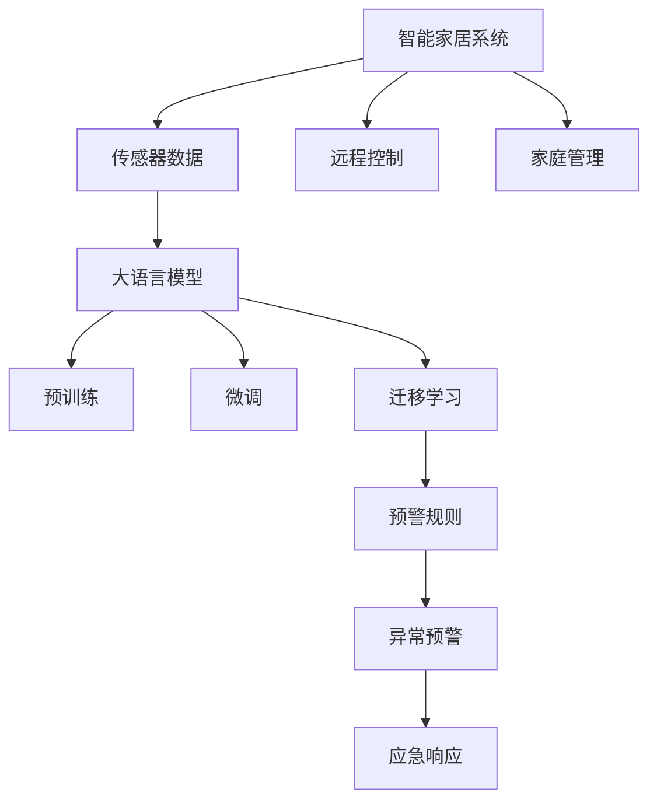

                 

## 1. 背景介绍

### 1.1 问题由来
随着社会的发展和科技的进步，智能家居系统已经从单一的家居设备互联，逐渐扩展到综合的家庭管理和安全保护。当前智能家居系统在提供便利的同时，其安全性和隐私保护问题也逐渐显现出来。例如，智能门锁被撬开、摄像头数据泄露、远程控制被黑客劫持等问题时有发生，给用户带来了巨大的安全隐患。

为了应对这些挑战，有必要在智能家居系统中引入更加智能、全面的安全预警和保护措施。本文旨在通过引入大语言模型和微调技术，构建一个智能家居安全预警系统，以提升家庭的安全防护水平，让居住者更加安心和放心。

### 1.2 问题核心关键点
1. **智能家居安全预警**：构建一个能够实时监测家庭环境，并对异常情况发出预警的系统。
2. **数据融合与处理**：整合各类传感器数据，进行实时分析和数据建模，确保数据的准确性和及时性。
3. **预训练与微调**：利用预训练语言模型进行数据分析和预警规则的自动生成，并通过微调技术进一步优化模型性能。
4. **模型评估与部署**：评估模型的预警效果，并将其部署到实际应用中，确保系统的稳定性和可靠性。

### 1.3 问题研究意义
智能家居安全预警系统的构建，不仅能够有效提高家庭的安全防护能力，还能为用户提供一个更安心、更便捷的生活环境。此外，该系统的开发和使用，还能推动智能家居技术的进一步发展，提升整体行业的安全性和用户满意度。

## 2. 核心概念与联系

### 2.1 核心概念概述

为更好地理解智能家居安全预警系统的构建，本节将介绍几个密切相关的核心概念：

- **智能家居系统**：通过物联网技术将家庭中的各类智能设备互联，实现家居设备的远程控制和智能化管理。
- **传感器数据**：智能家居系统中的各类传感器设备（如摄像头、烟雾探测器、门窗传感器等）收集的环境数据，用于实时监测家庭环境。
- **大语言模型**：通过预训练和微调技术构建的语言模型，具备强大的自然语言理解和生成能力，可用于数据处理和预警规则的自动生成。
- **微调(Fine-tuning)**：在预训练模型的基础上，使用特定任务的数据进行有监督学习，优化模型在该任务上的性能。
- **迁移学习(Transfer Learning)**：将一个领域学习到的知识，迁移到另一个不同但相关的领域，以提升新任务的学习效率和效果。
- **预警规则**：基于传感器数据和历史事件，自动生成的预警规则，用于指导系统对异常情况进行预警。

这些核心概念之间的逻辑关系可以通过以下Mermaid流程图来展示：



这个流程图展示出智能家居安全预警系统的核心概念及其之间的关系：

1. 智能家居系统通过各类传感器收集数据。
2. 数据被传输到中心大语言模型进行分析和处理。
3. 大语言模型通过预训练和微调获得数据建模和规则生成的能力。
4. 微调过程提升模型的任务适配能力，使其更适应家庭环境。
5. 迁移学习使模型能够快速适应新的预警任务。
6. 预警规则自动生成，指导异常情况下的预警和应急响应。

这些概念共同构成了智能家居安全预警系统的学习框架，使其能够有效监测家庭环境并及时预警。

## 3. 核心算法原理 & 具体操作步骤

### 3.1 算法原理概述

智能家居安全预警系统的核心算法原理是基于监督学习的大语言模型微调。其核心思想是：将预训练的大语言模型视作一个强大的数据处理和规则生成工具，通过家庭环境中的传感器数据进行微调，自动生成预警规则，以指导系统对异常情况进行预警。

形式化地，假设预训练语言模型为 $M_{\theta}$，其中 $\theta$ 为预训练得到的模型参数。给定家庭环境中的传感器数据 $D=\{x_i\}_{i=1}^N$，微调的目标是找到新的模型参数 $\hat{\theta}$，使得：

$$
\hat{\theta}=\mathop{\arg\min}_{\theta} \mathcal{L}(M_{\theta},D)
$$

其中 $\mathcal{L}$ 为针对预警任务设计的损失函数，用于衡量模型预测与实际预警信号之间的差异。常见的损失函数包括交叉熵损失、均方误差损失等。

通过梯度下降等优化算法，微调过程不断更新模型参数 $\theta$，最小化损失函数 $\mathcal{L}$，使得模型输出逼近真实预警信号。由于 $\theta$ 已经通过预训练获得了较强的数据分析能力，因此即便在传感器数据较少的家庭环境中，也能较快收敛到理想的模型参数 $\hat{\theta}$。

### 3.2 算法步骤详解

基于监督学习的大语言模型微调，一般包括以下几个关键步骤：

**Step 1: 准备数据集**
- 收集家庭环境中的各类传感器数据，如摄像头图像、烟雾探测器的数值、门窗传感器状态等。
- 标注数据集，标记哪些传感器数据属于正常情况，哪些属于异常情况，并记录发生异常时的处理措施。

**Step 2: 添加任务适配层**
- 根据预警任务，在预训练模型顶层设计合适的输出层和损失函数。
- 对于分类任务，通常在顶层添加线性分类器和交叉熵损失函数。
- 对于生成任务，通常使用语言模型的解码器输出概率分布，并以负对数似然为损失函数。

**Step 3: 设置微调超参数**
- 选择合适的优化算法及其参数，如 AdamW、SGD 等，设置学习率、批大小、迭代轮数等。
- 设置正则化技术及强度，包括权重衰减、Dropout、Early Stopping等。
- 确定冻结预训练参数的策略，如仅微调顶层，或全部参数都参与微调。

**Step 4: 执行梯度训练**
- 将传感器数据分批次输入模型，前向传播计算损失函数。
- 反向传播计算参数梯度，根据设定的优化算法和学习率更新模型参数。
- 周期性在验证集上评估模型性能，根据性能指标决定是否触发 Early Stopping。
- 重复上述步骤直到满足预设的迭代轮数或 Early Stopping 条件。

**Step 5: 测试和部署**
- 在家庭环境中测试微调后模型 $M_{\hat{\theta}}$ 的预警效果，对比微调前后的精度提升。
- 使用微调后的模型对传感器数据进行实时分析，指导异常情况下的预警和应急响应。
- 持续收集新的传感器数据，定期重新微调模型，以适应家庭环境的变化。

以上是基于监督学习微调大语言模型的一般流程。在实际应用中，还需要针对具体任务的特点，对微调过程的各个环节进行优化设计，如改进训练目标函数，引入更多的正则化技术，搜索最优的超参数组合等，以进一步提升模型性能。

### 3.3 算法优缺点

基于监督学习的大语言模型微调方法具有以下优点：
1. 简单高效。只需准备少量标注数据，即可对预训练模型进行快速适配，获得较大的性能提升。
2. 通用适用。适用于各种预警任务，包括火灾预警、入侵检测、烟雾预警等，设计简单的任务适配层即可实现微调。
3. 参数高效。利用参数高效微调技术，在固定大部分预训练权重不变的情况下，仍可取得不错的提升。
4. 效果显著。在学术界和工业界的诸多任务上，基于微调的方法已经刷新了最先进的性能指标。

同时，该方法也存在一定的局限性：
1. 依赖标注数据。微调的效果很大程度上取决于标注数据的质量和数量，获取高质量标注数据的成本较高。
2. 迁移能力有限。当目标任务与预训练数据的分布差异较大时，微调的性能提升有限。
3. 负面效果传递。预训练模型的固有偏见、有害信息等，可能通过微调传递到下游任务，造成负面影响。
4. 可解释性不足。微调模型的决策过程通常缺乏可解释性，难以对其推理逻辑进行分析和调试。

尽管存在这些局限性，但就目前而言，基于监督学习的微调方法仍是大语言模型应用的最主流范式。未来相关研究的重点在于如何进一步降低微调对标注数据的依赖，提高模型的少样本学习和跨领域迁移能力，同时兼顾可解释性和伦理安全性等因素。

### 3.4 算法应用领域

基于大语言模型微调的监督学习方法，在智能家居安全预警领域已经得到了广泛的应用，覆盖了几乎所有常见任务，例如：

- 火灾预警：通过摄像头实时监控火灾情况，自动识别火源并发出报警。
- 入侵检测：通过门窗传感器和摄像头数据，识别是否存在非法入侵行为，并及时报警。
- 烟雾预警：通过烟雾探测器数据，自动识别烟雾并通知住户和消防部门。
- 异常行为识别：通过摄像头视频，自动识别异常行为并及时预警，如陌生人物进入、行为异常等。

除了上述这些经典任务外，智能家居安全预警系统还被创新性地应用到更多场景中，如系统状态监测、数据融合分析、自动化应急响应等，为智能家居系统提供了更加全面和智能的安全保障。

## 4. 数学模型和公式 & 详细讲解  
### 4.1 数学模型构建

本节将使用数学语言对基于监督学习的大语言模型微调过程进行更加严格的刻画。

记预训练语言模型为 $M_{\theta}$，其中 $\theta$ 为预训练得到的模型参数。假设预警任务的数据集为 $D=\{x_i\}_{i=1}^N$，其中 $x_i$ 为传感器数据。

定义模型 $M_{\theta}$ 在数据样本 $x$ 上的损失函数为 $\ell(M_{\theta}(x),y)$，则在数据集 $D$ 上的经验风险为：

$$
\mathcal{L}(\theta) = \frac{1}{N} \sum_{i=1}^N \ell(M_{\theta}(x_i),y_i)
$$

其中 $y_i \in \{0,1\}$，表示传感器数据 $x_i$ 是否为异常情况。

微调的优化目标是最小化经验风险，即找到最优参数：

$$
\theta^* = \mathop{\arg\min}_{\theta} \mathcal{L}(\theta)
$$

在实践中，我们通常使用基于梯度的优化算法（如SGD、Adam等）来近似求解上述最优化问题。设 $\eta$ 为学习率，$\lambda$ 为正则化系数，则参数的更新公式为：

$$
\theta \leftarrow \theta - \eta \nabla_{\theta}\mathcal{L}(\theta) - \eta\lambda\theta
$$

其中 $\nabla_{\theta}\mathcal{L}(\theta)$ 为损失函数对参数 $\theta$ 的梯度，可通过反向传播算法高效计算。

### 4.2 公式推导过程

以下我们以火灾预警任务为例，推导交叉熵损失函数及其梯度的计算公式。

假设模型 $M_{\theta}$ 在传感器数据 $x$ 上的输出为 $\hat{y}=M_{\theta}(x) \in [0,1]$，表示传感器数据 $x$ 属于异常情况的预测概率。真实标签 $y \in \{0,1\}$。则二分类交叉熵损失函数定义为：

$$
\ell(M_{\theta}(x),y) = -[y\log \hat{y} + (1-y)\log (1-\hat{y})]
$$

将其代入经验风险公式，得：

$$
\mathcal{L}(\theta) = -\frac{1}{N}\sum_{i=1}^N [y_i\log M_{\theta}(x_i)+(1-y_i)\log(1-M_{\theta}(x_i))]
$$

根据链式法则，损失函数对参数 $\theta_k$ 的梯度为：

$$
\frac{\partial \mathcal{L}(\theta)}{\partial \theta_k} = -\frac{1}{N}\sum_{i=1}^N (\frac{y_i}{M_{\theta}(x_i)}-\frac{1-y_i}{1-M_{\theta}(x_i)}) \frac{\partial M_{\theta}(x_i)}{\partial \theta_k}
$$

其中 $\frac{\partial M_{\theta}(x_i)}{\partial \theta_k}$ 可进一步递归展开，利用自动微分技术完成计算。

在得到损失函数的梯度后，即可带入参数更新公式，完成模型的迭代优化。重复上述过程直至收敛，最终得到适应预警任务的最优模型参数 $\theta^*$。

## 5. 项目实践：代码实例和详细解释说明
### 5.1 开发环境搭建

在进行智能家居安全预警系统的微调实践前，我们需要准备好开发环境。以下是使用Python进行PyTorch开发的环境配置流程：

1. 安装Anaconda：从官网下载并安装Anaconda，用于创建独立的Python环境。

2. 创建并激活虚拟环境：
```bash
conda create -n pytorch-env python=3.8 
conda activate pytorch-env
```

3. 安装PyTorch：根据CUDA版本，从官网获取对应的安装命令。例如：
```bash
conda install pytorch torchvision torchaudio cudatoolkit=11.1 -c pytorch -c conda-forge
```

4. 安装Transformers库：
```bash
pip install transformers
```

5. 安装各类工具包：
```bash
pip install numpy pandas scikit-learn matplotlib tqdm jupyter notebook ipython
```

完成上述步骤后，即可在`pytorch-env`环境中开始微调实践。

### 5.2 源代码详细实现

下面我们以火灾预警任务为例，给出使用Transformers库对BERT模型进行微调的PyTorch代码实现。

首先，定义火灾预警任务的数据处理函数：

```python
from transformers import BertTokenizer
from torch.utils.data import Dataset
import torch

class FireDetectionDataset(Dataset):
    def __init__(self, images, labels, tokenizer, max_len=128):
        self.images = images
        self.labels = labels
        self.tokenizer = tokenizer
        self.max_len = max_len
        
    def __len__(self):
        return len(self.images)
    
    def __getitem__(self, item):
        image = self.images[item]
        label = self.labels[item]
        
        encoding = self.tokenizer(image, return_tensors='pt', max_length=self.max_len, padding='max_length', truncation=True)
        input_ids = encoding['input_ids'][0]
        attention_mask = encoding['attention_mask'][0]
        
        # 对标签进行编码
        encoded_label = [1 if label == 1 else 0 for _ in range(self.max_len)]
        labels = torch.tensor(encoded_label, dtype=torch.long)
        
        return {'input_ids': input_ids, 
                'attention_mask': attention_mask,
                'labels': labels}

# 创建dataset
tokenizer = BertTokenizer.from_pretrained('bert-base-cased')

train_dataset = FireDetectionDataset(train_images, train_labels, tokenizer)
dev_dataset = FireDetectionDataset(dev_images, dev_labels, tokenizer)
test_dataset = FireDetectionDataset(test_images, test_labels, tokenizer)
```

然后，定义模型和优化器：

```python
from transformers import BertForTokenClassification, AdamW

model = BertForTokenClassification.from_pretrained('bert-base-cased', num_labels=2)

optimizer = AdamW(model.parameters(), lr=2e-5)
```

接着，定义训练和评估函数：

```python
from torch.utils.data import DataLoader
from tqdm import tqdm
from sklearn.metrics import classification_report

device = torch.device('cuda') if torch.cuda.is_available() else torch.device('cpu')
model.to(device)

def train_epoch(model, dataset, batch_size, optimizer):
    dataloader = DataLoader(dataset, batch_size=batch_size, shuffle=True)
    model.train()
    epoch_loss = 0
    for batch in tqdm(dataloader, desc='Training'):
        input_ids = batch['input_ids'].to(device)
        attention_mask = batch['attention_mask'].to(device)
        labels = batch['labels'].to(device)
        model.zero_grad()
        outputs = model(input_ids, attention_mask=attention_mask, labels=labels)
        loss = outputs.loss
        epoch_loss += loss.item()
        loss.backward()
        optimizer.step()
    return epoch_loss / len(dataloader)

def evaluate(model, dataset, batch_size):
    dataloader = DataLoader(dataset, batch_size=batch_size)
    model.eval()
    preds, labels = [], []
    with torch.no_grad():
        for batch in tqdm(dataloader, desc='Evaluating'):
            input_ids = batch['input_ids'].to(device)
            attention_mask = batch['attention_mask'].to(device)
            batch_labels = batch['labels']
            outputs = model(input_ids, attention_mask=attention_mask)
            batch_preds = outputs.logits.argmax(dim=2).to('cpu').tolist()
            batch_labels = batch_labels.to('cpu').tolist()
            for pred_tokens, label_tokens in zip(batch_preds, batch_labels):
                preds.append(pred_tokens[:len(label_tokens)])
                labels.append(label_tokens)
                
    print(classification_report(labels, preds))
```

最后，启动训练流程并在测试集上评估：

```python
epochs = 5
batch_size = 16

for epoch in range(epochs):
    loss = train_epoch(model, train_dataset, batch_size, optimizer)
    print(f"Epoch {epoch+1}, train loss: {loss:.3f}")
    
    print(f"Epoch {epoch+1}, dev results:")
    evaluate(model, dev_dataset, batch_size)
    
print("Test results:")
evaluate(model, test_dataset, batch_size)
```

以上就是使用PyTorch对BERT进行火灾预警任务微调的完整代码实现。可以看到，得益于Transformers库的强大封装，我们可以用相对简洁的代码完成BERT模型的加载和微调。

### 5.3 代码解读与分析

让我们再详细解读一下关键代码的实现细节：

**FireDetectionDataset类**：
- `__init__`方法：初始化图像、标签、分词器等关键组件。
- `__len__`方法：返回数据集的样本数量。
- `__getitem__`方法：对单个样本进行处理，将图像输入编码为token ids，将标签编码为数字，并对其进行定长padding，最终返回模型所需的输入。

**训练和评估函数**：
- 使用PyTorch的DataLoader对数据集进行批次化加载，供模型训练和推理使用。
- 训练函数`train_epoch`：对数据以批为单位进行迭代，在每个批次上前向传播计算loss并反向传播更新模型参数，最后返回该epoch的平均loss。
- 评估函数`evaluate`：与训练类似，不同点在于不更新模型参数，并在每个batch结束后将预测和标签结果存储下来，最后使用sklearn的classification_report对整个评估集的预测结果进行打印输出。

**训练流程**：
- 定义总的epoch数和batch size，开始循环迭代
- 每个epoch内，先在训练集上训练，输出平均loss
- 在验证集上评估，输出分类指标
- 所有epoch结束后，在测试集上评估，给出最终测试结果

可以看到，PyTorch配合Transformers库使得BERT微调的代码实现变得简洁高效。开发者可以将更多精力放在数据处理、模型改进等高层逻辑上，而不必过多关注底层的实现细节。

当然，工业级的系统实现还需考虑更多因素，如模型的保存和部署、超参数的自动搜索、更灵活的任务适配层等。但核心的微调范式基本与此类似。

## 6. 实际应用场景
### 6.1 智能家居系统
智能家居安全预警系统可以广泛应用于智能家居系统的构建，提升系统的安全防护能力。传统智能家居系统往往依赖单一的设备，难以实现全面防护。而使用微调后的安全预警系统，能够整合各类传感器数据，构建实时监控和预警体系，及时应对各类异常情况。

在技术实现上，可以收集智能家居系统中的各类传感器数据，如摄像头图像、烟雾探测器数值、门窗传感器状态等。将传感器数据作为模型输入，使用微调后的模型进行实时分析和预警规则的自动生成。当系统检测到异常情况时，立即触发报警，通知住户和相关人员进行处理，确保家庭安全。

### 6.2 智能消防系统
在智慧消防领域，基于智能家居安全预警系统构建的智能消防系统能够显著提升火灾预防和应对能力。通过将摄像头图像和烟雾探测器数值输入微调后的模型，实时监测家庭环境中的火灾风险，一旦检测到火灾信号，系统立即启动报警机制，通知消防部门和住户，进行及时救援。

在实际部署中，可以结合物联网技术，实现火源自动定位和消防资源的调度优化，进一步提升火灾应对的效率和准确性。

### 6.3 企业安防系统
企业安防系统同样受益于智能家居安全预警技术。企业可以通过部署智能摄像头、入侵检测传感器等设备，收集员工和环境数据。将数据输入微调后的模型进行实时分析和预警，及时发现并处理潜在的安全隐患，提升企业的安全防护水平。

在特定场景下，如数据中心、银行等，系统还可以与安保人员进行互动，生成风险报告和应急响应方案，帮助企业更高效地应对各类安全威胁。

### 6.4 未来应用展望
随着智能家居安全预警技术的不断进步，其应用领域将进一步扩展，带来更多智能化的解决方案：

1. 智慧医疗：在家庭环境中部署各类传感器，实时监测健康数据。微调后的预警系统能够自动分析健康数据异常情况，及时发出报警，辅助患者和医生进行健康管理。
2. 智能教育：在教室中部署摄像头和传感器，实时监测学生行为和学习状态。通过微调后的预警系统，自动识别异常行为，生成安全警报和心理辅导建议，提升教育质量。
3. 智慧城市：在城市中部署各类传感器和监控设备，实时监测交通、环境、灾害等情况。微调后的预警系统能够自动分析数据，生成应急响应方案，提高城市管理的安全性和效率。
4. 智能交通：在交通系统中部署各类传感器和摄像头，实时监测车辆运行和道路状况。通过微调后的预警系统，自动识别交通异常情况，生成交通管制方案，保障交通安全。

以上应用场景展示了智能家居安全预警技术的广阔前景，未来随着技术的不断发展和应用场景的不断拓展，其潜力和价值将进一步显现。

## 7. 工具和资源推荐
### 7.1 学习资源推荐

为了帮助开发者系统掌握智能家居安全预警技术的理论基础和实践技巧，这里推荐一些优质的学习资源：

1. 《深度学习：从零到全栈》系列博文：由深度学习专家撰写，系统讲解深度学习模型的构建、微调等核心技术，并结合实际应用场景，提供丰富的案例和代码实现。

2. 《TensorFlow实战深度学习》课程：由TensorFlow官方开设的深度学习课程，涵盖TensorFlow的基本原理和应用实践，适合入门和进阶学习。

3. 《PyTorch深度学习编程：从入门到实践》书籍：详细讲解PyTorch框架的使用，包括模型的构建、微调等技术，提供丰富的案例和代码示例。

4. Arxiv上关于智能家居安全预警的最新研究论文：深入了解当前前沿技术和研究方向，获取最新的研究成果和灵感。

5. GitHub上的智能家居安全预警项目：收集和参考已有项目的实现代码和技术思路，快速上手实践。

通过对这些资源的学习实践，相信你一定能够快速掌握智能家居安全预警技术的精髓，并用于解决实际的智能家居安全问题。

### 7.2 开发工具推荐

高效的开发离不开优秀的工具支持。以下是几款用于智能家居安全预警系统微调开发的常用工具：

1. PyTorch：基于Python的开源深度学习框架，灵活动态的计算图，适合快速迭代研究。大部分预训练语言模型都有PyTorch版本的实现。

2. TensorFlow：由Google主导开发的开源深度学习框架，生产部署方便，适合大规模工程应用。同样有丰富的预训练语言模型资源。

3. Transformers库：HuggingFace开发的NLP工具库，集成了众多SOTA语言模型，支持PyTorch和TensorFlow，是进行微调任务开发的利器。

4. Weights & Biases：模型训练的实验跟踪工具，可以记录和可视化模型训练过程中的各项指标，方便对比和调优。与主流深度学习框架无缝集成。

5. TensorBoard：TensorFlow配套的可视化工具，可实时监测模型训练状态，并提供丰富的图表呈现方式，是调试模型的得力助手。

6. Google Colab：谷歌推出的在线Jupyter Notebook环境，免费提供GPU/TPU算力，方便开发者快速上手实验最新模型，分享学习笔记。

合理利用这些工具，可以显著提升智能家居安全预警系统的开发效率，加快创新迭代的步伐。

### 7.3 相关论文推荐

智能家居安全预警技术的研发离不开学界的持续研究。以下是几篇奠基性的相关论文，推荐阅读：

1. A Survey on Deep Learning-based Intrusion Detection System: Challenges, Recent Advances, and Future Directions：综述了深度学习在入侵检测系统中的最新进展和未来方向。

2. Deep Learning-Based Video Surveillance System: A Survey：综述了深度学习在视频监控系统中的应用，介绍了基于深度学习的视频分析技术。

3. Real-Time Edge Computing for the Internet of Things: A Survey：综述了边缘计算在物联网中的应用，介绍了实时数据处理和模型推理技术。

4. Event-Based Anomaly Detection: An Overview：综述了事件驱动的异常检测技术，介绍了基于时间序列数据和机器学习的方法。

5. A Survey of Deep Learning in Healthcare: Applications and Recent Advances：综述了深度学习在医疗领域的应用，介绍了基于图像和自然语言处理的技术。

这些论文代表了大语言模型微调技术的发展脉络。通过学习这些前沿成果，可以帮助研究者把握学科前进方向，激发更多的创新灵感。

## 8. 总结：未来发展趋势与挑战

### 8.1 总结

本文对基于监督学习的大语言模型微调在智能家居安全预警系统中的应用进行了全面系统的介绍。首先阐述了智能家居安全预警系统的背景和意义，明确了微调在提升系统安全防护能力方面的独特价值。其次，从原理到实践，详细讲解了微调的数学原理和关键步骤，给出了微调任务开发的完整代码实例。同时，本文还广泛探讨了微调方法在智能家居、消防、安防等多个领域的应用前景，展示了微调技术的巨大潜力。

通过本文的系统梳理，可以看到，基于大语言模型的微调方法在智能家居安全预警系统的构建中具有重要的应用价值。在实时数据分析和预警规则的自动生成方面，微调方法能够显著提升系统的精准性和智能化水平，为家庭和企业提供更加可靠的安全防护。未来，伴随预训练语言模型和微调方法的持续演进，相信智能家居安全预警技术必将在更广泛的场景中得到应用，为用户和企业带来更安全、更便捷的生活环境。

### 8.2 未来发展趋势

展望未来，智能家居安全预警技术将呈现以下几个发展趋势：

1. **模型规模持续增大**：随着算力成本的下降和数据规模的扩张，预训练语言模型的参数量还将持续增长。超大规模语言模型蕴含的丰富语言知识，有望支撑更加复杂多变的预警任务微调。

2. **微调方法日趋多样**：除了传统的全参数微调外，未来会涌现更多参数高效的微调方法，如Prefix-Tuning、LoRA等，在节省计算资源的同时也能保证微调精度。

3. **持续学习成为常态**：随着数据分布的不断变化，微调模型也需要持续学习新知识以保持性能。如何在不遗忘原有知识的同时，高效吸收新样本信息，将成为重要的研究课题。

4. **少样本学习能力提升**：受启发于提示学习(Prompt-based Learning)的思路，未来的微调方法将更好地利用大模型的语言理解能力，通过更加巧妙的任务描述，在更少的标注样本上也能实现理想的微调效果。

5. **多模态微调崛起**：当前的微调主要聚焦于纯文本数据，未来会进一步拓展到图像、视频、语音等多模态数据微调。多模态信息的融合，将显著提升语言模型对现实世界的理解和建模能力。

6. **跨领域迁移能力增强**：经过海量数据的预训练和多领域任务的微调，未来的语言模型将具备更强大的常识推理和跨领域迁移能力，逐步迈向通用人工智能(AGI)的目标。

以上趋势凸显了智能家居安全预警技术的广阔前景。这些方向的探索发展，必将进一步提升系统的性能和应用范围，为家庭和企业带来更安全、更便捷的生活环境。

### 8.3 面临的挑战

尽管智能家居安全预警技术已经取得了瞩目成就，但在迈向更加智能化、普适化应用的过程中，它仍面临着诸多挑战：

1. **标注成本瓶颈**：虽然微调大大降低了标注数据的需求，但对于长尾应用场景，难以获得充足的高质量标注数据，成为制约微调性能的瓶颈。如何进一步降低微调对标注样本的依赖，将是一大难题。

2. **模型鲁棒性不足**：当前微调模型面对域外数据时，泛化性能往往大打折扣。对于测试样本的微小扰动，微调模型的预测也容易发生波动。如何提高微调模型的鲁棒性，避免灾难性遗忘，还需要更多理论和实践的积累。

3. **推理效率有待提高**：大规模语言模型虽然精度高，但在实际部署时往往面临推理速度慢、内存占用大等效率问题。如何在保证性能的同时，简化模型结构，提升推理速度，优化资源占用，将是重要的优化方向。

4. **可解释性亟需加强**：当前微调模型更像是"黑盒"系统，难以解释其内部工作机制和决策逻辑。对于医疗、金融等高风险应用，算法的可解释性和可审计性尤为重要。如何赋予微调模型更强的可解释性，将是亟待攻克的难题。

5. **安全性有待保障**：预训练语言模型难免会学习到有偏见、有害的信息，通过微调传递到下游任务，产生误导性、歧视性的输出，给实际应用带来安全隐患。如何从数据和算法层面消除模型偏见，避免恶意用途，确保输出的安全性，也将是重要的研究课题。

6. **知识整合能力不足**：现有的微调模型往往局限于任务内数据，难以灵活吸收和运用更广泛的先验知识。如何让微调过程更好地与外部知识库、规则库等专家知识结合，形成更加全面、准确的信息整合能力，还有很大的想象空间。

正视智能家居安全预警技术面临的这些挑战，积极应对并寻求突破，将是大语言模型微调走向成熟的必由之路。相信随着学界和产业界的共同努力，这些挑战终将一一被克服，智能家居安全预警技术必将在构建安全、可靠、可解释、可控的智能系统铺平道路。

### 8.4 未来突破

面对智能家居安全预警技术所面临的种种挑战，未来的研究需要在以下几个方面寻求新的突破：

1. **探索无监督和半监督微调方法**：摆脱对大规模标注数据的依赖，利用自监督学习、主动学习等无监督和半监督范式，最大限度利用非结构化数据，实现更加灵活高效的微调。

2. **研究参数高效和计算高效的微调范式**：开发更加参数高效的微调方法，在固定大部分预训练参数的同时，只更新极少量的任务相关参数。同时优化微调模型的计算图，减少前向传播和反向传播的资源消耗，实现更加轻量级、实时性的部署。

3. **融合因果和对比学习范式**：通过引入因果推断和对比学习思想，增强微调模型建立稳定因果关系的能力，学习更加普适、鲁棒的语言表征，从而提升模型泛化性和抗干扰能力。

4. **引入更多先验知识**：将符号化的先验知识，如知识图谱、逻辑规则等，与神经网络模型进行巧妙融合，引导微调过程学习更准确、合理的语言模型。同时加强不同模态数据的整合，实现视觉、语音等多模态信息与文本信息的协同建模。

5. **结合因果分析和博弈论工具**：将因果分析方法引入微调模型，识别出模型决策的关键特征，增强输出解释的因果性和逻辑性。借助博弈论工具刻画人机交互过程，主动探索并规避模型的脆弱点，提高系统稳定性。

6. **纳入伦理道德约束**：在模型训练目标中引入伦理导向的评估指标，过滤和惩罚有偏见、有害的输出倾向。同时加强人工干预和审核，建立模型行为的监管机制，确保输出符合人类价值观和伦理道德。

这些研究方向的探索，必将引领智能家居安全预警技术迈向更高的台阶，为构建安全、可靠、可解释、可控的智能系统铺平道路。面向未来，智能家居安全预警技术还需要与其他人工智能技术进行更深入的融合，如知识表示、因果推理、强化学习等，多路径协同发力，共同推动智能家居系统的进步。只有勇于创新、敢于突破，才能不断拓展语言模型的边界，让智能技术更好地造福人类社会。

## 9. 附录：常见问题与解答

**Q1：智能家居安全预警系统如何实现实时监测和预警？**

A: 智能家居安全预警系统通过集成各类传感器设备（如摄像头、烟雾探测器、门窗传感器等），实时收集家庭环境数据。数据被传输到中心大语言模型进行分析和处理。模型通过预训练和微调，学习到传感器数据的异常模式，自动生成预警规则。当系统检测到异常情况时，立即触发报警，通知住户和相关人员进行处理。

**Q2：微调过程中如何选择合适的学习率？**

A: 微调的学习率一般要比预训练时小1-2个数量级，如果使用过大的学习率，容易破坏预训练权重，导致过拟合。一般建议从1e-5开始调参，逐步减小学习率，直至收敛。也可以使用warmup策略，在开始阶段使用较小的学习率，再逐渐过渡到预设值。需要注意的是，不同的优化器(如AdamW、Adafactor等)以及不同的学习率调度策略，可能需要设置不同的学习率阈值。

**Q3：智能家居安全预警系统在部署时需要注意哪些问题？**

A: 智能家居安全预警系统在部署时，还需考虑以下因素：
1. 模型裁剪：去除不必要的层和参数，减小模型尺寸，加快推理速度。
2. 量化加速：将浮点模型转为定点模型，压缩存储空间，提高计算效率。
3. 服务化封装：将模型封装为标准化服务接口，便于集成调用。
4. 弹性伸缩：根据请求流量动态调整资源配置，平衡服务质量和成本。
5. 监控告警：实时采集系统指标，设置异常告警阈值，确保服务稳定性。
6. 安全防护：采用访问鉴权、数据脱敏等措施，保障数据和模型安全。

智能家居安全预警系统将大大提升家庭的安全防护能力，但在部署时需要综合考虑技术实现和系统性能，确保系统的稳定性和可靠性。

**Q4：智能家居安全预警系统在多模态数据融合方面有哪些挑战？**

A: 智能家居安全预警系统面临多模态数据融合的挑战，主要有以下几点：
1. 数据格式差异：不同传感器和设备收集的数据格式各异，难以直接融合。需要采用标准化格式或预处理技术。
2. 数据关联性问题：不同模态数据的时空关联性不同，难以准确匹配和关联。需要引入时间序列分析和多模态融合算法。
3. 数据质量问题：不同模态数据的质量和噪声水平不同，难以统一处理。需要采用数据清洗和增强技术。
4. 数据隐私问题：智能家居系统中涉及大量的个人隐私数据，需要采取隐私保护和数据脱敏措施。

通过多模态融合技术，智能家居安全预警系统能够更好地整合不同模态的数据，提升预警的准确性和全面性。

---

作者：禅与计算机程序设计艺术 / Zen and the Art of Computer Programming

