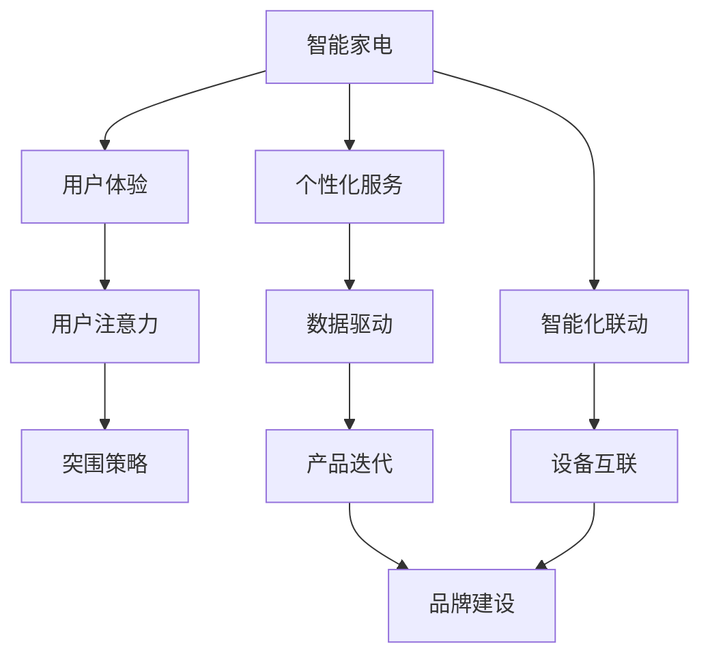

                 

# 智能家电如何在注意力经济中突围

## 1. 背景介绍

随着移动互联网和物联网的迅猛发展，智能家居市场正处于蓬勃发展之中。智能家电通过内置的物联网传感器和智能控制系统，可以实现环境监测、场景联动、远程控制等功能，极大地提升了用户的居住体验。然而，在信息过载和注意力稀缺的注意力经济时代，智能家电如何突围，成为摆在行业面前的重大挑战。

### 1.1 问题由来

在智能家电的发展过程中，用户对设备的使用关注点发生了显著变化。传统的功能性需求已经不能满足用户日益提升的体验期望，而注意力经济时代下，用户对智能家电的期望也从功能本身扩展到了整体的用户体验和情感连接。因此，智能家电要想在激烈的市场竞争中脱颖而出，必须从关注单一功能转向构建全面的用户体验，真正赢得用户的"注意力"。

### 1.2 问题核心关键点

智能家电在注意力经济中突围的核心在于以下几点：

- 智能化的产品设计与用户体验优化。
- 精准的用户需求理解和个性化服务。
- 多场景多设备的智能联动与自动化。
- 构建品牌影响力和口碑效应。
- 数据驱动的产品迭代与创新。

要实现这些目标，智能家电厂商需要构建以用户为中心的设计思路，将产品功能与用户体验完美融合，为用户提供更加智能、便捷、安全、舒适的生活环境。同时，智能家电还需不断挖掘用户深层次的需求，通过数据分析和机器学习，提供个性化、定制化的服务，从而在用户心中形成独特的品牌印象。

## 2. 核心概念与联系

### 2.1 核心概念概述

为更好地理解智能家电如何在注意力经济中突围，本节将介绍几个密切相关的核心概念：

- **智能家电**：集成了人工智能技术，能够实现自主控制、自动化操作、环境监测等功能，提升用户生活品质的设备。
- **用户体验**：用户在使用智能家电过程中的整体感受和满意度，包括操作便捷性、设备交互性、应用实用性等。
- **个性化服务**：根据用户行为、偏好、历史数据等信息，提供量身定制的服务，满足用户的个性化需求。
- **用户注意力**：用户在特定情境下对某一产品或服务的集中注意程度，是注意力经济时代下智能家电突围的关键。
- **智能化联动**：将不同智能家电设备之间进行互联互通，实现多场景多设备的智能化联动和自动化，提升用户使用体验。

这些核心概念之间的逻辑关系可以通过以下Mermaid流程图来展示：



这个流程图展示了一些关键概念及其之间的关系：

1. 智能家电通过提升用户体验，吸引用户的注意力。
2. 通过个性化服务和智能化联动，进一步强化用户的注意力。
3. 品牌建设是增强用户黏性和忠诚度的重要手段。
4. 数据驱动的产品迭代是持续优化用户体验和提升服务质量的关键。

## 3. 核心算法原理 & 具体操作步骤
### 3.1 算法原理概述

智能家电在注意力经济中突围的核心算法原理主要包括以下几个方面：

- **用户行为分析**：通过对用户行为数据的收集和分析，挖掘用户需求，定制个性化服务。
- **情感计算**：利用自然语言处理和情感识别技术，分析用户的情感状态，提供更为贴心的服务。
- **强化学习**：通过与用户交互，动态调整设备功能和设置，不断优化用户体验。
- **多模态信息融合**：结合语音、图像、位置等多模态信息，实现场景联动和自动化操作。

### 3.2 算法步骤详解

智能家电在注意力经济中突围的具体算法步骤如下：

**Step 1: 数据采集与用户画像构建**
- 使用传感器和智能控制系统收集用户的生活习惯、健康状况、环境数据等信息。
- 利用机器学习算法构建用户画像，分析用户的兴趣偏好、行为模式等。

**Step 2: 数据处理与情感分析**
- 对采集到的数据进行清洗和处理，提取有用的特征。
- 利用情感分析技术，识别用户情感状态，调整设备运行模式和输出内容。

**Step 3: 个性化推荐与联动优化**
- 根据用户画像和情感状态，推荐个性化的家电功能和场景联动方案。
- 实时监测用户反馈，动态优化设备联动和智能化程度。

**Step 4: 用户反馈与模型更新**
- 收集用户使用过程中的反馈和评价，进行持续改进。
- 使用强化学习算法，调整推荐模型和联动方案。

**Step 5: 品牌传播与用户教育**
- 利用社交媒体、线上活动等渠道，提升品牌知名度和用户认知。
- 对用户进行产品教育和操作引导，提升用户使用体验。

### 3.3 算法优缺点

智能家电在注意力经济中突围的算法具有以下优点：

- **个性化服务**：通过用户画像和情感分析，提供个性化的服务和内容，满足用户多样化需求。
- **智能化联动**：实现不同设备之间的无缝联动和自动化操作，提升用户体验。
- **数据驱动的迭代**：通过用户反馈和数据分析，不断优化产品和服务，提升产品质量。

同时，该算法也存在一些局限性：

- **隐私与安全问题**：数据采集和使用可能引发隐私和安全问题，需要制定严格的隐私保护措施。
- **计算资源需求高**：数据处理和机器学习算法对计算资源要求较高，需要高质量的硬件支持。
- **用户体验一致性**：多设备、多场景下的智能化联动，可能面临用户体验一致性问题，需要统一的用户界面和操作逻辑。

尽管存在这些局限性，但就目前而言，基于智能化的突围算法，智能家电在吸引用户注意力、提升用户体验方面已经取得了显著进展。

### 3.4 算法应用领域

智能家电的突围算法在多个领域得到了广泛应用，如：

- **家居环境监控与健康管理**：通过智能传感器和数据分析，实现对家居环境的实时监控和健康管理。
- **场景联动与自动化控制**：将不同家电设备之间进行智能联动，实现场景一键切换和自动化控制。
- **智能安防与隐私保护**：利用智能摄像头和边缘计算技术，实现实时安防监控和隐私保护。
- **智能家电故障预测与维护**：通过机器学习算法，预测家电设备的故障和维护需求，提高设备可靠性和寿命。
- **个性化家庭娱乐与健身**：根据用户兴趣和习惯，推荐个性化娱乐内容，并结合健身设备，提供个性化的健康指导。

除了上述这些经典应用外，智能家电的突围算法还被创新性地应用到更多场景中，如智能家电的远程控制与维护、智能家电与智能汽车的联动等，为智能家居的进一步发展提供了新的技术路径。

## 4. 数学模型和公式 & 详细讲解 & 举例说明
### 4.1 数学模型构建

智能家电在注意力经济中突围的数学模型主要包括以下几个方面：

- **用户行为分析模型**：使用K-means聚类、协同过滤等算法，构建用户画像。
- **情感分析模型**：利用情感词典、深度学习等技术，识别用户情感状态。
- **个性化推荐模型**：结合协同过滤、深度学习等算法，推荐个性化家电功能和场景联动方案。
- **强化学习模型**：使用Q-learning、策略梯度等算法，动态调整推荐模型和联动方案。

### 4.2 公式推导过程

以情感分析模型的公式推导为例，假设有一句话 $s$，包含 $n$ 个单词，情感词典中每个单词 $w_i$ 的情感极性为 $s_i$。定义情感极性 $s$ 为单词极性的加权和，权重为单词 $w_i$ 在句子 $s$ 中出现的频率 $f_i$：

$$
s = \sum_{i=1}^n s_i f_i
$$

利用情感词典中单词的极性 $s_i$，可以计算出句子 $s$ 的情感极性 $s$。如果 $s > 0$，则表示句子具有正面情感；如果 $s < 0$，则表示句子具有负面情感。

### 4.3 案例分析与讲解

以智能安防场景为例，假设一个智能摄像头采集到的视频帧包含多个人物和动作。为了判断视频帧中的行为是否异常，可以采用多模态信息融合的方法，结合语音、图像、位置等多维信息，通过深度学习模型进行行为识别和情感分析，从而实现智能安防监控。具体步骤如下：

1. 收集并预处理视频帧、语音音频、地理位置等信息。
2. 利用卷积神经网络(CNN)对图像帧进行特征提取。
3. 利用循环神经网络(RNN)对语音音频进行特征提取。
4. 利用位置信息对动作进行校准和识别。
5. 综合图像、语音、位置信息，使用深度学习模型进行行为识别和情感分析。
6. 根据识别结果，实时调整智能设备的工作模式和报警机制。

以上案例展示了多模态信息融合在智能安防中的应用，通过综合利用多种传感器和智能设备，提升安防系统的智能化水平和用户体验。

## 5. 项目实践：代码实例和详细解释说明
### 5.1 开发环境搭建

在进行智能家电突围算法的项目实践前，我们需要准备好开发环境。以下是使用Python进行PyTorch开发的环境配置流程：

1. 安装Anaconda：从官网下载并安装Anaconda，用于创建独立的Python环境。

2. 创建并激活虚拟环境：
```bash
conda create -n pytorch-env python=3.8 
conda activate pytorch-env
```

3. 安装PyTorch：根据CUDA版本，从官网获取对应的安装命令。例如：
```bash
conda install pytorch torchvision torchaudio cudatoolkit=11.1 -c pytorch -c conda-forge
```

4. 安装Transformers库：
```bash
pip install transformers
```

5. 安装各类工具包：
```bash
pip install numpy pandas scikit-learn matplotlib tqdm jupyter notebook ipython
```

完成上述步骤后，即可在`pytorch-env`环境中开始实践。

### 5.2 源代码详细实现

这里我们以智能安防为例，给出使用Transformers库对智能摄像头进行情感分析的PyTorch代码实现。

首先，定义情感分析任务的数据处理函数：

```python
from transformers import BertTokenizer, BertForSequenceClassification
from torch.utils.data import Dataset
import torch

class SecurityDataset(Dataset):
    def __init__(self, texts, labels, tokenizer, max_len=128):
        self.texts = texts
        self.labels = labels
        self.tokenizer = tokenizer
        self.max_len = max_len
        
    def __len__(self):
        return len(self.texts)
    
    def __getitem__(self, item):
        text = self.texts[item]
        label = self.labels[item]
        
        encoding = self.tokenizer(text, return_tensors='pt', max_length=self.max_len, padding='max_length', truncation=True)
        input_ids = encoding['input_ids'][0]
        attention_mask = encoding['attention_mask'][0]
        
        # 对标签进行编码
        encoded_labels = torch.tensor([label2id[label]]).unsqueeze(0).to('cuda')
        
        return {'input_ids': input_ids, 
                'attention_mask': attention_mask,
                'labels': encoded_labels}

# 标签与id的映射
label2id = {'positive': 1, 'negative': 0}
id2label = {v: k for k, v in label2id.items()}

# 创建dataset
tokenizer = BertTokenizer.from_pretrained('bert-base-cased')

train_dataset = SecurityDataset(train_texts, train_labels, tokenizer)
dev_dataset = SecurityDataset(dev_texts, dev_labels, tokenizer)
test_dataset = SecurityDataset(test_texts, test_labels, tokenizer)
```

然后，定义模型和优化器：

```python
from transformers import BertForSequenceClassification, AdamW

model = BertForSequenceClassification.from_pretrained('bert-base-cased', num_labels=len(label2id))

optimizer = AdamW(model.parameters(), lr=2e-5)
```

接着，定义训练和评估函数：

```python
from torch.utils.data import DataLoader
from tqdm import tqdm
from sklearn.metrics import classification_report

device = torch.device('cuda') if torch.cuda.is_available() else torch.device('cpu')
model.to(device)

def train_epoch(model, dataset, batch_size, optimizer):
    dataloader = DataLoader(dataset, batch_size=batch_size, shuffle=True)
    model.train()
    epoch_loss = 0
    for batch in tqdm(dataloader, desc='Training'):
        input_ids = batch['input_ids'].to(device)
        attention_mask = batch['attention_mask'].to(device)
        labels = batch['labels'].to(device)
        model.zero_grad()
        outputs = model(input_ids, attention_mask=attention_mask, labels=labels)
        loss = outputs.loss
        epoch_loss += loss.item()
        loss.backward()
        optimizer.step()
    return epoch_loss / len(dataloader)

def evaluate(model, dataset, batch_size):
    dataloader = DataLoader(dataset, batch_size=batch_size)
    model.eval()
    preds, labels = [], []
    with torch.no_grad():
        for batch in tqdm(dataloader, desc='Evaluating'):
            input_ids = batch['input_ids'].to(device)
            attention_mask = batch['attention_mask'].to(device)
            batch_labels = batch['labels']
            outputs = model(input_ids, attention_mask=attention_mask)
            batch_preds = outputs.logits.argmax(dim=1).to('cpu').tolist()
            batch_labels = batch_labels.to('cpu').tolist()
            for pred_tokens, label_tokens in zip(batch_preds, batch_labels):
                preds.append(pred_tokens)
                labels.append(label_tokens)
                
    print(classification_report(labels, preds))
```

最后，启动训练流程并在测试集上评估：

```python
epochs = 5
batch_size = 16

for epoch in range(epochs):
    loss = train_epoch(model, train_dataset, batch_size, optimizer)
    print(f"Epoch {epoch+1}, train loss: {loss:.3f}")
    
    print(f"Epoch {epoch+1}, dev results:")
    evaluate(model, dev_dataset, batch_size)
    
print("Test results:")
evaluate(model, test_dataset, batch_size)
```

以上就是使用PyTorch对智能摄像头进行情感分析的完整代码实现。可以看到，得益于Transformers库的强大封装，我们可以用相对简洁的代码完成BERT模型的加载和情感分析任务的微调。

### 5.3 代码解读与分析

让我们再详细解读一下关键代码的实现细节：

**SecurityDataset类**：
- `__init__`方法：初始化文本、标签、分词器等关键组件。
- `__len__`方法：返回数据集的样本数量。
- `__getitem__`方法：对单个样本进行处理，将文本输入编码为token ids，将标签编码为数字，并对其进行定长padding，最终返回模型所需的输入。

**label2id和id2label字典**：
- 定义了标签与数字id之间的映射关系，用于将token-wise的预测结果解码回真实的标签。

**训练和评估函数**：
- 使用PyTorch的DataLoader对数据集进行批次化加载，供模型训练和推理使用。
- 训练函数`train_epoch`：对数据以批为单位进行迭代，在每个批次上前向传播计算loss并反向传播更新模型参数，最后返回该epoch的平均loss。
- 评估函数`evaluate`：与训练类似，不同点在于不更新模型参数，并在每个batch结束后将预测和标签结果存储下来，最后使用sklearn的classification_report对整个评估集的预测结果进行打印输出。

**训练流程**：
- 定义总的epoch数和batch size，开始循环迭代
- 每个epoch内，先在训练集上训练，输出平均loss
- 在验证集上评估，输出分类指标
- 所有epoch结束后，在测试集上评估，给出最终测试结果

可以看到，PyTorch配合Transformers库使得智能摄像头情感分析的代码实现变得简洁高效。开发者可以将更多精力放在数据处理、模型改进等高层逻辑上，而不必过多关注底层的实现细节。

当然，工业级的系统实现还需考虑更多因素，如模型的保存和部署、超参数的自动搜索、更灵活的任务适配层等。但核心的情感分析范式基本与此类似。

## 6. 实际应用场景
### 6.1 智能安防系统

智能安防系统通过集成智能摄像头、门禁系统、传感器等设备，实现对家庭或商业场所的安全监控和报警。智能安防系统利用情感分析技术，实时识别视频中的人物行为和情感状态，判断是否存在异常行为，并触发报警机制。

在技术实现上，可以收集安防视频数据，将视频帧和情感标签构成监督数据，在此基础上对预训练模型进行微调。微调后的模型能够自动识别视频中的异常行为，通过报警机制通知业主或安保人员，从而提升家庭或商业场所的安全性。

### 6.2 智能家居控制系统

智能家居控制系统利用物联网技术，将家居设备、传感器、用户行为数据等整合起来，实现场景联动和自动化控制。通过情感分析技术，系统可以识别用户的情绪状态，自动调节家居设备的运行模式，提升用户体验。

例如，当用户情绪低落时，系统可以自动调节灯光亮度，播放舒缓的音乐，甚至启动按摩椅等设备，帮助用户放松心情。这种个性化的智能家居服务，能够有效缓解用户压力，提升生活品质。

### 6.3 智能健康监测

智能健康监测系统通过智能手表、智能床等设备，实时监测用户的健康数据，如心率、睡眠质量、运动量等。通过情感分析技术，系统可以判断用户的情绪状态，自动调整监测指标和推荐健康建议，帮助用户保持良好的健康状态。

例如，当系统检测到用户情绪低落时，可以推荐一些放松心情的活动，如冥想、读书、听音乐等，并提供一些心理建议，帮助用户缓解压力。这种个性化的健康监测服务，能够提升用户的心理健康和生活满意度。

### 6.4 未来应用展望

随着智能家电和微调技术的不断发展，智能家居领域的未来应用前景广阔。以下是一些可能的未来应用场景：

- **智能健康管理**：将智能家居设备与健康监测设备结合，实时监控用户的健康数据，并提供个性化的健康建议，提升用户的健康管理水平。
- **智能办公环境**：利用智能空调、照明系统、窗帘等设备，根据用户的情绪状态和工作习惯，自动调节环境参数，提升办公效率和舒适度。
- **智能教育系统**：通过智能学习设备和情感分析技术，识别学生的情绪状态和学习效果，提供个性化的学习建议，提升学习效果和体验。
- **智能娱乐系统**：结合智能电视、音响设备等，根据用户的情绪状态和偏好，推荐个性化的娱乐内容，提升娱乐体验。
- **智能安全保障**：利用智能安防设备和情感分析技术，实时监控用户的情绪状态和安全需求，提供个性化的安全保障措施。

智能家电和微调技术的结合，必将带来更加智能、便捷、安全、舒适的生活体验，推动智能家居领域的快速发展和广泛应用。

## 7. 工具和资源推荐
### 7.1 学习资源推荐

为了帮助开发者系统掌握智能家电微调的理论基础和实践技巧，这里推荐一些优质的学习资源：

1. 《物联网智能家居系统设计与实现》系列博文：深入探讨智能家居系统的架构设计和实现技术，涵盖从硬件到软件的各个方面。

2. 《人工智能与物联网技术》课程：介绍人工智能和物联网的基础知识和应用场景，讲解智能家居系统中的核心技术。

3. 《智能家电系统设计与开发》书籍：详细介绍智能家电系统的设计原则和开发方法，提供丰富的案例和代码实现。

4. 《深度学习与智能家居》课程：讲解深度学习在智能家居中的应用，包括智能安防、健康监测、娱乐系统等。

5. 《智能家居技术与应用》论文：深度分析智能家居技术的发展现状和未来趋势，提供最新的研究成果和应用案例。

通过对这些资源的学习实践，相信你一定能够快速掌握智能家电微调的技术精髓，并用于解决实际的智能家居问题。
###  7.2 开发工具推荐

高效的开发离不开优秀的工具支持。以下是几款用于智能家电微调开发的常用工具：

1. PyTorch：基于Python的开源深度学习框架，灵活动态的计算图，适合快速迭代研究。支持GPU加速，并提供了丰富的预训练模型库。

2. TensorFlow：由Google主导开发的开源深度学习框架，生产部署方便，适合大规模工程应用。提供了TensorBoard等可视化工具，方便调试和监控模型训练。

3. Transformers库：HuggingFace开发的NLP工具库，集成了众多SOTA语言模型，支持PyTorch和TensorFlow，是进行情感分析等微调任务开发的利器。

4. Weights & Biases：模型训练的实验跟踪工具，可以记录和可视化模型训练过程中的各项指标，方便对比和调优。与主流深度学习框架无缝集成。

5. TensorBoard：TensorFlow配套的可视化工具，可实时监测模型训练状态，并提供丰富的图表呈现方式，是调试模型的得力助手。

6. Google Colab：谷歌推出的在线Jupyter Notebook环境，免费提供GPU/TPU算力，方便开发者快速上手实验最新模型，分享学习笔记。

合理利用这些工具，可以显著提升智能家电微调的开发效率，加快创新迭代的步伐。

### 7.3 相关论文推荐

智能家电和微调技术的发展源于学界的持续研究。以下是几篇奠基性的相关论文，推荐阅读：

1. 《智能家居系统的设计与实现》：介绍智能家居系统的架构设计、实现方法和应用案例。

2. 《基于情感分析的智能安防系统》：利用情感分析技术，实现对视频中异常行为的自动识别和报警。

3. 《深度学习在智能家居中的应用》：介绍深度学习在智能家居中的多种应用，如智能安防、健康监测、娱乐系统等。

4. 《情感计算与智能家居》：分析情感计算在智能家居中的应用，探讨如何通过情感分析提升用户体验。

5. 《智能家居与物联网技术》：深度分析智能家居与物联网技术的结合，提供最新的研究成果和应用案例。

这些论文代表了大语言模型微调技术的发展脉络。通过学习这些前沿成果，可以帮助研究者把握学科前进方向，激发更多的创新灵感。

## 8. 总结：未来发展趋势与挑战
### 8.1 总结

本文对智能家电在注意力经济中突围的算法原理和实践方法进行了全面系统的介绍。首先阐述了智能家电面临的注意力经济环境以及突围的关键点。其次，从原理到实践，详细讲解了情感分析、多模态信息融合、强化学习等关键算法的具体步骤和实施细节，给出了完整的代码实现。同时，本文还广泛探讨了智能家电在多个行业领域的应用前景，展示了微调算法在提升用户体验和品牌价值方面的巨大潜力。

通过本文的系统梳理，可以看到，智能家电通过结合微调技术，能够在用户关注点日益增长的注意力经济时代中脱颖而出，构建独特的品牌印象，赢得用户的注意力。智能家电的发展前景广阔，必将在未来引领家庭、企业、教育等领域的技术革新和应用变革。

### 8.2 未来发展趋势

展望未来，智能家电在注意力经济中的突围将呈现以下几个发展趋势：

1. **多模态信息融合**：结合语音、图像、位置等多模态信息，提升智能家居系统的智能化水平。多模态融合技术将不断突破，提供更加全面、丰富的用户体验。

2. **个性化服务增强**：利用用户画像、情感分析等技术，提供更加个性化、定制化的服务。智能家电将更好地理解用户需求，提供符合用户期望的解决方案。

3. **智能化联动优化**：通过深度学习、强化学习等技术，优化智能家居设备的联动和自动化控制。系统将能够更加智能地预测用户行为，提供更为精准的自动化服务。

4. **智能化家居生态构建**：智能家居将不再局限于单一设备，而是构建一个完整的生态系统。设备间的数据共享和协同工作将更加高效，提升整个家居系统的智能化水平。

5. **用户参与与共创**：智能家居将更加重视用户的参与和反馈，利用社交媒体、在线社区等平台，与用户共同构建智能家居系统，提升用户满意度和忠诚度。

6. **跨界应用拓展**：智能家居将与更多行业进行跨界融合，如智能办公、智能教育、智能医疗等，带来新的应用场景和业务模式。

以上趋势凸显了智能家电在注意力经济中的广阔前景。这些方向的探索发展，必将进一步提升智能家居系统的性能和应用范围，为智能家居的普及和应用提供新的技术路径。

### 8.3 面临的挑战

尽管智能家电在注意力经济中突围已经取得了显著进展，但在迈向更加智能化、普适化应用的过程中，仍面临诸多挑战：

1. **隐私与安全问题**：智能家电采集大量用户数据，涉及隐私安全问题。如何保护用户数据隐私，防止数据泄露和滥用，还需要进一步探索。

2. **计算资源需求高**：智能家电的微调算法对计算资源要求较高，需要高质量的硬件支持。如何在有限的计算资源下，提高算法的效率和准确性，还需要更多研究。

3. **用户体验一致性**：多设备、多场景下的智能化联动，可能面临用户体验一致性问题，需要统一的用户界面和操作逻辑。

4. **设备互操作性**：智能家居设备种类繁多，如何实现不同设备间的互操作性，还需制定统一的标准和协议。

5. **系统安全性**：智能家居系统面临网络攻击、数据篡改等安全威胁，如何保障系统的安全性，防止恶意攻击，还需要进一步加强。

尽管存在这些挑战，但通过持续的技术创新和市场推广，智能家电在注意力经济中的突围将逐步克服这些难题，实现更大规模的普及和应用。

### 8.4 研究展望

面对智能家电在注意力经济中的突围所面临的种种挑战，未来的研究需要在以下几个方面寻求新的突破：

1. **多模态信息融合与协同感知**：结合语音、图像、位置等多模态信息，提升智能家居系统的智能化水平。

2. **个性化服务与智能推荐**：利用用户画像、情感分析等技术，提供更加个性化、定制化的服务。

3. **数据驱动的动态优化**：通过用户反馈和数据分析，动态优化智能家居设备的功能和联动方案。

4. **智能家居系统的自学习与自适应**：利用强化学习、自监督学习等技术，提升智能家居系统的自学习能力和自适应能力。

5. **跨界应用与生态构建**：探索智能家居与更多行业的跨界融合，提供新的应用场景和业务模式。

6. **隐私保护与数据安全**：制定严格的隐私保护措施，确保用户数据的安全性。

这些研究方向的探索，必将引领智能家电技术迈向更高的台阶，为构建智能家居生态系统提供新的技术路径。面向未来，智能家电需结合更多前沿技术，推动智能家居领域的快速发展和广泛应用。

## 9. 附录：常见问题与解答

**Q1：智能家电在突围过程中，如何处理隐私与安全问题？**

A: 智能家电在突围过程中，隐私与安全问题是必须重视的关键点。以下是一些处理隐私与安全的建议：

1. **数据加密**：在数据传输和存储过程中，使用加密技术保护用户数据，防止数据泄露。
2. **数据匿名化**：对用户数据进行匿名化处理，避免敏感信息的直接暴露。
3. **访问控制**：通过访问控制机制，限制不同用户和设备对数据的访问权限。
4. **审计与监控**：定期对系统进行审计和监控，及时发现和应对潜在的安全威胁。
5. **合规与标准**：遵守相关的隐私保护法规和标准，如GDPR、CCPA等，确保数据处理的合法性和合规性。

**Q2：智能家电在突围过程中，如何优化计算资源的使用？**

A: 智能家电在突围过程中，优化计算资源的使用是提高系统性能和降低成本的关键。以下是一些优化计算资源的建议：

1. **模型压缩与量化**：通过模型压缩和量化技术，减少模型参数量和计算复杂度，提升模型推理速度。
2. **分布式计算**：利用分布式计算框架，如Spark、Hadoop等，将计算任务分解并分配到多个计算节点，提升计算效率。
3. **异构计算**：结合CPU、GPU、FPGA等多种计算资源，提高系统整体的计算能力。
4. **算力调度**：通过动态调度和负载均衡，合理分配计算资源，提升系统的运行效率。

**Q3：智能家电在突围过程中，如何提升用户体验的一致性？**

A: 智能家电在突围过程中，提升用户体验的一致性是提高用户满意度和忠诚度的关键。以下是一些提升用户体验一致性的建议：

1. **统一的用户界面**：设计统一的用户界面和操作逻辑，确保不同设备间的一致性。
2. **数据同步**：实现不同设备间的数据同步，确保用户在不同设备上的使用体验一致。
3. **智能推荐**：根据用户偏好和历史数据，提供个性化的智能推荐，提升用户使用体验。

**Q4：智能家电在突围过程中，如何确保系统的安全性？**

A: 智能家电在突围过程中，确保系统的安全性是保障用户数据和隐私的关键。以下是一些确保系统安全的建议：

1. **网络安全防护**：采用防火墙、入侵检测等技术，防止网络攻击和数据篡改。
2. **设备认证与授权**：对设备进行认证和授权，防止未授权设备接入系统。
3. **数据备份与恢复**：定期备份用户数据，防止数据丢失或损坏。
4. **安全协议**：采用安全协议，如SSL/TLS、IPSec等，确保数据传输的安全性。

**Q5：智能家电在突围过程中，如何构建品牌印象？**

A: 智能家电在突围过程中，构建品牌印象是赢得用户关注和信任的关键。以下是一些构建品牌印象的建议：

1. **产品设计与创新**：设计独特的产品外观和功能，提升用户的品牌认知度。
2. **用户教育与引导**：通过线上线下渠道，对用户进行产品教育和引导，提升用户对品牌的信任感。
3. **口碑营销与社交媒体**：利用社交媒体和口碑营销，提升品牌的知名度和美誉度。

**Q6：智能家电在突围过程中，如何利用数据驱动的产品迭代？**

A: 智能家电在突围过程中，利用数据驱动的产品迭代是提升产品质量和用户体验的关键。以下是一些利用数据驱动的迭代建议：

1. **用户反馈收集**：通过问卷调查、用户评论等渠道，收集用户反馈和需求。
2. **数据分析与挖掘**：利用数据分析和挖掘技术，从用户数据中提取有价值的信息。
3. **模型优化与升级**：根据用户反馈和数据分析结果，不断优化和升级智能家居系统的算法和功能。
4. **持续改进与创新**：定期对智能家居系统进行评估和改进，不断提升系统的性能和用户体验。

总之，智能家电在注意力经济中的突围需要综合考虑隐私安全、计算资源、用户体验、系统安全、品牌建设等多个方面。只有全面优化各个环节，才能构建更加智能、安全、便捷、舒适的智能家居系统，赢得用户的长期信任和支持。

---

作者：禅与计算机程序设计艺术 / Zen and the Art of Computer Programming

