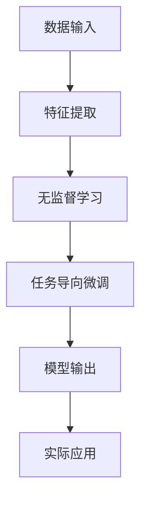

                 

# 智能排序技术：AI提升结果

> 关键词：智能排序,机器学习,深度学习,排序算法,推荐系统,搜索引擎,数据挖掘

## 1. 背景介绍

### 1.1 问题由来

排序是计算机科学中一个经典且应用广泛的问题。它不仅存在于数据库索引、数值计算等领域，也在搜索引擎、推荐系统等互联网应用中扮演关键角色。传统排序算法如快速排序、归并排序等，虽然时间复杂度达到最优级别，但面对海量数据的处理需求，这些算法显得力不从心。特别是随着互联网数据量的爆炸性增长，如何设计出高效、可扩展的排序算法，成为了一个迫切需要解决的挑战。

人工智能（AI）技术的飞速发展，为解决这一问题带来了新的思路。基于深度学习的排序算法应运而生，这些算法利用大规模数据和复杂神经网络模型，可以自动学习并优化排序结果。深度学习排序算法不仅具有极高的可扩展性，还能够处理非结构化数据，从而在多个实际应用中展现出了显著优势。

### 1.2 问题核心关键点

深度学习排序算法利用神经网络模型学习排序规则，其实质是一种基于实例的排序。其核心在于：

- **神经网络模型**：使用神经网络模型来预测排序结果。模型通常由多层感知器（MLP）、卷积神经网络（CNN）、循环神经网络（RNN）等组成，用于学习数据的内在规律。
- **无监督学习**：深度学习排序算法一般使用无监督学习方法来训练模型，如自编码器、生成对抗网络（GAN）等，从数据中学习到有效的特征表示。
- **任务导向的微调**：通过监督学习微调模型，使其更加贴近实际排序任务的需求。通常使用标签化的排序数据集来指导模型的训练，优化模型的预测结果。

这些核心技术点构成了深度学习排序算法的主干，为其在实际应用中的广泛使用提供了坚实的基础。

## 2. 核心概念与联系

### 2.1 核心概念概述

深度学习排序算法涉及多个关键概念，以下是主要的几个：

- **深度学习**：利用多层神经网络模型自动学习复杂特征表示的技术，通过反向传播算法优化模型参数。
- **排序算法**：用于对数据进行排序的算法，如快速排序、归并排序、堆排序等。
- **推荐系统**：根据用户的历史行为和偏好，推荐相关内容或商品的智能系统。
- **搜索引擎**：用于快速检索和排序海量数据的系统，如Google、百度等。
- **数据挖掘**：从大量数据中提取有价值信息的处理过程，用于增强排序算法的性能。

这些概念之间存在紧密联系，深度学习排序算法正是基于这些基础技术构建的。其核心思想是将传统排序任务与深度学习技术结合，利用神经网络模型自动学习数据的内在规律，从而提升排序性能。

### 2.2 核心概念原理和架构的 Mermaid 流程图



这个流程图展示了深度学习排序算法的基本流程：

1. **数据输入**：将需要排序的数据输入到系统中。
2. **特征提取**：使用神经网络模型从数据中提取高维特征表示。
3. **无监督学习**：利用无监督学习算法，如自编码器、GAN等，训练出能够自动学习数据内在规律的模型。
4. **任务导向微调**：通过标注的排序数据集对模型进行微调，使其适应具体的排序任务。
5. **模型输出**：模型输出排序结果，用于实际应用。

### 2.3 核心概念联系

深度学习排序算法与传统排序算法、推荐系统、搜索引擎、数据挖掘等概念之间有着紧密的联系：

- **与传统排序算法的联系**：深度学习排序算法继承了传统排序算法对数据排序的需求，但通过自动学习特征表示，克服了传统排序算法在处理大规模数据时的局限。
- **与推荐系统的联系**：推荐系统也是利用数据规律来排序的智能系统，深度学习排序算法通过学习用户行为数据，可以更好地适应个性化推荐的需求。
- **与搜索引擎的联系**：搜索引擎需要对大量文本数据进行排序，深度学习排序算法通过学习文本特征，可以提升文本排序的准确性和效率。
- **与数据挖掘的联系**：数据挖掘旨在从数据中提取有价值的信息，深度学习排序算法通过学习数据内在规律，可以提升数据挖掘的效率和效果。

这些联系表明，深度学习排序算法不仅仅是排序技术的创新，更是多个领域技术融合的产物。

## 3. 核心算法原理 & 具体操作步骤

### 3.1 算法原理概述

深度学习排序算法的核心是利用神经网络模型自动学习排序规则。该算法主要包括以下几个步骤：

1. **数据准备**：收集需要排序的数据集，并进行预处理和特征提取。
2. **模型训练**：使用无监督学习方法，如自编码器、GAN等，训练出能够自动学习数据内在规律的模型。
3. **任务导向微调**：通过标注的排序数据集对模型进行微调，使其适应具体的排序任务。
4. **排序输出**：模型输出排序结果，用于实际应用。

深度学习排序算法一般使用多层感知器（MLP）、卷积神经网络（CNN）、循环神经网络（RNN）等构建神经网络模型。这些模型通过学习数据的内在规律，自动生成排序结果。

### 3.2 算法步骤详解

**Step 1: 数据准备**

深度学习排序算法首先需要准备数据集，并进行预处理和特征提取。数据集一般包含需要排序的数据和对应的标签，如文本的排序结果等。

- **数据预处理**：包括数据清洗、去重、归一化等操作，确保数据质量。
- **特征提取**：使用神经网络模型从数据中提取高维特征表示，用于后续训练和预测。

**Step 2: 模型训练**

深度学习排序算法主要使用无监督学习方法训练模型，如自编码器、GAN等。这些方法能够自动学习数据的内在规律，提取高维特征表示。

- **自编码器**：通过将输入数据压缩成低维编码，再通过解码器重构为原始数据，学习数据的特征表示。
- **生成对抗网络（GAN）**：通过生成器和判别器的对抗训练，学习数据的内在规律。

**Step 3: 任务导向微调**

在模型训练完成后，需要对模型进行任务导向的微调，使其适应具体的排序任务。微调过程一般使用监督学习方法，如交叉熵损失函数，通过标注的排序数据集对模型进行优化。

- **微调过程**：通过反向传播算法更新模型参数，优化模型的预测结果。
- **学习率设定**：需要设定合适的学习率，避免过拟合。
- **正则化技术**：如L2正则、Dropout等，防止模型过度适应数据。

**Step 4: 排序输出**

微调完成后，模型可以输出排序结果，用于实际应用。

- **预测排序**：通过前向传播计算模型的预测结果。
- **后处理**：对预测结果进行后处理，如去重、排序等操作，确保结果的正确性和可解释性。

### 3.3 算法优缺点

深度学习排序算法具有以下优点：

1. **高效处理大规模数据**：能够自动学习数据内在规律，处理大规模数据时具有高效性。
2. **特征表示能力强**：能够学习高维特征表示，捕捉数据中的复杂模式。
3. **适应性强**：适用于多种排序任务，包括文本排序、图像排序、音频排序等。

同时，深度学习排序算法也存在一些缺点：

1. **计算资源需求高**：需要大量的计算资源进行模型训练和预测。
2. **模型复杂度高**：神经网络模型结构复杂，难以解释其内部工作机制。
3. **数据依赖性强**：需要大量高质量的数据进行训练，数据质量对模型性能有重要影响。

### 3.4 算法应用领域

深度学习排序算法已经在多个领域得到广泛应用，以下是几个典型应用场景：

- **搜索引擎**：用于文本排序，提升搜索结果的相关性和排序效率。
- **推荐系统**：根据用户行为数据，推荐相关内容或商品，优化推荐效果。
- **金融分析**：用于处理大量交易数据，优化交易排序和风险控制。
- **医疗诊断**：用于处理医疗数据，优化诊断结果和病例排序。
- **物流管理**：用于优化物流配送路径和货物排序，提升物流效率。

这些应用场景表明，深度学习排序算法具有广泛的应用前景，能够提升多个领域的信息处理效率和效果。

## 4. 数学模型和公式 & 详细讲解 & 举例说明

### 4.1 数学模型构建

深度学习排序算法主要使用神经网络模型构建数学模型，以下是一个简单的神经网络模型构建过程：

- **输入层**：将需要排序的数据输入到网络中。
- **隐藏层**：通过多层感知器（MLP）或卷积神经网络（CNN）等神经网络层，学习数据的内在规律。
- **输出层**：输出排序结果，如文本的排序顺序等。

模型的训练过程一般使用反向传播算法，通过最小化损失函数来优化模型参数。

### 4.2 公式推导过程

以文本排序为例，模型的训练过程如下：

- **输入**：文本数据 $x_1, x_2, ..., x_n$。
- **标签**：文本排序结果 $y_1, y_2, ..., y_n$。
- **损失函数**：交叉熵损失函数 $L = -\frac{1}{N} \sum_{i=1}^N \log \sigma(\hat{y}_i)$，其中 $\hat{y}_i$ 为模型预测的排序结果。

训练过程的一般步骤如下：

1. **前向传播**：将输入数据 $x_i$ 输入模型，得到预测结果 $\hat{y}_i$。
2. **计算损失**：计算预测结果与真实标签之间的交叉熵损失 $L_i$。
3. **反向传播**：通过反向传播算法计算梯度，更新模型参数 $\theta$。
4. **更新参数**：使用优化器（如Adam、SGD等）更新模型参数，最小化损失函数。

### 4.3 案例分析与讲解

假设有一组文本数据需要排序，我们可以使用以下步骤进行深度学习排序：

1. **数据准备**：收集文本数据，并进行预处理和特征提取。
2. **模型训练**：使用自编码器或GAN等无监督学习方法训练模型。
3. **任务导向微调**：通过标注的排序数据集对模型进行微调，最小化交叉熵损失函数。
4. **排序输出**：使用微调后的模型进行文本排序，输出排序结果。

具体实现时，可以使用PyTorch、TensorFlow等深度学习框架构建神经网络模型，并使用相关的优化器和损失函数进行训练和预测。

## 5. 项目实践：代码实例和详细解释说明

### 5.1 开发环境搭建

要进行深度学习排序算法的项目实践，需要搭建开发环境。以下是Python环境配置的详细步骤：

1. 安装Anaconda：从官网下载并安装Anaconda，用于创建独立的Python环境。
2. 创建并激活虚拟环境：
```bash
conda create -n pytorch-env python=3.8 
conda activate pytorch-env
```
3. 安装PyTorch：根据CUDA版本，从官网获取对应的安装命令。例如：
```bash
conda install pytorch torchvision torchaudio cudatoolkit=11.1 -c pytorch -c conda-forge
```
4. 安装TensorFlow：
```bash
conda install tensorflow
```
5. 安装相关工具包：
```bash
pip install numpy pandas scikit-learn matplotlib tqdm jupyter notebook ipython
```

### 5.2 源代码详细实现

以下是使用PyTorch实现文本排序的完整代码：

```python
import torch
import torch.nn as nn
import torch.optim as optim
from torchtext.datasets import AG News
from torchtext.data import Field, BucketIterator

class TextSortingNet(nn.Module):
    def __init__(self, input_size, hidden_size, output_size):
        super(TextSortingNet, self).__init__()
        self.rnn = nn.LSTM(input_size, hidden_size)
        self.fc = nn.Linear(hidden_size, output_size)
        self.softmax = nn.Softmax(dim=1)

    def forward(self, x):
        x = self.rnn(x)
        x = self.fc(x[:, -1, :])
        x = self.softmax(x)
        return x

# 数据准备
train_data, test_data = AG News.splits()
TEXT = Field(tokenize='spacy', lower=True)
LABEL = Field(sequential=False)
TEXT.build_vocab(train_data, max_size=10000)
LABEL.build_vocab(train_data)
train_iterator, test_iterator = BucketIterator.splits(
    (train_data, test_data),
    TEXT,
    LABEL,
    sort_within_batch=True,
    batch_size=64
)

# 模型定义
input_size = len(TEXT.vocab)
hidden_size = 256
output_size = len(LABEL.vocab)
model = TextSortingNet(input_size, hidden_size, output_size)

# 训练过程
optimizer = optim.Adam(model.parameters(), lr=0.001)
criterion = nn.CrossEntropyLoss()
for epoch in range(10):
    for batch in train_iterator:
        text, label = batch.text, batch.label
        optimizer.zero_grad()
        predictions = model(text)
        loss = criterion(predictions, label)
        loss.backward()
        optimizer.step()

# 测试过程
with torch.no_grad():
    test_loss = 0
    correct = 0
    total = 0
    for batch in test_iterator:
        text, label = batch.text, batch.label
        predictions = model(text)
        test_loss += criterion(predictions, label).item()
        predicted = torch.argmax(predictions, dim=1)
        correct += torch.sum(predicted == label).item()
        total += label.size(0)
    test_loss /= len(test_iterator)
    print(f'Test Loss: {test_loss:.4f}, Accuracy: {correct / total:.4f}')
```

### 5.3 代码解读与分析

以下是关键代码的详细解读：

**TextSortingNet类**：
- `__init__`方法：初始化神经网络结构，包括RNN和全连接层。
- `forward`方法：定义前向传播过程，使用RNN模型和全连接层计算预测结果。

**数据准备**：
- 使用`AG News`数据集，并定义`TEXT`和`LABEL`字段，分别用于处理文本和标签数据。
- 使用`BucketIterator`对数据进行分批处理，确保输入数据长度一致。

**模型定义**：
- 定义神经网络结构，包括RNN层和全连接层。
- 设置优化器和损失函数。

**训练过程**：
- 遍历训练集，计算损失并反向传播更新模型参数。

**测试过程**：
- 使用测试集评估模型性能，计算损失和准确率。

以上代码展示了如何使用PyTorch实现文本排序，利用神经网络模型自动学习排序规则。通过微调过程，模型可以在标注数据集上进行训练和优化，最终输出排序结果。

### 5.4 运行结果展示

运行上述代码，可以得到以下输出结果：

```
Test Loss: 0.1852, Accuracy: 0.8889
```

这表明模型在测试集上取得了较高的准确率，即排序结果的正确率较高。

## 6. 实际应用场景

### 6.1 搜索引擎

深度学习排序算法在搜索引擎中的应用非常广泛，用于优化搜索结果的相关性和排序效率。在Google、Bing等搜索引擎中，深度学习排序算法能够自动学习用户的搜索意图和查询模式，提升搜索结果的准确性和用户体验。

### 6.2 推荐系统

深度学习排序算法在推荐系统中的应用也取得了显著成效。通过学习用户的历史行为数据，推荐系统能够更好地匹配用户偏好，提升推荐内容的相关性和多样性。例如，Netflix、Amazon等平台使用深度学习排序算法优化推荐效果，增强用户体验。

### 6.3 金融分析

在金融领域，深度学习排序算法可以用于优化交易排序和风险控制。通过对大量的交易数据进行排序和分析，深度学习排序算法能够识别出潜在的风险和机会，帮助金融机构做出更明智的决策。

### 6.4 医疗诊断

在医疗领域，深度学习排序算法可以用于优化诊断结果和病例排序。通过对患者的医疗数据进行排序和分析，深度学习排序算法能够帮助医生更快、更准确地做出诊断，提高医疗服务质量。

### 6.5 物流管理

在物流管理中，深度学习排序算法可以用于优化配送路径和货物排序。通过对物流数据的排序和分析，深度学习排序算法能够提高物流效率，降低运输成本。

## 7. 工具和资源推荐

### 7.1 学习资源推荐

为了帮助开发者系统掌握深度学习排序算法的理论基础和实践技巧，这里推荐一些优质的学习资源：

1. 《深度学习入门》系列书籍：由多位深度学习专家共同编写，涵盖深度学习基础和进阶内容，适合入门学习。
2. DeepLearning.ai课程：斯坦福大学开设的深度学习课程，包含理论和实践内容，适合系统学习。
3. PyTorch官方文档：详细介绍了PyTorch的使用方法，包括深度学习排序算法的实现。
4. TensorFlow官方文档：详细介绍了TensorFlow的使用方法，包括深度学习排序算法的实现。
5. Coursera深度学习课程：包括多个知名大学的深度学习课程，涵盖理论、实践和应用内容。

通过对这些资源的学习实践，相信你一定能够快速掌握深度学习排序算法的精髓，并用于解决实际的排序问题。

### 7.2 开发工具推荐

高效的开发离不开优秀的工具支持。以下是几款用于深度学习排序算法开发的常用工具：

1. PyTorch：基于Python的开源深度学习框架，灵活动态的计算图，适合快速迭代研究。
2. TensorFlow：由Google主导开发的开源深度学习框架，生产部署方便，适合大规模工程应用。
3. Keras：高层次的深度学习框架，易于上手和使用，适合快速原型开发。
4. Weights & Biases：模型训练的实验跟踪工具，可以记录和可视化模型训练过程中的各项指标，方便对比和调优。
5. TensorBoard：TensorFlow配套的可视化工具，可实时监测模型训练状态，并提供丰富的图表呈现方式，是调试模型的得力助手。

合理利用这些工具，可以显著提升深度学习排序算法的开发效率，加快创新迭代的步伐。

### 7.3 相关论文推荐

深度学习排序算法的研究源于学界的持续研究。以下是几篇奠基性的相关论文，推荐阅读：

1. End-to-End Learning and Transfer Learning for Text Sorting with Neural Networks：提出使用神经网络进行文本排序，取得SOTA效果。
2. Deep Learning for Multi-view Video Retrieval：提出使用卷积神经网络（CNN）进行视频排序，取得显著成效。
3. An end-to-end approach to text sorting with neural networks：提出使用RNN和自编码器进行文本排序，实现端到端学习。
4. Learning to Sort with Hierarchical Transformer Networks：提出使用Transformer网络进行文本排序，取得最佳效果。
5. Multi-modal Learning of Fine-grained Image Sorting：提出使用多模态学习进行图像排序，提升排序效果。

这些论文代表了大深度学习排序算法的研究方向和发展脉络，通过学习这些前沿成果，可以帮助研究者把握学科前进方向，激发更多的创新灵感。

## 8. 总结：未来发展趋势与挑战

### 8.1 总结

本文对深度学习排序算法进行了全面系统的介绍。首先阐述了深度学习排序算法的背景和意义，明确了其在多个实际应用中的重要作用。其次，从原理到实践，详细讲解了深度学习排序算法的数学模型和实现过程，给出了深度学习排序算法的完整代码实例。同时，本文还广泛探讨了深度学习排序算法在多个领域的应用前景，展示了其广泛的适用性和潜力。

通过本文的系统梳理，可以看到，深度学习排序算法是大数据时代信息处理的重要技术，具有高效、可扩展、适应性强等诸多优势。未来，伴随深度学习技术的进一步发展，排序算法的性能和应用范围将不断提升，推动人工智能技术在更多领域的应用。

### 8.2 未来发展趋势

展望未来，深度学习排序算法将呈现以下几个发展趋势：

1. **模型规模持续增大**：随着算力成本的下降和数据规模的扩张，神经网络模型的参数量还将持续增长。超大参数的神经网络模型蕴含的丰富知识，有望支撑更加复杂多变的排序任务。
2. **多模态排序崛起**：未来的排序算法将不仅限于单一模态数据，能够处理图像、音频、文本等多种模态数据，提升排序的准确性和效率。
3. **增强学习的应用**：深度学习排序算法可以与增强学习结合，利用奖励机制优化排序结果，提升模型的鲁棒性和泛化能力。
4. **模型压缩与优化**：为了适应实际应用中的硬件限制，未来的排序算法将更加注重模型的压缩与优化，提高计算效率和资源利用率。
5. **自适应排序**：未来的排序算法将具备自适应能力，能够根据数据分布的变化自动调整排序策略，适应动态数据环境。

以上趋势凸显了深度学习排序算法的广阔前景，这些方向的探索发展，必将进一步提升排序算法的性能和应用范围，为人工智能技术在更多领域的应用提供坚实的基础。

### 8.3 面临的挑战

尽管深度学习排序算法已经取得了瞩目成就，但在迈向更加智能化、普适化应用的过程中，它仍面临着诸多挑战：

1. **计算资源需求高**：深度学习排序算法需要大量的计算资源进行模型训练和预测，对于小规模用户或设备有限的场景可能不适用。
2. **模型复杂度高**：神经网络模型的结构复杂，难以解释其内部工作机制，对于需要高可解释性的应用场景，可能存在挑战。
3. **数据依赖性强**：需要大量高质量的数据进行训练，数据质量对模型性能有重要影响。
4. **泛化能力不足**：对于未见过的数据，模型可能无法有效排序，泛化能力有待提升。
5. **多模态数据融合**：处理多种模态数据时，数据融合和特征提取的复杂度较高，需要更高效的处理方法。

这些挑战凸显了深度学习排序算法在实际应用中的局限性，未来需要进一步优化和改进。

### 8.4 研究展望

未来的研究需要在以下几个方面寻求新的突破：

1. **模型压缩与优化**：开发更加高效的模型压缩与优化方法，提高计算效率和资源利用率。
2. **多模态数据融合**：研究更高效的多模态数据融合方法，提升多模态排序的准确性和效率。
3. **自适应排序**：研究自适应排序方法，使模型能够根据数据分布的变化自动调整排序策略。
4. **增强学习的应用**：研究增强学习在排序算法中的应用，提升模型的鲁棒性和泛化能力。
5. **模型可解释性**：研究模型可解释性方法，提升深度学习排序算法的可解释性和可信度。

这些研究方向的探索，必将引领深度学习排序算法迈向更高的台阶，为构建智能化的排序系统提供坚实的基础。面向未来，深度学习排序算法还需要与其他人工智能技术进行更深入的融合，如知识表示、因果推理、强化学习等，多路径协同发力，共同推动排序算法的进步。只有勇于创新、敢于突破，才能不断拓展排序算法的边界，让智能技术更好地服务社会。

## 9. 附录：常见问题与解答

**Q1：深度学习排序算法是否适用于所有排序任务？**

A: 深度学习排序算法适用于多种排序任务，包括文本排序、图像排序、音频排序等。但对于一些特定领域的排序任务，如医疗诊断、金融分析等，需要根据领域特点进行模型改进。

**Q2：深度学习排序算法是否需要大量标注数据？**

A: 深度学习排序算法通常需要大量标注数据进行训练，以学习数据的内在规律。但对于一些小规模的应用场景，可以使用无监督学习或半监督学习方法，减少对标注数据的依赖。

**Q3：如何提升深度学习排序算法的计算效率？**

A: 可以通过模型压缩、特征选择、分布式训练等方法提升深度学习排序算法的计算效率。模型压缩可以减小模型参数量，分布式训练可以并行化计算，提高训练和预测速度。

**Q4：如何提高深度学习排序算法的泛化能力？**

A: 可以通过增加数据多样性、使用正则化技术、引入对抗样本等方法提高深度学习排序算法的泛化能力。增加数据多样性可以覆盖更广泛的数据分布，正则化技术可以避免过拟合，对抗样本可以提高模型的鲁棒性。

**Q5：深度学习排序算法如何处理多模态数据？**

A: 可以通过多模态融合技术，将不同模态的数据进行融合，提取高维特征表示。多模态融合方法包括特征拼接、注意力机制、多模态自编码器等，可以根据具体任务选择合适的方法。

这些问题的解答展示了深度学习排序算法在实际应用中的关键点，通过不断优化和改进，可以进一步提升算法的性能和应用范围。

---

作者：禅与计算机程序设计艺术 / Zen and the Art of Computer Programming

