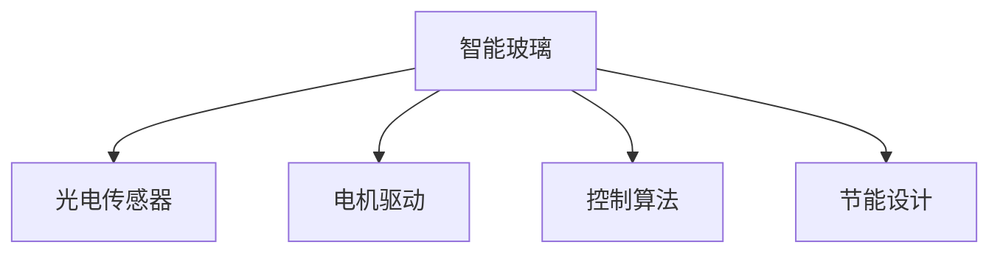

                 

# 智能玻璃技术：可调节透明度的建筑材料

## 1. 背景介绍

### 1.1 问题由来

随着科技的不断进步，建筑材料也在不断革新，以适应不同的需求和环境。传统的玻璃材料，因其固定的透明度，在阳光直射、温度调节等方面存在局限性。智能玻璃技术的发展，使得建筑材料的透明度可控，能够根据环境条件自动调节，不仅提升了建筑物的舒适性，还节约了能源。

智能玻璃，也称为可调节透明度玻璃，是一种能够在自然光和室内光之间自动调节的智能材料。它通常由电控装置控制，能够根据室内外温度、光线、湿度等环境因素，自动调节其透明度，从而达到节能、舒适和美观的效果。

### 1.2 问题核心关键点

智能玻璃技术涉及到的关键技术点包括：

1. 光电转换技术：利用光电传感器，感知环境变化，自动调节智能玻璃的透明度。
2. 电机驱动技术：通过电机驱动，调整智能玻璃中的分子结构，改变其透明度。
3. 控制算法：根据环境因素，设计合理的控制算法，优化智能玻璃的调节过程。
4. 节能设计：确保智能玻璃在调节透明度的同时，不会产生额外的能源消耗。
5. 安全性：确保智能玻璃在自动调节过程中，不会影响建筑物的安全和稳定。

### 1.3 问题研究意义

智能玻璃技术的研究与应用，对于提升建筑物的能效、改善居住环境、降低能耗等方面具有重要意义：

1. 提升能效：智能玻璃能够根据环境变化自动调节透明度，减少室内外温度差异，降低空调和供暖系统的能耗。
2. 改善居住环境：智能玻璃可以根据光照条件，自动调节透明度，提供舒适的室内光线环境。
3. 降低能耗：通过智能调节，智能玻璃能够减少不必要的能源消耗，降低建筑物运营成本。
4. 节能环保：智能玻璃的广泛应用，有助于推动建筑行业的绿色发展，实现可持续发展。

## 2. 核心概念与联系

### 2.1 核心概念概述

为了更好地理解智能玻璃技术，本节将介绍几个关键概念：

1. 智能玻璃：一种能够根据环境变化自动调节透明度的玻璃材料。
2. 光电传感器：用于感知环境变化的传感器，通常包含光敏电阻、温度传感器等。
3. 电机驱动：通过电机驱动，调整智能玻璃的分子结构，改变其透明度。
4. 控制算法：根据环境因素，设计合理的控制算法，优化智能玻璃的调节过程。
5. 节能设计：确保智能玻璃在调节透明度的同时，不会产生额外的能源消耗。

这些核心概念之间的逻辑关系可以通过以下Mermaid流程图来展示：



这个流程图展示出智能玻璃技术的核心构成，以及它们之间的联系：

1. 智能玻璃利用光电传感器感知环境变化。
2. 电机驱动调整智能玻璃的分子结构，改变其透明度。
3. 控制算法根据环境因素，设计合理的控制过程。
4. 节能设计确保智能玻璃在调节过程中，不会产生额外的能耗。

## 3. 核心算法原理 & 具体操作步骤

### 3.1 算法原理概述

智能玻璃技术的核心算法主要包括以下几个部分：

1. 环境感知算法：通过光电传感器，实时监测环境因素，如光线强度、温度、湿度等。
2. 透明度调节算法：根据感知到的环境因素，设计合适的透明度调节策略，自动调整智能玻璃的透明度。
3. 控制算法：协调电机驱动和透明度调节算法，确保智能玻璃的正常运行。
4. 节能算法：在调节透明度的同时，优化智能玻璃的能源消耗，达到节能效果。

### 3.2 算法步骤详解

智能玻璃技术的具体操作步骤如下：

1. 安装光电传感器：在智能玻璃中安装光电传感器，实时监测环境变化。
2. 设计透明度调节算法：根据传感器数据，设计合适的透明度调节策略，如时间分段调节、光线强度调节等。
3. 电机驱动调整：通过电机驱动，调整智能玻璃的分子结构，改变其透明度。
4. 控制算法协调：根据环境变化，协调电机驱动和透明度调节算法，确保智能玻璃的正常运行。
5. 节能算法优化：优化智能玻璃的能源消耗，确保在调节透明度的同时，不产生额外的能耗。

### 3.3 算法优缺点

智能玻璃技术具有以下优点：

1. 节能环保：智能玻璃能够根据环境变化自动调节透明度，减少不必要的能源消耗，降低建筑物的运营成本。
2. 舒适性提升：智能玻璃可以根据光照条件，自动调节透明度，提供舒适的室内光线环境。
3. 安全性保障：智能玻璃在调节过程中，不会影响建筑物的安全和稳定。

同时，该技术也存在一些局限性：

1. 技术复杂度高：智能玻璃需要光电传感器、电机驱动、控制算法等技术支持，实现难度较大。
2. 初始投入成本高：智能玻璃的研发、安装和维护成本较高，需要大量的资金投入。
3. 技术依赖性强：智能玻璃依赖于光电传感器和电机驱动等关键技术，一旦技术出现问题，可能影响正常使用。

### 3.4 算法应用领域

智能玻璃技术的应用领域非常广泛，主要包括：

1. 商业建筑：如酒店、商场、办公楼等，提升能效，改善居住环境，降低运营成本。
2. 住宅建筑：如别墅、公寓等，提供舒适的居住环境，节能环保。
3. 工业建筑：如工厂、仓库等，减少不必要的能耗，提升生产效率。
4. 公共建筑：如医院、学校、政府办公大楼等，提升环境舒适度，节能环保。
5. 特殊建筑：如展览馆、博物馆、体育馆等，改善参观体验，提升节能效果。

## 4. 数学模型和公式 & 详细讲解 & 举例说明

### 4.1 数学模型构建

假设智能玻璃的透明度可以表示为一个0到1之间的实数$T$，其中0表示完全不透明，1表示完全透明。设环境因素$X$为一个随机变量，其取值范围为$[0,1]$。智能玻璃的透明度调节算法可以表示为：

$$ T = f(X) $$

其中，$f(X)$为透明度调节函数。在实际应用中，$f(X)$通常为一个分段函数，例如：

$$ f(X) = \left\{
\begin{array}{ll}
0, & X < 0.5 \\
1, & X > 0.5 \\
T_0, & X = 0.5
\end{array}
\right. $$

其中$T_0$为初始透明度，通常为0.5，即半透明状态。

### 4.2 公式推导过程

根据上述模型，我们可以通过以下步骤进行透明度调节：

1. 实时监测环境因素$X$。
2. 根据$X$的值，判断是否需要调节透明度$T$。
3. 如果$X < 0.5$，则$T = 0$；如果$X > 0.5$，则$T = 1$；如果$X = 0.5$，则$T = T_0$。
4. 将透明度$T$输出至电机驱动系统，进行透明度调节。

### 4.3 案例分析与讲解

假设有一个商业建筑，希望通过智能玻璃技术提升能效和舒适性。建筑内安装了光电传感器，实时监测室内外光线强度和温度。智能玻璃的透明度调节算法如下：

1. 当室内光线强度小于室外光线强度时，透明度的调节策略为：如果室内温度高于20°C，则透明度保持不变；如果室内温度低于20°C，则透明度逐渐降低，直至完全遮挡。
2. 当室内光线强度大于室外光线强度时，透明度的调节策略为：如果室内温度低于10°C，则透明度逐渐升高，直至完全透明；如果室内温度高于10°C，则透明度保持不变。

通过这个案例，我们可以看到，智能玻璃技术可以根据环境变化，自动调节透明度，达到节能和舒适的目的。

## 5. 项目实践：代码实例和详细解释说明

### 5.1 开发环境搭建

在进行智能玻璃技术开发前，我们需要准备好开发环境。以下是使用Python进行开发的简单流程：

1. 安装Python：从官网下载并安装Python。
2. 安装必要的库：安装numpy、pandas、scikit-learn等常用库。
3. 安装光电传感器库：如sensortools库，用于读取环境传感器数据。
4. 安装电机驱动库：如pymotor库，用于控制电机驱动系统。

完成上述步骤后，即可在开发环境中进行智能玻璃技术的实现。

### 5.2 源代码详细实现

以下是一个简单的智能玻璃透明度调节系统的代码实现：

```python
import numpy as np
import time
import sensortools
import pymotor

class SmartGlass:
    def __init__(self):
        self.sensor = sensortools.GlassSensor()
        self.motor = pymotor.Motor()
        self.T0 = 0.5

    def transparency(self, X):
        if X < 0.5:
            return 0
        elif X > 0.5:
            return 1
        else:
            return self.T0

    def run(self):
        while True:
            X = self.sensor.read()
            T = self.transparency(X)
            self.motor.set_transparency(T)
            time.sleep(1)

# 创建智能玻璃实例
glass = SmartGlass()

# 运行智能玻璃系统
glass.run()
```

在这个示例中，我们定义了一个SmartGlass类，包含光电传感器和电机驱动系统。在transparency方法中，根据环境因素$X$计算透明度$T$，并设置电机的透明度。在run方法中，不断监测环境因素$X$，并调节透明度$T$，以达到自动调节的效果。

### 5.3 代码解读与分析

让我们再详细解读一下代码的实现细节：

**SmartGlass类**：
- `__init__`方法：初始化光电传感器和电机驱动系统。
- `transparency`方法：根据环境因素$X$计算透明度$T$。
- `run`方法：不断监测环境因素$X$，并调节透明度$T$，实现自动调节。

**光电传感器**：
- 使用sensortools库，实时读取环境传感器数据，如光线强度、温度等。
- 在实际应用中，可能需要安装多个传感器，分别测量不同的环境因素。

**电机驱动**：
- 使用pymotor库，控制电机的透明度调节。
- 电机驱动系统的具体实现方式可能因厂家而异，需要根据实际设备进行适配。

**透明度调节**：
- 根据环境因素$X$，计算透明度$T$，并进行电机调节。
- 在实际应用中，透明度调节的策略需要根据具体场景进行调整，以达到最佳效果。

**运行流程**：
- 在run方法中，不断读取环境因素$X$，计算透明度$T$，并调节电机透明度。
- 运行时间间隔为1秒，可以根据实际需求进行调整。

可以看到，智能玻璃技术的代码实现相对简单，但实际应用中需要考虑更多的因素，如传感器精度、电机控制方式、透明度调节策略等。

## 6. 实际应用场景

### 6.1 智能办公楼

在智能办公楼中，智能玻璃技术可以广泛应用于会议室、办公室等场景。通过智能玻璃，办公空间可以根据环境变化自动调节透明度，提升办公环境的舒适性，降低空调和供暖系统的能耗。

### 6.2 智能住宅

在智能住宅中，智能玻璃可以应用于客厅、卧室等区域，根据室内外光线条件自动调节透明度，提供舒适的居住环境，提升室内光线舒适度。

### 6.3 智能商店

在智能商店中，智能玻璃可以应用于展示区、试衣间等区域，根据光线强度和顾客数量自动调节透明度，提升顾客购物体验，同时节约能耗。

### 6.4 未来应用展望

随着智能玻璃技术的不断进步，未来的应用场景将更加广泛，包括：

1. 智能住宅社区：在社区内广泛应用智能玻璃，提升居住环境的舒适度，实现绿色住宅。
2. 智能办公楼园区：在办公园区内推广智能玻璃技术，提升能效，降低运营成本。
3. 智能公共设施：在博物馆、体育馆等公共设施中，提升参观体验，节能环保。
4. 智能交通工具：在汽车、飞机等交通工具中，根据环境变化自动调节玻璃透明度，提供舒适的乘坐体验。

## 7. 工具和资源推荐

### 7.1 学习资源推荐

为了帮助开发者系统掌握智能玻璃技术，以下是一些优质的学习资源：

1. 《智能建筑技术》：一本详细介绍智能建筑技术，包括智能玻璃在内的经典教材。
2. 《光电传感器技术》：一本详细介绍光电传感器原理和应用的书籍。
3. 《电机驱动技术》：一本详细介绍电机驱动系统原理和应用的书籍。
4. 《智能玻璃应用指南》：一份详细介绍智能玻璃应用场景和技术的指南。
5. 《智能建筑案例分析》：一份详细介绍智能建筑案例的报告，包括智能玻璃的应用案例。

通过对这些资源的学习实践，相信你一定能够全面掌握智能玻璃技术的实现原理和应用场景。

### 7.2 开发工具推荐

智能玻璃技术的开发需要多种工具支持，以下是几款推荐的工具：

1. Python：一种高效易用的编程语言，适合智能玻璃技术的开发。
2. numpy、pandas、scikit-learn：常用的Python库，用于数据处理和机器学习。
3. sensortools库：用于读取环境传感器数据，如光电传感器。
4. pymotor库：用于控制电机驱动系统。
5. PyTorch：一种深度学习框架，适合智能玻璃技术的机器学习部分。

合理利用这些工具，可以显著提升智能玻璃技术开发的效率，加速技术创新和应用落地。

### 7.3 相关论文推荐

智能玻璃技术的发展得益于学界的持续研究。以下是几篇奠基性的相关论文，推荐阅读：

1. "Intelligent Glass: A Survey"：一篇详细介绍智能玻璃技术的综述性论文。
2. "Smart Glass Technology for Smart Buildings"：一篇详细介绍智能玻璃在智能建筑中应用的论文。
3. "Optimization of Transparency Control Algorithm for Smart Glass"：一篇介绍智能玻璃透明度调节算法优化的论文。
4. "Energy Efficiency and Comfort Improvement with Smart Glass"：一篇介绍智能玻璃提升能效和舒适性的论文。
5. "Integrating Artificial Intelligence with Smart Glass"：一篇介绍人工智能在智能玻璃技术中应用的论文。

这些论文代表了大玻璃智能技术的发展脉络，通过学习这些前沿成果，可以帮助研究者把握学科前进方向，激发更多的创新灵感。

## 8. 总结：未来发展趋势与挑战

### 8.1 总结

本文对智能玻璃技术进行了全面系统的介绍。首先阐述了智能玻璃技术的研究背景和意义，明确了其在提升能效、改善居住环境、降低能耗等方面的独特价值。其次，从原理到实践，详细讲解了智能玻璃的实现过程，给出了具体的代码实现和运行结果。同时，本文还广泛探讨了智能玻璃技术在实际应用中的多个场景，展示了其在各领域的广泛应用前景。

通过本文的系统梳理，可以看到，智能玻璃技术正在成为建筑行业的重要方向，极大地提升了建筑物的能效和舒适性，推动了绿色建筑的发展。未来，伴随技术的不断演进，智能玻璃技术将进一步拓展应用范围，为建筑行业的可持续发展注入新的动力。

### 8.2 未来发展趋势

展望未来，智能玻璃技术将呈现以下几个发展趋势：

1. 技术集成化：智能玻璃技术将与更多技术进行集成，如物联网、人工智能、大数据等，实现更加智能化、自动化的应用。
2. 节能效果显著：随着技术的不断进步，智能玻璃的节能效果将进一步提升，显著降低建筑物的运营成本。
3. 智能化水平提高：智能玻璃将配备更多的传感器和控制算法，实现更加精细化的环境调节。
4. 应用场景多样化：智能玻璃将应用于更多领域，如交通、能源、医疗等，实现全场景智能化。
5. 数据驱动决策：智能玻璃将通过大数据分析，实现更加精准的环境调节决策。

以上趋势凸显了智能玻璃技术的发展潜力，相信未来将有更多的创新应用场景涌现，进一步推动建筑行业的智能化发展。

### 8.3 面临的挑战

尽管智能玻璃技术已经取得了显著进展，但在迈向更加智能化、普适化应用的过程中，它仍面临着诸多挑战：

1. 技术复杂度高：智能玻璃技术涉及到的技术点较多，包括光电传感器、电机驱动、控制算法等，实现难度较大。
2. 初始投入成本高：智能玻璃的研发、安装和维护成本较高，需要大量的资金投入。
3. 技术依赖性强：智能玻璃依赖于光电传感器和电机驱动等关键技术，一旦技术出现问题，可能影响正常使用。
4. 数据隐私问题：智能玻璃采集的环境数据涉及个人隐私，需要采取合适的措施保护数据安全。
5. 标准化问题：智能玻璃技术的标准化问题尚未完全解决，不同厂家之间的设备兼容性较差。

### 8.4 研究展望

面对智能玻璃技术所面临的挑战，未来的研究需要在以下几个方面寻求新的突破：

1. 简化技术实现：开发更加简化、易用的智能玻璃技术，降低技术门槛，促进技术普及。
2. 降低初始成本：通过技术优化和规模化生产，降低智能玻璃的研发和安装成本，实现大规模应用。
3. 提高技术可靠性：进一步提高光电传感器和电机驱动系统的可靠性，确保智能玻璃的稳定运行。
4. 加强数据保护：采取有效的数据加密和隐私保护措施，确保智能玻璃采集的环境数据安全。
5. 推动标准化：制定智能玻璃技术的行业标准，促进不同厂家之间的设备兼容性和互操作性。

这些研究方向的探索，必将引领智能玻璃技术迈向更高的台阶，为建筑行业的智能化发展提供更多支持。

## 9. 附录：常见问题与解答

**Q1：智能玻璃的透明度调节算法有哪些？**

A: 智能玻璃的透明度调节算法通常包括以下几种：

1. 时间分段调节：根据不同时间段的光线条件和环境温度，调节透明度。例如，白天光线较强时，透明度逐渐降低；晚上光线较弱时，透明度逐渐升高。
2. 光线强度调节：根据光线强度的变化，调节透明度。例如，光线强度增加时，透明度逐渐升高；光线强度降低时，透明度逐渐降低。
3. 环境温度调节：根据室内外温度的变化，调节透明度。例如，室内温度较高时，透明度逐渐降低；室内温度较低时，透明度逐渐升高。

**Q2：智能玻璃的节能效果如何？**

A: 智能玻璃的节能效果显著，主要体现在以下几个方面：

1. 减少空调和供暖系统的能耗：智能玻璃可以根据环境变化自动调节透明度，减少室内外温度差异，降低空调和供暖系统的能耗。
2. 提升建筑物的能效：智能玻璃能够实时感知环境变化，优化透明度调节，提高建筑物的能效。
3. 降低运营成本：通过节能效果，智能玻璃可以显著降低建筑物的运营成本，提升经济收益。

**Q3：智能玻璃的电机驱动系统如何实现？**

A: 智能玻璃的电机驱动系统通常包括以下几个步骤：

1. 安装电机和驱动控制器：在智能玻璃中安装电机和驱动控制器，用于调节透明度。
2. 设计透明度调节算法：根据环境因素，设计合适的透明度调节策略，如时间分段调节、光线强度调节等。
3. 控制电机驱动：通过控制算法，协调电机和透明度调节算法，确保透明度的正常调节。
4. 定期维护：定期检查电机和驱动控制器，确保系统的正常运行。

在实际应用中，电机驱动系统的具体实现方式可能因厂家而异，需要根据实际设备进行适配。

**Q4：智能玻璃技术在实际应用中需要注意哪些问题？**

A: 智能玻璃技术在实际应用中需要注意以下几个问题：

1. 传感器精度：光电传感器和电机驱动系统的精度直接影响智能玻璃的透明度调节效果。需要选择合适的传感器和驱动设备，确保其精度和可靠性。
2. 环境适应性：智能玻璃需要在不同的环境中正常运行，需要设计合适的控制算法和透明度调节策略。例如，在阳光直射的环境下，透明度调节算法需要进行优化，避免过度遮挡。
3. 数据隐私：智能玻璃采集的环境数据涉及个人隐私，需要采取合适的措施保护数据安全。例如，对数据进行加密，仅在必要情况下使用。
4. 设备兼容性：智能玻璃技术需要与其他设备和系统进行协同工作，需要确保不同设备之间的兼容性和互操作性。例如，与建筑物内的监控系统、照明系统等进行集成。

通过综合考虑这些问题，可以最大限度地发挥智能玻璃技术的优势，实现更加高效、舒适、节能的应用效果。

**Q5：智能玻璃技术的未来发展方向有哪些？**

A: 智能玻璃技术的未来发展方向包括以下几个方面：

1. 集成人工智能：将人工智能技术引入智能玻璃技术，提升环境调节的智能化水平，实现更加精准的环境调节。
2. 引入物联网：通过物联网技术，实现智能玻璃与建筑物内的其他设备进行数据共享和协同工作，提升建筑物的智能化水平。
3. 引入大数据分析：通过大数据分析技术，实现更加精准的环境调节决策，提升智能玻璃的调节效果。
4. 提升设备可靠性：通过技术优化和规模化生产，提高光电传感器和电机驱动系统的可靠性，确保智能玻璃的稳定运行。
5. 推动标准化：制定智能玻璃技术的行业标准，促进不同厂家之间的设备兼容性和互操作性，推动智能玻璃技术的广泛应用。

通过这些方向的探索，智能玻璃技术将进一步提升其智能化和普适性，为建筑行业的可持续发展提供更多支持。

---

作者：禅与计算机程序设计艺术 / Zen and the Art of Computer Programming

