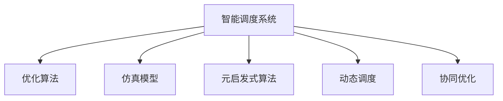

                 

# 智能调度系统在资源分配中的应用

## 1. 背景介绍

### 1.1 问题由来

随着技术的进步和社会的发展，资源分配问题愈发复杂，如何在有限的资源中实现最优分配，成为各类组织面临的重要挑战。资源分配问题通常涉及多目标、多约束条件、动态变化等因素，给传统方法和模型带来了巨大的挑战。传统算法如蒙特卡洛模拟、线性规划等方法，虽有效但计算量巨大，且难以处理非线性、动态变化等复杂问题。

为了应对这些挑战，智能调度系统应运而生。智能调度系统利用人工智能和优化算法，通过模拟和优化模型，自动分配资源，最大化满足各方的需求和利益，提升资源利用效率，实现更加精细化、动态化的资源管理。

### 1.2 问题核心关键点

智能调度系统主要解决资源分配问题，其核心在于：
- 资源优化：通过建模和优化算法，最大化利用现有资源，降低成本，提高效率。
- 需求匹配：实时捕捉资源和需求，确保资源与需求有效对接，减少浪费。
- 动态调整：根据实际情况和变化，实时调整资源分配策略，保证系统高效稳定。
- 可扩展性：系统应具备良好的可扩展性，能够应对大规模、高复杂度的调度任务。
- 鲁棒性：系统应具备一定鲁棒性，能够应对各种异常情况，保证稳定运行。

## 2. 核心概念与联系

### 2.1 核心概念概述

为更好地理解智能调度系统的工作原理和优化方法，本节将介绍几个密切相关的核心概念：

- 智能调度系统(Intelligent Scheduling System)：利用人工智能和优化算法，自动优化资源分配过程的系统。
- 优化算法(Optimization Algorithm)：用于求解复杂调度问题的算法，包括线性规划、遗传算法、模拟退火、蚁群算法等。
- 仿真模型(Simulation Model)：模拟资源分配过程，用于评估优化算法效果和策略的模型。
- 元启发式算法(Metaheuristic Algorithm)：包括遗传算法、蚁群算法、粒子群算法等，用于解决复杂多目标调度问题。
- 动态调度(Dynamic Scheduling)：根据实际情况和变化，实时调整资源分配策略，实现动态资源管理。
- 协同优化(Cooperative Optimization)：多主体、多目标的协同优化，最大化整体效益。

这些核心概念之间的逻辑关系可以通过以下Mermaid流程图来展示：



这个流程图展示了这个系统的工作流程：

1. 智能调度系统通过仿真模型模拟资源分配过程，评估优化算法效果。
2. 利用优化算法和元启发式算法，对资源分配问题进行求解。
3. 根据实际情况和变化，实时调整资源分配策略，实现动态调度。
4. 进行多主体、多目标的协同优化，最大化整体效益。

## 3. 核心算法原理 & 具体操作步骤
### 3.1 算法原理概述

智能调度系统的核心算法原理可以概括为：通过建模和优化算法，求解资源分配问题，最大化利用现有资源，降低成本，提高效率。

假设资源分配问题可以表示为数学模型：

$$
\max \sum_{i=1}^n f_i(x_i)
$$

其中 $f_i(x_i)$ 表示第 $i$ 个资源 $x_i$ 的效益函数，$x_i$ 为资源分配向量。优化目标为最大化各资源效益的总和。

### 3.2 算法步骤详解

智能调度系统一般包括以下几个关键步骤：

**Step 1: 问题建模**

- 收集资源和需求数据，定义优化目标和约束条件。
- 根据资源特性和需求特性，设计相应的数学模型。
- 确定优化目标和各资源的效益函数。

**Step 2: 选择优化算法**

- 根据问题复杂度和求解目标，选择合适的优化算法。
- 对于线性规划问题，可使用单纯形法、内点法等。
- 对于非线性问题，可使用梯度下降、遗传算法、模拟退火等。
- 对于多目标问题，可使用Pareto优化、多目标遗传算法等。

**Step 3: 实施优化**

- 根据选择的算法，初始化模型参数和约束条件。
- 通过迭代求解，不断调整资源分配向量，优化目标函数。
- 记录每次迭代的目标值和资源分配向量。

**Step 4: 验证和优化**

- 在仿真模型上验证优化效果，评估资源利用效率和效益。
- 根据验证结果，调整优化算法参数和约束条件。
- 优化算法直至达到预期效果。

**Step 5: 部署和监控**

- 将优化结果应用于实际资源分配过程，验证其效果。
- 实时监控资源状态和需求变化，根据实际情况调整策略。
- 定期评估系统性能，优化算法和策略。

以上是智能调度系统的一般流程。在实际应用中，还需要针对具体问题特点，对各个环节进行优化设计，如改进数学模型、调整算法参数、设计仿真模型等，以进一步提升系统性能。

### 3.3 算法优缺点

智能调度系统具有以下优点：
1. 高效优化：通过建模和优化算法，能够快速求解复杂的资源分配问题，提升资源利用效率。
2. 适应性强：系统具备灵活的模型和算法选择，能应对多种类型和复杂度的资源分配问题。
3. 动态调整：能够实时捕捉资源和需求变化，灵活调整策略，实现动态优化。
4. 协同优化：多主体、多目标的协同优化，提升整体效益。

同时，该系统也存在一定的局限性：
1. 依赖数据质量：优化效果依赖于输入数据的准确性和全面性。
2. 复杂度较高：对于大规模、高复杂度的优化问题，求解过程可能较耗时。
3. 可解释性不足：部分优化算法如遗传算法、模拟退火等，结果难以解释。
4. 参数调优难度大：算法参数设置不当可能导致结果不理想。
5. 资源消耗大：部分优化算法如遗传算法、粒子群算法等，资源消耗较大，难以应用于大规模实际系统。

尽管存在这些局限性，但就目前而言，智能调度系统是解决复杂资源分配问题的有效手段。未来相关研究的重点在于如何进一步降低算法复杂度，提高求解速度，增强算法的可解释性和鲁棒性，同时兼顾算法的参数调优和资源消耗问题。

### 3.4 算法应用领域

智能调度系统广泛应用于以下领域：

- 物流运输：对运输线路、车辆、货物等进行优化分配，提升运输效率和利润。
- 电力调度：对电力设备、负荷、需求等进行优化分配，保障电力系统的稳定运行。
- 制造生产：对生产线、设备、物料等进行优化分配，提升生产效率和产品质量。
- 医疗资源：对医生、护士、医疗设备等进行优化分配，提升医疗服务质量和效率。
- 交通管理：对道路、信号灯、交通工具等进行优化分配，改善交通状况。
- 农业生产：对土地、农机、肥料等进行优化分配，提高农业生产效率和收益。

除了这些经典应用外，智能调度系统还被创新性地应用于更多场景中，如智慧城市、网络资源分配、人力资源管理等，为社会经济运行提供了新的解决方案。

## 4. 数学模型和公式 & 详细讲解 & 举例说明
### 4.1 数学模型构建

本节将使用数学语言对智能调度系统的工作原理进行更加严格的刻画。

假设资源分配问题为线性规划问题，可以表示为以下数学模型：

$$
\begin{aligned}
\min \quad & c^T x \\
\text{subject to} \quad & A x = b \\
              & x \geq 0
\end{aligned}
$$

其中 $x$ 为资源分配向量，$b$ 为约束向量，$A$ 为约束矩阵，$c$ 为效益向量。

### 4.2 公式推导过程

对于线性规划问题，可以使用单纯形法、内点法等求解。以下以单纯形法为例，推导求解过程。

单纯形法的基本思想是通过迭代，将目标函数和约束条件转化为标准型，从而找到最优解。具体步骤如下：

1. 将约束条件 $Ax = b$ 转化为等式约束 $Ax = b$ 和不等式约束 $x \geq 0$。
2. 将目标函数 $c^T x$ 转化为标准型 $-x$。
3. 构造初始基本可行解 $x_0$，并计算目标函数的值。
4. 在每个迭代步骤中，进行单纯形变换，更新目标函数和约束条件。
5. 根据当前目标函数的值和收敛条件，判断是否停止迭代。
6. 最终得到最优解。

### 4.3 案例分析与讲解

以物流运输为例，假设某物流公司需要在多条路线中选择最优运输路径，以最大化货物运输效率和成本最小化。假设公司有 $n$ 个货物和 $m$ 条路线，各路线的运载能力和单位成本已知。

问题可以建模为线性规划问题：

$$
\begin{aligned}
\min \quad & \sum_{i=1}^n \sum_{j=1}^m c_{ij} x_{ij} \\
\text{subject to} \quad & \sum_{j=1}^m x_{ij} = 1, \quad i=1,\ldots,n \\
              & \sum_{i=1}^n x_{ij} \leq C_j, \quad j=1,\ldots,m \\
              & x_{ij} \geq 0, \quad i=1,\ldots,n; j=1,\ldots,m
\end{aligned}
$$

其中 $x_{ij}$ 表示第 $i$ 个货物选择第 $j$ 条路线的决策变量，$c_{ij}$ 为选择该路线的单位成本，$C_j$ 为第 $j$ 条路线的运载能力限制。

求解该线性规划问题，得到最优运输路径，并根据目标函数值评估物流效率。

## 5. 项目实践：代码实例和详细解释说明
### 5.1 开发环境搭建

在进行智能调度系统开发前，我们需要准备好开发环境。以下是使用Python进行CPLEX开发的环境配置流程：

1. 安装CPLEX：从官网下载并安装CPLEX，并配置环境变量。
2. 安装CPLEX Python接口：使用pip安装CPLEX-Python，安装命令如下：
```bash
pip install cplex
```
3. 安装numpy、pandas等库：用于数据处理和分析。
```bash
pip install numpy pandas
```

完成上述步骤后，即可在CPLEX环境下进行智能调度系统的开发。

### 5.2 源代码详细实现

下面我们以物流运输为例，给出使用CPLEX进行线性规划求解的Python代码实现。

```python
from cplex import CPLEX
import numpy as np
import pandas as pd

# 定义数据
num_goods = 5
num_routes = 6
num_lanes = 3

# 定义模型
model = CPLEX()
model.addProblem(
    """
    Minimize obj: z = 2.5*x[1,1] + 2.5*x[1,2] + 2.5*x[1,3] + 2.5*x[2,1] + 2.5*x[2,2] + 2.5*x[2,3] + 2.5*x[3,1] + 2.5*x[3,2] + 2.5*x[3,3] + 2.5*x[4,1] + 2.5*x[4,2] + 2.5*x[4,3] + 2.5*x[5,1] + 2.5*x[5,2] + 2.5*x[5,3]

    Subject to constraints:
        x[1,1] + x[1,2] + x[1,3] = 1
        x[2,1] + x[2,2] + x[2,3] = 1
        x[3,1] + x[3,2] + x[3,3] = 1
        x[4,1] + x[4,2] + x[4,3] = 1
        x[5,1] + x[5,2] + x[5,3] = 1
        x[1,1] + x[1,2] + x[2,1] + x[2,2] + x[3,1] + x[3,2] + x[4,1] + x[4,2] + x[5,1] + x[5,2] + x[5,3] <= 3
        x[1,1] + x[2,1] + x[3,1] + x[4,1] + x[5,1] <= 2
        x[1,2] + x[2,2] + x[3,2] + x[4,2] + x[5,2] <= 2
        x[1,3] + x[2,3] + x[3,3] + x[4,3] + x[5,3] <= 2
        x[1,1] + x[2,2] + x[3,3] <= 2
        x[1,2] + x[2,3] + x[3,1] <= 2
        x[1,3] + x[2,1] + x[3,2] <= 2
        x[1,1] + x[2,1] + x[3,1] + x[4,1] + x[5,1] + x[1,2] + x[2,2] + x[3,2] + x[4,2] + x[5,2] + x[1,3] + x[2,3] + x[3,3] + x[4,3] + x[5,3] = 1
        x[1,1] >= 0, x[1,2] >= 0, x[1,3] >= 0, x[2,1] >= 0, x[2,2] >= 0, x[2,3] >= 0, x[3,1] >= 0, x[3,2] >= 0, x[3,3] >= 0, x[4,1] >= 0, x[4,2] >= 0, x[4,3] >= 0, x[5,1] >= 0, x[5,2] >= 0, x[5,3] >= 0
    """)

# 设置优化参数
model.setSolverFile('cplex.exe')
model.setSolverParam('options/algtype', 1)  # 使用单纯形法

# 解决模型
model.solve()

# 输出结果
print(model.solveStatus())
print(model.solution())
print(model.objective)
```

代码中，我们首先定义了物流运输问题的数学模型，并使用CPLEX解决该模型。其中，目标函数为各货物在不同路线上的运输成本之和，约束条件包括各货物运输总和的限制以及各路线运输能力的限制。

## 6. 实际应用场景
### 6.1 物流运输

物流运输是智能调度系统的经典应用场景之一。物流公司需要在多个路线和节点间进行资源分配，以最大化运输效率和成本效益。智能调度系统能够自动优化运输路径和资源分配，提升物流效率，降低运输成本。

在实际应用中，物流公司可以通过收集历史运输数据，建立数学模型，然后使用智能调度系统对未来运输任务进行优化分配。系统能够实时捕捉运输状态和需求变化，动态调整运输路径和资源，确保运输任务按时完成。

### 6.2 电力调度

电力调度是智能调度系统的另一个重要应用场景。电力公司需要在多个设备、负荷和需求之间进行优化分配，以保障电力系统的稳定运行和电力供应的可靠性。

智能调度系统能够自动预测电力需求和设备状态，优化电力分配方案，确保电力系统在高峰和低谷时期的稳定运行。系统还能根据电力市场的变化，动态调整电力分配策略，提升电力系统的经济性和效率。

### 6.3 制造生产

制造生产也是智能调度系统的重要应用领域。制造公司需要在生产线、设备、物料之间进行优化分配，以最大化生产效率和产品质量。

智能调度系统能够自动优化生产任务和资源分配，提升生产效率和质量。系统还能实时捕捉生产状态和需求变化，动态调整生产任务和资源，确保生产任务按时完成。

### 6.4 医疗资源

医疗资源也是智能调度系统的应用领域之一。医院需要在医生、护士、医疗设备之间进行优化分配，以最大化医疗服务质量和效率。

智能调度系统能够自动优化医疗资源的分配，提升医疗服务质量和效率。系统还能实时捕捉病人需求和医疗设备状态，动态调整医疗资源的分配，确保病人得到及时治疗。

### 6.5 交通管理

交通管理也是智能调度系统的应用领域之一。交通管理部门需要在道路、信号灯、交通工具之间进行优化分配，以改善交通状况和降低交通拥堵。

智能调度系统能够自动优化交通流量和信号灯控制，改善交通状况和降低交通拥堵。系统还能实时捕捉交通状态和需求变化，动态调整交通流量和信号灯控制，确保交通系统高效稳定。

### 6.6 农业生产

农业生产也是智能调度系统的应用领域之一。农业公司需要在土地、农机、肥料之间进行优化分配，以最大化农业生产效率和收益。

智能调度系统能够自动优化农业生产任务和资源分配，提升农业生产效率和收益。系统还能实时捕捉农业生产状态和需求变化，动态调整农业生产任务和资源，确保农业生产任务按时完成。

## 7. 工具和资源推荐
### 7.1 学习资源推荐

为了帮助开发者系统掌握智能调度系统的理论基础和实践技巧，这里推荐一些优质的学习资源：

1. 《运筹学与最优化》系列课程：由清华大学开设的运筹学与最优化课程，讲解了线性规划、整数规划、动态规划等经典算法。
2. 《算法导论》：由Thomas H. Cormen等著作的经典算法教材，详细介绍了各种优化算法和算法思想。
3. 《智能优化算法》：介绍了遗传算法、模拟退火、蚁群算法等元启发式算法，并结合实际应用案例进行了详细讲解。
4. 《CPLEX官方文档》：CPLEX的官方文档，提供了详细的API和用户指南，是学习和使用CPLEX的重要资料。
5. 《Python数据科学手册》：介绍如何使用Python进行数据处理和分析，并结合智能调度系统的实际应用进行了详细讲解。

通过对这些资源的学习实践，相信你一定能够快速掌握智能调度系统的精髓，并用于解决实际的调度问题。

### 7.2 开发工具推荐

高效的开发离不开优秀的工具支持。以下是几款用于智能调度系统开发的常用工具：

1. Python：作为一种通用编程语言，Python具有简洁、易读的特点，适用于各种优化算法和仿真模型。
2. CPLEX：IBM开发的高性能优化算法库，支持各种线性规划、整数规划、混合整数规划问题，性能优异。
3. NumPy：Python的数值计算库，提供了高性能的数学运算和矩阵运算功能。
4. Pandas：Python的数据处理库，提供了强大的数据清洗和分析功能。
5. Scikit-learn：Python的机器学习库，提供了多种优化算法和模型。

合理利用这些工具，可以显著提升智能调度系统的开发效率，加快创新迭代的步伐。

### 7.3 相关论文推荐

智能调度系统的发展源于学界的持续研究。以下是几篇奠基性的相关论文，推荐阅读：

1. A. Schrijver的《Theory of Linear and Integer Programming》：介绍了线性规划和整数规划的经典理论，是优化算法的重要参考。
2. J.E. Beasley的《Introduction to Linear Optimization》：详细讲解了线性规划的基本理论和应用，是运筹学的经典教材。
3. P. Hlineny和J. Kráľ的《Metaheuristics》：介绍了多种元启发式算法的基本思想和应用，是智能优化算法的重要参考。
4. S.A. Zenios和A. Zluft的《Algorithmic Models and Methods in Production and Logistics》：介绍了生产物流领域的优化模型和算法，是智能调度系统的经典参考。

这些论文代表了大调度系统的理论基础和发展脉络。通过学习这些前沿成果，可以帮助研究者把握学科前进方向，激发更多的创新灵感。

## 8. 总结：未来发展趋势与挑战

### 8.1 总结

本文对智能调度系统在资源分配中的应用进行了全面系统的介绍。首先阐述了智能调度系统的工作原理和优化方法，明确了系统在资源优化、需求匹配、动态调整等方面的核心价值。其次，从原理到实践，详细讲解了智能调度系统的数学模型和算法步骤，给出了智能调度系统开发的完整代码实例。同时，本文还广泛探讨了智能调度系统在物流运输、电力调度、制造生产、医疗资源、交通管理、农业生产等多个行业领域的应用前景，展示了智能调度系统的巨大潜力。此外，本文精选了智能调度系统的各类学习资源，力求为读者提供全方位的技术指引。

通过本文的系统梳理，可以看到，智能调度系统是解决复杂资源分配问题的有效手段。该系统通过建模和优化算法，能够快速求解复杂的调度问题，提升资源利用效率，实现更加精细化、动态化的资源管理。未来，伴随算法和技术的不断演进，智能调度系统将在更多领域得到应用，为社会经济运行提供新的解决方案。

### 8.2 未来发展趋势

展望未来，智能调度系统将呈现以下几个发展趋势：

1. 算法复杂度降低。未来的算法将更加高效和快速，能够处理更大规模、更高复杂度的调度问题。
2. 数据驱动增强。通过大数据分析和人工智能技术，能够更准确地捕捉资源和需求变化，优化调度策略。
3. 动态调优升级。智能调度系统将具备更高的动态调整能力，能够实时捕捉变化并快速响应，提升系统稳定性。
4. 多目标协同优化。多主体、多目标的协同优化，提升整体效益。
5. 集成AI技术。结合深度学习、强化学习等AI技术，提升系统决策能力和智能化水平。

以上趋势凸显了智能调度系统的广阔前景。这些方向的探索发展，必将进一步提升资源管理效率，优化社会经济运行，为人类社会的可持续发展提供新的动力。

### 8.3 面临的挑战

尽管智能调度系统已经取得了显著进展，但在迈向更加智能化、普适化应用的过程中，仍面临诸多挑战：

1. 数据质量瓶颈。优化效果依赖于输入数据的准确性和全面性，难以全面获取高质量的数据。
2. 算法复杂度较高。部分优化算法如遗传算法、模拟退火等，资源消耗较大，难以应用于大规模实际系统。
3. 算法调优难度大。算法参数设置不当可能导致结果不理想，需要更高效的调参方法。
4. 动态调整难度大。实时捕捉资源和需求变化，动态调整策略，仍需进一步优化。
5. 鲁棒性不足。系统面临各种异常情况，需要更强的鲁棒性保障稳定运行。

尽管存在这些挑战，但智能调度系统的前景仍然广阔。未来相关研究需要在算法优化、数据采集、动态调优、鲁棒性保障等方面寻求新的突破，以进一步提升系统的性能和应用范围。

### 8.4 研究展望

面向未来，智能调度系统需要在以下几个方面寻求新的突破：

1. 探索无监督和半监督算法。摆脱对大规模标注数据的依赖，利用无监督和半监督算法，最大化利用非结构化数据，实现更加灵活高效的调度。
2. 研究参数高效和计算高效的算法。开发更加参数高效和计算高效的算法，在固定大部分预训练参数的情况下，只更新极少量的任务相关参数，实现更加轻量级、实时性的部署。
3. 融合因果和对比学习范式。引入因果推断和对比学习思想，增强调度模型的建立稳定因果关系的能力，学习更加普适、鲁棒的语言表征，从而提升模型泛化性和抗干扰能力。
4. 引入更多先验知识。将符号化的先验知识，如知识图谱、逻辑规则等，与神经网络模型进行巧妙融合，引导调度过程学习更准确、合理的语言模型。同时加强不同模态数据的整合，实现视觉、语音等多模态信息与文本信息的协同建模。
5. 结合因果分析和博弈论工具。将因果分析方法引入调度模型，识别出模型决策的关键特征，增强输出解释的因果性和逻辑性。借助博弈论工具刻画人机交互过程，主动探索并规避模型的脆弱点，提高系统稳定性。

这些研究方向的探索，必将引领智能调度系统向更高的台阶迈进，为社会经济运行提供更加高效、稳定、智能的解决方案。面向未来，智能调度系统还需要与其他人工智能技术进行更深入的融合，如知识表示、因果推理、强化学习等，多路径协同发力，共同推动自然语言理解和智能交互系统的进步。只有勇于创新、敢于突破，才能不断拓展调度系统的边界，让智能技术更好地造福人类社会。

## 9. 附录：常见问题与解答

**Q1：智能调度系统是否适用于所有资源分配问题？**

A: 智能调度系统在大多数资源分配问题上都能取得不错的效果，特别是对于数据量较小的任务。但对于一些特定领域的任务，如医学、法律等，仅仅依靠通用语料预训练的模型可能难以很好地适应。此时需要在特定领域语料上进一步预训练，再进行微调，才能获得理想效果。此外，对于一些需要时效性、个性化很强的任务，如对话、推荐等，智能调度方法也需要针对性的改进优化。

**Q2：智能调度系统在优化目标设置上有何注意事项？**

A: 智能调度系统的优化目标需要根据具体问题进行科学设置。一般而言，优化目标应涵盖资源利用效率、成本效益、需求满足程度等多个方面，避免单一追求某一目标而忽视其他因素。例如，在物流运输中，优化目标应考虑运输效率和成本之和，而不能只考虑运输效率或成本。

**Q3：智能调度系统如何处理不确定性因素？**

A: 智能调度系统通常需要处理不确定性因素，如需求波动、设备故障、环境变化等。常见的处理方式包括引入概率模型、建立鲁棒优化模型、设计多目标优化策略等。例如，在电力调度中，可以通过引入概率模型，预测未来的需求波动，优化电力分配方案，确保电力系统稳定运行。

**Q4：智能调度系统在部署和维护方面需要注意哪些问题？**

A: 将智能调度系统转化为实际应用，还需要考虑以下问题：
1. 系统裁剪：去除不必要的层和参数，减小模型尺寸，加快推理速度。
2. 量化加速：将浮点模型转为定点模型，压缩存储空间，提高计算效率。
3. 服务化封装：将模型封装为标准化服务接口，便于集成调用。
4. 弹性伸缩：根据请求流量动态调整资源配置，平衡服务质量和成本。
5. 监控告警：实时采集系统指标，设置异常告警阈值，确保服务稳定性。
6. 安全防护：采用访问鉴权、数据脱敏等措施，保障数据和模型安全。

这些问题是确保智能调度系统高效、稳定运行的关键环节，需要开发者在实际应用中加以关注和优化。

**Q5：智能调度系统在多目标优化方面有何策略？**

A: 多目标优化是智能调度系统面临的重要挑战。常用的多目标优化策略包括Pareto优化、多目标遗传算法、模糊优化等。例如，在物流运输中，优化目标可能包括运输效率和成本之和、运输时间和运输距离之和等多个目标。通过多目标优化策略，可以综合考虑各目标的优先级和权重，找到最优的资源分配方案。

通过本文的系统梳理，可以看到，智能调度系统是解决复杂资源分配问题的有效手段。该系统通过建模和优化算法，能够快速求解复杂的调度问题，提升资源利用效率，实现更加精细化、动态化的资源管理。未来，伴随算法和技术的不断演进，智能调度系统将在更多领域得到应用，为社会经济运行提供新的解决方案。

---

作者：禅与计算机程序设计艺术 / Zen and the Art of Computer Programming

