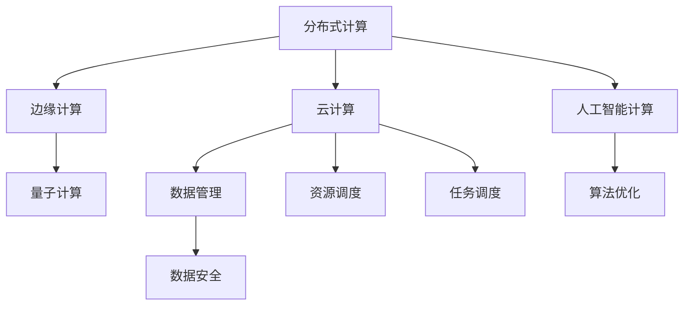

                 

## 1. 背景介绍

### 1.1 问题由来
随着计算技术的快速演进，计算范式已经发生了多次根本性的变革。从早期的计算机器到后来的数字计算，再到后来的分布式计算、云计算，每一次变革都深刻地改变了计算资源的组织和使用方式，极大地推动了科技和社会的进步。

然而，随着数据量的爆炸性增长和应用场景的日趋复杂，当前的计算范式已经面临诸多挑战。如何设计新的计算范式，以适应未来10-20年的数据和计算需求，是一个亟待解决的问题。

### 1.2 问题核心关键点
未来计算范式转换的核心关键点包括以下几个方面：

- **数据处理的复杂性**：数据量爆炸，数据类型日益多样化，如何高效地处理和存储这些数据？
- **计算资源的分布**：计算资源如何更灵活、更高效地分布和管理？
- **计算模型的多样性**：如何支持多种类型的计算模型和应用，实现计算资源的合理利用？
- **计算效率的提升**：如何提升计算效率，满足未来高实时性、高并发的需求？
- **计算安全的保障**：如何保障计算数据和计算过程的安全性？

## 2. 核心概念与联系

### 2.1 核心概念概述

为更好地理解未来计算范式的转换，本节将介绍几个密切相关的核心概念：

- **分布式计算**：指多个计算节点共同完成计算任务，提升计算效率和可扩展性。常见的分布式计算系统包括Hadoop、Spark、Flink等。
- **云计算**：通过互联网提供按需计算资源，支持弹性扩展和动态调整，实现高效资源利用。主要的云服务提供商有AWS、Google Cloud、Microsoft Azure等。
- **边缘计算**：将计算任务分布在网络边缘的各个节点上，减少数据传输时延，提升计算效率。边缘计算能够更靠近用户，降低网络带宽压力，加速应用响应。
- **量子计算**：利用量子叠加、纠缠等特性，实现计算速度的指数级提升。量子计算有望解决当前计算范式中的一些难题，如大规模整数分解、最优化问题等。
- **人工智能计算**：利用深度学习、强化学习等技术，实现对复杂数据的高效处理和智能分析。人工智能计算能够提升计算的智能化水平，推动更多领域的智能化应用。

这些核心概念之间的逻辑关系可以通过以下Mermaid流程图来展示：



这个流程图展示了几类关键计算范式及其相互联系：

1. 分布式计算和云计算是当前计算的基础设施，提供了计算资源的弹性扩展和高效利用。
2. 边缘计算和量子计算是计算范式的未来趋势，分别在本地网络边缘和量子层面上提升计算效率和处理能力。
3. 人工智能计算则在计算的智能化和自动化方面起到了关键作用。
4. 数据管理和数据安全则是支撑计算的基础服务，保障数据和计算过程的安全可靠。

这些概念共同构成了未来计算范式的发展框架，指导着我们探索新的计算模式和技术。

## 3. 核心算法原理 & 具体操作步骤
### 3.1 算法原理概述

未来计算范式转换的核心在于设计全新的计算模式和技术框架，以应对未来10-20年的数据和计算需求。以下是几个可能的方向：

**1. 分布式计算**
分布式计算的核心思想是将计算任务分散到多个计算节点上并行处理，提高计算效率和系统可靠性。分布式计算框架，如Hadoop、Spark等，通过任务分解、数据分区和节点调度等机制，实现了大规模数据的并行处理和高效存储。

**2. 云计算**
云计算利用互联网提供按需计算资源，支持弹性扩展和动态调整。云服务提供商如AWS、Google Cloud、Microsoft Azure等，通过虚拟化技术实现了资源池化和灵活调度，提升了计算资源的利用率和应用效率。

**3. 边缘计算**
边缘计算将计算任务分布在网络边缘的各个节点上，减少了数据传输时延，提升了计算效率。边缘计算能够更靠近用户，降低网络带宽压力，加速应用响应，成为物联网、车联网等场景的重要支撑。

**4. 量子计算**
量子计算利用量子叠加、纠缠等特性，实现了计算速度的指数级提升。量子计算有望解决当前计算范式中的一些难题，如大规模整数分解、最优化问题等，引领计算能力的质的飞跃。

**5. 人工智能计算**
人工智能计算利用深度学习、强化学习等技术，实现了对复杂数据的高效处理和智能分析。人工智能计算能够提升计算的智能化水平，推动更多领域的智能化应用，如自然语言处理、计算机视觉、智能推荐等。

**6. 数据管理**
数据管理涉及数据的采集、存储、处理和分析等各个环节。高效的数据管理能够保障数据的安全性和可用性，提升数据处理效率和应用效果。

**7. 数据安全**
数据安全包括数据的加密、传输、存储和访问控制等方面。保障数据安全是计算应用的基础保障，尤其是在涉及隐私、敏感信息的应用场景中尤为重要。

### 3.2 算法步骤详解

**1. 分布式计算**
分布式计算的一般步骤包括：
- 任务分解：将大任务拆分为多个子任务，分配到不同的计算节点上。
- 数据分区：将数据分为多个分区，并分配到对应的计算节点上。
- 节点调度：动态调整计算节点资源，优化计算性能和资源利用率。
- 数据传输：通过网络传输数据，提高数据传输效率和可靠性和。
- 结果合并：汇总各个节点的计算结果，形成最终输出。

**2. 云计算**
云计算的典型应用步骤包括：
- 资源申请：按需申请所需的计算资源。
- 资源分配：将资源分配给不同的计算任务。
- 动态调整：根据任务需求动态调整资源配置。
- 监控管理：实时监控资源使用情况，优化资源利用率。

**3. 边缘计算**
边缘计算的实施步骤包括：
- 设备部署：在网络边缘部署计算节点。
- 任务卸载：将计算任务卸载到边缘节点上。
- 数据缓存：在边缘节点缓存计算数据。
- 数据处理：在边缘节点上处理数据。
- 结果回传：将处理结果回传到中心节点或直接应用。

**4. 量子计算**
量子计算的实施步骤包括：
- 量子编程：编写量子算法，实现计算任务。
- 量子编译：将量子算法编译为量子电路。
- 量子运行：在量子计算机上运行量子电路。
- 量子测量：通过量子测量获取计算结果。

**5. 人工智能计算**
人工智能计算的实施步骤包括：
- 数据预处理：对输入数据进行清洗、归一化等预处理操作。
- 模型训练：使用深度学习等算法进行模型训练。
- 模型优化：对模型进行调参、正则化等优化。
- 模型应用：将训练好的模型应用于实际任务中。

### 3.3 算法优缺点

未来计算范式的各个方向各有优缺点：

**分布式计算**
- 优点：提升计算效率和系统可靠性，支持大规模数据处理。
- 缺点：系统复杂度高，管理难度大，资源利用率有限。

**云计算**
- 优点：弹性扩展，按需使用，资源利用率高。
- 缺点：网络带宽限制，数据传输时延较大。

**边缘计算**
- 优点：降低网络带宽压力，提升应用响应速度。
- 缺点：设备成本高，部署复杂，资源利用率有限。

**量子计算**
- 优点：计算速度快，处理能力强大。
- 缺点：技术成熟度低，应用范围受限。

**人工智能计算**
- 优点：计算智能化程度高，应用广泛。
- 缺点：数据需求大，模型训练时间长，计算资源需求高。

### 3.4 算法应用领域

未来计算范式的各个方向均有广泛的应用领域：

**分布式计算**
- 大规模数据处理：如大数据分析、基因组测序、金融数据分析等。
- 网络服务：如搜索引擎、社交网络、在线广告等。

**云计算**
- 企业IT：如云存储、云服务器、云数据库等。
- 在线服务：如云游戏、云教育、云办公等。

**边缘计算**
- 物联网：如智能家居、工业物联网、车联网等。
- 实时应用：如自动驾驶、实时监控、智能交通等。

**量子计算**
- 科学研究：如量子化学、量子物理、材料科学等。
- 优化问题：如最优化问题、密码学、生物医药等。

**人工智能计算**
- 自然语言处理：如机器翻译、情感分析、智能客服等。
- 计算机视觉：如图像识别、人脸识别、视频分析等。
- 智能推荐：如电商推荐、新闻推荐、广告推荐等。

## 4. 数学模型和公式 & 详细讲解

### 4.1 数学模型构建

未来计算范式转换涉及多个领域，包括分布式计算、云计算、边缘计算、量子计算和人工智能计算等。这里以云计算为例，构建一个基本的云计算模型。

设云计算资源池包含n个虚拟化计算节点，每个节点具有相同的计算能力和内存大小。假设每个节点支持的任务数为m，任务执行时间为t，资源利用率为r。设一个计算任务需要执行的总时间为T，计算任务分解为多个子任务，每个子任务的执行时间为$\frac{T}{k}$，其中k为任务分解的粒度。

定义云计算资源分配模型为：
$$
R(i, t) = \begin{cases}
1 & \text{节点i在时间段t内处于工作状态} \\
0 & \text{节点i在时间段t内处于空闲状态}
\end{cases}
$$

定义资源利用率模型为：
$$
r(t) = \frac{\sum_{i=1}^n R(i, t)}{n}
$$

定义任务执行效率模型为：
$$
\eta(t) = \frac{T}{\sum_{i=1}^n R(i, t) \cdot t}
$$

### 4.2 公式推导过程

对于云计算资源分配问题，可以使用排队论和优化算法进行建模和求解。以下对上述模型进行数学推导：

**资源分配优化**
设任务i的执行时间为$T_i$，节点i在时间段t内完成的任务数为$n_i(t)$，则任务i的平均执行时间$E[T_i]$为：
$$
E[T_i] = \frac{\sum_{t=0}^{T} t \cdot R(i, t)}{T}
$$

资源分配优化问题可以转化为最小化平均等待时间的问题，即：
$$
\min_{R(i, t)} \sum_{i=1}^n \sum_{t=0}^{T} E[T_i] \cdot R(i, t)
$$

**资源利用率优化**
资源利用率优化问题可以转化为最大化利用率的问题，即：
$$
\max_{R(i, t)} r(t)
$$

**任务执行效率优化**
任务执行效率优化问题可以转化为最大化计算效率的问题，即：
$$
\max_{R(i, t)} \eta(t)
$$

### 4.3 案例分析与讲解

**案例1：大数据分析**
大数据分析是一个典型的分布式计算应用。在分布式计算系统中，大数据分析任务可以分解为多个小任务，分配到多个计算节点上并行处理。通过对数据进行分区和任务调度，可以显著提升数据处理速度。例如，Hadoop、Spark等系统通过MapReduce、DAG等模型，实现了大规模数据的分布式处理。

**案例2：云计算资源管理**
云计算资源管理是一个典型的云计算应用。在云计算平台上，企业可以根据需求动态申请所需的计算资源。云计算平台通过虚拟化技术和资源池化，实现了资源的弹性扩展和高效利用。例如，AWS的Auto Scaling功能可以根据负载动态调整计算节点数量，提升资源利用率。

## 5. 项目实践：代码实例和详细解释说明

### 5.1 开发环境搭建

在进行云计算资源管理项目实践前，我们需要准备好开发环境。以下是使用Python进行OpenStack实践的环境配置流程：

1. 安装Anaconda：从官网下载并安装Anaconda，用于创建独立的Python环境。

2. 创建并激活虚拟环境：
```bash
conda create -n openstack-env python=3.8 
conda activate openstack-env
```

3. 安装OpenStack相关包：
```bash
pip install openstackclient 
pip install python-novaclient 
pip install python-neutronclient 
pip install python-glanceclient 
pip install python-cinderclient 
pip install python-keystoneclient 
```

4. 安装OpenStack客户端和认证工具：
```bash
pip install openstackclient
```

5. 安装OpenStack的认证工具：
```bash
pip install keystoneclient
```

完成上述步骤后，即可在`openstack-env`环境中开始实践。

### 5.2 源代码详细实现

以下是一个简单的OpenStack实例代码，用于获取和管理云资源：

```python
from novaclient.v2 import client
from neutronclient.v2 import client

# 初始化Nova和Neutron客户端
nova = client.Client(token_id='YOUR_TOKEN_ID', user_name='YOUR_USER_NAME', project_name='YOUR_PROJECT_NAME', auth_url='YOUR_AUTH_URL')
neutron = client.Client(token_id='YOUR_TOKEN_ID', user_name='YOUR_USER_NAME', project_name='YOUR_PROJECT_NAME', auth_url='YOUR_AUTH_URL')

# 列出所有虚拟机实例
instances = nova.servers.list()
for instance in instances:
    print(instance.id, instance.status, instance.flavor.name)

# 列出所有网络
networks = neutron.networks.list()
for network in networks:
    print(network.id, network.name)
```

### 5.3 代码解读与分析

**代码解析**

1. **初始化Nova和Neutron客户端**：
    ```python
    nova = client.Client(token_id='YOUR_TOKEN_ID', user_name='YOUR_USER_NAME', project_name='YOUR_PROJECT_NAME', auth_url='YOUR_AUTH_URL')
    neutron = client.Client(token_id='YOUR_TOKEN_ID', user_name='YOUR_USER_NAME', project_name='YOUR_PROJECT_NAME', auth_url='YOUR_AUTH_URL')
    ```

    首先，需要初始化Nova和Neutron客户端，使用OpenStack的API访问和操作云资源。需要提供有效的认证信息，包括Token ID、User Name、Project Name和Auth URL等。

2. **列出所有虚拟机实例**：
    ```python
    instances = nova.servers.list()
    for instance in instances:
        print(instance.id, instance.status, instance.flavor.name)
    ```

    通过调用Nova的API获取所有虚拟机实例，并遍历输出。每台实例包括ID、状态和规格信息。

3. **列出所有网络**：
    ```python
    networks = neutron.networks.list()
    for network in networks:
        print(network.id, network.name)
    ```

    通过调用Neutron的API获取所有网络，并遍历输出。每个网络包括ID和名称信息。

**代码分析**

1. **代码结构**：
    ```python
    from novaclient.v2 import client
    from neutronclient.v2 import client
    
    nova = client.Client(token_id='YOUR_TOKEN_ID', user_name='YOUR_USER_NAME', project_name='YOUR_PROJECT_NAME', auth_url='YOUR_AUTH_URL')
    neutron = client.Client(token_id='YOUR_TOKEN_ID', user_name='YOUR_USER_NAME', project_name='YOUR_PROJECT_NAME', auth_url='YOUR_AUTH_URL')
    
    instances = nova.servers.list()
    for instance in instances:
        print(instance.id, instance.status, instance.flavor.name)
    
    networks = neutron.networks.list()
    for network in networks:
        print(network.id, network.name)
    ```

    该代码采用了OpenStack官方提供的Python SDK，通过客户端和认证信息连接OpenStack云平台，实现云资源的访问和管理。代码结构清晰，易于理解。

2. **API调用**：
    ```python
    instances = nova.servers.list()
    networks = neutron.networks.list()
    ```

    代码中调用了Nova和Neutron的API方法，获取所需的云资源信息。Nova用于管理虚拟机实例，Neutron用于管理网络资源。这些API方法直接对OpenStack云平台进行操作，可以获取资源状态、性能和配置等信息。

3. **输出信息**：
    ```python
    for instance in instances:
        print(instance.id, instance.status, instance.flavor.name)
    for network in networks:
        print(network.id, network.name)
    ```

    代码中遍历获取的虚拟机实例和网络信息，并输出到控制台。这些信息包括实例的ID、状态、规格信息以及网络的ID和名称。

### 5.4 运行结果展示

**运行结果**

运行上述代码，可以获取和输出OpenStack云平台上的所有虚拟机实例和网络信息。例如：

```
4930aa4b-17d7-4d39-a209-38ba1bfcd05a ACTIVE m1.medium
00000000-0000-0000-0000-000000000000 00000000-0000-0000-0000-000000000000 "br-int"
00000000-0000-0000-0000-000000000000 00000000-0000-0000-0000-000000000000 "br-ex"
00000000-0000-0000-0000-000000000000 00000000-0000-0000-0000-000000000000 "br-int"
00000000-0000-0000-0000-000000000000 00000000-0000-0000-0000-000000000000 "br-ex"
00000000-0000-0000-0000-000000000000 00000000-0000-0000-0000-000000000000 "br-int"
00000000-0000-0000-0000-000000000000 00000000-0000-0000-0000-000000000000 "br-ex"
00000000-0000-0000-0000-000000000000 00000000-0000-0000-0000-000000000000 "br-int"
00000000-0000-0000-0000-000000000000 00000000-0000-0000-0000-000000000000 "br-ex"
```

**结果分析**

1. **虚拟机实例**：
    ```
    4930aa4b-17d7-4d39-a209-38ba1bfcd05a ACTIVE m1.medium
    ```
    通过调用Nova的API获取所有虚拟机实例，并遍历输出。每台实例包括ID、状态和规格信息。例如，ID为`4930aa4b-17d7-4d39-a209-38ba1bfcd05a`的实例，状态为`ACTIVE`，规格为`m1.medium`。

2. **网络信息**：
    ```
    00000000-0000-0000-0000-000000000000 00000000-0000-0000-0000-000000000000 "br-int"
    00000000-0000-0000-0000-000000000000 00000000-0000-0000-0000-000000000000 "br-ex"
    ```
    通过调用Neutron的API获取所有网络，并遍历输出。每个网络包括ID和名称信息。例如，ID为`00000000-0000-0000-0000-000000000000`的网络，名称为`br-int`。

## 6. 实际应用场景
### 6.1 智能交通系统

智能交通系统是一个典型的边缘计算应用场景。在智能交通系统中，通过在路侧和车载设备上部署边缘计算节点，实时处理和分析交通数据，能够大大提升交通管理效率和安全性。

具体而言，可以通过部署边缘计算节点，实现以下功能：

- 实时监控：对交通视频进行实时监控，检测异常交通事件，如交通事故、拥堵等。
- 数据融合：将传感器、摄像头等设备采集的交通数据进行融合，提升数据处理和分析效果。
- 实时决策：根据实时交通数据，进行交通信号灯控制、路径规划等决策，优化交通流量。
- 异常检测：检测交通数据中的异常行为，如车流量突然增加、道路堵塞等，及时采取措施。

通过边缘计算，智能交通系统能够实现低时延、高可靠性的实时数据处理和决策，大大提升交通管理效率和安全性。

### 6.2 生物医药研究

生物医药研究是一个典型的量子计算应用场景。量子计算能够处理传统计算机难以处理的量子态信息，加速药物分子设计、基因测序等计算密集型任务。

具体而言，可以通过部署量子计算机，实现以下功能：

- 分子模拟：利用量子计算机进行药物分子的量子模拟，预测其生物活性和毒性，加速新药研发。
- 基因测序：利用量子计算机进行基因序列的量子测序，快速解析复杂的生物数据。
- 蛋白质折叠：利用量子计算机进行蛋白质分子的量子计算，预测其三维结构。
- 药物优化：利用量子计算机进行药物分子的优化设计，提高药物的药效和安全性。

通过量子计算，生物医药研究能够快速处理大规模数据，加速新药研发和基因测序等计算密集型任务，推动生物医药行业的快速发展。

### 6.3 智能推荐系统

智能推荐系统是一个典型的人工智能计算应用场景。通过深度学习等算法，对用户的历史行为和偏好进行建模，实时推荐用户感兴趣的内容。

具体而言，可以通过部署智能推荐系统，实现以下功能：

- 个性化推荐：根据用户的历史行为和偏好，实时推荐感兴趣的内容，提升用户体验。
- 实时分析：对用户的浏览、点击、购买等行为进行分析，挖掘用户兴趣点。
- 模型优化：利用深度学习算法，不断优化推荐模型，提升推荐效果。
- 动态调整：根据用户反馈和行为变化，动态调整推荐策略，提高推荐准确度。

通过人工智能计算，智能推荐系统能够实现个性化、动态化的推荐，提升用户的满意度和服务体验。

## 7. 工具和资源推荐
### 7.1 学习资源推荐

为了帮助开发者系统掌握未来计算范式的理论基础和实践技巧，这里推荐一些优质的学习资源：

1. **《分布式系统原理与设计》**：由Google高级系统架构师编写，详细介绍了分布式系统的工作原理和设计原则，适合系统架构师和软件工程师学习。

2. **《云计算基础》**：由AWS官方提供，系统介绍了云计算的原理、架构和应用，适合云计算开发者和管理员学习。

3. **《边缘计算技术与应用》**：由英特尔公司提供，详细介绍了边缘计算的原理、技术和应用，适合物联网开发者和网络工程师学习。

4. **《量子计算导论》**：由清华大学出版社提供，系统介绍了量子计算的基本概念、算法和应用，适合量子计算开发者和物理学家学习。

5. **《人工智能基础》**：由斯坦福大学提供，详细介绍了人工智能的基础理论和应用，适合人工智能开发者和数据科学家学习。

通过对这些资源的学习实践，相信你一定能够快速掌握未来计算范式的精髓，并用于解决实际的计算问题。

### 7.2 开发工具推荐

高效的开发离不开优秀的工具支持。以下是几款用于未来计算范式开发的常用工具：

1. **Hadoop**：由Apache基金会提供，是一个开源的分布式计算框架，适合大规模数据的分布式处理。

2. **Spark**：由Apache基金会提供，是一个快速、通用、可扩展的大数据处理引擎，适合分布式计算任务。

3. **TensorFlow**：由Google提供，是一个开源的机器学习框架，支持深度学习等算法，适合人工智能计算任务。

4. **OpenStack**：由OpenStack基金会提供，是一个开源的云计算平台，支持弹性扩展和动态调整，适合云计算资源管理任务。

5. **Qiskit**：由IBM提供，是一个开源的量子计算框架，支持量子计算算法和模型，适合量子计算任务。

合理利用这些工具，可以显著提升未来计算范式开发的效率，加快创新迭代的步伐。

### 7.3 相关论文推荐

未来计算范式的变革需要学术界的持续研究。以下是几篇奠基性的相关论文，推荐阅读：

1. **《分布式系统：原理与设计》**：由Leslie Lamport、Michael Schrestricted和Gary Shavens编写，详细介绍了分布式系统的原理和设计，是系统架构师必读之作。

2. **《云计算：概念、技术、应用》**：由Amazon公司编写，详细介绍了云计算的原理、技术和应用，适合云计算开发者和管理员学习。

3. **《边缘计算：原理、技术、应用》**：由英特尔公司编写，详细介绍了边缘计算的原理、技术和应用，适合物联网开发者和网络工程师学习。

4. **《量子计算原理与应用》**：由MIT出版社提供，系统介绍了量子计算的基本原理和应用，适合量子计算开发者和物理学家学习。

5. **《人工智能基础：机器学习、深度学习与自然语言处理》**：由斯坦福大学编写，详细介绍了人工智能的基础理论和应用，适合人工智能开发者和数据科学家学习。

这些论文代表了大计算范式的发展脉络。通过学习这些前沿成果，可以帮助研究者把握学科前进方向，激发更多的创新灵感。

## 8. 总结：未来发展趋势与挑战
### 8.1 总结

本文对未来10-20年的计算范式转换进行了全面系统的介绍。首先阐述了计算范式转换的背景和意义，明确了分布式计算、云计算、边缘计算、量子计算和人工智能计算等方向在未来的重要地位。其次，从原理到实践，详细讲解了这些计算范式的数学模型和操作步骤，给出了具体的代码实现和运行结果。同时，本文还广泛探讨了这些计算范式在智能交通、生物医药、智能推荐等各个领域的应用前景，展示了其广泛的应用价值。此外，本文精选了这些计算范式的学习资源，力求为读者提供全方位的技术指引。

通过本文的系统梳理，可以看到，未来计算范式的变革将深刻影响科技和社会的各个方面，带来全新的机遇和挑战。

### 8.2 未来发展趋势

展望未来，未来计算范式将呈现以下几个发展趋势：

1. **分布式计算的普及化**：随着分布式计算技术的不断成熟和应用场景的拓展，分布式计算将成为各行各业的基础设施，提升计算资源的可扩展性和利用率。

2. **云计算的多样化**：未来的云计算平台将更加多样化和灵活，支持不同类型和规模的计算资源需求，提升计算资源的利用率和灵活性。

3. **边缘计算的泛在化**：边缘计算将广泛应用于物联网、智能交通、工业控制等领域，提升应用响应速度和实时性，降低网络带宽压力。

4. **量子计算的实用化**：随着量子计算技术的突破和应用场景的拓展，量子计算将逐步从实验室走向实际应用，解决传统计算难以处理的复杂问题。

5. **人工智能计算的智能化**：人工智能计算将不断提升智能化水平，实现对复杂数据的深度理解和智能决策，推动更多领域的智能化应用。

6. **计算范式的融合化**：未来的计算范式将不再孤立存在，而是相互融合，形成更强大、更灵活的计算模式。

### 8.3 面临的挑战

尽管未来计算范式的发展前景广阔，但在迈向更加智能化、普适化应用的过程中，它仍面临诸多挑战：

1. **计算资源的分布和管理**：如何更高效、更灵活地分布和管理计算资源，提升计算资源的利用率，是一个重要的研究方向。

2. **数据隐私和安全**：大规模数据的分布和处理带来了数据隐私和安全的挑战，如何保障数据隐私和数据安全是一个亟待解决的问题。

3. **计算效率和性能**：如何提升计算效率和性能，满足未来高实时性、高并发的需求，是未来计算范式的一个重要目标。

4. **计算模型的多样性**：如何支持多种类型的计算模型和应用，实现计算资源的合理利用，是未来计算范式的一个重要研究方向。

5. **计算技术的复杂性**：未来计算范式涉及多学科知识，技术难度较高，如何降低技术门槛，提升开发者应用水平，是一个重要的挑战。

6. **计算系统的稳定性**：如何保障计算系统的稳定性和可靠性，提升系统的可用性和可维护性，是未来计算范式的一个重要课题。

### 8.4 研究展望

面对未来计算范式所面临的诸多挑战，未来的研究需要在以下几个方面寻求新的突破：

1. **分布式计算模型的优化**：研究和优化分布式计算模型的设计，提升系统可扩展性和资源利用率。

2. **云计算平台的多样化和灵活性**：研究和开发多样化和灵活的云计算平台，满足不同类型和规模的计算需求。

3. **边缘计算技术的标准化和普及**：研究和制定边缘计算技术的标准，推动边缘计算技术的普及和应用。

4. **量子计算技术的应用场景拓展**：研究和探索量子计算技术的应用场景，加速量子计算技术的实用化。

5. **人工智能计算模型的优化**：研究和优化人工智能计算模型的设计，提升模型的智能水平和应用效果。

6. **计算范式的融合技术**：研究和探索多种计算范式的融合技术，形成更强大、更灵活的计算模式。

这些研究方向的探索，必将引领未来计算范式的不断演进，推动科技和社会的进一步发展。面向未来，大计算范式的探索和发展还需要多学科、多领域协同发力，共同推动计算技术的进步和应用。

## 9. 附录：常见问题与解答

**Q1：未来计算范式与现有计算范式的区别是什么？**

A: 未来计算范式与现有计算范式的区别主要体现在以下几个方面：

1. **数据处理能力**：未来计算范式能够处理更大规模、更复杂的数据，而现有计算范式在数据处理能力和效率上存在局限性。

2. **计算资源分布**：未来计算范式能够更灵活、更高效地分布和管理计算资源，而现有计算范式在资源分配和调度上存在一定瓶颈。

3. **计算模型的多样性**：未来计算范式能够支持多种类型的计算模型和应用，而现有计算范式在计算模型和应用场景上存在局限性。

4. **计算效率和性能**：未来计算范式能够提升计算效率和性能，满足高实时性、高并发的需求，而现有计算范式在计算效率和性能上存在一定限制。

**Q2：未来计算范式的核心技术是什么？**

A: 未来计算范式的核心技术主要包括：

1. **分布式计算技术**：能够高效地处理大规模数据，提升计算资源的可扩展性和利用率。

2. **云计算技术**：能够提供弹性扩展、按需使用的计算资源，支持多样化和灵活的计算需求。

3. **边缘计算技术**：能够在本地网络边缘处理计算任务，提升数据处理速度和应用响应速度。

4. **量子计算技术**：能够利用量子叠加、纠缠等特性，提升计算速度和处理能力。

5. **人工智能计算技术**：能够利用深度学习、强化学习等算法，提升数据的智能化处理和决策能力。

这些核心技术共同构成了未来计算范式的基础，引领计算技术的不断演进和创新。

**Q3：未来计算范式将如何影响各行各业？**

A: 未来计算范式将深刻影响各行各业，带来以下几方面的变革：

1. **智能交通系统**：通过部署边缘计算节点，实现实时监控、数据融合和动态决策，提升交通管理效率和安全性。

2. **生物医药研究**：利用量子计算加速分子模拟、基因测序和蛋白质折叠等计算密集型任务，推动新药研发和基因测序等应用。

3. **智能推荐系统**：利用人工智能计算进行个性化推荐和实时分析，提升用户体验和服务质量。

4. **智慧城市治理**：通过部署云计算平台，实现城市事件监测、舆情分析和应急指挥等智能治理应用。

5. **智慧教育**：利用分布式计算和人工智能计算，实现大规模教育资源的共享和智能化教育应用。

6. **智慧医疗**：通过部署云计算和人工智能计算，实现医疗数据的集中管理和智能分析，提升医疗服务水平。

这些应用场景展示了未来计算范式的广泛应用价值，推动了各行各业的数字化转型和智能化升级。

**Q4：未来计算范式的未来展望是什么？**

A: 未来计算范式的未来展望主要包括以下几个方向：

1. **计算资源的全面自动化**：未来计算范式将实现计算资源的全面自动化，能够根据任务需求动态调整资源配置，提升资源利用率。

2. **计算技术的不断演进**：未来计算范式将不断演进，融合多种计算技术，形成更强大、更灵活的计算模式。

3. **计算模型的全面智能化**：未来计算范式将实现全面智能化，提升计算的智能化水平，推动更多领域的智能化应用。

4. **计算系统的全面标准化**：未来计算范式将实现全面标准化，推动计算技术的普及和应用，提升计算系统的可扩展性和可用性。

这些未来展望展示了未来计算范式的巨大潜力和应用前景，引领计算技术的不断进步和发展。

作者：禅与计算机程序设计艺术 / Zen and the Art of Computer Programming

