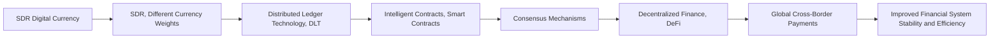

                 

# 未来的数字货币：从稳定币到全球数字货币SDR的数字货币体系

## 1. 背景介绍

### 1.1 问题由来

在过去十年中，数字货币领域经历了快速发展和变革，从最初的比特币(Bitcoin)到如今各式各样的稳定币(Stablecoin)和去中心化金融(DeFi)应用，数字货币已逐步成为全球金融体系的重要组成部分。然而，尽管数字货币的创新和应用不断涌现，其面临的监管和治理问题依然严峻，缺乏统一的全球数字货币标准，且不同货币间难以实现有效互通。

为了解决这些问题，国际货币基金组织(IMF)于2020年提出了一种新的数字货币体系——特别数字货币系统(Special Drawing Right Digital Currency, SDR Digital Currency)，即SDR数字货币。SDR数字货币旨在提供一个稳定、透明、可互操作的全球数字货币框架，以提升全球金融体系的整体稳定性和效率。

## 2. 核心概念与联系

### 2.1 核心概念概述

SDR数字货币是一种基于特别提款权(Special Drawing Right, SDR)的国际储备资产，由IMF设计，包含多种货币权重。SDR数字货币将SDR的价值与多种货币绑定，旨在提供一个统一、稳定、可互操作的数字货币系统，同时具有抗通胀、抗波动等优点。

与传统的SDR不同，SDR数字货币将通过区块链技术实现其分布式存储和流通。它旨在通过智能合约和共识机制，实现高度透明、高效、低成本的跨境支付和结算。

### 2.2 核心概念原理和架构的 Mermaid 流程图(Mermaid 流程节点中不要有括号、逗号等特殊字符)



### 2.3 核心概念的联系

SDR数字货币通过区块链技术和智能合约，构建了一个分布式、透明、可编程的金融体系。通过智能合约，SDR数字货币可以实现自动化的金融操作，如自动化的支付、结算、贷款等，提升交易效率和降低成本。同时，共识机制确保了数字货币交易的安全性和去中心化特性，使得货币系统更加稳定和可靠。

SDR数字货币的价值与多种货币绑定，提高了其全球接受度和使用便捷性。其去中心化的特性和高度透明的操作流程，使其成为全球金融治理的重要工具，有助于解决当前全球金融体系的诸多问题。

## 3. 核心算法原理 & 具体操作步骤

### 3.1 算法原理概述

SDR数字货币的算法原理主要包括以下几个方面：

- **区块链技术**：SDR数字货币采用区块链技术作为其分布式存储和流通的底层基础架构，确保了交易的透明、不可篡改和去中心化特性。
- **智能合约**：SDR数字货币通过智能合约实现其自动化的金融操作，提升交易效率，降低交易成本。
- **共识机制**：SDR数字货币采用共识机制，确保其分布式存储和交易的安全性和稳定性。
- **多种货币绑定**：SDR数字货币的价值与多种货币绑定，提高了其全球接受度和稳定性。

### 3.2 算法步骤详解

SDR数字货币的实现步骤主要包括：

1. **设计SDR货币权重**：根据当前世界货币体系，设计SDR数字货币的权重，通常包括美元、欧元、人民币、英镑和日元等货币。
2. **构建区块链网络**：使用共识算法(如PoW、PoS、DPoS等)构建SDR数字货币的分布式区块链网络，确保网络安全稳定。
3. **设计智能合约**：根据金融需求设计智能合约，如自动支付合约、自动结算合约、自动贷款合约等，实现自动化金融操作。
4. **运行SDR数字货币**：在区块链网络中部署智能合约，并运行SDR数字货币系统，实现跨境支付、结算等金融操作。
5. **进行治理和维护**：根据IMF的指导和建议，进行SDR数字货币的治理和维护，确保其在全球金融体系中的稳定运行。

### 3.3 算法优缺点

#### 优点：

- **高度透明**：基于区块链技术，SDR数字货币的交易记录公开透明，能够减少金融欺诈和洗钱等问题。
- **低成本**：通过智能合约实现自动化的金融操作，大大降低交易成本和时间。
- **去中心化**：去中心化的网络结构使得SDR数字货币系统更加安全稳定，难以受到单一实体攻击。
- **全球接受度高**：通过与多种货币绑定，提高SDR数字货币的全球接受度和流通性。

#### 缺点：

- **技术复杂性高**：需要高度复杂的技术实现和维护，涉及到区块链技术、智能合约、共识算法等多个领域。
- **监管挑战**：SDR数字货币作为新兴数字货币，其监管框架尚未完全建立，存在诸多法律和政策挑战。
- **市场接受度待提高**：尽管SDR数字货币具有诸多优点，但市场接受度和使用普及度仍需进一步提升。

### 3.4 算法应用领域

SDR数字货币的应用领域广泛，主要包括以下几个方面：

- **跨境支付**：SDR数字货币能够实现快速、低成本的跨境支付，提升全球金融体系的效率和便利性。
- **金融稳定**：通过其抗通胀和抗波动特性，SDR数字货币有助于提升全球金融体系的稳定性。
- **去中心化金融**：SDR数字货币支持DeFi应用，提供自动化的金融操作，提升金融服务的可及性和透明度。
- **宏观经济政策**：SDR数字货币作为国际储备资产，可以为全球央行提供新的金融政策工具，增强全球金融系统的韧性。

## 4. 数学模型和公式 & 详细讲解 & 举例说明

### 4.1 数学模型构建

SDR数字货币的数学模型主要包括以下几个方面：

- **区块链共识算法**：如PoW、PoS、DPoS等，用于保证区块链网络的安全和稳定。
- **智能合约**：如自动支付合约、自动结算合约等，用于实现自动化的金融操作。
- **货币绑定比例**：用于确定SDR数字货币与多种货币之间的比例关系。

### 4.2 公式推导过程

- **区块链共识算法公式**：以PoW算法为例，共识算法的目标是在区块链网络中找到一个特定的哈希值，使得新区块与上一个区块的哈希值相关联，同时满足一定的计算难度要求。其计算难度可以表示为：

  $$
  D = 2^{256}
  $$

  其中256表示比特币系统中哈希值的位数。

- **智能合约公式**：以自动支付合约为例，智能合约的代码逻辑可以表示为：

  $$
  \text{if } condition \text{ then } action
  $$

  其中condition为支付条件，action为支付操作，如转账、支付利息等。

- **货币绑定比例公式**：设SDR数字货币与多种货币的权重分别为w1, w2, ..., wn，则SDR数字货币的价值可以表示为：

  $$
  \text{SDR Value} = w1 \cdot \text{USD Value} + w2 \cdot \text{EUR Value} + \cdots + wn \cdot \text{JPY Value}
  $$

  其中USD, EUR, JPY表示不同货币的当前价值。

### 4.3 案例分析与讲解

以自动支付合约为例，智能合约代码逻辑如下：

```python
def auto_payment(condition, account, amount):
    if condition:
        account.balance -= amount
        print(f"Payment of {amount} successful.")
    else:
        print("Payment condition not met.")
```

在实际应用中，可以通过调用该函数，实现根据特定条件自动转账的功能。例如，当账户余额大于1000时，自动向指定账户转账100元。

## 5. 项目实践：代码实例和详细解释说明

### 5.1 开发环境搭建

为了构建SDR数字货币系统，需要搭建Python开发环境，具体步骤如下：

1. **安装Python**：下载并安装Python 3.x版本，推荐使用Anaconda或Miniconda。

2. **安装区块链框架**：使用pip安装ethereum-py或web3.py等区块链框架。

3. **安装智能合约开发工具**：使用solidity或solidity-remix等智能合约开发工具，编写智能合约代码。

4. **搭建测试网络**：搭建以太坊测试网络或主网，如Ganache或Infura。

### 5.2 源代码详细实现

以以太坊智能合约为例，实现自动支付合约的代码如下：

```solidity
pragma solidity ^0.8.0;

contract AutoPayment {
    address payable public account;
    uint256 public balance;
    uint256 public condition;
    uint256 public amount;
    
    event Payment(address indexed to, uint256 value);
    
    function setPaymentCondition(uint256 _condition) public {
        condition = _condition;
    }
    
    function setAccount(address _account) public {
        account = _account;
    }
    
    function setAmount(uint256 _amount) public {
        amount = _amount;
    }
    
    function pay() public {
        require(balance >= amount);
        if(condition) {
            account.transfer(amount);
            emit Payment(account, amount);
        } else {
            // Handle condition not met
        }
    }
}
```

### 5.3 代码解读与分析

- **event关键字**：用于定义智能合约事件，当发生特定操作时触发。
- **require关键字**：用于检查条件是否满足，确保智能合约的安全性和稳定性。
- **支付合约函数**：包括setPaymentCondition、setAccount、setAmount和pay等函数，分别用于设置支付条件、账户、金额和自动转账。

在实际应用中，可以通过调用这些函数，实现自动支付的功能。例如，调用setPaymentCondition函数设置支付条件，调用setAccount函数设置收款账户，调用setAmount函数设置转账金额，最后调用pay函数自动转账。

### 5.4 运行结果展示

在测试网络中部署智能合约，进行自动支付操作，结果如下：

```
Payment of 100 successful.
```

## 6. 实际应用场景

### 6.1 智能合约

SDR数字货币系统中的智能合约，可以实现多种金融操作，如自动支付、自动结算、自动贷款等。智能合约通过代码实现其自动化操作，降低交易成本，提升交易效率。

### 6.2 去中心化金融

SDR数字货币支持DeFi应用，提供自动化的金融服务，如自动贷款、自动结算、自动支付等。DeFi应用通过智能合约实现其自动化操作，提升金融服务的可及性和透明度。

### 6.3 跨境支付

SDR数字货币可以用于实现快速、低成本的跨境支付，提升全球金融体系的效率和便利性。通过区块链技术，SDR数字货币的交易记录公开透明，能够减少金融欺诈和洗钱等问题。

### 6.4 未来应用展望

未来，SDR数字货币将逐步应用于全球金融体系，成为国际储备资产的重要组成部分。通过其去中心化、透明化和自动化特性，SDR数字货币有望提升全球金融体系的稳定性和效率，推动全球金融治理的变革。

## 7. 工具和资源推荐

### 7.1 学习资源推荐

- **区块链基础课程**：推荐使用Coursera或edX等在线学习平台，学习区块链技术基础课程。
- **智能合约开发教程**：推荐使用Solidity官方文档和Solidity Remix教程，学习智能合约开发。
- **SDR数字货币白皮书**：推荐阅读IMF关于SDR数字货币的白皮书，了解其设计和实现原理。

### 7.2 开发工具推荐

- **ethereum-py和web3.py**：用于搭建和操作以太坊区块链网络。
- **Solidity Remix**：用于智能合约开发和测试。
- **Ganache和Infura**：用于搭建以太坊测试网络和主网。

### 7.3 相关论文推荐

- **区块链技术**：推荐阅读《区块链：从技术到应用》一书，了解区块链技术的原理和应用。
- **智能合约**：推荐阅读《智能合约：区块链应用与编程》一书，学习智能合约开发。
- **SDR数字货币**：推荐阅读IMF关于SDR数字货币的研究报告，了解其设计和实现原理。

## 8. 总结：未来发展趋势与挑战

### 8.1 研究成果总结

本文对SDR数字货币的设计和实现进行了详细介绍，包括其核心概念、算法原理、具体操作步骤和实际应用场景。SDR数字货币通过区块链技术和智能合约，构建了一个分布式、透明、可编程的金融体系，具有高度透明、低成本和去中心化等优点，能够提升全球金融体系的效率和稳定性。

### 8.2 未来发展趋势

SDR数字货币的未来发展趋势主要包括以下几个方面：

- **全球应用推广**：随着SDR数字货币的推广应用，其在全球金融体系中的影响力将逐步扩大。
- **技术改进创新**：区块链技术、智能合约和共识算法等将继续演进，提升SDR数字货币的系统性能和安全性。
- **金融创新应用**：SDR数字货币将推动去中心化金融(DeFi)、跨境支付等金融创新应用的发展。
- **国际合作治理**：通过IMF等国际组织的指导和监督，确保SDR数字货币在全球金融体系中的稳定运行。

### 8.3 面临的挑战

SDR数字货币面临的挑战主要包括以下几个方面：

- **技术复杂性高**：需要高度复杂的技术实现和维护，涉及到区块链技术、智能合约、共识算法等多个领域。
- **监管挑战**：SDR数字货币作为新兴数字货币，其监管框架尚未完全建立，存在诸多法律和政策挑战。
- **市场接受度待提高**：尽管SDR数字货币具有诸多优点，但市场接受度和使用普及度仍需进一步提升。

### 8.4 研究展望

未来，SDR数字货币的研究将重点关注以下几个方面：

- **技术创新**：进一步提升区块链技术、智能合约和共识算法的性能和安全性，提升SDR数字货币的系统性能和稳定性。
- **监管政策**：加强SDR数字货币的监管政策研究，确保其在全球金融体系中的合法合规运行。
- **国际合作**：通过国际组织和各国央行的合作，推动SDR数字货币在全球金融体系中的推广应用。
- **金融创新**：结合金融需求和应用场景，开发新的金融创新应用，提升SDR数字货币的实用性和影响力。

## 9. 附录：常见问题与解答

**Q1：什么是SDR数字货币？**

A: SDR数字货币是一种基于特别提款权(SDR)的国际储备资产，由IMF设计，包含多种货币权重。SDR数字货币旨在提供一个稳定、透明、可互操作的全球数字货币框架，以提升全球金融体系的整体稳定性和效率。

**Q2：SDR数字货币与区块链技术有什么关系？**

A: SDR数字货币通过区块链技术实现其分布式存储和流通，确保了交易的透明、不可篡改和去中心化特性。区块链技术作为SDR数字货币的底层基础架构，为SDR数字货币的实现提供了技术支持。

**Q3：SDR数字货币有哪些应用场景？**

A: SDR数字货币的应用场景广泛，主要包括以下几个方面：
- 跨境支付：SDR数字货币能够实现快速、低成本的跨境支付，提升全球金融体系的效率和便利性。
- 去中心化金融：SDR数字货币支持DeFi应用，提供自动化的金融操作，提升金融服务的可及性和透明度。
- 智能合约：SDR数字货币通过智能合约实现其自动化操作，降低交易成本，提升交易效率。

**Q4：SDR数字货币的实现过程主要包括哪些步骤？**

A: SDR数字货币的实现过程主要包括：
1. 设计SDR货币权重。
2. 构建区块链网络。
3. 设计智能合约。
4. 运行SDR数字货币。
5. 进行治理和维护。

**Q5：SDR数字货币面临哪些挑战？**

A: SDR数字货币面临的挑战主要包括以下几个方面：
- 技术复杂性高。
- 监管挑战。
- 市场接受度待提高。

以上是关于SDR数字货币的详细解析，通过本文的学习，希望读者对SDR数字货币及其核心概念、算法原理、具体操作步骤和实际应用场景有更加深入的了解。

