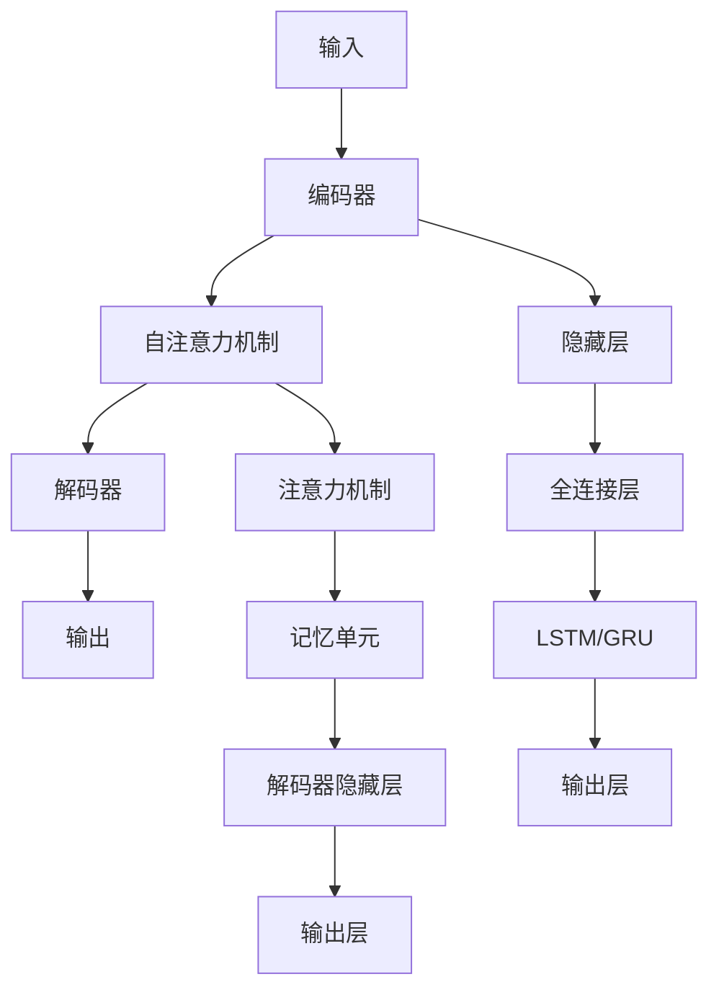

                 

# 机器翻译在国际业务流程中的应用

## 1. 背景介绍

在全球化背景下，国际业务流程中越来越频繁地涉及多语言的沟通与协作，无论是商务谈判、客户服务、供应链管理还是跨国合作，语言翻译问题已成为制约企业效率和客户满意度的重要瓶颈。传统的语言翻译依赖人工翻译人员，存在成本高、速度慢、质量不稳定的缺点。机器翻译技术的应用，尤其是深度学习驱动的神经机器翻译(Neural Machine Translation, NMT)，因其高效、低成本、高精度等优势，逐渐成为国际业务流程中不可或缺的工具。

机器翻译技术的发展历程可以追溯到早期的统计机器翻译(SMT)方法，但其效果受限于语言模型和翻译模型的质量。直到2014年，Facebook开源的神经机器翻译模型Seq2Seq框架的问世，机器翻译技术才迎来了质的飞跃。Seq2Seq模型通过使用编码器-解码器结构，结合长短时记忆网络(LSTM)或门控循环单元(GRU)等技术，提升了翻译质量，并显著提高了翻译效率。

近年来，基于Transformer结构的神经机器翻译模型进一步推动了机器翻译技术的进步。Transformer模型在2017年被提出后，由于其自注意力机制的创新，使得机器翻译效果大幅提升，并且能够处理更长的输入序列，支持更复杂的语言模型。以BERT、GPT-3为代表的预训练语言模型也在机器翻译中得到了广泛应用，进一步提升了翻译质量。

## 2. 核心概念与联系

### 2.1 核心概念概述

在机器翻译中，以下几个关键概念构成了其核心逻辑框架：

- **神经机器翻译（NMT）**：使用神经网络模型进行翻译任务的方法，是机器翻译的主流范式。NMT通过学习源语言和目标语言的对应关系，实现从源语言到目标语言的自动转换。
- **编码器-解码器结构**：NMT模型的基本架构，将输入序列编码成固定长度的向量表示，然后通过解码器生成目标序列。
- **自注意力机制**：Transformer模型的核心创新点，通过自注意力机制使得模型能够自动关注输入序列中的关键信息，提升翻译质量。
- **预训练语言模型**：如BERT、GPT-3等，通过在大量无标签文本上预训练获得广泛语言知识和能力，然后在特定任务上微调获得优异的性能。
- **序列到序列（Seq2Seq）**：一种基于循环神经网络(RNN)的框架，用于解决输入和输出序列长度不一致的问题。

### 2.2 核心概念原理和架构的 Mermaid 流程图



这个流程图展示了神经机器翻译模型的基本结构：输入序列通过编码器进行编码，并利用自注意力机制关注关键信息，然后通过解码器生成输出序列。在编码器中，隐藏层、全连接层和LSTM/GRU层用于提取输入序列的语义信息，解码器中注意力机制和记忆单元用于生成输出序列。

## 3. 核心算法原理 & 具体操作步骤

### 3.1 算法原理概述

基于神经网络的机器翻译模型（NMT）的训练，通常分为两个阶段：预训练和微调。

**预训练阶段**：使用大规模无标签数据对模型进行预训练，学习通用的语言表示。这一阶段通常使用自监督学习任务，如语言模型、掩码语言模型等，使得模型能够捕捉语言的结构和统计特性。

**微调阶段**：在预训练模型基础上，使用带有标注的并行语料对模型进行微调，以适应特定的翻译任务。微调过程通过优化损失函数，使得模型能够准确地将源语言翻译为目标语言。

在微调过程中，通常使用以下几种损失函数：

- **BLEU分数（BLEU Score）**：用于评价翻译质量的一种标准，计算模型生成的目标文本与参考答案之间的相似度。
- **词错误率（Word Error Rate, WER）**：评估模型在生成目标文本时产生的错误数量。
- **BLEU+perplexity（BLEU+Perplexity）**：综合考虑翻译质量与模型预测的复杂度。

### 3.2 算法步骤详解

以下是机器翻译模型微调的一般流程：

1. **数据准备**：准备并行语料库，确保源语言和目标语言之间的对译关系准确。并行语料库是训练模型的基础，可以从开源数据集或企业内部数据中获取。

2. **模型选择**：选择合适的NMT模型架构，如Transformer、Seq2Seq等。确定编码器和解码器的层数、隐藏层大小、自注意力机制等参数。

3. **预训练模型初始化**：使用大规模无标签数据对模型进行预训练，如使用BERT等预训练模型。

4. **微调模型训练**：将并行语料库分割成训练集、验证集和测试集。在训练集上使用交叉熵损失函数进行训练，同时监控验证集上的性能，避免过拟合。

5. **模型评估与优化**：在测试集上评估模型性能，如BLEU分数、WER等指标。根据评估结果调整模型参数，如学习率、批大小等，以进一步提升模型性能。

6. **部署与测试**：将微调后的模型部署到实际应用中，进行大规模的测试与优化。同时监控模型性能，确保其在实际应用中的稳定性和可靠性。

### 3.3 算法优缺点

机器翻译模型的微调具有以下优点：

- **高效**：使用大规模并行语料进行微调，能够快速提升翻译质量。
- **泛化能力强**：预训练模型能够捕捉语言的通用特征，适用于多种语言之间的翻译。
- **低成本**：相较于人工翻译，机器翻译能够显著降低翻译成本，提升翻译速度。

同时，机器翻译模型的微调也存在一些局限性：

- **数据依赖性强**：微调的效果高度依赖于训练数据的数量和质量，数据偏差可能导致翻译质量下降。
- **噪声敏感**：微调模型对输入序列的噪声敏感，输入错误可能导致翻译错误。
- **难以解释**：机器翻译模型是"黑盒"模型，难以解释其内部决策过程。

### 3.4 算法应用领域

机器翻译技术在众多国际业务流程中得到了广泛应用，以下是几个典型的应用场景：

1. **国际贸易与合作**：翻译国际贸易合同、谈判记录等，帮助企业快速达成协议，提高交易效率。
2. **跨境电商**：翻译商品描述、用户评论、客服对话等，提升跨境电商平台的国际化水平，扩大市场覆盖范围。
3. **旅游服务**：翻译旅游指南、客户评论、酒店预订等，提供多语言支持，提升旅游体验。
4. **医疗服务**：翻译医学文献、病历记录等，帮助医疗机构提供国际化医疗服务，提升医疗水平。
5. **金融服务**：翻译金融报告、客户咨询等，提升金融服务的国际化水平，帮助企业拓展全球市场。
6. **教育培训**：翻译教材、课程内容等，促进国际教育资源的共享，提升教育质量。

## 4. 数学模型和公式 & 详细讲解

### 4.1 数学模型构建

机器翻译模型的数学模型可以表示为：

$$
P(y|x) = \prod_{i=1}^{T_{y}}p(y_i|y_{i-1},x)
$$

其中 $x$ 表示源语言序列，$y$ 表示目标语言序列，$T_{y}$ 为目标语言序列长度。$p(y_i|y_{i-1},x)$ 表示在给定源语言序列和前一个目标语言词汇的情况下，生成第 $i$ 个目标语言词汇的概率。

### 4.2 公式推导过程

在机器翻译中，常用的模型架构为编码器-解码器结构。编码器将源语言序列 $x$ 映射到一个固定长度的向量表示 $h_x$，解码器则使用该向量作为初始状态，生成目标语言序列 $y$。

对于解码器，通常使用注意力机制来提升模型对输入序列的关注度。注意力机制可以表示为：

$$
\alpha_i = \frac{\exp(\text{dot}(s_i,W^a h_x)}{\sum_{j=1}^{T_x} \exp(\text{dot}(s_j,W^a h_x))}
$$

其中 $s_i$ 表示第 $i$ 个目标语言词汇的表示向量，$W^a$ 为注意力权重矩阵，$\text{dot}$ 表示向量点乘。

解码器的输出层通常使用softmax函数，将注意力权重与编码器向量进行加权求和，生成目标语言词汇的概率分布：

$$
p(y_i|y_{i-1},x) = \text{softmax}(W^o \alpha_i + b^o)
$$

其中 $W^o$ 和 $b^o$ 为输出层权重和偏置。

### 4.3 案例分析与讲解

以一个简单的机器翻译任务为例，假设源语言序列为 "I love you"，目标语言为 "Je t'aime"。使用Transformer模型进行翻译，步骤如下：

1. 使用编码器将 "I love you" 转换为向量表示。
2. 解码器利用注意力机制，关注向量表示中的关键信息。
3. 解码器生成目标语言序列 "Je t'aime" 的概率分布。

## 5. 项目实践：代码实例和详细解释说明

### 5.1 开发环境搭建

在进行机器翻译项目开发前，需要搭建好开发环境。以下是Python环境下使用TensorFlow进行机器翻译的开发环境配置流程：

1. 安装Anaconda：从官网下载并安装Anaconda，用于创建独立的Python环境。
```bash
conda create -n tf-env python=3.8
conda activate tf-env
```

2. 安装TensorFlow：根据CUDA版本，从官网获取对应的安装命令。例如：
```bash
conda install tensorflow==2.5.0
```

3. 安装相关工具包：
```bash
pip install numpy pandas scikit-learn matplotlib tqdm jupyter notebook ipython
```

完成上述步骤后，即可在`tf-env`环境中开始机器翻译项目开发。

### 5.2 源代码详细实现

以下是一个简单的基于Transformer的机器翻译模型代码实现，使用TensorFlow和Keras构建：

```python
import tensorflow as tf
from tensorflow.keras import layers, models
import numpy as np

# 定义模型架构
class Transformer(tf.keras.Model):
    def __init__(self, num_tokens, d_model, n_heads, num_layers, dff):
        super(Transformer, self).__init__()
        self.encoder = Encoder(num_tokens, d_model, n_heads, num_layers, dff)
        self.decoder = Decoder(num_tokens, d_model, n_heads, num_layers, dff)
        self.final_layer = tf.keras.layers.Dense(num_tokens, activation='softmax')

    def call(self, x, y):
        y += tf.keras.layers.Embedding(num_tokens, d_model)(x)
        return self.final_layer(self.decoder(self.encoder(x), y))

# 定义编码器层
class Encoder(tf.keras.layers.Layer):
    def __init__(self, num_tokens, d_model, n_heads, num_layers, dff):
        super(Encoder, self).__init__()
        self.embedding = tf.keras.layers.Embedding(num_tokens, d_model)
        self.pos_encoding = positional_encoding(d_model)
        self.enc_layers = [EncoderLayer(d_model, n_heads, dff) for _ in range(num_layers)]

    def call(self, x):
        x = self.embedding(x) + self.pos_encoding
        for layer in self.enc_layers:
            x = layer(x)
        return x

# 定义解码器层
class Decoder(tf.keras.layers.Layer):
    def __init__(self, num_tokens, d_model, n_heads, num_layers, dff):
        super(Decoder, self).__init__()
        self.embedding = tf.keras.layers.Embedding(num_tokens, d_model)
        self.pos_encoding = positional_encoding(d_model)
        self.dec_layers = [DecoderLayer(d_model, n_heads, dff) for _ in range(num_layers)]

    def call(self, x, y):
        y = self.embedding(y) + self.pos_encoding
        for layer in self.dec_layers:
            x, y = layer(x, y)
        return x, y

# 定义位置编码
def positional_encoding(input_vocab_size, max_length, d_model):
    pos_enc = np.array([
        [pos / np.power(10000, 2 * (j // 2) / d_model) for j in range(d_model)]
        for pos in range(max_length)
    ])
    pos_enc[:, 0::2] = np.sin(pos_enc[:, 0::2])
    pos_enc[:, 1::2] = np.cos(pos_enc[:, 1::2])
    return tf.cast(pos_enc, tf.float32) / np.sqrt(d_model)
```

### 5.3 代码解读与分析

让我们再详细解读一下关键代码的实现细节：

**Transformer类**：
- 定义Transformer模型，包括编码器和解码器。
- 定义一个简单的线性层作为输出层，使用softmax激活函数。

**Encoder类**：
- 定义编码器层，包括嵌入层、位置编码和多个编码器层。
- 使用EncoderLayer类实现编码器层，包含多头注意力机制和前馈神经网络。

**Decoder类**：
- 定义解码器层，包括嵌入层、位置编码和多个解码器层。
- 使用DecoderLayer类实现解码器层，包含多头注意力机制、自注意力机制和前馈神经网络。

**positional_encoding函数**：
- 定义位置编码函数，使用正弦和余弦函数生成位置向量，用于增加模型的时序信息。

## 6. 实际应用场景

### 6.1 国际贸易与合作

在国际贸易与合作中，机器翻译技术能够帮助企业快速翻译合同、协议、谈判记录等文本，提高翻译效率和准确性。例如，某国际贸易企业需要与国外客户进行商务谈判，使用机器翻译技术可以自动翻译商务邮件、合同条款等文本，减少人工翻译的繁琐过程，提高谈判效率。

### 6.2 跨境电商

在跨境电商中，机器翻译技术能够帮助电商平台翻译商品描述、用户评论、客服对话等文本，提升平台的国际化水平。例如，某跨境电商企业需要上线多语言版本的商品页面，使用机器翻译技术可以自动翻译商品标题、描述等文本，确保商品信息的准确性和一致性，提升用户体验。

### 6.3 旅游服务

在旅游服务中，机器翻译技术能够帮助旅游平台翻译旅游指南、客户评论、酒店预订等文本，提供多语言支持。例如，某旅游平台需要提供多语言版本的旅游指南，使用机器翻译技术可以自动翻译指南内容，确保信息的准确性和一致性，提升旅游体验。

### 6.4 医疗服务

在医疗服务中，机器翻译技术能够帮助医疗机构翻译医学文献、病历记录等文本，提供国际化医疗服务。例如，某医疗机构需要为外籍患者提供医疗服务，使用机器翻译技术可以自动翻译病历记录，确保信息的准确性和一致性，提升医疗水平。

### 6.5 金融服务

在金融服务中，机器翻译技术能够帮助金融机构翻译金融报告、客户咨询等文本，提升金融服务的国际化水平。例如，某金融机构需要为外籍客户提供金融服务，使用机器翻译技术可以自动翻译金融报告，确保信息的准确性和一致性，提升金融服务的国际化水平。

### 6.6 教育培训

在教育培训中，机器翻译技术能够帮助教育平台翻译教材、课程内容等文本，提供国际化教育资源。例如，某教育平台需要提供多语言版本的教材，使用机器翻译技术可以自动翻译教材内容，确保信息的准确性和一致性，提升教育质量。

## 7. 工具和资源推荐

### 7.1 学习资源推荐

为了帮助开发者系统掌握机器翻译的理论基础和实践技巧，这里推荐一些优质的学习资源：

1. **《Neural Machine Translation with Attention》论文**：提出Transformer模型，开创了机器翻译的新纪元。
2. **Coursera上的《NLP与深度学习》课程**：由斯坦福大学开设，全面介绍了NLP和深度学习的基本概念和前沿技术。
3. **《Sequence to Sequence Learning with Neural Networks》论文**：提出Seq2Seq框架，奠定了神经机器翻译的基础。
4. **《Transformer: A Novel Neural Network Architecture for Language Understanding》论文**：详细介绍了Transformer模型的结构和工作原理。
5. **OpenNMT开源项目**：提供了基于TensorFlow和PyTorch的机器翻译开源代码，是学习和实践机器翻译的良好资源。

通过对这些资源的学习实践，相信你一定能够快速掌握机器翻译的精髓，并用于解决实际的业务问题。

### 7.2 开发工具推荐

高效的开发离不开优秀的工具支持。以下是几款用于机器翻译开发的常用工具：

1. **TensorFlow**：基于Python的开源深度学习框架，灵活的计算图，适合快速迭代研究。TensorFlow提供了丰富的深度学习库，包括TensorFlow-Text、TensorFlow-Transformer等。
2. **PyTorch**：基于Python的开源深度学习框架，动态计算图，灵活高效。PyTorch提供了丰富的深度学习库，包括PyTorch-Text、PyTorch-Transformer等。
3. **Keras**：基于TensorFlow和Theano的高级深度学习框架，简单易用，适合快速原型开发。Keras提供了丰富的深度学习库，包括Keras-Text、Keras-Transformer等。
4. **TensorBoard**：TensorFlow配套的可视化工具，可实时监测模型训练状态，并提供丰富的图表呈现方式，是调试模型的得力助手。
5. **Weights & Biases**：模型训练的实验跟踪工具，可以记录和可视化模型训练过程中的各项指标，方便对比和调优。与主流深度学习框架无缝集成。

合理利用这些工具，可以显著提升机器翻译任务的开发效率，加快创新迭代的步伐。

### 7.3 相关论文推荐

机器翻译技术的发展源于学界的持续研究。以下是几篇奠基性的相关论文，推荐阅读：

1. **Attention is All You Need（Transformer原论文）**：提出了Transformer结构，开启了NMT领域的预训练大模型时代。
2. **A Neural Machine Translation System with Attention**：提出Seq2Seq框架，奠定了神经机器翻译的基础。
3. **Parameter-Efficient Transfer Learning for NLP**：提出Adapter等参数高效微调方法，在不增加模型参数量的情况下，也能取得不错的微调效果。
4. **Phrase-Based Machine Translation**：提出基于短语的机器翻译方法，提升了翻译的准确性和效率。
5. **FastABMT: Fast Neural Machine Translation with Adaptive Base Translation**：提出基于自适应基底翻译的机器翻译方法，提升了翻译的效率和效果。

这些论文代表了大语言模型微调技术的发展脉络。通过学习这些前沿成果，可以帮助研究者把握学科前进方向，激发更多的创新灵感。

## 8. 总结：未来发展趋势与挑战

### 8.1 总结

本文对基于神经网络的机器翻译模型进行了全面系统的介绍。首先阐述了机器翻译技术的研究背景和意义，明确了机器翻译在国际业务流程中的重要价值。其次，从原理到实践，详细讲解了神经机器翻译模型的数学模型和关键步骤，给出了机器翻译任务开发的完整代码实例。同时，本文还广泛探讨了机器翻译技术在多个领域的应用前景，展示了机器翻译技术的巨大潜力。此外，本文精选了机器翻译技术的各类学习资源，力求为读者提供全方位的技术指引。

通过本文的系统梳理，可以看到，机器翻译技术在自然语言处理领域的应用前景广阔，正在逐渐成为国际业务流程中的标配工具。得益于神经网络架构的创新和预训练技术的突破，机器翻译模型的性能和效率得到了显著提升，极大地降低了翻译成本，提升了翻译速度。未来，伴随预训练技术、模型架构的进一步演进，机器翻译技术必将为全球化的业务协同和智能化服务提供更加强大的支持。

### 8.2 未来发展趋势

展望未来，机器翻译技术将呈现以下几个发展趋势：

1. **模型规模持续增大**：随着算力成本的下降和数据规模的扩张，机器翻译模型的参数量还将持续增长。超大规模语言模型蕴含的丰富语言知识，有望支撑更加复杂多变的翻译任务。
2. **迁移学习**：通过迁移学习，模型可以在新任务上快速适应，提升翻译的效率和效果。
3. **自监督学习**：在缺少标注数据的情况下，通过自监督学习进行预训练，提升模型的泛化能力和鲁棒性。
4. **多语言翻译**：支持多语言之间的自动翻译，提升跨语言交流的效率和准确性。
5. **低资源翻译**：在资源匮乏的情况下，通过零样本学习、少样本学习等方法，提升模型的翻译能力。
6. **人机协同翻译**：结合人工翻译和机器翻译的优势，提升翻译的效率和效果。

这些趋势凸显了机器翻译技术的广阔前景。这些方向的探索发展，必将进一步提升机器翻译系统的性能和应用范围，为全球化的业务协同和智能化服务提供更加强大的支持。

### 8.3 面临的挑战

尽管机器翻译技术已经取得了瞩目成就，但在迈向更加智能化、普适化应用的过程中，它仍面临着诸多挑战：

1. **数据依赖性强**：机器翻译模型高度依赖于训练数据的数量和质量，数据偏差可能导致翻译质量下降。
2. **噪声敏感**：机器翻译模型对输入序列的噪声敏感，输入错误可能导致翻译错误。
3. **难以解释**：机器翻译模型是"黑盒"模型，难以解释其内部决策过程。
4. **鲁棒性不足**：在测试样本的微小扰动下，机器翻译模型的泛化性能可能大打折扣。
5. **安全性问题**：机器翻译模型可能会学习到有害信息，导致翻译结果产生误导性、歧视性的输出。

正视机器翻译面临的这些挑战，积极应对并寻求突破，将使机器翻译技术迈向更加成熟的阶段。相信随着学界和产业界的共同努力，这些挑战终将一一被克服，机器翻译技术必将在构建人机协同的智能时代中扮演越来越重要的角色。

### 8.4 未来突破

面对机器翻译面临的种种挑战，未来的研究需要在以下几个方面寻求新的突破：

1. **探索无监督和半监督学习**：摆脱对大规模标注数据的依赖，利用自监督学习、主动学习等无监督和半监督范式，最大限度利用非结构化数据，实现更加灵活高效的机器翻译。
2. **研究参数高效和计算高效的机器翻译方法**：开发更加参数高效的机器翻译方法，在固定大部分预训练参数的同时，只更新极少量的任务相关参数。同时优化机器翻译模型的计算图，减少前向传播和反向传播的资源消耗，实现更加轻量级、实时性的部署。
3. **引入更多先验知识**：将符号化的先验知识，如知识图谱、逻辑规则等，与神经网络模型进行巧妙融合，引导机器翻译过程学习更准确、合理的语言模型。
4. **结合因果分析和博弈论工具**：将因果分析方法引入机器翻译模型，识别出模型决策的关键特征，增强输出解释的因果性和逻辑性。
5. **纳入伦理道德约束**：在机器翻译模型的训练目标中引入伦理导向的评估指标，过滤和惩罚有害的输出倾向，确保输出的安全性。

这些研究方向的探索，必将引领机器翻译技术迈向更高的台阶，为构建安全、可靠、可解释、可控的智能系统铺平道路。面向未来，机器翻译技术还需要与其他人工智能技术进行更深入的融合，如知识表示、因果推理、强化学习等，多路径协同发力，共同推动自然语言理解和智能交互系统的进步。只有勇于创新、敢于突破，才能不断拓展机器翻译技术的边界，让智能技术更好地造福人类社会。

## 9. 附录：常见问题与解答

**Q1：机器翻译在实际应用中会遇到哪些问题？**

A: 机器翻译在实际应用中可能会遇到以下问题：

1. **数据偏差**：训练数据可能存在偏差，导致模型学习到的语言知识不准确，影响翻译质量。
2. **噪声敏感**：输入序列中的噪声可能会影响模型的翻译结果。
3. **语义歧义**：源语言和目标语言之间可能存在语义歧义，导致翻译结果不明确。
4. **上下文依赖**：某些翻译任务需要考虑上下文信息，机器翻译模型可能无法完全理解上下文，导致翻译错误。
5. **计算资源消耗**：机器翻译模型的参数量较大，计算复杂度高，可能面临计算资源消耗大的问题。

**Q2：如何提高机器翻译模型的泛化能力？**

A: 提高机器翻译模型的泛化能力，可以采取以下措施：

1. **增加数据多样性**：使用更多的训练数据，涵盖不同领域、不同语言的数据，增强模型的泛化能力。
2. **引入自监督学习**：在缺乏标注数据的情况下，通过自监督学习进行预训练，提升模型的泛化能力和鲁棒性。
3. **多语言翻译**：支持多语言之间的自动翻译，提升跨语言交流的效率和准确性。
4. **零样本和少样本学习**：在资源匮乏的情况下，通过零样本学习、少样本学习等方法，提升模型的翻译能力。
5. **引入因果分析和博弈论工具**：将因果分析方法引入机器翻译模型，识别出模型决策的关键特征，增强输出解释的因果性和逻辑性。

**Q3：机器翻译模型的计算资源消耗如何优化？**

A: 优化机器翻译模型的计算资源消耗，可以采取以下措施：

1. **参数高效和计算高效的机器翻译方法**：开发更加参数高效的机器翻译方法，在固定大部分预训练参数的同时，只更新极少量的任务相关参数。同时优化机器翻译模型的计算图，减少前向传播和反向传播的资源消耗，实现更加轻量级、实时性的部署。
2. **混合精度训练**：使用混合精度训练技术，将浮点模型转为定点模型，压缩存储空间，提高计算效率。
3. **模型压缩和稀疏化存储**：使用模型压缩和稀疏化存储技术，减少模型的存储空间和计算资源消耗。
4. **分布式训练**：使用分布式训练技术，将计算任务分散到多个计算节点上，提高训练效率，降低单个节点的资源消耗。

**Q4：机器翻译模型如何在多语言环境中应用？**

A: 机器翻译模型在多语言环境中的应用，可以采取以下措施：

1. **多语言翻译模型**：构建支持多语言翻译的模型，能够在多种语言之间进行自动翻译。
2. **自适应翻译模型**：使用自适应翻译模型，根据输入语言自动选择合适的翻译模型，提高翻译效果。
3. **数据增强**：通过数据增强技术，扩充训练集的多样性，提高模型在多语言环境中的泛化能力。
4. **跨语言语料库**：使用跨语言语料库进行训练，增强模型对多语言环境的适应能力。
5. **低资源翻译**：在资源匮乏的情况下，通过零样本学习、少样本学习等方法，提升模型的翻译能力。

这些方法可以确保机器翻译模型在多语言环境中得到广泛应用，提升翻译效率和效果。

---

作者：禅与计算机程序设计艺术 / Zen and the Art of Computer Programming

