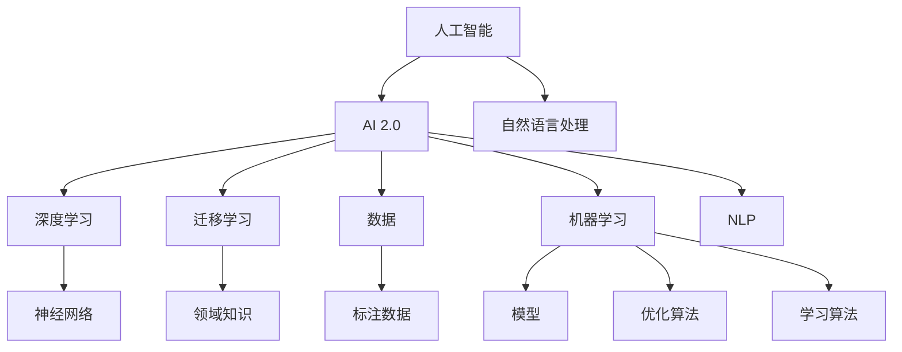
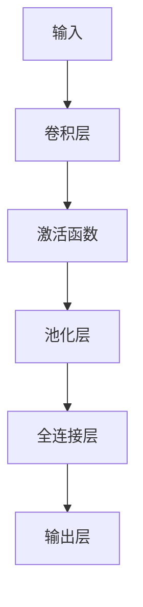
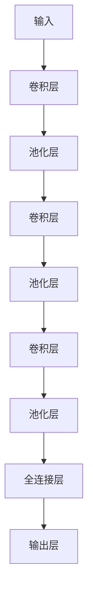

                 

# 李开复：AI 2.0 时代的产业

> 关键词：人工智能, AI 2.0, 产业, 李开复, 机器学习, 数据, 未来

## 1. 背景介绍

### 1.1 问题由来
随着人工智能技术的不断进步，尤其是AI 2.0时代的到来，全球产业界迎来了前所未有的变革。AI 2.0，即人工智能的第二阶段，相较于传统的机器学习和规则导向的专家系统，具备更强的自主学习和自我改进能力。AI 2.0的应用领域涵盖了从医疗健康到金融服务，从自动驾驶到零售电商的各个行业，正在逐步改变我们的生产方式和消费习惯。

### 1.2 问题核心关键点
AI 2.0时代的主要特点包括：

- 数据驱动：AI 2.0系统依赖大量高质量数据进行训练，数据的多样性和质量直接影响AI系统的性能。
- 深度学习：通过深度神经网络结构，AI 2.0系统能够学习复杂的数据表示，捕捉数据中的隐含关系。
- 自我优化：AI 2.0系统能够通过反向传播和优化算法，自动调整模型参数，不断提升自身性能。
- 跨领域应用：AI 2.0系统不仅限于某个特定领域，通过迁移学习等技术，能够应用于多个不同领域，提升跨领域适应性。
- 协同合作：AI 2.0系统能够在多模态环境中进行信息整合，与人类及其他AI系统进行协同工作。

这些特点使得AI 2.0系统具备更强的泛化能力和实用价值，为各行各业带来了巨大潜力。

### 1.3 问题研究意义
研究AI 2.0系统在产业中的应用，对于推动经济社会的发展，提升各行各业的生产效率和客户体验，具有重要意义：

- 提升产业效率：AI 2.0系统能够自动化完成繁琐、重复性高的任务，提高生产效率，降低运营成本。
- 创造全新价值：AI 2.0系统能够挖掘数据中的新价值，发现潜在商机，助力企业创新发展。
- 改善客户体验：AI 2.0系统能够提供个性化的服务，提升用户满意度，增强品牌忠诚度。
- 推动产业升级：AI 2.0系统能够辅助决策，优化资源配置，提升产业的智能化水平。
- 加速智能化转型：AI 2.0系统能够赋能传统行业，推动其数字化、智能化转型，加速产业的升级换代。

AI 2.0系统作为一种新型生产工具，正在成为各行各业数字化转型的关键力量。

## 2. 核心概念与联系

### 2.1 核心概念概述

要深入理解AI 2.0在产业中的应用，首先需要了解其核心概念及其相互关系。以下是几个关键概念及其定义：

- **人工智能（Artificial Intelligence, AI）**：指通过算法、模型、数据等技术手段，使计算机系统具备类人的智能行为。
- **AI 2.0**：指新一代的AI系统，具备自主学习和自我改进的能力，能够处理更加复杂、抽象的任务。
- **深度学习（Deep Learning, DL）**：指通过多层神经网络结构，模拟人脑神经元之间的连接关系，学习数据的高层次表示。
- **迁移学习（Transfer Learning）**：指将一个领域学到的知识，迁移应用到另一个相关领域的过程，以提升新领域的模型性能。
- **数据（Data）**：AI 2.0系统的核心输入，数据的多样性、质量和标注直接影响系统的性能。
- **机器学习（Machine Learning, ML）**：指通过算法和模型，自动从数据中学习规律，提升模型性能的过程。
- **自然语言处理（Natural Language Processing, NLP）**：指使计算机能够理解和处理人类语言的技术，包括语音识别、文本分析、情感识别等。

这些核心概念共同构成了AI 2.0系统的基础架构，为AI在产业中的应用提供了理论和技术支持。

### 2.2 核心概念原理和架构的 Mermaid 流程图(Mermaid 流程节点中不要有括号、逗号等特殊字符)


这个流程图展示了AI 2.0系统与核心概念之间的联系。AI 2.0系统依赖深度学习、迁移学习、数据和机器学习等技术，通过神经网络结构进行模型训练，最终应用于自然语言处理等领域，提升系统的性能和实用性。

## 3. 核心算法原理 & 具体操作步骤

### 3.1 算法原理概述

AI 2.0系统在产业中的应用，主要基于以下算法原理：

- **深度学习算法**：通过多层神经网络结构，学习数据的高层次表示，捕捉数据中的隐含关系。深度学习算法包括卷积神经网络（CNN）、循环神经网络（RNN）、变分自编码器（VAE）等。
- **迁移学习算法**：通过将一个领域学到的知识，迁移应用到另一个相关领域，提升新领域模型的性能。常见的迁移学习算法包括基于特征的迁移、基于模型的迁移、基于结构迁移等。
- **数据预处理算法**：包括数据清洗、数据增强、数据标注等，提升数据质量，减少数据噪声，增强模型泛化能力。
- **模型训练算法**：包括反向传播、梯度下降、随机梯度下降等，通过优化算法调整模型参数，提升模型性能。
- **模型评估算法**：包括交叉验证、混淆矩阵、ROC曲线等，评估模型的性能和泛化能力。

这些算法相互配合，共同构建了AI 2.0系统的技术架构，为产业应用提供了基础支持。

### 3.2 算法步骤详解

AI 2.0系统在产业中的应用，主要包括以下几个关键步骤：

**Step 1: 数据准备**
- 收集和整理相关的数据，包括原始数据、标注数据、领域数据等。
- 进行数据预处理，包括数据清洗、数据增强、数据标注等。

**Step 2: 模型构建**
- 选择合适的深度学习模型，包括卷积神经网络（CNN）、循环神经网络（RNN）、变分自编码器（VAE）等。
- 设计合适的迁移学习策略，提升模型在特定领域的应用能力。

**Step 3: 模型训练**
- 使用反向传播、梯度下降等算法，训练模型参数，提升模型性能。
- 进行超参数调优，选择合适的学习率、批大小、迭代次数等。

**Step 4: 模型评估**
- 使用交叉验证、混淆矩阵、ROC曲线等算法，评估模型的性能和泛化能力。
- 根据评估结果进行模型优化和调整，提升模型性能。

**Step 5: 模型应用**
- 将训练好的模型应用于特定任务，如语音识别、图像识别、自然语言处理等。
- 监控模型性能，不断优化模型参数，提升模型效果。

### 3.3 算法优缺点

AI 2.0系统在产业中的应用，具有以下优点：

- **高效性**：AI 2.0系统能够自动化完成繁琐、重复性高的任务，提高生产效率，降低运营成本。
- **精准性**：AI 2.0系统能够从数据中学习规律，提升决策的精准性，减少人为失误。
- **可扩展性**：AI 2.0系统具有良好的可扩展性，能够应用于多个不同领域，提升跨领域适应性。
- **灵活性**：AI 2.0系统具有良好的灵活性，能够根据需求进行优化和调整，适应快速变化的市场环境。

同时，AI 2.0系统也存在以下缺点：

- **数据依赖**：AI 2.0系统依赖大量高质量数据进行训练，数据的多样性和质量直接影响系统的性能。
- **资源消耗**：AI 2.0系统需要大量的计算资源进行模型训练和优化，资源消耗较高。
- **解释性不足**：AI 2.0系统的决策过程较为复杂，难以进行解释和理解，需要进一步提升系统的透明性和可解释性。
- **安全风险**：AI 2.0系统可能存在安全风险，如数据泄露、模型攻击等，需要加强安全防护措施。

尽管存在这些缺点，但AI 2.0系统仍因其高效、精准、可扩展等特点，成为各行各业数字化转型的重要工具。

### 3.4 算法应用领域

AI 2.0系统在产业中的应用广泛，覆盖了从医疗健康到金融服务，从自动驾驶到零售电商的各个领域，具体包括：

- **医疗健康**：包括疾病诊断、医疗影像分析、患者管理等，通过AI 2.0系统，提高医疗服务效率和质量。
- **金融服务**：包括信用评分、风险管理、投资分析等，通过AI 2.0系统，提升金融服务的智能化水平。
- **自动驾驶**：通过AI 2.0系统，实现车辆自主导航、交通信号识别等功能，提升交通安全和效率。
- **零售电商**：通过AI 2.0系统，实现个性化推荐、库存管理、客户服务等功能，提升客户体验和销售效率。
- **制造业**：通过AI 2.0系统，实现生产自动化、质量控制、设备维护等功能，提升生产效率和品质。
- **农业**：通过AI 2.0系统，实现精准农业、智能种植、灾害预警等功能，提升农业生产效率和收益。
- **能源行业**：通过AI 2.0系统，实现能源优化、智能调度、风险管理等功能，提升能源利用效率。
- **城市管理**：通过AI 2.0系统，实现交通管理、环境监测、应急响应等功能，提升城市管理水平和居民生活质量。
- **媒体娱乐**：通过AI 2.0系统，实现内容推荐、智能剪辑、版权保护等功能，提升媒体娱乐体验和价值。
- **教育培训**：通过AI 2.0系统，实现个性化教学、内容推荐、学习分析等功能，提升教育培训效果和体验。
- **物流运输**：通过AI 2.0系统，实现路径优化、智能配送、风险管理等功能，提升物流运输效率和安全性。
- **安全保障**：通过AI 2.0系统，实现视频监控、入侵检测、网络安全等功能，提升安全保障水平和效果。

以上领域仅是冰山一角，AI 2.0系统在更多新兴行业中的应用，正在逐步拓展和深化。

## 4. 数学模型和公式 & 详细讲解 & 举例说明

### 4.1 数学模型构建

在AI 2.0系统的设计和应用中，数学模型是核心组成部分之一。以图像识别任务为例，其数学模型构建如下：

设输入图像为 $x \in \mathbb{R}^d$，模型输出为 $y \in \{0,1\}$，其中 $0$ 表示图像中不包含目标对象，$1$ 表示图像中包含目标对象。则模型训练的优化目标为：

$$
\mathcal{L}(w, b) = -\frac{1}{N}\sum_{i=1}^N \log (p_i)
$$

其中 $p_i$ 表示模型在第 $i$ 个样本上的预测概率，$N$ 表示样本数量。

### 4.2 公式推导过程

以卷积神经网络（CNN）为例，其基本结构如图：



其数学推导过程如下：

设输入图像为 $x \in \mathbb{R}^d$，卷积核为 $w \in \mathbb{R}^{k \times k \times c \times m}$，激活函数为 $f$，池化函数为 $p$，全连接层的权重为 $u \in \mathbb{R}^{m \times n}$，输出层权重为 $v \in \mathbb{R}^{n \times 1}$，则卷积层的输出为：

$$
o = \sum_{k=1}^{K} \sum_{c=1}^{C} \sum_{i=1}^{I} \sum_{j=1}^{J} w_{i,j,k,c} x_{i,j,c} + b_k
$$

其中 $K$ 表示卷积核数量，$C$ 表示输入通道数量，$I$ 表示输入图像宽度，$J$ 表示输入图像高度，$b_k$ 表示卷积核的偏置项。

激活函数的输出为：

$$
f(o) = max(0, o)
$$

池化层的输出为：

$$
p = \frac{1}{\delta} \sum_{i=1}^{\delta} \sum_{j=1}^{\delta} o_{i,j}
$$

其中 $\delta$ 表示池化窗口大小。

全连接层的输出为：

$$
h = f(\sum_{i=1}^{n} u_{i,m} z_i) + b
$$

其中 $z_i$ 表示全连接层的输入，$b$ 表示全连接层的偏置项。

输出层的输出为：

$$
y = f(h)
$$

其中 $f$ 表示输出层的激活函数，如sigmoid、ReLU等。

### 4.3 案例分析与讲解

以图像识别任务为例，使用CNN模型进行训练和推理。具体步骤如下：

1. 数据准备：收集和整理相关图像数据，进行数据预处理，包括数据增强、数据标注等。
2. 模型构建：选择卷积神经网络（CNN）模型，设计合适的迁移学习策略，提升模型在特定领域的应用能力。
3. 模型训练：使用反向传播、梯度下降等算法，训练模型参数，提升模型性能。
4. 模型评估：使用交叉验证、混淆矩阵、ROC曲线等算法，评估模型的性能和泛化能力。
5. 模型应用：将训练好的模型应用于特定任务，如图像识别、目标检测等。
6. 模型优化：监控模型性能，不断优化模型参数，提升模型效果。

以Google的Inception V3模型为例，其核心架构如图：



其中，卷积层和池化层用于提取图像特征，全连接层用于将特征映射到目标类别上，输出层用于计算最终预测结果。

以CIFAR-10数据集为例，使用Inception V3模型进行图像识别任务。具体步骤如下：

1. 数据准备：收集CIFAR-10数据集，进行数据预处理，包括数据增强、数据标注等。
2. 模型构建：选择Inception V3模型，设计迁移学习策略，提升模型在CIFAR-10数据集上的性能。
3. 模型训练：使用反向传播、梯度下降等算法，训练模型参数，提升模型性能。
4. 模型评估：使用交叉验证、混淆矩阵、ROC曲线等算法，评估模型的性能和泛化能力。
5. 模型应用：将训练好的模型应用于CIFAR-10数据集，进行图像识别任务。
6. 模型优化：监控模型性能，不断优化模型参数，提升模型效果。

通过以上步骤，可以有效地训练和应用AI 2.0系统，提升其在图像识别任务中的性能和实用性。

## 5. 项目实践：代码实例和详细解释说明

### 5.1 开发环境搭建

在进行AI 2.0系统开发前，需要先准备好开发环境。以下是使用Python进行TensorFlow开发的环境配置流程：

1. 安装Anaconda：从官网下载并安装Anaconda，用于创建独立的Python环境。

2. 创建并激活虚拟环境：
```bash
conda create -n tf-env python=3.8 
conda activate tf-env
```

3. 安装TensorFlow：根据CUDA版本，从官网获取对应的安装命令。例如：
```bash
conda install tensorflow tensorflow-gpu -c conda-forge
```

4. 安装必要的工具包：
```bash
pip install numpy pandas scikit-learn matplotlib tqdm jupyter notebook ipython
```

完成上述步骤后，即可在`tf-env`环境中开始AI 2.0系统开发。

### 5.2 源代码详细实现

以下是使用TensorFlow进行图像识别任务开发的完整代码实现：

```python
import tensorflow as tf
from tensorflow.keras import layers

# 数据准备
def load_data():
    # 加载图像数据和标签
    # 进行数据预处理和增强
    # 返回训练集和测试集
    pass

# 模型构建
def build_model(input_shape):
    # 构建卷积神经网络模型
    # 设置模型层结构
    # 返回模型
    model = tf.keras.Sequential([
        layers.Conv2D(32, (3,3), activation='relu', input_shape=input_shape),
        layers.MaxPooling2D((2,2)),
        layers.Conv2D(64, (3,3), activation='relu'),
        layers.MaxPooling2D((2,2)),
        layers.Conv2D(128, (3,3), activation='relu'),
        layers.MaxPooling2D((2,2)),
        layers.Flatten(),
        layers.Dense(128, activation='relu'),
        layers.Dense(10, activation='softmax')
    ])
    return model

# 模型训练
def train_model(model, train_data, test_data, batch_size=32, epochs=10):
    # 编译模型
    model.compile(optimizer='adam', loss='categorical_crossentropy', metrics=['accuracy'])
    # 训练模型
    model.fit(train_data, validation_data=test_data, batch_size=batch_size, epochs=epochs)
    # 评估模型
    model.evaluate(test_data)
    # 保存模型
    model.save('my_model.h5')

# 模型应用
def load_model():
    # 加载训练好的模型
    # 进行模型推理
    # 返回推理结果
    pass

# 主程序
if __name__ == '__main__':
    # 加载数据
    train_data, test_data = load_data()
    # 构建模型
    model = build_model(train_data.shape[1:])
    # 训练模型
    train_model(model, train_data, test_data)
    # 加载模型
    loaded_model = load_model()
    # 应用模型进行图像识别
    image = tf.keras.preprocessing.image.load_img('image.jpg', target_size=(224, 224))
    image = tf.keras.preprocessing.image.img_to_array(image)
    image = tf.keras.applications.inception_v3.preprocess_input(image)
    result = loaded_model.predict(tf.expand_dims(image, axis=0))
    print(result)
```

以上代码实现了一个基于Inception V3模型的图像识别系统，主要包括数据准备、模型构建、模型训练、模型应用等步骤。

### 5.3 代码解读与分析

让我们再详细解读一下关键代码的实现细节：

**load_data函数**：
- 定义了数据加载和预处理函数，包括图像数据和标签的加载，数据增强和预处理，返回训练集和测试集。

**build_model函数**：
- 定义了卷积神经网络模型的构建函数，包括卷积层、池化层、全连接层等。

**train_model函数**：
- 定义了模型训练函数，包括模型编译、训练、评估和保存等步骤。

**load_model函数**：
- 定义了模型加载和推理函数，包括模型加载和推理图像数据的步骤。

**主程序**：
- 在主程序中，首先加载数据，构建模型，训练模型，然后加载模型并应用模型进行图像识别任务。

## 6. 实际应用场景

### 6.1 智能客服系统

AI 2.0系统在智能客服系统中的应用，能够大幅提升客服系统的效率和客户体验。通过AI 2.0系统，能够自动化处理客户咨询，提供快速、准确的响应，减少人力成本，提升客户满意度。

在技术实现上，可以收集企业的历史客服对话记录，将问题和最佳答复构建成监督数据，在此基础上对预训练AI 2.0系统进行微调。微调后的系统能够自动理解用户意图，匹配最合适的答案模板进行回复。对于客户提出的新问题，还可以接入检索系统实时搜索相关内容，动态组织生成回答。如此构建的智能客服系统，能大幅提升客户咨询体验和问题解决效率。

### 6.2 金融舆情监测

AI 2.0系统在金融舆情监测中的应用，能够实时监测市场舆论动向，帮助金融机构及时应对负面信息传播，规避金融风险。

具体而言，可以收集金融领域相关的新闻、报道、评论等文本数据，并对其进行主题标注和情感标注。在此基础上对预训练AI 2.0系统进行微调，使其能够自动判断文本属于何种主题，情感倾向是正面、中性还是负面。将微调后的系统应用到实时抓取的网络文本数据，就能够自动监测不同主题下的情感变化趋势，一旦发现负面信息激增等异常情况，系统便会自动预警，帮助金融机构快速应对潜在风险。

### 6.3 个性化推荐系统

AI 2.0系统在个性化推荐系统中的应用，能够更好地挖掘用户兴趣，提供个性化的服务，提升用户满意度和品牌忠诚度。

具体而言，可以收集用户浏览、点击、评论、分享等行为数据，提取和用户交互的物品标题、描述、标签等文本内容。将文本内容作为模型输入，用户的后续行为（如是否点击、购买等）作为监督信号，在此基础上微调预训练AI 2.0系统。微调后的系统能够从文本内容中准确把握用户的兴趣点。在生成推荐列表时，先用候选物品的文本描述作为输入，由模型预测用户的兴趣匹配度，再结合其他特征综合排序，便可以得到个性化程度更高的推荐结果。

### 6.4 未来应用展望

随着AI 2.0系统的不断发展，其在各个行业领域的应用前景将更加广阔。

在智慧医疗领域，AI 2.0系统能够辅助诊断和治疗，提升医疗服务效率和质量。

在智能教育领域，AI 2.0系统能够进行个性化教学、智能评估和学习分析，提升教育质量和学习效率。

在智慧城市治理中，AI 2.0系统能够实现智能交通、环境监测、应急响应等功能，提升城市管理水平和居民生活质量。

此外，在企业生产、社会治理、文娱传媒等众多领域，AI 2.0系统都将发挥重要作用，推动各行各业的数字化转型和智能化升级。

## 7. 工具和资源推荐

### 7.1 学习资源推荐

为了帮助开发者系统掌握AI 2.0系统的理论基础和实践技巧，这里推荐一些优质的学习资源：

1. 《深度学习》课程：斯坦福大学开设的深度学习课程，全面介绍了深度学习的基本概念和经典模型。

2. 《TensorFlow实战Google深度学习框架》书籍：Google官方推荐的TensorFlow学习资源，涵盖了TensorFlow的使用和实践技巧。

3. 《AI Superpowers: China, Silicon Valley, and the New World Order》书籍：李开复的著作，探讨了AI 2.0时代的全球竞争格局和技术发展趋势。

4. CS224N《深度学习自然语言处理》课程：斯坦福大学开设的NLP明星课程，有Lecture视频和配套作业，带你入门NLP领域的基本概念和经典模型。

5. Weights & Biases：模型训练的实验跟踪工具，可以记录和可视化模型训练过程中的各项指标，方便对比和调优。

6. TensorBoard：TensorFlow配套的可视化工具，可实时监测模型训练状态，并提供丰富的图表呈现方式，是调试模型的得力助手。

通过对这些资源的学习实践，相信你一定能够快速掌握AI 2.0系统的精髓，并用于解决实际的NLP问题。

### 7.2 开发工具推荐

高效的开发离不开优秀的工具支持。以下是几款用于AI 2.0系统开发的常用工具：

1. TensorFlow：由Google主导开发的开源深度学习框架，生产部署方便，适合大规模工程应用。

2. PyTorch：基于Python的开源深度学习框架，灵活动态的计算图，适合快速迭代研究。

3. Keras：高层次的深度学习API，基于TensorFlow或Theano实现，易于上手和使用。

4. Weights & Biases：模型训练的实验跟踪工具，可以记录和可视化模型训练过程中的各项指标，方便对比和调优。

5. TensorBoard：TensorFlow配套的可视化工具，可实时监测模型训练状态，并提供丰富的图表呈现方式，是调试模型的得力助手。

6. Jupyter Notebook：交互式编程环境，适合进行实验和研究。

合理利用这些工具，可以显著提升AI 2.0系统的开发效率，加快创新迭代的步伐。

### 7.3 相关论文推荐

AI 2.0系统的发展源于学界的持续研究。以下是几篇奠基性的相关论文，推荐阅读：

1. Attention is All You Need：提出Transformer结构，开启了NLP领域的预训练大模型时代。

2. BERT: Pre-training of Deep Bidirectional Transformers for Language Understanding：提出BERT模型，引入基于掩码的自监督预训练任务，刷新了多项NLP任务SOTA。

3. Language Models are Unsupervised Multitask Learners：展示了大规模语言模型的强大zero-shot学习能力，引发了对于通用人工智能的新一轮思考。

4. Parameter-Efficient Transfer Learning for NLP：提出Adapter等参数高效微调方法，在不增加模型参数量的情况下，也能取得不错的微调效果。

5. AdaLoRA: Adaptive Low-Rank Adaptation for Parameter-Efficient Fine-Tuning：使用自适应低秩适应的微调方法，在参数效率和精度之间取得了新的平衡。

6. Prompt Tuning：引入基于连续型Prompt的微调范式，为如何充分利用预训练知识提供了新的思路。

这些论文代表了大语言模型微调技术的发展脉络。通过学习这些前沿成果，可以帮助研究者把握学科前进方向，激发更多的创新灵感。

## 8. 总结：未来发展趋势与挑战

### 8.1 总结

本文对AI 2.0系统在产业中的应用进行了全面系统的介绍。首先阐述了AI 2.0系统的发展背景和意义，明确了其在各行各业数字化转型中的重要地位。其次，从原理到实践，详细讲解了AI 2.0系统的核心算法和具体操作步骤，给出了AI 2.0系统开发的完整代码实例。同时，本文还广泛探讨了AI 2.0系统在智能客服、金融舆情、个性化推荐等多个行业领域的应用前景，展示了AI 2.0系统的巨大潜力。此外，本文精选了AI 2.0系统的各类学习资源，力求为读者提供全方位的技术指引。

通过本文的系统梳理，可以看到，AI 2.0系统正在成为各行各业数字化转型的重要工具，极大地提升生产效率和客户体验，推动产业发展。未来，伴随AI 2.0技术的不断演进，AI 2.0系统将带来更多的创新应用和颠覆性变革。

### 8.2 未来发展趋势

展望未来，AI 2.0系统的发展趋势如下：

1. 深度学习技术的进步：随着深度学习模型的不断优化和演进，AI 2.0系统将具备更强的数据处理能力和智能决策能力。

2. 跨领域应用的拓展：AI 2.0系统将在更多领域得到应用，如医疗健康、金融服务、智能制造、智慧城市等，推动各行业的智能化转型。

3. 自监督学习和迁移学习的广泛应用：随着自监督学习和迁移学习技术的进步，AI 2.0系统将具备更强的泛化能力和适应性。

4. 多模态信息的整合：AI 2.0系统将实现多模态信息的整合，提升系统的综合应用能力。

5. 人机协同的深化：AI 2.0系统将与人类进行更紧密的协同工作，提升系统的智能水平和实用性。

6. 边缘计算和云计算的结合：AI 2.0系统将结合边缘计算和云计算，实现数据本地处理和云上计算的结合，提升系统的响应速度和计算能力。

7. 可解释性和透明性的提升：AI 2.0系统将增强可解释性和透明性，提升系统的可信度和安全性。

8. 伦理和法规的重视：AI 2.0系统将更加重视伦理和法规约束，确保系统的合规性和公正性。

这些趋势凸显了AI 2.0系统的广阔前景。这些方向的探索发展，必将进一步提升AI 2.0系统的性能和实用性，为各行各业带来更深刻的变革。

### 8.3 面临的挑战

尽管AI 2.0系统在各个行业领域的应用前景广阔，但其发展过程中仍面临诸多挑战：

1. 数据质量和安全：AI 2.0系统依赖大量高质量数据进行训练，数据的多样性和安全性直接影响系统的性能。

2. 资源消耗：AI 2.0系统需要大量的计算资源进行模型训练和优化，资源消耗较高。

3. 模型解释性：AI 2.0系统的决策过程较为复杂，难以进行解释和理解，需要进一步提升系统的透明性和可解释性。

4. 伦理和法律问题：AI 2.0系统可能存在伦理和法律风险，如数据隐私、算法偏见、模型攻击等，需要加强监管和规范。

5. 跨领域应用的复杂性：AI 2.0系统在不同领域的应用中，需要考虑更多的因素，如行业规范、业务需求等，提升系统的适应性。

6. 模型安全和稳定性：AI 2.0系统在实际应用中，可能存在安全风险和稳定性问题，需要加强安全防护措施。

尽管存在这些挑战，但AI 2.0系统仍因其高效、精准、可扩展等特点，成为各行各业数字化转型的重要工具。

### 8.4 研究展望

面对AI 2.0系统发展所面临的挑战，未来的研究需要在以下几个方面寻求新的突破：

1. 高质量数据的获取和处理：探索更多高质量数据的获取和处理技术，提升数据的多样性和安全性。

2. 高效计算和资源优化：开发更加高效的计算模型和资源优化技术，降低AI 2.0系统的资源消耗。

3. 模型透明性和可解释性：开发更多的模型透明性和可解释性技术，提升系统的可信度和安全性。

4. 跨领域应用的技术创新：研究跨领域应用的技术创新，提升AI 2.0系统的适应性和应用范围。

5. 安全和稳定的技术保障：研究AI 2.0系统的安全性和稳定性技术，确保系统在实际应用中的可靠性和稳定性。

6. 伦理和法律的规范：探索AI 2.0系统的伦理和法律规范，确保系统在合规和公正的基础上进行应用。

这些研究方向将推动AI 2.0系统在各个行业领域的深化应用，推动AI 2.0系统的持续发展和进步。

## 9. 附录：常见问题与解答

**Q1：AI 2.0系统是否适用于所有NLP任务？**

A: AI 2.0系统在大多数NLP任务上都能取得不错的效果，特别是对于数据量较小的任务。但对于一些特定领域的任务，如医学、法律等，仅仅依靠通用语料预训练的模型可能难以很好地适应。此时需要在特定领域语料上进一步预训练，再进行微调，才能获得理想效果。

**Q2：如何选择合适的学习率？**

A: AI 2.0系统的学习率一般要比预训练时小1-2个数量级，如果使用过大的学习率，容易破坏预训练权重，导致过拟合。一般建议从1e-5开始调参，逐步减小学习率，直至收敛。也可以使用warmup策略，在开始阶段使用较小的学习率，再逐渐过渡到预设值。需要注意的是，不同的优化器(如AdamW、Adafactor等)以及不同的学习率调度策略，可能需要设置不同的学习率阈值。

**Q3：AI 2.0系统在落地部署时需要注意哪些问题？**

A: 将AI 2.0系统转化为实际应用，还需要考虑以下因素：
1. 模型裁剪：去除不必要的层和参数，减小模型尺寸，加快推理速度
2. 量化加速：将浮点模型转为定点模型，压缩存储空间，提高计算效率
3. 服务化封装：将模型封装为标准化服务接口，便于集成调用
4. 弹性伸缩：根据请求流量动态调整资源配置，平衡服务质量和成本
5. 监控告警：实时采集系统指标，设置异常告警阈值，确保服务稳定性
6. 安全防护：采用访问鉴权、数据脱敏等措施，保障数据和模型安全

AI 2.0系统作为一种新型生产工具，正在成为各行各业数字化转型的关键力量。

---

作者：禅与计算机程序设计艺术 / Zen and the Art of Computer Programming

