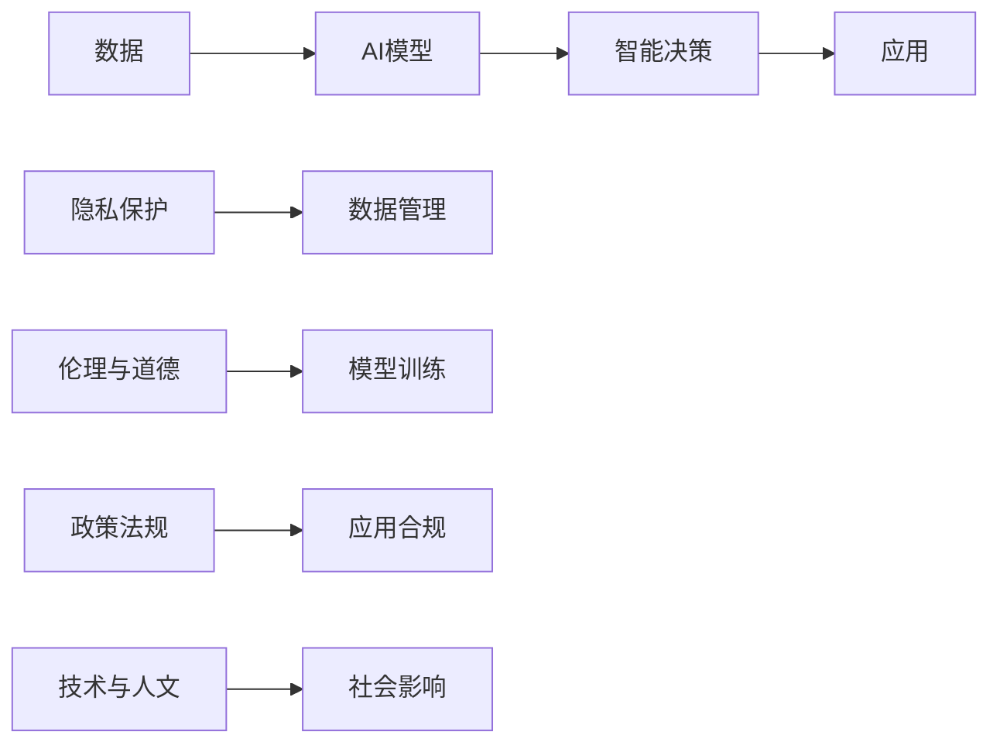

                 

# 李开复：AI 2.0 时代的价值

> 关键词：人工智能, 价值创造, 技术革新, 行业影响, 数据与隐私, 伦理考量, 政策法规

## 1. 背景介绍

### 1.1 问题的由来
自工业革命以来，人类文明经历了从机械化到自动化再到智能化的三次重大变革。当前，人工智能（AI）正引领着人类进入AI 2.0 时代，这场变革不仅涉及技术的发展，更关乎社会和经济结构的全方位重塑。

AI 2.0 时代以数据驱动为核心，依赖于机器学习与深度学习的突破性进展。人工智能通过分析大量数据，能够提供远超人类能力的洞察与预测，进而推动各行各业创新。在此背景下，人工智能的价值创造潜力不断被挖掘，其对社会和经济的深远影响备受关注。

### 1.2 问题的核心关键点
AI 2.0 时代面临的诸多挑战，包括但不限于：
- 数据隐私与安全性：如何在高效利用数据的同时保护用户隐私，防止数据泄露与滥用。
- 伦理与道德：如何构建公平、透明、可解释的人工智能系统，确保其输出符合人类价值观与伦理标准。
- 政策法规：如何制定与执行相关政策法规，引导AI技术健康发展，避免技术滥用。
- 技术与人文结合：如何将AI技术与人文理念深度融合，解决其带来的社会伦理问题。
- 跨行业应用：如何推动AI技术在不同行业中的应用，激发新的商业模式和应用场景。

这些问题关系到AI 2.0 时代的价值能否被最大化地发挥，需要各方共同努力，确保技术的可持续发展。

### 1.3 问题研究意义
研究AI 2.0 时代的价值，对于推动技术发展、保障社会福祉、促进经济增长具有重要意义：

1. **推动技术发展**：明确AI 2.0 时代的价值创造途径，指导技术研究和开发，加速人工智能的创新与进步。
2. **保障社会福祉**：确保AI技术的公平性、透明度与安全性，促进社会和谐与进步。
3. **促进经济增长**：发掘AI技术在各行业中的潜能，推动产业升级和经济结构优化。
4. **应对伦理挑战**：建立健全AI伦理框架，避免技术滥用，促进技术健康发展。

通过对这些核心问题的深入探讨，可以更好地理解AI 2.0 时代的价值，为实现技术的可持续与负责任的增长奠定基础。

## 2. 核心概念与联系

### 2.1 核心概念概述
AI 2.0 时代的关键概念包括：
- **人工智能**：通过模拟人类智能行为，如感知、推理、学习等，实现机器自主决策与执行。
- **数据与隐私**：大数据在AI 2.0 时代扮演核心角色，隐私保护是实现数据高效利用的前提。
- **伦理与道德**：AI系统的设计应遵循公平、透明与可解释性原则，避免歧视与偏见。
- **政策法规**：政府与企业需共同制定并执行相关政策法规，引导AI技术健康发展。
- **技术与人文结合**：AI技术与人类价值观深度融合，解决AI带来的伦理与社会问题。

这些核心概念之间存在紧密联系，通过合理的架构设计，可以实现技术、伦理、法律与社会的有机统一。

### 2.2 核心概念原理和架构的 Mermaid 流程图


此流程图展示了数据如何通过AI模型进行智能决策，并应用于实际场景，同时在隐私保护、伦理道德、政策法规和技术与人文结合等多个层面进行规范与指导。

## 3. 核心算法原理 & 具体操作步骤

### 3.1 算法原理概述
AI 2.0 时代的核心算法包括监督学习、强化学习、迁移学习等。其中，监督学习通过大量标注数据训练模型，使其能够预测新样本的标签；强化学习通过奖励机制优化决策策略；迁移学习则将已有知识迁移到新任务上，加速模型训练。

这些算法通过不同的学习机制，实现了机器在特定任务上的智能决策，推动了各行业的创新与进步。

### 3.2 算法步骤详解
以监督学习为例，核心步骤包括数据准备、模型训练与评估、模型部署与应用：

1. **数据准备**：收集并标注与任务相关的数据集，确保数据的质量与多样性。
2. **模型训练**：选择适合的算法与模型架构，对标注数据进行训练，优化模型参数。
3. **模型评估**：使用验证集或测试集评估模型性能，选择合适的模型进行部署。
4. **模型部署与应用**：将模型部署至实际应用场景，实时处理输入数据并输出结果。

### 3.3 算法优缺点
监督学习的主要优点在于模型训练过程可控，输出结果易于解释。其缺点在于对标注数据的依赖性强，且存在过拟合风险。强化学习和迁移学习则通过不同的机制弥补了这些不足，但实现复杂度较高，对数据与环境的要求也更为严格。

### 3.4 算法应用领域
AI 2.0 时代的算法广泛应用于医疗、金融、制造、教育等行业，推动了各行各业的智能化升级。例如，医疗领域通过AI辅助诊断，提高了疾病诊断的准确性与效率；金融领域利用AI进行风险评估与投资决策，优化了金融产品的设计与服务。

## 4. 数学模型和公式 & 详细讲解

### 4.1 数学模型构建
以监督学习为例，数学模型可表示为：
$$
\mathcal{L}(y,\hat{y}) = \sum_{i=1}^n\ell(y_i,\hat{y}_i)
$$
其中，$y$ 表示真实标签，$\hat{y}$ 表示模型预测结果，$\ell$ 表示损失函数，通常采用交叉熵损失。

### 4.2 公式推导过程
以线性回归模型为例，推导过程如下：
$$
\hat{y} = w_0 + w_1x_1 + w_2x_2 + \dots + w_nx_n
$$
$$
\mathcal{L} = \frac{1}{2}\sum_{i=1}^n(y_i - \hat{y}_i)^2
$$

### 4.3 案例分析与讲解
以机器翻译为例，考虑一个简单的神经网络模型：
$$
\begin{align*}
\text{Encoder} & : y = \text{W}_1x + b_1 \\
\text{Decoder} & : \hat{y} = \text{W}_2\sigma(\text{W}_3y + b_3)
\end{align*}
$$
其中，$x$ 为源语言文本，$y$ 为中间语义表示，$\hat{y}$ 为目标语言文本，$\sigma$ 为激活函数。通过大量双语对照数据进行训练，优化模型参数 $w_1, w_2, w_3, b_1, b_3$，即可实现机器翻译。

## 5. 项目实践：代码实例和详细解释说明

### 5.1 开发环境搭建
首先，需要安装Python 3.7及以上版本，并确保安装TensorFlow 2.x或PyTorch等深度学习框架。同时，安装Scikit-learn、NumPy、Pandas等辅助库，用于数据处理与模型训练。

```bash
pip install tensorflow==2.7.0
pip install scikit-learn
pip install numpy pandas
```

### 5.2 源代码详细实现
以Keras框架为例，实现一个简单的线性回归模型：

```python
from keras.models import Sequential
from keras.layers import Dense

# 定义模型结构
model = Sequential()
model.add(Dense(1, input_dim=1, activation='linear'))

# 编译模型
model.compile(loss='mse', optimizer='adam')

# 训练模型
model.fit(X_train, y_train, epochs=100, batch_size=32, verbose=1)

# 评估模型
model.evaluate(X_test, y_test, batch_size=32, verbose=0)
```

### 5.3 代码解读与分析
- **模型结构定义**：使用Sequential模型，添加一个线性层，输入维度为1，输出维度为1。
- **模型编译**：定义损失函数为均方误差（mse），优化器为Adam。
- **模型训练**：使用训练集数据进行模型训练，设置迭代轮数为100，批大小为32。
- **模型评估**：使用测试集数据评估模型性能。

## 6. 实际应用场景

### 6.1 医疗领域
AI 2.0 在医疗领域的应用包括医学影像分析、药物研发、疾病预测等。例如，通过深度学习算法分析X光、CT影像，辅助医生诊断肿瘤；利用AI进行药物分子结构分析，加速新药研发进程。

### 6.2 金融行业
AI 2.0 在金融领域的应用包括风险评估、投资决策、欺诈检测等。通过机器学习算法分析交易数据，预测市场走势，优化投资组合；利用强化学习算法进行高频交易，提升交易效率。

### 6.3 制造业
AI 2.0 在制造业的应用包括质量检测、供应链优化、设备维护等。通过机器视觉算法检测产品缺陷，提升生产质量；利用优化算法优化供应链管理，降低运营成本；利用传感器数据预测设备故障，减少维护成本。

### 6.4 未来应用展望
未来，AI 2.0 在各行业的应用将更加深入广泛。随着技术的不断进步，AI 2.0 将推动更多的创新应用，如自动驾驶、智能家居、智慧城市等，为人类生活带来更多便利。

## 7. 工具和资源推荐

### 7.1 学习资源推荐
- **Coursera**：提供大量AI相关的在线课程，包括深度学习、机器学习、强化学习等。
- **edX**：提供众多知名大学的AI与数据科学课程，涵盖理论与实践。
- **Kaggle**：数据科学竞赛平台，提供丰富的数据集与竞赛机会，提升实战能力。

### 7.2 开发工具推荐
- **TensorFlow**：由Google主导的开源深度学习框架，支持分布式计算与自动微分。
- **PyTorch**：Facebook开发的深度学习框架，灵活易用，广泛应用于学术界与工业界。
- **Jupyter Notebook**：交互式编程工具，支持多语言编程，适用于数据科学与机器学习任务。

### 7.3 相关论文推荐
- **"Deep Learning" by Ian Goodfellow, Yoshua Bengio, Aaron Courville**：全面介绍深度学习原理与算法，是AI领域必读之作。
- **"Human-Computer Interaction" by Judith Sussman, Jeffrey B. Miller**：深入探讨人机交互界面的设计与实现，为AI技术在实际应用中的用户体验提供指导。
- **"Artificial Intelligence: A Modern Approach" by Stuart Russell, Peter Norvig**：全面介绍AI领域的理论基础与应用实践，是AI学习的经典教材。

## 8. 总结：未来发展趋势与挑战

### 8.1 研究成果总结
AI 2.0 时代的技术发展已取得显著成果，广泛应用于各行业，提升了生产效率与决策质量。但当前仍面临诸多挑战，如数据隐私、伦理道德、政策法规等问题亟待解决。

### 8.2 未来发展趋势
1. **技术进步**：AI 2.0 技术将不断突破，推动更多创新应用的出现。
2. **行业融合**：AI 2.0 在各行业的应用将更加深入，推动产业升级与创新。
3. **伦理考量**：AI伦理框架将不断完善，确保技术的公平性与透明度。
4. **政策法规**：相关政策法规将逐步完善，引导AI技术健康发展。
5. **技术与人文结合**：AI技术与人类价值观深度融合，解决伦理与社会问题。

### 8.3 面临的挑战
1. **数据隐私**：如何在高效利用数据的同时保护用户隐私，防止数据滥用。
2. **伦理道德**：如何构建公平、透明、可解释的AI系统，确保其输出符合人类价值观。
3. **政策法规**：如何制定与执行相关政策法规，确保AI技术的健康发展。
4. **技术与人文结合**：如何将AI技术与人文理念深度融合，解决伦理与社会问题。
5. **跨行业应用**：如何推动AI技术在不同行业中的应用，激发新的商业模式和应用场景。

### 8.4 研究展望
未来，AI 2.0 时代的研究将重点关注以下几个方面：
1. **伦理与道德**：建立健全AI伦理框架，确保AI系统的公平性与透明性。
2. **隐私保护**：开发高效的数据保护技术，保护用户隐私。
3. **跨领域应用**：推动AI技术在更多领域中的应用，解决实际问题。
4. **技术进步**：推动AI技术突破，提升模型性能与可解释性。
5. **政策法规**：制定与执行相关政策法规，引导AI技术的健康发展。

## 9. 附录：常见问题与解答

**Q1：如何理解AI 2.0 时代的价值？**

A: AI 2.0 时代的价值在于其能够通过数据分析与机器学习，实现深度智能决策，推动各行业的创新与升级。这种价值不仅体现在技术进步上，更体现在解决实际问题的能力上。

**Q2：AI 2.0 时代面临的主要挑战是什么？**

A: AI 2.0 时代面临的主要挑战包括数据隐私、伦理道德、政策法规等问题。如何在高效利用数据的同时保护用户隐私，构建公平透明的AI系统，确保技术健康发展，是需要重点关注的课题。

**Q3：AI 2.0 时代的主要应用场景有哪些？**

A: AI 2.0 时代的主要应用场景包括医疗、金融、制造、教育等领域。例如，AI在医疗领域用于医学影像分析、辅助诊断；在金融领域用于风险评估、高频交易；在制造业用于质量检测、设备维护等。

**Q4：AI 2.0 时代的技术与人文结合如何实现？**

A: 实现技术与人文的结合，需要从多个层面入手，如在AI系统设计中引入伦理考量，制定AI伦理框架；在AI算法开发中关注数据隐私，保护用户隐私；在AI应用中注重用户体验，提升人机交互效果。

---

作者：禅与计算机程序设计艺术 / Zen and the Art of Computer Programming

