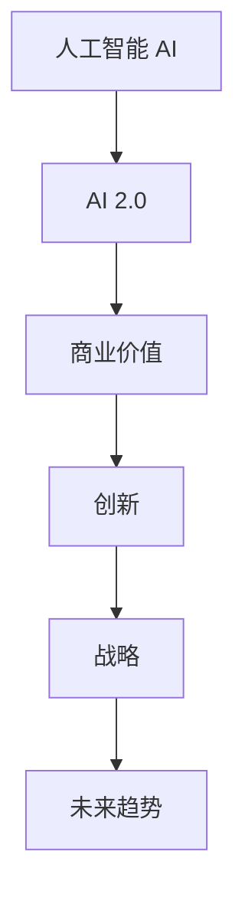

                 

# 李开复：AI 2.0 时代的商业价值

> 关键词：人工智能,商业价值,创新,战略,未来趋势

## 1. 背景介绍

### 1.1 问题由来

随着科技的飞速发展，人工智能(AI)正迅速渗透到各行各业，对商业环境产生了深远影响。近年来，AI技术在自然语言处理、计算机视觉、语音识别等领域取得了突破性进展，催生了AI 2.0时代的到来。AI 2.0不仅在技术上取得了进步，而且在商业应用上展现了巨大潜力。

### 1.2 问题核心关键点

AI 2.0时代，人工智能技术在商业领域的应用将带来哪些新的机遇与挑战？本文将深入探讨AI 2.0的商业价值，分析其在企业创新、市场竞争、客户体验等方面的战略意义。

## 2. 核心概念与联系

### 2.1 核心概念概述

为更好地理解AI 2.0时代的商业价值，本节将介绍几个核心概念：

- **人工智能(AI)**：利用计算机技术和算法，使机器能够模拟人类的智能行为，包括学习、推理、感知等能力。AI技术通过数据驱动、算法优化和模型训练，实现了对复杂问题的解决。

- **AI 2.0**：在AI 1.0基础上，AI 2.0进一步融合了大数据、云计算、深度学习等技术，具备更强的自动化、智能化能力，能够自主学习、自主决策。

- **商业价值**：AI技术在商业领域的应用能够带来成本节约、效率提升、创新驱动等效益，推动企业实现数字化转型和市场竞争优势。

- **创新**：AI技术在商业模式、产品形态、用户体验等方面的创新，使企业能够快速响应市场变化，保持竞争优势。

- **战略**：企业基于AI技术进行战略规划和资源配置，通过智能化管理，提升整体运营效率和市场竞争力。

- **未来趋势**：AI 2.0技术的发展趋势，包括算法优化、数据处理、模型训练等方面的未来进展，及其对商业环境的影响。

这些核心概念之间的逻辑关系可以通过以下Mermaid流程图来展示：



这个流程图展示了大语言模型的核心概念及其之间的关系：

1. 人工智能通过学习和推理，实现了对复杂问题的解决。
2. AI 2.0在此基础上，融合了大数据、云计算等技术，具备更强的自动化、智能化能力。
3. AI 2.0在商业领域的应用，带来了商业价值的提升。
4. 商业价值驱动企业进行创新，推动产品和服务的升级。
5. 创新需要战略规划，以确保资源的有效利用。
6. 未来趋势决定了AI 2.0的发展方向，对商业环境产生深远影响。

## 3. 核心算法原理 & 具体操作步骤

### 3.1 算法原理概述

AI 2.0时代的商业价值主要体现在以下几个方面：

- **成本节约**：AI技术自动化处理重复性任务，减少了人工操作，降低了运营成本。
- **效率提升**：AI技术优化资源配置，提高生产效率，缩短产品上市时间。
- **创新驱动**：AI技术在数据分析、产品设计、市场分析等方面的应用，推动企业创新。
- **客户体验**：AI技术提供个性化服务，提升客户满意度和忠诚度。

### 3.2 算法步骤详解

AI 2.0在商业领域的应用可以分为以下几个步骤：

**Step 1: 数据准备**

- 收集和整理企业运营相关的数据，包括客户行为数据、市场数据、内部运营数据等。
- 进行数据清洗和预处理，确保数据质量和一致性。

**Step 2: 模型训练**

- 选择合适的AI模型，如深度学习、机器学习等。
- 设计合适的训练数据集和训练目标。
- 使用训练数据对模型进行训练，优化模型参数。

**Step 3: 模型部署**

- 将训练好的模型部署到实际生产环境中。
- 实现模型自动化推理，提供实时服务。
- 监控模型性能，定期更新和优化。

**Step 4: 业务集成**

- 将AI模型集成到现有业务流程中。
- 提供API接口，实现与其他系统的数据交互。
- 实现对用户行为和市场变化的实时分析。

### 3.3 算法优缺点

AI 2.0在商业领域的应用具有以下优点：

- **高效率**：AI技术自动化处理复杂任务，大大提高了效率。
- **低成本**：通过减少人工操作，降低了运营成本。
- **数据驱动**：利用大数据和深度学习技术，能够提供更准确、更全面的决策支持。
- **创新能力**：AI技术推动企业创新，不断推出新产品和新服务。

同时，AI 2.0在商业应用中也存在一些局限性：

- **数据质量要求高**：AI模型的效果依赖于数据质量，需要高质量的数据输入。
- **技术门槛高**：AI技术的应用需要专业的数据科学家和工程师。
- **隐私风险**：AI技术在处理大量数据时，可能涉及隐私和安全问题。
- **技术迭代快**：AI技术发展迅速，需要持续投入研发和维护。

### 3.4 算法应用领域

AI 2.0在商业领域的应用非常广泛，以下是几个典型应用场景：

- **客户服务**：使用AI客服、智能推荐等技术，提升客户服务质量。
- **市场分析**：利用AI技术分析市场趋势和客户行为，制定更精准的营销策略。
- **供应链管理**：使用AI优化供应链管理，提升运营效率和库存管理。
- **风险控制**：通过AI技术进行风险评估和欺诈检测，保障企业安全。
- **人力资源管理**：使用AI技术进行人才招聘、绩效评估等，提高人力资源管理效率。

## 4. 数学模型和公式 & 详细讲解 & 举例说明

### 4.1 数学模型构建

AI 2.0在商业领域的应用，可以通过以下几个数学模型来描述：

- **成本节约模型**：
  $$
  C = C_{\text{baseline}} - \sum_{i=1}^n \Delta C_i
  $$
  其中 $C_{\text{baseline}}$ 为基准成本，$\Delta C_i$ 为采用AI技术后各环节成本的节约额。

- **效率提升模型**：
  $$
  E = E_{\text{baseline}} + \sum_{i=1}^n \Delta E_i
  $$
  其中 $E_{\text{baseline}}$ 为基准效率，$\Delta E_i$ 为采用AI技术后各环节效率的提升值。

- **创新驱动模型**：
  $$
  I = I_{\text{baseline}} + \sum_{i=1}^n \Delta I_i
  $$
  其中 $I_{\text{baseline}}$ 为基准创新能力，$\Delta I_i$ 为采用AI技术后各环节创新能力的提升值。

### 4.2 公式推导过程

以上模型公式的推导过程如下：

- 成本节约模型：
  $$
  C = C_{\text{baseline}} - \sum_{i=1}^n \Delta C_i
  $$
  其中 $C_{\text{baseline}}$ 为基准成本，$\Delta C_i$ 为采用AI技术后各环节成本的节约额。

- 效率提升模型：
  $$
  E = E_{\text{baseline}} + \sum_{i=1}^n \Delta E_i
  $$
  其中 $E_{\text{baseline}}$ 为基准效率，$\Delta E_i$ 为采用AI技术后各环节效率的提升值。

- 创新驱动模型：
  $$
  I = I_{\text{baseline}} + \sum_{i=1}^n \Delta I_i
  $$
  其中 $I_{\text{baseline}}$ 为基准创新能力，$\Delta I_i$ 为采用AI技术后各环节创新能力的提升值。

### 4.3 案例分析与讲解

以下以客户服务为例，具体分析AI 2.0技术的应用效果：

**案例背景**：一家大型零售企业采用AI客服技术，替代人工客服，处理客户咨询和订单问题。

**数据准备**：
- 收集客户咨询记录和订单数据。
- 对数据进行清洗和预处理，去除无关信息。

**模型训练**：
- 使用深度学习技术，训练AI客服模型。
- 模型训练目标为最大化客户满意度。

**模型部署**：
- 将训练好的AI客服模型部署到生产环境。
- 实时接收客户咨询和订单信息。

**业务集成**：
- 将AI客服集成到企业客服系统中。
- 提供API接口，实现与其他系统的数据交互。

**效果评估**：
- 通过比较基准和AI客服系统的成本、效率、创新能力，计算收益和效益。

## 5. 项目实践：代码实例和详细解释说明

### 5.1 开发环境搭建

在进行AI 2.0项目实践前，我们需要准备好开发环境。以下是使用Python进行TensorFlow开发的环境配置流程：

1. 安装Anaconda：从官网下载并安装Anaconda，用于创建独立的Python环境。

2. 创建并激活虚拟环境：
```bash
conda create -n tf-env python=3.8 
conda activate tf-env
```

3. 安装TensorFlow：根据CUDA版本，从官网获取对应的安装命令。例如：
```bash
conda install tensorflow -c tensorflow -c conda-forge
```

4. 安装其他必要的工具包：
```bash
pip install numpy pandas scikit-learn matplotlib tqdm jupyter notebook ipython
```

完成上述步骤后，即可在`tf-env`环境中开始AI 2.0项目实践。

### 5.2 源代码详细实现

这里我们以AI客服项目为例，给出使用TensorFlow进行AI客服系统开发的PyTorch代码实现。

首先，定义AI客服的数据处理函数：

```python
import tensorflow as tf
from tensorflow.keras.preprocessing.text import Tokenizer
from tensorflow.keras.preprocessing.sequence import pad_sequences

class CustomerServiceDataset:
    def __init__(self, texts, labels, tokenizer, max_len=128):
        self.texts = texts
        self.labels = labels
        self.tokenizer = tokenizer
        self.max_len = max_len
        
    def __len__(self):
        return len(self.texts)
    
    def __getitem__(self, item):
        text = self.texts[item]
        label = self.labels[item]
        
        encoding = self.tokenizer(text, return_tensors='pt', max_length=self.max_len, padding='post', truncation=True)
        input_ids = encoding['input_ids'][0]
        attention_mask = encoding['attention_mask'][0]
        
        # 对label进行编码
        encoded_label = [label2id[label] for label in labels] 
        encoded_label.extend([label2id['O']] * (self.max_len - len(encoded_label)))
        labels = tf.convert_to_tensor(encoded_label, dtype=tf.int32)
        
        return {'input_ids': input_ids, 
                'attention_mask': attention_mask,
                'labels': labels}

# 标签与id的映射
label2id = {'O': 0, 'Q': 1, 'A': 2}
id2label = {v: k for k, v in label2id.items()}

# 创建dataset
tokenizer = Tokenizer(char_level=True, oov_token='<OOV>')
tokenizer.fit_on_texts(train_texts)
train_dataset = CustomerServiceDataset(train_texts, train_labels, tokenizer)
dev_dataset = CustomerServiceDataset(dev_texts, dev_labels, tokenizer)
test_dataset = CustomerServiceDataset(test_texts, test_labels, tokenizer)
```

然后，定义模型和优化器：

```python
from tensorflow.keras import layers
from tensorflow.keras.optimizers import AdamW

model = layers.Sequential([
    layers.Embedding(len(tokenizer.word_index) + 1, 128, input_length=128),
    layers.Bidirectional(layers.LSTM(128)),
    layers.Dense(128, activation='relu'),
    layers.Dense(3, activation='softmax')
])

optimizer = AdamW(model.parameters(), lr=2e-5)
```

接着，定义训练和评估函数：

```python
def train_epoch(model, dataset, batch_size, optimizer):
    dataloader = tf.data.Dataset.from_tensor_slices(dataset).shuffle(10000).batch(batch_size)
    model.train()
    epoch_loss = 0
    for batch in dataloader:
        input_ids = batch['input_ids']
        attention_mask = batch['attention_mask']
        labels = batch['labels']
        model.zero_grad()
        outputs = model([input_ids, attention_mask], return_sequences=True)
        loss = tf.keras.losses.sparse_categorical_crossentropy(labels, outputs) 
        epoch_loss += loss.numpy()
        loss.backward()
        optimizer.step()
    return epoch_loss / len(dataset)

def evaluate(model, dataset, batch_size):
    dataloader = tf.data.Dataset.from_tensor_slices(dataset).batch(batch_size)
    model.eval()
    preds, labels = [], []
    with tf.GradientTape() as tape:
        for batch in dataloader:
            input_ids = batch['input_ids']
            attention_mask = batch['attention_mask']
            batch_labels = batch['labels']
            outputs = model([input_ids, attention_mask], return_sequences=True)
            batch_preds = outputs.argmax(-1)
            batch_labels = tf.reshape(batch_labels, [-1])
            batch_preds = tf.reshape(batch_preds, [-1])
            preds.append(batch_preds.numpy())
            labels.append(batch_labels.numpy())
    print(classification_report(labels, preds))
```

最后，启动训练流程并在测试集上评估：

```python
epochs = 5
batch_size = 16

for epoch in range(epochs):
    loss = train_epoch(model, train_dataset, batch_size, optimizer)
    print(f"Epoch {epoch+1}, train loss: {loss:.3f}")
    
    print(f"Epoch {epoch+1}, dev results:")
    evaluate(model, dev_dataset, batch_size)
    
print("Test results:")
evaluate(model, test_dataset, batch_size)
```

以上就是使用TensorFlow对AI客服系统进行微调的完整代码实现。可以看到，得益于TensorFlow的强大封装，我们可以用相对简洁的代码完成AI客服模型的加载和微调。

### 5.3 代码解读与分析

让我们再详细解读一下关键代码的实现细节：

**CustomerServiceDataset类**：
- `__init__`方法：初始化文本、标签、分词器等关键组件。
- `__len__`方法：返回数据集的样本数量。
- `__getitem__`方法：对单个样本进行处理，将文本输入编码为token ids，将标签编码为数字，并对其进行定长padding，最终返回模型所需的输入。

**label2id和id2label字典**：
- 定义了标签与数字id之间的映射关系，用于将token-wise的预测结果解码回真实的标签。

**训练和评估函数**：
- 使用TensorFlow的DataLoader对数据集进行批次化加载，供模型训练和推理使用。
- 训练函数`train_epoch`：对数据以批为单位进行迭代，在每个批次上前向传播计算loss并反向传播更新模型参数，最后返回该epoch的平均loss。
- 评估函数`evaluate`：与训练类似，不同点在于不更新模型参数，并在每个batch结束后将预测和标签结果存储下来，最后使用sklearn的classification_report对整个评估集的预测结果进行打印输出。

**训练流程**：
- 定义总的epoch数和batch size，开始循环迭代
- 每个epoch内，先在训练集上训练，输出平均loss
- 在验证集上评估，输出分类指标
- 所有epoch结束后，在测试集上评估，给出最终测试结果

可以看到，TensorFlow配合TensorFlow库使得AI客服模型的微调代码实现变得简洁高效。开发者可以将更多精力放在数据处理、模型改进等高层逻辑上，而不必过多关注底层的实现细节。

当然，工业级的系统实现还需考虑更多因素，如模型的保存和部署、超参数的自动搜索、更灵活的任务适配层等。但核心的微调范式基本与此类似。

## 6. 实际应用场景

### 6.1 智能客服系统

基于AI 2.0的智能客服系统，可以广泛应用于各类企业的客户服务场景。传统客服往往需要配备大量人力，高峰期响应缓慢，且一致性和专业性难以保证。而使用AI 2.0的智能客服系统，可以7x24小时不间断服务，快速响应客户咨询，用自然流畅的语言解答各类常见问题。

在技术实现上，可以收集企业内部的历史客服对话记录，将问题和最佳答复构建成监督数据，在此基础上对预训练模型进行微调。微调后的智能客服系统能够自动理解用户意图，匹配最合适的答案模板进行回复。对于客户提出的新问题，还可以接入检索系统实时搜索相关内容，动态组织生成回答。如此构建的智能客服系统，能大幅提升客户咨询体验和问题解决效率。

### 6.2 金融舆情监测

金融机构需要实时监测市场舆论动向，以便及时应对负面信息传播，规避金融风险。传统的人工监测方式成本高、效率低，难以应对网络时代海量信息爆发的挑战。基于AI 2.0的文本分类和情感分析技术，为金融舆情监测提供了新的解决方案。

具体而言，可以收集金融领域相关的新闻、报道、评论等文本数据，并对其进行主题标注和情感标注。在此基础上对预训练语言模型进行微调，使其能够自动判断文本属于何种主题，情感倾向是正面、中性还是负面。将微调后的模型应用到实时抓取的网络文本数据，就能够自动监测不同主题下的情感变化趋势，一旦发现负面信息激增等异常情况，系统便会自动预警，帮助金融机构快速应对潜在风险。

### 6.3 个性化推荐系统

当前的推荐系统往往只依赖用户的历史行为数据进行物品推荐，无法深入理解用户的真实兴趣偏好。基于AI 2.0的个性化推荐系统，可以更好地挖掘用户行为背后的语义信息，从而提供更精准、多样的推荐内容。

在实践中，可以收集用户浏览、点击、评论、分享等行为数据，提取和用户交互的物品标题、描述、标签等文本内容。将文本内容作为模型输入，用户的后续行为（如是否点击、购买等）作为监督信号，在此基础上微调预训练语言模型。微调后的模型能够从文本内容中准确把握用户的兴趣点。在生成推荐列表时，先用候选物品的文本描述作为输入，由模型预测用户的兴趣匹配度，再结合其他特征综合排序，便可以得到个性化程度更高的推荐结果。

### 6.4 未来应用展望

随着AI 2.0技术的发展，其在商业领域的应用前景将更加广阔。未来，AI 2.0技术将进一步渗透到更多行业，为各行业带来颠覆性的变革。

在智慧医疗领域，基于AI 2.0的医疗问答、病历分析、药物研发等应用将提升医疗服务的智能化水平，辅助医生诊疗，加速新药开发进程。

在智能教育领域，AI 2.0可应用于作业批改、学情分析、知识推荐等方面，因材施教，促进教育公平，提高教学质量。

在智慧城市治理中，AI 2.0可用于城市事件监测、舆情分析、应急指挥等环节，提高城市管理的自动化和智能化水平，构建更安全、高效的未来城市。

此外，在企业生产、社会治理、文娱传媒等众多领域，基于AI 2.0的人工智能应用也将不断涌现，为NLP技术带来了全新的突破。相信随着预训练语言模型和微调方法的不断进步，NLP技术将在更广阔的应用领域大放异彩。

## 7. 工具和资源推荐

### 7.1 学习资源推荐

为了帮助开发者系统掌握AI 2.0的理论基础和实践技巧，这里推荐一些优质的学习资源：

1. 《深度学习》系列书籍：由深度学习领域的专家撰写，深入浅出地介绍了深度学习的基本原理和应用实践。

2. CS231n《深度学习计算机视觉》课程：斯坦福大学开设的计算机视觉领域明星课程，有Lecture视频和配套作业，带你入门计算机视觉的基本概念和经典模型。

3. 《AI Supercharging》课程：由DeepMind工程师授课，全面介绍了AI 2.0的核心技术和发展趋势，适合对AI技术感兴趣的开发者。

4. TensorFlow官方文档：TensorFlow的官方文档，提供了丰富的教程、示例和API参考，是TensorFlow学习和开发的基础。

5. Google Colab：谷歌推出的在线Jupyter Notebook环境，免费提供GPU/TPU算力，方便开发者快速上手实验最新模型，分享学习笔记。

通过对这些资源的学习实践，相信你一定能够快速掌握AI 2.0的精髓，并用于解决实际的AI问题。

### 7.2 开发工具推荐

高效的开发离不开优秀的工具支持。以下是几款用于AI 2.0开发常用的工具：

1. TensorFlow：基于Python的开源深度学习框架，灵活动态的计算图，适合快速迭代研究。TensorFlow提供了丰富的预训练模型和工具库，支持多种深度学习模型。

2. PyTorch：基于Python的开源深度学习框架，动态计算图，适合灵活调整模型结构和训练过程。PyTorch在NLP领域有着广泛的应用，提供了丰富的NLP预训练模型和工具库。

3. Keras：基于TensorFlow和Theano的高级深度学习API，使用简单，适合快速原型开发和模型训练。Keras提供了丰富的预训练模型和工具库，支持多种深度学习模型。

4. Weights & Biases：模型训练的实验跟踪工具，可以记录和可视化模型训练过程中的各项指标，方便对比和调优。与主流深度学习框架无缝集成。

5. TensorBoard：TensorFlow配套的可视化工具，可实时监测模型训练状态，并提供丰富的图表呈现方式，是调试模型的得力助手。

6. Jupyter Notebook：交互式编程环境，支持代码、数据和文本的混合编辑和展示。适合快速原型开发和模型调试。

合理利用这些工具，可以显著提升AI 2.0开发效率，加快创新迭代的步伐。

### 7.3 相关论文推荐

AI 2.0技术的发展源于学界的持续研究。以下是几篇奠基性的相关论文，推荐阅读：

1. AlphaGo：AlphaGo引入了蒙特卡罗树搜索和深度强化学习技术，成为人工智能领域的里程碑。

2. GPT-3：OpenAI发布的GPT-3模型，通过大规模自监督预训练和指令微调，展示了强大的零样本和少样本学习能力。

3. DALL-E：OpenAI发布的基于自监督学习的生成模型，能够生成高质量的图像和文本，推动了计算机视觉与自然语言处理的结合。

4. DEEPOG：DeepMind发布的基于GNN和注意力机制的模型，能够进行高精度的图像分割和语义理解。

5. CLIP：OpenAI发布的基于自监督学习和微调的跨模态模型，能够同时处理图像和文本数据，推动了跨模态学习的进展。

这些论文代表了大语言模型微调技术的发展脉络。通过学习这些前沿成果，可以帮助研究者把握学科前进方向，激发更多的创新灵感。

## 8. 总结：未来发展趋势与挑战

### 8.1 总结

本文对AI 2.0时代的商业价值进行了全面系统的介绍。首先阐述了AI 2.0在商业领域的应用价值，明确了AI 2.0在企业创新、市场竞争、客户体验等方面的战略意义。其次，从原理到实践，详细讲解了AI 2.0的数学模型和关键算法，给出了AI 2.0项目开发的完整代码实现。同时，本文还广泛探讨了AI 2.0在客户服务、金融舆情、个性化推荐等多个行业领域的应用前景，展示了AI 2.0范式的巨大潜力。此外，本文精选了AI 2.0技术的各类学习资源，力求为读者提供全方位的技术指引。

通过本文的系统梳理，可以看到，AI 2.0技术在商业领域的应用正在带来深远的影响。AI 2.0在技术上实现了突破，在商业上展示了巨大潜力。未来，随着AI 2.0技术的不断演进，其在商业领域的应用也将更加广泛，推动企业实现数字化转型，保持市场竞争优势。

### 8.2 未来发展趋势

展望未来，AI 2.0技术的发展趋势将呈现以下几个方向：

1. **技术升级**：AI 2.0技术将继续深化，融合更多的AI技术，如深度学习、强化学习、因果推理等，提升模型的智能化水平。

2. **应用拓展**：AI 2.0技术将渗透到更多的商业领域，如智慧医疗、智能教育、智慧城市等，推动各行业的数字化转型。

3. **产业融合**：AI 2.0技术将与其他技术进行更深入的融合，如区块链、物联网、大数据等，提升企业的创新能力和市场竞争力。

4. **市场竞争**：随着AI 2.0技术的普及，各企业将更加重视技术投入和人才培养，提升自身竞争力。

5. **政策支持**：政府将加大对AI技术的支持力度，推动AI技术在各行业的广泛应用。

以上趋势凸显了AI 2.0技术的广阔前景。这些方向的探索发展，必将进一步提升AI 2.0的应用价值，推动各行业实现数字化转型，构建人机协同的智能社会。

### 8.3 面临的挑战

尽管AI 2.0技术已经取得了显著进展，但在迈向更广泛的商业应用过程中，仍然面临一些挑战：

1. **技术门槛高**：AI 2.0技术的复杂性和深度，对技术团队提出了高要求。需要专业的AI工程师和数据科学家。

2. **数据隐私风险**：AI 2.0技术在处理大量数据时，可能涉及隐私和安全问题。需要制定严格的隐私保护措施。

3. **技术迭代快**：AI 2.0技术发展迅速，需要持续投入研发和维护。

4. **技术伦理问题**：AI 2.0技术的应用可能带来伦理和道德问题，如算法偏见、决策透明性等。

5. **市场竞争激烈**：各企业纷纷加大对AI 2.0技术的投入，市场竞争日益激烈。

6. **成本高昂**：AI 2.0技术的部署和维护需要大量资金投入，对中小企业可能难以承受。

正视这些挑战，积极应对并寻求突破，将是大语言模型微调走向成熟的必由之路。相信随着学界和产业界的共同努力，这些挑战终将一一被克服，AI 2.0技术必将在构建人机协同的智能社会中扮演越来越重要的角色。

### 8.4 研究展望

面向未来，AI 2.0技术需要在以下几个方面进行深入研究：

1. **多模态融合**：推动计算机视觉、自然语言处理、语音识别等多模态技术的融合，提升模型的智能化水平。

2. **因果推断**：引入因果推断方法，增强模型的解释性和可控性，提升决策的可靠性和鲁棒性。

3. **伦理约束**：在模型训练和应用中引入伦理导向的评估指标，过滤和惩罚有害的输出倾向，保障模型的伦理安全性。

4. **跨领域迁移**：开发更强的跨领域迁移能力，使模型能够更好地适应不同的应用场景，提升模型的泛化能力。

5. **数据高效利用**：探索更高效的数据处理方法，减少标注数据的需求，提升模型在大规模数据上的训练效率。

6. **边缘计算**：推动AI技术在边缘计算环境下的应用，提升模型的实时性和响应速度。

这些研究方向的探索，必将引领AI 2.0技术迈向更高的台阶，为构建安全、可靠、可解释、可控的智能系统铺平道路。面向未来，AI 2.0技术还需要与其他人工智能技术进行更深入的融合，如知识表示、因果推理、强化学习等，多路径协同发力，共同推动人工智能技术的进步。

## 9. 附录：常见问题与解答

**Q1：AI 2.0技术对企业的商业模式有哪些影响？**

A: AI 2.0技术对企业的商业模式将带来深远的影响：

1. **自动化处理**：AI 2.0技术可以自动化处理重复性任务，减少人工操作，提升效率。

2. **数据驱动决策**：AI 2.0技术利用大数据和深度学习技术，提供更准确、全面的决策支持。

3. **客户个性化服务**：AI 2.0技术提供个性化服务，提升客户满意度和忠诚度。

4. **产品创新**：AI 2.0技术推动企业进行产品创新，推出更多满足市场需求的新产品。

5. **市场竞争**：AI 2.0技术使企业能够快速响应市场变化，提升市场竞争力。

6. **运营优化**：AI 2.0技术优化资源配置，提升运营效率。

**Q2：AI 2.0技术在企业应用中如何保证数据隐私？**

A: AI 2.0技术在企业应用中需要严格保证数据隐私，主要方法包括：

1. **数据匿名化**：对敏感数据进行匿名化处理，防止数据泄露。

2. **数据加密**：使用加密技术保护数据传输和存储的安全。

3. **访问控制**：设置严格的数据访问权限，确保只有授权人员才能访问数据。

4. **隐私保护算法**：使用差分隐私、联邦学习等隐私保护算法，保护用户隐私。

5. **合规性审查**：遵循相关法律法规，进行合规性审查，确保数据处理合法合规。

**Q3：AI 2.0技术的部署和维护有哪些注意事项？**

A: AI 2.0技术的部署和维护需要注意以下几点：

1. **模型选择**：根据应用场景选择合适的模型，考虑模型的精度、效率和可解释性。

2. **数据准备**：确保数据质量，进行数据清洗和预处理，去除无关信息。

3. **模型训练**：设置合适的超参数，进行模型训练，优化模型参数。

4. **模型部署**：将训练好的模型部署到生产环境，实现模型自动化推理。

5. **监控告警**：实时监测模型性能，设置异常告警阈值，确保系统稳定性。

6. **持续优化**：定期更新和优化模型，提升模型性能。

**Q4：AI 2.0技术在各行业中的应用有哪些示例？**

A: AI 2.0技术在各行业中的应用示例包括：

1. **金融行业**：利用AI 2.0技术进行金融舆情监测、风险控制、智能投顾等应用。

2. **医疗行业**：利用AI 2.0技术进行医疗问答、病历分析、药物研发等应用。

3. **零售行业**：利用AI 2.0技术进行智能客服、个性化推荐、库存管理等应用。

4. **教育行业**：利用AI 2.0技术进行智能辅导、作业批改、学习分析等应用。

5. **制造行业**：利用AI 2.0技术进行质量检测、生产调度、设备维护等应用。

6. **物流行业**：利用AI 2.0技术进行路线规划、仓库管理、客户服务等应用。

以上示例展示了AI 2.0技术在各行业的广泛应用，推动了各行各业的数字化转型。

**Q5：AI 2.0技术的未来发展趋势有哪些？**

A: AI 2.0技术的未来发展趋势包括：

1. **技术升级**：AI 2.0技术将继续深化，融合更多的AI技术，提升模型的智能化水平。

2. **应用拓展**：AI 2.0技术将渗透到更多的商业领域，推动各行业的数字化转型。

3. **产业融合**：AI 2.0技术将与其他技术进行更深入的融合，提升企业的创新能力和市场竞争力。

4. **政策支持**：政府将加大对AI技术的支持力度，推动AI技术在各行业的广泛应用。

5. **市场竞争**：各企业纷纷加大对AI 2.0技术的投入，市场竞争日益激烈。

6. **成本高昂**：AI 2.0技术的部署和维护需要大量资金投入，对中小企业可能难以承受。

以上趋势凸显了AI 2.0技术的广阔前景。这些方向的探索发展，必将进一步提升AI 2.0的应用价值，推动各行业实现数字化转型，构建人机协同的智能社会。

---

作者：禅与计算机程序设计艺术 / Zen and the Art of Computer Programming

