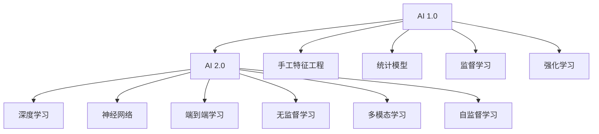

                 

## 1. 背景介绍

### 1.1 问题由来
随着人工智能(AI)技术的飞速发展，AI正在逐渐成为商业创新的关键驱动力。特别是在AI 2.0时代，AI正从研究领域走向实际应用，各行各业都在探索AI的商业化潜力。本文将探讨AI 2.0时代下，AI技术的商业价值，并分析如何通过AI技术实现商业创新。

### 1.2 问题核心关键点
AI 2.0时代的商业价值主要体现在以下几个方面：

- 提高运营效率：AI可以自动化处理许多重复性任务，释放人力资源，提升工作效率。
- 精准预测分析：AI算法可以分析大量数据，提供精准的市场趋势和客户行为预测。
- 个性化服务：AI可以根据用户行为和偏好，提供定制化服务，提升用户体验。
- 创新产品和服务：AI技术可以推动产品和服务创新，引领新一轮的产业变革。
- 数据驱动决策：AI可以基于数据驱动的洞察，辅助管理决策，提升决策质量。

### 1.3 问题研究意义
理解AI 2.0时代的商业价值，对于企业洞察AI应用场景，制定有效的AI策略具有重要意义：

- 帮助企业识别AI潜在的商业机会，制定AI应用计划。
- 提升企业的竞争力，使企业在市场竞争中保持领先。
- 加速AI技术的落地应用，推动企业数字化转型。
- 实现商业模式的创新，开辟新的市场空间。
- 推动AI技术的普及，提升全社会的AI应用水平。

## 2. 核心概念与联系

### 2.1 核心概念概述

在探讨AI 2.0时代的商业价值时，需先了解以下几个核心概念：

- **人工智能**：指通过计算机程序实现的人类智能功能，包括学习、推理、感知、自然语言处理等。
- **AI 1.0**：即传统的数据驱动机器学习，主要依赖手工特征工程和统计模型。
- **AI 2.0**：即基于深度学习（尤其是神经网络）的端到端学习，无需手工特征工程，具有更强的泛化能力和自适应能力。
- **AI 3.0**：即通用人工智能，能够处理各种复杂任务，具有高度的自主性和可解释性。

### 2.2 核心概念原理和架构的 Mermaid 流程图



这个流程图展示了AI 1.0和AI 2.0在特征工程、学习方式、学习目标等方面的区别。AI 2.0通过深度学习和神经网络，实现了更强的自适应能力和泛化能力，特别适合大规模数据和大规模应用场景。

## 3. 核心算法原理 & 具体操作步骤

### 3.1 算法原理概述

AI 2.0时代的商业价值主要体现在其高效、精准、个性化的数据处理和应用能力上。AI算法通过深度学习和神经网络，可以从大量数据中学习到复杂的模式和规律，提供精准的预测和决策支持。

AI 2.0算法主要包括以下几个关键步骤：

1. **数据预处理**：清洗、处理和特征工程，准备训练数据。
2. **模型训练**：使用深度学习算法在大量数据上训练模型，学习复杂模式。
3. **模型评估**：通过测试集对模型进行评估，优化模型参数。
4. **模型部署**：将训练好的模型部署到生产环境，进行实时推理和预测。

### 3.2 算法步骤详解

以推荐系统为例，展示AI 2.0算法的操作步骤：

**Step 1: 数据预处理**

1. **数据收集**：收集用户行为数据（如点击、购买、评分等）。
2. **数据清洗**：处理缺失值、异常值，去除噪声数据。
3. **特征工程**：提取用户特征（如年龄、性别、兴趣等）和物品特征（如价格、类别、评分等）。

**Step 2: 模型训练**

1. **选择模型**：选择适合推荐系统的模型，如协同过滤、矩阵分解等。
2. **设置参数**：确定学习率、正则化参数等超参数。
3. **模型训练**：使用优化算法（如梯度下降）训练模型，最小化损失函数。

**Step 3: 模型评估**

1. **选择指标**：如准确率、召回率、F1值等，评估模型效果。
2. **交叉验证**：将数据集分为训练集和验证集，使用交叉验证方法优化模型。

**Step 4: 模型部署**

1. **模型部署**：将训练好的模型部署到服务器，使用实时数据进行推理。
2. **性能监控**：实时监控模型性能，调整参数和优化模型。

### 3.3 算法优缺点

AI 2.0算法具有以下优点：

- **高效性**：深度学习和神经网络可以处理大量数据，高效提取复杂特征。
- **自适应性**：能够自动学习数据中的模式，适应数据分布变化。
- **泛化能力**：通过大量的数据训练，模型可以泛化到未见过的数据。

同时，AI 2.0算法也存在一些缺点：

- **资源需求高**：需要大量的计算资源和存储空间。
- **模型复杂**：模型的复杂度较高，难以解释和调试。
- **数据依赖强**：模型依赖高质量的数据，数据偏差可能影响模型效果。

### 3.4 算法应用领域

AI 2.0算法已经在多个领域得到了广泛应用，如金融、零售、医疗、智能制造等。以下是一些典型的应用场景：

1. **金融风控**：使用AI算法进行信用评估、风险预警和反欺诈检测，提升金融安全性。
2. **智能客服**：利用自然语言处理和机器学习，提供自动化客户服务和智能推荐。
3. **智能制造**：通过AI技术优化生产流程，提高生产效率和产品质量。
4. **医疗诊断**：使用深度学习算法分析医学影像和病历数据，辅助医生诊断和治疗。
5. **智能推荐**：根据用户行为和偏好，推荐个性化商品和服务，提升用户体验。

## 4. 数学模型和公式 & 详细讲解 & 举例说明

### 4.1 数学模型构建

以协同过滤推荐系统为例，其数学模型可以表示为：

$$
P(Y|X) = \frac{P(Y)}{Z} \prod_{i=1}^{m} p_i^{X_i} \prod_{j=1}^{n} p_j^{Y_j}
$$

其中，$Y$表示推荐结果，$X$表示用户特征，$m$和$n$分别表示物品数量和用户数量，$Z$为归一化因子。$p_i$和$p_j$分别表示物品和用户的隐向量化表示。

### 4.2 公式推导过程

以矩阵分解模型为例，其目标是最小化损失函数：

$$
L = \frac{1}{2} ||A-WB||^2_F + \frac{\lambda}{2} ||W||_F^2 + \frac{\lambda}{2} ||B||_F^2
$$

其中，$A$为用户-物品评分矩阵，$W$为用户隐向量矩阵，$B$为物品隐向量矩阵，$\lambda$为正则化参数。$||.||_F$表示矩阵的Frobenius范数。

### 4.3 案例分析与讲解

以Kaggle上的推荐系统竞赛为例，展示如何通过AI算法构建推荐系统：

1. **数据准备**：收集用户评分数据，进行清洗和特征工程。
2. **模型选择**：选择协同过滤或矩阵分解模型。
3. **模型训练**：使用交叉验证优化模型参数，最小化损失函数。
4. **模型评估**：使用测试集评估模型效果，选择最佳模型。
5. **模型部署**：将模型部署到线上环境，实时处理推荐请求。

## 5. 项目实践：代码实例和详细解释说明

### 5.1 开发环境搭建

以TensorFlow为例，展示如何搭建AI推荐系统的开发环境：

1. **安装TensorFlow**：
   ```bash
   pip install tensorflow
   ```
2. **创建虚拟环境**：
   ```bash
   conda create --name tf-env python=3.7
   ```
3. **激活虚拟环境**：
   ```bash
   conda activate tf-env
   ```

### 5.2 源代码详细实现

以下是一个基于TensorFlow的协同过滤推荐系统的代码实现：

```python
import tensorflow as tf
import numpy as np
from tensorflow.keras.layers import Input, Embedding, Dot, Flatten

# 数据准备
def load_data():
    # 加载用户评分数据
    data = np.loadtxt('ratings.txt', delimiter=',')
    # 分离用户和物品ID、评分
    user_ids, item_ids, ratings = data[:, 0], data[:, 1], data[:, 2]
    # 将用户和物品ID转换为独热编码
    user_ids = tf.keras.utils.to_categorical(user_ids)
    item_ids = tf.keras.utils.to_categorical(item_ids)
    return user_ids, item_ids, ratings

# 模型构建
def build_model(input_dim, output_dim):
    # 定义输入层
    user_input = Input(shape=(input_dim,))
    item_input = Input(shape=(input_dim,))
    # 定义嵌入层
    user_embed = Embedding(input_dim, 128)(user_input)
    item_embed = Embedding(input_dim, 128)(item_input)
    # 定义点积层
    dot_product = Dot(axes=2)([user_embed, item_embed])
    # 定义输出层
    output = Dense(output_dim, activation='softmax')(dot_product)
    model = tf.keras.Model(inputs=[user_input, item_input], outputs=output)
    return model

# 模型训练
def train_model(model, user_ids, item_ids, ratings, batch_size=32, epochs=10):
    model.compile(optimizer='adam', loss='categorical_crossentropy', metrics=['accuracy'])
    model.fit([user_ids, item_ids], ratings, batch_size=batch_size, epochs=epochs, validation_split=0.2)
    return model

# 数据准备
user_ids, item_ids, ratings = load_data()

# 模型构建
input_dim = len(np.unique(user_ids))
output_dim = len(np.unique(item_ids))
model = build_model(input_dim, output_dim)

# 模型训练
model = train_model(model, user_ids, item_ids, ratings)

# 模型评估
test_user_ids, test_item_ids, test_ratings = load_data()
test_user_ids, test_item_ids = tf.keras.utils.to_categorical(test_user_ids), tf.keras.utils.to_categorical(test_item_ids)
predictions = model.predict([test_user_ids, test_item_ids])
```

### 5.3 代码解读与分析

1. **数据准备**：加载用户评分数据，并进行清洗和独热编码。
2. **模型构建**：定义输入层、嵌入层、点积层和输出层，构建推荐模型。
3. **模型训练**：使用交叉熵损失函数和Adam优化器训练模型，评估模型性能。
4. **模型评估**：使用测试集评估模型效果，输出推荐结果。

## 6. 实际应用场景

### 6.1 智能客服系统

基于AI 2.0技术的智能客服系统，能够提供全天候的自动化客户服务，提升客户满意度和企业效率。通过自然语言处理和机器学习算法，系统可以自动理解客户咨询，提供精准的解答和建议，甚至可以处理复杂的客户投诉和请求。

### 6.2 金融风险控制

在金融领域，AI 2.0技术可以用于信用评估、风险预警和反欺诈检测。通过分析大量的用户行为数据和交易数据，AI算法可以识别出高风险用户和欺诈行为，帮助金融机构及时采取措施，降低损失。

### 6.3 智能制造

AI 2.0技术可以优化生产流程，提高制造效率和产品质量。通过机器视觉和深度学习算法，系统可以实时监控生产线，检测产品缺陷，优化生产参数，提升生产线的自动化水平。

### 6.4 医疗诊断

在医疗领域，AI 2.0技术可以用于辅助诊断和治疗决策。通过分析医学影像和病历数据，AI算法可以识别出疾病的早期迹象，提供治疗建议，辅助医生做出更精准的诊断和治疗决策。

### 6.5 智能推荐

AI 2.0技术可以提供个性化的商品和服务推荐，提升用户体验和销售转化率。通过分析用户行为数据和物品属性数据，AI算法可以推荐用户感兴趣的商品，提供个性化的购物体验。

## 7. 工具和资源推荐

### 7.1 学习资源推荐

1. **Deep Learning Specialization**：由Coursera提供的深度学习课程，系统介绍深度学习原理和实践。
2. **Stanford CS231n**：斯坦福大学的计算机视觉课程，涵盖深度学习在计算机视觉中的应用。
3. **TensorFlow官方文档**：详细介绍了TensorFlow框架的使用方法和API。
4. **PyTorch官方文档**：介绍了PyTorch框架的使用方法和API。
5. **Google AI Blog**：谷歌AI团队分享最新研究成果和实践经验。

### 7.2 开发工具推荐

1. **TensorFlow**：由谷歌开发的深度学习框架，支持分布式计算和模型部署。
2. **PyTorch**：由Facebook开发的深度学习框架，支持动态计算图和研究原型开发。
3. **Keras**：基于TensorFlow和Theano的高级API，简化深度学习模型的开发。
4. **JAX**：由谷歌开发的张量计算库，支持自动微分和分布式计算。
5. **Hugging Face Transformers**：开源的NLP库，提供预训练语言模型和微调工具。

### 7.3 相关论文推荐

1. **Deep Learning**：Ian Goodfellow等著，深度学习领域的重要教材。
2. **Neural Networks and Deep Learning**：Michael Nielsen著，介绍深度学习原理和实践。
3. **Understanding Deep Learning**：Michael Nielsen著，深入浅出地介绍深度学习概念和算法。
4. **Natural Language Processing with Transformers**：Jacob Devlin等著，介绍基于Transformer的NLP应用。

## 8. 总结：未来发展趋势与挑战

### 8.1 总结

AI 2.0技术在商业应用中展现出巨大的潜力，通过深度学习和神经网络，可以处理大规模数据，提供高效、精准、个性化的服务。本文详细介绍了AI 2.0技术的原理、操作步骤和应用场景，并推荐了相关的学习资源和开发工具。

通过深入理解AI 2.0技术的商业价值，企业可以更好地制定AI战略，抓住AI带来的商业机会。然而，AI 2.0技术也面临诸多挑战，如资源需求高、模型复杂、数据依赖强等。因此，企业在应用AI 2.0技术时，需要充分考虑这些挑战，制定合理的策略。

### 8.2 未来发展趋势

AI 2.0技术将在以下几个方面继续发展：

1. **自监督学习**：通过自监督学习，从无标注数据中学习知识，减少对标注数据的依赖。
2. **多模态学习**：将文本、图像、语音等多模态数据进行融合，提升AI系统的泛化能力和适应性。
3. **可解释性**：提升AI模型的可解释性，使得模型的决策过程更加透明，可追溯。
4. **鲁棒性**：提高AI模型的鲁棒性，使其在对抗攻击和数据扰动情况下，仍能保持稳定的性能。
5. **个性化**：提升AI系统的个性化能力，根据用户行为和偏好提供更精准的服务。

### 8.3 面临的挑战

AI 2.0技术在应用过程中也面临诸多挑战：

1. **数据质量**：高质量的数据是AI 2.0技术的基础，数据的缺失、噪声和偏差会影响模型效果。
2. **模型复杂度**：AI 2.0模型的复杂度较高，难以解释和调试，增加了应用的复杂性。
3. **计算资源**：深度学习和神经网络需要大量的计算资源，硬件资源的需求较高。
4. **隐私和安全**：AI模型的训练和应用过程中，需要保护用户隐私和数据安全，避免数据泄露和滥用。
5. **伦理问题**：AI模型的偏见和歧视问题需要引起重视，避免对特定群体产生不公平的影响。

### 8.4 研究展望

未来的AI研究需要在以下几个方面寻求突破：

1. **自监督学习**：通过自监督学习，从无标注数据中学习知识，减少对标注数据的依赖。
2. **多模态学习**：将文本、图像、语音等多模态数据进行融合，提升AI系统的泛化能力和适应性。
3. **可解释性**：提升AI模型的可解释性，使得模型的决策过程更加透明，可追溯。
4. **鲁棒性**：提高AI模型的鲁棒性，使其在对抗攻击和数据扰动情况下，仍能保持稳定的性能。
5. **个性化**：提升AI系统的个性化能力，根据用户行为和偏好提供更精准的服务。

AI 2.0技术的发展将进一步推动各行各业的数字化转型，带来新的商业机会和挑战。只有充分理解AI 2.0技术的原理和应用，制定合理的策略，才能在AI 2.0时代中抓住机遇，应对挑战。

## 9. 附录：常见问题与解答

**Q1：AI 2.0技术和AI 1.0技术有什么区别？**

A: AI 2.0技术基于深度学习和神经网络，具有更高的自适应能力和泛化能力，能够处理大规模数据和复杂任务。AI 1.0技术主要依赖手工特征工程和统计模型，在处理大规模数据和复杂任务时，效果不如AI 2.0技术。

**Q2：AI 2.0技术在实际应用中需要注意哪些问题？**

A: AI 2.0技术在实际应用中需要注意以下几个问题：
1. 数据质量：高质量的数据是AI 2.0技术的基础，数据的缺失、噪声和偏差会影响模型效果。
2. 模型复杂度：AI 2.0模型的复杂度较高，难以解释和调试，增加了应用的复杂性。
3. 计算资源：深度学习和神经网络需要大量的计算资源，硬件资源的需求较高。
4. 隐私和安全：AI模型的训练和应用过程中，需要保护用户隐私和数据安全，避免数据泄露和滥用。
5. 伦理问题：AI模型的偏见和歧视问题需要引起重视，避免对特定群体产生不公平的影响。

**Q3：如何提升AI模型的可解释性？**

A: 提升AI模型的可解释性可以采取以下几种方法：
1. 使用可解释模型：选择具有可解释性的模型，如决策树、线性回归等。
2. 模型可视化：使用可视化工具，展示模型的决策过程和特征权重。
3. 局部可解释性：对模型进行局部可解释性分析，解释单个预测结果。
4. 全局可解释性：对模型进行全局可解释性分析，解释模型的整体行为。

**Q4：如何在数据有限的情况下，提升AI模型的性能？**

A: 在数据有限的情况下，可以采用以下几种方法提升AI模型的性能：
1. 数据增强：通过数据增强技术，扩充训练集，提高模型的泛化能力。
2. 迁移学习：利用已有的预训练模型，进行迁移学习，提高模型的泛化能力。
3. 正则化：使用正则化技术，防止过拟合，提高模型的泛化能力。
4. 对抗训练：使用对抗训练技术，提升模型的鲁棒性，减少过拟合风险。

**Q5：如何评估AI模型的性能？**

A: 评估AI模型的性能可以采用以下几种指标：
1. 准确率：评估分类任务的准确率，如F1值、AUC等。
2. 召回率：评估分类任务的召回率，如精确率、查全率等。
3. 均方误差：评估回归任务的均方误差，如MSE、MAE等。
4. 对数损失：评估分类任务的交叉熵损失，如Log Loss。

通过评估指标，可以全面了解AI模型的性能，并进行优化。

