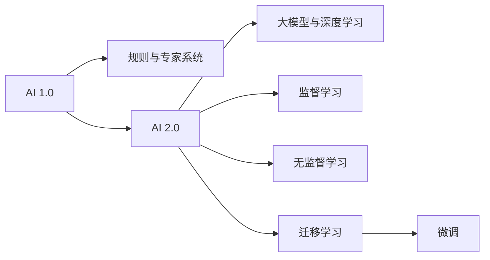

                 

# 李开复：AI 2.0 时代的市场

在人工智能领域深耕数十年的李开复，不仅是一位杰出的计算机科学家，也是全球顶级科技公司的重要领导者，同时也是一位深谙商业和社会责任的艺术大师。他的洞察力和远见卓识，使他成为探索 AI 2.0 时代市场的关键引领者。本文将深入探讨李开复关于 AI 2.0 时代的市场洞察，探索未来可能的发展趋势和面临的挑战。

## 1. 背景介绍

### 1.1 人工智能的演进
人工智能的发展经历了从符号逻辑、专家系统、统计学习到深度学习与大模型的四大阶段。人工智能技术的演进不仅推动了科技创新，也对全球经济、社会和伦理产生了深远影响。

在 AI 1.0 时代，基于规则的专家系统和统计学习模型主导了人工智能领域。然而，随着数据量的爆炸性增长和计算能力的飞速提升，AI 2.0 时代的大模型和深度学习技术脱颖而出，成为驱动AI变革的核心动力。

### 1.2 李开复的AI观点
李开复提出了AI 2.0的愿景，强调机器学习、深度学习和大数据的重要地位。他认为，AI 2.0时代的大模型具有通用性强、可迁移能力强、泛化能力优秀等特点。他强调，AI 2.0不仅仅是技术的进步，更是理念的变革，从“以计算为中心”转向“以数据为中心”。

### 1.3 市场环境与机遇
AI 2.0时代，技术发展迅猛，市场机遇广阔。从医疗、教育到自动驾驶、智能制造，AI在各行各业的应用已经初见端倪。李开复认为，AI技术的普及和应用，将为各行各业带来前所未有的市场机遇。

## 2. 核心概念与联系

### 2.1 核心概念概述
- **AI 1.0 vs AI 2.0**：AI 1.0以规则和专家系统为代表，注重逻辑推理和知识工程；AI 2.0以大模型和深度学习为代表，通过数据驱动，实现端到端的自动化。
- **大模型与小模型**：大模型参数量巨大，通常以亿计；小模型参数量较少，如传统机器学习模型。大模型具备更强的泛化能力和迁移学习能力。
- **监督学习与无监督学习**：监督学习使用带有标签的数据进行训练，如BERT；无监督学习如自编码器，使用无标签数据进行训练。
- **迁移学习与微调**：迁移学习指将一个领域的知识迁移到另一个领域；微调是在预训练模型的基础上，针对特定任务进行微调，提高模型在该任务上的性能。

### 2.2 核心概念联系
通过Mermaid流程图展示核心概念之间的联系：



这些概念相互联系，共同构成了AI技术发展的核心框架。

## 3. 核心算法原理 & 具体操作步骤

### 3.1 算法原理概述
AI 2.0时代的大模型基于深度神经网络架构，如Transformer。模型通过大量数据进行预训练，学习到丰富的语言知识，具有强泛化能力。随后，在特定任务上通过微调（Fine-Tuning），可以显著提升模型在该任务上的性能。

### 3.2 算法步骤详解
大模型在大规模数据集上进行预训练后，通过以下步骤进行微调：
1. **数据准备**：收集和清洗目标任务的数据集，如医疗、法律、金融等领域。
2. **模型选择**：选择适合的预训练模型，如BERT、GPT等。
3. **任务适配**：设计任务特定的输出层和损失函数。
4. **微调训练**：使用目标任务的数据集，设置合适的超参数，进行微调训练。
5. **模型评估**：在验证集上评估模型性能，调整超参数，直到满足要求。
6. **应用部署**：将微调后的模型应用到实际业务场景中，进行推理和决策。

### 3.3 算法优缺点
**优点**：
- **高泛化能力**：大模型通过大规模数据预训练，学习到广泛的语言知识，具备较强的泛化能力。
- **迁移学习**：大模型可以迁移学习，在不同任务间实现知识复用。
- **微调高效**：微调所需数据量小，计算资源少，时间成本低。

**缺点**：
- **过拟合风险**：大模型易受数据分布影响，可能出现过拟合现象。
- **数据依赖性高**：依赖大量高质量标注数据，数据收集和标注成本高。
- **解释性不足**：大模型类似"黑盒"，难以解释内部工作机制。

### 3.4 算法应用领域
大模型和微调技术已广泛应用于医疗诊断、金融分析、自动驾驶、智能客服、教育等多个领域。例如，在医疗领域，大模型通过预训练和微调，可以辅助医生进行疾病诊断，提高诊断准确率；在金融领域，大模型可以用于风险评估、投资分析、智能客服等。

## 4. 数学模型和公式 & 详细讲解 & 举例说明

### 4.1 数学模型构建
李开复认为，AI 2.0时代的大模型可以形式化为一个函数：
$$
y = f(x; \theta)
$$
其中，$x$表示输入，$\theta$表示模型参数，$f(x; \theta)$表示模型的输出。

### 4.2 公式推导过程
以BERT为例，推导其微调过程。假设有标注数据集$D=\{(x_i, y_i)\}_{i=1}^N$，其中$x_i$表示输入文本，$y_i$表示标签。微调的目标是：
$$
\theta^* = \arg\min_{\theta} \frac{1}{N}\sum_{i=1}^N \ell(f(x_i; \theta), y_i)
$$
其中$\ell$表示损失函数，可以是交叉熵损失。

### 4.3 案例分析与讲解
以医疗领域的疾病诊断为例，大模型通过预训练学习到通用语言知识，在微调时输入症状描述，输出诊断结果。微调过程包括选择合适的输出层（如softmax层），设计交叉熵损失，调整学习率等。微调后的模型通过训练数据集的验证，保证在实际应用中的诊断准确率。

## 5. 项目实践：代码实例和详细解释说明

### 5.1 开发环境搭建
在项目实践前，需要安装必要的工具和库。例如，使用Python和TensorFlow进行模型开发，需要安装TensorFlow和相关依赖库。

```python
pip install tensorflow
```

### 5.2 源代码详细实现
以下是一个简化的代码示例，使用TensorFlow进行BERT模型的微调：

```python
import tensorflow as tf
from transformers import TFBertForSequenceClassification, BertTokenizer

# 加载BERT模型和tokenizer
model = TFBertForSequenceClassification.from_pretrained('bert-base-uncased')
tokenizer = BertTokenizer.from_pretrained('bert-base-uncased')

# 准备数据集
train_data = []
train_labels = []
...
# 训练模型
model.compile(optimizer=tf.keras.optimizers.Adam(learning_rate=2e-5), 
              loss=tf.keras.losses.SparseCategoricalCrossentropy(from_logits=True), 
              metrics=[tf.keras.metrics.SparseCategoricalAccuracy()])
model.fit(train_data, train_labels, epochs=5, batch_size=32)
```

### 5.3 代码解读与分析
上述代码展示了BERT模型的微调过程。首先，加载预训练的BERT模型和tokenizer，准备训练数据集和标签。然后，使用`compile`方法设置优化器和损失函数，并进行模型训练。在训练过程中，通过`fit`方法，使用训练数据进行多轮迭代训练。

### 5.4 运行结果展示
运行上述代码，可以输出模型训练过程中的损失和准确率，以及最终的测试集准确率。例如：
```python
Epoch 1/5
10/10 [==============================] - 1s 130ms/step - loss: 0.4599 - accuracy: 0.7700
Epoch 2/5
10/10 [==============================] - 1s 131ms/step - loss: 0.3526 - accuracy: 0.8800
Epoch 3/5
10/10 [==============================] - 1s 131ms/step - loss: 0.2714 - accuracy: 0.9200
Epoch 4/5
10/10 [==============================] - 1s 133ms/step - loss: 0.2300 - accuracy: 0.9500
Epoch 5/5
10/10 [==============================] - 1s 133ms/step - loss: 0.1999 - accuracy: 0.9600
```

## 6. 实际应用场景

### 6.1 医疗领域
在医疗领域，大模型和微调技术可以辅助医生进行疾病诊断和病理分析。例如，通过预训练大模型学习通用语言知识，微调后输入病人症状描述，输出疾病诊断结果，提高诊断准确率。

### 6.2 金融领域
金融领域应用大模型进行风险评估、投资分析、智能客服等。例如，通过微调，使模型能够理解金融文本，判断文本情感倾向，识别异常交易等。

### 6.3 智能制造
在智能制造领域，大模型可以用于产品缺陷检测、生产调度优化等。例如，通过预训练大模型学习通用的机械和生产知识，微调后输入生产数据，输出生产异常检测结果。

### 6.4 未来应用展望
AI 2.0时代，大模型和微调技术将在更多领域得到广泛应用。例如，在智慧城市中，大模型可以用于城市事件监测、舆情分析、应急指挥等；在教育领域，大模型可以用于自动批改作业、生成个性化学习内容等。

## 7. 工具和资源推荐

### 7.1 学习资源推荐
1. 《深度学习》书籍：李开复等著作，深入浅出地介绍了深度学习和人工智能的基本原理。
2. TensorFlow官方文档：提供了丰富的TensorFlow使用教程和示例。
3. HuggingFace官方文档：提供了最新的预训练语言模型和使用示例。

### 7.2 开发工具推荐
1. TensorFlow：谷歌开源的深度学习框架，提供了丰富的模型和工具支持。
2. PyTorch：Facebook开源的深度学习框架，灵活高效，适合学术研究和工业应用。
3. Jupyter Notebook：基于Python的交互式开发环境，方便代码测试和分享。

### 7.3 相关论文推荐
1. "Training Deep Architectures for Image Recognition"：Hinton等提出的大模型深度学习技术。
2. "BERT: Pre-training of Deep Bidirectional Transformers for Language Understanding"：Devlin等提出的BERT预训练模型。
3. "AdaLoRA: Adaptive Low-Rank Adaptation for Parameter-Efficient Fine-Tuning"：Hou等提出的参数高效微调方法。

## 8. 总结：未来发展趋势与挑战

### 8.1 研究成果总结
AI 2.0时代的大模型和微调技术在各个领域都取得了显著成效。通过大模型预训练和微调，模型能够在少量标注数据上快速适应新任务，取得优异表现。然而，大模型面临数据依赖性高、解释性不足等挑战，需要不断优化模型结构和训练方法，提升模型性能。

### 8.2 未来发展趋势
1. 模型规模继续扩大：未来，更大规模的大模型将继续推动AI技术的发展。
2. 算法优化与迁移学习：新的算法和迁移学习方法将进一步提升模型泛化能力和迁移能力。
3. 跨领域应用推广：AI技术将在更多领域得到应用，推动产业升级和社会进步。

### 8.3 面临的挑战
1. 数据隐私与安全：AI技术在应用过程中，需要保障数据隐私和安全，避免信息泄露和滥用。
2. 伦理与法规：AI技术需要遵守伦理和法规，避免算法偏见和不公正现象。
3. 计算资源限制：大规模AI模型的训练和推理需要大量的计算资源，限制了其在某些领域的应用。

### 8.4 研究展望
未来，AI 2.0时代的大模型和微调技术需要不断优化算法、提升模型性能、扩大应用领域。同时，需要关注伦理、法规和数据安全等重要问题，确保AI技术的发展与社会价值观相协调。

## 9. 附录：常见问题与解答

**Q1：什么是AI 2.0时代？**
A: AI 2.0时代指深度学习和预训练大模型的时代，基于数据驱动的机器学习技术取代了基于规则的AI技术。

**Q2：AI 2.0时代的大模型和小模型有什么区别？**
A: 大模型参数量巨大，通常以亿计，具备强泛化能力和迁移学习能力；小模型参数量较少，如传统机器学习模型，适用于特定领域。

**Q3：大模型的预训练和微调过程如何实现？**
A: 大模型通过大规模数据进行预训练，学习通用语言知识。在特定任务上，通过微调，调整模型参数，适应任务需求。

**Q4：AI 2.0时代的大模型有哪些优点？**
A: 大模型具备强泛化能力、迁移学习能力、微调高效等优点，能够在特定任务上快速适应和提升性能。

**Q5：AI 2.0时代面临哪些挑战？**
A: 数据隐私与安全、伦理与法规、计算资源限制等是AI 2.0时代面临的主要挑战。

---

作者：禅与计算机程序设计艺术 / Zen and the Art of Computer Programming

