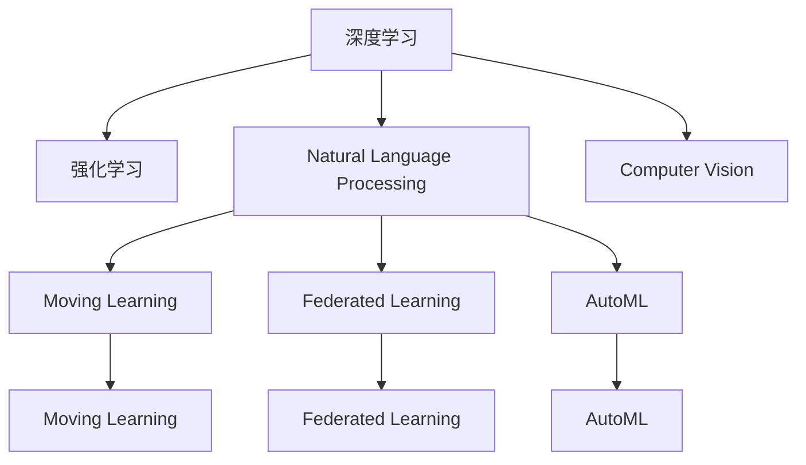

                 

# 李开复：AI 2.0 时代的开发者

## 1. 背景介绍

### 1.1 问题由来
在AI 2.0时代，技术的发展速度已经远远超出了我们的预期。从深度学习到强化学习，再到自然语言处理（NLP）和计算机视觉（CV），AI技术已经渗透到了我们生活的方方面面。然而，随着技术的不断发展，开发者面临的挑战也日益增加。如何跟上技术的发展，如何在AI 2.0时代成为一名优秀的开发者，成为当前我们急需解决的问题。

### 1.2 问题核心关键点
在AI 2.0时代，开发者面临的核心问题包括：
1. **技术更新速度快**：AI领域的技术发展速度非常快，开发者需要不断学习新技术，跟上技术的步伐。
2. **数据依赖性强**：AI技术的核心是数据，开发者需要具备处理和分析大数据的能力。
3. **模型复杂度高**：AI模型通常非常复杂，开发者需要具备系统化的思维方式，能够设计和优化模型。
4. **跨领域应用广泛**：AI技术在各行各业都有应用，开发者需要具备跨领域应用的能力。

## 2. 核心概念与联系

### 2.1 核心概念概述

为了更好地理解AI 2.0时代的开发者所面临的挑战和机遇，我们首先需要了解一些核心概念：

- **深度学习（Deep Learning）**：一种基于神经网络的学习方法，通过多层非线性变换，从原始数据中学习复杂的表示。
- **强化学习（Reinforcement Learning）**：一种通过与环境交互，不断优化策略的学习方法，广泛应用于游戏、机器人等领域。
- **自然语言处理（NLP）**：一种使计算机能够理解、处理和生成人类语言的技术，包括文本分类、机器翻译等任务。
- **计算机视觉（CV）**：一种使计算机能够处理和理解图像和视频的技术，包括目标检测、图像分割等任务。
- **迁移学习（Transfer Learning）**：一种通过在大规模数据上预训练模型，在小规模数据上微调，提升模型性能的方法。
- **联邦学习（Federated Learning）**：一种分布式学习技术，通过在多个设备上分布式训练模型，提升模型性能和数据隐私性。
- **自动机器学习（AutoML）**：一种自动化机器学习的方法，通过自动化调参、自动化模型选择等，提升模型性能。

这些核心概念之间的逻辑关系可以通过以下Mermaid流程图来展示：



这个流程图展示了大语言模型和大模型微调的逻辑关系：

1. 深度学习、强化学习等基础技术，为AI 2.0时代提供了技术支持。
2. NLP、CV等应用领域，通过迁移学习、联邦学习等技术，提升了模型的性能。
3. AutoML等自动化技术，进一步提升了模型的开发效率和性能。

这些概念共同构成了AI 2.0时代的技术基础，使开发者能够更好地应对各种挑战，实现高效开发。

## 3. 核心算法原理 & 具体操作步骤
### 3.1 算法原理概述

在AI 2.0时代，开发者面临的核心算法包括深度学习、强化学习和迁移学习。以下将对这三种算法进行概述：

- **深度学习**：通过多层神经网络，对数据进行非线性变换，学习数据的复杂表示。常用的深度学习算法包括卷积神经网络（CNN）、循环神经网络（RNN）和变换器（Transformer）等。
- **强化学习**：通过与环境交互，不断优化策略，提升模型的性能。常用的强化学习算法包括Q-learning、策略梯度等。
- **迁移学习**：在大规模数据上预训练模型，在小规模数据上微调，提升模型的性能。常用的迁移学习算法包括微调、迁移学习、元学习等。

### 3.2 算法步骤详解

以下是深度学习、强化学习和迁移学习的基本步骤：

**深度学习**：
1. **数据预处理**：对原始数据进行清洗、归一化等预处理。
2. **模型设计**：选择适当的神经网络结构，如卷积神经网络、循环神经网络等。
3. **训练**：使用反向传播算法，对模型进行训练，最小化损失函数。
4. **评估**：使用测试集对模型进行评估，计算性能指标，如准确率、精确率等。

**强化学习**：
1. **环境定义**：定义与环境交互的方式，如游戏、机器人等。
2. **策略设计**：设计学习策略，如Q-learning、策略梯度等。
3. **训练**：通过与环境交互，不断优化策略，提升模型性能。
4. **评估**：使用测试集对模型进行评估，计算性能指标，如成功次数、奖励等。

**迁移学习**：
1. **预训练**：在大规模数据上预训练模型，学习通用的语言表示。
2. **微调**：在目标任务的数据集上，对预训练模型进行微调，提升模型性能。
3. **评估**：使用测试集对模型进行评估，计算性能指标，如准确率、精确率等。

### 3.3 算法优缺点

深度学习、强化学习和迁移学习各有优缺点：

**深度学习**：
- **优点**：能够学习复杂的非线性关系，处理高维数据能力强。
- **缺点**：模型复杂度高，需要大量的数据和计算资源。

**强化学习**：
- **优点**：能够处理动态环境，适应性强。
- **缺点**：需要大量的环境交互数据，模型训练过程复杂。

**迁移学习**：
- **优点**：能够在小规模数据上提升模型性能，减少标注数据需求。
- **缺点**：预训练模型的泛化能力有限，需要选择合适的预训练数据。

### 3.4 算法应用领域

深度学习、强化学习和迁移学习在各个应用领域都有广泛应用：

- **深度学习**：广泛应用于图像识别、语音识别、自然语言处理等领域。
- **强化学习**：广泛应用于游戏、机器人、自动驾驶等领域。
- **迁移学习**：广泛应用于NLP、CV、推荐系统等领域。

这些算法在不同的应用领域中发挥着重要的作用，推动了AI技术的发展。

## 4. 数学模型和公式 & 详细讲解 & 举例说明

### 4.1 数学模型构建

以下将对深度学习、强化学习和迁移学习的数学模型进行构建：

**深度学习**：
- **模型定义**：$\theta$ 为模型参数，$x$ 为输入数据，$y$ 为输出数据。
- **损失函数**：交叉熵损失函数，$L = -\frac{1}{N}\sum_{i=1}^N(y_i\log(\hat{y_i}))$。
- **优化器**：随机梯度下降（SGD），$\theta \leftarrow \theta - \eta\nabla_{\theta}L$。

**强化学习**：
- **状态空间**：$S$ 为状态空间，$A$ 为动作空间。
- **状态转移函数**：$P(s_{t+1}|s_t,a_t)$。
- **奖励函数**：$R(s_t,a_t)$。
- **策略**：$\pi(a_t|s_t)$。
- **损失函数**：累积奖励和，$J(\pi) = \mathbb{E}\left[\sum_{t=1}^{T}R(s_t,a_t)\right]$。

**迁移学习**：
- **预训练模型**：$M_{\theta}$ 为预训练模型，$D_{train}$ 为预训练数据集，$D_{fine}$ 为微调数据集。
- **微调模型**：$M_{\hat{\theta}} = M_{\theta} + \delta\theta$，$\delta\theta$ 为微调参数。
- **损失函数**：$\mathcal{L} = \mathcal{L}_{train} + \lambda\mathcal{L}_{fine}$。

### 4.2 公式推导过程

以下是深度学习、强化学习和迁移学习的基本公式推导过程：

**深度学习**：
- **交叉熵损失函数**：$L = -\frac{1}{N}\sum_{i=1}^N(y_i\log(\hat{y_i}))$。
- **梯度下降**：$\theta \leftarrow \theta - \eta\nabla_{\theta}L$。

**强化学习**：
- **累积奖励和**：$J(\pi) = \mathbb{E}\left[\sum_{t=1}^{T}R(s_t,a_t)\right]$。
- **策略梯度**：$\nabla_{\pi}J(\pi) = \mathbb{E}\left[\sum_{t=1}^{T}\nabla_{\pi(a_t|s_t)}R(s_t,a_t)\right]$。

**迁移学习**：
- **微调模型**：$M_{\hat{\theta}} = M_{\theta} + \delta\theta$。
- **损失函数**：$\mathcal{L} = \mathcal{L}_{train} + \lambda\mathcal{L}_{fine}$。

### 4.3 案例分析与讲解

以下将以图像分类任务为例，详细讲解深度学习的数学模型和公式推导过程：

- **数据预处理**：对原始图像进行归一化处理。
- **模型设计**：选择卷积神经网络（CNN）结构，包括卷积层、池化层、全连接层等。
- **训练**：使用反向传播算法，对模型进行训练，最小化交叉熵损失函数。
- **评估**：使用测试集对模型进行评估，计算准确率和精确率等性能指标。

以下是具体的数学推导过程：

**卷积层**：
- **公式**：$Z_{conv} = \sigma(g(W*X + b))$，其中$W$为卷积核，$X$为输入图像，$b$为偏置项，$\sigma$为激活函数。

**池化层**：
- **公式**：$Z_{pool} = \sigma(W*Z_{conv} + b)$，其中$W$为池化核，$Z_{conv}$为卷积层的输出。

**全连接层**：
- **公式**：$Z_{fc} = \sigma(W*Z_{pool} + b)$，其中$W$为全连接层权重，$Z_{pool}$为池化层的输出，$b$为偏置项。

通过以上公式，我们可以推导出卷积神经网络的完整数学模型，并对其进行训练和评估。

## 5. 项目实践：代码实例和详细解释说明

### 5.1 开发环境搭建

在进行AI 2.0时代的应用开发前，我们需要准备好开发环境。以下是使用Python进行TensorFlow开发的环境配置流程：

1. 安装Anaconda：从官网下载并安装Anaconda，用于创建独立的Python环境。

2. 创建并激活虚拟环境：
```bash
conda create -n tf-env python=3.8 
conda activate tf-env
```

3. 安装TensorFlow：从官网获取对应的安装命令，如：
```bash
pip install tensorflow
```

4. 安装各类工具包：
```bash
pip install numpy pandas scikit-learn matplotlib tqdm jupyter notebook ipython
```

完成上述步骤后，即可在`tf-env`环境中开始AI 2.0时代的开发实践。

### 5.2 源代码详细实现

这里我们以图像分类任务为例，给出使用TensorFlow对卷积神经网络进行训练和评估的PyTorch代码实现。

```python
import tensorflow as tf
from tensorflow.keras import layers, models

# 构建卷积神经网络
model = models.Sequential([
    layers.Conv2D(32, (3, 3), activation='relu', input_shape=(28, 28, 1)),
    layers.MaxPooling2D((2, 2)),
    layers.Conv2D(64, (3, 3), activation='relu'),
    layers.MaxPooling2D((2, 2)),
    layers.Conv2D(64, (3, 3), activation='relu'),
    layers.Flatten(),
    layers.Dense(64, activation='relu'),
    layers.Dense(10)
])

# 编译模型
model.compile(optimizer='adam', loss='categorical_crossentropy', metrics=['accuracy'])

# 加载数据集
mnist = tf.keras.datasets.mnist
(x_train, y_train), (x_test, y_test) = mnist.load_data()
x_train, x_test = x_train / 255.0, x_test / 255.0

# 训练模型
model.fit(x_train, y_train, epochs=10, batch_size=32, validation_data=(x_test, y_test))

# 评估模型
model.evaluate(x_test, y_test)
```

### 5.3 代码解读与分析

让我们再详细解读一下关键代码的实现细节：

**Sequential模型**：
- `layers.Sequential`：创建一个Sequential模型，用于堆叠多个层。
- `layers.Conv2D`：添加卷积层，包括卷积核、激活函数等。
- `layers.MaxPooling2D`：添加池化层，用于下采样。
- `layers.Flatten`：将特征图展开成向量。
- `layers.Dense`：添加全连接层，包括权重和偏置项。

**训练模型**：
- `model.compile`：编译模型，指定优化器、损失函数和评估指标。
- `model.fit`：训练模型，使用训练数据集进行迭代训练。

**评估模型**：
- `model.evaluate`：评估模型，使用测试数据集进行预测并计算性能指标。

通过以上代码，我们可以实现卷积神经网络的训练和评估，并输出其性能指标。

## 6. 实际应用场景

### 6.1 智能客服系统

在AI 2.0时代，智能客服系统广泛应用于各行各业。智能客服系统通过自然语言处理（NLP）和机器学习技术，实现与用户的自然交互。具体应用如下：

- **语音识别**：将用户的语音输入转换为文本。
- **自然语言理解**：使用NLP技术，理解用户的意图和问题。
- **知识库查询**：在知识库中查找并返回与用户问题相关的信息。
- **自动回复**：根据用户问题，自动生成回复。

### 6.2 金融舆情监测

金融舆情监测系统通过自然语言处理（NLP）技术，实时监测金融市场的舆情变化，帮助金融机构及时应对风险。具体应用如下：

- **新闻抓取**：从新闻网站、社交媒体等渠道抓取金融相关的新闻。
- **情感分析**：使用NLP技术，分析新闻的情感倾向。
- **事件检测**：通过NLP技术，检测金融事件和舆情变化。
- **预警系统**：根据舆情变化，及时发出预警信息。

### 6.3 个性化推荐系统

个性化推荐系统通过机器学习技术，根据用户的历史行为和兴趣，推荐相关内容。具体应用如下：

- **用户画像**：通过用户的历史行为数据，构建用户画像。
- **物品相似度计算**：计算物品之间的相似度。
- **协同过滤**：通过用户和物品之间的相似度，推荐相关物品。
- **模型训练**：使用用户和物品之间的交互数据，训练推荐模型。

### 6.4 未来应用展望

随着AI 2.0技术的不断发展，未来的应用场景将更加广泛，以下将列举几个未来应用展望：

- **智能医疗**：通过AI技术，辅助医生进行诊断和治疗，提升医疗服务的智能化水平。
- **智慧城市**：通过AI技术，实现城市管理、交通控制等功能的智能化。
- **教育科技**：通过AI技术，实现个性化教学、智能评估等功能的智能化。
- **智能制造**：通过AI技术，实现生产过程的智能化，提高生产效率。
- **金融科技**：通过AI技术，实现智能投顾、风险管理等功能。

## 7. 工具和资源推荐

### 7.1 学习资源推荐

为了帮助开发者系统掌握AI 2.0技术，以下是一些优质的学习资源：

1. 《深度学习》书籍：由深度学习领域的权威专家Ian Goodfellow等人编写，全面介绍深度学习的理论和实践。
2. 《机器学习实战》书籍：由机器学习领域的专家Peter Harrington编写，涵盖机器学习的各种经典算法和应用案例。
3. Coursera机器学习课程：由斯坦福大学教授Andrew Ng主讲的课程，涵盖机器学习的基本概念和算法。
4. DeepLearning.ai课程：由机器学习领域的权威专家Andrew Ng主讲的课程，涵盖深度学习的各种理论和实践。
5. GitHub资源：包含大量的开源项目和代码，方便开发者学习和实践。

### 7.2 开发工具推荐

为了提高开发效率，以下是一些常用的开发工具：

1. PyTorch：基于Python的开源深度学习框架，支持动态计算图，适合研究性开发。
2. TensorFlow：由Google主导的开源深度学习框架，生产部署方便，适合工业应用。
3. Keras：基于TensorFlow的高级API，支持快速搭建深度学习模型。
4. Jupyter Notebook：支持Python和TensorFlow等框架，提供交互式开发环境。
5. Google Colab：谷歌提供的在线Jupyter Notebook环境，免费提供GPU/TPU算力。

### 7.3 相关论文推荐

以下是几篇代表性的AI 2.0技术论文，推荐阅读：

1. AlphaGo论文：介绍AlphaGo的原理和算法，展示了深度学习在围棋中的应用。
2. ImageNet论文：介绍ImageNet数据集和AlexNet算法，展示了卷积神经网络在图像识别中的应用。
3. Attention is All You Need论文：介绍Transformer结构，展示了自注意力机制在自然语言处理中的应用。
4. GAN论文：介绍生成对抗网络（GAN）的原理和算法，展示了生成模型在图像生成中的应用。
5. TensorFlow 2.0论文：介绍TensorFlow 2.0的新特性和优化，展示了TensorFlow在工业应用中的优势。

这些论文代表了大语言模型和大模型微调技术的发展脉络，通过学习这些前沿成果，可以帮助研究者把握学科前进方向，激发更多的创新灵感。

## 8. 总结：未来发展趋势与挑战

### 8.1 总结

本文对AI 2.0时代的开发者所面临的挑战和机遇进行了全面系统的介绍。首先阐述了AI 2.0时代的技术背景和意义，明确了深度学习、强化学习和迁移学习等核心算法的重要性。其次，从原理到实践，详细讲解了这些算法的数学模型和具体实现过程，给出了完整的代码实例和详细解读。同时，本文还广泛探讨了这些算法在智能客服、金融舆情、个性化推荐等多个行业领域的应用前景，展示了AI 2.0技术带来的巨大潜力。最后，本文精选了AI 2.0技术的学习资源、开发工具和相关论文，力求为开发者提供全方位的技术指引。

通过本文的系统梳理，可以看到，AI 2.0时代的开发者需要具备多方面的能力，包括技术创新、跨领域应用、数据处理、模型优化等。只有不断学习和实践，才能跟上技术的发展步伐，成为一名优秀的开发者。

### 8.2 未来发展趋势

展望未来，AI 2.0技术将呈现以下几个发展趋势：

1. **技术融合**：深度学习、强化学习、迁移学习等技术将进一步融合，形成更强大的AI系统。
2. **模型复杂度提升**：AI模型将不断复杂化，涉及更多的领域和任务。
3. **数据依赖减少**：AI系统将更多依赖无监督学习、自监督学习等技术，减少对标注数据的依赖。
4. **应用领域拓展**：AI技术将应用于更多领域，如医疗、金融、教育等。
5. **跨学科研究**：AI技术将与生物学、物理学等学科结合，推动科学进步。

这些趋势将推动AI技术的不断发展和进步，为人类社会带来更多的创新和变革。

### 8.3 面临的挑战

尽管AI 2.0技术取得了显著的进展，但在其发展的过程中，也面临诸多挑战：

1. **数据隐私保护**：AI系统需要大量的数据，但如何保护用户隐私，防止数据泄露，是一个重要问题。
2. **模型可解释性**：AI模型的决策过程复杂，难以解释其内部机制，导致信任度降低。
3. **模型鲁棒性**：AI模型在面对新数据时，泛化能力有限，容易过拟合。
4. **伦理和社会影响**：AI技术的广泛应用，可能带来伦理和社会问题，如就业替代、隐私泄露等。

这些挑战需要我们在技术、伦理和社会多个层面进行综合考虑和应对。只有解决好这些挑战，才能让AI技术真正造福人类社会。

### 8.4 研究展望

面对AI 2.0技术所面临的挑战，未来的研究需要在以下几个方面寻求新的突破：

1. **隐私保护技术**：开发更高效的数据保护技术，确保数据隐私和安全。
2. **模型可解释性**：开发更可解释的AI模型，提高模型的可信度和应用范围。
3. **模型鲁棒性提升**：通过对抗学习、自适应学习等技术，提升AI模型的泛化能力。
4. **伦理和社会影响研究**：开展AI技术对社会影响的伦理和社会研究，制定相应的规范和标准。

这些研究方向将推动AI技术的可持续发展，为人类社会带来更多的福祉和变革。

## 9. 附录：常见问题与解答

**Q1：如何学习AI 2.0技术？**

A: 学习AI 2.0技术需要掌握深度学习、强化学习、迁移学习等核心算法，建议从以下几个方面进行学习：
1. 阅读相关书籍和论文，如《深度学习》、《机器学习实战》等。
2. 参加在线课程和讲座，如Coursera、DeepLearning.ai等。
3. 参与开源项目，如TensorFlow、PyTorch等。
4. 实践项目，如智能客服、金融舆情监测等。

**Q2：AI 2.0技术有哪些应用场景？**

A: AI 2.0技术在各个领域都有广泛的应用，包括智能客服、金融舆情监测、个性化推荐等。未来，随着技术的发展，AI 2.0技术将应用于更多领域，如智能医疗、智慧城市、教育科技等。

**Q3：如何开发AI 2.0项目？**

A: 开发AI 2.0项目需要以下步骤：
1. 收集和准备数据集。
2. 选择合适的算法和模型。
3. 进行模型训练和评估。
4. 应用到实际场景中，进行优化和迭代。
5. 持续监控和维护。

**Q4：如何提高AI 2.0模型的性能？**

A: 提高AI 2.0模型的性能需要从以下几个方面进行优化：
1. 数据预处理，包括清洗、归一化、增强等。
2. 模型设计，包括选择算法、调整超参数等。
3. 训练优化，包括选择合适的优化器、调整学习率等。
4. 模型评估，包括选择合适的评估指标、调整阈值等。

**Q5：如何应对AI 2.0技术所面临的挑战？**

A: 应对AI 2.0技术所面临的挑战需要从以下几个方面进行应对：
1. 数据隐私保护，通过加密技术、联邦学习等保护用户隐私。
2. 模型可解释性，开发可解释的模型，如注意力机制、对抗样本等。
3. 模型鲁棒性提升，通过对抗学习、自适应学习等提升模型的泛化能力。
4. 伦理和社会影响研究，制定相应的规范和标准，推动AI技术的可持续发展。

---

作者：禅与计算机程序设计艺术 / Zen and the Art of Computer Programming

