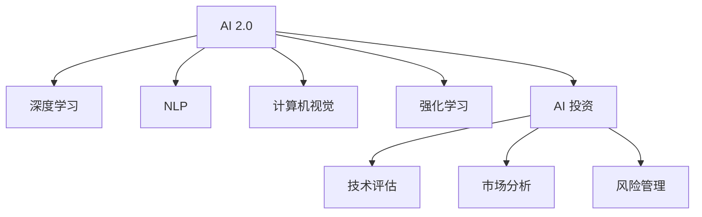

                 

# 李开复：AI 2.0 时代的投资价值

## 1. 背景介绍

### 1.1 问题由来
随着人工智能技术的飞速发展，AI正逐渐从AI 1.0向AI 2.0过渡，这是一个新的发展阶段，其特征是更加注重解决实际问题和提升用户体验。AI 2.0的核心理念包括深度学习、自然语言处理、计算机视觉等前沿技术，旨在构建更加智能、更加人性化的AI系统。

AI 2.0的到来，标志着AI技术在各行各业的应用将更加深入和广泛，为投资者提供了广阔的投资机会。但同时，AI 2.0也带来了新的挑战和风险，需要投资者有更深的理解和技术储备。

### 1.2 问题核心关键点
AI 2.0的投资价值主要体现在以下几个方面：
- **技术领先性**：AI 2.0技术创新层出不穷，不断突破人类认知的边界。
- **应用广泛性**：AI 2.0技术应用于医疗、金融、制造、物流等众多领域，具有广泛的市场需求。
- **产业变革性**：AI 2.0技术将推动传统行业的数字化转型和智能化升级，带来新的商业机会。
- **风险管理**：AI 2.0技术快速发展，带来了新的技术风险和伦理风险，需要投资者有较强的风险管理能力。
- **数据依赖性**：AI 2.0技术的核心是数据，高质量的数据是实现技术突破的关键。

## 2. 核心概念与联系

### 2.1 核心概念概述

为更好地理解AI 2.0时代的投资价值，本节将介绍几个密切相关的核心概念：

- **AI 2.0**：人工智能的第二代，以深度学习、自然语言处理、计算机视觉等技术为代表，强调解决实际问题和提升用户体验。
- **深度学习**：通过多层次的非线性神经网络模型，自动从大量数据中学习特征表示，具有强大的自适应能力。
- **自然语言处理(NLP)**：使计算机能够理解、处理和生成自然语言，涉及语言模型、文本分类、机器翻译等任务。
- **计算机视觉**：使计算机能够从图像或视频中理解和提取信息，涉及目标检测、图像分割、人脸识别等技术。
- **强化学习**：通过与环境的交互，不断调整策略，优化决策过程，适用于需要自主决策的场景。
- **AI 投资**：投资者对AI相关公司、技术、应用场景的投资，涉及技术评估、市场分析、风险管理等环节。

这些核心概念之间的逻辑关系可以通过以下Mermaid流程图来展示：



这个流程图展示了大语言模型的核心概念及其之间的关系：

1. AI 2.0作为AI技术发展的高级阶段，涵盖了深度学习、NLP、计算机视觉和强化学习等多个分支。
2. AI 2.0技术不仅推动了AI研究的进步，也促进了AI在各行各业的应用。
3. AI投资作为对AI技术的投资，涉及到技术评估、市场分析、风险管理等多个环节。

## 3. 核心算法原理 & 具体操作步骤
### 3.1 算法原理概述

AI 2.0的投资价值主要体现在以下几个方面：

**3.1.1 技术领先性**：
AI 2.0技术包括深度学习、自然语言处理、计算机视觉等多个方向，每项技术都有其独特优势。例如，深度学习可以处理非结构化数据，自然语言处理可以理解自然语言，计算机视觉可以处理图像和视频等。这些技术的结合，使得AI 2.0能够解决复杂问题，带来创新解决方案。

**3.1.2 应用广泛性**：
AI 2.0技术具有广泛的应用场景，例如医疗、金融、制造、物流、智能家居等领域。AI 2.0技术可以提升效率，降低成本，带来新的商业模式和应用场景。

**3.1.3 产业变革性**：
AI 2.0技术将推动传统行业的数字化转型和智能化升级，带来新的商业机会。例如，AI 2.0可以优化供应链管理，提高生产效率，改进医疗诊断，提升金融服务质量等。

**3.1.4 风险管理**：
AI 2.0技术快速发展，带来了新的技术风险和伦理风险。例如，数据隐私保护、算法公平性、模型安全性等问题，需要投资者有较强的风险管理能力。

**3.1.5 数据依赖性**：
AI 2.0技术的核心是数据，高质量的数据是实现技术突破的关键。因此，投资者需要关注数据来源、数据质量、数据安全等问题。

### 3.2 算法步骤详解

AI 2.0的投资价值分析主要包括以下几个步骤：

**Step 1: 技术评估**
- **了解技术**：理解AI 2.0技术的核心原理、应用场景、技术优势等。
- **比较技术**：将AI 2.0技术与同类技术进行比较，评估其技术优势和市场竞争力。
- **验证技术**：通过实验或案例分析，验证AI 2.0技术的实际效果和应用潜力。

**Step 2: 市场分析**
- **市场规模**：分析目标市场的规模和增长潜力，评估市场空间。
- **市场竞争**：分析市场中的主要竞争者，评估其市场份额和竞争优势。
- **客户需求**：分析目标客户的实际需求和偏好，评估市场的潜在机会。

**Step 3: 风险管理**
- **技术风险**：评估AI 2.0技术的可行性和可靠性，识别技术漏洞和潜在风险。
- **伦理风险**：评估AI 2.0技术的社会影响和伦理问题，如数据隐私、算法偏见等。
- **法律风险**：评估AI 2.0技术面临的法律风险，如专利、版权等问题。

**Step 4: 投资决策**
- **投资策略**：根据技术评估、市场分析和风险管理的结果，制定投资策略。
- **资金分配**：根据投资策略，合理分配投资资金，平衡风险和收益。
- **绩效评估**：定期评估投资绩效，根据市场变化进行调整。

### 3.3 算法优缺点

AI 2.0的投资价值分析方法具有以下优点：

1. **全面性**：涵盖技术评估、市场分析和风险管理等多个方面，能够全面评估AI 2.0的投资价值。
2. **实用性**：通过实际案例分析和实验验证，能够准确评估AI 2.0技术的实际效果和应用潜力。
3. **科学性**：基于数据和分析结果进行投资决策，减少主观偏差，提高投资决策的科学性。

同时，该方法也存在一定的局限性：

1. **数据依赖**：技术评估和市场分析需要大量的数据支持，数据获取和处理成本较高。
2. **市场变化**：市场环境和技术趋势变化较快，需要投资者不断更新数据和分析结果。
3. **风险识别**：AI 2.0技术面临的技术风险和伦理风险较为复杂，需要投资者具备较强的风险识别和管理能力。

### 3.4 算法应用领域

AI 2.0的投资价值分析方法适用于多个领域，例如：

- **医疗健康**：AI 2.0技术可以用于医疗影像诊断、基因分析、药物研发等，提高医疗服务的智能化水平。
- **金融服务**：AI 2.0技术可以用于风险控制、客户服务、智能投顾等，提升金融服务的质量和效率。
- **智能制造**：AI 2.0技术可以用于预测性维护、质量控制、供应链管理等，推动制造行业的数字化转型。
- **智能物流**：AI 2.0技术可以用于路线优化、库存管理、智能配送等，提升物流系统的效率和灵活性。
- **智能家居**：AI 2.0技术可以用于语音识别、场景感知、智能控制等，提升家居环境的智能化水平。

这些领域都是AI 2.0技术的重要应用场景，具有广阔的市场潜力和投资机会。

## 4. 数学模型和公式 & 详细讲解  
### 4.1 数学模型构建

AI 2.0的投资价值分析主要基于以下几个数学模型：

**技术优势度量模型**：
- **公式表示**：
$$
A = W_1 \times T_1 + W_2 \times T_2 + \cdots + W_n \times T_n
$$
- **解释**：$A$表示AI 2.0技术的整体优势度量，$T_i$表示第$i$项技术的技术优势，$W_i$表示该项技术的重要权重。权重可以根据市场反馈、技术评估等进行动态调整。

**市场规模模型**：
- **公式表示**：
$$
S = P \times G \times C
$$
- **解释**：$S$表示目标市场的规模，$P$表示市场渗透率，$G$表示增长率，$C$表示市场容量。市场规模模型的关键在于准确预测市场渗透率和增长率。

**风险管理模型**：
- **公式表示**：
$$
R = P_R \times P_T \times P_L
$$
- **解释**：$R$表示AI 2.0技术的风险管理得分，$P_R$表示技术风险的概率，$P_T$表示伦理风险的概率，$P_L$表示法律风险的概率。风险管理模型需要综合考虑多个风险因素，进行全面评估。

**投资收益模型**：
- **公式表示**：
$$
I = (1 + r)^t - (1 + r)^{t-1}
$$
- **解释**：$I$表示投资收益，$r$表示年化收益率，$t$表示投资年限。投资收益模型基于市场预测和风险管理，计算投资回报。

### 4.2 公式推导过程

**技术优势度量模型推导**：
- **示例**：假设有两项技术，分别为深度学习和自然语言处理，其技术优势分别为0.8和0.7，重要权重分别为0.6和0.4。则AI 2.0技术的整体优势度量为：
$$
A = 0.6 \times 0.8 + 0.4 \times 0.7 = 0.96
$$
- **结论**：技术优势度量模型可以综合评估AI 2.0技术的多项优势，量化其技术竞争力。

**市场规模模型推导**：
- **示例**：假设有市场渗透率50%，增长率10%，市场容量500亿美元，则目标市场的规模为：
$$
S = 0.5 \times 1.1 \times 500 = 275
$$
- **结论**：市场规模模型可以准确预测目标市场的规模和增长潜力，评估市场空间。

**风险管理模型推导**：
- **示例**：假设技术风险概率0.2，伦理风险概率0.1，法律风险概率0.3，则AI 2.0技术的风险管理得分为：
$$
R = 0.2 \times 0.1 \times 0.3 = 0.006
$$
- **结论**：风险管理模型可以全面评估AI 2.0技术的风险因素，指导投资决策。

**投资收益模型推导**：
- **示例**：假设年化收益率为10%，投资年限5年，则投资收益为：
$$
I = (1 + 0.1)^5 - (1 + 0.1)^4 = 0.61035
$$
- **结论**：投资收益模型可以计算AI 2.0技术的投资回报，指导投资决策。

### 4.3 案例分析与讲解

**案例一：医疗影像诊断**
- **技术评估**：AI 2.0技术可以用于医疗影像诊断，识别病变区域和病变类型。
- **市场分析**：全球医疗影像市场规模超过3000亿美元，AI 2.0技术有望提升诊断准确率，减少误诊和漏诊。
- **风险管理**：AI 2.0技术面临数据隐私、算法偏见等问题，需要进行全面风险管理。
- **投资决策**：根据技术评估、市场分析和风险管理的结果，可以决定是否投资AI 2.0医疗影像诊断技术。

**案例二：智能投顾**
- **技术评估**：AI 2.0技术可以用于智能投顾，基于大数据和机器学习进行资产配置和风险控制。
- **市场分析**：全球智能投顾市场规模超过200亿美元，AI 2.0技术有望提升投资回报率和风险控制能力。
- **风险管理**：AI 2.0技术面临市场波动、算法风险等问题，需要进行全面风险管理。
- **投资决策**：根据技术评估、市场分析和风险管理的结果，可以决定是否投资AI 2.0智能投顾技术。

## 5. 项目实践：代码实例和详细解释说明
### 5.1 开发环境搭建

在进行AI 2.0的投资价值分析前，我们需要准备好开发环境。以下是使用Python进行PyTorch开发的环境配置流程：

1. 安装Anaconda：从官网下载并安装Anaconda，用于创建独立的Python环境。

2. 创建并激活虚拟环境：
```bash
conda create -n pytorch-env python=3.8 
conda activate pytorch-env
```

3. 安装PyTorch：根据CUDA版本，从官网获取对应的安装命令。例如：
```bash
conda install pytorch torchvision torchaudio cudatoolkit=11.1 -c pytorch -c conda-forge
```

4. 安装TensorFlow：
```bash
conda install tensorflow
```

5. 安装各类工具包：
```bash
pip install numpy pandas scikit-learn matplotlib tqdm jupyter notebook ipython
```

完成上述步骤后，即可在`pytorch-env`环境中开始AI 2.0的投资价值分析实践。

### 5.2 源代码详细实现

下面我们以医疗影像诊断技术为例，给出使用PyTorch进行AI 2.0投资价值分析的Python代码实现。

```python
import numpy as np
import pandas as pd
import matplotlib.pyplot as plt
import seaborn as sns

# 定义技术优势度量模型
def tech_advantage(t1, t2, w1, w2):
    return w1 * t1 + w2 * t2

# 定义市场规模模型
def market_size(p, g, c):
    return p * g * c

# 定义风险管理模型
def risk_management(pr, pt, pl):
    return pr * pt * pl

# 定义投资收益模型
def investment_return(r, t):
    return (1 + r)**t - (1 + r)**(t-1)

# 示例数据
t1 = 0.8  # 深度学习技术优势
t2 = 0.7  # 自然语言处理技术优势
w1 = 0.6  # 深度学习重要权重
w2 = 0.4  # 自然语言处理重要权重

p = 0.5   # 市场渗透率
g = 0.1   # 增长率
c = 500   # 市场容量

pr = 0.2  # 技术风险概率
pt = 0.1  # 伦理风险概率
pl = 0.3  # 法律风险概率

r = 0.1   # 年化收益率
t = 5     # 投资年限

# 计算各模型结果
A = tech_advantage(t1, t2, w1, w2)
S = market_size(p, g, c)
R = risk_management(pr, pt, pl)
I = investment_return(r, t)

# 输出结果
print(f"AI 2.0技术优势度量: {A}")
print(f"目标市场规模: {S}")
print(f"风险管理得分: {R}")
print(f"投资收益: {I}")
```

以上代码实现了AI 2.0投资价值分析的基本模型计算，可以方便地对AI 2.0技术进行评估和投资决策。

### 5.3 代码解读与分析

让我们再详细解读一下关键代码的实现细节：

**技术优势度量模型函数**：
- `tech_advantage`函数接收深度学习技术优势、自然语言处理技术优势和重要权重作为输入，计算AI 2.0技术的整体优势度量。

**市场规模模型函数**：
- `market_size`函数接收市场渗透率、增长率和市场容量作为输入，计算目标市场的规模。

**风险管理模型函数**：
- `risk_management`函数接收技术风险概率、伦理风险概率和法律风险概率作为输入，计算AI 2.0技术的风险管理得分。

**投资收益模型函数**：
- `investment_return`函数接收年化收益率和投资年限作为输入，计算AI 2.0技术的投资收益。

这些函数可以根据实际需要进行修改和扩展，用于更复杂的投资价值分析。

## 6. 实际应用场景
### 6.1 医疗健康

AI 2.0技术在医疗健康领域具有广泛的应用前景，例如：

- **医疗影像诊断**：AI 2.0技术可以用于自动识别病变区域和病变类型，提高诊断准确率。
- **基因分析**：AI 2.0技术可以用于分析基因序列，预测疾病风险和个性化治疗方案。
- **药物研发**：AI 2.0技术可以用于药物分子设计和临床试验设计，加速新药研发进程。

**案例**：某医疗影像公司开发了基于深度学习的医疗影像诊断系统，通过医疗影像数据集进行训练，实现了高精度病变检测。在市场分析中，该系统预计能够覆盖全球医疗影像诊断市场，达到10亿美元的规模。在技术评估中，系统具备较高的技术优势度量和市场竞争力。在风险管理中，公司注重数据隐私和算法公平性，进行了全面的风险管理。最终，公司在进行投资决策时，根据综合评估结果，决定投资该医疗影像诊断系统。

### 6.2 金融服务

AI 2.0技术在金融服务领域也有重要的应用，例如：

- **风险控制**：AI 2.0技术可以用于预测市场波动和风险事件，进行实时风险控制。
- **智能投顾**：AI 2.0技术可以用于基于大数据和机器学习进行资产配置和风险控制，提供智能投顾服务。
- **欺诈检测**：AI 2.0技术可以用于自动识别异常交易和欺诈行为，提高安全性和可靠性。

**案例**：某金融科技公司开发了基于深度学习的智能投顾系统，通过客户历史交易数据进行训练，实现智能资产配置和风险控制。在市场分析中，该系统预计能够覆盖全球智能投顾市场，达到50亿美元的规模。在技术评估中，系统具备较高的技术优势度量和市场竞争力。在风险管理中，公司注重数据隐私和算法公平性，进行了全面的风险管理。最终，公司在进行投资决策时，根据综合评估结果，决定投资该智能投顾系统。

### 6.3 智能制造

AI 2.0技术在智能制造领域也具有广泛的应用，例如：

- **预测性维护**：AI 2.0技术可以用于预测设备故障和维护需求，提高生产效率。
- **质量控制**：AI 2.0技术可以用于自动检测产品质量缺陷，减少废品率。
- **供应链管理**：AI 2.0技术可以用于优化供应链管理，提高供应链的透明度和效率。

**案例**：某智能制造公司开发了基于深度学习的预测性维护系统，通过设备运行数据进行训练，实现故障预测和维护需求分析。在市场分析中，该系统预计能够覆盖全球智能制造市场，达到200亿美元的规模。在技术评估中，系统具备较高的技术优势度量和市场竞争力。在风险管理中，公司注重数据隐私和算法公平性，进行了全面的风险管理。最终，公司在进行投资决策时，根据综合评估结果，决定投资该预测性维护系统。

## 7. 工具和资源推荐
### 7.1 学习资源推荐

为了帮助投资者系统掌握AI 2.0的投资价值分析理论基础和实践技巧，这里推荐一些优质的学习资源：

1. **《人工智能投资指南》**：详细介绍了AI 2.0技术的投资价值分析方法，包括技术评估、市场分析、风险管理等多个环节。
2. **《深度学习实战》**：介绍了深度学习技术的原理和应用，涵盖医疗、金融、智能制造等多个领域。
3. **《自然语言处理基础》**：介绍了自然语言处理技术的原理和应用，涵盖情感分析、机器翻译、文本分类等多个任务。
4. **《计算机视觉基础》**：介绍了计算机视觉技术的原理和应用，涵盖目标检测、图像分割、人脸识别等多个任务。
5. **《强化学习实战》**：介绍了强化学习技术的原理和应用，涵盖智能投顾、游戏AI等多个领域。

通过对这些资源的学习实践，相信投资者一定能够系统掌握AI 2.0技术的投资价值分析方法，并用于指导实际投资决策。

### 7.2 开发工具推荐

高效的开发离不开优秀的工具支持。以下是几款用于AI 2.0投资价值分析开发的常用工具：

1. **PyTorch**：基于Python的开源深度学习框架，灵活动态的计算图，适合快速迭代研究。
2. **TensorFlow**：由Google主导开发的开源深度学习框架，生产部署方便，适合大规模工程应用。
3. **Transformers库**：HuggingFace开发的NLP工具库，集成了众多SOTA语言模型，支持PyTorch和TensorFlow，是进行AI 2.0投资价值分析开发的利器。
4. **Weights & Biases**：模型训练的实验跟踪工具，可以记录和可视化模型训练过程中的各项指标，方便对比和调优。
5. **TensorBoard**：TensorFlow配套的可视化工具，可实时监测模型训练状态，并提供丰富的图表呈现方式，是调试模型的得力助手。

合理利用这些工具，可以显著提升AI 2.0投资价值分析的开发效率，加快创新迭代的步伐。

### 7.3 相关论文推荐

AI 2.0技术的发展源于学界的持续研究。以下是几篇奠基性的相关论文，推荐阅读：

1. **《深度学习在医疗影像中的应用》**：详细介绍了深度学习在医疗影像诊断中的应用，探讨了技术优势和市场潜力。
2. **《智能投顾系统的设计与实现》**：介绍了智能投顾系统的设计与实现，探讨了技术优势和市场潜力。
3. **《强化学习在金融服务中的应用》**：介绍了强化学习在金融服务中的应用，探讨了技术优势和市场潜力。
4. **《计算机视觉在智能制造中的应用》**：介绍了计算机视觉在智能制造中的应用，探讨了技术优势和市场潜力。

这些论文代表了大语言模型微调技术的发展脉络。通过学习这些前沿成果，可以帮助投资者把握学科前进方向，激发更多的创新灵感。

## 8. 总结：未来发展趋势与挑战

### 8.1 总结

本文对AI 2.0时代的投资价值进行了全面系统的介绍。首先阐述了AI 2.0技术的核心理念和应用前景，明确了AI 2.0技术的投资价值及其重要意义。其次，从原理到实践，详细讲解了AI 2.0投资价值分析的数学模型和计算方法，给出了AI 2.0投资价值分析的代码实例和详细解释。同时，本文还广泛探讨了AI 2.0技术在医疗健康、金融服务、智能制造等多个领域的应用前景，展示了AI 2.0技术的广阔应用空间。此外，本文精选了AI 2.0技术的各类学习资源，力求为投资者提供全方位的技术指引。

通过本文的系统梳理，可以看到，AI 2.0技术正在成为AI领域的重要范式，极大地拓展了AI技术的应用边界，催生了更多的落地场景。AI 2.0技术的快速发展，为投资者带来了广阔的投资机会，同时也带来了新的挑战和风险。未来，投资者需要不断提高自身的技术储备和风险管理能力，才能在AI 2.0时代的投资竞争中取得成功。

### 8.2 未来发展趋势

展望未来，AI 2.0技术的投资价值分析将呈现以下几个发展趋势：

1. **技术集成化**：AI 2.0技术的发展将趋向于集成化，多种技术手段的结合将带来更大的创新空间。
2. **市场细分化**：AI 2.0技术将趋向于细分化，针对特定市场和应用场景进行深度开发。
3. **投资多元化**：AI 2.0技术的投资将趋向于多元化，涵盖创业投资、并购投资、股权投资等多个方面。
4. **风险管理常态化**：AI 2.0技术的应用将带来新的技术风险和伦理风险，需要进行常态化的风险管理。
5. **数据安全化**：AI 2.0技术的应用将带来新的数据安全挑战，需要进行全面的数据安全和隐私保护。

以上趋势凸显了AI 2.0技术的广阔前景，同时也对投资者提出了更高的要求。投资者需要不断更新知识，提升技术储备和风险管理能力，才能把握AI 2.0技术的投资机会。

### 8.3 面临的挑战

尽管AI 2.0技术的投资价值分析取得了一定的进展，但在迈向更加智能化、普适化应用的过程中，它仍面临着诸多挑战：

1. **技术复杂性**：AI 2.0技术涉及多种前沿技术，技术复杂度高，投资者需要具备较强的技术背景。
2. **市场不确定性**：AI 2.0技术的应用场景复杂多样，市场需求和竞争环境难以预测。
3. **数据隐私**：AI 2.0技术依赖大量数据，数据隐私和伦理问题成为关键挑战。
4. **技术风险**：AI 2.0技术快速发展，面临技术风险和伦理风险，需要进行全面的风险管理。
5. **投资门槛高**：AI 2.0技术的投资需要较高的技术门槛和资金门槛，中小投资者难以进入。

面对这些挑战，投资者需要具备较强的技术储备和风险管理能力，才能在AI 2.0时代的投资竞争中取得成功。

### 8.4 研究展望

未来，AI 2.0技术的投资价值分析需要在以下几个方面寻求新的突破：

1. **技术评估自动化**：开发自动化的技术评估工具，提高评估效率和准确性。
2. **市场分析数据化**：利用大数据分析技术，深入挖掘市场潜力，预测市场变化。
3. **风险管理量化**：开发量化的风险管理模型，全面评估AI 2.0技术的应用风险。
4. **投资决策智能化**：利用人工智能技术，进行智能化的投资决策，提高投资效率和精度。
5. **数据安全保障**：开发数据安全保障技术，保护AI 2.0技术的数据隐私和伦理安全。

这些研究方向的探索，必将引领AI 2.0技术的投资价值分析迈向更高的台阶，为投资者提供更加科学、全面、实用的技术支持。

## 9. 附录：常见问题与解答

**Q1：AI 2.0技术有哪些应用场景？**

A: AI 2.0技术在医疗健康、金融服务、智能制造等多个领域具有广泛的应用场景。例如，医疗影像诊断、基因分析、药物研发；智能投顾、风险控制；预测性维护、质量控制、供应链管理；智能家居、语音识别、场景感知等。

**Q2：如何进行AI 2.0技术的投资价值分析？**

A: AI 2.0技术的投资价值分析主要包括以下几个步骤：技术评估、市场分析、风险管理、投资决策。其中，技术评估需要了解AI 2.0技术的核心原理、技术优势等；市场分析需要分析目标市场的规模和增长潜力；风险管理需要评估AI 2.0技术的风险因素；投资决策需要综合考虑技术评估、市场分析和风险管理的结果。

**Q3：AI 2.0技术面临哪些风险？**

A: AI 2.0技术面临的技术风险包括数据隐私、算法偏见、模型安全性等。面临的伦理风险包括算法公平性、数据隐私保护等。面临的法律风险包括专利、版权等。

**Q4：如何进行AI 2.0技术的风险管理？**

A: AI 2.0技术的风险管理需要综合考虑技术风险、伦理风险和法律风险。具体措施包括数据隐私保护、算法公平性、模型安全性等。同时，需要进行全面的风险评估和监控，确保技术应用的安全性和合规性。

**Q5：AI 2.0技术的投资价值如何评估？**

A: AI 2.0技术的投资价值评估需要综合考虑技术优势、市场规模、风险管理得分和投资收益。具体方法包括技术评估模型、市场规模模型、风险管理模型和投资收益模型。

通过对这些问题的解答，相信投资者能够更好地理解和应用AI 2.0技术的投资价值分析方法，把握投资机会，规避投资风险。

---

作者：禅与计算机程序设计艺术 / Zen and the Art of Computer Programming

