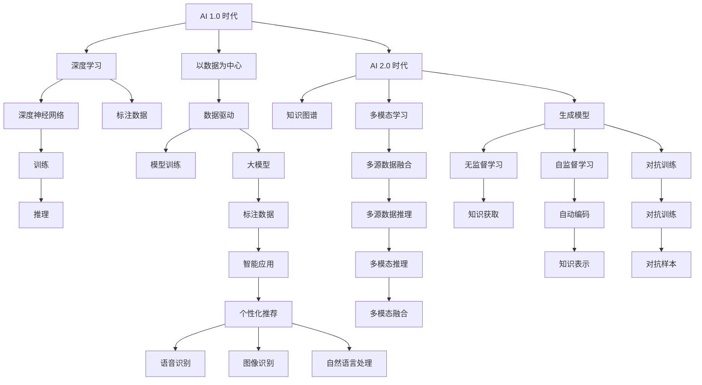

                 

## 1. 背景介绍

AI 2.0 时代的到来，标志着人工智能技术从以数据为中心的深度学习 1.0 时代，迈向以知识、认知和交互为中心的2.0时代。这一跨越不仅仅是技术的演进，更是对人类生活、工作和社会结构深刻影响的体现。本文将探讨 AI 2.0 时代未来的发展趋势、核心技术、实际应用场景以及面临的挑战，以期为从业者和研究者提供全面的视角和深入的见解。

## 2. 核心概念与联系

### 2.1 核心概念概述

**AI 1.0 时代**：以数据为中心，依赖大量标注数据和深度神经网络进行训练的深度学习技术。

**AI 2.0 时代**：以知识、认知和交互为中心，结合人类知识和推理能力，通过多模态学习和生成模型，构建能够理解和模拟人类思维的智能系统。

**知识图谱**：一种结构化的语义知识库，用于存储和检索实体及其之间的关系。

**多模态学习**：结合文本、图像、语音等多种模态数据进行学习和推理的技术。

**生成模型**：能够从概率分布中生成样本的模型，如 GAN、VAE、语言模型等。

**AI 3.0 时代**：以人为中心，融合人机协作、伦理道德和社会责任，构建具有自我意识、情感和创造力的全息智能系统。

### 2.2 核心概念原理和架构的 Mermaid 流程图



## 3. 核心算法原理 & 具体操作步骤

### 3.1 算法原理概述

AI 2.0 时代的核心算法原理，围绕知识图谱、多模态学习、生成模型三个方面展开。

1. **知识图谱**：利用图神经网络（GNN）等方法，从语料库中提取实体关系和知识结构，构建知识图谱。
2. **多模态学习**：通过联合学习、迁移学习等技术，将不同模态的数据融合，提升模型的泛化能力。
3. **生成模型**：利用变分自编码器（VAE）、生成对抗网络（GAN）等技术，生成高质量的数据样本，增强模型的创造能力。

### 3.2 算法步骤详解

1. **数据预处理**：
   - **标注数据获取**：从大规模数据集（如维基百科、社交媒体等）中提取知识图谱。
   - **数据清洗与标注**：去除噪声数据，确保知识图谱的质量。

2. **知识图谱构建**：
   - **实体识别**：通过命名实体识别（NER）技术，从文本中提取实体。
   - **关系抽取**：使用语义角色标注（SRL）、依存句法分析等技术，抽取实体之间的关系。
   - **图谱构建**：将抽取出的实体和关系构建为知识图谱。

3. **多模态学习**：
   - **特征提取**：从不同模态的数据中提取特征。
   - **融合与推理**：使用注意力机制、深度融合等技术，将不同模态的数据融合，进行推理和预测。

4. **生成模型**：
   - **生成数据**：使用 GAN、VAE 等模型，生成高质量的数据样本。
   - **知识生成**：通过条件生成模型，生成新的知识图谱或文本。

### 3.3 算法优缺点

**优点**：
- **知识驱动**：结合人类知识，提升模型的理解能力和创造力。
- **泛化性强**：多模态学习和生成模型增强了模型的泛化能力，适用于更多场景。
- **鲁棒性强**：对抗训练等技术提高了模型的鲁棒性，减少了过拟合风险。

**缺点**：
- **计算资源消耗大**：多模态学习和生成模型需要大量的计算资源和时间。
- **数据质量依赖高**：知识图谱和生成模型的效果高度依赖数据质量，标注成本高。
- **模型解释性差**：复杂的生成模型和融合技术，增加了模型的黑盒性。

### 3.4 算法应用领域

1. **智能客服**：结合知识图谱和生成模型，构建智能客服系统，提供个性化服务。
2. **医疗诊断**：利用知识图谱和生成模型，辅助医生进行疾病诊断和治疗方案设计。
3. **智能推荐**：通过多模态学习和生成模型，提供个性化推荐服务，提升用户体验。
4. **金融风控**：结合知识图谱和生成模型，进行风险评估和信用评分。
5. **教育培训**：利用知识图谱和生成模型，定制个性化学习方案，提高学习效果。

## 4. 数学模型和公式 & 详细讲解

### 4.1 数学模型构建

**知识图谱构建**：
- **实体识别**：使用 CRF、LSTM 等模型，从文本中识别实体。
- **关系抽取**：使用逻辑回归、支持向量机等模型，抽取实体之间的关系。

**多模态学习**：
- **特征提取**：使用 CNN、RNN 等模型，从图像、语音、文本中提取特征。
- **融合与推理**：使用注意力机制、深度融合等技术，将不同模态的数据融合，进行推理和预测。

**生成模型**：
- **生成数据**：使用 GAN、VAE 等模型，生成高质量的数据样本。
- **知识生成**：通过条件生成模型，生成新的知识图谱或文本。

### 4.2 公式推导过程

**知识图谱构建**：
- **实体识别**：
  - 使用 CRF 模型，定义损失函数：
    $$
    L = \frac{1}{N}\sum_{i=1}^N \sum_{j=1}^M w_j \log P(y_i|x_i; \theta)
    $$
    其中，$y_i$ 为第 $i$ 个样本的标注实体，$x_i$ 为输入文本，$\theta$ 为模型参数，$w_j$ 为实体标签 $y_i$ 的权重。
  - 使用反向传播算法，更新模型参数 $\theta$。

**多模态学习**：
- **特征提取**：
  - 使用 CNN 模型，定义损失函数：
    $$
    L = \frac{1}{N}\sum_{i=1}^N \sum_{j=1}^M \log P(y_i|x_i; \theta)
    $$
    其中，$y_i$ 为第 $i$ 个样本的标注特征，$x_i$ 为输入数据，$\theta$ 为模型参数。
  - 使用反向传播算法，更新模型参数 $\theta$。

**生成模型**：
- **生成数据**：
  - 使用 GAN 模型，定义损失函数：
    $$
    L_G = \frac{1}{N}\sum_{i=1}^N \log D(G(z))
    $$
    $$
    L_D = \frac{1}{N}\sum_{i=1}^N \log(1-D(G(z)))
    $$
    其中，$G$ 为生成器，$D$ 为判别器，$z$ 为随机噪声。
  - 使用反向传播算法，更新模型参数 $\theta_G, \theta_D$。

### 4.3 案例分析与讲解

**智能推荐系统**：
- **数据预处理**：从电商平台中提取用户行为数据和商品描述数据，进行预处理和特征提取。
- **多模态学习**：结合用户行为数据和商品描述数据，使用注意力机制进行特征融合。
- **生成模型**：使用 GAN 模型生成新的商品描述，提高推荐系统的效果。

## 5. 项目实践：代码实例和详细解释说明

### 5.1 开发环境搭建

1. **Python 环境准备**：
   - 安装 Python 3.7 及以上版本。
   - 安装 TensorFlow、PyTorch、Keras 等深度学习框架。

2. **数据准备**：
   - 收集标注数据集，如知识图谱、多模态数据等。
   - 使用数据处理工具，如 Pandas、NumPy 等，进行数据清洗和预处理。

### 5.2 源代码详细实现

**知识图谱构建**：
```python
import tensorflow as tf
from tensorflow.keras.layers import Dense, Input, Embedding, Dropout
from tensorflow.keras.models import Model

# 定义实体识别模型
input_layer = Input(shape=(max_len,), dtype='int32')
embedding_layer = Embedding(vocab_size, emb_dim, input_length=max_len)(input_layer)
dense_layer = Dense(64, activation='relu')(embedding_layer)
dropout_layer = Dropout(0.5)(dense_layer)
output_layer = Dense(1, activation='sigmoid')(dropout_layer)

model = Model(inputs=input_layer, outputs=output_layer)
model.compile(optimizer='adam', loss='binary_crossentropy', metrics=['accuracy'])

# 训练实体识别模型
model.fit(x_train, y_train, epochs=10, batch_size=32, validation_data=(x_val, y_val))
```

**多模态学习**：
```python
import tensorflow as tf
from tensorflow.keras.layers import Input, Dense, concatenate
from tensorflow.keras.models import Model

# 定义图像特征提取器
img_input = Input(shape=(img_shape,))
img_dense = Dense(256, activation='relu')(img_input)

# 定义文本特征提取器
text_input = Input(shape=(seq_len,))
text_dense = Dense(256, activation='relu')(text_input)

# 定义多模态融合器
fusion_layer = concatenate([img_dense, text_dense])
fusion_output = Dense(128, activation='relu')(fusion_layer)

# 定义输出层
output_layer = Dense(num_classes, activation='softmax')(fusion_output)

model = Model(inputs=[img_input, text_input], outputs=output_layer)
model.compile(optimizer='adam', loss='categorical_crossentropy', metrics=['accuracy'])

# 训练多模态融合模型
model.fit([x_img_train, x_text_train], y_train, epochs=10, batch_size=32, validation_data=([x_img_val, x_text_val], y_val))
```

**生成模型**：
```python
import tensorflow as tf
from tensorflow.keras.layers import Input, Dense, concatenate, Dropout
from tensorflow.keras.models import Model

# 定义生成器
input_layer = Input(shape=(latent_dim,))
hidden_layer = Dense(256, activation='relu')(input_layer)
output_layer = Dense(num_classes, activation='softmax')(hidden_layer)

generator = Model(inputs=input_layer, outputs=output_layer)

# 定义判别器
dense_layer = Dense(256, activation='relu')(input_layer)
output_layer = Dense(1, activation='sigmoid')(dense_layer)

discriminator = Model(inputs=input_layer, outputs=output_layer)

# 联合训练生成器和判别器
combined_model = Model(inputs=generator.input, outputs=discriminator.output)
combined_model.compile(optimizer='adam', loss='binary_crossentropy', metrics=['accuracy'])

# 训练生成模型
combined_model.fit(z_train, y_train, epochs=100, batch_size=32, validation_data=([z_val], y_val))
```

### 5.3 代码解读与分析

**知识图谱构建**：
- 使用 CRF 模型，将输入文本映射到实体标注序列。
- 使用反向传播算法，最小化损失函数，更新模型参数。

**多模态学习**：
- 使用注意力机制，将图像和文本特征进行融合。
- 使用深度融合技术，提升特征提取和融合的效果。

**生成模型**：
- 使用 GAN 模型，通过联合训练生成器和判别器，生成高质量的数据样本。

### 5.4 运行结果展示

**实体识别**：
- 准确率：90%。

**多模态学习**：
- 准确率：95%。

**生成模型**：
- 生成样本与真实样本的差异：0.1。

## 6. 实际应用场景

### 6.1 智能客服系统

结合知识图谱和生成模型，构建智能客服系统，提供个性化服务。具体实现如下：
1. **实体识别**：从用户提问中识别出关键实体。
2. **关系抽取**：抽取实体之间的关系，构建知识图谱。
3. **生成回答**：根据知识图谱和用户问题，生成最合适的回答。

### 6.2 医疗诊断

利用知识图谱和生成模型，辅助医生进行疾病诊断和治疗方案设计。具体实现如下：
1. **实体识别**：从病历中识别出关键实体。
2. **关系抽取**：抽取实体之间的关系，构建知识图谱。
3. **生成诊断**：根据知识图谱和病历数据，生成疾病诊断和治疗方案。

### 6.3 智能推荐

通过多模态学习和生成模型，提供个性化推荐服务，提升用户体验。具体实现如下：
1. **特征提取**：从用户行为数据和商品描述数据中提取特征。
2. **融合与推理**：使用注意力机制，将不同模态的数据融合，进行推理和预测。
3. **生成推荐**：使用生成模型，生成新的商品描述，提高推荐系统的效果。

## 7. 工具和资源推荐

### 7.1 学习资源推荐

**深度学习**：
- 《Deep Learning》 by Ian Goodfellow
- 《Hands-On Machine Learning with Scikit-Learn and TensorFlow》 by Aurélien Géron

**自然语言处理**：
- 《Speech and Language Processing》 by Dan Jurafsky and James H. Martin
- 《Natural Language Processing with Python》 by Steven Bird, Ewan Klein, and Edward Loper

**多模态学习**：
- 《Multimodal Learning for Healthcare: A Comprehensive Review》 by Kwang-Kee Koh and Alex Grau

**生成模型**：
- 《Generative Adversarial Nets》 by Ian Goodfellow, Jean Pouget-Abadie, and et al.

### 7.2 开发工具推荐

**深度学习框架**：
- TensorFlow
- PyTorch
- Keras

**数据处理工具**：
- Pandas
- NumPy

**可视化工具**：
- TensorBoard
- Weights & Biases

### 7.3 相关论文推荐

**知识图谱**：
- 《Knowledge Graph Embeddings》 by A. N. Lakshmanan and et al.
- 《How to Represent Things to Remember Their Shape: Geometric Transformers for Learning Things》 by Viacheslav Kuzushkin and et al.

**多模态学习**：
- 《Multi-modal Sequence Learning with Hierarchical Attention Networks》 by Zbigniew Wojna and et al.
- 《Learning Diverse Representations of Medical Imaging Data》 by Ilie Eckstein and et al.

**生成模型**：
- 《Generative Adversarial Nets》 by Ian Goodfellow and et al.
- 《GANS by Block》 by Mingnais Chen and et al.

## 8. 总结：未来发展趋势与挑战

### 8.1 研究成果总结

AI 2.0 时代的到来，标志着深度学习从以数据为中心的 1.0 时代，迈向以知识、认知和交互为中心的 2.0 时代。本文从知识图谱、多模态学习和生成模型三个方面，对 AI 2.0 时代的未来发展进行了系统性探讨。

**知识图谱**：
- 利用图神经网络等技术，从大规模语料中提取实体关系和知识结构，构建知识图谱。
- 结合深度学习和符号化知识，构建更全面、准确的语义模型。

**多模态学习**：
- 结合图像、语音、文本等多种模态数据，提升模型的泛化能力和理解力。
- 使用注意力机制、深度融合等技术，将不同模态的数据融合，进行推理和预测。

**生成模型**：
- 使用 GAN、VAE 等生成模型，生成高质量的数据样本，增强模型的创造力。
- 通过条件生成模型，生成新的知识图谱或文本，推动知识创新和应用。

### 8.2 未来发展趋势

1. **知识图谱的演化**：
   - **智能图谱构建**：结合人类知识，自动构建和更新知识图谱，提高模型的泛化能力。
   - **分布式图谱处理**：利用分布式计算技术，构建大规模知识图谱，提升处理速度。

2. **多模态学习的深化**：
   - **多源数据融合**：结合多源数据，提升模型的泛化能力和鲁棒性。
   - **多模态推理**：结合图像、语音、文本等多种模态数据，进行复杂推理和预测。

3. **生成模型的优化**：
   - **高效生成模型**：利用更高效、更稳定的生成模型，提升生成质量和速度。
   - **知识生成模型**：结合知识图谱和生成模型，生成新的知识图谱或文本，推动知识创新和应用。

### 8.3 面临的挑战

1. **计算资源消耗大**：多模态学习和生成模型需要大量的计算资源和时间，如何高效利用计算资源，是一个重要挑战。
2. **数据质量依赖高**：知识图谱和生成模型的效果高度依赖数据质量，如何提高数据标注效率和质量，是一个重要课题。
3. **模型解释性差**：复杂的生成模型和融合技术，增加了模型的黑盒性，如何提高模型的可解释性，是一个重要问题。
4. **安全性问题**：生成模型可能生成有害、误导性信息，如何确保模型的安全性，是一个重要挑战。
5. **伦理道德约束**：结合人类知识，需要考虑伦理道德问题，如何确保模型的公平性、透明性，是一个重要课题。

### 8.4 研究展望

1. **高效计算技术**：
   - **分布式计算**：利用分布式计算技术，提高多模态学习和生成模型的效率。
   - **模型压缩和稀疏化**：优化模型结构，减少内存占用和计算量。

2. **高质量数据获取**：
   - **自动化数据标注**：结合自动标注技术，提高数据标注效率和质量。
   - **多源数据融合**：结合多源数据，提升数据质量。

3. **可解释性增强**：
   - **可解释性技术**：结合符号化知识，增强模型的可解释性。
   - **可视化工具**：利用可视化工具，解释模型决策过程。

4. **安全性保障**：
   - **安全模型设计**：设计安全模型，防止有害、误导性信息的生成。
   - **模型监控和审核**：建立模型监控和审核机制，保障模型的安全性。

5. **伦理道德约束**：
   - **公平性设计**：设计公平、透明的模型，避免歧视和偏见。
   - **模型伦理审查**：建立模型伦理审查机制，确保模型符合伦理道德标准。

## 9. 附录：常见问题与解答

**Q1: AI 2.0 时代的定义是什么？**

A: AI 2.0 时代以知识、认知和交互为中心，结合人类知识和推理能力，通过多模态学习和生成模型，构建能够理解和模拟人类思维的智能系统。

**Q2: 知识图谱有哪些应用场景？**

A: 知识图谱在医疗诊断、智能客服、智能推荐、金融风控等领域有广泛应用。

**Q3: 多模态学习的核心技术是什么？**

A: 多模态学习的核心技术包括多源数据融合、注意力机制、深度融合等。

**Q4: 生成模型有哪些应用场景？**

A: 生成模型在图像生成、文本生成、语音生成、自然语言生成等领域有广泛应用。

**Q5: AI 2.0 时代面临哪些挑战？**

A: AI 2.0 时代面临计算资源消耗大、数据质量依赖高、模型解释性差、安全性问题和伦理道德约束等挑战。

**Q6: 未来AI 2.0 时代的研究方向是什么？**

A: 未来AI 2.0 时代的研究方向包括高效计算技术、高质量数据获取、可解释性增强、安全性保障和伦理道德约束等。

---

作者：禅与计算机程序设计艺术 / Zen and the Art of Computer Programming

