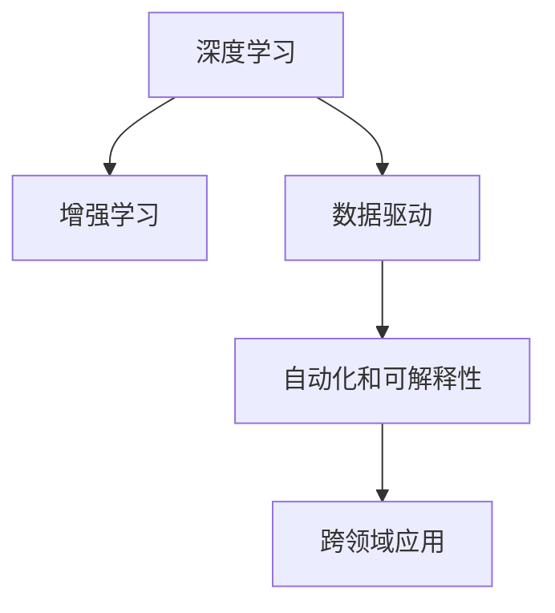

                 

# 李开复：AI 2.0 时代的未来

> 关键词：人工智能,深度学习,未来趋势,机器学习,技术发展,应用前景,创新挑战,应用场景,政策建议

## 1. 背景介绍

### 1.1 问题由来
近年来，人工智能（AI）技术迅猛发展，深刻改变了社会的方方面面。特别是深度学习（Deep Learning）的崛起，推动了AI从实验室走向实际应用。然而，随着技术的进步，AI 2.0 时代的到来，传统的人工智能应用范式面临着诸多挑战和机遇。本文将从AI 2.0时代背景出发，探讨未来AI技术的方向和挑战，为AI领域的从业者和研究者提供参考。

### 1.2 问题核心关键点
AI 2.0时代，是指深度学习和增强学习等技术进一步成熟，AI系统更加智能化、自动化，能够处理更加复杂、多样化的任务。AI 2.0时代的核心关键点包括：
- 深度学习的广泛应用：AI系统可以通过大量数据训练，获得丰富的知识，解决复杂问题。
- 增强学习的兴起：AI系统通过与环境的互动，能够不断学习和优化决策。
- 数据的黄金时代：大数据、云计算等技术的进步，使得AI系统可以处理海量数据，提升性能。

这些关键点共同推动了AI技术从传统的符号计算向基于数据的机器学习转变，带来了更广泛的应用前景和更多挑战。

## 2. 核心概念与联系

### 2.1 核心概念概述

为更好地理解AI 2.0时代的未来，本节将介绍几个密切相关的核心概念：

- **深度学习（Deep Learning）**：一种基于多层神经网络的机器学习方法，能够处理复杂的数据结构，自动提取特征。
- **增强学习（Reinforcement Learning）**：通过与环境互动，学习最优策略以实现特定目标，广泛应用于游戏、机器人等领域。
- **数据驱动**：AI系统依赖于大量的数据进行训练和优化，数据质量和多样性对模型性能至关重要。
- **自动化和可解释性**：AI系统不仅要具备自动化处理任务的能力，还要具备一定的可解释性，方便人类理解其决策过程。
- **跨领域应用**：AI技术广泛应用于医疗、金融、教育、制造业等各个领域，带来广泛的社会变革。

这些核心概念之间的逻辑关系可以通过以下Mermaid流程图来展示：



这个流程图展示了大语言模型与相关核心概念之间的关系：深度学习和增强学习是大语言模型的核心算法；数据驱动和自动化可解释性是大语言模型的重要特性；跨领域应用是大语言模型的广泛应用场景。

## 3. 核心算法原理 & 具体操作步骤
### 3.1 算法原理概述

AI 2.0时代的核心算法包括深度学习和增强学习，其基本原理如下：

- **深度学习**：通过多层神经网络模拟人类大脑的工作机制，自动提取特征并学习模型参数。
- **增强学习**：通过与环境互动，通过试错不断优化策略，实现最优决策。

AI 2.0时代的算法操作通常包括以下步骤：

1. **数据准备**：收集并处理大量数据，用于训练和优化AI系统。
2. **模型设计**：选择或设计合适的深度学习模型，如卷积神经网络（CNN）、递归神经网络（RNN）、Transformer等。
3. **模型训练**：通过大量数据训练模型，调整模型参数以优化性能。
4. **模型评估**：使用测试集评估模型性能，确保模型能够处理新数据。
5. **模型应用**：将训练好的模型应用于实际问题，进行预测、分类、生成等操作。

### 3.2 算法步骤详解

以下以图像分类为例，详细讲解AI 2.0时代的算法操作步骤：

1. **数据准备**：收集并标注大量图像数据，分为训练集、验证集和测试集。
2. **模型设计**：选择CNN模型作为基础架构，加入Dropout、批标准化等正则化技术，设计适当的层数和卷积核大小。
3. **模型训练**：使用SGD、Adam等优化器，设置合适的学习率、批大小等超参数，在训练集上迭代训练模型。
4. **模型评估**：在验证集上监测模型性能，如准确率、损失等指标，调整超参数以防止过拟合。
5. **模型应用**：将训练好的模型应用于测试集上，评估模型泛化能力。

### 3.3 算法优缺点

AI 2.0时代的算法具有以下优点：

- **处理复杂任务**：深度学习和增强学习能够处理复杂的数据结构和决策问题，提升AI系统的应用范围。
- **自动优化**：AI系统能够通过大量的数据训练和优化，提高模型性能和泛化能力。
- **跨领域应用**：AI技术广泛应用于各个领域，带来广泛的社会变革。

同时，这些算法也存在一些局限性：

- **计算资源需求高**：深度学习和增强学习需要大量计算资源进行训练和优化，对硬件设备要求较高。
- **数据依赖性**：AI系统的性能很大程度上依赖于数据的质量和多样性，数据获取和标注成本高。
- **模型复杂度高**：深度学习和增强学习模型参数众多，难以理解和调试，模型解释性不足。
- **鲁棒性差**：AI系统面对未知数据或噪声干扰时，性能可能大幅下降。

### 3.4 算法应用领域

AI 2.0时代的算法在多个领域都有广泛应用，包括但不限于：

- **医疗**：通过深度学习进行图像诊断、自然语言处理（NLP）进行患者问答、增强学习进行手术规划等。
- **金融**：利用深度学习和增强学习进行风险管理、智能投顾、自动化交易等。
- **制造**：通过深度学习和增强学习进行质量检测、生产优化、机器人控制等。
- **教育**：使用AI进行个性化推荐、智能辅导、情感分析等。
- **自动驾驶**：利用深度学习和增强学习进行图像识别、路径规划、行为决策等。

## 4. 数学模型和公式 & 详细讲解 & 举例说明（备注：数学公式请使用latex格式，latex嵌入文中独立段落使用 $$，段落内使用 $)
### 4.1 数学模型构建

在AI 2.0时代，数学模型构建主要是基于深度学习的基本框架。以下以图像分类为例，介绍常见模型的构建方法：

假设输入图像为 $x \in \mathbb{R}^m$，模型输出为 $y \in \{1, 2, \ldots, C\}$，其中 $C$ 为类别数。常见的深度学习模型包括卷积神经网络（CNN）、全连接神经网络（FCN）等。

### 4.2 公式推导过程

以CNN为例，介绍常见模型的公式推导过程：

- **卷积层**：通过卷积操作提取特征，公式如下：
  $$
  h_{\theta}(x) = \max_{i,j} \left\{\sum_k \theta_{k,(i,j)} x_k \right\}
  $$
  其中 $\theta$ 为卷积核权重，$x_k$ 为输入图像的特征。

- **池化层**：通过最大池化操作降低特征维度，公式如下：
  $$
  h_{\theta}(x) = \max_{i,j} \left\{\sum_k \theta_{k,(i,j)} x_k \right\}
  $$
  其中 $\theta$ 为池化核权重，$x_k$ 为输入特征。

- **全连接层**：通过线性变换和激活函数实现分类，公式如下：
  $$
  y = \sigma(\sum_i \theta_i h_{\theta}(x))
  $$
  其中 $\theta_i$ 为全连接层权重，$h_{\theta}(x)$ 为卷积池化后的特征。

### 4.3 案例分析与讲解

以图像分类任务为例，使用CNN模型进行预测：

- **模型设计**：选择合适的卷积核大小和层数，加入Dropout、批标准化等正则化技术。
- **模型训练**：使用SGD、Adam等优化器，设置合适的学习率、批大小等超参数，在训练集上迭代训练模型。
- **模型评估**：在验证集上监测模型性能，如准确率、损失等指标，调整超参数以防止过拟合。
- **模型应用**：将训练好的模型应用于测试集上，评估模型泛化能力。

## 5. 项目实践：代码实例和详细解释说明
### 5.1 开发环境搭建

在进行AI 2.0时代的算法实践前，我们需要准备好开发环境。以下是使用Python进行TensorFlow开发的环境配置流程：

1. 安装Anaconda：从官网下载并安装Anaconda，用于创建独立的Python环境。
2. 创建并激活虚拟环境：
```bash
conda create -n tf-env python=3.8 
conda activate tf-env
```
3. 安装TensorFlow：根据CUDA版本，从官网获取对应的安装命令。例如：
```bash
conda install tensorflow=2.7
```
4. 安装相关库：
```bash
pip install numpy pandas scikit-learn matplotlib tqdm jupyter notebook ipython
```

完成上述步骤后，即可在`tf-env`环境中开始AI 2.0时代的算法实践。

### 5.2 源代码详细实现

下面以图像分类为例，给出使用TensorFlow进行卷积神经网络模型的代码实现。

首先，定义模型和损失函数：

```python
import tensorflow as tf
from tensorflow.keras import layers

model = tf.keras.Sequential([
    layers.Conv2D(32, (3, 3), activation='relu', input_shape=(28, 28, 1)),
    layers.MaxPooling2D((2, 2)),
    layers.Flatten(),
    layers.Dense(10, activation='softmax')
])

loss = tf.keras.losses.CategoricalCrossentropy()
```

然后，定义训练和评估函数：

```python
@tf.function
def train_step(images, labels):
    with tf.GradientTape() as tape:
        predictions = model(images, training=True)
        loss_value = loss(predictions, labels)
    gradients = tape.gradient(loss_value, model.trainable_variables)
    optimizer.apply_gradients(zip(gradients, model.trainable_variables))
    return loss_value

@tf.function
def evaluate_step(images, labels):
    predictions = model(images, training=False)
    return tf.reduce_mean(loss(predictions, labels))

# 训练过程
epochs = 10
batch_size = 32

for epoch in range(epochs):
    total_loss = 0
    for images, labels in train_dataset:
        loss = train_step(images, labels)
        total_loss += loss
    print(f'Epoch {epoch+1}, loss: {total_loss/n_samples}')
    
    # 评估过程
    total_loss = 0
    for images, labels in eval_dataset:
        loss = evaluate_step(images, labels)
        total_loss += loss
    print(f'Epoch {epoch+1}, evaluation loss: {total_loss/n_samples}')
```

最后，启动训练流程并在测试集上评估：

```python
train_dataset = tf.data.Dataset.from_tensor_slices((train_images, train_labels))
eval_dataset = tf.data.Dataset.from_tensor_slices((test_images, test_labels))

train_dataset = train_dataset.shuffle(1000).batch(batch_size)
eval_dataset = eval_dataset.batch(batch_size)

optimizer = tf.keras.optimizers.Adam(learning_rate=0.001)

# 训练
for epoch in range(epochs):
    total_loss = 0
    for images, labels in train_dataset:
        loss = train_step(images, labels)
        total_loss += loss
    print(f'Epoch {epoch+1}, loss: {total_loss/n_samples}')
    
    # 评估
    total_loss = 0
    for images, labels in eval_dataset:
        loss = evaluate_step(images, labels)
        total_loss += loss
    print(f'Epoch {epoch+1}, evaluation loss: {total_loss/n_samples}')
```

以上就是使用TensorFlow进行卷积神经网络模型训练和评估的完整代码实现。可以看到，TensorFlow的高级API使得模型构建和训练变得简洁高效。

### 5.3 代码解读与分析

让我们再详细解读一下关键代码的实现细节：

**train_step函数**：
- 定义了一个训练步骤函数，通过tf.GradientTape记录梯度，并使用Adam优化器更新模型参数。

**evaluate_step函数**：
- 定义了一个评估步骤函数，通过模型预测和损失函数计算模型在测试集上的性能。

**训练过程**：
- 定义了训练和评估的轮数，使用tf.data.Dataset对数据进行批处理和分片，使用Adam优化器进行梯度更新。

**评估过程**：
- 在训练过程中，使用evaluate_step函数计算模型在测试集上的损失，评估模型性能。

通过TensorFlow的使用，我们可以更方便地进行深度学习模型的开发和训练，而无需过多关注底层细节。

当然，工业级的系统实现还需考虑更多因素，如模型的保存和部署、超参数的自动搜索、更灵活的任务适配层等。但核心的算法操作基本与此类似。

## 6. 实际应用场景
### 6.1 医疗诊断

在医疗领域，AI 2.0时代的算法可以用于医学图像的自动诊断。例如，使用卷积神经网络对X光片、CT图像等进行分类和识别，辅助医生进行诊断。此外，利用自然语言处理（NLP）技术进行病历分析、患者问答，提升医疗服务的智能化水平。

### 6.2 智能投顾

在金融领域，AI 2.0时代的算法可以用于智能投顾。通过深度学习和增强学习技术，AI系统可以对金融市场进行预测，推荐投资组合，优化投资策略，降低投资风险。

### 6.3 自动驾驶

在自动驾驶领域，AI 2.0时代的算法可以用于图像识别、路径规划、行为决策等方面。通过卷积神经网络对道路标志、交通信号进行识别，使用强化学习进行路径规划和行为决策，提升自动驾驶的安全性和智能化水平。

### 6.4 未来应用展望

随着AI 2.0时代的算法不断发展，未来的应用前景将更加广阔。以下是几个可能的发展方向：

1. **通用人工智能（AGI）**：未来的AI系统能够具备更广泛的知识和推理能力，能够处理更加复杂和多样化的任务。
2. **跨模态学习**：未来的AI系统能够整合视觉、听觉、文本等多种数据模态，实现更加全面的信息处理和决策。
3. **增强学习在实际场景中的应用**：增强学习将在实际场景中得到更广泛的应用，如机器人控制、游戏策略优化等。
4. **自动化与可解释性**：未来的AI系统将具备更高的自动化水平和更强的可解释性，方便人类理解和调试。
5. **伦理与安全**：未来的AI系统将更加注重伦理和安全问题，确保系统的公平性、透明性和安全性。

## 7. 工具和资源推荐
### 7.1 学习资源推荐

为了帮助开发者系统掌握AI 2.0时代的算法原理和实践技巧，这里推荐一些优质的学习资源：

1. 《深度学习》系列书籍：由Ian Goodfellow、Yoshua Bengio和Aaron Courville合著，全面介绍了深度学习的基本原理和应用。
2. 《Python深度学习》系列书籍：由Francois Chollet撰写，介绍了TensorFlow等深度学习框架的使用方法和应用场景。
3. 《Reinforcement Learning: An Introduction》书籍：由Richard S. Sutton和Andrew G. Barto合著，全面介绍了增强学习的基本原理和算法。
4. 《自然语言处理综论》系列课程：由Coursera等平台提供，系统讲解了NLP的基本概念和技术。
5. 《Deep Learning Specialization》课程：由Andrew Ng教授在Coursera上提供，系统介绍了深度学习的理论和实践。

通过这些资源的学习实践，相信你一定能够快速掌握AI 2.0时代的算法精髓，并用于解决实际的AI问题。

### 7.2 开发工具推荐

高效的开发离不开优秀的工具支持。以下是几款用于AI 2.0时代算法开发的常用工具：

1. TensorFlow：由Google主导开发的开源深度学习框架，生产部署方便，适合大规模工程应用。
2. PyTorch：基于Python的开源深度学习框架，灵活动态的计算图，适合快速迭代研究。
3. Keras：高级API，简化深度学习模型的构建和训练，方便新手上手。
4. Jupyter Notebook：交互式的数据科学环境，方便代码开发和结果展示。
5. TensorBoard：TensorFlow配套的可视化工具，实时监测模型训练状态，提供丰富的图表呈现方式。

合理利用这些工具，可以显著提升AI 2.0时代算法开发的效率，加快创新迭代的步伐。

### 7.3 相关论文推荐

AI 2.0时代的算法不断发展，涌现了大量前沿研究。以下是几篇奠基性的相关论文，推荐阅读：

1. AlexNet：2012年ImageNet比赛中获胜的网络模型，标志着深度学习在图像分类领域的应用。
2. ResNet：通过残差连接解决深度网络退化问题，推动了深度学习的发展。
3. AlphaGo：通过深度学习和增强学习技术，击败人类围棋冠军，展示了AI在复杂决策中的应用。
4. GANs：生成对抗网络，通过生成器和判别器的博弈实现高质量图像生成。
5. Transformer：基于自注意力机制的模型，推动了NLP和机器翻译等领域的发展。

这些论文代表了大语言模型算法的最新进展，通过学习这些前沿成果，可以帮助研究者把握学科前进方向，激发更多的创新灵感。

## 8. 总结：未来发展趋势与挑战

### 8.1 研究成果总结

AI 2.0时代的算法在多个领域都取得了显著进展，推动了AI技术的广泛应用。主要的研究成果包括：

1. 深度学习在图像、语音、自然语言处理等领域的应用。
2. 增强学习在机器人控制、自动驾驶、游戏策略优化等方面的应用。
3. 跨领域应用的拓展，提升了AI系统在医疗、金融、教育等领域的性能。

### 8.2 未来发展趋势

展望未来，AI 2.0时代的算法将呈现以下几个发展趋势：

1. **通用人工智能（AGI）**：未来的AI系统将具备更广泛的知识和推理能力，能够处理更加复杂和多样化的任务。
2. **跨模态学习**：未来的AI系统将整合视觉、听觉、文本等多种数据模态，实现更加全面的信息处理和决策。
3. **增强学习在实际场景中的应用**：增强学习将在实际场景中得到更广泛的应用，如机器人控制、游戏策略优化等。
4. **自动化与可解释性**：未来的AI系统将具备更高的自动化水平和更强的可解释性，方便人类理解和调试。
5. **伦理与安全**：未来的AI系统将更加注重伦理和安全问题，确保系统的公平性、透明性和安全性。

### 8.3 面临的挑战

尽管AI 2.0时代的算法取得了巨大进展，但在迈向更加智能化、普适化应用的过程中，它仍面临诸多挑战：

1. **计算资源需求高**：深度学习和增强学习需要大量计算资源进行训练和优化，对硬件设备要求较高。
2. **数据依赖性**：AI系统的性能很大程度上依赖于数据的质量和多样性，数据获取和标注成本高。
3. **模型复杂度高**：深度学习和增强学习模型参数众多，难以理解和调试，模型解释性不足。
4. **鲁棒性差**：AI系统面对未知数据或噪声干扰时，性能可能大幅下降。
5. **伦理和安全问题**：AI系统可能存在偏见、歧视等问题，需要更多的伦理和安全保障。

### 8.4 研究展望

面对AI 2.0时代的算法面临的挑战，未来的研究需要在以下几个方面寻求新的突破：

1. **探索无监督和半监督学习**：摆脱对大规模标注数据的依赖，利用自监督学习、主动学习等无监督和半监督范式，最大限度利用非结构化数据，实现更加灵活高效的算法。
2. **开发参数高效和计算高效的算法**：开发更加参数高效的算法，在固定大部分预训练参数的同时，只更新极少量的任务相关参数。同时优化算法的计算图，减少前向传播和反向传播的资源消耗，实现更加轻量级、实时性的部署。
3. **融合因果和对比学习范式**：通过引入因果推断和对比学习思想，增强AI系统建立稳定因果关系的能力，学习更加普适、鲁棒的知识表示。
4. **引入更多先验知识**：将符号化的先验知识，如知识图谱、逻辑规则等，与神经网络模型进行巧妙融合，引导AI系统学习更准确、合理的知识表示。
5. **结合因果分析和博弈论工具**：将因果分析方法引入AI系统，识别出模型决策的关键特征，增强输出的解释性和逻辑性。借助博弈论工具刻画人机交互过程，主动探索并规避模型的脆弱点，提高系统稳定性。
6. **纳入伦理道德约束**：在AI系统的训练目标中引入伦理导向的评估指标，过滤和惩罚有偏见、有害的输出倾向。同时加强人工干预和审核，建立模型行为的监管机制，确保输出符合人类价值观和伦理道德。

## 9. 附录：常见问题与解答

**Q1：AI 2.0时代的算法是否适用于所有NLP任务？**

A: AI 2.0时代的算法在大多数NLP任务上都能取得不错的效果，特别是对于数据量较小的任务。但对于一些特定领域的任务，如医学、法律等，仅仅依靠通用语料预训练的模型可能难以很好地适应。此时需要在特定领域语料上进一步预训练，再进行微调，才能获得理想效果。

**Q2：AI 2.0时代的算法是否可以应用于多模态数据？**

A: AI 2.0时代的算法不仅可以应用于文本数据，还可以应用于图像、语音、视频等多种数据模态。通过跨模态学习，AI系统可以整合不同模态的信息，实现更加全面的信息处理和决策。

**Q3：AI 2.0时代的算法是否存在过拟合问题？**

A: AI 2.0时代的算法在训练过程中存在过拟合问题，尤其是在数据量较小的情况下。常见的缓解策略包括数据增强、正则化、对抗训练等。

**Q4：AI 2.0时代的算法是否具有可解释性？**

A: AI 2.0时代的算法通常被称为"黑盒"模型，其决策过程难以解释。为了提高算法的可解释性，研究人员开发了多种可解释性技术，如注意力机制、可视化工具等。

**Q5：AI 2.0时代的算法是否需要大量的计算资源？**

A: AI 2.0时代的算法需要大量的计算资源进行训练和优化，对硬件设备要求较高。合理利用分布式计算、GPU/TPU等高性能设备，可以提升算法的训练效率。

---

作者：禅与计算机程序设计艺术 / Zen and the Art of Computer Programming

