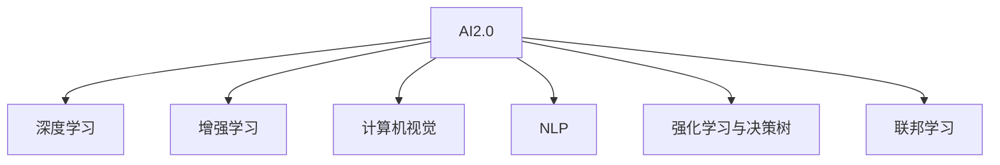

                 

## 1. 背景介绍

### 1.1 问题由来

人工智能(AI)作为21世纪最具影响力的技术之一，其发展经历了几个不同的阶段。从早期的符号AI到深度学习驱动的AI，再到如今AI2.0时代，AI技术正在加速向各个行业渗透，创造前所未有的价值。本文将探讨AI2.0时代带来的机遇与挑战，探讨开发者如何在这一时代抓住机遇，实现技术的突破和应用。

### 1.2 问题核心关键点

AI2.0时代的核心在于充分利用大数据、云计算、硬件加速、自动化模型训练等新兴技术，提升AI模型的性能，拓展AI应用的深度和广度。AI2.0技术的成熟和普及，将极大地提升生产力，改善人们的生活质量，并促进社会的可持续发展。然而，AI2.0时代的到来也带来了数据隐私、伦理道德、安全性等诸多挑战，需要在技术与应用中加以考虑和平衡。

## 2. 核心概念与联系

### 2.1 核心概念概述

为更好地理解AI2.0时代的技术变革和应用机遇，本节将介绍几个密切相关的核心概念：

- **AI2.0**：以深度学习和增强学习为主导，通过大规模数据和计算资源驱动的AI技术新阶段。AI2.0融合了自然语言处理、计算机视觉、机器人学、医疗诊断等多个领域，具有更强的自动化和智能化。

- **深度学习**：一种基于神经网络的机器学习方法，通过多层非线性变换，从数据中提取特征，实现对复杂问题的处理。深度学习在图像识别、语音识别、自然语言处理等领域取得了突破性进展。

- **增强学习**：一种通过与环境互动，逐步学习最优策略的机器学习方法。增强学习在游戏、机器人、金融等领域展示了强大的能力。

- **计算机视觉**：通过机器学习使计算机理解图像和视频内容的技术。计算机视觉在自动驾驶、医疗影像分析、安防监控等领域有广泛应用。

- **自然语言处理(NLP)**：使计算机能够理解和处理人类语言的技术。NLP在机器翻译、文本摘要、智能客服等领域发挥重要作用。

- **强化学习与决策树**：结合强化学习与决策树，提升模型决策的自动化与智能化，增强模型的泛化能力。

- **联邦学习(Federated Learning)**：在分布式环境下，无需集中存储数据，各节点本地训练模型，并通过聚合更新模型参数，实现数据和模型分布式协同优化。

这些核心概念之间的逻辑关系可以通过以下Mermaid流程图来展示：



这个流程图展示了大语言模型的核心概念及其之间的关系：

1. AI2.0时代的大规模应用。
2. 深度学习、增强学习、计算机视觉、NLP等技术在大规模应用中的重要作用。
3. 联邦学习在分布式环境下的应用，提升模型效率和安全性。

## 3. 核心算法原理 & 具体操作步骤
### 3.1 算法原理概述

AI2.0时代的核心算法原理以深度学习和增强学习为主导，通过大规模数据和计算资源驱动AI模型的性能提升。以下对深度学习和增强学习的核心原理进行概述：

**深度学习**：
深度学习通过多层神经网络对输入数据进行抽象和映射，最终输出预测结果。深度学习模型通常由输入层、隐藏层和输出层组成。隐藏层通过非线性变换捕捉数据的复杂特征，从而提高模型的拟合能力。常见的深度学习模型包括卷积神经网络(CNN)、循环神经网络(RNN)、长短期记忆网络(LSTM)、变分自编码器(VAE)等。

**增强学习**：
增强学习通过与环境的互动，逐步学习最优策略。其核心思想是设计一个奖励机制，让模型在每一步行动后获得奖励或惩罚，通过最大化累积奖励，学习最优策略。增强学习的核心算法包括Q-learning、SARSA、Actor-Critic等。

### 3.2 算法步骤详解

**深度学习模型训练**：
1. 数据准备：收集和预处理训练数据，分为训练集和验证集。
2. 模型构建：选择合适的深度学习模型，如CNN、RNN等，构建模型结构。
3. 模型训练：在训练集上使用反向传播算法，计算损失函数，并通过优化器更新模型参数。
4. 模型评估：在验证集上评估模型性能，根据评估结果调整模型参数，防止过拟合。
5. 模型测试：在新数据集上测试模型性能，评估模型泛化能力。

**增强学习模型训练**：
1. 环境设计：设计环境模型，定义状态、动作和奖励函数。
2. 初始化：初始化模型参数。
3. 迭代训练：在每一步动作后，根据环境反馈调整模型参数，逐步学习最优策略。
4. 评估和优化：通过评估和优化策略，提升模型性能。

### 3.3 算法优缺点

深度学习的优点：
1. 强大的拟合能力：深度学习模型可以通过多层非线性变换捕捉数据的复杂特征。
2. 可扩展性：深度学习模型可以通过增加网络深度和宽度来提高性能。
3. 广泛应用：深度学习在图像识别、语音识别、自然语言处理等领域有广泛应用。

深度学习的缺点：
1. 数据需求大：深度学习模型需要大量的标注数据进行训练。
2. 计算资源要求高：深度学习模型通常需要高性能计算资源进行训练。
3. 可解释性差：深度学习模型被视为“黑盒”，难以解释其内部工作机制。

增强学习的优点：
1. 适应性强：增强学习模型能够自适应环境变化，学习最优策略。
2. 可扩展性好：增强学习模型可以应用于复杂环境，如游戏、机器人等。
3. 自动化程度高：增强学习模型能够自动探索最优策略，减少人工干预。

增强学习的缺点：
1. 探索效率低：增强学习模型在开始阶段探索效率低，需要大量的训练时间。
2. 环境建模复杂：增强学习模型需要准确建模环境，才能得到好的训练效果。
3. 计算成本高：增强学习模型需要大量的计算资源进行训练和优化。

### 3.4 算法应用领域

深度学习和增强学习在AI2.0时代得到了广泛应用，覆盖了以下几个重要领域：

- **自然语言处理(NLP)**：深度学习在机器翻译、文本生成、情感分析、问答系统等领域有重要应用。增强学习在对话系统、自然语言推理等领域有进一步探索。

- **计算机视觉**：深度学习在图像分类、物体检测、人脸识别等领域有重要应用。增强学习在目标追踪、动态场景理解等领域有进一步探索。

- **机器人学**：深度学习在机器人感知、控制和决策等领域有重要应用。增强学习在机器人路径规划、运动控制等领域有进一步探索。

- **医疗诊断**：深度学习在医学影像分析、基因组学等领域有重要应用。增强学习在医疗决策支持、智能诊断等领域有进一步探索。

- **金融分析**：深度学习在股票预测、信用评分、风险评估等领域有重要应用。增强学习在交易策略优化、投资组合管理等领域有进一步探索。

## 4. 数学模型和公式 & 详细讲解 & 举例说明
### 4.1 数学模型构建

本节将使用数学语言对深度学习和增强学习的核心数学模型进行详细讲解。

**深度学习模型**：
以多层神经网络为例，深度学习模型可以表示为：

$$
h = \sigma(W_1x + b_1), h_1 = \sigma(W_2h + b_2), ..., h_n = \sigma(W_nh_{n-1} + b_n)
$$

其中，$h$表示输出层的隐藏状态，$x$表示输入，$W$表示权重矩阵，$b$表示偏置向量，$\sigma$表示激活函数，如ReLU、sigmoid等。

**增强学习模型**：
以Q-learning为例，增强学习模型可以表示为：

$$
Q(s,a) = Q(s,a) + \alpha[r + \gamma \max_{a'}Q(s',a')] - Q(s,a)
$$

其中，$s$表示当前状态，$a$表示动作，$r$表示即时奖励，$s'$表示下一个状态，$\alpha$表示学习率，$\gamma$表示折扣因子。

### 4.2 公式推导过程

以下我们以多层感知器(Multilayer Perceptron, MLP)为例，推导其前向传播和反向传播的数学公式。

**前向传播**：
设输入向量为 $x$，权重矩阵为 $W$，偏置向量为 $b$，激活函数为 $\sigma$。MLP的前向传播过程可以表示为：

$$
h_1 = \sigma(W_1x + b_1)
$$
$$
h_2 = \sigma(W_2h_1 + b_2)
$$
$$
...
$$
$$
h_n = \sigma(W_nh_{n-1} + b_n)
$$
$$
y = h_n
$$

其中，$h_i$ 表示第 $i$ 层的隐藏状态，$y$ 表示输出。

**反向传播**：
设损失函数为 $L(y,\hat{y})$，MLP的反向传播过程可以表示为：

$$
\frac{\partial L}{\partial W_n} = \frac{\partial L}{\partial h_n}\frac{\partial h_n}{\partial W_n}
$$
$$
\frac{\partial L}{\partial b_n} = \frac{\partial L}{\partial h_n}
$$
$$
...
$$
$$
\frac{\partial L}{\partial W_1} = \frac{\partial L}{\partial h_1}\frac{\partial h_1}{\partial W_1}
$$
$$
\frac{\partial L}{\partial b_1} = \frac{\partial L}{\partial h_1}
$$

其中，$\frac{\partial L}{\partial W}$ 表示权重矩阵的梯度，$\frac{\partial L}{\partial b}$ 表示偏置向量的梯度。

通过链式法则，可以得到权重矩阵和偏置向量的更新公式：

$$
W_n = W_n - \eta\frac{\partial L}{\partial W_n}
$$
$$
b_n = b_n - \eta\frac{\partial L}{\partial b_n}
$$

其中，$\eta$ 表示学习率。

### 4.3 案例分析与讲解

**深度学习：图像分类**

以LeNet-5为例，LeNet-5是一种常用的卷积神经网络，用于图像分类。其核心思想是通过卷积和池化操作提取图像特征，并使用全连接层进行分类。

LeNet-5的架构如下：

```
       层       输入   输出   参数
------------------------------------------------
  卷积层1    28x28x1  6x6x6x6    6*6*1*1*6 = 36
  池化层1    6x6x6x6    6x6x6x6    0
  卷积层2    6x6x6x6   1x1x1x6 = 6
  池化层2    1x1x1x6   1x1x1x6 = 6
  全连接层1   1x1x6x6    6x6x6 = 216
  全连接层2    6x10    6*10 = 60
```

其中，卷积层和池化层用于提取图像特征，全连接层用于分类。

**增强学习：自动游戏**

以AlphaGo为例，AlphaGo使用深度学习和增强学习相结合的策略。其核心思想是通过蒙特卡罗树搜索(MCTS)，在每一步选择最优动作，学习最优策略。

AlphaGo的策略选择过程如下：

1. 从当前状态 $s$ 开始，通过随机策略选择动作 $a$。
2. 在下一个状态 $s'$ 上，通过蒙特卡罗树搜索，选择最优动作 $a'$。
3. 返回奖励 $r$，并更新当前状态 $s$。
4. 重复上述过程，直至终止。

AlphaGo通过不断迭代训练，逐步学习最优策略，实现自动游戏。

## 5. 项目实践：代码实例和详细解释说明
### 5.1 开发环境搭建

在进行AI2.0时代的技术实践前，我们需要准备好开发环境。以下是使用Python进行TensorFlow开发的环境配置流程：

1. 安装Anaconda：从官网下载并安装Anaconda，用于创建独立的Python环境。

2. 创建并激活虚拟环境：
```bash
conda create -n tensorflow-env python=3.8 
conda activate tensorflow-env
```

3. 安装TensorFlow：根据CUDA版本，从官网获取对应的安装命令。例如：
```bash
conda install tensorflow tensorflow-gpu -c conda-forge
```

4. 安装各类工具包：
```bash
pip install numpy pandas scikit-learn matplotlib tqdm jupyter notebook ipython
```

完成上述步骤后，即可在`tensorflow-env`环境中开始AI2.0时代的项目实践。

### 5.2 源代码详细实现

下面我们以图像分类任务为例，给出使用TensorFlow对卷积神经网络进行训练的PyTorch代码实现。

首先，定义图像分类任务的训练数据和模型：

```python
import tensorflow as tf
from tensorflow.keras.datasets import mnist
from tensorflow.keras.models import Sequential
from tensorflow.keras.layers import Conv2D, MaxPooling2D, Flatten, Dense

# 加载MNIST数据集
(x_train, y_train), (x_test, y_test) = mnist.load_data()

# 数据预处理
x_train = x_train.reshape((x_train.shape[0], 28, 28, 1)) / 255.0
x_test = x_test.reshape((x_test.shape[0], 28, 28, 1)) / 255.0

# 定义模型结构
model = Sequential()
model.add(Conv2D(32, (3, 3), activation='relu', input_shape=(28, 28, 1)))
model.add(MaxPooling2D((2, 2)))
model.add(Conv2D(64, (3, 3), activation='relu'))
model.add(MaxPooling2D((2, 2)))
model.add(Flatten())
model.add(Dense(64, activation='relu'))
model.add(Dense(10, activation='softmax'))

# 编译模型
model.compile(optimizer='adam', loss='sparse_categorical_crossentropy', metrics=['accuracy'])

# 训练模型
model.fit(x_train, y_train, epochs=5, validation_data=(x_test, y_test))
```

然后，定义模型评估和测试：

```python
# 评估模型
test_loss, test_acc = model.evaluate(x_test, y_test)
print(f'Test accuracy: {test_acc:.2f}')

# 测试模型
predictions = model.predict(x_test)
```

最后，运行上述代码，即可在TensorFlow平台上训练卷积神经网络，并对图像进行分类。

### 5.3 代码解读与分析

让我们再详细解读一下关键代码的实现细节：

**MNIST数据集**：
- 使用TensorFlow内置的MNIST数据集，加载训练集和测试集。
- 对图像数据进行预处理，将像素值归一化到[0,1]范围内，并转换为4D张量。

**模型结构**：
- 使用Sequential模型构建卷积神经网络，包含两个卷积层、两个池化层、两个全连接层。
- 卷积层使用3x3的卷积核，ReLU激活函数，MaxPooling2D用于下采样。
- 全连接层使用ReLU激活函数，输出层使用softmax函数进行多分类。

**模型编译与训练**：
- 使用Adam优化器进行模型训练，损失函数使用稀疏分类交叉熵。
- 在模型训练过程中，每轮迭代使用测试集评估模型性能，并输出测试精度。

**模型评估与测试**：
- 使用evaluate方法对模型进行评估，输出测试损失和精度。
- 使用predict方法对测试集进行分类预测，得到分类结果。

以上代码实现展示了TensorFlow在图像分类任务上的应用，通过卷积神经网络的构建和训练，实现了对手写数字图像的准确分类。通过深度学习技术的加持，AI2.0时代的人工智能技术变得更加强大和智能。

## 6. 实际应用场景
### 6.1 智能医疗

AI2.0时代在智能医疗领域的应用潜力巨大，通过深度学习和增强学习技术，可以实现病患的智能诊断、治疗方案推荐和药物研发等。

例如，深度学习可以通过医学影像分析，自动检测和识别肿瘤、疾病等异常情况。增强学习可以在自动化的治疗方案推荐中，根据患者的历史病历数据，学习最优的治疗方案。

### 6.2 智能制造

在智能制造领域，AI2.0技术可以用于预测设备故障、优化生产流程和提高生产效率。

例如，深度学习可以通过对生产设备数据的分析，预测设备的故障概率和维护需求。增强学习可以通过模拟和优化生产流程，实现生产线的智能调度和管理。

### 6.3 金融分析

在金融领域，AI2.0技术可以用于股票预测、信用评分和风险评估等。

例如，深度学习可以通过对市场数据的分析，预测股票的价格走势。增强学习可以在风险评估中，通过模拟市场变化，学习最优的投资策略。

### 6.4 自动驾驶

自动驾驶是AI2.0时代的重要应用之一，通过计算机视觉和增强学习技术，可以实现车辆的自动驾驶和路径规划。

例如，深度学习可以通过对道路图像和传感器数据的分析，识别交通信号和障碍物。增强学习可以通过模拟驾驶场景，学习最优的驾驶策略。

## 7. 工具和资源推荐
### 7.1 学习资源推荐

为了帮助开发者系统掌握AI2.0时代的技术基础和应用场景，这里推荐一些优质的学习资源：

1. 《深度学习》系列课程：由斯坦福大学、Coursera等平台开设，涵盖深度学习的基本概念和应用场景。

2. 《TensorFlow官方文档》：TensorFlow的官方文档，提供了丰富的学习资源和样例代码。

3. 《强化学习》课程：由DeepMind等平台开设，涵盖强化学习的基本概念和算法实现。

4. 《AI2.0时代的技术趋势》：AI2.0时代的最新研究动态和技术进展，帮助开发者了解最新的技术前沿。

5. AI2.0时代开源项目：如TensorFlow、PyTorch等深度学习框架，OpenAI的GPT系列模型等，提供了丰富的模型和工具，便于开发者进行技术实践。

通过对这些资源的学习实践，相信你一定能够快速掌握AI2.0时代的技术基础，并用于解决实际的AI问题。

### 7.2 开发工具推荐

高效的开发离不开优秀的工具支持。以下是几款用于AI2.0时代技术开发的常用工具：

1. PyTorch：基于Python的开源深度学习框架，灵活动态的计算图，适合快速迭代研究。

2. TensorFlow：由Google主导开发的开源深度学习框架，生产部署方便，适合大规模工程应用。

3. Jupyter Notebook：开源的交互式笔记本环境，支持Python、R等多种语言，便于开发者进行实验和协作。

4. Colab：谷歌推出的在线Jupyter Notebook环境，免费提供GPU/TPU算力，方便开发者快速上手实验最新模型。

5. Weights & Biases：模型训练的实验跟踪工具，可以记录和可视化模型训练过程中的各项指标，方便对比和调优。

6. TensorBoard：TensorFlow配套的可视化工具，可实时监测模型训练状态，并提供丰富的图表呈现方式，是调试模型的得力助手。

合理利用这些工具，可以显著提升AI2.0时代的技术开发效率，加快创新迭代的步伐。

### 7.3 相关论文推荐

AI2.0时代的研究源于学界的持续探索。以下是几篇奠基性的相关论文，推荐阅读：

1. "ImageNet Classification with Deep Convolutional Neural Networks"：Hinton等人，介绍深度学习在图像分类任务中的应用。

2. "Playing Atari with Deep Reinforcement Learning"：Mnih等人，展示深度增强学习在游戏领域的突破性应用。

3. "Convolutional Neural Networks for Medical Imaging"：Russakovsky等人，介绍深度学习在医学影像分析中的应用。

4. "AlphaGo Zero"：Silver等人，展示深度增强学习在自动游戏中的应用。

5. "Deep Neural Networks for Voice Processing"：Hinton等人，介绍深度学习在语音处理中的应用。

这些论文代表了大语言模型微调技术的发展脉络。通过学习这些前沿成果，可以帮助研究者把握学科前进方向，激发更多的创新灵感。

## 8. 总结：未来发展趋势与挑战
### 8.1 总结

本文对AI2.0时代的机遇与挑战进行了全面系统的探讨。首先，阐述了AI2.0时代的核心技术，包括深度学习和增强学习。然后，详细讲解了深度学习模型的构建和训练，以及增强学习模型的策略选择过程。最后，从智能医疗、智能制造、金融分析、自动驾驶等多个领域，展示了AI2.0技术的广泛应用前景。

通过本文的系统梳理，可以看到，AI2.0时代的AI技术正在向各个行业渗透，创造前所未有的价值。AI2.0时代的到来，将极大地提升生产力，改善人们的生活质量，并促进社会的可持续发展。然而，AI2.0时代也面临着诸多挑战，如数据隐私、伦理道德、安全性等，需要在技术与应用中加以考虑和平衡。

### 8.2 未来发展趋势

展望未来，AI2.0时代的核心趋势包括：

1. 深度学习和增强学习的融合：结合深度学习和增强学习的优势，提升AI模型的性能和泛化能力。

2. 联邦学习和分布式训练：在分布式环境中，通过联邦学习技术，实现数据和模型的分布式协同优化。

3. 多模态融合：结合计算机视觉、自然语言处理、语音识别等多种模态数据，提升AI模型的理解和建模能力。

4. 智能决策和自动优化：通过深度学习和增强学习，实现智能决策和自动优化，提升AI模型的实用性和智能化。

5. 隐私保护和数据安全：在AI模型的训练和应用过程中，注重隐私保护和数据安全，确保模型的透明性和可解释性。

以上趋势凸显了AI2.0时代的技术发展方向，相信这些方向的探索发展，将进一步提升AI模型的性能和应用范围，为人类认知智能的进化带来深远影响。

### 8.3 面临的挑战

尽管AI2.0时代的技术发展迅速，但在迈向更加智能化、普适化应用的过程中，它仍面临诸多挑战：

1. 数据隐私问题：AI模型的训练和应用过程中，需要大量的数据，如何保护用户隐私成为一个重要问题。

2. 伦理道德问题：AI模型在做出决策时，如何确保其符合伦理道德标准，避免有害的偏见和歧视，是一个亟待解决的问题。

3. 计算资源问题：大规模AI模型的训练和推理需要大量的计算资源，如何提升计算效率，降低计算成本，是一个重要的研究方向。

4. 可解释性问题：AI模型往往是“黑盒”系统，难以解释其内部工作机制和决策逻辑，如何赋予AI模型更强的可解释性，是一个重要的研究方向。

5. 安全性问题：AI模型可能被恶意利用，如何确保模型的安全性和可靠性，是一个亟待解决的问题。

6. 数据偏见问题：AI模型可能会学习到数据中的偏见，如何消除数据中的偏见，确保模型的公正性，是一个重要的研究方向。

7. 模型泛化问题：AI模型可能会过拟合训练数据，如何在保持模型性能的同时，提升模型的泛化能力，是一个重要的研究方向。

这些挑战凸显了AI2.0时代的复杂性，需要在技术与应用中加以考虑和解决。

### 8.4 研究展望

面向未来，AI2.0时代的研究需要在以下几个方向进行更多的探索：

1. 隐私保护技术：结合联邦学习、差分隐私等技术，保护用户隐私，提升AI模型的安全性。

2. 伦理道德框架：构建AI模型的伦理道德框架，确保AI模型在做出决策时符合人类的价值观和伦理标准。

3. 高效计算技术：开发高效的计算技术，如分布式训练、模型压缩、量化加速等，提升AI模型的计算效率和性能。

4. 可解释性技术：开发可解释性技术，如可视化、符号化表示等，提升AI模型的可解释性和透明性。

5. 安全性技术：开发安全性技术，如对抗训练、模型鲁棒性评估等，提升AI模型的鲁棒性和安全性。

6. 数据偏见消除技术：开发数据偏见消除技术，如公平性约束、数据重采样等，提升AI模型的公正性和公平性。

这些研究方向将推动AI2.0时代的技术进步，为构建安全、可靠、可解释、可控的智能系统铺平道路。面向未来，AI2.0技术需要在数据、算法、工程、业务等多个维度进行协同发力，共同推动自然语言理解和智能交互系统的进步。只有勇于创新、敢于突破，才能不断拓展语言模型的边界，让智能技术更好地造福人类社会。

## 9. 附录：常见问题与解答

**Q1：深度学习和增强学习有什么区别？**

A: 深度学习是一种基于神经网络的机器学习方法，通过多层非线性变换，从数据中提取特征，实现对复杂问题的处理。增强学习是一种通过与环境互动，逐步学习最优策略的机器学习方法。

**Q2：AI2.0时代的主要技术发展趋势是什么？**

A: AI2.0时代的主要技术发展趋势包括深度学习和增强学习的融合、联邦学习和分布式训练、多模态融合、智能决策和自动优化、隐私保护和数据安全、可解释性技术、安全性技术、数据偏见消除技术等。

**Q3：如何保护用户隐私？**

A: 在AI模型的训练和应用过程中，可以采用差分隐私技术、联邦学习等方法，保护用户隐私，确保模型的透明性和可解释性。

**Q4：如何确保AI模型的公正性和公平性？**

A: 可以开发数据偏见消除技术，如公平性约束、数据重采样等，确保AI模型在做出决策时符合伦理道德标准，避免有害的偏见和歧视。

**Q5：如何提升AI模型的计算效率？**

A: 可以采用分布式训练、模型压缩、量化加速等方法，提升AI模型的计算效率和性能。

通过本文的系统梳理，可以看到，AI2.0时代的AI技术正在向各个行业渗透，创造前所未有的价值。AI2.0时代的到来，将极大地提升生产力，改善人们的生活质量，并促进社会的可持续发展。然而，AI2.0时代也面临着诸多挑战，需要在技术与应用中加以考虑和平衡。

**作者：禅与计算机程序设计艺术 / Zen and the Art of Computer Programming**

