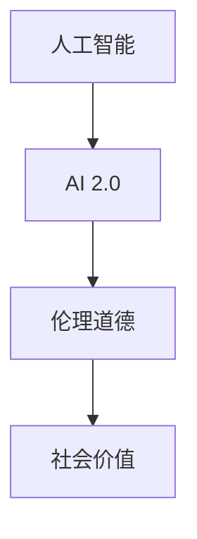

                 

# 李开复：AI 2.0 时代的社会价值

> 关键词：人工智能,社会价值,伦理道德,AI 2.0,创新创业,技术发展

## 1. 背景介绍

### 1.1 问题由来
随着人工智能(AI)技术的飞速发展，特别是深度学习、自然语言处理、计算机视觉等技术的突破，AI正从早期“人工智障”迈向“人工智能”，甚至向“超级智能”发展。AI 2.0时代，即AI技术的智能化、自动化和可扩展性不断提升的时期，正在深刻改变我们的社会结构、工作方式和生活习惯。

AI 2.0技术的广泛应用，不仅在医疗、金融、制造业等行业带来革命性的变化，也在教育、娱乐、社交等领域引发深远的变革。然而，AI技术的发展同样伴随着诸多伦理道德问题，如隐私泄露、算法偏见、决策透明度等，需要社会各界共同面对和解决。

李开复，作为全球知名的AI专家，对AI 2.0时代的技术发展和社会价值有着深刻的理解和见解。本文将通过李开复的视角，探讨AI 2.0技术在社会各领域的广泛应用及其带来的深远影响。

### 1.2 问题核心关键点
AI 2.0技术的应用和普及，在带来巨大社会效益的同时，也引发了诸多社会关注的问题：

- AI技术的智能化水平不断提升，对人类职业结构、劳动力市场、教育和培训等方面产生何种影响？
- AI技术的伦理道德问题，如隐私保护、决策透明、算法偏见等如何解决？
- AI技术在医疗、金融、安全等高风险领域的应用，如何确保其安全性和可靠性？
- AI技术的发展与传统行业如何融合，如何在提升效率的同时，减少对人类的冲击？

本文将深入分析AI 2.0技术在各个领域的应用及其社会价值，并探讨其在面临挑战时的应对策略。

## 2. 核心概念与联系

### 2.1 核心概念概述

为更好地理解AI 2.0技术的社会价值，本节将介绍几个密切相关的核心概念：

- **人工智能(Artificial Intelligence, AI)**：通过计算机程序模拟人类智能，解决复杂问题的技术。AI技术包括机器学习、深度学习、自然语言处理、计算机视觉等多个子领域。

- **AI 2.0**：指人工智能技术的智能化、自动化和可扩展性不断提升的时期。AI 2.0技术通过更强大的算法和大规模数据训练，实现更高效、更精确的决策和推理，应用于各个领域。

- **伦理道德(Ethics)**：在AI技术应用中，如何确保数据隐私、决策透明度、避免偏见和歧视等伦理问题。

- **社会价值(Social Value)**：AI 2.0技术在提升社会效率、改善生活质量、促进公平正义等方面的积极影响。

这些核心概念之间的逻辑关系可以通过以下Mermaid流程图来展示：



这个流程图展示了AI 2.0技术的核心概念及其之间的关系：

1. AI 2.0技术通过智能化、自动化和可扩展性的提升，发挥其社会价值。
2. 在AI 2.0技术应用中，需要解决伦理道德问题，如数据隐私、决策透明等。
3. 解决伦理道德问题，是为了更好地实现AI 2.0技术的社会价值。

## 3. 核心算法原理 & 具体操作步骤

### 3.1 算法原理概述

AI 2.0技术的核心算法原理，主要包括深度学习、迁移学习和强化学习等。这些算法通过在大规模数据上训练模型，使其具备一定的智能推理和决策能力。

- **深度学习(Deep Learning)**：通过多层神经网络模型，对数据进行特征提取和决策。深度学习模型通常包括卷积神经网络(CNN)、循环神经网络(RNN)和Transformer等结构。

- **迁移学习(Transfer Learning)**：利用已训练好的模型在特定任务上进行微调，提升模型在新任务上的性能。迁移学习可以大大降低训练成本，加速模型开发。

- **强化学习(Reinforcement Learning, RL)**：通过模拟环境中的奖励和惩罚，训练智能体执行最优决策。强化学习广泛应用于游戏AI、自动驾驶等场景。

### 3.2 算法步骤详解

AI 2.0技术的算法步骤一般包括以下几个关键步骤：

**Step 1: 数据收集与预处理**
- 收集训练数据，包括图像、文本、语音等多种类型的数据。
- 对数据进行清洗、标注和预处理，以便于模型训练。

**Step 2: 模型设计**
- 选择或设计合适的神经网络结构，如卷积神经网络、循环神经网络、Transformer等。
- 确定模型的损失函数、优化器和正则化策略，以便于模型训练。

**Step 3: 模型训练**
- 使用深度学习框架（如TensorFlow、PyTorch等）对模型进行训练。
- 利用大规模数据集进行训练，调整模型参数，优化损失函数。
- 使用验证集评估模型性能，防止过拟合。

**Step 4: 模型微调**
- 在特定任务上对模型进行微调，提升模型在该任务上的性能。
- 微调通常使用迁移学习，利用已有模型进行小规模训练。

**Step 5: 模型部署**
- 将训练好的模型部署到生产环境中，供实际应用使用。
- 提供API接口或SDK库，方便开发者集成调用。

**Step 6: 模型评估与优化**
- 在实际应用场景中评估模型性能，收集反馈数据。
- 根据反馈数据调整模型参数，优化模型性能。

### 3.3 算法优缺点

AI 2.0技术的算法具有以下优点：

- **高效性**：AI 2.0技术能够在大规模数据上高效训练模型，加速问题解决。
- **广泛适用性**：AI 2.0技术可以应用于各个领域，包括医疗、金融、制造等。
- **可扩展性**：AI 2.0技术具有良好的可扩展性，可以根据需求灵活调整模型结构。

然而，AI 2.0技术也存在一定的局限性：

- **数据依赖性**：AI 2.0技术依赖大规模高质量数据进行训练，数据获取成本较高。
- **模型复杂性**：AI 2.0模型结构复杂，需要较高计算资源和专业知识。
- **算法黑箱**：AI 2.0模型往往难以解释其决策过程，难以保证决策透明性和可解释性。

### 3.4 算法应用领域

AI 2.0技术在各个领域的应用广泛且深入，具体包括：

- **医疗健康**：AI 2.0技术用于疾病诊断、基因分析、药物研发等，显著提升医疗效率和准确性。
- **金融行业**：AI 2.0技术用于信用评估、风险管理、投资分析等，优化金融决策和风险控制。
- **制造业**：AI 2.0技术用于质量控制、生产优化、智能制造等，提高生产效率和产品质量。
- **教育领域**：AI 2.0技术用于个性化教育、学习分析、智能辅助等，提升教育质量和个性化教学。
- **娱乐产业**：AI 2.0技术用于内容推荐、情感分析、智能交互等，提升用户体验和互动性。

## 4. 数学模型和公式 & 详细讲解 & 举例说明

### 4.1 数学模型构建

AI 2.0技术的数学模型构建，通常涉及深度学习中的神经网络结构和优化算法。以卷积神经网络(CNN)为例，其基本模型结构如下：

$$
y = \sigma(\sum_{i=1}^{n}w_i x_i + b)
$$

其中 $y$ 为输出结果，$x_i$ 为输入特征，$w_i$ 为权重参数，$b$ 为偏置项，$\sigma$ 为激活函数。

### 4.2 公式推导过程

以卷积神经网络为例，其前向传播和反向传播过程如下：

**前向传播**：

$$
y = \sigma(\sum_{i=1}^{n}w_i x_i + b)
$$

**反向传播**：

$$
\frac{\partial L}{\partial w} = \frac{\partial L}{\partial y} \frac{\partial y}{\partial z} \frac{\partial z}{\partial w}
$$

其中 $L$ 为损失函数，$z$ 为中间变量。

### 4.3 案例分析与讲解

以图像分类任务为例，假设输入图像大小为 $28 \times 28$，卷积层大小为 $3 \times 3$，特征图大小为 $16 \times 16$，则其卷积运算的过程如下：

- **卷积运算**：
$$
z_{i,j} = \sum_{m=0}^{2} \sum_{n=0}^{2} x_{(i+m),(j+n)} \cdot w_{m,n}
$$

- **池化运算**：
$$
z'_{i,j} = \max(z_{i,j}, z_{i+1,j}, z_{i,j+1}, z_{i+1,j+1})
$$

通过多层卷积和池化操作，可以得到特征图 $z'$，进而输入全连接层进行分类。

## 5. 项目实践：代码实例和详细解释说明

### 5.1 开发环境搭建

在进行AI 2.0项目开发前，我们需要准备好开发环境。以下是使用Python进行TensorFlow开发的环境配置流程：

1. 安装Anaconda：从官网下载并安装Anaconda，用于创建独立的Python环境。

2. 创建并激活虚拟环境：
```bash
conda create -n tf-env python=3.7
conda activate tf-env
```

3. 安装TensorFlow：根据CUDA版本，从官网获取对应的安装命令。例如：
```bash
conda install tensorflow -c pytorch -c conda-forge
```

4. 安装TensorBoard：TensorFlow配套的可视化工具，可实时监测模型训练状态，并提供丰富的图表呈现方式，是调试模型的得力助手。
```bash
pip install tensorboard
```

5. 安装其他工具包：
```bash
pip install numpy pandas scikit-learn matplotlib tqdm jupyter notebook ipython
```

完成上述步骤后，即可在`tf-env`环境中开始AI 2.0项目开发。

### 5.2 源代码详细实现

以下是使用TensorFlow进行图像分类任务的代码实现。

```python
import tensorflow as tf
from tensorflow.keras import layers, models

# 定义卷积神经网络模型
model = models.Sequential()
model.add(layers.Conv2D(32, (3, 3), activation='relu', input_shape=(28, 28, 1)))
model.add(layers.MaxPooling2D((2, 2)))
model.add(layers.Conv2D(64, (3, 3), activation='relu'))
model.add(layers.MaxPooling2D((2, 2)))
model.add(layers.Conv2D(64, (3, 3), activation='relu'))
model.add(layers.Flatten())
model.add(layers.Dense(64, activation='relu'))
model.add(layers.Dense(10))

# 编译模型
model.compile(optimizer='adam', loss=tf.keras.losses.SparseCategoricalCrossentropy(from_logits=True), metrics=['accuracy'])

# 训练模型
model.fit(train_images, train_labels, epochs=10, validation_data=(test_images, test_labels))
```

### 5.3 代码解读与分析

让我们再详细解读一下关键代码的实现细节：

**定义卷积神经网络模型**：
- 使用`Sequential`模型构建卷积神经网络，依次添加卷积层、池化层和全连接层。
- `Conv2D`用于定义卷积层，`MaxPooling2D`用于定义池化层，`Flatten`用于将特征图展平，`Dense`用于定义全连接层。

**编译模型**：
- 使用`compile`方法编译模型，指定优化器、损失函数和评估指标。

**训练模型**：
- 使用`fit`方法训练模型，指定训练集、验证集和训练轮数。

**测试模型**：
- 在测试集上评估模型性能，使用`evaluate`方法计算模型精度和损失。

**部署模型**：
- 使用`save`方法将模型保存为`.h5`格式，供实际应用使用。
- 使用`load_model`方法加载模型，供预测使用。

## 6. 实际应用场景

### 6.1 医疗影像诊断

AI 2.0技术在医疗影像诊断中应用广泛。通过深度学习模型，AI 2.0系统可以自动分析医学影像，辅助医生进行疾病诊断。例如，卷积神经网络模型能够自动识别X光片、CT扫描和MRI图像中的异常区域，提高诊断效率和准确性。

### 6.2 智能客服

AI 2.0技术在智能客服中也有广泛应用。通过自然语言处理模型，AI 2.0系统可以自动理解用户咨询，提供快速准确的响应。例如，Transformer模型能够理解自然语言语义，生成符合语法和语境的回复，提升客户满意度。

### 6.3 金融风险管理

AI 2.0技术在金融风险管理中具有重要应用。通过机器学习模型，AI 2.0系统可以自动分析市场数据，预测风险变化趋势，帮助金融机构制定风险管理策略。例如，LSTM模型能够处理时间序列数据，预测股票价格波动，提升风险控制能力。

## 7. 工具和资源推荐

### 7.1 学习资源推荐

为了帮助开发者系统掌握AI 2.0技术的理论基础和实践技巧，这里推荐一些优质的学习资源：

1. 《深度学习》系列课程：由吴恩达教授主讲的深度学习课程，涵盖深度学习的基本概念和应用，是入门深度学习的重要资源。
2. TensorFlow官方文档：TensorFlow的官方文档，提供了详尽的API文档和示例代码，是学习和实践AI 2.0技术的重要参考。
3. GitHub开源项目：GitHub上的开源项目，展示了实际应用的AI 2.0模型，可供参考和借鉴。
4. AI 2.0书籍：《AI Superpowers》等书籍，详细介绍了AI 2.0技术的应用和前景，是了解AI 2.0技术的重要读物。

通过对这些资源的学习实践，相信你一定能够快速掌握AI 2.0技术的精髓，并用于解决实际的NLP问题。

### 7.2 开发工具推荐

高效的开发离不开优秀的工具支持。以下是几款用于AI 2.0项目开发的常用工具：

1. TensorFlow：由Google主导开发的深度学习框架，生产部署方便，适合大规模工程应用。

2. PyTorch：基于Python的开源深度学习框架，灵活高效的计算图，适合快速迭代研究。

3. Jupyter Notebook：交互式的Python编程环境，支持代码运行、数据可视化等功能，是数据科学和机器学习项目开发的好助手。

4. Keras：基于TensorFlow的高级深度学习框架，提供了简单易用的API接口，适合快速搭建模型和实验。

5. HuggingFace Transformers：自然语言处理工具库，集成了众多预训练语言模型，支持PyTorch和TensorFlow，是进行NLP任务开发的利器。

6. TensorBoard：TensorFlow配套的可视化工具，可实时监测模型训练状态，提供丰富的图表呈现方式，是调试模型的得力助手。

### 7.3 相关论文推荐

AI 2.0技术的发展源于学界的持续研究。以下是几篇奠基性的相关论文，推荐阅读：

1. AlexNet: ImageNet Classification with Deep Convolutional Neural Networks：提出卷积神经网络模型，在ImageNet数据集上取得优异表现。

2. Google's Deep Learning for Self-Driving Cars：介绍谷歌在自动驾驶领域的深度学习应用，展示AI 2.0技术在实际场景中的应用。

3. DeepMind's AlphaGo Zero：介绍AlphaGo Zero在围棋领域的胜利，展示了AI 2.0技术在复杂决策问题上的应用。

4. FastAI：基于PyTorch的深度学习框架，提供了简单易用的API接口，支持快速搭建和训练深度学习模型。

5. OpenAI Codex：OpenAI发布的代码生成模型，展示了AI 2.0技术在程序自动生成中的应用。

这些论文代表了大规模深度学习技术的发展脉络，通过学习这些前沿成果，可以帮助研究者把握学科前进方向，激发更多的创新灵感。

## 8. 总结：未来发展趋势与挑战

### 8.1 研究成果总结

AI 2.0技术在医疗、金融、制造业等领域取得了显著的成果，极大提升了效率和准确性。然而，AI 2.0技术的应用仍面临诸多挑战，如伦理道德问题、数据隐私保护、决策透明性等。如何平衡技术进步和社会责任，是未来AI 2.0技术发展的关键。

### 8.2 未来发展趋势

AI 2.0技术未来发展趋势包括：

1. **智能化程度提升**：随着算力、数据和算法的发展，AI 2.0技术的智能化水平将不断提升，能够处理更复杂、更抽象的任务。

2. **自动化程度提升**：AI 2.0技术的自动化水平将进一步提高，能够自动完成数据处理、模型训练和优化等任务，降低人工干预的难度。

3. **跨领域融合**：AI 2.0技术将在更多领域实现跨学科融合，如医疗与生物、金融与经济、制造与设计等，带来更多创新应用。

4. **伦理道德重视**：未来AI 2.0技术的发展将更加重视伦理道德问题，确保数据隐私、决策透明和公平正义。

5. **开放共享**：未来AI 2.0技术的开源共享将更加普遍，推动AI技术的普及和应用，造福全人类。

### 8.3 面临的挑战

尽管AI 2.0技术已经取得了显著成果，但在迈向更加智能化、普适化应用的过程中，仍面临诸多挑战：

1. **数据获取成本高**：大规模高质量数据的获取成本较高，如何降低数据获取成本，是未来AI 2.0技术发展的重要方向。

2. **模型复杂度高**：AI 2.0模型的复杂度不断提升，如何简化模型结构，提高模型的可解释性，是未来AI 2.0技术需要解决的重要问题。

3. **伦理道德问题**：AI 2.0技术的应用可能带来伦理道德问题，如何确保数据隐私、决策透明和公平正义，是未来AI 2.0技术需要重视的问题。

4. **算力资源需求高**：AI 2.0技术对算力资源的需求较高，如何优化资源配置，降低算力成本，是未来AI 2.0技术需要解决的重要问题。

5. **安全性问题**：AI 2.0技术的应用可能带来安全性问题，如何确保模型的鲁棒性和安全性，是未来AI 2.0技术需要解决的重要问题。

### 8.4 研究展望

未来的AI 2.0技术研究需要从以下几个方向寻求突破：

1. **跨学科融合**：将AI 2.0技术与大数据、物联网、区块链等技术结合，实现跨学科融合，推动更多创新应用。

2. **自动化优化**：开发自动化的模型优化工具，如自动化超参数调优、自动化模型压缩等，提高模型开发效率。

3. **伦理道德保障**：在AI 2.0技术开发和应用中，引入伦理道德评估指标，确保数据隐私、决策透明和公平正义。

4. **开放共享机制**：建立AI 2.0技术的开放共享机制，推动AI技术普及，造福全人类。

5. **人机协同**：推动人机协同的研究，建立智能系统的监管机制，确保AI系统的安全和可靠性。

6. **跨模态融合**：将AI 2.0技术与多模态数据结合，如图像、语音、文本等，提升AI系统的感知能力和决策能力。

这些研究方向的探索，将推动AI 2.0技术的发展，为社会带来更多正能量。

## 9. 附录：常见问题与解答

**Q1：AI 2.0技术的应用范围有哪些？**

A: AI 2.0技术在医疗、金融、制造业、教育、娱乐等领域均有广泛应用。在医疗领域，AI 2.0技术可以辅助医生进行疾病诊断和手术规划；在金融领域，AI 2.0技术可以优化投资分析和风险管理；在制造业领域，AI 2.0技术可以提升生产效率和产品质量；在教育领域，AI 2.0技术可以进行个性化教育和智能辅助；在娱乐领域，AI 2.0技术可以进行内容推荐和情感分析。

**Q2：AI 2.0技术如何确保数据隐私和伦理道德？**

A: AI 2.0技术在应用过程中，需要引入隐私保护和伦理道德的评估机制。例如，数据去匿名化、差分隐私保护等技术可以确保数据隐私；透明决策、算法可解释性等机制可以提升决策透明度；公平性约束、算法偏见检测等技术可以避免算法偏见和歧视。

**Q3：AI 2.0技术的未来发展趋势是什么？**

A: AI 2.0技术的未来发展趋势包括智能化程度提升、自动化程度提升、跨领域融合、伦理道德重视、开放共享等。随着算力、数据和算法的发展，AI 2.0技术的智能化水平将不断提升；自动化水平将进一步提高；跨领域融合将带来更多创新应用；伦理道德问题将得到更多重视；开放共享机制将推动AI技术普及。

**Q4：AI 2.0技术的局限性有哪些？**

A: AI 2.0技术的局限性包括数据获取成本高、模型复杂度高、伦理道德问题、算力资源需求高、安全性问题等。大规模高质量数据的获取成本较高；模型复杂度不断提升；伦理道德问题需要更多重视；算力资源需求较高；安全性问题需要更多保障。

---

作者：禅与计算机程序设计艺术 / Zen and the Art of Computer Programming

